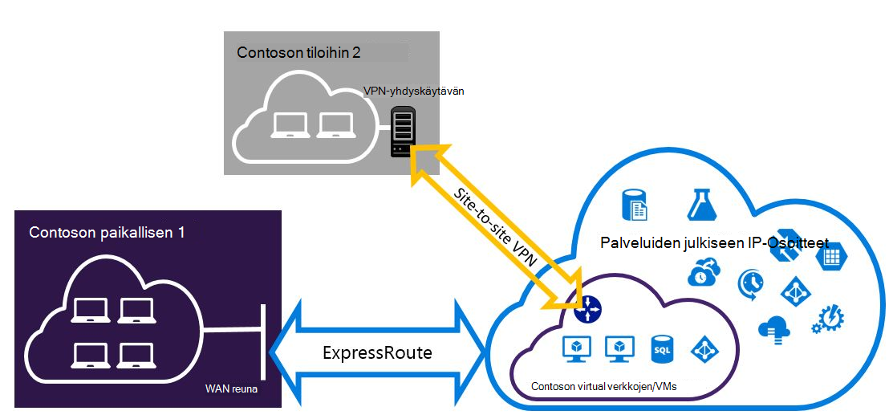

<properties
   pageTitle="Määritä Expressroute ja sivuston sivuston VPN-yhteydet, jotka voivat olla Resurssienhallinta käyttöönoton mallin | Microsoft Azure"
   description="Tässä artikkelissa käydään läpi ExpressRoute ja sivusto VPN-yhteyden, jotka voivat olla Resurssienhallinta mallin määrittäminen."
   documentationCenter="na"
   services="expressroute"
   authors="charwen"
   manager="carmonm"
   editor=""
   tags="azure-resource-manager"/>
<tags
   ms.service="expressroute"
   ms.devlang="na"
   ms.topic="get-started-article"
   ms.tgt_pltfrm="na"
   ms.workload="infrastructure-services"
   ms.date="10/10/2016"
   ms.author="charleywen"/>

# Määritä ExpressRoute ja sivuston sivuston samanaikaisesti olemassa olevien yhteydet resurssien hallinnan käyttöönottomalli

> [AZURE.SELECTOR]
- [PowerShell - resurssien hallinta](expressroute-howto-coexist-resource-manager.md)
- [PowerShell – perinteinen](expressroute-howto-coexist-classic.md)

Määritä sivusto sivusto VPN- ja ExpressRoute voi ottaa on monia etuja. Voit määrittää sivuston sivuston VPN ExressRoute kuin suojatun automaattisesti polku tai sivustot ja jotka eivät ole yhteydessä ExpressRoute muodostaa sivuston sivuston VPN-yhteydet avulla. Käsiteltävät aiheet määrittäminen molempia tämän artikkelin ohjeita. Tämä artikkeli koskee resurssien hallinnan käyttöönottomalli. Tämä määritys ei ole käytettävissä Azure-portaalissa.

**Tietoja malleista Azure käyttöönotto**

[AZURE.INCLUDE [vpn-gateway-clasic-rm](../../includes/vpn-gateway-classic-rm-include.md)] 

>[AZURE.IMPORTANT] ExpressRoute piirit on määritettävä valmiiksi, ennen kuin noudattamalla seuraavia ohjeita. Varmista, että olet noudattanut [ExpressRoute piiri luominen](expressroute-howto-circuit-arm.md) ja [määrittäminen reititys](expressroute-howto-routing-arm.md) apuviivoihin ennen noudattamalla seuraavia ohjeita.

## Rajat ja rajoitukset

- **Salataanko siirrettävät reititys ei tueta.** Et voi reitittää (joko Azure) kuin paikalliseen verkkoon kirjauduttaessa sivusto sivusto VPN-verkon kautta liitetyn ja paikallisen verkon kautta ExpressRoute liitetyn välillä.
- **Perustiedot SKU yhdyskäytävä ei tueta.** Sinun on käytettävä ei - Basic SKU yhdyskäytävän [ExpressRoute yhdyskäytävän](expressroute-about-virtual-network-gateways.md) ja [VPN-yhdyskäytävän](../vpn-gateway/vpn-gateway-about-vpngateways.md).
- **Reititys-pohjainen VPN yhdyskäytävän vain tuetaan.** Sinun on käytettävä reitti-pohjainen [VPN-yhdyskäytävän](../vpn-gateway/vpn-gateway-about-vpngateways.md).
- **Staattisen reitin on määritetty VPN-yhdyskäytävä.** Jos kuin paikalliseen verkkoon kirjauduttaessa on yhdistetty ExpressRoute ja sivusto VPN-yhteyttä, sinulla on määritetty reitittämään julkinen Internet-sivusto sivusto VPN-yhteyden lähiverkossa staattisen reitin.
- **ExpressRoute yhdyskäytävä on määritettävä ensin.** Sinun on luotava ExpressRoute yhdyskäytävän ensimmäisen kerran, ennen kuin lisäät sivuston sivuston VPN-yhdyskäytävä.

## Rakenteen määritys

### Määrittää sivuston sivuston VPN automaattisesti polku ExpressRoute varten

Voit määrittää sivuston sivuston VPN-yhteyden varmuuskopioina ExpressRoute varten. Tämä koskee vain virtual verkkojen linkitetty Azure yksityinen peering polku. Azure julkinen ja Microsoft peerings kautta on services ei ole VPN-pohjainen automaattisesti ratkaisu. ExpressRoute piiri on aina ensisijainen linkki. Tietoja juoksuttaa sivusto sivusto VPN avulla vain, jos ExpressRoute piiri epäonnistuu.
>[AZURE.NOTE] Kun ExpressRoute piiri on prefered sivusto sivusto VPN-verkon kautta, kun molemmat tiet ovat samat, Azure käyttämällä longuest etuliite vastine Valitse reitti paketin kohteen kohti.

### Sivustoille tarkasteltaviksi kautta ExpressRoute sivusto sivusto VPN-yhteyden määrittäminen

Voit määrittää verkoston missä Jotkin sivustot yhdistäminen suoraan Azure sivusto sivusto VPN-verkon kautta, ja Jotkin sivustot muodostaa ExpressRoute kautta. 

>[AZURE.NOTE] Et voi virtual verkon määrittäminen salataanko siirrettävät reitittimen nimellä.

## Ohjeet, joiden avulla valitseminen

Kahden eri tiedostojoukot toimenpiteistä, jotta voit määrittää yhteydet, jotka voivat olla valittavana on. Onko sinulla aiemmin virtual verkkoon, jossa haluat muodostaa yhteyden, tai haluat luoda uuden virtual verkon riippuu määritysten kuvatulla tavalla, joka valitaan.

- Voin ei ole VNet ja on luotava.
    
    Jos sinulla ei vielä ole virtual verkko-toiminto edetään ohjatusti luominen uuden virtual verkon resurssien hallinnan käyttöönottomalli käyttämisestä ja luomisesta uuden ExpressRoute ja sivuston sivusto-VPN-yhteydet. Määritä [Luo uusi virtual verkko- ja samanaikaisesti olemassa olevien](#new)artikkelissa-osion ohjeita noudattamalla.

- Resurssien hallinnan käyttöönottomalli VNet on jo.

    Virtual verkon saattaa on jo olemassa olevan sivuston sivuston VPN-yhteyden tai ExpressRoute yhteyden paikassa. [Aiemmin luodusta VNet coexsiting yhteyksien määrittäminen](#add) -osassa käy läpi poistaminen yhdyskäytävän ja luomalla uuden ExpressRoute ja sivuston sivusto-VPN-yhteydet. Huomaa, että luotaessa uusia yhteyksiä vaiheet on suoritettava hyvin tietyssä järjestyksessä. Älä käytä ohjeita muita artikkeleita yhdyskäytävät ja yhteydet.

    Tässä toimintosarjassa yhteyksiä, jotka voivat olla edellyttää, että käyttämäsi yhdyskäytävän poistaminen ja määritä sitten uusia yhdyskäytäviä. Tämä tarkoittaa sitä, voit hallita käyttökatkot paikallisen-yhteyksien poistaminen ja luo yhdyskäytävä ja yhteyksiä, mutta sinun ei tarvitse siirtää VMs tai palvelujen uuden virtual verkon. VMs ja palvelujen edelleen saa oikeuden tiedonvälitys ulos kuormituksen samalla, kun määrität käyttämäsi yhdyskäytävän, jos ne on määritetty tekemään niin.

## Voit luoda uuden virtual verkko- ja samanaikaisesti olemassa olevien

Tämä toiminto opastusta luomisesta VNet ja luo sivusto ja ExpressRoute yhteydet, jotka olla.
    
1. Tarvitset Azure PowerShellin cmdlet-komennot uusimman version asentaminen. Katso, [miten voit asentaa ja määrittää PowerShellin Azure](../powershell-install-configure.md) lisätietoja asentaminen PowerShellin cmdlet-komennot. Huomaa, että cmdlet-komennot, jotka määritysten käytät voi olla hieman erilainen kuin mitä ehkä tottunut. Muista käyttää Cmdlet-komentoja määritetty näissä ohjeissa.

2. Kirjaudu sisään tilille ja ympäristön määrittäminen.
    
        login-AzureRmAccount
        Select-AzureRmSubscription -SubscriptionName 'yoursubscription'
        $location = "Central US"
        $resgrp = New-AzureRmResourceGroup -Name "ErVpnCoex" -Location $location

3. Luo virtuaalisia verkko mukaan lukien yhdyskäytävän aliverkon. Saat lisätietoja VPN-määritys [Azure Virtual verkon määritys](../virtual-network/virtual-networks-create-vnet-arm-ps.md).

    >[AZURE.IMPORTANT] Yhdyskäytävä-osoitteiden on oltava /27 tai lyhentää etuliite (esimerkiksi /26 tai /25).
    
    Luo uusi VNet.

        $vnet = New-AzureRmVirtualNetwork -Name "CoexVnet" -ResourceGroupName $resgrp.ResourceGroupName -Location $location -AddressPrefix "10.200.0.0/16" 

    Lisää aliverkosta.

        Add-AzureRmVirtualNetworkSubnetConfig -Name "App" -VirtualNetwork $vnet -AddressPrefix "10.200.1.0/24"
        Add-AzureRmVirtualNetworkSubnetConfig -Name "GatewaySubnet" -VirtualNetwork $vnet -AddressPrefix "10.200.255.0/24"

    Tallenna VNet-määritys.

        $vnet = Set-AzureRmVirtualNetwork -VirtualNetwork $vnet

4. Luo ExpressRoute-yhdyskäytävä. Saat lisätietoja ExpressRoute yhdyskäytävän määritykset [ExpressRoute yhdyskäytävän määritykset](expressroute-howto-add-gateway-resource-manager.md). GatewaySKU on oltava *Vakio*, *korkean*tai *UltraPerformance*.

        $gwSubnet = Get-AzureRmVirtualNetworkSubnetConfig -Name "GatewaySubnet" -VirtualNetwork $vnet
        $gwIP = New-AzureRmPublicIpAddress -Name "ERGatewayIP" -ResourceGroupName $resgrp.ResourceGroupName -Location $location -AllocationMethod Dynamic
        $gwConfig = New-AzureRmVirtualNetworkGatewayIpConfig -Name "ERGatewayIpConfig" -SubnetId $gwSubnet.Id -PublicIpAddressId $gwIP.Id
        $gw = New-AzureRmVirtualNetworkGateway -Name "ERGateway" -ResourceGroupName $resgrp.ResourceGroupName -Location $location -IpConfigurations $gwConfig -GatewayType "ExpressRoute" -GatewaySku Standard 

5. Linkki ExpressRoute virtapiirin ExpressRoute yhdyskäytävä. Kun tämä vaihe on valmis, välillä paikallisen verkko- ja Azure kautta ExpressRoute, yhteys on muodostettu. Saat lisätietoja linkittämisen [Linkki VNets ExpressRoute avulla](expressroute-howto-linkvnet-arm.md).

        $ckt = Get-AzureRmExpressRouteCircuit -Name "YourCircuit" -ResourceGroupName "YourCircuitResourceGroup"
        New-AzureRmVirtualNetworkGatewayConnection -Name "ERConnection" -ResourceGroupName $resgrp.ResourceGroupName -Location $location -VirtualNetworkGateway1 $gw -PeerId $ckt.Id -ConnectionType ExpressRoute

6. Luo sivusto VPN-yhdyskäytävän seuraavaksi. Saat lisätietoja VPN-yhdyskäytävä-määritys [VNet sivusto yhteyden määrittäminen](../vpn-gateway/vpn-gateway-create-site-to-site-rm-powershell.md). GatewaySKU on oltava *Vakio*, *korkean*tai *UltraPerformance*. VpnType on *RouteBased*.

        $gwSubnet = Get-AzureRmVirtualNetworkSubnetConfig -Name "GatewaySubnet" -VirtualNetwork $vnet
        $gwIP = New-AzureRmPublicIpAddress -Name "VPNGatewayIP" -ResourceGroupName $resgrp.ResourceGroupName -Location $location -AllocationMethod Dynamic
        $gwConfig = New-AzureRmVirtualNetworkGatewayIpConfig -Name "VPNGatewayIpConfig" -SubnetId $gwSubnet.Id -PublicIpAddressId $gwIP.Id
        New-AzureRmVirtualNetworkGateway -Name "VPNGateway" -ResourceGroupName $resgrp.ResourceGroupName -Location $location -IpConfigurations $gwConfig -GatewayType "Vpn" -VpnType "RouteBased" -GatewaySku "Standard"

    Azure VPN-yhdyskäytävän tukee erityisen. Voit määrittää - EnableBgp seuraava komento.

        $azureVpn = New-AzureRmVirtualNetworkGateway -Name "VPNGateway" -ResourceGroupName $resgrp.ResourceGroupName -Location $location -IpConfigurations $gwConfig -GatewayType "Vpn" -VpnType "RouteBased" -GatewaySku "Standard" -EnableBgp $true

    Voit etsiä erityisen peering IP- ja Azure $azureVpn.BgpSettings.BgpPeeringAddress ja $azureVpn.BgpSettings.Asn VPN-yhdyskäytävän käyttämä liitetään numero. Lisätietoja [Määrittäminen erityisen](../vpn-gateway/vpn-gateway-bgp-resource-manager-ps.md) Azure VPN Gatewayn.

7. Voit luoda paikallisen sivuston VPN yhdyskäytävän kohteen. Tämä komento ei määrittää paikallisen VPN-yhdyskäytävän. Sen sijaan se voit antaa paikallisen yhdyskäytävän asetuksia, kuten julkiseen IP-osoite ja paikallisen osoite tila, niin, että Azure VPN-yhdyskäytävän voit muodostaa yhteyden.

    Jos paikallisen VPN-laitteen tukee vain staattiset reititys, voit määrittää staattiset tiet alla kuvatulla tavalla.

        $MyLocalNetworkAddress = @("10.100.0.0/16","10.101.0.0/16","10.102.0.0/16")
        $localVpn = New-AzureRmLocalNetworkGateway -Name "LocalVPNGateway" -ResourceGroupName $resgrp.ResourceGroupName -Location $location -GatewayIpAddress *<Public IP>* -AddressPrefix $MyLocalNetworkAddress

    Jos haluat ottaa käyttöön dynaaminen reititys paikallisen VPN-laitteesi tukee erityisen, on tiedettävä erityisen peering IP- ja paikallisen VPN-laitteen käyttämä liitetään numero.

        $localVPNPublicIP = "<Public IP>"
        $localBGPPeeringIP = "<Private IP for the BGP session>"
        $localBGPASN = "<ASN>"
        $localAddressPrefix = $localBGPPeeringIP + "/32"
        $localVpn = New-AzureRmLocalNetworkGateway -Name "LocalVPNGateway" -ResourceGroupName $resgrp.ResourceGroupName -Location $location -GatewayIpAddress $localVPNPublicIP -AddressPrefix $localAddressPrefix -BgpPeeringAddress $localBGPPeeringIP -Asn $localBGPASN

8. Määrittää paikallisen VPN-laitteen muodostaa uusi Azure VPN-yhdyskäytävä. Saat lisätietoja VPN-laitteen määrittäminen [VPN-laitteen määrittäminen](../vpn-gateway/vpn-gateway-about-vpn-devices.md).

9. Linkki Azure-sivusto sivusto VPN-yhdyskäytävän paikallisen yhdyskäytävän.

        $azureVpn = Get-AzureRmVirtualNetworkGateway -Name "VPNGateway" -ResourceGroupName $resgrp.ResourceGroupName
        New-AzureRmVirtualNetworkGatewayConnection -Name "VPNConnection" -ResourceGroupName $resgrp.ResourceGroupName -Location $location -VirtualNetworkGateway1 $azureVpn -LocalNetworkGateway2 $localVpn -ConnectionType IPsec -SharedKey <yourkey>

## Voit määrittää aiemmin luodusta VNet coexsiting yhteydet

Jos sinulla on aiemmin virtual verkkoon, tarkista yhdyskäytävän aliverkon koko. Jos aliverkon yhdyskäytävä on /28 tai /29, poista VPN-yhdyskäytävän ensin ja suurentaa yhdyskäytävän aliverkon. Tässä jaksossa kerrotaan, miten voit tehdä sen.

Jos aliverkon yhdyskäytävä on /27 tai suurempi ja virtual verkko on yhdistetty ExpressRoute kautta, voit ohittaa alla kuvatulla tavalla ja siirry ["Vaihe 6 – Luo sivusto VPN-yhdyskäytävän"](#vpngw) edellisessä osassa. 

>[AZURE.NOTE] Kun poistat aiemmin yhdyskäytävän, paikallinen paikallisen menetetään virtual verkon yhteys määritysten työskentelyn aikana. 

1. Tarvitset Azure PowerShellin cmdlet-komennot uusimman version asentaminen. Katso, [miten voit asentaa ja määrittää PowerShellin Azure](../powershell-install-configure.md) lisätietoja asentaminen PowerShellin cmdlet-komennot. Huomaa, että cmdlet-komennot, jotka määritysten käytät voi olla hieman erilainen kuin mitä ehkä tottunut. Muista käyttää Cmdlet-komentoja määritetty näissä ohjeissa. 

2. Poista aiemmin ExpressRoute tai sivuston sivuston VPN-yhdyskäytävä. 

        Remove-AzureRmVirtualNetworkGateway -Name <yourgatewayname> -ResourceGroupName <yourresourcegroup>

3. Poista yhdyskäytävä aliverkon.
        
        $vnet = Get-AzureRmVirtualNetwork -Name <yourvnetname> -ResourceGroupName <yourresourcegroup> 
        Remove-AzureRmVirtualNetworkSubnetConfig -Name GatewaySubnet -VirtualNetwork $vnet

4. Lisää yhdyskäytävän aliverkon, joka on /27 tai suurempi.
    >[AZURE.NOTE] Sinulla ei ole tarpeeksi IP-osoitteiden virtual verkon yhdyskäytävän aliverkon suurentaa vasemmalle, jos haluat lisätä IP-osoitetilaa.

        $vnet = Get-AzureRmVirtualNetwork -Name <yourvnetname> -ResourceGroupName <yourresourcegroup>
        Add-AzureRmVirtualNetworkSubnetConfig -Name "GatewaySubnet" -VirtualNetwork $vnet -AddressPrefix "10.200.255.0/24"

    Tallenna VNet-määritys.

        $vnet = Set-AzureRmVirtualNetwork -VirtualNetwork $vnet

5. Tässä vaiheessa on VNet ei ole yhdyskäytävien kanssa. Luo uusi yhdyskäytävien ja viimeistele yhteyksiisi, voit jatkaa [Vaihe 4 – Luo ExpressRoute yhdyskäytävän](#gw)edellisen toimintaohjeiden löytyvät.

## Voit lisätä piste sivuston määritysten VPN-yhdyskäytävän
Voit noudattaa ohjeita kohdassa sivuston määritysten lisääminen VPN-yhdyskäytävän rinnakkainen asetuksissa.

1. Lisää VPN-asiakkaan osoitteen resurssivarantoon. 

        $azureVpn = Get-AzureRmVirtualNetworkGateway -Name "VPNGateway" -ResourceGroupName $resgrp.ResourceGroupName
        Set-AzureRmVirtualNetworkGatewayVpnClientConfig -VirtualNetworkGateway $azureVpn -VpnClientAddressPool "10.251.251.0/24"

2. Lataa VPN-pääkansio varmenteen Azure VPN-Gatewayn. Tässä esimerkissä oletetaan, että pääkansio varmenne on tallennettu paikallisessa tietokoneessa, jossa PowerShellin cmdlet-komennot suoritetaan. 

        $p2sCertFullName = "RootErVpnCoexP2S.cer"
        $p2sCertMatchName = "RootErVpnCoexP2S"
        $p2sCertToUpload=get-childitem Cert:\CurrentUser\My | Where-Object {$_.Subject -match $p2sCertMatchName}
        if ($p2sCertToUpload.count -eq 1){
            write-host "cert found"
        } else {
            write-host "cert not found"
            exit
        } 
        $p2sCertData = [System.Convert]::ToBase64String($p2sCertToUpload.RawData)
        Add-AzureRmVpnClientRootCertificate -VpnClientRootCertificateName $p2sCertFullName -VirtualNetworkGatewayname $azureVpn.Name -ResourceGroupName $resgrp.ResourceGroupName -PublicCertData $p2sCertData

Katso lisätietoja VPN-kohdassa sivuston- [kohdassa sivuston yhteyden määrittäminen](../vpn-gateway/vpn-gateway-howto-point-to-site-rm-ps.md).

## Seuraavat vaiheet

Saat lisätietoja ExpressRoute [ExpressRoute usein kysytyt kysymykset](expressroute-faqs.md).
