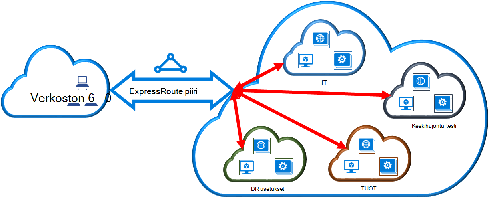

<properties 
   pageTitle="Linkki virtual verkon ExpressRoute piiri PowerShellin avulla | Microsoft Azure"
   description="Tässä asiakirjassa on yleiskatsaus siitä, miten virtual verkkojen (VNets) ExpressRoute piirit resurssien hallinnan käyttöönottomalli ja PowerShellin avulla."
   services="expressroute"
   documentationCenter="na"
   authors="ganesr"
   manager="carmonm"
   editor=""
   tags="azure-resource-manager"/>
<tags 
   ms.service="expressroute"
   ms.devlang="na"
   ms.topic="article"
   ms.tgt_pltfrm="na"
   ms.workload="infrastructure-services"
   ms.date="10/10/2016"
   ms.author="ganesr" />

# Linkki virtual verkon ExpressRoute piiri

> [AZURE.SELECTOR]
- [Azure Portal - resurssien hallinta](expressroute-howto-linkvnet-portal-resource-manager.md)
- [PowerShell - resurssien hallinta](expressroute-howto-linkvnet-arm.md)
- [PowerShell – perinteinen](expressroute-howto-linkvnet-classic.md)

Tämän artikkelin avulla voit linkittää virtual verkkojen (VNets) Azure ExpressRoute piirit resurssien hallinnan käyttöönottomalli ja PowerShellin avulla. Virtuaalinen verkot voivat olla tilauksen samaan tai toiseen tilaukseen.

**Tietoja malleista Azure käyttöönotto**

[AZURE.INCLUDE [vpn-gateway-clasic-rm](../../includes/vpn-gateway-classic-rm-include.md)] 

## Määritysten edellytykset

- Tarvitset PowerShellin Azure-moduulit uusimman version (vähintään versiota 1.0). Katso, [miten voit asentaa ja määrittää PowerShellin Azure](../powershell-install-configure.md) lisätietoja asentaminen PowerShellin cmdlet-komennot.
- Sinun on tarkistettava [edellytykset](expressroute-prerequisites.md), [Reititys vaatimukset](expressroute-routing.md)ja [Työnkulut](expressroute-workflows.md) , ennen kuin aloitat määritys.
- Sinulla on oltava aktiivinen ExpressRoute-piiri. 
    - Voit [luoda ExpressRoute piiri](expressroute-howto-circuit-arm.md) ohjeiden ja on käytössä connectivity tarjoaja piiri. 
    - Varmista, että sinulla on Azure yksityinen peering määritetty yhteyttä piiri. On artikkelissa [määrittäminen reititys](expressroute-howto-routing-arm.md) reititys ohjeita. 
    - Varmista, että Azure yksityinen peering on määritetty ja erityisen peering välillä verkko- ja Microsoft ei määrittäminen niin, että voit ottaa lopusta loppuun-yhteys.
    - Varmista, että sinulla on virtual verkko- ja VPN-yhdyskäytävän luodaan ja täysin valmistelun yhteydessä. Noudata [VPN-yhdyskäytävän](../articles/vpn-gateway/vpn-gateway-create-site-to-site-rm-powershell.md)luominen, mutta käytä `-GatewayType ExpressRoute`.

Voit linkittää enintään 10 virtual verkkojen vakio ExpressRoute piiri. Virtuaalinen verkoista on oltava sama geopoliittisten alue vakio ExpressRoute piiri käytettäessä. 

Voit linkittää virtual verkkojen ExpressRoute piiri geopoliittisten alueen ulkopuolella tai on useita virtual verkostojen yhdistäminen ExpressRoute piiri, jos ExpressRoute premium-lisäosa on otettu käyttöön. Tarkista [usein kysytyt kysymykset](expressroute-faqs.md) lisätietoja premium-lisäosa.

## Valitse saman tilauksen virtual verkon yhdistäminen piirin

Voit muodostaa VPN yhdyskäytävän ExpressRoute piiri seuraavat cmdlet-komennolla. Varmista, että VPN-yhdyskäytävän luodaan ja on valmis ennen kuin suoritat cmdlet linkitystä varten:

    $circuit = Get-AzureRmExpressRouteCircuit -Name "MyCircuit" -ResourceGroupName "MyRG"
    $gw = Get-AzureRmVirtualNetworkGateway -Name "ExpressRouteGw" -ResourceGroupName "MyRG"
    $connection = New-AzureRmVirtualNetworkGatewayConnection -Name "ERConnection" -ResourceGroupName "MyRG" -Location "East US" -VirtualNetworkGateway1 $gw -PeerId $circuit.Id -ConnectionType ExpressRoute

## Yhteyden muodostaminen piirin eri tilauksen virtual verkkoon

Voit jakaa ExpressRoute piiri useita tilauksia. Seuraavassa kuvassa on yksinkertainen ExpressRoute piirit miten jakamisesta, joka sisältää useita-tilauksissa.

Eri suuri pilven sisällä pienempi paveikslėlis käytetään esittämään tilaukset, jotka kuuluvat eri osastojen organisaatiossa. Kunkin organisaation osastoja käyttää omia tilauksen käyttöönoton niiden palveluiden--, mutta he voivat jakaa yhden ExpressRoute piiri muodostamaan yhteys paikalliseen verkkoon. Yhden osaston (Tässä esimerkissä: IT) voit omista ExpressRoute piiri. Muut organisaation tilaukset käyttää ExpressRoute piiri.

>[AZURE.NOTE] Yhteys- ja kaistanleveyden kulujen erillinen piiri käytetään ExpressRoute piiri omistajalle. Kaikki virtual verkot jakaa saman kaistanleveyden.

### Hallinta

*Piiri omistaja* on valtuutettujen tehokäyttäjän ExpressRoute piiri resurssin. Piiri omistaja voi luoda lupa, joka voi lunastaa *piiri*käyttäjät. *Piiri käyttäjät* ovat omistajat VPN-yhdyskäytävää (joka ei sisällä ExpressRoute piiri saman tilauksen). *Piiri käyttäjät* voivat lunastaa lupa (yksi luvan VPN kohden).

*Piiri omistaja* on valtuudet muokkaaminen ja poistaminen lupa milloin tahansa. Peruutetaan todennus-tulokset kaikki linkin yhteyksien poistetaan tilauksesta, jonka käyttöoikeutta on peruutettu.

### Piiri omistaja toiminnot 

#### Luvan luominen
    
Piiri omistaja luo luvan. Tämä aiheuttaa todennus-näppäintä, joka voidaan käyttää käyttäjän piiri muodostaa VPN niiden yhdyskäytävien ExpressRoute piiri luomista. Lupa on voimassa vain yhden yhteyden.

Seuraavat cmdlet-koodikatkelman näytetään, miten voit luoda luvan:

    $circuit = Get-AzureRmExpressRouteCircuit -Name "MyCircuit" -ResourceGroupName "MyRG"
    Add-AzureRmExpressRouteCircuitAuthorization -ExpressRouteCircuit $circuit -Name "MyAuthorization1"
    Set-AzureRmExpressRouteCircuit -ExpressRouteCircuit $circuit

        $circuit = Get-AzureRmExpressRouteCircuit -Name "MyCircuit" -ResourceGroupName "MyRG"
    $auth1 = Get-AzureRmExpressRouteCircuitAuthorization -ExpressRouteCircuit $circuit -Name "MyAuthorization1"
        

Tämä vastaus sisältää luvan avain ja tila:

    Name                   : MyAuthorization1
    Id                     : /subscriptions/&&&&&&&&&&&&&&&&&&&&&&&&&&&&&&&&&&&&/resourceGroups/ERCrossSubTestRG/providers/Microsoft.Network/expressRouteCircuits/CrossSubTest/authorizations/MyAuthorization1
    Etag                   : &&&&&&&&&&&&&&&&&&&&&&&&&&&&&&&&&&&& 
    AuthorizationKey       : ####################################
    AuthorizationUseStatus : Available
    ProvisioningState      : Succeeded

        

#### Lupa tarkistaminen

Piiri omistaja voi tarkastella kaikkia lupa, joka on annettu tietyn piiri suorittamalla seuraavat cmdlet-komennon:

    $circuit = Get-AzureRmExpressRouteCircuit -Name "MyCircuit" -ResourceGroupName "MyRG"
    $authorizations = Get-AzureRmExpressRouteCircuitAuthorization -ExpressRouteCircuit $circuit
    

#### Lupa lisääminen

Piiri omistaja voi lisätä lupa seuraavat cmdlet-komennolla:

    $circuit = Get-AzureRmExpressRouteCircuit -Name "MyCircuit" -ResourceGroupName "MyRG"
    Add-AzureRmExpressRouteCircuitAuthorization -ExpressRouteCircuit $circuit -Name "MyAuthorization2"
    Set-AzureRmExpressRouteCircuit -ExpressRouteCircuit $circuit
    
    $circuit = Get-AzureRmExpressRouteCircuit -Name "MyCircuit" -ResourceGroupName "MyRG"
    $authorizations = Get-AzureRmExpressRouteCircuitAuthorization -ExpressRouteCircuit $circuit

    
#### Lupa poistaminen

Piiri omistaja voi peruuttaa ja poistaminen käyttäjän lupa suorittamalla seuraavat cmdlet-komento:

    Remove-AzureRmExpressRouteCircuitAuthorization -Name "MyAuthorization2" -ExpressRouteCircuit $circuit
    Set-AzureRmExpressRouteCircuit -ExpressRouteCircuit $circuit    

### Piiri käyttäjän toiminnot

Piiri käyttäjän täytyy peer-tunnus ja todennus-avain piiri omistajalta. Todennus-avain on GUID-tunnus.

Vertaisjärjestelmä ID-tunnusta, voit kuitata seuraava komento.

    Get-AzureRmExpressRouteCircuit -Name "MyCircuit" -ResourceGroupName "MyRG"

#### Lunastamalla yhteyden lupa

Piiri käyttäjä voi suorittaa lunasta linkki luvan seuraavan cmdlet-komennon:

    $id = "/subscriptions/********************************/resourceGroups/ERCrossSubTestRG/providers/Microsoft.Network/expressRouteCircuits/MyCircuit"  
    $gw = Get-AzureRmVirtualNetworkGateway -Name "ExpressRouteGw" -ResourceGroupName "MyRG"
    $connection = New-AzureRmVirtualNetworkGatewayConnection -Name "ERConnection" -ResourceGroupName "RemoteResourceGroup" -Location "East US" -VirtualNetworkGateway1 $gw -PeerId $id -ConnectionType ExpressRoute -AuthorizationKey "^^^^^^^^^^^^^^^^^^^^^^^^^^^^^^^^^^^^^^^^^^^^^"

#### Yhteyden lupa vapauttaminen

Voit vapauttaa luvan poistamalla yhteyden, jossa on linkki ExpressRoute piiri virtual verkkoon.

## Seuraavat vaiheet

Saat lisätietoja ExpressRoute [ExpressRoute usein kysytyt kysymykset](expressroute-faqs.md).
