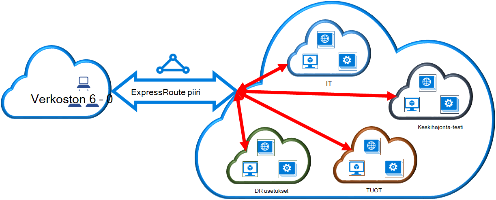

<properties
   pageTitle="Linkki virtual verkon ExpressRoute piiri perinteinen käyttöönoton mallin ja PowerShellin avulla | Microsoft Azure"
   description="Tässä asiakirjassa on yleiskatsaus siitä, miten virtual verkkojen (VNets) ExpressRoute piirit perinteinen käyttöönoton mallin ja PowerShellin avulla."
   services="expressroute"
   documentationCenter="na"
   authors="ganesr"
   manager="carmonm"
   editor=""
   tags="azure-service-management"/>
<tags
   ms.service="expressroute"
   ms.devlang="na"
   ms.topic="article"
   ms.tgt_pltfrm="na"
   ms.workload="infrastructure-services"
   ms.date="10/10/2016"
   ms.author="ganesr" />

# Linkki virtual verkon ExpressRoute piiri

> [AZURE.SELECTOR]
- [Azure Portal - resurssien hallinta](expressroute-howto-linkvnet-portal-resource-manager.md)
- [PowerShell - resurssien hallinta](expressroute-howto-linkvnet-arm.md)
- [PowerShell – perinteinen](expressroute-howto-linkvnet-classic.md)

Tämän artikkelin avulla voit linkittää virtual verkkojen (VNets) Azure ExpressRoute piirit perinteinen käyttöönoton mallin ja PowerShellin avulla. Virtual verkot voivat olla saman tilauksen, tai se voi olla toiseen tilaukseen.

**Tietoja malleista Azure käyttöönotto**

[AZURE.INCLUDE [vpn-gateway-clasic-rm](../../includes/vpn-gateway-classic-rm-include.md)]

## Määritysten edellytykset

1. Tarvitset PowerShellin Azure-moduulit uusimman version. Voit ladata uusimman PowerShell-moduulit PowerShell-osasta [Azure-lataussivulta](https://azure.microsoft.com/downloads/). Noudata [asentaminen ja määrittäminen PowerShellin Azure](../powershell-install-configure.md) vaiheittaisia ohjeita siitä, miten voit määrittää tietokoneen käyttämään PowerShellin Azure-moduuleja.
2. Sinun on tarkistettava [edellytykset](expressroute-prerequisites.md), [Reititys vaatimukset](expressroute-routing.md)ja [Työnkulut](expressroute-workflows.md) , ennen kuin aloitat määritys.
3. Sinulla on oltava aktiivinen ExpressRoute-piiri.
    - Voit [luoda ExpressRoute piiri](expressroute-howto-circuit-classic.md) ohjeiden ja on yhteys-palveluntarjoajan virtapiirin käyttöön.
    - Varmista, että sinulla on Azure yksityinen peering määritetty yhteyttä piiri. On artikkelissa [Configure reititys](expressroute-howto-routing-classic.md) reititys ohjeita.
    - Varmista, että Azure yksityinen peering on määritetty ja erityisen peering välillä verkko- ja Microsoft ei määrittäminen niin, että voit ottaa lopusta loppuun-yhteys.
    - Sinulla on oltava virtual verkko- ja VPN-yhdyskäytävän luodaan ja täysin valmistelun yhteydessä. [Määritä ExpressRoute virtual verkon](expressroute-howto-vnet-portal-classic.md)ohjeiden mukaisesti.

Voit linkittää enintään 10 virtual verkkojen ExpressRoute piiri. Virtuaalinen verkoista on oltava sama geopoliittisten alue. Voit linkittää on useita ExpressRoute piiri virtual verkkojen tai linkin virtual verkkoihin, joita geopoliittisten muilla alueilla, jos ExpressRoute premium-lisäosa on otettu käyttöön. Tarkista [usein kysytyt kysymykset](expressroute-faqs.md) lisätietoja premium-lisäosa.

## Valitse saman tilauksen virtual verkon yhdistäminen piirin

Voit linkittää virtual verkon ExpressRoute piiri seuraavat cmdlet-komennolla. Varmista, että VPN-yhdyskäytävän luodaan ja on valmis ennen kuin suoritat cmdlet linkitystä varten.

    New-AzureDedicatedCircuitLink -ServiceKey "*****************************" -VNetName "MyVNet"
    Provisioned

## Yhteyden muodostaminen piirin eri tilauksen virtual verkkoon

Voit jakaa ExpressRoute piiri useita tilauksia. Seuraavassa kuvassa on yksinkertainen ExpressRoute piirit miten jakamisesta, joka sisältää useita-tilauksissa.

Eri suuri pilven sisällä pienempi paveikslėlis käytetään esittämään tilaukset, jotka kuuluvat eri osastojen organisaatiossa. Kaikkien organisaation osastoja käyttää omia tilauksen varten käyttöönotto niiden palveluiden--mutta osastot jakaa yhden ExpressRoute piiri muodostamaan yhteys paikalliseen verkkoon. Yhden osaston (Tässä esimerkissä: IT) voit omista ExpressRoute piiri. Muut organisaation tilaukset käyttää ExpressRoute piiri.

>[AZURE.NOTE] Yhteys- ja kaistanleveyden kulujen erillinen piiri käytetään ExpressRoute piiri omistajalle. Kaikki virtual verkot jakaa saman kaistanleveyden.

### Hallinta

*Piiri omistaja* on tilaus, johon ExpressRoute piiri luodaan järjestelmänvalvojan/coadministrator. Piiri omistaja voit antaa muiden tilauksista, käyttämään erillinen piiri, ne ole *piiri käyttäjille*tarkoitettu Järjestelmänvalvojat ja coadministrators. Piiri käyttäjät, joilla on oikeus käyttää organisaation ExpressRoute piiri linkittää tilauksen virtual verkossa ExpressRoute piiri sen jälkeen, kun ne ovat valtuutettuja.

Piiri omistaja on oikeus muokata ja poistaa lupa milloin tahansa. Peruutetaan lupa johtaa kaikki linkit poistetaan tilauksesta, jonka käyttöoikeutta on peruutettu.

### Piiri omistaja toiminnot

#### Luvan luominen

Piiri omistaja sallii muista tilauksista järjestelmänvalvojien avulla määritetyn piiri. Seuraavassa esimerkissä piiri (Contoso IT) järjestelmänvalvojan mahdollistaa toiseen tilaukseen (keskihajonta-testi), voit linkittää kaksi virtual verkkojen virtapiirin järjestelmänvalvoja. Contoson IT-järjestelmänvalvoja sallii tämä määrittämällä keskihajonta-testi Microsoft ID-tunnuksellasi. Cmdlet ei Lähetä sähköposti on määritetty Microsoft. Piiri omistaja on ilmoitettava erikseen muiden tilauksen omistaja luvan on valmis.

    New-AzureDedicatedCircuitLinkAuthorization -ServiceKey "**************************" -Description "Dev-Test Links" -Limit 2 -MicrosoftIds 'devtest@contoso.com'

    Description         : Dev-Test Links
    Limit               : 2
    LinkAuthorizationId : **********************************
    MicrosoftIds        : devtest@contoso.com
    Used                : 0

#### Lupa tarkistaminen

Piiri omistaja voi tarkastella kaikkia lupa, joka on annettu tietyn piiri suorittamalla seuraavat cmdlet-komennon:

    Get-AzureDedicatedCircuitLinkAuthorization -ServiceKey: "**************************"

    Description         : EngineeringTeam
    Limit               : 3
    LinkAuthorizationId : ####################################
    MicrosoftIds        : engadmin@contoso.com
    Used                : 1

    Description         : MarketingTeam
    Limit               : 1
    LinkAuthorizationId : @@@@@@@@@@@@@@@@@@@@@@@@@@@@@@@@@@@@
    MicrosoftIds        : marketingadmin@contoso.com
    Used                : 0

    Description         : Dev-Test Links
    Limit               : 2
    LinkAuthorizationId : &&&&&&&&&&&&&&&&&&&&&&&&&&&&&&&&&&&&
    MicrosoftIds        : salesadmin@contoso.com
    Used                : 2

#### Lupa päivittäminen

Piiri omistaja, voit muokata lupa seuraavat cmdlet-komennolla:

    Set-AzureDedicatedCircuitLinkAuthorization -ServiceKey "**************************" -AuthorizationId "&&&&&&&&&&&&&&&&&&&&&&&&&&&&"-Limit 5

    Description         : Dev-Test Links
    Limit               : 5
    LinkAuthorizationId : &&&&&&&&&&&&&&&&&&&&&&&&&&&&&&&&&&&&&&
    MicrosoftIds        : devtest@contoso.com
    Used                : 0

#### Lupa poistaminen

Piiri omistaja voi peruuttaa ja poistaminen käyttäjän lupa suorittamalla seuraavat cmdlet-komento:

    Remove-AzureDedicatedCircuitLinkAuthorization -ServiceKey "*****************************" -AuthorizationId "###############################"

### Piiri käyttäjän toiminnot

#### Lupa tarkistaminen

Piiri käyttäjällä on oikeus tarkastella lupa seuraavat cmdlet-komennolla:

    Get-AzureAuthorizedDedicatedCircuit

    Bandwidth                        : 200
    CircuitName                      : ContosoIT
    Location                         : Washington DC
    MaximumAllowedLinks              : 2
    ServiceKey                       : &&&&&&&&&&&&&&&&&&&&&&&&&&&&&&&&&&&&
    ServiceProviderName              : equinix
    ServiceProviderProvisioningState : Provisioned
    Status                           : Enabled
    UsedLinks                        : 0

#### Linkki lupa lunastamalla

Piiri käyttäjä voi suorittaa lunasta linkki luvan seuraavan cmdlet-komennon:

    New-AzureDedicatedCircuitLink –servicekey "&&&&&&&&&&&&&&&&&&&&&&&&&&" –VnetName 'SalesVNET1'

    State VnetName
    ----- --------
    Provisioned SalesVNET1

## Seuraavat vaiheet

Saat lisätietoja ExpressRoute [ExpressRoute usein kysytyt kysymykset](expressroute-faqs.md).
