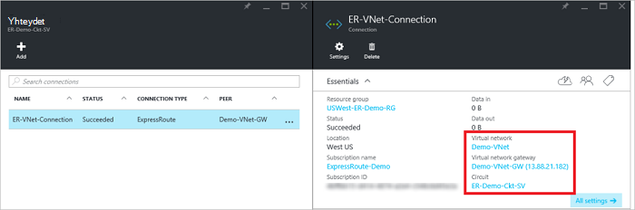

<properties
   pageTitle="Linkittää virtual verkon ExpressRoute piiri käyttämällä resurssien hallinnan käyttöönottomalli ja Azure-portaalin | Microsoft Azure"
   description="Tässä asiakirjassa on yleiskatsaus siitä, miten voit linkittää ExpressRoute piirit virtual verkkojen (VNets)."
   services="expressroute"
   documentationCenter="na"
   authors="cherylmc"
   manager="carmonm"
   editor=""
   tags="azure-resource-manager"/>
<tags
   ms.service="expressroute"
   ms.devlang="na"
   ms.topic="article"
   ms.tgt_pltfrm="na"
   ms.workload="infrastructure-services"
   ms.date="10/10/2016"
   ms.author="cherylmc" />

# Linkki virtual verkon ExpressRoute piiri

> [AZURE.SELECTOR]
- [Azure Portal - resurssien hallinta](expressroute-howto-linkvnet-portal-resource-manager.md)
- [PowerShell - resurssien hallinta](expressroute-howto-linkvnet-arm.md)
- [PowerShell – perinteinen](expressroute-howto-linkvnet-classic.md)

Tämän artikkelin avulla voit linkittää virtual verkkojen (VNets) Azure ExpressRoute piirit käyttämällä resurssien hallinnan käyttöönottomalli ja Azure-portaalin. Virtuaalinen verkot voivat olla saman tilauksen tai ne voidaan toiseen tilaukseen.

**Tietoja malleista Azure käyttöönotto**

[AZURE.INCLUDE [vpn-gateway-clasic-rm](../../includes/vpn-gateway-classic-rm-include.md)]

## Määritysten edellytykset

- Varmista, että olet tarkistanut [edellytykset](expressroute-prerequisites.md), [Reititys vaatimukset](expressroute-routing.md)ja [Työnkulut](expressroute-workflows.md) ennen kuin aloitat määritys.
- Sinulla on oltava aktiivinen ExpressRoute-piiri.
    - Voit [luoda ExpressRoute piiri](expressroute-howto-circuit-arm.md) ohjeiden ja on käytössä connectivity tarjoaja piiri.

    - Varmista, että sinulla on Azure yksityinen peering määritetty yhteyttä piiri. On artikkelissa [Configure reititys](expressroute-howto-routing-portal-resource-manager.md) reititys ohjeita.

    - Varmista, että Azure yksityinen peering on määritetty ja erityisen peering välillä verkko- ja Microsoft ei määrittäminen niin, että voit ottaa lopusta loppuun-yhteys.

    - Varmista, että sinulla on virtual verkko- ja VPN-yhdyskäytävän luodaan ja täysin valmistelun yhteydessä. [VPN-yhdyskäytävän](../articles/vpn-gateway/vpn-gateway-howto-site-to-site-resource-manager-portal.md) (seuraa vain vaiheet 1 – 5) luominen ohjeiden mukaan.

Voit linkittää enintään 10 virtual verkkojen vakio ExpressRoute piiri. Virtuaalinen verkoista on oltava sama geopoliittisten alue vakio ExpressRoute piiri käytettäessä. Voit linkittää virtual verkkojen ExpressRoute piiri geopoliittisten alueen ulkopuolella tai on useita virtual verkostojen yhdistäminen ExpressRoute piiri, jos ExpressRoute premium-lisäosa on otettu käyttöön. Tarkista [usein kysytyt kysymykset](expressroute-faqs.md) lisätietoja premium-lisäosa.

## Valitse saman tilauksen virtual verkon yhdistäminen piirin

### Yhteyden luominen

1. Varmista, että ExpressRoute piiri ja Azure yksityinen peering on määritetty onnistuneesti. Noudata [ExpressRoute piiri luominen](expressroute-howto-circuit-arm.md) ja [määrittäminen reititys](expressroute-howto-routing-arm.md). Seuraavassa kuvassa pitäisi näyttää ExpressRoute piiri.

    

    >[AZURE.NOTE] Erityisen kokoonpanotietoja ei näkyy Jos layer 3-palveluntarjoajan määritettynä oman peerings. Jos yhteyttä piiri on valmisteltu-tilaan, olisi voi luoda yhteyksiä.

2. Voit nyt aloittaa valmistelu yhteyden VPN-yhdyskäytävän ExpressRoute piiri haluat linkittää. Valitse **yhteys** > **Lisää** avata **Lisää yhteys** -sivu ja määritä sitten arvot. Esimerkki viittaus.

      

3. Kun yhteys on määritetty, yhteysobjektin näkyy tietoja yhteyden.

    

### Yhteyden poistaminen

Voit poistaa yhteyden valitsemalla sivu yhteyden **Poista** -kuvaketta.

## Yhteyden muodostaminen piirin eri tilauksen virtual verkkoon

Tällä hetkellä ei voida luoda virtuaalisen verkkojen tilauksissa edellä Azure-portaalissa. Voit kuitenkin tehdä tämän PowerShell. Katso lisätietoja artikkelista [PowerShell](expressroute-howto-linkvnet-arm.md) .

## Seuraavat vaiheet

Saat lisätietoja ExpressRoute [ExpressRoute usein kysytyt kysymykset](expressroute-faqs.md).
