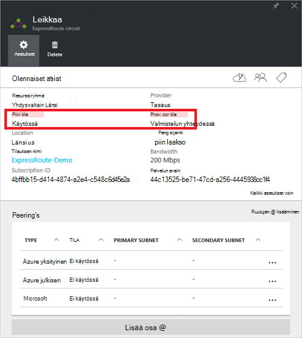
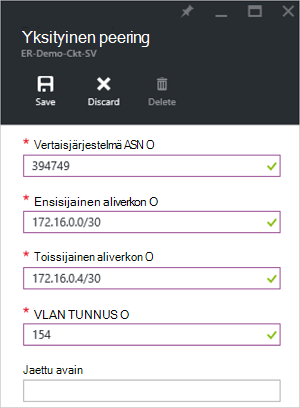
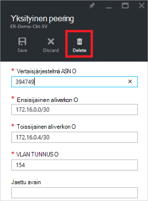
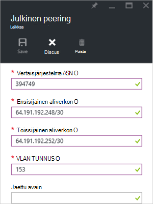
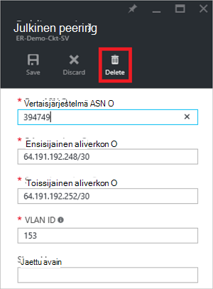
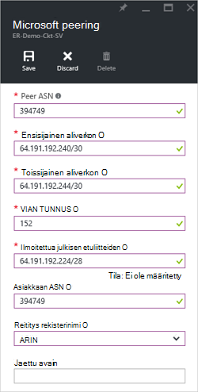
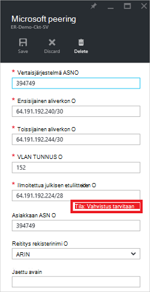
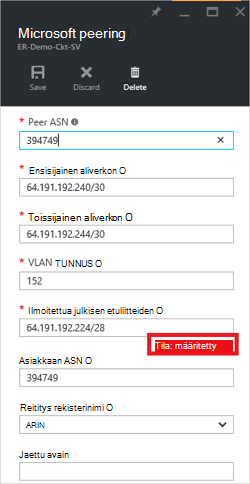
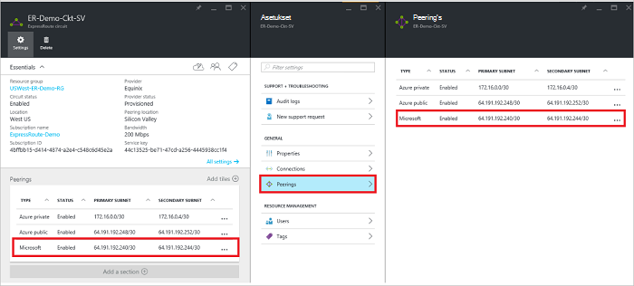
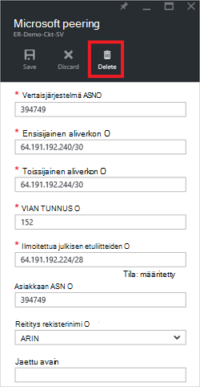

<properties
   pageTitle="Azure-portaalissa ExpressRoute-piiri reititys määrittämisestä | Microsoft Azure"
   description="Tässä artikkelissa käydään läpi vaiheet yksityinen, yleisön ja Microsoft peering ExpressRoute piiri, luominen ja. Tässä artikkelissa myös kerrotaan, miten voit tarkistaa tilan, Päivitä tai poista oman piiri peerings."
   documentationCenter="na"
   services="expressroute"
   authors="cherylmc"
   manager="carmonm"
   editor=""
   tags="azure-resource-manager"/>
<tags
   ms.service="expressroute"
   ms.devlang="na"
   ms.topic="hero-article" 
   ms.tgt_pltfrm="na"
   ms.workload="infrastructure-services"
   ms.date="10/10/2016"
   ms.author="cherylmc"/>

# Luoda ja muokata reititys ExpressRoute piiri

> [AZURE.SELECTOR]
[Azure Portal - Resurssienhallinta](expressroute-howto-routing-portal-resource-manager.md)
[PowerShell - Resurssienhallinta](expressroute-howto-routing-arm.md)
[PowerShell – perinteinen](expressroute-howto-routing-classic.md)

Tässä artikkelissa käydään läpi vaiheet ja luoda ja hallita reititys määrityskohde ExpressRoute-piiri, Azure portaalin ja resurssien hallinnan käyttöönottomalli.

**Tietoja malleista Azure käyttöönotto**

[AZURE.INCLUDE [vpn-gateway-clasic-rm](../../includes/vpn-gateway-classic-rm-include.md)] 

## Määritysten edellytykset

- Varmista, että olet tarkistanut [edellytykset](expressroute-prerequisites.md) -sivulla, [vaatimukset reititys](expressroute-routing.md) -sivulle ja [Työnkulut](expressroute-workflows.md) -sivu ennen kuin aloitat määritys.
- Sinulla on oltava aktiivinen ExpressRoute-piiri. Luo [ExpressRoute piiri](expressroute-howto-circuit-arm.md) ohjeiden mukaisesti ja olet ottanut connectivity-palveluntarjoajan, ennen kuin jatkat piiri. ExpressRoute piiri on oltava valmisteltu ja käytössä-tilaan, voivat suorittaa jäljempänä Cmdlet-komentoja.

Nämä ohjeet koskevat vain piirit luotu ojentamassa Layer 2 yritystietojen yhdistämispalvelut palveluntarjoajia. Jos käytössäsi on palveluntarjoajan tarjoaminen hallittuja Layer 3-palveluja (yleensä IPVPN, kuten MPLS), yhteys-palveluntarjoajan määrittäminen ja hallinta reititys puolestasi. 

>[AZURE.IMPORTANT] Emme ole mainostaa peerings määrittämän palveluntarjoajien palvelun hallinta-portaalin kautta. Yritämme tätä ominaisuutta pian ottamisesta käyttöön. Tarkista palveluntarjoajalta ennen erityisen peerings määrittämistä.

Voit määrittää yhden, kahden tai kaikki kolme peerings (Azure yksityiset, Azure julkinen ja Microsoft), ExpressRoute piiri. Voit määrittää peerings valitset järjestyksessä. Kuitenkin varmistamalla, että suoritat kunkin peering yksi kerrallaan määritys. 

## Azure yksityinen peering

Tässä osassa on ohjeita siitä, miten voit luoda, Hae, päivittäminen ja poistaminen ExpressRoute piiri Azure yksityinen peering määrityskohde. 

### Voit luoda Azure yksityinen peering

1. Määritä ExpressRoute piiri. Varmista, että virtapiirin on täysin valmisteltu connectivity tarjoaja ennen jatkamista.

    

2. Määritä Azure yksityinen peering virtapiirin varten. Varmista, että sinulla on seuraavat seikat, ennen kuin jatkat seuraavat vaiheet:

    - /30 aliverkon ensisijainen linkin. Tämä ei saa olla varattu virtual verkkojen minkä tahansa osoitetilan osa.
    - /30 aliverkon toissijainen linkin. Tämä ei saa olla varattu virtual verkkojen minkä tahansa osoitetilan osa.
    - Kelvollinen VLAN-tunnus muodostaa peering käyttöön. Varmista, että ei ole muita peering piirissä käyttää samaa VLAN ID-tunnuksellasi.
    - Numero peering nimellä. Voit käyttää 2-tavuinen ja 4-tavuinen LUKUINA. Voit määrittää yksityisen kuin tässä peering numero. Varmista, että käytössäsi ei ole 65515.
    - MD5 hash, jos haluat käyttää. **Tämä on valinnainen**.

3. Valitse yksityinen Azure peering rivi, alla kuvatulla tavalla.
    
    
    

4. Määritä yksityinen peering. Alla olevassa kuvassa on Määritysesimerkki.

    

    
5. Tallenna kokoonpano, kun olet määrittänyt kaikki parametrit. Kun määritykset on hyväksynyt onnistuu, näet suurin piirtein seuraavanlaisen alla olevassa esimerkissä.

    
    

### Voit tarkastella Azure yksityinen peering tietoja

Voit tarkastella Azure yksityinen peering peering valitsemalla Ominaisuudet.

### Päivitä Azure yksityinen peering määritys

Voit valita peering rivi ja muokata peering ominaisuuksia. 

### Jos haluat poistaa Azure yksityinen peering

Voit poistaa peering kokoonpanosi valitsemalla Poista-kuvaketta alla kuvatulla tavalla.

## Azure julkisen peering

Tässä osassa on ohjeita siitä, miten voit luoda, Hae, päivittäminen ja poistaminen ExpressRoute piiri Azure julkisen peering määrityskohde. 

### Voit luoda Azure julkisen peering

1. Määritä ExpressRoute piiri. Varmista, että virtapiirin on täysin valmisteltu connectivity tarjoaja ennen jatkamista edelleen.

    

2. Määritä Azure julkisen peering virtapiirin varten. Varmista, että sinulla on seuraavat seikat, ennen kuin jatkat seuraavat vaiheet:

    - /30 aliverkon ensisijainen linkin. 
    - /30 aliverkon toissijainen linkin. 
    - Kaikki käytettävä asennuksen tämän peering IP-osoitteiden on oltava kelvollinen julkisen IPv4-osoitteet.
    - Kelvollinen VLAN-tunnus muodostaa peering käyttöön. Varmista, että ei ole muita peering piirissä käyttää samaa VLAN ID-tunnuksellasi.
    - Numero peering nimellä. Voit käyttää 2-tavuinen ja 4-tavuinen LUKUINA.
    - MD5 hash, jos haluat käyttää. **Tämä on valinnainen**.

3. Valitse Azure julkinen peering rivi, alla kuvatulla tavalla.
    
    
    

4. Määritä julkinen peering. Alla olevassa kuvassa on Määritysesimerkki.

    

    
5. Tallenna kokoonpano, kun olet määrittänyt kaikki parametrit. Kun määritykset on hyväksynyt onnistuu, näet suurin piirtein seuraavanlaisen alla olevassa esimerkissä.

    
    

### Voit tarkastella Azure julkinen peering tietoja

Voit tarkastella Azure julkisen peering peering valitsemalla Ominaisuudet.

### Päivitä Azure julkisen peering määritys

Voit valita peering rivi ja muokata peering ominaisuuksia. 

### Jos haluat poistaa Azure julkisen peering

Voit poistaa peering kokoonpanosi valitsemalla Poista-kuvaketta alla kuvatulla tavalla.

## Microsoft peering

Tässä osassa on ohjeita siitä, miten voit luoda, Hae, päivittäminen ja poistaminen Microsoft peering määrityskohde ExpressRoute piiri. 

### Voit luoda Microsoft peering

1. Määritä ExpressRoute piiri. Varmista, että virtapiirin on täysin valmisteltu connectivity tarjoaja ennen jatkamista edelleen.

    

2. Määritä Microsoft peering virtapiirin varten. Varmista, että sinulla on seuraavat tiedot, ennen kuin jatkat.

    - /30 aliverkon ensisijainen linkin. Tämä on oltava kelvollinen julkinen IPv4 etuliite omistamasi ja rekisteröity RIR / IRR.
    - /30 aliverkon toissijainen linkin. Tämä on oltava kelvollinen julkinen IPv4 etuliite omistamasi ja rekisteröity RIR / IRR.
    - Kelvollinen VLAN-tunnus muodostaa peering käyttöön. Varmista, että ei ole muita peering piirissä käyttää samaa VLAN ID-tunnuksellasi.
    - Numero peering nimellä. Voit käyttää 2-tavuinen ja 4-tavuinen LUKUINA.
    - **Määrittämiisi etuliitteiden:** Sinun on määritettävä luettelon kaikki etuliitteiden aiot mainostaa erityisen istunnon päälle. Vain julkiseen IP address etuliitteiden hyväksytään. Voit lähettää pilkulla erotettuna luettelona, jos aiot lähettää etuliitteiden joukko. Seuraavia etuliitteitä on oltava rekisteröity sinulle RIR / IRR.
    - **Asiakkaan ASN:** Jos olet mainonta etuliitteitä ole rekisteröity peering MÄÄRÄKSI, voit määrittää liitetään numero, johon ne on rekisteröity. **Tämä on valinnainen**.
    - **Reititys rekisterinimi:** Voit määrittää RIR / IRR, jota vastaan, koska numero ja etuliitteiden kirjainkoko on rekisteröity. **Tämä on valinnainen.**
    - MD5 hajautuksen Jos haluat käyttää. **Tämä on valinnainen.**
    
3. Voit valita peering, jotka haluat määrittää alla kuvatulla tavalla. Valitse Microsoft peering rivi.
    
    
    

4.  Määritä Microsoft peering. Alla olevassa kuvassa on Määritysesimerkki.

    

    
5. Tallenna kokoonpano, kun olet määrittänyt kaikki parametrit. 

    Jos haluat saa yhteyttä piiri kelpoisuustarkistuksen tarvitaan tila (Katso kuvaa alla), sinun on avattava tuki lippu näyttämään kuitti, tukityöryhmämme etuliitteiden omistajuuden.  
    
    

    Voit avata tuki lippu suoraan portaalin alla kuvatulla tavalla   
    
    

6. Kun määritykset on hyväksynyt onnistuu, näet suurin piirtein seuraavanlaisen alla olevassa esimerkissä.

    
    

### Jos haluat tarkastella Microsoft peering

Voit tarkastella Azure julkisen peering peering valitsemalla Ominaisuudet.

### Jos haluat päivittää Microsoft peering määritys

Voit valita peering rivi ja muokata peering ominaisuuksia. 

### Voit poistaa Microsoft peering

Voit poistaa peering kokoonpanosi valitsemalla Poista-kuvaketta alla kuvatulla tavalla.

## Seuraavat vaiheet

Seuraavaksi, [linkki, ExpressRoute piiri VNet](expressroute-howto-linkvnet-arm.md).

-  Saat lisätietoja ExpressRoute työnkulut [ExpressRoute työnkulkuja](expressroute-workflows.md).

-  Saat lisätietoja peering piiri [ExpressRoute piirit ja reititys toimialueet](expressroute-circuit-peerings.md).

-  Lisätietoja virtual verkkojen käyttämisestä on artikkelissa [Virtual verkon yleiskatsaus](../virtual-network/virtual-networks-overview.md).

