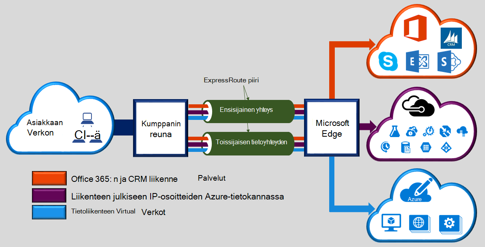
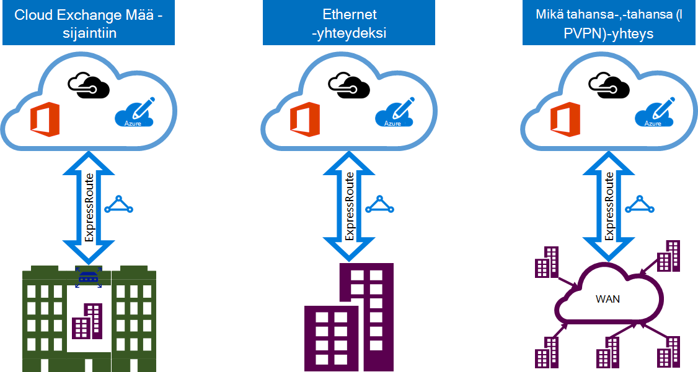

<properties 
   pageTitle="Johdanto ExpressRoute | Microsoft Azure"
   description="Tällä sivulla on yleiskuvaus ExpressRoute-palvelua, mukaan lukien ExpressRoute yhteyden toiminta."
   documentationCenter="na"
   services="expressroute"
   authors="cherylmc"
   manager="carmonm"
   editor=""/>
<tags 
   ms.service="expressroute"
   ms.devlang="na"
   ms.topic="get-started-article" 
   ms.tgt_pltfrm="na"
   ms.workload="infrastructure-services" 
   ms.date="10/10/2016"
   ms.author="cherylmc"/>

# ExpressRoute teknisiä tietoja

Microsoft Azure ExpressRoute avulla voit laajentaa paikallisen lopettaminen Microsoft cloud connectivity tarjoaja helpottaa erillinen yksityisen yhteyden kautta. ExpressRoute voit muodostaa yhteyden Microsoftin pilvipalveluihin, kuten Microsoft Azure, Office 365: ssä ja CRM Online. Yhteys voi olla minkä tahansa-,-tahansa (IP-VPN)-verkko, pisteestä pisteeseen-Ethernet-verkon tai virtual rajat-yhteyden kautta rinnakkain-tilojen yhteyden palveluntarjoajaasi. ExpressRoute yhteydet ei siirry julkisen Internetin välityksellä. Näin ExpressRoute yhteydet tarjoaa useita luotettavasti, nopeampi nopeuksia, pienet viiveet suurempia ja suurempi kuin tavallinen yhteydet suojaus Internetin välityksellä.

**Tärkeimpiä etuja ovat:**

- Layer 3 paikallisen verkon ja connectivity-palvelun kautta Microsoft-Cloud väliset yhteydet. Yhteys voi olla verkosta mikä tahansa--tahansa (IPVPN), Ethernet pisteestä pisteeseen-yhteyden tai virtual rajat-yhteyden kautta Ethernet-exchange kautta.
- Yhteys Microsoftin pilvipalveluihin kaikkien alueiden geopoliittisten alueen yli.
- Yleinen yhteys Microsoft-palveluihin ja ExpressRoute premium-apuohjelma kaikkien alueiden välillä.
- Dynaaminen reititys välillä verkko- ja Microsoft alan vakio protokollat (erityisen) kautta.
- Valmiin redundancy paremman luotettavuuden jokaisen peering sijaintiin.
- Yhteyden käytettävyyttä [SLA](https://azure.microsoft.com/support/legal/sla/).
- QoS- ja tukikeskus määräten sovellusten, kuten Skype for Business-palvelun useita luokkia.

Katso lisätietoja [ExpressRoute usein kysytyt kysymykset](expressroute-faqs.md) .

## Miten voin muodostaa verkon käyttämällä ExpressRoute Microsoftille?

Voit luoda yhteyden paikallisen verkon ja Microsoft cloud välille kolmella eri tavalla:

### Cloud exchange yhtä osoitteessa

Jos asut yhtä tilojen cloud Exchangen kanssa, voit tilata virtual rajat-yhteyksien kautta rinnakkain kehittäjän Ethernet exchange Microsoft pilveen. Rinnakkain tarjoajat tarjota Layer 2 rajat-yhteydet tai hallittua Layer 3 rajat-kautta rinnakkain-tila-infrastruktuuria ja Microsoft cloud välillä.

### Pisteestä pisteeseen Ethernet yhteydet 

Voit muodostaa paikallisen-palvelinkeskusten/toimistot pisteestä pisteeseen Ethernet linkkien kautta Microsoftin pilvipalveluihin. Pisteestä pisteeseen Ethernet tarjoajat tarjota Layer 2 yhteydet tai hallita sivuston ja Microsoft cloud välisiä yhteyksiä Layer 3.

### Mikä tahansa-,-tahansa (IPVPN)-verkoissa

Voit integroida oman WAN Microsoft pilven kautta. IPVPN valmistajat (yleensä MPLS VPN) tarjoavat tahansa-,-tahansa toimipisteiden ja palvelinkeskusten väliset yhteydet. Microsoft cloud on yhdistetty toisiinsa, että voit muuttaa asiakirjan ulkoasua aivan kuten muita Tampereen toimistossa WAN. WAN valmistajat tarjoavat yleensä hallitun Layer 3-yhteys. ExpressRoute ominaisuudet ja toiminnot ovat kaikki samat kaikissa edellä yhdistämispalvelun mallien. 

Yhdistämispalvelua tarjoajat tarjota vähintään yksi yhdistämispalvelun mallien. Voit käsitellä connectivity-palveluntarjoajan, valitse malli, joka sopii sinulle parhaiten.

## ExpressRoute ominaisuudet

ExpressRoute tukee seuraavia ominaisuuksia ja toimintoja: 

### Layer 3-yhteys

Microsoft käyttää alan vakio dynaaminen reititys protokolla (erityisen) Exchange reitittää paikalliseen verkkoon, kopioita Azure-tietokannassa ja Microsoft julkisia osoitteita.  Emme muodostaa useita erityisen istuntojen verkoston kanssa eri liikenne-profiileista. Lisätietoja löytyy [ExpressRoute piiri ja toimialueiden reititys](expressroute-circuit-peerings.md) -artikkelissa.

### Redundancy

Kunkin ExpressRoute piiri koostuu kaksi yhteyttä kahden Microsoft Enterprise reunan reitittimen (MSEEs), yhteys tarjoajalta / oman verkon reuna. Microsoft edellyttävät kahden erityisen yhteyden connectivity tarjoajalta / oman puoli – yksi kullekin MSEE. Voit halutessasi ei ottamaan tarpeettomat laitteet / Ethernet piiriä ja että lopussa. Kuitenkin yhdistämispalvelua tarjoajat käyttää tarpeettomat laitteet varmistaaksesi, että yhteydet on jaettu Microsoftille tarpeettomat tavalla. Tarpeettomien Layer 3-yhteyden määrittäminen vaaditaan Microsoftin [SLA](https://azure.microsoft.com/support/legal/sla/) on voimassa. 

### Yhteys Microsoftin pilvipalveluihin

[AZURE.INCLUDE [expressroute-office365-include](../../includes/expressroute-office365-include.md)]

ExpressRoute yhteydet ottaminen käyttöön seuraavat palvelut:

- Microsoft Azure-palvelut
- Microsoft Office 365-palveluissa
- Microsoft CRM Online-palveluihin 
 
Pääset käsiksi services tueta ExpressRoute tarkat [ExpressRoute usein kysytyt kysymykset](expressroute-faqs.md) -sivu.

### Kaikkien alueiden geopoliittisten alueella yhteys

Voit muodostaa yhteyden Microsoft meidän [peering sijainnit](expressroute-locations.md) ja käyttää kaikkien alueiden geopoliittisten alueella. 

Esimerkiksi jos yhteys Microsoft Amsterdamissa ExpressRoute kautta, sinun on pääsy kaikki ylläpidettävä Pohjois-Eurooppa ja Länsi-Euroopassa Microsoftin pilvipalveluihin. Lisätietoja [ExpressRoute kumppanit ja peering sijainnit](expressroute-locations.md) artikkelista yleisiä tietoja geopoliittisten alueet, liitetty Microsoft cloud alueet ja ExpressRoute peering sijainnit.

### Yleinen yhteys ja ExpressRoute premium-apuohjelma

Voit ottaa käyttöön Laajenna connectivity geopoliittisten rajojen ExpressRoute premium lisäosa-ominaisuus. Jos olet muodostanut yhteyden Microsoft Amsterdamissa ExpressRoute kautta, voit esimerkiksi on pääsy ylläpidettävä kaikkialla maailmassa kaikkien alueiden kaikissa Microsoftin pilvipalveluihin (kansallinen paveikslėlis jätetään pois). Voit käyttää palveluita samalla tavalla, voit käyttää Pohjois- ja Länsi Europe alueet Etelä-Amerikka tai Australia käyttöön.

### RTF-yhteyksien kumppanin ekosysteemiin

ExpressRoute on jatkuvasti kasvava ekosysteemiin yhdistämispalvelua tarjoajat ja palvelun Käyttäjätietojen kumppaneidesi. Voit viitata uusimmat tiedot [ExpressRoute tarjoajien ja sijainnit](expressroute-locations.md) -artikkelissa.

### Kansallinen paveikslėlis yhteys

Microsoft toimii erillään cloud-ympäristössä määräten geopoliittisten alueiden ja asiakkaan osia. Lisätietoja kansallisia paveikslėlis ja palveluntarjoajat luettelo [ExpressRoute tarjoajien ja sijainnit](expressroute-locations.md) -sivulla.

### Tuetut kaistanleveyden asetukset

Voit hankkia ExpressRoute piirit kaistanleveyksien monien varten. Tuetut kaistanleveyksien luettelo näkyy jäljempänä. Muista tarkistaa connectivity palvelussa määrittämään luettelo tuetuista kaistanleveyksien niissä.

- 50 Mbps
- 100 Mbps
- 200 Mbps
- 500 Mbps
- 1 Gbps
- 2 Gbps
- 5 Gbps
- 10 Gbps

### Kaistanleveyden dynaaminen skaalaus

Sinulla voi parantaa ExpressRoute piiri kaistanleveyden (perusteella parhaat työmäärään) eikä sinun tarvitse tear alaspäin yhteydet. 

### Joustava laskutuksen mallit

Voit valita laskutuksen mallin, joka toimii parhaiten puolestasi. Valitse alla laskutuksen mallien välillä. Katso lisätietoja [ExpressRoute usein kysytyt kysymykset](expressroute-faqs.md) -sivulle. 

- **Rajoittamaton tiedot**. ExpressRoute piiri veloitetaan kuukausittainen maksu mukaan sekä kaikki saapuvat ja lähtevät tiedonsiirto on lisätä ilmaiseksi. 
- **Mukaan laskutettava tiedot**. ExpressRoute piiri veloitetaan kuukausittainen maksu perusteella. Kaikki saapuvat tiedonsiirto on maksutta. Lähtevien tietojen siirto veloitetaan tiedonsiirto Gigatavua kohden. Tietojen siirtäminen korvaukset vaihtelevat alueittain.
- **ExpressRoute premium-lisäosa**. ExpressRoute premium ylittäneen lisäosaa ExpressRoute piiri. ExpressRoute premium-lisäosa on seuraavia ominaisuuksia: 
    - Parannettu reitin Azure julkinen ja Azure yksityinen peering 4 000 tiet-10 000 tiet, rajoitukset.
    - Yleinen connectivity Services. Luotu (lukuun ottamatta kansallinen paveikslėlis) alueet ExpressRoute-piiri on resurssien käytön muiden maailmanlaajuisesti alueen yli. Esimerkiksi luotu Länsi Euroopan virtual verkon kautta käytettävien valmisteltu piin laakso ExpressRoute-piiri.
    - VNet linkit kohti ExpressRoute piiri 10 suurempi raja mukaan virtapiirin kaistanleveyden määrän.

## Seuraavat vaiheet

- Lisätietoja ExpressRoute yhteydet ja reititys toimialueet. Katso [ExpressRoute piirit ja reititys toimialueet](expressroute-circuit-peerings.md).
- Etsi palveluntarjoaja. Katso [ExpressRoute kumppanit ja peering sijainnit](expressroute-locations.md).
- Varmista, että kaikki edellytykset täyttyvät. Katso [ExpressRoute edellytykset](expressroute-prerequisites.md).
- Lisätietoja [Reititys](expressroute-routing.md), [NAT](expressroute-nat.md) ja [QoS](expressroute-qos.md)koskevat vaatimukset.
- Määritä ExpressRoute-yhteys.
    - [Luo ExpressRoute piiri](expressroute-howto-circuit-classic.md)
    - [Määritä reititys](expressroute-howto-routing-classic.md)
    - [Linkin VNet ExpressRoute piiri](expressroute-howto-linkvnet-classic.md)
