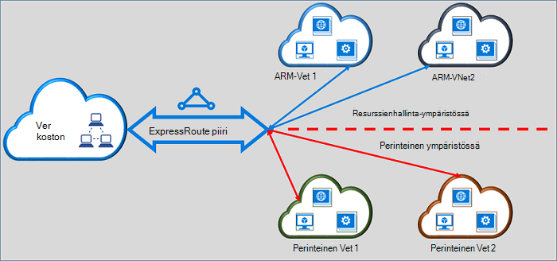

<properties
   pageTitle="Siirtämisen ExpressRoute piirit klassinen resurssien hallinnan | Microsoft Azure"
   description="Tällä sivulla on yleiskuvaus huomioitavia seikkoja siltauksen perinteinen ja resurssien hallinnan käyttöönotto-mallit."
   documentationCenter="na"
   services="expressroute"
   authors="ganesr"
   manager="carmonm"
   editor=""/>
<tags
   ms.service="expressroute"
   ms.devlang="na"
   ms.topic="get-started-article"
   ms.tgt_pltfrm="na"
   ms.workload="infrastructure-services"
   ms.date="10/10/2016"
   ms.author="ganesr"/>

# Siirtyvät ExpressRoute piirit klassinen resurssien hallinnan käyttöönottomalli

Tässä artikkelissa on yleiskatsaus selitys Azure ExpressRoute piiri Siirry Azure resurssien hallinnan käyttöönottomalli perinteinen.

[AZURE.INCLUDE [vpn-gateway-sm-rm](../../includes/vpn-gateway-classic-rm-include.md)]

Voit muodostaa yhteyden virtual verkkoihin, jotka on otettu sekä perinteinen ja resurssien hallinnan käyttöönotto-mallien yksittäisen ExpressRoute piiri. ExpressRoute piiri, riippumatta siitä, miten se on luotu, voit linkittää nyt virtual verkkoihin eri sekä käyttöönotto-malleissa.

## ExpressRoute piirit, jotka on luotu perinteinen käyttöönottomalli

ExpressRoute piirit, jotka on luotu perinteinen käyttöönotto-mallissa on siirrettävä resurssien hallinnan käyttöönottomalli ensin muodostaa yhteys perinteinen ja resurssien hallinnan käyttöönotto-mallit. Ole connectivity katoamisen tai häiriöitä, kun yhteys siirretään. Kaikki piiri-ja-VPN-linkit perinteinen käyttöönoton mallin (sisällä saman tilauksen ja rajat-tilaus) säilyvät ennallaan.

Kun siirto on valmis, ExpressRoute piiri näyttää, suorittaa ja tuntuu täsmälleen kuten ExpressRoute-piiri, joka on luotu resurssien hallinnan käyttöönottomalli. Voit nyt luoda yhteyden virtual verkkoihin Resurssienhallinta käyttöönotto-mallissa.

ExpressRoute jälkeen piiri on siirretty resurssin hallinnan käyttöönottomalli, voit hallita ExpressRoute piiri elinkaaren vain käyttämällä resurssien hallinnan käyttöönottomalli. Tämä tarkoittaa, että voit suorittaa toimintoja, kuten lisääminen ja päivittäminen ja poistaminen peerings päivitetään piiri ominaisuuksia (kuten kaistanleveys, tuote ja laskutuksen tyyppi) ja poistamalla piirit vain resurssien hallinnan käyttöönotto mallissa. Lisätietoja on piirit, jotka on luotu lisätietoja siitä, miten voit hallita sekä käyttöönotto-mallien käyttöoikeuksien resurssien hallinnan käyttöönottomalli-osio.

Sinun ei tarvitse liittyä yhteyden palveluntarjoajan suorittaa siirron.

## ExpressRoute piirit, jotka on luotu resurssien hallinnan käyttöönottomalli

Voit ottaa ExpressRoute piirit, jotka on luotu Resurssienhallinta käyttöönoton mallin voi käyttää sekä käyttöönotto-malleista. Mikä tahansa ExpressRoute piiri tilaukseesi voi ottaa käyttöön voi käyttää sekä käyttöönotto-malleista.

- ExpressRoute piirit, jotka on luotu resurssien hallinnan käyttöönottomalli ei ole oletusarvoisesti perinteinen käyttöönoton mallin käyttöoikeudet.
- ExpressRoute piirit, joka on siirretty perinteinen käyttöönoton mallista resurssien hallinnan käyttöönotto-malli voi käyttää oletusarvon mukaan sekä käyttöönotto-malleista.
- ExpressRoute piiri on aina oikeudet resurssien hallinnan käyttöönottomalli, riippumatta siitä, onko se luotu Resurssienhallinta- tai classic käyttöönottomalli. Tämä tarkoittaa, että voit muodostaa yhteyksiä virtual verkkoihin luotu annettujen ohjeiden käyttämisestä [virtual verkkojen](expressroute-howto-linkvnet-arm.md)resurssien hallinnan käyttöönottomalli.
- Perinteinen käyttöönoton mallin käyttöoikeudet ohjataan ExpressRoute piirissä **allowClassicOperations** -parametrin.

>[AZURE.IMPORTANT] Kaikki kiintiöt, jotka on kuvattu sivulla [palvelun rajoitukset](../azure-subscription-service-limits.md) koskevat. Esimerkkinä vakio piiri voi olla enintään 10 virtual linkit/verkkoyhteyksien perinteinen ja resurssien hallinnan käyttöönotto-mallit.

## Perinteinen käyttöönoton mallin käytön valvominen

Voit ottaa yksittäisen ExpressRoute piiri linkitettävän virtual verkkoihin sekä käyttöönotto-malleissa ExpressRoute virtapiirin **allowClassicOperations** -parametrin määrittämällä.

**AllowClassicOperations** arvoksi TRUE avulla voit linkittää virtual verkkojen käyttöönoton sekä malleista ExpressRoute piiri. Voit linkittää virtual verkkoihin perinteinen käyttöönoton mallin [virtual verkkojen perinteinen käyttöönoton mallin linkittämisestä](expressroute-howto-linkvnet-classic.md)seuraa ohjeita. Voit linkittää virtual verkkoihin Resurssienhallinta käyttöönoton mallin seuraa ohjeita siitä, [miten voit linkittää virtual verkot resurssien hallinnan käyttöönottomalli](expressroute-howto-linkvnet-arm.md).

Asetukset **allowClassicOperations** EPÄTOSI estää pääsyn virtapiirin perinteinen käyttöönoton mallista. Kuitenkin kaikki VPN-linkit perinteinen käyttöönoton mallin säilytetään. Tässä tapauksessa ExpressRoute piiri ei ole näkyvissä perinteinen käyttöönotto-mallissa.

## Tuetut toiminnot perinteinen käyttöönotto-mallissa

Perinteinen seuraavat toimenpiteet tuetaan ExpressRoute piiri, kun **allowClassicOperations** on tosi:

 - ExpressRoute piiri tietojen hakeminen
 - Luo, Päivitä ja Hae/poistaminen virtual verkon linkit perinteinen virtual verkkoihin
 - Luo, Päivitä ja Hae/poistaminen virtual verkon linkki lupa rajat-tilauksen yhteyksiä varten

Ei voi suorittaa seuraavat perinteinen toimet, kun **allowClassicOperations** on tosi:

 - Luo, Päivitä ja Hae/poistaminen reunan yhdyskäytävän erityisen peerings Azure yksityiset, Azure julkisissa ja Microsoft peerings
 - Poista ExpressRoute piirit

## Perinteinen ja resurssien hallinnan käyttöönotto-mallien välisen

ExpressRoute piiri toimii samalla tavalla kuin siltaa perinteinen ja resurssien hallinnan käyttöönotto-mallien välille. Liikenteen virtual machines virtual verkoissa perinteinen käyttöönoton mallin ja kaltaisia virtual verkot Resurssienhallinta käyttöönoton mallin kulkee – Jos virtual verkkojen on linkitetty samaan ExpressRoute virtapiirin ExpressRoute välillä.

Kooste siirtonopeuden rajoittavat siirtonopeuden kapasiteetin VPN-yhdyskäytävä. Liikenne Kirjoita connectivity kehittäjän verkkoja tai lopettaminen tällaisissa tapauksissa. Microsoft-verkon täysin sisältämät liikenteen suunnan virtual verkkojen välillä.

## Azure julkinen ja Microsoft peering resurssit

Voit edelleen käyttää resursseja, jotka ovat yleensä käytettävissä Azure julkisen peering ja Microsoft peering ilman häiriöitä kautta.  

## Tuetut toiminnot

Tässä osassa kuvataan, mitä tuetaan ExpressRoute piirit:

 - Voit käyttää virtual verkkoja, jotka on otettu käyttöön klassinen ja resurssien hallinnan käyttöönotto-mallien yksittäisen ExpressRoute piiri.
 - Voit siirtää ExpressRoute piiri klassinen resurssien hallinnan käyttöönottomalli. Kun se on siirretty, ExpressRoute piiri näyttää, tuntuu ja suorittaa esimerkiksi kaikki muut ExpressRoute piiri, joka on luotu resurssien hallinnan käyttöönottomalli.
 - Voit siirtää vain ExpressRoute piiri. Piiri linkkejä, virtual verkkojen ja VPN-yhdyskäytäviä ei voi siirtää tämän toiminnon avulla.
 - ExpressRoute jälkeen piiri on siirretty resurssin hallinnan käyttöönottomalli, voit hallita ExpressRoute piiri elinkaaren vain käyttämällä resurssien hallinnan käyttöönottomalli. Tämä tarkoittaa, että voit suorittaa toimintoja, kuten lisääminen ja päivittäminen ja poistaminen peerings päivitetään piiri ominaisuuksia (kuten kaistanleveys, tuote ja laskutuksen tyyppi) ja poistamalla piirit vain resurssien hallinnan käyttöönotto mallissa.
 - ExpressRoute piiri toimii samalla tavalla kuin siltaa perinteinen ja resurssien hallinnan käyttöönotto-mallien välille. Liikenteen virtual machines virtual verkoissa perinteinen käyttöönoton mallin ja kaltaisia virtual verkot Resurssienhallinta käyttöönoton mallin kulkee – Jos virtual verkkojen on linkitetty samaan ExpressRoute virtapiirin ExpressRoute välillä.
 - Usean tilauksen connectivity tuetaan klassinen ja resurssien hallinnan käyttöönotto-mallit.

## Mitä ei tueta

Tässä osassa kuvataan, mitä ei tueta ExpressRoute piirit:

 - Siirtyvät piiri linkkejä, yhdyskäytävien ja virtual käyttäminen klassinen resurssien hallinnan käyttöönottomalli.
 - ExpressRoute piiri elinkaaren hallinta perinteinen käyttöönoton mallista.
 - Roolipohjainen käytön hallinta (RBAC) tuki perinteinen käyttöönottomalli. Et voi suorittaa RBAC ohjausobjektien piirin perinteinen käyttöönotto-mallissa. Mikä tahansa järjestelmänvalvojan/coadministrator Tilauksen voit linkittää tai poista virtapiirin virtual verkkojen.

## Määritys

Noudata ohjeita, jotka on kuvattu [siirtää ExpressRoute-piiri-perinteinen Resurssienhallinta käyttöönotto-malliin](expressroute-howto-move-arm.md).

## Seuraavat vaiheet

- Työnkulun lisätietoja [ExpressRoute piiri valmistelu työnkulut ja piiri hyötyä](expressroute-workflows.md).
- Voit määrittää ExpressRoute yhteyden:

    - [Luo ExpressRoute piiri](expressroute-howto-circuit-arm.md)
    - [Määritä reititys](expressroute-howto-routing-arm.md)
    - [Linkki virtual verkon ExpressRoute piiri](expressroute-howto-linkvnet-arm.md)
