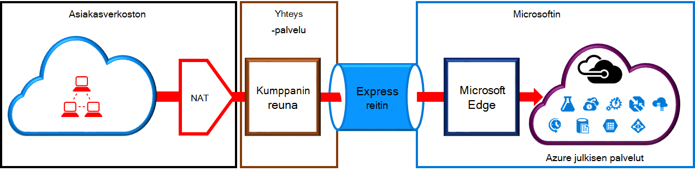
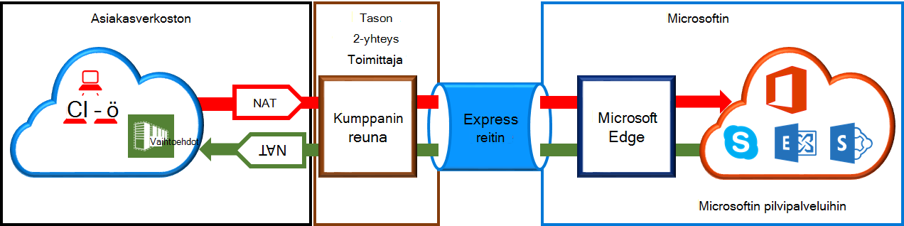

<properties
   pageTitle="NAT vaatimukset ExpressRoute piirit | Microsoft Azure"
   description="Tällä sivulla on vaatimukset määrittämisestä ja hallinnasta NAT ExpressRoute piirit."
   documentationCenter="na"
   services="expressroute"
   authors="cherylmc"
   manager="carmonm"
   editor=""/>
<tags
   ms.service="expressroute"
   ms.devlang="na"
   ms.topic="get-started-article"
   ms.tgt_pltfrm="na"
   ms.workload="infrastructure-services"
   ms.date="10/10/2016"
   ms.author="cherylmc"/>

# ExpressRoute NAT-vaatimukset

Tarvitset muodostaa yhteyttä Microsoftin pilvipalveluihin ExpressRoute avulla voit määrittää ja hallita NAT. Jotkin yhdistämispalvelua tarjoajat tarjoavat määrittämisestä ja hallinnasta NAT hallitun palveluna. Tarkista yhteys-palveluntarjoajalta, jos ne tarjoavat kuuluva palvelu. Jos et, sinun on noudatettava vaatimukset seuraavalla tavalla. 

Tarkista kerrotaan eri reititys-toimialueen [ExpressRoute piirit ja reititys toimialueet](expressroute-circuit-peerings.md) -sivulla. Täytä julkisen IP-osoite vaatimuksia Azure julkinen ja Microsoft peering, on suositeltavaa, että määrität NAT välillä verkko- ja Microsoft. Tässä osassa on kuvaus, jonka haluat määrittää NAT-infrastruktuuria.

## Azure julkisen peering NAT-vaatimukset

Azure julkisen peering polku avulla voit muodostaa yhteyden kaikkiin palveluihin ylläpidettävä Azure niiden julkisten IP-osoitteiden päälle. Näihin kuuluvat palveluja [ExpessRoute usein kysytyt kysymykset](expressroute-faqs.md) ja ylläpitää valmistajille Microsoft Azure-palvelut. Yhteys Microsoft Azure palvelut julkisen peering aloitetaan aina verkosta Microsoft-verkostoon. Microsoft Azure-julkinen peering tarkoitettu liikenne on oltava SNATed kelvollinen julkisen IPv4-osoitteet, ennen kuin he kirjoittavat Microsoft network. Alla olevassa kuvassa tarjoaa laadukkaan kuvan miten NAT voitiin enintään täytettävä edellä vaatimus.

 

### NAT IP resurssivaranto ja reitin mainokset

Varmista, että liikenne kirjoittanut Azure julkisen peering polun kelvollinen julkinen IPv4-osoite. Microsoft on voitava muodostaa Vahvista omistajuus IPv4 NAT osoite altaan alueellisen reititys Internet rekisterin (RIR) tai Internet reititys rekisterin (sisäinen). Tarkistus suoritetaan parhaillaan peered kanssa liitetään numero ja IP-osoitteet tulkintatoiminnon käytettäviä perusteella Lisätietoja tietojen reititys paikallisrekisterit [ExpressRoute reititys vaatimukset](expressroute-routing.md) -sivu.
 
Ei ole mitään rajoituksia määrittämiisi – tämä peering NAT IP-etuliitteen pituutta. On valvoa NAT-ryhmän ja varmistaa, että sinulla on ei ilman ravintoa NAT istuntoon.

>[AZURE.IMPORTANT] Microsoft ilmoitetaan NAT IP-ryhmän ei on julkaistava Internet. Tämä katkaisee yhteyden muihin Microsoft-palveluihin.

## Microsoft peering NAT-vaatimukset

Microsoft peering polku avulla voit muodostaa yhteyttä Microsoftin pilvipalveluihin, joita ei tueta Azure julkisen peering polun. Luettelo palveluista on Office 365-palveluja, kuten Exchange Onlinen, SharePoint online-tilassa, Skype for Business-sovelluksen ja CRM Online. Microsoft odottaa tukemaan kaksisuuntaisen yhteyden Microsoft peering. Microsoftin pilvipalveluihin tarkoitettu liikenne on oltava SNATed kelvollinen julkisen IPv4-osoitteet, ennen kuin he kirjoittavat Microsoft network. Liikenne tarkoitettu verkossa Microsoft cloud Services-palveluista on SNATed, ennen kuin he kirjoittavat verkossa. Alla olevassa kuvassa tarjoaa laadukkaan kuvan miten NAT on oltava Microsoft peering asetukset.
 
 

#### Verkon tarkoitettu Microsoft peräisin liikenne

- Varmista, että liikenne on siirtymässä Microsoft peering polun kelvollinen julkinen IPv4-osoite. Microsoft on voitava muodostaa Vahvista alueellisen reititys internet-rekisterin (RIR) tai internet reititys rekisterin (sisäinen) IPv4 NAT osoite-ryhmän omistaja. Tarkistus suoritetaan parhaillaan peered kanssa liitetään numero ja IP-osoitteet tulkintatoiminnon käytettäviä perusteella Lisätietoja tietojen reititys paikallisrekisterit [ExpressRoute reititys vaatimukset](expressroute-routing.md) -sivu.

- Azure julkinen peering asetusten ja muiden ExpressRoute piirit käytettävän IP-osoitteita ei on määrittämiisi Microsoftille erityisen istunnon kautta. Ei ole määrittämiisi – tämä peering NAT IP-etuliitteen pituuden rajoittaminen.

    >[AZURE.IMPORTANT] Microsoft ilmoitetaan NAT IP-ryhmän ei on julkaistava Internet. Tämä katkaisee yhteyden muihin Microsoft-palveluihin.

#### Verkoston tarkoitettu Microsoft peräisin liikenne

- Tietyissä tilanteissa vaativat Microsoft aloittaa Palvelupäätepisteet pitäminen verkossa oleville yhteys. Tyypillinen esimerkki skenaarion olisi yhteyden pitäminen verkossa Office 365: stä ADFS-palvelimiin. Tässä tapauksessa on paljastaa tarvittavat etuliitteiden verkosta tuominen Microsoft peering. 

- Sinun on tarkoitettu Microsoftin IP-osoitteiden verkossa oleville SNAT liikenne. 

## Seuraavat vaiheet

- Lisätietoja [Reititys](expressroute-routing.md) ja [QoS](expressroute-qos.md)koskevat vaatimukset.
- Työnkulun lisätietoja [ExpressRoute piiri valmistelu työnkulut ja piiri hyötyä](expressroute-workflows.md).
- Määritä ExpressRoute-yhteys.

    - [Luo ExpressRoute piiri](expressroute-howto-circuit-classic.md)
    - [Määritä reititys](expressroute-howto-routing-classic.md)
    - [Linkin VNet ExpressRoute piiri](expressroute-howto-linkvnet-classic.md)

