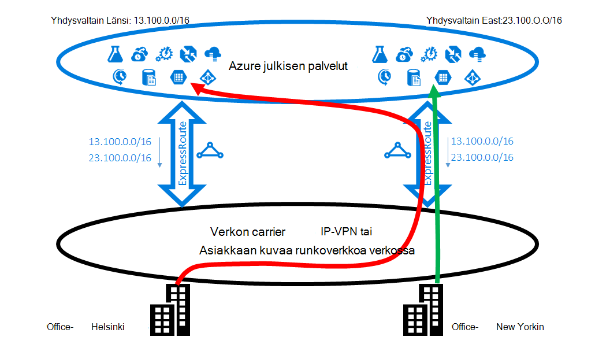
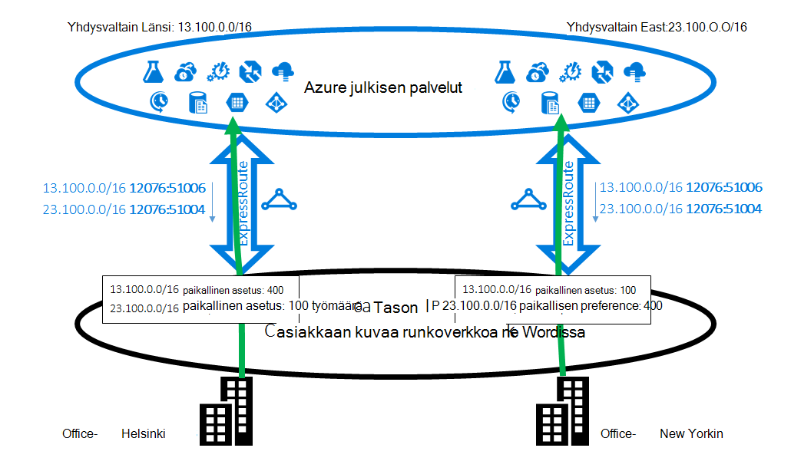
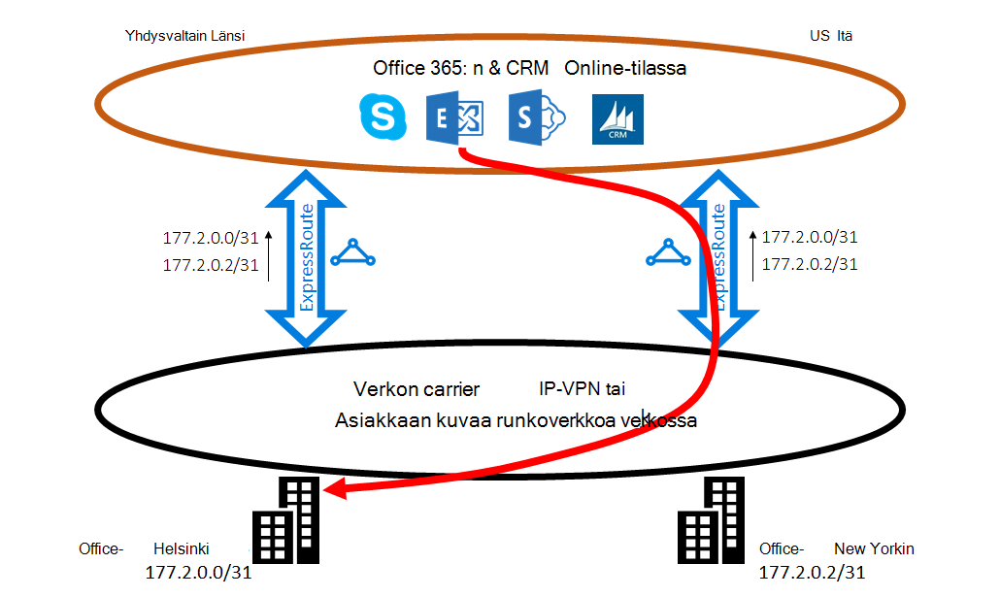
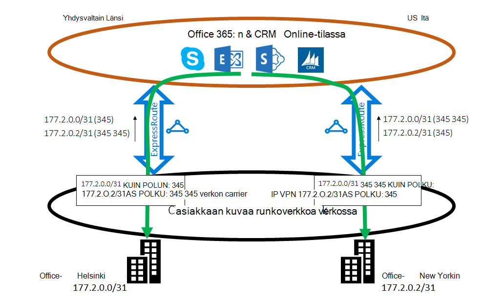

<properties
   pageTitle="Optimoi ExpressRoute reititys | Microsoft Azure"
   description="Tällä sivulla on tietoja siitä, miten voit optimoida reititys, kun asiakkaalla on useampi kuin yksi ExpressRoute piirit, jotka muodostavat Microsoftin corp asiakasverkoston välillä."
   documentationCenter="na"
   services="expressroute"
   authors="charwen"
   manager="carmonm"
   editor=""/>
<tags
   ms.service="expressroute"
   ms.devlang="na"
   ms.topic="get-started-article"
   ms.tgt_pltfrm="na"
   ms.workload="infrastructure-services"
   ms.date="10/10/2016"
   ms.author="charwen"/>

# Optimoi ExpressRoute reititys
Jos sinulla on useita ExpressRoute piirit, sinulla on useampi kuin yksi polku muodostaa yhteyden Microsoft. Tuloksena lainkaan reititys voi ilmetä - eli tietoliikenteestä saattaa kestää kauemmin polku muodostaa yhteys Microsoftin ja Microsoft verkkoon. Pidempi verkkopolun, mitä suurempi viive. Viive on suora vaikutus sovellusten suorituskykyä ja käyttäjäkokemuksen. Tässä artikkelissa kuvaavat ongelman ja kerrotaan, kuinka voit optimoida reititys vakio reititys-tekniikoiden avulla.

## Lainkaan reititys tapaus 1
Seuraavaksi tutustumme Sulje reitityksen ongelma esimerkin mukaan. Kuvitellaan, sinulla on kaksi toimistot US Helsinki ja yksi tekstimuodossa New Yorkissa. Oman toimistot on yhdistetty-leveä alueen Network (WAN), joka voi olla kuvaa runkoverkkoa-verkon tai -palveluntarjoajan IP VPN. Sinulla on kaksi ExpressRoute piirit, toinen US Länsi ja toinen US Itä, joka on yhdistetty myös WAN. Selvästi sinulla on kaksi polkua, voit muodostaa yhteyden Microsoft-verkkoon. Nyt Kuvitellaan on US Länsi ja US Itä Azure käyttöönoton (kuten Azure App Service). Aiot on yhdistää Helsinki käyttäjät Azure US Länsi ja New Yorkin Azure US Itä-käyttäjien koska palvelujen järjestelmänvalvoja ilmoittaa, että käyttäjät kunkin Office käyttää optimaalisen kokemukset lähellä Azure-palvelut. Valitettavasti suunnitelman toimii Itä leveyttä käyttäjille mutta länsirannikko-käyttäjille. Ongelman aiheuttaja on seuraava. Valitse kunkin ExpressRoute piiri on mainostaa sinulle Azure US Itä (23.100.0.0/16) etuliite ja Azure US Länsi (13.100.0.0/16) etuliite. Jos et tiedä, mikä etuliite on mitä alueelta, et voi käsitellä eri tavalla. WAN-verkon saattaa tuntua molemmat etuliitteitä ovat lähempänä US Itä kuin US Länsi ja reitittää vuoksi sekä office-käyttäjien US Itä ExpressRoute-piiri. Valitse lopuksi on monta palaamaan Helsinki Officessa.

### Ratkaisu: Käytä erityisen yhteisöjen
Optimoi reititys sekä office-käyttäjille, sinun tarvitsee tietää, mitkä etuliite on Azure US Länsi ja jotka Azure US Itä. Olemme koodata tiedot [Erityisen yhteisön](expressroute-routing.md)arvoilla. Microsoft on määritetty yksilöllinen arvo erityisen yhteisön Azure alueittain, esimerkiksi "12076:51004" US Itä, "12076:51006" US Länsi. Nyt, kun tiedät, mitä etuliite on mitä Azure alueelta, voit määrittää, mitkä ExpressRoute piiri pitäisi olla ensisijainen. Koska erityisen avulla exchange reititys tiedot, voit käyttää erityisen on paikallinen asetus vaikuttaa reititys. Tässä esimerkissä voit määrittää paikallisen preference suuremmat arvot, US Länsi kuin US Itä-13.100.0.0/16 ja vastaavasti paikallisen preference suuremmat arvot US Itä kuin US Länsi-23.100.0.0/16. Määritysten varmistaa, että kun sekä Microsoft polut ovat käytettävissä, Helsinki käyttäjät tulevat ExpressRoute piiri US Länsi muodostaa Azure US Länsi New Yorkissa käyttäjien otettava ExpressRoute US Itä-Azure US Itä. Reititys on optimoitu molemmille puolille. 

## Lainkaan reititys tapaus 2
Seuraavassa on toinen esimerkki jossa yhteydet Microsoftin kestää kauemmin polku saavuttamiseksi verkossa. Tässä tapauksessa voit käyttää paikallisen Exchange-palvelimet ja Exchange Onlinen [yhdistelmäympäristön](https://technet.microsoft.com/library/jj200581%28v=exchg.150%29.aspx). Oman toimistot on yhdistetty WAN. Paikallisen palvelinten sekä oman toimistot Microsoftille kautta kaksi ExpressRoute virtapiirit etuliitteiden mainostaa. Exchange Onlinen aloittaa yhteydet tapauksissa, kuten postilaatikon siirtäminen paikalliseen-palvelimiin. Valitettavasti Helsinki office yhteys reititetään US Itä ExpressRoute-piiri ennen koko mantereelle Edellinen siirtyä leveyttä. Ongelman aiheuttaja on samankaltainen kuin ensimmäisen vaiheen. Ilman mitään Vihje Microsoft network ei tiedä, mitä asiakkaalle etuliitteen on lähellä US Itä ja mikä on lähellä US Länsi. Valitse Office-Helsinki virheellinen polun tähän.

### Ratkaisu: Käytä AS POLKU soluviittauksen eteen
Ongelman kaksi ratkaisuja. Ensimmäinen on, että vain mainostaa paikallisen etuliite Helsinki Officen 177.2.0.0/31 ExpressRoute piirin US Länsi- ja paikallisen että etuliite New Yorkissa Officen 177.2.0.2/31 ExpressRoute piirin US Itä. Tuloksena on vain yksi Microsoft muodostaa kunkin käyttäjän toimistot polku. Ei ole moniselitteisyyden ja reititys on optimoitu. Tämän rakenteen kanssa, sinun täytyy ottaa huomioon yrityksen automaattisesti määrittäminen. Silloin, kun Microsoft kautta ExpressRoute polku on katkaistu, tarvitset varmistaaksesi, että Exchange Onlinen edelleen muodostaa paikallisen-palvelimiin. 

Toinen ratkaisu on, että jatkat kertoo molempien käyttöön sekä ExpressRoute piirit etuliitteiden ja lisäksi annat meille mitä etuliitteen vihje on lähellä kumpaa oman toimistot. Koska tuetaan erityisen kuin polun soluviittauksen eteen, voit määrittää AS polku, että etuliite vaikuttaa reititys. Tässä esimerkissä voit pidentää US Itä 172.2.0.0/31 kuin POLUN niin, että olemme mieluummin ExpressRoute piiri US Länsi, tietoliikenteen, joka on tarkoitettu Tämä etuliite (kuten sivustoissamme ajatella, tämä etuliite polku on lyhyempi Länsi). Voit vastaavasti pidentää US Länsi 172.2.0.2/31 kuin POLUN niin, että olemme mieluummin US Itä ExpressRoute-piiri. Reititys on tarkoitettu sekä toimistot. Rakenteellinen, jos yksi ExpressRoute piiri katkeaa, Exchange online-tilassa voit edelleen vastaanotettavien henkilöihin toiseen ExpressRoute piiri ja että WAN. 

>[AZURE.IMPORTANT] Microsoft poistaa yksityinen LUKUINA vastaanotettu: Microsoft Peering etuliitteiden kuin POLUN. Sinun on liitettävä julkisen LUKUINA vaikuttaa reititys Microsoft Peering AS polku.

>[AZURE.IMPORTANT] Esimerkit tähän aikana ja julkisen peerings on yksityinen peering samat mahdollisuudet tuki. Lisäksi AS polku soluviittauksen eteen works sisällä yhden yksittäisen ExpressRoute piiri vaikuttaa ensisijainen ja toissijainen polut valintaa.
