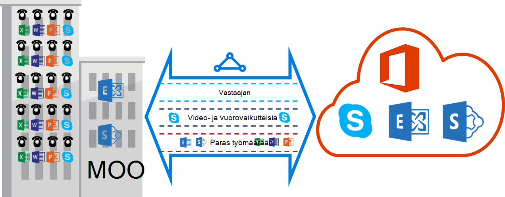

<properties
   pageTitle="QoS vaatimukset ExpressRoute | Microsoft Azure"
   description="Tällä sivulla on vaatimukset määrittämisestä ja hallinnasta QoS ExpressRoute piirit."
   documentationCenter="na"
   services="expressroute"
   authors="cherylmc"
   manager="carmonm"
   editor=""/>
<tags
   ms.service="expressroute"
   ms.devlang="na"
   ms.topic="get-started-article"
   ms.tgt_pltfrm="na"
   ms.workload="infrastructure-services"
   ms.date="10/10/2016"
   ms.author="cherylmc"/>

# ExpressRoute QoS vaatimukset

Skype for Businessissa on eri toiminnoista, jotka edellyttävät eriteltyjen QoS käsittelyä. Jos aiot käyttää voice palveluita ExpressRoute kautta, noudata vaatimuksia seuraavalla tavalla.

>[AZURE.NOTE] QoS vaatimukset koskevat vain peering Microsoft. Verkkoliikennettä vastaanotetut Azure julkisen peering ja Azure yksityinen peering DSCP arvot palautetaan 0. 

Seuraavassa taulukossa on luettelo DSCP merkinnät käyttää Skype for Business. Viittaavat [Hallinta QoS Skype for Businessin](https://technet.microsoft.com/library/gg405409.aspx) lisätietoja.

| **Liikenne luokan** | **Käsittely (DSCP merkintä)** | **Skype for Business-toiminnoista** |
|---|---|---|
| **Vastaajan** | EF (46) | Skype / Lync-ääni |
| **Vuorovaikutteinen** | AF41 (34) | Video |
|   | AF21 (18) | Sovelluksen jakaminen | 
| **Oletusarvo** | AF11 (10) | Tiedostojen siirtäminen|
|   | CS0 (0) | Oliko vielä muuta| 

- Olisi työtaakkaa luokitella ja merkitä oikean DSCP-arvoja. Noudata siinä annettuja ohjeita [tähän](https://technet.microsoft.com/library/gg405409.aspx) määrittämisestä DSCP merkinnät verkossa.

- Kannattaako määrittäminen ja tukee useita QoS olevien verkossa oleville. Vastaajan on erillinen luokan ja vastaanottaa RFC 3246-parametrissa EF käsittelyä. 

- Voit päättää queuing järjestelmä, kuormituksen tunnistus käytännön ja kaistanleveyden varattavan liikenne luokka. Mutta DSCP merkintä Skype for Business-toiminnoista on säilytettävä. Jos käytössäsi on DSCP merkinnät ole luettelossa, kuten AF31 (26), DSCP arvoksi 0 täytyy kirjoittaa ennen kuin lähetät Microsoft pakettia. Microsoft lähettää vain paketteja, jotka on merkitty edellä olevassa taulukossa näkyy DSCP-arvo. 

## Seuraavat vaiheet

- Lisätietoja [Reititys](expressroute-routing.md) ja [NAT](expressroute-nat.md)koskevat vaatimukset.
- Katso ExpressRoute-yhteyden määrittäminen linkkejä.

    - [Luo ExpressRoute piiri](expressroute-howto-circuit-classic.md)
    - [Määritä reititys](expressroute-howto-routing-classic.md)
    - [Linkin VNet ExpressRoute piiri](expressroute-howto-linkvnet-classic.md)
