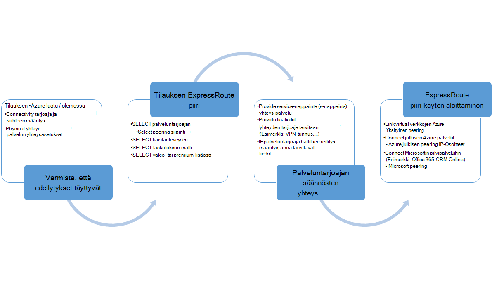
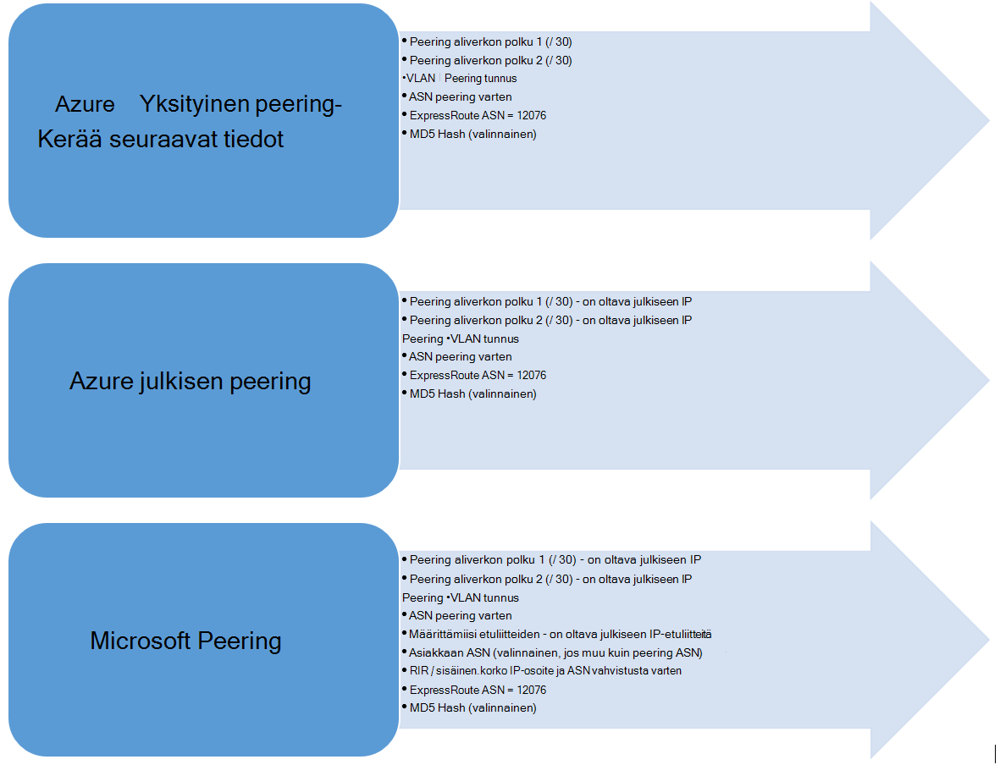

<properties
   pageTitle="Työnkulut määrittäminen ExpressRoute piiri | Microsoft Azure"
   description="Tällä sivulla esitellään ExpressRoute piiri ja peerings työnkulut"
   documentationCenter="na"
   services="expressroute"
   authors="cherylmc"
   manager="carmonm"
   editor="" />
<tags
   ms.service="expressroute"
   ms.devlang="na"
   ms.topic="article" 
   ms.tgt_pltfrm="na"
   ms.workload="infrastructure-services"
   ms.date="10/10/2016"
   ms.author="cherylmc"/>

# Piiri valmistelu ja piiri Yhdysvaltojen ExpressRoute työnkulut

Tällä sivulla esitellään valmistelu ja reititys määritysten työnkulut ylätasolla palvelun.

Seuraavassa kuvassa ja vastaavat vaiheet Näytä tehtävät, jotta on valmisteltu ExpressRoute-piiri on seurattava lopusta loppuun. 

1. Määritä ExpressRoute piiri PowerShellin avulla. Lisätietoja [luominen ExpressRoute piirit](expressroute-howto-circuit-classic.md) -artikkelin ohjeiden.

2. Tilauksen connectivity-palveluntarjoajalta. Tämä toimenpide vaihtelee. Lisätietoja siitä, miten voit tilata connectivity connectivity palveluntarjoajalta.

3. Varmista, että virtapiirin on valmisteltu onnistuneesti vahvistamalla ExpressRoute virtapiirin valmistelu tilan PowerShellin kautta. 

4. Määritä reititys toimialueet. Jos yhteys palveluntarjoaja hallitsee Layer 3 puolestasi, ne määrittää oman piiri reititys. Jos yhteys-palveluntarjoajan tarjoaa vain Layer 2 palveluja, sinun on määritettävä Reititys ohjeiden [Reititys vaatimukset](expressroute-routing.md) ja [reitityksen kokoonpano](expressroute-howto-routing-classic.md) -sivuilla on kuvattu.

    -  Ota käyttöön Azure yksityinen peering - sinun on otettava peering voit muodostaa yhteyden VMs / cloud services puitteissa virtual käyttöön.
    -  Ota käyttöön Azure julkisen peering - Azure julkisen peering Jos haluat muodostaa yhteyden Azure julkisten IP-osoitteiden maksuttomien palveluiden on otettava käyttöön. Tämä on Azure resurssien käytön, jos olet valinnut käyttöön oletusarvoinen reititys Azure yksityinen peering.
    -  Ota käyttöön Microsoft peering - sinun on otettava Office 365: ssä ja CRM online-palveluihin. 
    
    >[AZURE.IMPORTANT] Varmista, että käytät eri välityspalvelimen / reunan muodostaa yhteyden Microsoft kuin se, voit käyttää Internet. Käyttää samaa reunaa ExpressRoute ja Internetin aiheuttaa julkiseen reititys ja aiheuttaa connectivity katkokset verkkoa varten.

    

5. Linkittäminen virtual verkkojen ExpressRoute piirit -, voit linkittää virtual verkkojen ExpressRoute piiri. Seuraa ohjeita [Voit linkittää VNets](expressroute-howto-linkvnet-arm.md) oman piiri. Nämä VNets voivat olla sama ExpressRoute piiri Azure-tilauksen tai voi olla eri tilauksen.

## ExpressRoute piiri hyötyä valmistelu

Kunkin ExpressRoute piiri on kaksi:

- Palveluntarjoajan valmistelu tilan
- Tila

Tila edustaa Microsoftin valmistelu tilaa. Tämän ominaisuuden arvoksi asetetaan käytössä, kun luot Expressroute piiri

Yhteyden tarjoaja valmistelu tilan edustaa connectivity kehittäjän reunassa. Ne voivat olla *NotProvisioned*, *Provisioning*tai *Provisioned*. ExpressRoute piiri on oltava Provisioned-tilassa, voit käyttää sitä.

### ExpressRoute piiri mahdolliset tilat

Tässä osassa on luettelo ExpressRoute piiri mahdolliset tilat ulos.

#### Luonnin aikana

Näkyviin tulee ExpressRoute virtapiirin seuraavassa vaiheessa heti, kun suoritat Luo ExpressRoute piiri PowerShell cmdlet-komennon.

    ServiceProviderProvisioningState : NotProvisioned
    Status                           : Enabled

#### Kun yhteys tarjoajan parhaillaan virtapiirin valmistelu

Näkyviin tulee ExpressRoute virtapiirin seuraavassa vaiheessa heti palvelun avainta välittää yhteyden toimittaja ja hän on aloittanut valmistelu prosessi.

    ServiceProviderProvisioningState : Provisioning
    Status                           : Enabled

#### Kun yhteys-palvelu on valmis valmistelu prosessi

Näet seuraavat tilaan ExpressRoute virtapiirin heti, kun yhteys-palvelu on valmis valmistelu prosessi.

    ServiceProviderProvisioningState : Provisioned
    Status                           : Enabled

Valmisteltu ja käytössä on ainoastaan tilan virtapiirin voi olla voit käyttää sitä. Jos käytössäsi on tason 2 palveluntarjoaja, voit määrittää reititys oman piiri vain, kun se on tässä tilassa.

#### Kun yhteys-palvelu on valmistelun virtapiirin poistaminen

Palveluntarjoajan deprovision ExpressRoute piiri pyydettäessä näet piiri, Määritä seuraavat tilaan, kun palveluntarjoaja deprovisioning prosessi on valmis.

    ServiceProviderProvisioningState : NotProvisioned
    Status                           : Enabled

Voit valita käyttöön sen uudelleen, jos tarvitaan tai suorittaa PowerShellin cmdlet-komennot, jos haluat poistaa virtapiirin.  

>[AZURE.IMPORTANT] Jos suoritat PowerShell cmdlet-komento, voit poistaa virtapiirin valmisteltaessa ServiceProviderProvisioningState tai Provisioned toiminto epäonnistuu. Ota yhteys-palveluntarjoajan deprovision ExpressRoute piiri ensin käsitteleminen ja poista sitten virtapiirin. Microsoft laskuttaa virtapiirin, ennen kuin suoritat PowerShell cmdlet-komennon poistaminen virtapiirin edelleen.

## Reititys istunnon määritysten tila

Valmistelu tilan erityisen ilmoittaa, jos erityisen istunnon on otettu käyttöön Microsoft edge. Siinä on otettava käyttöön, voit käyttää peering.

On tärkeää tarkistaa erityisesti niiden Microsoft peering erityisen istunnon-tila. Erityisen, valmistelu tila on nimeltään *määrittämiisi julkisen etuliitteiden tilan*toiseen tilaan. Ilmoitettua julkisen etuliitteiden tilan on oltava *määritetty* vaiheeseen, sekä määrittäminen on erityisen-istunnon ja reitittämiseen toimimaan lopusta loppuun. 

Jos ilmoitettua julkisen etuliite tila on määritetty *vahvistus tarvitaan* tilaan, erityisen istunnon ei ole otettu käyttöön, kun ilmoitettua etuliitteitä ei vastannut kaikista reititys paikallisrekisterit AS-numero. 

>[AZURE.IMPORTANT] Jos ilmoitettua julkisen etuliitteiden tila on *Manuaalinen vahvistus* -tilaan, Avaa tuki lippu [Microsoft-tuki](https://portal.azure.com/?#blade/Microsoft_Azure_Support/HelpAndSupportBlade) ja näyttöä, jotka omistat määrittämiisi pitkin on liitetty yksipuolisia järjestelmän numero IP-osoitteet.

## Seuraavat vaiheet

- Määritä ExpressRoute-yhteys.

    - [Luo ExpressRoute piiri](expressroute-howto-circuit-arm.md)
    - [Määritä reititys](expressroute-howto-routing-arm.md)
    - [Linkin VNet ExpressRoute piiri](expressroute-howto-linkvnet-arm.md)
