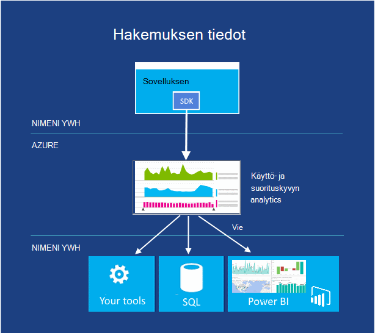
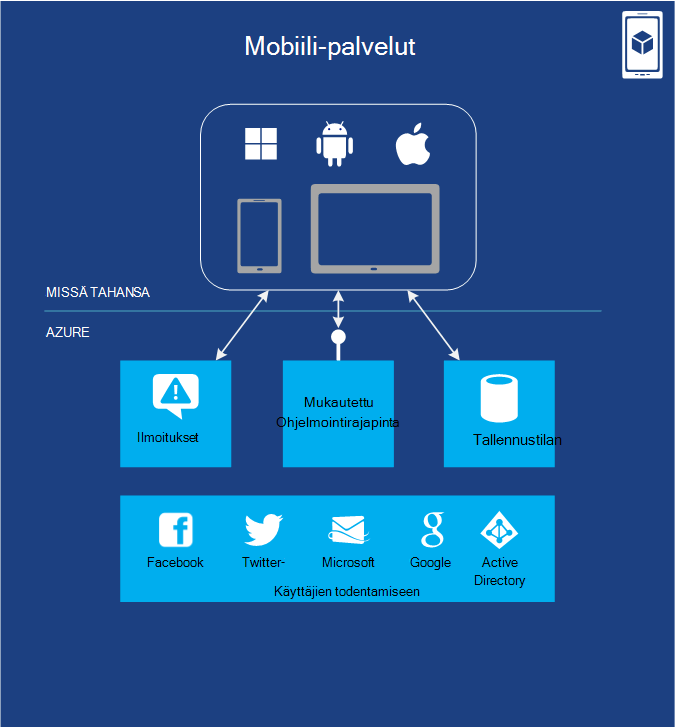

<properties
    pageTitle="Johdanto Microsoft Azure | Microsoft Azure"
    description="Uusi Microsoft Azure? Hae yhteenveto palveluja siinä on esimerkkejä siitä, miten ne ovat hyödyllisiä."
    services=" "
    documentationCenter=".net"
    authors="rboucher"
    manager="carolz"
    editor=""/>

<tags
    ms.service="multiple"
    ms.workload="multiple"
    ms.tgt_pltfrm="na"
    ms.devlang="na"
    ms.topic="article"
    ms.date="06/30/2015"  
    ms.author="robb"/>

# Microsoft Azure esittely

Microsoft Azure on Microsoftin sovelluksen ympäristö julkisen pilveen.  Tässä artikkelissa on antamaan sinulle perustan Azure-ohjelmoinnin perusteet ymmärtämään, vaikka et tietäisi mitään tietoja cloud tietojenkäsittely.

**Tässä artikkelissa lukeminen**

Azure kasvaa koko ajan, jolloin on helppo kuormitu.  Aloita basic-palveluja, jotka on lueteltu tämän artikkelin ensin ja siirry sitten lisäpalveluja. Joka ei tarkoita, et voi käyttää vain lisäpalveluja yksinään, mutta basic-palveluja muodostavat sovelluksen Azure-tietokannassa.

**Anna palautetta**

Palautteen on tärkeää. Tässä artikkelissa tulisi ilmoittaa sinulle Azure tehokkaita yleiskatsaus. Jos sitä ei näy, kerro sivun alareunassa kommentit-kohtaan. Anna olettaa näkevän ja parantamisesta on artikkelissa yksityiskohtaisesti.  

## Azure osat

Azure ryhmien palveluiden hallinta-portaalin ja eri visuaaliset apuvälineet, kuten [Mikä on Azure Infographic](https://azure.microsoft.com/documentation/infographics/azure/) luokkiin. Hallinta-portaali on käyttää hallitsemiseen Azure useimmat (mutta ei kaikkiin) palvelut.

Tässä artikkelissa käyttämällä **eri organisaatiossa** palvelut samanlaisen perustuu tietoja ja korostaa tärkeitä aliraportti palvelut, jotka ovat suurempia niistä.  

   
 *Kuva: Azure on Internet-käytettävissä sovelluspalveluja Azure palvelinkeskusten käytössä.*

## Hallinta-portaalissa
Azure on web-liittymän nimi, jota järjestelmänvalvojat voivat käyttää ja hallita eniten [Hallinta-portaalin](http://manage.windowsazure.com) , mutta ei kaikkia Azure ominaisuuksia.  Microsoft julkaisee beta uudempaan Käyttöliittymä-portaalia yleensä ennen vanhempia yksi poistamisesta. Uudemmassa kutsutaan ["Azure esikatselu Portal"](https://portal.azure.com/).

Ei yleensä pitkä limitys kun molemmat yhteisöportaaleista on aktiivinen. Kun core services näkyvät sekä portaaleihin, kaikki toiminnot eivät ole käytettävissä sekä. Uudempaan services voi näyttää uudempaan portaalin ensimmäisen tai sitä vanhemmat versiot-palveluissa ja toiminnot voivat olla vain vanhat yksi.  Viesti tähän on, jos et löydä vanhempia-portaaliin, tarkista uudempaan versioon ja päinvastoin.

## Laske

Cloud-ympäristössä onko yleisin toimea on suorittaa sovellukset. Azure Laske-malleja on oma rooli, jotta voit toistaa.

Voit käyttää seuraavia tekniikoita erikseen tai yhdistää ne sovelluksen oikean foundation luomiseksi. Voit valita, riippuu siitä, mitä ongelmia lähestymistapa yrität ratkaista.

### Azure-Virtuaalikoneissa

   
*Kuva: Azure-Virtuaalikoneissa avulla voit virtuaalikoneen esiintymissä pilveen täydet oikeudet.*

Mahdollisuus luoda virtual machine pyydettäessä, onko vakio kuvasta tai yhdestä annat, voi olla erittäin hyödyllistä. Tämä vaihtoehto, yleisesti tunnettu infrastruktuurin serviceksi (IaaS) on Azuren näennäiskoneiden on. Kuvassa 2 on yhdistelmä virtuaalikoneen (AM)-ohjelman suorittamistavan ja miten voit luoda työkirjaa Näennäiskiintolevyn.  

Voit luoda AM määrittämällä mitä Näennäiskiintolevyn ja AM kokoa.  Voit maksaa sitten ajankohtaan, joka AM on käynnissä. Voit maksaa minuutit ja vain silloin, kun se on käynnissä, mutta ei käytettävissä Näennäiskiintolevyn säilyttämisestä mahdollisimman vähän tallennustilan varausta. Azure on kalusto näennäiskiintolevyjen (eli "kuvat"), jotka sisältävät käynnistettävän käyttöjärjestelmän käynnistäminen valikoiman. Näitä ovat sekä kumppaneiden asetukset, kuten Windows Server ja Linux, SQL Server, Oracle ja monista muista. Olet vapaasti näennäiskiintolevyjen ja kuvien luominen ja lataa ne sitten itse. Voit ladata jopa näennäiskiintolevyjen, joka sisältää vain tiedot ja käyttää niitä missä käynnissä VMs.

Kaikkialla, missä Näennäiskiintolevyn peräisin, voit tallentaa muutokset AM on käynnissä pysyvästi. Kun seuraavan kerran AM luominen SITEN, että, mihin viimeksi jäit Nosta asioita. Näennäiskiintolevyt, Edellinen näennäiskoneiden on tallennettu Azuren tallennustilaan BLOB-objektit, jotka käsittelemme myöhemmin.  Tämä tarkoittaa saat luotettavuutta varmistaa, että VMs ei katoavat laitteisto ja levyn virheiden vuoksi. On myös mahdollista kopioida muutetun Näennäiskiintolevyn Azure ulos ja valitse Suorita se paikallisesti.

Sovelluksen suoritetaan vähintään yksi näennäiskoneiden, sen mukaan, miten se ennen on luotu tai päättää luominen alusta alkaen nyt.

Tämä varsin yleisen lähestymistavan cloud tietojenkäsittely avulla voidaan käsitellä useita eri ongelmia.

**Virtuaalikoneen skenaariot**

1.  **Keskihajonta/testi** - niiden avulla voi luoda edullinen kehitys- ja ympäristössä, Sammuta voit kun lopetat sen käyttämisen. Voi myös luominen ja suorittaminen jostakin kielet ja pidät kirjastojen käyttävistä sovelluksista. Näiden sovellusten voi käyttää mitä tahansa, joka sisältää Azure, ja voit myös käyttää SQL Server tai toiseen käynnissä vähintään yksi näennäiskoneiden DBMS tietojen hallinta-asetukset.
2.  **Siirrä sovellusten Azure (hissin-ja-vaihto)** – "Hissin-ja-vaihto" viittaa siirtäminen sovelluksen paljon, kuten suuri kohteen siirtäminen käytetään trukilla.  "Nosta" Näennäiskiintolevyn-että paikallinen palvelinkeskuksen ja "siirtyvät" se Azure ja suorittaa sen.  Sinun on yleensä joitakin työt, voit poistaa riippuvuudet muista järjestelmistä. Jos määritettynä on liian monta, voit valita vaihtoehto 3 sijaan.  
3.  **Laajenna oman palvelinkeskuksen** - käyttäminen Azure VMs tiedostotunnistetta paikallisen-palvelinkeskuksen kuin SharePoint-tai muissa sovelluksissa. Tukemaan tämä on mahdollista luominen Windows-toimialueiden pilvipalvelussa suorittamalla Active Directory-Azure VMs. Voit käyttää Azure Virtual Network (mainitaan myöhemmin) ja useiden kuin paikalliseen verkkoon kirjauduttaessa ja verkon Azure-tietokannassa yhdessä.

### Web Apps-sovelluksista

   
 *Kuva: Azure verkkosovelluksissa suorittaa sivuston sovelluksen pilveen eikä sinun tarvitse pohjana verkkopalvelin hallinta.*

Yleisimmät asiaan henkilöiden tehtävät, pilveen suoritetaan sivustot ja web-sovellukset. Azuren näennäiskoneiden sallii tämän, mutta se jättää voit edelleen mukaisesti vähintään yksi VMs ja pohjana käyttöjärjestelmät hallinta. Cloud services web-rooleja voit tehdä tämän, mutta käyttöönotto ja niiden ylläpito tulee silti hallinnollisen työn.  Jos haluat ainoastaan sivuston Jos joku muu on huolellisesti hallinnollisen työn puolestasi?

Tämä on täsmälleen Web Apps-sovellusten avulla. Laske tämä malli on ohjatulla Azure hallinta-portaalin sekä ohjelmointirajapinnan hallitun Verkkoympäristössä. Voit siirtää aiemmin luodun sivuston-sovelluksen Web Apps-sovellusten muuttumattomina tai voit luoda uuden suoraan pilvipalvelussa. Kun sivusto on käynnissä, lisäät tai poistat esiintymät dynaamisesti käyttäisit Azure verkkosovelluksissa voivat ladata ne yli. Azure sovellukset on jaettu-vaihtoehto, jossa sivuston suoritetaan virtual koneen muiden sivustojen kanssa, ja Vakio asetus, jonka avulla voit suorittaa Oma AM sivuston. Vakio-vaihtoehdon avulla voit suurentaa (tietojenkäsittely power) kopioita tarvittaessa.

Kehittämiseen verkkosovelluksissa tukee .NET, PHP, Node.js, Java ja Python sekä SQL-tietokantaan ja MySQL (-ClearDB, Microsoft-kumppani) relaatio tallennustilan. Se on myös tukee useita Suositut sovellusten, kuten WordPress, Joomla ja Drupal. Tavoitteena on säätää edullinen, skaalattava ja laajasti hyödyllisiä ympäristö sivustot ja web-sovellusten luominen julkisen pilveen.

**Web Apps-skenaariot**

Web Apps on tarkoitus olla hyödyllistä yritykset, kehittäjille ja web rakenne virastoille. Yritykset se on helppoa hallinta, skaalattava suojatuissa tai erittäin käytettävissä ratkaisu tavoitettavuuden sivustojen suorittamista varten. Kun haluat-sivusto, on parasta aloittaminen Azure Web Apps-sovellusten ja siirry pilvipalveluihin, kun tarvitset ominaisuutta, jota ei ole käytettävissä. Artikkelissa on linkkejä, joiden avulla voit valita vaihtoehdoista "Laske"-osassa loppuun.

### Pilvipalveluihin
   
*Kuva: Azure pilvipalveluihin sisältää erittäin skaalattava mukautettua koodia suoritettaviksi ympäristö kuin ympäristössä, jossa on Service (PaaS) sijainti*

Oletetaan, että haluat luoda cloud-sovellus, joka tukee useita samanaikaisia käyttäjiä ei edellytä paljon hallinta ja siirtyy aina. Haluat ehkä muodostettu ohjelmistotoimittaja, esimerkiksi, joka on päättänyt laajuisiksi ohjelmiston palveluna (SaaS) rakentamalla yhtä sovelluksista pilveen versio. Tai ehkä pysäyttämisestä, kuluttaja-sovellus, jossa oletat kasvaa nopea luominen. Jos luot Azure-suorittamisen malli kannattaa käyttää?

Azure Web Apps-sovellusten avulla luodaan tällaisen web-sovelluksen, mutta sillä on joitakin rajoituksia. Sinulla ei ole järjestelmänvalvojan oikeudet, kuten mikä tarkoittaa, että et voi asentaa haluamaansa ohjelmiston. Azure-Virtuaalikoneissa avulla voit joustava, järjestelmänvalvojan oikeudet, mukaan lukien ja varmasti voit luoda hyvin skaalattava sovelluksen, mutta sinun on käsitellä monia luotettavasti ja hallinta. Mitä haluat on vaihtoehto, jonka avulla voit ohjausobjekti on mutta käsittelee myös suurimman osan luotettavuutta ja hallinta.

Tämä on täsmälleen mikä tarjoaa Azure pilvipalveluihin. Tämä tekniikka on suunniteltu nimenomaisesti tukemaan skaalattava, luotettavia ja pieni järjestelmänvalvojan sovellukset ja se on esimerkki siitä, mikä on tunnetaan yleisesti nimellä Platform palveluna (PaaS). Voit käyttää avulla voit valita esimerkiksi C#, Java, PHP, Python, Node.js tai jotakin muuta tekniikka ‑sovelluksen luominen. Koodin suorittaa näennäiskoneiden (jota kutsutaan esiintymät)-käyttöjärjestelmän versio Windows Server.

Mutta näitä VMs poikkeavat Azuren näennäiskoneiden ja luoda niistä. Saat kuitenkaan, Azure itse hallitseeko niitä tavoilla kuten asentaminen käyttöjärjestelmän korjaukset ja kuvat automaattisesti juoksevan uusi asennettu. Tämä tarkoittaa sitä, että sovelluksesi ei kannata säilyttää tilan verkossa tai työntekijän rooli tilanteissa; se tulisi säilyttää sen sijaan johonkin seuraavan osion ohjeiden Azure tietojen hallinta-asetukset. Azure valvoo myös nämä VMs uudelleenkäynnistyksen kaikki kyseisen epäonnistuu. Voit määrittää pilvipalveluihin luo automaattisesti tarvittaessa vastauksena enemmän tai vähemmän esiintymät. Näin voit käsitellä parantavat käyttö ja Skaalaa sitten takaisin, jotta eivät ole maksaa yhtä paljon, kun kyseessä on vähemmän käyttö.

Sinulla on kaksi roolia valittavana, kun luot erillisen, molemmat perustuvat Windows Server. Tärkein kahden välinen ero on, että web-roolin esiintymä suoritetaan IIS-, kun esiintymän työntekijän rooli ei tue. Molemmat hallitaan samalla tavalla, ja yhteistä sovelluksen käyttämään molemmat. Web-roolin esiintymän voi esimerkiksi Hyväksy pyyntöjä käyttäjiltä sitten välittää Työntekijä-roolin esiintymän käsittelyä varten. Skaalata sovelluksesi, ylös tai alas, voit pyytää Azure esiintymiä joko roolin luominen tai Sammuta esiintymät. Ja tavoin voit Azuren näennäiskoneiden sinun on perittävän vain aika, että kunkin web- tai työntekijän rooli on käynnissä.

**Cloud Services-skenaariot**

Cloud Services-palvelut ovat ihanteellinen tukemaan valtaviin mittakaava, kun on enemmän hallintaa platform kuin myöntämä Azure Web Apps-sovelluksista, mutta hallintaoikeutta pohjana käyttöjärjestelmä, jota et tarvitse.

#### Laske-mallin valitseminen
Sivulla [Azure Web Apps -sovellusten ja pilvipalveluihin näennäiskoneiden vertailu](./app-service-web/choose-web-site-cloud-service-vm.md) on lisätietoja siitä, miten voit valita mallin suorittaminen.

## Tietojen hallinta

Sovellukset on tietoja ja sovelluksia erilaisia on erilaisia tietoja. Tästä syystä Azure on useita eri tapoja tallentamiseen ja tietojen hallinta. Azure tarjoaa useita tallennusasetukset, mutta kaikki on suunniteltu hyvin kestävät tallennustilan.  Jokin seuraavista vaihtoehdoista, jossa on aina 3 eri versioista säilytetään synkronoinnissa yli Azure palvelinkeskukseen--6, jos sallit Azure käyttämään geo redundancy toiseen palvelinkeskukseen vähintään 300 Mailia poissa varmuuskopioida tiedot.     

### Näennäiskoneiden
Mahdollisuus suorittaa AM, joka on luotu ja Azuren näennäiskoneiden SQL Server tai toisen DBMS jo on mainittu. Huomaat, että tämä vaihtoehto ei ole rajoitettu relaatio järjestelmien; on myös maksuttomia suorittaa NoSQL tekniikoita, kuten MongoDB ja Cassandra. Suorittaminen Tietokantajärjestelmä on helppoa, it rinnakkaisnäytteitä käytettävä oman palvelinkeskusten harjoitteluistonto-, mutta se vaatii myös käsittely kyseisen DBMS hallinta.  Muut asetukset Azure käsittelee useita tai kaikki hallinta puolestasi.

Uudelleen virtuaalikoneen ja kaikki tiedot levyn luodaan tai ladataan tilan varmuuskopioidaan blob storage (joka käsittelemme myöhemmin) mukaan.  

### Azure SQL-tietokanta
   

*Kuva: Azure SQL-tietokanta on hallitun relaatiotietokannasta palvelu pilvipalvelussa.*

Suhteellinen tallennustilan Azure tarjoaa ominaisuus SQL-tietokantaan. Älä anna huijata nimeäminen. Tämä on sama kuin tavallinen SQL-tietokantaan Windows Server päälle SQL Serveriä varten.  

Aiemmin SQL Azure-Azure SQL-tietokanta sisältää kaikki relaatiotietokannasta hallintajärjestelmän, käytettäviä jakamattomia tapahtumia, kuten samanaikainen tietojen käyttö useiden käyttäjien tietojen eheys, ANSI SQL-kyselyjä ja tuttuja ohjelmoinnin mallin ominaisuuksia. SQL Server- ja SQL-tietokanta voidaan käyttää käyttämällä kohteen Framework, kuten ADO.NET, JDBC ja muiden tuttuja tietojen käyttää tekniikoita. Se tukee myös irti T-SQL-kielen sekä SQL Server-työkaluja, kuten SQL Server Management Studiossa. Kuka tahansa käyttäjä, tuttuja SQL Server (tai muusta relaatiotietokannasta) käyttämällä SQL-tietokanta on helppoa.

Mutta SQL-tietokanta ei ole juuri tietokannan Hallintajärjestelmään cloud-se on PaaS palvelu. Voit edelleen määrittää tietojen ja kuka voi käyttää, mutta SQL-tietokanta on huolellisesti järjestelmänvalvojan grunt työn, kuten laitteisto-infrastruktuurin hallinta ja pitäminen tietokanta ja käyttöjärjestelmän ohjelmiston automaattisesti ajan tasalla. SQL-tietokanta sisältää myös suuren käytettävyyden, automaattisen varmuuskopioinnin ajankohta: palauttaa ominaisuuksia ja toistaa kopiot maantieteellisten alueiden välillä.  

**Tilanteita, joissa SQL-tietokantaan**

Jos olet luomassa Azure sovelluksen (kaikkien Laske-mallien käyttäminen), joka on suhteellinen tallennustilaa, SQL-tietokanta voidaan hyvä vaihtoehto. Ulkopuolella pilveen sovellusten voit käyttää tämä palvelu, jotta on runsaasti muissa tilanteissa. Esimerkiksi SQL-tietokantaan tallennettuja tietoja voidaan käyttää toisen asiakkaan järjestelmät, mukaan lukien työpöytiä, kannettavia tietokoneita, taulutietokoneisiin ja matkapuhelimiin. Ja koska se sisältää valmiita suuren käytettävyyden replikoinnin kautta, käyttämällä SQL-tietokannan avulla minimoi käyttökatkot.

### Taulukot
  

*Kuva: Azure taulukoiden tarjoaa tasainen NoSQL tavan tietojen tallentamiseen.*

Tätä ominaisuutta kutsutaan joskus eri hakusanoissa sen osana suurempi ominaisuus, jota kutsutaan "Azuren tallennustilaan". Jos näet "taulukot", "Azure taulukot" tai "tallennustilan taulukot", on sama asia.  

Ja ei sekoittaa nimi: Tämä tekniikka ei voi luoda relaatio-tallennustilan. Itse asiassa on esimerkki NoSQL-menetelmän kutsua avain/arvo-kaupasta. Azure-taulukoiden avulla sovellus tallentaa eri, kuten merkkijonoja tai kokonaislukuja ominaisuuksia. Sovellus voi hakea ominaisuuksien ryhmän sitten antamalla yksilöivä tunnus-ryhmä. Aikana monimutkaisia toimintoja liitokset ei tue, kuten taulukoita tarjota kirjoitetun tietojen nopea käytön. Ne ovat myös erittäin skaalattava oikeuden pidä paljon tietoja teratavun yhden taulukon kanssa. Ja vastaavat niiden yksinkertaisuuden taulukot ovat yleensä vähemmän kallista kuin SQL-tietokantaan relaatio tallennustilan käyttäminen.

**Taulukoiden skenaariot**

Oletetaan, että haluat luoda Azure sovellus, joka on nopea kirjoittanut tiedot, ehkä paljon se, mutta ei tarvitse tehdä monimutkaisia SQL-kyselyjä näistä tiedoista. Kuvitellaan esimerkiksi, että olet luomassa kuluttaja-sovellus, jossa on tallennettava asiakkaan profiilitiedot kullekin käyttäjälle. Sovelluksen suorittaminen olevan suosituissa, joten sinun on sallittava saat paljon tietoja, mutta ei suorittaa paljon lisäksi tallentaminen, näiden tietojen kanssa sen hakemisen yksinkertainen tavoilla. Tämä on täsmälleen tilanne, jossa Azure-taulukoiden on järkevää tyyppi.

### BLOB-objektit
    
*Kuva: Azure BLOB on rakenteeton binaaritietoja.*  

Azure BLOB-objektit (uudelleen-Blob-objektien tallennustilaan"ja vain tallennustilan BLOB" "ovat samojen) on suunniteltu rakenteeton binaaritietoja tallentamiseen. Taulukoiden, kuten BLOB edullinen tallennustila ja yksittäisen Blob-objektien voi olla yhtä suuri kuin 1 TT (yksi teratavun). Azure sovellusten käyttää myös Azure asemista, joka antaa BLOB antaa pysyvän säilön Windows-tiedostojärjestelmässä Azure esiintymän otettu käyttöön. Sovelluksen näkee tavallisen Windows-tiedostoja, mutta sisältö tallennetaan itse asiassa blob.

Blob-objektien tallennustilaan käyttävät monia muita Azure (mukaan lukien näennäiskoneiden), jotta se voi varmasti käsitellä oman työmääriä liian.

**Tilanteita, joissa BLOB-objektit**

Sovellus, joka sisältää videokuvaa, valtaviin tiedostoja tai muita binaarinen tietoja voidaan käyttää BLOB yksinkertainen, halpaa tallennustilan. BLOB käytetään yleisesti myös yhdessä muiden palvelujen, kuten sisällön toimituksen verkkoon, jossa käsittelemme myöhemmin.  

### Tuo / Vie
  

*Kuva: Azure Tuo / Vie tarjoaa mahdollisuuden toimittaa fyysinen kiintolevy tai azuren nopeammin ja halvempien joukkona tietojen tuominen ja vieminen.*  

Joskus haluta Siirry Azure paljon tietoja. Joka tapauksessa kestää kauan, esimerkiksi päivää, ja käyttää paljon kaistanleveyttä. Tällöin voit Azure Tuo/Vie, jonka avulla voit toimittaa Bitlocker salattujen 3,5" SATA kiintolevyillä siirtyä Azure tietojen keskikohdan mukaan, missä Microsoft siirtää tiedot Blob-objektien tallennustilaan puolestasi.  Kun lataus on valmis, Microsoft toimittaa asemat puolestasi.  Voit myös pyytää, että suuria määriä tietoja Blob-objektien tallennustilaan viedään kiintolevyillä sivulle ja voit lähettää sähköpostin kautta.

**Tilanteita, joissa tuominen / vieminen**

- **Suuri tietojen siirto** - aina, kun sinulla on paljon tietoja (teratavua), jotka haluat ladata Azure Tuo/Vie-palvelu on usein paljon aiempaa nopeammin ja mahdollisesti halvempia siirtämistä Internetin välityksellä. Kun tiedot on BLOB-objektit, voit käsitellä sitä muita lomakkeita, kuten taulukkotallennus tai SQL-tietokantaan.

- **Arkistoidut tietojen palauttaminen** - Tuo/Vie on suuria määriä tietoja tallennettu Azure-Blob-säiliö tallennustilan laitteeseen, voit lähettää ja sitten on kyseisen laitteen toimitettu takaisin Microsoftiin sijainti Microsoft siirron avulla. Tämä kestää jonkin aikaa, koska se ei ole palauttaminen hyvän vaihtoehdon. Sopii parhaiten arkistoidut tiedot, joita et tarvitse nopeasti.

### Tiedostopalvelu
    
*Kuva: Azure tiedoston Services tarjoaa SMB \\ \\server\share polut pilveen sovellukset.*

Paikallisen, yhteistä paljon kautta Block (SMB)-protokolla-käyttäminen tiedostojen tallentamisesta \\ \\Server\share muodossa. Azure on nyt palvelu, jota voit käyttää tätä protokollaa pilveen. Azure-sovellusten käyttää sitä tiedostojen jakoa VMs tuttuja tiedostojärjestelmää API, kuten ReadFile-toimintoa ja WriteFile. Lisäksi tiedostoja voi käyttää myös yhtä aikaa muiden-käyttöliittymä, joka avulla voit käyttää osakkeet paikallisen, kun määrität myös virtual verkon kautta. Azure tiedostot rakentuu blob-palvelu, jotta perii saman käytettävyyden, kestävyyttä, skaalattavuus ja geo redundancy sisäänrakennettu Azuren tallennustilaan.

**Tilanteita, joissa Azure tiedostoja**

- **Siirtämistä aiemmin sovellusten pilveen** – siirtää sen helpommin paikalliset pilveen sovelluksia, jotka käyttävät tiedostoresurssit jakamaan tietoja sovelluksen osien välillä. Kunkin AM muodostaa yhteyden jaettua tiedostoresurssia ja valitse se sähköpostiviestien lukeminen ja kirjoittaminen tiedostoja samalla tavalla kuin se vastaan paikallisen tiedoston jakaminen.

- **Jaetun sovelluksen asetukset** - jaetut sovellukset yleistä mallia myös on tiedostojen keskitetystä sijainnista, jossa niitä voi käyttää useita eri näennäiskoneiden käsin. Määritys-tiedostot on tallennettu Azure-tiedostoresurssin ja lukea kaikki sovelluksen esiintymät. Asetuksia voidaan hallita myös REST-käyttöliittymä, joka sallii maailmanlaajuisesti määritystiedostojen käytön kautta.

- **Diagnostiikan jakaminen** – voit tallentaa ja jakaa diagnostiikan tiedostoja, kuten lokit, arvot ja kaatumisvedokset. Nämä tiedostot on käytettävissä SMB- ja REST-liittymän kautta sallii sovellusten erilaisia Analyysityökalujen käyttäminen käsittelyn ja analysoidaan tietoja.

- **Keskihajonta/testi/virheenkorjaus** – Jos kehittäjät tai Järjestelmänvalvojat työskentelevät näennäiskoneiden pilveen ne on usein työkalut ja apuohjelmat. Asentaminen ja jakaminen näiden apuohjelmien virtual jokaiseen tietokoneeseen on aikaa. Azure-tiedostoja kehittäjä tai järjestelmänvalvoja voi tallentaa niiden tuttuja työkaluja jaetun tiedoston ja muodosta yhteys ne virtual koneen.

## Verkko

Azure suorittaa tänään monta palvelinkeskusten levitä kaikkialla maailmassa. Kun suoritat sovelluksen tai tallentaa tiedot, voit valita yhden tai useamman käyttää näitä palvelinkeskusten. Voit myös muodostaa yhteyden nämä palvelinkeskusten alla-palveluita käyttämällä eri tavalla.

### VPN
   

*Kuva: Virtual verkot on yksityisverkon pilveen, niin, että eri palveluissa puhua toisiinsa tai paikallisen resurssien Jos määrität VPN rajat paikallisen yhteyden.*  

Yksi kätevästi käyttämään julkisen pilvestä on käsitellä sitä tiedostotunnistetta oman palvelinkeskuksen.

Koska voit luoda VMs pyydettäessä, valitse poistaa ne (ja Lopeta maksaa) kun ne on enää tarvita, voit määrittää tietojenkäsittely power vain silloin, kun haluat sen. Ja Azuren näennäiskoneiden avulla voit luoda SharePoint, Active Directory ja muiden tuttuja paikallisen virtuaalilaitteiksi, koska tätä tapaa kannattaa käyttää sovellukset on jo.

Voit suorittaa erittäin hyödyllistä, kuitenkin käyttäjien olisi pitänyt voivat käsitellä nämä sovellukset, ikään kuin ne on käynnissä oman palvelinkeskukseen. Tämä on täsmälleen Azure Virtual verkon avulla. Käyttämällä VPN-yhdyskäytävälaitteen järjestelmänvalvoja määrittää näennäisen yksityisverkon (VPN) lähiverkon ja että VMs, jotka on otettu Azure virtual verkon välillä. Koska pilveen VMs määrittää oman v4-osoitetta, ne näkyvät voidaan oman verkkoon. Organisaation käyttäjät voivat käyttää sovellukset näiden VMs sisältävät kuin, jos ne on käytössä paikallisesti.

Saat lisätietoja suunnittelu ja luominen virtual verkkoon, joka toimii puolestasi [VPN](./virtual-network/virtual-networks-overview.md).

### Express reitin

   

*Kuva: ExpressRoute käyttää Virtual Azure-verkkoon, mutta reitittää yhteyksiä nopeammin erillinen rivien sijaan Internetin kautta.*  

Jos tarvitset lisää kaistanleveys tai suojauksen kuin Azure Virtual Network yhteyden voit antaa, voit tarkistaa ExpressRoute kyselyjä. Joissakin tapauksissa ExpressRoute myös säästävät. Tarvitset edelleen Azure virtual verkkoon, mutta Azure ja sivuston välisen linkin käyttää erillinen yhteys, joka ei siirry julkisen Internetin välityksellä. Voi käyttää palvelua, tarvitset on sopimus palveluntarjoajan verkkoon tai exchange-palvelun kanssa.

Määrittämisestä ExpressRoute yhteys edellyttää enemmän aikaa ja suunnittelu, jotta voit aloittaa sivuston sivuston näennäisen yksityisverkon Siirrä sitten ExpressRoute-yhteyttä.

Saat lisätietoja ExpressRoute [ExpressRoute teknisiä tietoja](./expressroute/expressroute-introduction.md).

### Liikenteen hallinta

   

*Kuva: Azure liikenteen hallinta avulla voit reitittää liikenteen yleinen palvelusi älykkäät sääntöjen perusteella.*

Jos Azure sovellus on käynnissä useita palvelinkeskusten, voit reitittää pyynnöt käyttäjiltä älykkäästi sovelluksen esiintymät koko Azure liikenteen hallinta. Voit myös reitittää liikenteen ei suoriteta Azure-tietokannassa, kun ne ovat käytettävissä olevat internet-palveluihin.  

Vain yksi osa maailman-käyttäjien kanssa Azure sovellus saattaa toimia vain yksi Azure palvelinkeskukseen. Voit suorittaa useita palvelinkeskusten ehkä myös kaikki todennäköisesti on kuitenkin sovelluksen hajallaan eri puolilla maailmaa-käyttäjien kanssa. Toinen tällöin tuloste ongelma: kuinka voit älykkäästi neuvoa käyttäjien Palvelusovellusten esiintymät? Yleensä, haluat todennäköisesti kukin käyttäjä voi käyttää lähinnä hänelle, palvelinkeskukseen, koska sen todennäköisesti avulla hän parhaan mahdollisen vastauksen ajan. Mutta Entäpä jos kyseisen esiintymän sovellus on ylikuormitettu tai poissa käytöstä? Tässä tapauksessa olisi nice ohjaamaan hänen pyyntö automaattisesti toiseen palvelinkeskukseen. Tämä on täsmälleen mitä tehdään Azure liikenteen hallinnan avulla.

Omistaja, sovellus määrittää säännöt, jotka määrittävät, kuinka käyttäjät pyynnöt ohjautuu palvelinkeskusten ja sitten luottaa-liikenteen hallinta sääntöjen suoritetaan. Esimerkiksi käyttäjät voi tavallisesti ohjautuu lähinnä Azure palvelinkeskukseen, mutta saat lähetetään toiseen, kun niiden oletusarvoisen palvelinkeskuksen vastauksen ajasta on suurempi kuin muiden palvelinkeskusten vastauksen ajan. Yleisesti eri aikajaksoille sovellusten useille käyttäjille ottaa käsittelemään ongelmia tällaisia valmiin palvelu on hyötyä.

Liikenteen hallinta käyttää hakemiston Service (DNS) päätepisteiden reitin käyttäjille, mutta edelleen liikenne mene kautta liikenteen hallinta, kun yhteys on tehty. Tämä pitää liikenteen hallinta seuraavilta pullonkaula, jotka saattavat hidastaa palvelun tietoliikenne.

## Kehitystyökalut-palvelut
Azure sisältää useita työkaluja, joiden avulla kehittäjille ja IT-ammattilaiset luoda ja ylläpitää sovelluksia pilveen.  

### Azure SDK-paketissa
Takaisin 2008: ssa ensimmäinen julkaisua edeltävän version Azure tuettu vain .NET kehittäminen. Tänään mutta voit luoda Azure sovellusten melko paljon kaikilla kielillä. Microsoft on tällä hetkellä kielikohtaiset SDK: T .NET, Java, PHP, Node.js, Ruby ja Python. On myös yleinen Azure-SDK, joka tukee basic kielissä, kuten C++.  

Nämä SDK: T avulla voit luoda, käyttöönottoa ja Azure-sovellusten hallinta. Ne ovat saatavilla [www.microsoftazure.com](https://azure.microsoft.com/downloads/) tai GitHub ja niiden avulla voidaan Visual Studio ja Pimennys. Azure on myös komentorivityökaluja, joilla kehittäjät voivat käyttää kaikki muokkaajan tai kehitys ympäristössä, mukaan lukien käyttöönotto Azure sovelluksista Linux-ja Macintosh-työkalut.

Sekä auttavat Azure-sovelluksia, nämä SDK: T tarjoavat myös asiakkaan kirjastoihin, joiden avulla voit luoda ohjelmiston, joka käyttää Azure palveluja. Voit esimerkiksi luoda sovellus, joka lukee ja kirjoittaa Azure BLOB- tai luoda työkalua, joka ottaa käyttöön Azure hallintaliittymään Azure sovelluksia.

### Visual Studio Team Services

Visual Studio Team Services on kattava numero palvelut, joita Ohje Azure sovellusten kehittämiseen markkinoinnin nimi.

Voit sekaannusten - se ei tarjoa Visual Studion isännöityä tai WWW-versiota. Tarvitset Visual Studio käynnissä paikallisen kopion. Mutta se tarjoaa useita muita työkaluja, joka voi olla erittäin hyödyllistä.

Se sisältää isännöityä tietolähteen ohjausobjektin järjestelmän kutsutaan ryhmän Foundation-palvelua, joka tarjoaa Versionhallinta ja työn kohteen seuranta.  Voit myös käyttää Versionhallinta Git, halutessasi. Ja tietolähteen ohjausobjektin järjestelmän käytät Project voi vaihdella. Voit luoda rajoittamattoman yksityisen ryhmän projekteja missä tahansa maailmanlaajuisesti.  

Visual Studio Team Services tarjoaa kuormituksen testauksen palvelun. Voit suorittaa kuormituksen testien VMs pilveen Visual Studiossa luodut. Voit määrittää käyttäjät, jotka haluat ladata testi kokonaismäärä ja Visual Studio Team Services automaattisesti määrittää, kuinka monta agenttien vuoksi tarvitaan, tarvittavat näennäiskoneiden asettamasi ja lataa testien suorittaminen. Jos ole MSDN-tilaaja, saat tuhansia maksuton käyttäjä-minuuttia kuormituksen testaaminen kuukausittain.

Visual Studio Team Services on myös tuesta joustava kehittämiseen ominaisuuksia, kuten jatkuva integrointi muodostaa, Kanban taulut ja virtuaalisten työryhmien ryhmät.

**Visual Studio Team Services-skenaariot**

Visual Studio Team Services on hyvä vaihtoehto yrityksille, jotka on yhteistyö maailmanlaajuisesti ja ei vielä infrastruktuuri voit tehdä. Voit minuutteina asennusta, valitse ohjausobjektin järjestelmän ja aloittaa koodin kirjoittaminen ja samana luominen.  Ryhmän työkalut tarjoavat paikan yhteensovittamisesta ja yhteiskäyttö ja Lisätyökalut Anna analyysin suorittamiseen testaaminen ja säätäminen sovelluksen nopeasti.

Mutta organisaatioissa, joissa on jo paikalliseen järjestelmään testata Visual Studio Team Services onko tehokkaampaa uudet projektit.   

### Hakemuksen tiedot

  

*Kuva: Hakemuksen tiedot näyttöjen suorituskyvyn ja käyttömäärän live web tai laitteen sovelluksesi.*

Kun olet julkaissut - sovelluksen, onko se suoritetaan mobiililaitteiden, työpöytiä tai selaimet - sovelluksen tiedot kertoo, miten se toimii ja mitä käyttäjät tekevät sitä. Se säilyttää kaatuu ja hidas vastauksen määrä-ilmoitus, jos luvut toimintojen voi hyväksyä raja-arvot ja avulla voit selvittää ongelmia.

Kun luot uuden toiminnon, suunnittele sen mittaaminen käyttäjien kanssa. Analysoinnista käyttötavat ymmärtää, mitä toimii parhaiten asiakkaillesi ja parantaa sovelluksen jokaisen kehittämisen aikana.

Vaikka sitä isännöidään Azure-sovelluksen tiedot toimii sovellukset, sekä sisään ja ulos Azure laajaan ja solualue. J2EE ja ASP.NET web apps käydään läpi, sekä iOS, Android-, OS x- ja Windows-sovellusten. Telemetriatietojen lähetetään SDK luotu sovelluksen, analysoida ja näyttämisen Azure-sovelluksen tiedot-palvelussa.

Tiettyjä analytics halutessasi viedä telemetriatietojen-muodossa, tietokannan tai Power BI tai muita työkaluja.

**Sovelluksen tiedot-skenaariot**

Sovelluksen kehittäminen Sinun on ehkä verkkosovellukseen tai laite-sovelluksen tai laite-sovelluksessa, jossa verkko-taustatietokannaksi.

* Paranna suorituskykyä sovelluksesi, kun se on julkaistu tai sen ollessa lataaminen testaamiseen.  Hakemuksen tiedot telemetriatietojen kokoaa yhteen kaikki asennetut esiintymistä ja esittää vastauksen ajat, pyynnön ja poikkeuksen määrät, riippuvuuden vastauksen ajat ja muut suorituskykyilmaisimia kaavioita. Nämä auttaa sinua sovelluksen suorituskyvyn parantamisesta. Voit lisätä koodi ilmoittamaan Lisää tietyt tiedot, jos tarvitse sitä.
* Haku- ja live-sovelluksen ongelmien vianmäärityksen. Saa ilmoituksia sähköpostitse, jos KPI-ilmaisimien toimintojen hyväksyttävä raja-arvot. Voit tarkastella tietyn käyttäjäistunnot, kuten näet pyynnön, joka aiheuttaa poikkeuksen.
* Seurata käyttöä arvioida kunkin uuden ominaisuuden onnistuu. Kun suunnittelet uuden käyttäjän Tarinan, aiot kuinka paljon sitä käytetään ja onko käyttäjiä saavuttamiseksi niiden odotettu tavoitteet. Hakemuksen tiedot antaa peruskäyttö tietoja, kuten verkkosivu ja voit lisätä koodin jäljittämiseksi käyttäjäkokemuksen tarkemmin.

### Automaatio
Kukaan tykkäykset aikaa tekemällä saman manuaalisia prosesseja alusta alkaen. Azure automaatio avulla voit luoda, valvonta, hallita ja ottaa käyttöön resurssien Azure-ympäristössä.  

Automaatio käyttää "runbooks", joka käyttää Windows PowerShellin työnkulkujen (ja vain säännöllisesti PowerShell)-kohdassa kattaa. Runbooks on tarkoitettu, joka suoritetaan ilman käyttäjän toimia. PowerShell-työnkulkujen avulla komentosarjan, joka tallennetaan tarkistuspisteet pitkin tapaa, jolla on tilaa. Valitse virheen ilmetessä ei tarvitse komentosarjan aloittaa alusta. Voit käynnistää sen osoitteessa viimeisen tarkistuspiste. Toiminto tallentaa on paljon yrittäessäsi luoda komentosarja käsitellä kaikki mahdolliset virhe.

**Automaatio-skenaariot**

Azure automaatio on hyvä automatisoida Azure manuaalinen, pitkään suoritettavien virhe voi enää tai usein toistuvia tehtäviä.

### API hallinta

Luominen ja julkaiseminen Internetissä sovelluksen ohjelmointi liittymät (API) on yleinen tapa palvelujen sovelluksia. Jos resellable (esimerkiksi säätiedot) näistä palveluista, organisaation voit sallia muiden kolmansien osapuolten käyttää samoja palveluja, ne maksua vastaan. Kun skaalata Lisää kumppaneille, sinun on yleensä optimointi ja hallita.  Jotkin kumppanien myös ehkä tiedot eri muodossa.

Azure API hallinta on helppo organisaatiot voivat julkaista ohjelmointirajapinnan kumppaneiden, työntekijöiden ja kolmansien osapuolien suojatusti ja asteikko. Se on eri API endpoint ja toimii välityspalvelimen Soita todellinen päätepiste ja palveluja, kuten välimuistin muunnos, rajoitusta, käyttöoikeuksien hallinta ja analytics kooste.

**API hallinta skenaariot**

Entä jos yritykselläsi on laitteiden täytyy kaikki soittaa takaisin keskitetyn palveluun, saat tiedot – esimerkiksi toimitus yritys, joka on laitteiden jokaisen Auto matkoilla.  Yrityksen varmasti haluat määrittää järjestelmän jäljittämiseksi oma Rekat, jotta se voidaan luotettavasti ennustaa ja Päivitä toimituksen kertaa. Voit tietää, kuinka monta Rekat, se on ja suunnitella asianmukaisesti.  Kunkin Auto on laite, jonka soittaa takaisin sen sijoittaminen ja nopeuden tiedot ja ehkäpä Lisää keskitetysti.

Asiakkaan toimitus yrityksen olisi todennäköisesti hyötyä myös tämän sijainnin tietojen hakeminen.  Asiakas voi käyttää sitä tietää, kuinka paljon tuotteilla on matkakulujen, johon ne oikein, kuinka paljon ne maksaa pitkin tiettyjä tiet (Jos yhdistää ne maksettu toimitettava). Jos lähetyksen yrityksen kokoaa tiedot jo, monet asiakkaat voi maksaa sen.  Mutta sitten toimitus company haluaa antaa asiakkaiden tietojen lisäämistapaa. Kun access ne tarjota asiakkaille, ne eivät ehkä ole päättää, kuinka usein tiedot suorittaa kysely. Ne on annettava sääntöjä siitä, kuka voi käyttää tietoja. Kaikki sääntöjen on niiden ulkoisen API sisäänrakennettu. Tämä on missä API hallinnan avulla.  

## Tunnistetietojen ja käytön

Käyttäjätietojen käsittelemisestä on useimpien sovellusten osa. Päätä, miten se olisi käsitellä kyseisen käyttäjän sovelluksen tietää, kuka käyttäjä on avulla. Azure tarjoaa auttaa seuraamaan tunnistetiedot sekä integroida tunnistetietojen stores saatat jo käyttää palveluja.

### Active Directory

Useimmat hakemistopalvelut, kuten Azure Active Directory tallentaa tiedot käyttäjät ja organisaatiot, ne kuuluvat. Käyttäjät voivat kirjautua ja sitten allekirjoittanut ne tunnusten ne voidaan esittää sovellusten todista lisätoimenpiteisiin jäsenyyden. Sen avulla myös käyttäjätietojen synkronoiminen Windows Server Active Directory käytössä paikallinen kuin paikalliseen verkkoon kirjauduttaessa. Kun järjestelmiä ja Azure Active Directory mukaan muotoiluihin tiedot eivät ole sama kuin käytetyt Windows Server Active Directory, se on suorittanut Funktiot vastaavat aivan.

On tärkeää ymmärtää, että Azure Active Directory on suunniteltu käytettäväksi cloud-sovelluksissa. Se voidaan käyttää sovellusten Azure, kuten tai cloud muiden käyttöjärjestelmien versioihin. Sitä käytetään myös Microsoftin oma cloud sovellusten, kuten Office 365: ssä. Jos haluat laajentaa oman palvelinkeskuksen Azuren näennäiskoneiden ja Azure Virtual Network pilveen, mutta Azure Active Directory ei ole sopiva vaihtoehto. Haluat, suorita Windows Server Active Directory näennäiskoneiden.

Jos haluat sallia sovellusten käyttää osan tiedot, Azure Active Directory on RESTful-Ohjelmointirajapinta, kutsutaan Azure Active Directory-kaaviota. Tämä API avulla ympäristö minkä tahansa kansion objektit ja niiden yhteydet sovellukset.  Valtuutettu sovelluksen käytöstä esimerkiksi Tämä API Lisätietoja käyttäjän, hän kuuluu ryhmiä ja muita tietoja. Sovellusten voit myös tarkastella käyttäjät niiden social graph-salliminen ne toimivat viestiluettelo yhteydet leviävät käyttäjien välisiä suhteita.

Toinen tämän palvelun Azure Active Directory käyttöoikeuksien valvonta-ominaisuus helpottaa sovelluksen Hyväksy tunnistetietoja Facebook, Google, Windows Live ID-tunnus ja muut Suositut tunnistetietojen toimittajat. Sen sijaan, että edellyttävän ymmärtämään monipuolisen tietomuotojen ja protokollista kummankin näistä palveluista sovelluksen käyttöoikeuksien valvonta kääntää ne kaikki yhden yleinen tiedostomuoto. Sen avulla myös sovelluksen Hyväksy kirjautumiset yksi tai useampi Active Directory-toimialueista. Toimittajan antamisen SaaS-sovelluksen käytöstä esimerkiksi Azure Active Directory käyttöoikeuksien valvonta käyttäjille kaikkien sen asiakkaiden single Sign-sovellukseen.

Hakemistopalvelut ovat core-taustasovellus paikallisia tietojenkäsittely. Ei kannata olla surprising, että ne ovat myös tärkeitä pilveen.

### Monimenetelmäisen todentamisen
   

*Kuva: Monimenetelmäisen todentamisen sisältää useamman kuin yhden lomakkeen tunnistus vahvistamiseksi sovelluksen.*

Tietoturva on aina tärkeää. Monimenetelmäisen todentamisen (MFA) avulla voit varmistaa, että vain itse käyttäjien saatavilla niiden tilit. MFA (tunnetaan myös nimellä kaksiosainen todentamismenetelmä tai "2FA") edellyttää, että käyttäjien on kaksi käyttäjän kirjautumiset ja käyttäjätiedot tarkastuksen näistä kolmesta tavasta.

- Jotain tiedät (yleensä salasana)
- Järjestelmässä on (luotettu laite, jonka kaksoiskappaleita ei ole helposti, kuten puhelimesta)
- Järjestelmässä on (biometria)

Näin käyttäjän kirjautuessa sisään voit edellyttää, että ne myös Vahvista jäsenyys mobiilisovelluksessa, puhelun tai tekstiviestin yhdessä salasanansa. Oletusarvon mukaan Azure Active Directory tukee vain sen todentamismenetelmän salasanojen käyttöä käyttäjän kirjautumiset. Voit käyttää MFA ja Azure AD tai mukautettuja sovelluksia ja kansioita käyttämällä MFA SDK-paketissa. Voit käyttää sitä yhdessä paikallisen sovellusten multi-factor Authentication Serverin avulla.

**MFA-skenaariot**

Kirjaudu sisään suojaaminen luottamuksellisia tilien, kuten pankin kirjautumiset ja lähde-koodin käyttämisen missä luvattomalta käytöltä voi olla kustannusten hyvin taloudellisia tai tekijänoikeudet ominaisuus.   

## Matkapuhelin

Jos luot apusovellus mobiililaitteella, Azure auttaa tiedot tallennetaan pilveen, todentaa käyttäjät ja lähettää push-ilmoitukset eikä sinun tarvitse kirjoittaa runsaasti mukautettua koodia.

Kun olet muodostanut varmasti näennäiskoneiden, pilvipalveluihin tai Web Apps-sovellusten käyttäminen mobiilisovelluksessa taustaan, käytät paljon nopeampaa kirjoittaa pohjana palvelun osat Azure's-palvelujen avulla.

### Mobile-sovellukset

*Kuva: Mobile-sovellukset on yleisesti vaatii sovellukset, jotka käyttöliittymä, jossa mobiililaitteiden toimintoja.*

Azure Mobile-sovellukset on monia hyödyllisiä toimintoja, jotka säästävät aikaa Mobile-sovelluksen taustassa luotaessa. Sen avulla voit tehdä yksinkertaisia valmistelu ja SQL-tietokantaan tallennettujen tietojen hallinta. Palvelinpuolen koodia sisältävien voit helposti muita tietojen tallennusasetuksia, kuten Blob-objektien tallennustilaan tai MongoDB. Mobile-sovellusten tuki ilmoitukset, mutta joissakin tapauksissa sen sijaan voit ilmoituksen keskittimet seuraavassa kuvatulla.  Palvelun on myös REST-Ohjelmointirajapinta, että mobiilisovelluksen soittaa työskentelyyn. Mobile-sovellusten mahdollistaa myös Microsoft ja Active Directoryn käyttäjien ja muiden tunnetun tunnistetietojen toimittajat, kuten Facebookiin, Twitteriin ja Google tarkistamiseen.   

Voit käyttää muita Azure-palvelujen, kuten palvelun Bus ja työntekijä roolit ja muodosta yhteys paikalliseen systems. Voit myös tarjoaman 3 osapuolen lisäosat (kuten sähköpostia SendGrid) Azure-kaupasta muita toimintoja.

Native client kirjastoja Android, iOS, HTML ja JavaScript-, Windows Phone-ja Windows-kaupan helpottavat kehittäminen sovellusten pää mobile kaikissa ympäristöissä. REST API avulla voit käyttää eri ympäristöissä sovelluksilla Mobile-palveluiden tietojen ja todennus toiminnot. Yksittäisen mobiilipalvelu voi varmuuskopioida useita asiakassovellukset, jolloin voit antaa yhdenmukaisia käyttäjäkokemuksen kaikissa laitteissa.

Koska Azure tukee jo valtaviin mittakaava, kun sovellus on suositumpi voit käsitellä liikenne.  Seuranta- ja kirjaaminen tuetaan vianmääritys ja suorituskyvyn hallinnassa.

### Ilmoitus keskittimet

  

*Kuva: Ilmoitus keskittimet on yleisesti vaatii sovellukset, jotka käyttöliittymä, jossa mobiililaitteiden toimintoja.*

Voit kirjoittaa Azure Mobile-sovellusten ilmoitukset-koodia, kun ilmoitus keskittimet on optimoitu erittäin mukautettuja push-ilmoitukset lähetystä miljoonia minuutin kuluessa.  Sinun ei tarvitse olla huolissaan siitä, kuten matkapuhelinoperaattorin tai laitteen valmistajan tiedot. Voit kohdistaa henkilö tai miljoonia käyttäjät, joilla on yksittäinen API-kutsu.

Ilmoitus keskittimet on suunniteltu toimimaan minkä tahansa Taustajärjestelmä. Voit käyttää Azure-mobiilisovellukset, minkä tahansa-palvelun käytössä pilveen mukautetun taustassa tai paikallisen Taustajärjestelmä.

**Ilmoitus keskittimeen skenaariot** Kirjoitettaessa mobile Ottelu, jossa pelaajat noudatit muuttuu, joudut ehkä ilmoittaa Pelaaja 2, pelaaja 1 valmis hänen ottaminen käyttöön. Jos sinun tarvitsee, voit käyttää vain Mobile-sovellukset. Toistaminen, mutta jos haluat käyttää 100 000 käyttäjän tietotekniset taitosi ja haluat lähettää luottamuksellisia ilmaiseksi kaikille ilmoituksen keskittimet on paras vaihtoehto aika.

Voit lähettää uutisia, urheilu tapahtumien ja tuotteen ilmoitus ilmoituksia, jotka käyttäjät miljoonia pieni viive kanssa. Yrityksille voit ilmoittaa sen tietoja uusi aika luottamuksellisia tietoliikenne myyntimahdollisuuksia, kuten esimerkiksi, joten työntekijöiden ei tarvitse tarkistaa jatkuvasti sähköposti- tai Pysy ajan tasalla muiden sovellusten. Voit myös lähettää yhteen-aikainen-salasanojen monimenetelmäisen todentamisen vaaditaan.

## Varmuuskopioida
Jokaisen yrityksen on varmuuskopioiminen ja palauttaminen tiedot. Voit käyttää Azure varmuuskopioiminen ja palauttaminen cloud tai paikalliseen-sovelluksen. Azure on eri vaihtoehtoja, jotta varmuuskopiointi tyypin mukaan.

### Sivuston palauttaminen

Azure sivuston palauttaminen (aiemmalta nimeltään Hyper-V palautus hallinta) auttaa suojaamaan tärkeiden sovellusten sovittamalla replikointi ja palautus sivustoissa. Sivuston palautus on suojata sovellusten Hyper-v, VMWare tai SAN toissijaisen sivuston, isäntä sivuston tai Azure perusteella ja välttää kulut ja monimutkaisuudesta luomisesta ja hallinnasta toissijainen sijainnissa. Azure salaa tiedot ja viestintä ja sinulla on käyttöön liian salauksen tietojen, loput-vaihtoehto.

Se valvoo palvelujen kuntoa jatkuvasti ja auttaa automatisoida palveluiden sivuston käyttökatkosta, ensisijainen palvelinkeskukseen, jos siisti palauttaminen. Näennäiskoneiden voit otettava koordinoitu tavalla avulla palauttaminen palvelun nopeasti, myös monimutkaisia monitasoisten toiminnoista.

Sivuston palauttaminen toimii kuten Hyper-V replikan, System Center ja SQL Server aina käyttöön aiemmin tekniikoiden kanssa. Lisätietoja [Azure palauttaminen](site-recovery/site-recovery-overview.md) yleiskuvauksessa lisätietoja.

### Azure varmuuskopiointi
  

*Kuva: Azure varmuuskopiointi varmuuskopioi tiedot paikallisen Windows-palvelimien pilveen kyselyjä.*  

Azure varmuuskopiointi varmuuskopioi tiedot-paikallisen palvelimessa on Windows Server pilveen kyselyjä. Voit hallita varmuuskopioiden suoraan varmuuskopion työkalut Windows Server 2012: ssa tai Windows Server 2012 Essentials System Center 2012 - tietojen suojauksen hallinta. Vaihtoehtoisesti voit käyttää erityisiä backup agentti.

Tiedot on turvallisempi, koska varmuuskopioiden salataan ennen lähetystä ja tallennettu salattuja-Azure ja varmennetta, jonka voit ladata suojattu. Palvelun käyttää samaa tarpeettomat ja erittäin käytettävissä tietojen suojaamisesta löytyvät Azure-tallennustilan.  Voit varmuuskopioida tiedostot ja kansiot säännöllisin väliajoin tai välittömästi, käynnissä täydet tai lisäävät varmuuskopiot. Kun tiedot varmuuskopioidaan pilveen, valtuutettujen käyttäjien helposti palauttaa mihin tahansa palvelimeen varmuuskopiot. Siinä on lisäksi määritettävät tietojen säilytyskäytännöt, tietojen pakkaus ja tietojen siirtäminen rajoitusta, jotta voit hallita tallentamiseen ja siirtää tietoja kustannukset.

**Tilanteita, joissa Azure varmuuskopiointi**

Jos olet jo käytössä Windows Server- tai System Center-Azure varmuuskopiointi on luonnollinen ratkaisu varmuuskopioiminen palvelinten tiedostojärjestelmässä ja näennäiskoneiden ja SQL Server-tietokannat.  Se toimii salattuja, lyhyet ja pakatut tiedostot. Liittyy tiettyjä rajoituksia, joten [Tarkista Azure varmuuskopiointi vaatimat](http://technet.microsoft.com/library/dn296608.aspx) ensin.

## Viestintä- ja integrointi

Riippumatta siitä, mitä se on tekemässä-koodi on usein vuorovaikutuksessa muu koodi.  Joissakin tilanteissa kaikki tarvittavat on basic jonossa olevat viestit. Muussa tapauksessa monimutkaisia vuorovaikutukset tarvitaan. Azure on muutamalla eri tavalla näiden ongelmien ratkaisemiseen. Kuva 5 kuvataan vaihtoehdot.

### Olevien

*Kuva: Olevien Salli irtoaa liitäntä sovelluksen osien välillä ja skaalausta helpottamiseksi.*  

Queuing on yksinkertainen idea: yksi sovellus sijoittaa viestin jonossa ja viestin tekstin lukemalla toisessa sovelluksessa. Jos sovellus on vain yksinkertaista palvelua, Azure olevien voi olla paras valinta.

Azure kasvoi ajan kuluessa tavasta Azure-tallennustilan olevien ja palvelun Bus olevien on samanlainen queuing-palvelut. Syitä, miksi kannattaa käyttää päällekkäiseksi käydään läpi varsin tekninen raportti [Azure olevien ja Bus olevien - verrattuna ja Contrasted](http://msdn.microsoft.com/library/azure/hh767287.aspx).  Monissa tilanteissa toimii joko.

**Jonon skenaariot**

Olevien yleinen tapa käyttää tänään on kertoaksesi web roolin esiintymä-Työntekijä-roolin esiintymän saman Cloud Services-sovelluksen yhteydessä.

Oletetaan esimerkiksi, että luot Azure-sovelluksen videon jakamista varten. Sovelluksen koostuu PHP koodin web-rooli, jonka avulla käyttäjät Lataa ja katsella videoita, yhdessä Työntekijä-roolin toteutettu C#, joka kääntää eri muodoissa ladatun videon.

Kun web-roolin esiintymän syötetään uusi videon käyttäjältä, se tallentaa videon blob ja valitse Lähetä viesti työntekijän rooli, joka löytäminen uuden videosta jonon kautta. Työntekijän rooli-esiintymä-it ei merkitystä yhden-sitten viestin lukea jonon ja suorita tarvittavat videon käännökset taustalla.

Rakenteen suunnitteluun sovelluksen tällä tavalla sallii asynkroninen käsittely, ja se myös helpottaa sovelluksen mittakaava, koska web roolin esiintymät ja työntekijän rooli esiintymien määrän voidaan muuttaa erikseen. Voit käyttää myös jonon koon käynnistämisen skaalata työntekijä roolit ylös ja alas määrä. Liian suuri, ja voit lisätä Lisää roolit. Kun syötetään pienempi, voit pienentää käynnissä roolit Tallenna rahaa määrän.  

Voit käyttää tämän samoissa sovelluksesi useita eri osien välillä, vaikka ne Älä käytä Internetin kautta tai työntekijä roolit.  Käyttäjä voi skaalata molemmille puolille jonon ylös ja alas kuin demand osat ja käsittelyn kesto edellyttää.

### Palvelun Bus
Onko ne suoritetaan pilvipalvelussa, tietokeskuksen mobiililaitteella tai jotakin muuta, sovellusten täytyy olla vuorovaikutuksessa. Azure-palvelu Bus lähinnä kertoaksesi sovellusten melko paljon vaihtaa jotakin tietoja.

Lisäksi olevien (yksi-yhteen) edempänä-palvelun Bus sisältää myös muiden viestintätapojen kautta.

#### Palvelun Bus välitys

*Kuva: Palvelun Bus välitys avulla välisen sovellusten eri puolilla palomuuri.*

Palvelun Bus sallii suoran sen välityspalvelu kautta tarjoaa suojatun Käsittele palomuurien kautta. Palvelun Bus releitä käyttöön kommunikoida vaihtamalla viestejä päätepisteen isännöidään pilveen sijaan paikallisesti kautta.

**Palvelun Bus välitys skenaariot**

Sovellukset, jotka palvelun Bus tiedonvälitys voi olla Azure sovellusten tai ohjelmiston joitakin cloud-ympäristössä. Ne voidaan myös suoritettavat ulkopuolella pilvipalveluun, mutta sovellukset. Esimerkiksi ajatella lentoyhtiön, joka sisältää varauksen services omassa palvelinkeskuksen sisäpuolella. Lentoyhtiö on näyttää useita asiakkaille, mukaan lukien sisäänkuittauksen kioskien airports-varaus agentti päätteitä palveluista ja jopa ehkäpä asiakkaiden puhelimet. Sitä voi käyttää palvelua Bus tätä varten luominen löyhästi kytkettyjä vuorovaikutukset eri sovellusten kesken.

#### Palvelun Bus aiheet ja tilaukset
   
 *Kuva: Palvelun Bus aiheet sallii useiden sovellukset voivat lähettää viestit ja muut sovellukset tilata vastaanottaa viestejä, jotka täyttävät tietyt ehdot.*

Palvelun Bus tarjoaa Julkaise ja tilaa aiheet ja tilaukset. Sovelluksen lähettää publish-subscribe, jossa viestit aiheen, kun muissa sovelluksissa voit luoda ohjeaihe tilaukset. Näin yksi-moneen-sovellukset, sama viesti voidaan lukea useille vastaanottajille auttaa muita keskinäiset viestintä.

**Palvelun Bus aiheet ja tilaukset-skenaariot**

Milloin tahansa määrität kohtaa, johon on paljon viestejä, jotka ovat kaikki tärkeät, mutta eri edeltävät järjestelmien tarvitsee vain ilmoituksissa, palvelun Bus aiheen eri alijoukot kuunteleminen ja tilaukset on hyvä vaihtoehto.

### BizTalk palvelut
   
 *Kuva: BizTalk Services tarjoaa mahdollisuuden muuntaminen pilveen XML-viestien muodot.*

Joskus on Yhdistä järjestelmiä, joissa viestintä tekstiviesti muotoilua käyttämällä. On yleisiä yrityksille toisen tietokannan rakenteita ja XML messaging muodoissa, vaikka yhteiset on käytettävissä. Sijaan kirjoittaa mukautettua koodia paljon, voit integroida eri BizTalkin paikallisen.  Azure BizTalk Services tarjoaa samantyyppisten palvelun, mutta pilveen. Voit maksaa vain mitä käytetään ja huolehtia mittakaava, kuten paikallisen on ei.

**BizTalk Services skenaariot**

Yritysten (B2B) vuorovaikutukset edellyttävät yleisesti tällaista käännös.  Esimerkiksi rakentaminen muovipintoihin yrityksen on tilauksen osat on eri osia toimittajat. Se on useita osia toimittajat.  Tilaukset olisi automaattinen voi siirtyä suoraan lentokone Builder-järjestelmiä toimittajat-järjestelmiä.  Voit muuttaa niiden core järjestelmien ja viestimuotoa haluaa kumpaakaan business ja on epätodennäköistä, että muodot ovat samat. BizTalk Services siirtää viestit ja kääntää uusista tiedostomuodoista molempiin suuntiin välillä. Lentokone toimittaja voi tehdä tarvittavat työt kääntäminen tai eri toimittajat voi, riippuen kuka haluaa tarvitaan käännös määrä ja määrittää tarkemmin.     

## Laske apua
Azure avustaa sellaisia palvelut, joita ei tarvitse suorittaa aina.  

### Ajoitus

   
*Kuva: Azure ajoituksen avulla on helppo töiden ajoittaminen tiettynä ajankohtana ajaksi.*

Sovellukset on joskus vain suoritettava tietyn ajan. Voit tallentaa rahaa Azure-sovelluksen sijaan auttaa muita sovelluksen juuri säilyttää 24 x 7 odotetaan tietojen käsittelemiseen tämäntyyppistä. Azure ajoituksen voit ajoittaminen sovelluksen pitäisi toimia ajanjakson ajan tai kalenterin perusteella. Se on luotettava ja tarkista, että prosessi suoritetaan, vaikka on verkossa ja tietokoneen center-virheet. Ajoituksen REST-Ohjelmointirajapinnalla avulla voit hallita näitä toimintoja.

Ajoitetut hälytyksen toteutuessa ajoituksen HTTP tai HTTPS-viestit lähetetään tietyn päätepisteen tai laittaa viestin tallennustilan jonossa.  Näin sinun pitää on sovellus on käytettävissä päätepisteen tai sen valvoa tallennustilan jonossa. Valitse kun se saa viestin, se voi suorittaa on ohjelmoitu toimenpiteet.

**Ajoitus-skenaariot**

- Toistuvan sovelluksen toiminnot: esimerkkinä palvelu säännöllisesti tietojen noutaminen twitter ja voi kerätä tietoja Normaali syötteen kyselyjä.
- Päivittäinen ylläpito: lokin käsittelyn tai poistamista, menestyneet varmuuskopiot ja muut ajoittain Ajoita tehtävät.
- Yöllä suoritettavat tehtävät.
- Web-sovellusten tehtäviä, kuten lokit-varmuuskopiot ja muita ylläpitotehtäviä päivittäinen Hakemistopoistojen. Järjestelmänvalvoja voi valita varmuuskopioida hänen tietokannan 1 AM päivittäin 9 seuraavan kuukauden aikana, kuten.

Voit luoda, päivittää, poistaa, tarkastella ja hallita työn sivustokokoelmat ja ajoitetuissa ohjelmallisesti ajoitus-Ohjelmointirajapinnan.

## Suorituskyky

Suorituskykyä on aina tärkeää sovelluksen. Sovellusten yleensä käyttävät samoja tietoja alusta alkaen. Yksi tapa suorituskyvyssä on säilyttää kopion tietoja lähemmäs sovellukseen pienentäminen hakeminen tarvittavan ajan. Azure tarjoaa eri tekoa.

### Azure välimuistiin tallentaminen

   
 **Kuva: Azure sovellus voi välimuistin tiedot ja myös jakaa sen yli monta työntekijää roolit**

Tietojen tallennettu jossakin Azure käyttäjän tietojen hallinta services SQL-tietokantaan, taulukoita tai BLOB käyttäminen-on aivan nopea. Tietojen, muistissa vielä käyttäminen on entistä nopeammin. Tästä syystä usein käytettyjen tietojen ladatun-kopion säilyttämisestä voit parantaa sovelluksen suorituskykyä. Voit käyttää Azure päivän ladatun välimuisti toiminto.

Cloud Services-sovelluksen voit tallentaa tiedot välimuistin ja sitten hakea ne suoraan tarvitsematta pysyvä tallennuskiintiön käyttämään. Välimuistin voidaan ylläpitää sovelluksen VMs sisällä tai toimittamien VMs omistautunut ainoastaan välimuistiin. Kummassakin tapauksessa välimuistin voidaan jakaa, tiedoilla näkymä sisältää useita VMs Azure joten yli.

Azure on useita eri välimuistin tekniikoita, jotka on ajassa ajan kuluessa. Siinä järjestyksessä, ne on tuotu, on jaettu, valitse-rooleja, hallita ja Redis välimuistin. Älä luo uusi käyttöotot sitä jaetun välimuistiin on vanha tekniikka. Hallitun välimuistin on samoja ominaisuuksia In roolin välimuistin, mutta hallitun palveluna Azure hallinta-portaalin ulkopuolella. Redis välimuisti on esikatselussa. Redis.txt on selvästi suurin numero ominaisuuksia ja suositellaan, kun kirjoitat uuden välimuistin koodia.

**Azure välimuistin skenaariot**

Sovellus, joka lukee toistuvasti tuoteluettelon voi hyötyä käyttämisestä tällaisen tallentamisesta välimuistiin, esimerkiksi tiedot jälkeen se on on käytettävissä nopeammin. Tekniikka tukee myös lukitseminen, jolloin sitä voidaan käyttää luku-/ kirjoitusoikeudet sekä vain luku-tietoja. Ja ASP.NET-sovelluksia voit tallentaa istunnon tietoja vain määritysten muutos-palvelun avulla.

### Sisällön toimittamisen verkossa
   
 **Kuva: Blob kopioita voi välimuistiin paikoissa eri puolilla maailmaa.**

Oletetaan, että sinun on tallennettava blob-tiedot, joita käytetään käyttäjien eri puolilla maailmaa. Ehkä on uusin World Cup vastine, esimerkiksi päivitysten tai Suositut e-kirjan video. Tietoja kopio tallennetaan useita Azure palvelinkeskusten avulla, mutta jos luettelossa on useita käyttäjiä, se ei todennäköisesti ole tarpeeksi. Suorituskyvyn näkyisivät paremmin voit käyttää Azure CDN.

CDN on kymmeniä sivustojen eri puolilla maailmaa, jokainen voi Azure BLOB kopioiden tallentamista. Jotkin osassa maailman käyttäjä käyttää tiettyä Blob-objektien ensimmäistä kertaa osan tiedot kopioidaan Azure palvelinkeskuksen varastoon paikallisen CDN kyseisen geography. Tämän jälkeen sisäänkäyntien osasta kyseistä maailman käyttää välimuistiin CDN Blob-objektien kopioiminen-niitä ei tarvitse aivan Siirry Azure lähimpään palvelinkeskukseen. Tulos on nopeampaa usein käytettyjen tietojen käyttäjät missä tahansa maailmaa.

**CDN skenaariot**

On yhteinen Media palvelujen CDN käyttämällä aikana video kaikkialla maailmassa. Videon on yleensä suuri ja vaatii paljon kaistanleveyttä.  Media-palvelut on puhuin ihan tietoja muualla sivulla.

## Big datasta ja suuri suorittaminen

### HDInsight (Hadoop)
   
 **Kuva: HDInsight helpottaa erittäin suuri tietomäärien joukkona käsittely**

Monta vuotta Tietoanalyysi usean on tehty relaatio tietovarasto, Relaatio tietokannan Hallintajärjestelmään luotu tallennettuja tietoja. Tällaisen business analytics on edelleen ja se on tulossa pitkään. Mutta Entäpä jos tiedot haluat analysoida on suuri ja että relaatiotietokannat juuri ei voi käsitellä sitä? Ja oletetaan, että tiedot eivät ole Relaatio? Voi olla palvelimen kirjautuu palvelinkeskuksen esimerkiksi anturit historiallisten tapahtuman tiedot tai jotakin muuta. Tältä tapauksissa sinun on kutsutaan big datasta ongelma. Sinun on toinen vaihtoehto.

Tänään analysointiin big datasta hallitseva tekniikka on Hadoop. Apache Avaa lähdeprojektissa, tämä tekniikka tallentaa tiedot käyttämällä Hadoop Distributed tiedoston järjestelmän (HDFS) ja valitse avulla kehittäjät voivat luoda MapReduce työt, tietojen analysointia varten. HDFS näkymät tietojen useita palvelinten sitten suoritetaan joukkojen yksitellen, jolloin big datasta MapReduce työn käsitellään rinnakkain.

Hdinsightista on nimi, Azure Apache Hadoop-pohjaisessa palvelussa. HDInsight avulla HDFS tallentaa tiedot klusterin ja jakaa useita VMs. Se myös näkymät MapReduce työn logiikan näiden VMs yli. Samaan tapaan kuin paikallisen Hadoop tietoja on käsitellyt paikallisesti the logiikan ja ne toimivat tiedot ovat samassa AM- ja rinnakkain suorituskyvyn parantamiseksi. HDInsight myös voit tallentaa tietoja-Azure tallennustilan säilö (Ilmastusta), joka käyttää BLOB-objektit.  Ilmastusta avulla voit tallentaa rahaa, koska voit poistaa HDInsight-klusterin kun ne eivät ole käytössä, mutta säilyttää tiedot edelleen pilvipalvelussa.

HDinsight tukee Hadoop ekosysteemissä myös muita osia, mukaan lukien rakenne ja Possu. Microsoft on luonut myös osat, jotka helpottavat käyttäminen HDInsight tuottamat perinteinen Liiketoimintatieto-työkaluista, kuten HiveODBC sovittimen käyttäminen ja hallinta, jotka toimivat Excel.

### Tehokas tietojenkäsittely (suuri Laske)

Useimmat houkuttelevien tapa käyttää cloud-ympäristössä kannattaa suorittaa tehokas tietojenkäsittely (HPC) ja "suuri Laske-sovelluksissa. Esimerkkejä tällaisista tiedostoista ovat erityisiä suunnitteluryhmät sovellusten käyttämään yleisesti viestin kulkeva Interface (MPI) sekä niin kutsutut embarrassingly rinnakkain sovellukset, esimerkiksi riskit-mallit.

Suuri Laske keskeisimmät suoritetaan koodin monta koneet samanaikaisesti. Valitse Azure Tämä tarkoittaa, että käytössä useita virtual koneet samanaikaisesti, kaikki rinnakkain Ratkaise ongelmia. Tämä edellyttää, että jollakin tavalla, resurssien ja ajoittaa sovellukset, kuten, voit jakaa työssään eri nämä esiintymien välillä. Microsoftin vapaa HPC Pack ja muut Laske Klusteriratkaisujen voi suorittaa hyvin Azure-ottaen hyödyntää Azure ja Laske infrastruktuurin services kapasiteetin tarvittaessa lisääminen paikalliseen-laskentaklusteriin tai suorita suuri Laske sovellusten kokonaan pilvipalvelussa.

Azure on alueen AM esiintymän mukautuu suorittimen sydämiä, muistin, levyn kapasiteetti ja muita ominaisuuksia eri sovelluksen vaatimukset täyttävän eri määrityksiä. Viimeksi käyttöön A8 ja A9 esiintymät työmäärän sekä monia Laske tehostettu toiminnoista ja rinnakkaisia MPI sovellukset, sillä heillä on nopea, multicore suorittimessa ja suuria määriä muistia. Tietyissä käyttömahdollisuudet esiintymät hyödyntää pieni viive ja Suuri nopeus-sovelluksen verkon pilvipalvelussa, joka sisältää remote suoraan muistin käytön (RDMA) tekniikka suurin tehokkuuden rinnakkain MPI-sovelluksista.

Azure myös on suuri Laske sovelluskehittäjät ja kumppanit laskentatoimintoja, palvelut tai arkkitehtuuri vaihtoehtojen Kehitystyökalut täysi joukko. Azure tukee mukautettujen suuri Laske työnkulkujen henkilöihin liittyvät erityinen tietoja työnkulkujen ja työ- ja tehtävien ajoituksen kuviot, joka voi skaalata tuhansia Laske sydämiä.

## Media

   
 **Kuva: Media Services on ympäristö sovelluksissa, jotka tarjoavat videoiden ja asiakkaiden eri puolilla maailmaa.**

Videon muodostaa suuri osa, Internet-liikenne tänään ja kyseinen prosentti ne ovat entistä suurempia huomenna. Vielä antamisen video verkossa ei ole yksinkertainen. On useita muuttujia, kuten koodauksen algoritmin ja käyttäjän näytön näyttötarkkuus. Videon yleensä myös olla bursts tai vaatimus, kuten lauantai yöllä piikin, kun useille henkilöille päättää ne haluat katsella online elokuvan.

Voit valita sen suosion, on turvallinen, valintojen että monia uusia sovelluksia luodaan, videon. Vielä ne kaikki on ratkaista joitakin samoja liittyviä ongelmia ja tehdä yksitellen ratkaiseminen näitä omassa tekee ei ole mielessä. Vaihtoehto on luotava alustaksi, joka sisältää useita sovelluksia käyttämään yleisiä ratkaisuja. Ja tämän pilvipalveluun käyttöympäristön luomisesta on Tyhjennä etuja. Voi olla käytettävissä laajasti pohjautuvalla ja se voi myös käsitellä vaatia, että videon sovellusten usein tuloste hajontaa.

Azure Media-palveluiden korjaa tämän ongelman. Se on cloud osat, jotka helpottavat elinkaaren henkilöiden luomalla ja suorittamalla videoiden ja muiden sovellusten.

Kuten kuvassa näkyy, Media Services sisältää joukon osia sovelluksissa, jotka video-ja muita medialeikkeitä. Sisältää esimerkiksi media ingest osan ladata videon esittely Media Services (jos se on tallennettu Azure-BLOB), koodaus-osa, joka tukee ääni- ja erimuotoisia, sisällön suojaus-osa, joka tarjoaa digitaalisten oikeuksienhallinta, osan mainosten lisäämisestä videovirtaa, osia streaming ja lisää. Microsoft-kumppaneille voit myös antaa osia platform ja valitse on Microsoftin jakaa kyseisten komponenttien ja laskuttaa heidän puolestaan.

Tässä ympäristössä käyttävät sovellukset voit suorittaa Azure tai johonkin toiseen kohtaan. Esimerkiksi työpöydän sovelluksen varten videon tuotannon talon saattaa antaa sen videon lataaminen Media-palveluiden käyttäjien käsitellä sen monella tavalla. Voit myös pilvipohjainen sisällönhallinta Azure-palvelua voi käyttää Media Services käsitellä ja jakaa video. Missä se käynnistyy ja se tekee, kunkin sovelluksen valitsee mitä osia, voit ottaa käyttöön tarvitaan käyttämisen RESTful liittymät.

Jakamaan se tuottaa sovelluksen voit käyttää Azure-CDN toiseen CDN tai vain lähettää bittien suoraan käyttäjille. Kuitenkin saa, video Media-palveluiden avulla luotu on käytetty eri asiakkaan järjestelmien, kuten Windows, Macintosh, HTML 5, iOS, Android, Windows Phone-, Flash ja Silverlight. Tavoitteena on helpompi luoda Moderni media-sovelluksia.

**Viittaukset**

Lisää visual näkymän Media Services toiminnasta, Lataa [Azure Media Services julisteen][Azure Media Services Poster].

## Commerce

Ohjelmiston palveluna nousu on muodonmuutoksen miten sovellusten luodaan. Miten myymme sovellukset on myös muodonmuutoksen. SaaS sovelluksen sijaitsevat pilvessä, koska se on järkevää, sen mahdollisille asiakkaille pitäisi näyttää verkossa ratkaisuja. Ja tämä muutos koskee tietoja sekä sovellukset. Miksi ei kannata henkilöiden Etsi pilveen myytävänä tietojoukkoja? Microsoft korjaa molemmat ongelmat ja [Azure Marketplacesta](https://azure.microsoft.com/marketplace/).

   
 **Kuva: Azure Marketplacesta ja Azure säilön avulla voit etsiminen ja ostaminen Azure sovellukset ja kaupallisen tietojoukkoja ja käyttää niitä Azure sovellustesi osana.**

Kahden välinen ero on Marketplace on Azure hallinta-portaalin ulkopuolella, mutta säilön voidaan käyttää portaalin sisällä. Mahdollisille asiakkaille hakea Azure sovelluksista, jotka omien tarpeiden mukaan. Asiakkaat voivat etsiä kaupallista tietojoukkoja sekä, mukaan lukien väestötietojen, taloudellisten tietojen tai maantieteellisten tietojen. Kun hän löydä jotain ne, kuten, he voivat avata sen joko toimittajalta, suoraan Marketplace tai Store-verkkosijainti tai joissakin tapauksissa hallinta-portaalista. Sovellusten myös käyttämällä Bing-haun Ohjelmointirajapinta Marketplace-sivustoon, jossa niitä access web hakutuloksia kautta.

**Commerce skenaariot**

SendGrid ovat sovellus, jonka avulla voit lähettää sähköpostia säilössä Azure. Siinä on lisäksi muita toimintoja, kuten luotettava toimitus- ja tilastot.  Voit ostaa tämän sovelluksen ja siihen liittyviä palveluja sijaan voit luoda tämän infrastruktuurin yritä.  

## Käytön aloittaminen

Nyt kun olet luonut suuri kuva, seuraava vaihe on Kirjoita ensimmäisen Azure-sovellus. Valitse kieli, [Hanki tarvittavat SDK-paketissa](/downloads/), ja avaa se. Cloud tietojenkäsittely on uusi oletusmuoto--Aloita nyt.

[Azure Media Services Poster]: http://azure.microsoft.com/documentation/infographics/media-services/
