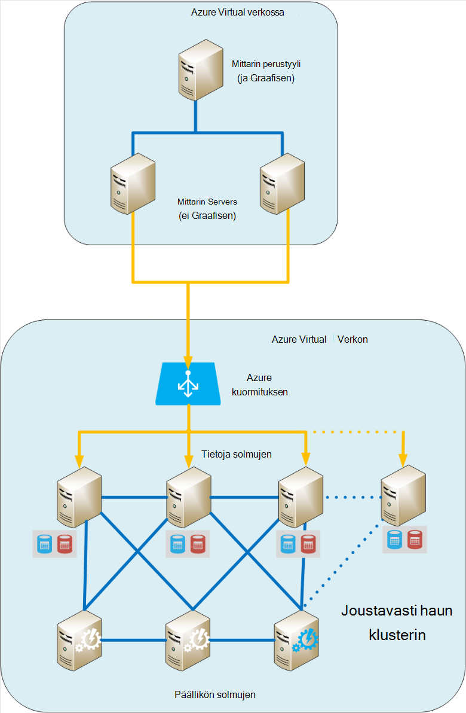
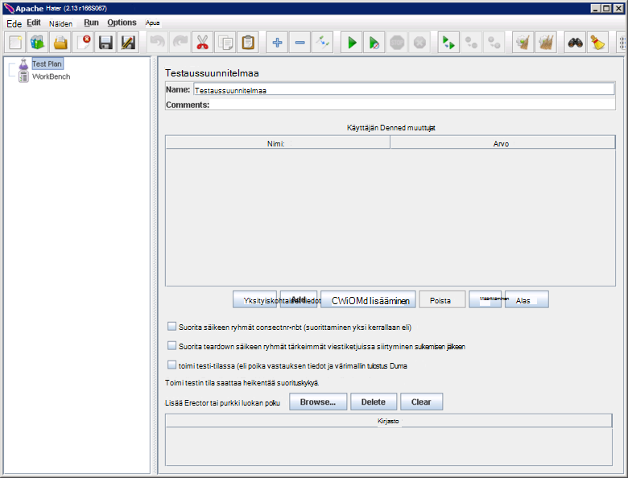
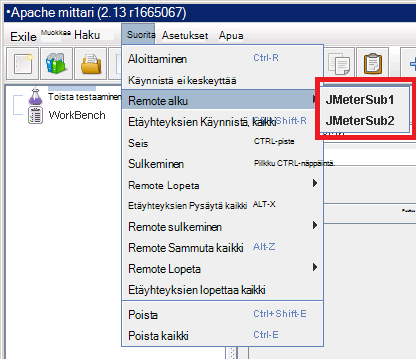
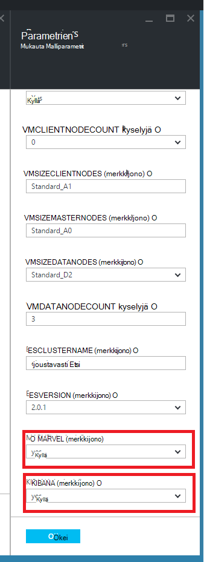
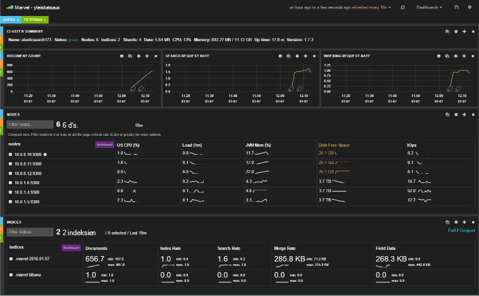
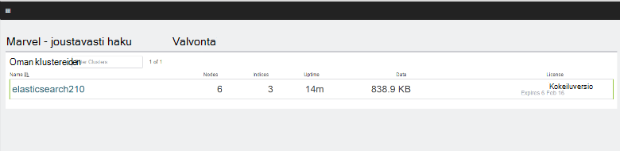
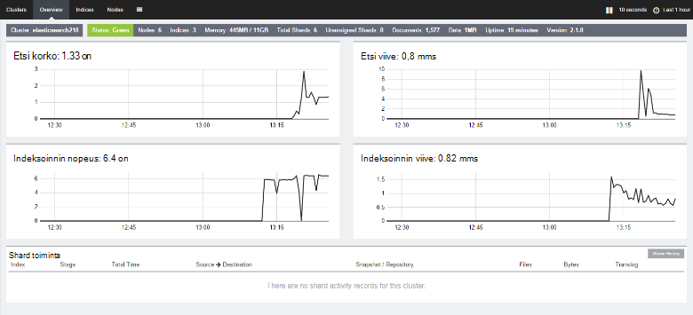

<properties
   pageTitle="Suorituskyvyn, ympäristön testaus Elasticsearch luominen | Microsoft Azure"
   description="Voit määrittää ympäristössä testikäyttöön Elasticsearch-klusterin suorituskykyä."
   services=""
   documentationCenter="na"
   authors="dragon119"
   manager="bennage"
   editor=""
   tags=""/>

<tags
   ms.service="guidance"
   ms.devlang="na"
   ms.topic="article"
   ms.tgt_pltfrm="na"
   ms.workload="na"
   ms.date="09/22/2016"
   ms.author="masashin"/>
   
# <a name="creating-a-performance-testing-environment-for-elasticsearch-on-azure"></a>Suorituskyvyn, testaaminen Elasticsearch Azure-ympäristön luominen

[AZURE.INCLUDE [pnp-header](../../includes/guidance-pnp-header-include.md)]

Tässä artikkelissa on [sarjaan kuuluvan](guidance-elasticsearch.md). 

Tässä asiakirjassa kerrotaan, miten määrittämään ympäristössä testikäyttöön Elasticsearch-klusterin suorituskykyä. Tässä määrityksessä käytettiin Testaa tietojen nieltynä ja kysely-toiminnoista, suorituskyvyn kuvatulla tavalla [säädön tietojen nieltynä suorituskyvyn Azure-Elasticsearch][].

Suorituskyvyn testaaminen prosessin käyttää [Apache JMeter](http://jmeter.apache.org/) [standardin määrittäminen](http://jmeter-plugins.org/wiki/StandardSet/) laajennukset asennettu perustyyli/alaisen määrityksessä käyttämällä erillinen VMs (ei Elasticsearch klusterin osa) erityisesti määritetty tarkoitus. 

[PerfMon Server Agent](http://jmeter-plugins.org/wiki/PerfMonAgent/) asennettiin Elasticsearch kunkin solmun. Seuraavissa osissa, jotta voit Järjestä oman suorituskyvyn testaaminen oikeilla JMeter luotaessa testiympäristössä ohjeet. Nämä ohjeet oletetaan, että olet jo luonut Elasticsearch-klusterin yhdistetty Azure virtual verkon solmujen kanssa. 

Huomaa, että testiympäristössä suoritetaan Azure VMs hallita avulla Azure resurssiryhmä sarjana.

[Marvel](https://www.elastic.co/products/marvel) myös asennettu ja määritetty sallimaan seurattava ja analysoida helpommin Elasticsearch-klusterin sisäinen ominaisuuksia. Jos JMeter tilastotiedot osoittanut piikin tai trough suorituskyvyn, Marvel kautta tiedot voivat olla erittäin hyödyllinen toiminto selvittää vaikutuksen syy.

Seuraava kuva esittää koko järjestelmän rakenteen. 



Huomaa seuraavat seikat:

- JMeter perustyyli AM käytössä Windows Server antamaan JMeter konsolin Graafisen-ympäristössä. JMeter perustyyli AM tarjoaa Graafisen ( *jmeter* sovellus) testaus luominen testejä, suorita tarkistaa ja esittää tulokset. Tämä AM koordinoi VMs, joka lähettää todella pyyntöjä, jotka muodostavat testejä JMeter-palvelimen kanssa.

- JMeter alisteiset VMs suorittaa Ubuntu Server (Linux), ei tarvita Graafisen nämä VMs. JMeter server JMeter server-ohjelmiston ( *jmeter palvelin -* sovellus) pyynnöt lähettäminen Elasticsearch klusterin VMs.

- Erillinen asiakkaan solmujen ei käytetty, vaikka oma perusmuodon solmujen olivat.

- Klusterin solmujen tietojen määrä vaihtelee testattavan toimintamallin.

- Kaikki solmut Elasticsearch klusterin suorittaa Marvel noudata suorituksen suorituskykyä ja JMeter Server Agent kerääminen seurantatiedot myöhempää käyttöä varten.

- Kun testataan Elasticsearch 2.0.0 ja myöhemmin jonkin tietojen solmut myös suorittaa Kibana. Tämä on pakollinen Marvel, joka suoritetaan Elasticsearch 2.0.0 versio ja uudempi versio.

## <a name="creating-an-azure-resource-group-for-the-virtual-machines"></a>Azure resurssiryhmä näennäiskoneiden luominen

JMeter perustyyli on voi yhdistää suoraan kunkin kerätä suorituskykytietoja Elasticsearch-klusterin solmujen. Jos JMeter VNet poikkeavat Elasticsearch klusterin VNet, valitse Tämä edellyttää määrittäminen Elasticsearch kunkin solmun julkiseen IP-osoite. Jos on ilmennyt ongelma Elasticsearch määritys ja valitse harkitse toteuttaminen JMeter VMs saman VNet kuin Elasticsearch klusterin käyttämällä samaa resurssiryhmä, jolloin voit jättää tämän toimintosarjan.

Ensin [luodaan resurssiryhmä](../resource-group-template-deploy-portal.md). Tämän asiakirjan oletetaan, että resurssiryhmän nimeltä *JMeterPerformanceTest*. Jos haluat suorittaa saman VNet kuin Elasticsearch klusterin JMeter VMs, käyttää samaa resurssiryhmä uuden sijaan, että klusterin.

## <a name="creating-the-jmeter-master-virtual-machine"></a>JMeter perusmuodon virtuaalikoneen luominen

Seuraava [luominen Windowsin AM](../virtual-machines/virtual-machines-windows-hero-tutorial.md) käyttämällä *Windows Server 2008 R2 SP1* -kuva.  Suosittelemme valintaa AM-koon sekä riittävästi Sydämiä ja suorituskyvyn testejä muisti. Ihannetapauksessa tämä on tietokoneessa, jossa on vähintään 2 Sydämiä ja 3,5 Gigatavua RAM-Muistia (A2 vakio tai suurempi).

<!-- TODO add info on why disabling diagnostics is positive --> 

On suositeltavaa, että poistat diagnostiikkaa. Luotaessa AM portaalissa tämä tapahtuu *Diagnostiikka* *Seuranta* -kohdassa *asetukset* -sivu. Jättää muut asetukset oletusarvoiksi.

Varmista, että AM ja kaikki niihin liittyvät resurssit on luotu [käsittelystä resurssiryhmän](../azure-portal/resource-group-portal.md#manage-resource-groups) portaalissa. Resurssit olisi koostuvat AM, verkon käyttöoikeusryhmän ja saman niminen julkiseen IP-osoite ja verkon käyttöliittymässä ja tallennustilaa tilin nimet, jotka AM perusteella.

## <a name="creating-the-jmeter-subordinate-virtual-machines"></a>JMeter alisteiset näennäiskoneiden luominen

Nyt [luoda Linux AM](../virtual-machines/virtual-machines-linux-quick-create-portal.md) käyttämällä *Ubuntu palvelimen 14.04 l.* kuvaa.  JMeter perusmuodon AM ja valitse AM koko riittävästi Sydämiä ja suorituskyvyn testejä muisti. Ihannetapauksessa tämä on tietokoneessa, jossa on vähintään 2 Sydämiä ja vähintään 3,5 Gigatavua RAM-Muistia (vakio A2 tai suurempi).

Uudelleen on suositeltavaa, että poistat diagnostiikkaa.

Voit luoda niin monta alisteiset VMs kuin haluat. 

## <a name="installing-jmeter-server-on-the-jmeter-subordinate-vms"></a>JMeter Serverin asentamisesta JMeter alisteiset VMs

JMeter alisteiset VMs on Linux ja oletusarvoisesti et voi muodostaa ne avaamalla etätyöpöytäyhteys (RDP). Sen sijaan voit [käyttää painovärit, muste Avaa komentorivi-ikkuna](../virtual-machines/virtual-machines-linux-mac-create-ssh-keys.md) kunkin AM.

Kun olet yhdistänyt johonkin alisteiset VMs, Käytämme Bash ja JMeter asetukset.

Asenna suorituksenaikainen Java-ympäristö JMeter suorittaminen edellyttää.

```bash
sudo add-apt-repository ppa:webupd8team/java
sudo apt-get update
sudo apt-get install oracle-java8-installer
```

Lataa nyt pakattu zip-tiedoston JMeter ohjelmisto.

```bash
wget http://apache.mirror.anlx.net/jmeter/binaries/apache-jmeter-2.13.zip
```

Asenna unzip-komento ja sitten Laajenna JMeter ohjelmiston sen avulla. Ohjelmiston kopioidaan **apache-jmeter-2.13**-nimiseen kansioon.

```bash
sudo apt-get install unzip
unzip apache-jmeter-2.13.zip
```

Muuttaminen pitämällä JMeter suoritettavat *bin* -kansioon ja tee *jmeter palvelin* ja *jmeter* -ohjelmien suoritettavan.

```bash
cd apache-jmeter-2.13/bin
chmod u+x jmeter-server
chmod u+x jmeter
```

Nyt annettava muokata tiedostoa `jmeter.properties` nykyisessä kansiossa (Käytä sinulle tuttua eniten, kuten *vi* tai *vim*tekstieditorissa). Etsi seuraavista riveistä:

```yaml
...
client.rmi.localport=0
...
server.rmi.localport=4000
...
```

Kommentointi (Poista alussa \##-merkit) ja muokata seuraavista riveistä, alla kuvatulla tavalla ja valitse Tallenna tiedosto ja sulje-editori:

```yaml
...
client.rmi.localport=4441
...
server.rmi.localport=4440
```

Nyt suorita seuraavat komennot avaa TCP-liikenteen portin 4441 (tämä on määrittämäsi kuunnella *jmeter palvelimen* portti):

```bash
sudo iptables -A INPUT -m state --state NEW -m tcp -p tcp --dport 4441 -j ACCEPT
```

Lataa zip-tiedosto, jossa JMeter (nämä laajennukset on suorituskyvyn seurantaa laskureita) laajennukset vakio kokoelma ja unzip tiedostosta **apache-jmeter-2.13** -kansioon. Laajennukset unzipping tiedostoa tähän sijaintiin sijoittaa oikeaan kansioon.

Jos järjestelmä kehottaa korvaamaan käyttöoikeus-tiedoston, kirjoita A (kaikki):

```bash
wget http://jmeter-plugins.org/downloads/file/JMeterPlugins-Standard-1.3.0.zip
unzip JMeterPlugins-Standard-1.3.0.zip
```

Käytä `nohup` käynnistää JMeter palvelimen taustalla. Tulee vastata näyttämällä prosessi-tunnus ja sanoma, remote objekti on luotu ja on valmis aloittamaan vastaanota komentoja.  Suorita seuraava komento ~/apache-jmeter-2.13/bin hakemistossa. 

```bash
nohup jmeter-server &
```

> [AZURE.NOTE]Jos AM suljetaan JMeter server-ohjelman katkaistaan. Tarvitset AM yhdistäminen ja käynnistä se uudelleen manuaalisesti. Vaihtoehtoisesti voit määrittää järjestelmän suorittaminen *jmeter-palvelimesta* -komento automaattisesti käynnistyksen yhteydessä lisäämällä seuraavista komennoista `/etc/rc.local` -tiedostoon (ennen *0 Lopeta* -komento):

```bash
sudo -u <username> bash << eoc
cd /home/<username>/apache-jmeter-2.13/bin
nohup ./jmeter-server &
eoc
```

Korvaa `<username>` kirjautumisnimesi kanssa.

Voit olla hyödyllistä pysyy pääte ikkuna avoinna, niin, että voit valvoa edistymistä JMeter palvelimen testaaminen ollessa käynnissä.

Tarvitset, toista nämä vaiheet jokaiselle JMeter alisteiset AM.

## <a name="installing-the-jmeter-server-agent-on-the-elasticsearch-nodes"></a>Asentaminen JMeter Server Agent Elasticsearch solmuissa

Tässä toimintosarjassa oletetaan, että sinulla on Elasticsearch solmut kirjautumisoikeuden. Jos olet luonut klusterin Resurssienhallinta-mallin avulla, voit muodostaa yhteyden kunkin solmun kautta tekstin-ruutuun AM, kuten [Käynnissä Elasticsearch Azure-](guidance-elasticsearch-running-on-azure.md)Elasticsearch topologian-osassa. Voit muodostaa yhteyden käyttämällä painovärit, muste sekä tekstin-ruutuun. 

Sieltä Kirjaudu sisään jokaiseen Elasticsearch klusterin solmujen *ssh* -komennon avulla.

Kirjaudu sisään johonkin Elasticsearch solmut järjestelmänvalvojana.  Bash komentokehote Kirjoita seuraavat komennot asettamisen JMeter Server Agent-kansion luominen ja siirtäminen kyseiseen kansioon:

```bash
mkdir server-agent
cd server-agent
```

Suorita seuraavat komennot asentaminen *unzip* -komentoa (jos se ei ole vielä asennettu), JMeter Server Agent-ohjelmiston lataaminen ja Pura se:

```bash
sudo apt-get install unzip
wget http://jmeter-plugins.org/downloads/file/ServerAgent-2.2.1.zip
unzip ServerAgent-2.2.1.zip
```
 
Suorita seuraava komento palomuuri ja otetaan käyttöön TCP-liikenne paikalliseen portin 4444 läpi (tämä on JMeter Server Agent käyttämä portti):

```bash
sudo iptables -A INPUT -m state --state NEW -m tcp -p tcp --dport 4444 -j ACCEPT
```

Suorita seuraava komento aloittaa JMeter Server Agent taustalla:

```bash
nohup ./startAgent.sh &
```

JMeter Server Agent tulisi vastata viesteihin, jotka osoittavat, että se on jo alkanut ja porttia 4444 Kuuntele.  Paina Enter hankkiminen komentorivi-ikkuna ja suorittamalla seuraavan komennon.

```bash
telnet <nodename> 4444
```

Korvaa `<nodename>` oman solmun nimi. (Löydät oman solmun nimi suorittamalla `hostname` komennon.) Tämä komento Avaa Paikallinen kone-portin 4444 telnet yhteyden. Voit käyttää tätä yhteyttä vahvistamiseksi JMeter Server Agent on käynnissä.

Jos JMeter Server-agentti ei ole käynnissä, saat vastauksen 

`*telnet: Unable to connect to remote host: Connection refused*.`

Jos JMeter Server Agent on käynnissä ja porttia 4444 on määritetty oikein, pitäisi näkyä seuraava vastaus:


> [AZURE.NOTE] Telnet-istuntoon ei tarjoa minkä tahansa tyyppinen kehote, kun se on yhdistetty.

Telnet istunnon aikana Kirjoita seuraava komento:

``` 
test
```

Jos JMeter Server Agent on määritetty ja kuunteleminen oikein, se on, että se vastaanotetaan komento ja kokouspyyntöön viestillä *Yep*.

> [AZURE.NOTE]Voit kirjoittaa suorituskyvyn tietojen hankkiminen muista komennoista. Esimerkiksi komento `metric-single:cpu:idle` avulla voit nykyisen osuus aika, joka Suoritin ei käytetä (tämä on tilannevedoksen). Täydellinen luettelo komennot [PerfMon Server Agent](http://jmeter-plugins.org/wiki/PerfMonAgent/) ‑sivustossa. : Takaisin, jos haluat soittaa se hän Perfmon palvelimen agentti. >>

Kirjoita telnet-istunnossa lopettaa istunnon ja palaa Bash komentoriville seuraava komento:

``` 
exit
```

> [AZURE.NOTE]Kun kanssa JMeter alaiset VMs, jos kirjaudut ulos, tai jos tämän tietokoneen suljetaan ja käynnistetään uudelleen sitten JMeter Server Agent on käynnistettävä manuaalisesti käyttämällä `startAgent.sh` komento. Jos haluat JMeter Server Agent käynnistymään automaattisesti, Lisää seuraava komento loppuun `/etc/rc.local` tiedoston ennen *Lopeta 0* -komentoa. 
> Korvaa `<username>` kirjautumisnimesi kanssa:

```bash
sudo -u <username> bash << eoc
cd /home/<username>/server-agent
nohup ./startAgent.sh &
eoc
```

Nyt joko Toista koko prosessia jokaisen Elasticsearch klusterin solmun tai voi käyttää `scp` komento server agent-kansion ja sisällön kopioiminen kaikissa muissa solmu ja käytä `ssh` komento aloittaa JMeter Server Agent alla kuvatulla tavalla. Korvaa e `<username>` kanssa oma käyttäjänimi ja `<nodename>` nimellä solmun, johon haluat kopioida ja käyttää ohjelmistoa (sinulta pyydetään antamaan salasana, kun suoritat jokaisen komennon):

```bash
scp -r \~/server-agent <username>@<nodename>:\~
ssh <nodename> sudo iptables -A INPUT -m state --state NEW -m tcp -p tcp --dport 4444 -j ACCEPT
ssh <nodename> -n -f 'nohup \~/server-agent/startAgent.sh'
```

## <a name="installing-and-configuring-jmeter-on-the-jmeter-master-vm"></a>Asentaminen ja määrittäminen JMeter JMeter perusmuodon AM

Azure-portaalissa Valitse **resurssiryhmät**. Valitse resurssiryhmä, joka sisältää JMeter pää- ja alitehtäviä VMs **resurssiryhmät** -sivu.  Valitse **JMeter perusmuodon AM** **resurssiryhmä** -sivu. Valitse **Yhdistä**virtuaalikoneen-sivu, valitse työkaluriviltä. Kun selain pyytää RDP-tiedoston avaaminen Windows luo Etätyöpöytäyhteys, että AM.  Kirjoita pyydettäessä AM käyttäjänimi ja salasana.

Siirry AM Internet Explorerissa, [Lataa Java for Windows](http://www.java.com/en/download/ie_manual.jsp) -sivulle. Lataa ja Suorita Java-installer ohjeiden mukaisesti.

Web-selaimessa Siirry sivulle, [Lataa Apache JMeter](http://jmeter.apache.org/download_jmeter.cgi) ja lataa zip, joka sisältää uusimmat binaariluvuksi. Tallenna zip-että AM sopivaan kohtaan.

Siirry sivustoon, [Mukautettu JMeter laajennukset](http://jmeter-plugins.org/) ja Lataa laajennukset vakio määrittäminen. Tallentaa zip samassa kansiossa JMeter latauksena edellisessä vaiheessa.

Siirry Resurssienhallinnassa kansio, jossa apache-jmeter -*xxx* zip-tiedoston, missä *xxx* JMeter nykyinen versio. Pura tiedostot nykyiseen kansioon.

Pura JMeterPlugins tiedostot-Standard -*yyy*.zip-tiedoston missä *yyy* laajennukset apache kyselyjä nykyinen versio-jmeter -*xxx* -kansiossa. Tämä lisää laajennukset oikeaan kansioon JMeter varten. Voit turvallisesti yhdistäminen lib kansiot ja korvaa käyttöoikeus- ja Lueminut-tiedostot pyydettäessä.

Siirry apache-tiedoston jmeter -*xxx*\bin kansio ja Muokkaa jmeter.properties Muistiossa.  Valitse `jmeter.properties` tiedoston, Etsi kohta *Remote isäntien*ja RMI määritys.  Tässä osassa tiedoston Etsi seuraava rivi:

```yaml
remote_hosts=127.0.0.1
```

Muuta tämä rivi ja korvaa IP osoite 127.0.0.1 pilkuilla erotettu luettelo IP-osoitteet tai isäntänimet kunkin JMeter alisteiset palvelimet. Esimerkki:

```yaml
remote_hosts=JMeterSub1,JMeterSub2
```

Etsi seuraava rivi ja valitse Poista `#` merkki rivin alkuun ja muokata client.rmi.localport asetuksia arvo:

```yaml
#client.rmi.localport=0
```

seuraavasti:

```yaml
client.rmi.localport=4440
```

Tallenna tiedosto ja sulje Muistio. 

Windows-työkalurivin napsauttamalla **Käynnistä-painiketta**, valitse **Valvontatyökalut**ja valitse sitten **Windowsin laajennettu palomuuri**.  Valitse Windowsin palomuuri-laajennettu-ikkunan vasemmanpuoleisessa ruudussa **Saapuvan liikenteen säännöt**hiiren kakkospainikkeella ja valitse sitten **Uusi sääntö**.

**Ohjattu saapuvan liikenteen säännön**, valitse **Säännön tyyppi** -sivulla Valitse **portti**ja valitse sitten **Seuraava**.  Valitse protokollat ja portit-sivulla **TCP**, valitse teksti-ruutuun **tietyn paikalliset portit** `4440-4444`, ja valitse sitten **Seuraava**.  Valitse toiminto-sivulla Salli **yhteys**ja valitse sitten **Seuraava**. Valitse profiili-sivulla jätä valittuna kaikki asetukset ja valitse sitten **Seuraava**.  Valitse nimi-sivulla **nimi** tekstiruutuun Kirjoita *JMeter*, ja valitse sitten **Valmis.**  Sulje Windowsin palomuuri-ikkunan laajennettu.

Resurssienhallinnassa apache-jmeter -*xx*\bin kansion, voit käynnistää Graafisen *jmeter* Windows erä-tiedostoa. Käyttöliittymän pitäisi näkyä:



Valitse valikkoriviltä valitsemalla **Suorita** **Remote Käynnistä-painiketta**ja varmista, että kaksi JMeter alisteiset tietokoneissa on lueteltu:



Voit nyt aloittaa suorituskyvyn testaaminen.

## <a name="installing-and-configuring-marvel"></a>Asentaminen ja määrittäminen Marvel

Azure Elasticsearch pikaopas mallia asennetaan ja määritetään Marvel oikean version automaattisesti, jos tosi ("Kyllä") klusterin luotaessa MARVEL ja KIBANA parametrien määrittäminen:



Jos olet lisäämässä Marvel aiemmin luodun klusterin, sinun täytyy suorittaa asennus manuaalisesti ja prosessi on erilaiset riippuen siitä, onko käytössäsi Elasticsearch versio 1.7.x tai 2.x, seuraavien ohjeiden mukaisesti.

### <a name="installing-marvel-with-elasticsearch-173-or-earlier"></a>Asentaminen Marvel Elasticsearch 1.73 tai aiemmassa versiossa

Jos käytössäsi on Elasticsearch 1.7.3 tai suorittaa aiemmissa versioissa seuraavat vaiheet *jokaisen solmun* klusterin:

- Kirjaudu sisään solmu ja Siirrä Elasticsearch pääkansion.  Linux-tyypillinen pääkansion on `/usr/share/elasticsearch`.

-  Suorita seuraava komento lataa ja asenna laajennus Marvel Elasticsearch:

```bash
sudo bin/plugin -i elasticsearch/marvel/latest
```

- Lopeta ja Käynnistä uudelleen Elasticsearch solmun:

```bash
sudo service elasticsearch restart
```

- Voit varmistaa, että Marvel on asennettu oikein, Avaa selain ja siirry URL-Osoitteeseen `http://<server>:9200/_plugin/marvel`. Korvaa `<server>` nimellä tai minkä tahansa Elasticsearch palvelimen klusterin IP-osoite.  Varmista, että sivu, joka on samanlainen kuin alla näkyy:




### <a name="installing-marvel-with-elasticsearch-200-or-later"></a>Asennuksen Marvel Elasticsearch 2.0.0 tai uudempi versio

Jos käytössäsi on Elasticsearch 2.0.0 tai suorittaa myöhemmin seuraavat tehtävät *jokaisen solmun* klusterin:

Kirjaudu sisään solmu ja siirry Elasticsearch pääkansion (yleensä `/usr/share/elasticsearch`) suorittamalla seuraavat komennot, lataa ja asenna laajennus Marvel Elasticsearch:

```bash
sudo bin/plugin install license
sudo bin/plugin install marvel-agent
```

Lopeta ja Käynnistä uudelleen Elasticsearch solmun:

```bash
sudo service elasticsearch restart
```

Seuraavien ohjeiden mukaisesti, korvaa `<kibana-version>` 4.2.2, jos käytössäsi on Elasticsearch 2.0.0 tai Elasticsearch 2.0.1 tai jos käytössäsi on Elasticsearch 2.1.0 4.3.1 tai uudempi versio.  Korvaa `<marvel-version>` 2.0.0, jos käytössäsi on Elasticsearch 2.0.0 tai Elasticsearch 2.0.1 tai jos käytössäsi on Elasticsearch 2.1.0 2.1.0 tai uudempi versio.  Suorittamalla seuraavat tehtävät *yksi solmun* klusterin:

Solmun kirjautuminen ja lataa Kibana tarvittavat muodosta-versiosi Elasticsearch [Lataa sivuston Elasticsearch](https://www.elastic.co/downloads/past-releases)ja valitse Pura paketin:

```bash
wget https://download.elastic.co/kibana/kibana/kibana-<kibana-version>-linux-x64.tar.gz
tar xvzf kibana-<kibana-version>-linux-x64.tar.gz
```

Avaa portti 5601 Hyväksy pyynnöt:

```bash
sudo iptables -A INPUT -m state --state NEW -m tcp -p tcp --dport 5601 -j ACCEPT
```

Siirrä kansioon Kibana config (`kibana-<kibana-version>-linux-x64/config`), Muokkaa `kibana.yml` tiedoston ja lisää seuraava rivi. Korvaa `<server>` nimi tai IP-osoite klusterin Elasticsearch-palvelimen kanssa:

```yaml
elasticsearch.url: "http://<server>:9200"
```

Siirry Kibana bin-kansio (`kibana-<kibana-version>-linux-x64/bin`), ja suorittamalla seuraavan komennon Marvel laajennus integroida Kibana:

```bash
sudo ./kibana plugin --install elasticsearch/marvel/<marvel-version>
```

Aloita Kibana:

```bash
sudo nohup ./kibana &
```

Vahvista Marvel asennuksen, Avaa selain ja siirry URL-Osoitteeseen `http://<server>:5601/app/marvel`. Korvaa `<server>` nimen tai palvelimen Kibana IP-osoite.

Varmista, että sivu, joka on samanlainen kuin alla näkyy (yhteyttä klusterin nimen vaihtelevat todennäköisesti, kuvan mukaisesti).



Napsauta linkkiä, joka vastaa yhteyttä klusterin (elasticsearch210 yllä olevassa kuvassa). Sivu, joka on samanlainen kuin alla näkyy:




[Azure-Elasticsearch tietojen nieltynä suorituskyvyn säätö]: guidance-elasticsearch-tuning-data-ingestion-performance.md  