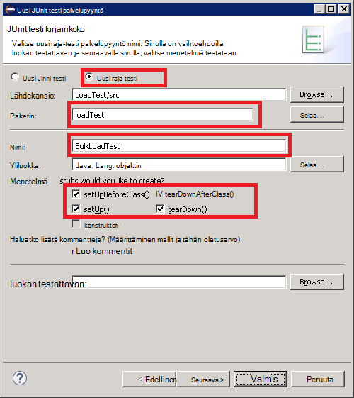
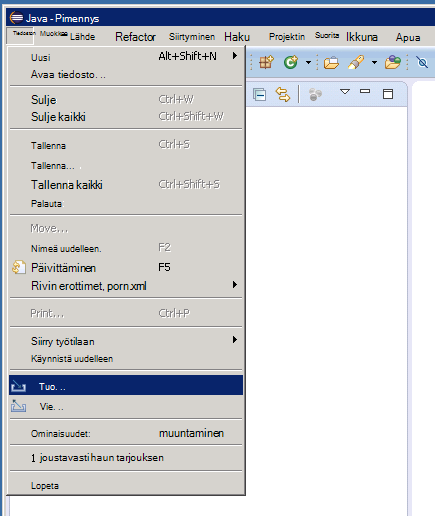

<properties
   pageTitle="Käyttöönotto JMeter JUnit värimallin-tulostus testikäyttöön Elasticsearch suorituskyvyn | Microsoft Azure"
   description="Miten luominen ja tietojen lataaminen Elasticsearch-klusterin JUnit värimallin-tulostus avulla."
   services=""
   documentationCenter="na"
   authors="dragon119"
   manager="bennage"
   editor=""
   tags=""/>

<tags
   ms.service="guidance"
   ms.devlang="na"
   ms.topic="article"
   ms.tgt_pltfrm="na"
   ms.workload="na"
   ms.date="09/22/2016"
   ms.author="masashin"/>
   
# Käyttöönotto testikäyttöön Elasticsearch suorituskyvyn JMeter JUnit värimallin-tulostus

[AZURE.INCLUDE [pnp-header](../../includes/guidance-pnp-header-include.md)]

Tässä artikkelissa on [sarjaan kuuluvan](guidance-elasticsearch.md). 

Tässä asiakirjassa kerrotaan, miten voit luoda ja käyttää JUnit värimallin tulostus, joita voit luoda ja tietojen lataaminen Elasticsearch-klusterin JMeter testaussuunnitelmaa osana. Tämän menetelmän tarjoaa joustavia lähestymistapa lataamaan testaus, voit luoda suuria määriä testitiedot ilman ulkoisia tietoja tiedostot mukaan.

> [AZURE.NOTE] Lataa testejä arvioidaan tietojen annosmuuntokertoimien [säädön tietojen nieltynä suorituskyvyn Elasticsearch](guidance-elasticsearch-tuning-data-ingestion-performance.md) kuvattu suorituskykyä muodostettiin tämän menetelmän avulla. Tietoja JUnit-koodi on artikkelissa asiakirjan.

Testauksen tietojen nieltynä suorituskyvyn JUnit-koodi on kehittäminen käyttämällä Pimennys (Mars) ja riippuvuuksien on ratkaista käyttämällä maven-testi. Seuraavassa kuvataan vaiheittainen prosessi, jossa Pimennys asentaminen, määrittäminen maven-testi, JUnit testi luominen ja käyttöönotto tämän testin JUnit pyynnön värimallin tulostus JMeter testin nimellä.

> [AZURE.NOTE] Lisätietoja rakenteen ja testiympäristössä määritys on artikkelissa [luominen Elasticsearch Azure-suorituskyvyn testauksen ympäristössä][].

## Asennuksen edellytykset

Sinun on [Ajonaikaista Java-ympäristöä](http://www.java.com/en/download/ie_manual.jsp) kehittäminen käyttämääsi laitteeseen.
Sinun on myös asentaa [Pimennys IDE Java-kehittäjille](https://www.eclipse.org/downloads/index.php?show_instructions=TRUE).

> [AZURE.NOTE] Jos käytössäsi on kuvattu oman kehitysympäristö [luominen Azure-Elasticsearch suorituskyvyn testauksen ympäristön][] JMeter perusmuodon AM, lataa Pimennys asennusohjelma Windowsin 32-bittinen versio.

## Luot JUnit testin projektia testaaminen Elasticsearch lataamista varten

Käynnistä Pimennys IDE, jos se ei ole jo käytössä ja sulje sitten **aloitussivulla** .  Valitse **Tiedosto** -valikosta napsauttamalla ja valitse sitten **Java projektin**.

**Java uusi projekti** -ikkunassa projektin nimi, valitse **Käytä oletusta JRE**ja valitse sitten **Valmis**.

Laajenna projektin nimetty solmu **Paketti** -ikkunan. Varmista, että se sisältää **src** ja olet määrittänyt JRE viittaus-nimiseen kansioon.

**Src** -kansiota hiiren kakkospainikkeella, valitse **Uusi**ja valitse sitten **JUnit testi kirjainkoko**.

Kirjoita **Uusi JUnit testi palvelupyyntö** -ikkunaan valitsemalla **Uusi Junit 4 testi**(tämän voi olla sama kuin projektin nimi vaikka mukaan konferenssi on alettava kirjaimella pienet kirjaimet) paketille nimi nimi-testiluokka ja valitse Luo tarvittavat testauksessa menetelmä talonki haluamasi asetukset. Jätä **testattavan luokka** -ruutu tyhjäksi ja valitse sitten **Valmis**.

Jos **Uusi JUnit testi palvelupyyntö** valintaikkuna tulee näkyviin, valitse vaihtoehto, jos haluat lisätä JUnit 4-kirjaston muodosta polku ja valitse sitten **OK**. 

Varmista, että JUnit testi rakenne-koodi on luotu ja Java-editorin ikkunan.

**Paketin Explorer**projektin solmu hiiren kakkospainikkeella, valitse **Määritä**ja valitse sitten **Muunna maven-testi projektiin**.

> [AZURE.NOTE]Käyttämällä maven-testi avulla voit helposti hallitset riippuvuussuhteet (kuten Elasticsearch Java-asiakasohjelman kirjastojen) projektin riippuu siitä.

Valitse **Luo uusi POM** -valintaikkunan pudotusvalikosta **pakkaus** **purkki**ja valitse sitten **Valmis**.

Project-malli (POM) editori alla avautuvassa ruudussa saattaa näyttää varoituksen "Muodosta polku määrittää suorittamisen ympäristön J2SE 1,5. Luettelossa on ei ole asennettu työtilan JREs ehdottoman kanssa yhteensopivista tässä ympäristössä", sen mukaan, mitä Java-versio on asennettu kehittäminen tietokoneeseen. Jos sinulla on myöhempi kuin V1.5 voit turvallisesti ohittaa tämän varoituksen Java versio.

POM-editorissa Laajenna **Ominaisuudet** ja valitse sitten **Luo**.

Kirjoita **Lisää ominaisuus** -valintaikkunan **nimi** -ruutuun *es.version*, kirjoita **arvo** -ruutuun *1.7.2*ja valitse sitten **OK**. Tämä on käytettävä Elasticsearch Java asiakas-kirjaston versio (tämä versio voidaan kumota tulevaisuudessa ja määrittämällä versio POM ominaisuutena ja viittaava muualla Projectissa tämän ominaisuuden avulla versio voidaan muuttaa nopeasti.)

Milloin POM editorin kantaluvun **riippuvuudet** -välilehti ja valitse sitten **Lisää** **riippuvuudet** -luettelon vieressä.

Kirjoita **Valitse riippuvuus** -valintaikkunaan **Ryhmätunnus** -ruutuun *org.elasticsearch*, kirjoita **Palvelutietojen tunnus** -ruutuun *elasticsearch* **versio** -ruutuun * \${es.version}*, ja valitse sitten **OK**. Java Elasticsearch asiakas-kirjaston tietoja säilytetään online maven-testi keskitettyyn säilöön ja määritysten lataa automaattisesti kirjastoon ja sen riippuvuudet kun projekti on luotu.

Valitse **Tiedosto** -valikosta **Tallenna kaikki**. Tämä toiminto tallentaa ja projektin lataaminen maven-testi määrittämää riippuvuuksien luominen. Varmista, että maven-testi riippuvuudet kansio näyttää pakkauksen Resurssienhallinnassa. Laajenna tämä kansio purkki tiedostot ladataan tukemaan Elasticsearch Java asiakas-kirjasto.

## Aiemmin luodun JUnit testiprojektin tuominen Pimennys

Tässä toimintosarjassa oletetaan, että olet ladannut maven-testi projektista, jossa on aiemmin luotu Pimennys käyttämällä.

Aloita Pimennys IDE. **Valitse **Tiedosto** -valikossa Tuo.**

**Valitse** -ikkunassa Laajenna **maven-testi** -kansio, valitse **Aiemmin luotu maven-testi projektit**ja valitse sitten **Seuraava**.

Määritä **Maven-testi projektit** -ikkunan kansion pitäminen projektin (pom.xml tiedoston sisältävä kansio), **Valitse**kaikki ja valitse sitten **Valmis**.

Laajenna vastaavat projektin solmu **Paketti** -ikkunan. Varmista, että projekti sisältää **src**-nimiseen kansioon. Tämä kansio sisältää lähdekoodin JUnit testi. Projektin voit kääntää ja otettu käyttöön noudattamalla seuraavia ohjeita.

## Käyttöönoton JMeter JUnit-testi

Tämä toiminto olettaa projekti nimeltä LoadTest sisältävä JUnit testi-luokan, jonka nimi on luonut `BulkLoadTest.java` , joka hyväksyy parametreja välitetty yksittäisen merkkijonona konstruktori (tämä on järjestelmä, JMeter odottaa).

Pimennys IDE- **Paketin Explorer**-projektin solmun hiiren kakkospainikkeella ja valitse sitten **Vie**.

**Ohjattu vientitoiminto**- **Valitse** sivulla Laajenna **Java** -solmu, valitse **JAR tiedosto**ja valitse sitten **Seuraava**.

Laajenna **JAR tiedostomääritys** -sivulla **Valitse vietävät resurssit** -ruutuun projektin **.project**valinta poistetaan ja poista sen valinta **pom.xml**. **JAR tiedosto** -ruutuun tiedostonimi ja sijainti PURKKIIN (se on otettava .jar tunniste) ja valitse sitten **Valmis**.

Windowsin Resurssienhallinnassa, kopioi PURKKI tiedosto juuri luomasi JMeter perusmuodon JVM ja tallenna se apache-jmeter-2.13\\lib\\junit kansion alapuolella kansio, johon on asennettu JMeter (Lisätietoja on kohdassa "Luominen JMeter perusmuodon virtuaalikoneen" menettelyä [Elasticsearch Azure-suorituskyvyn testauksen ympäristön](guidance-elasticsearch-creating-performance-testing-environment.md) luomiseen.)

Palaa Pimennys, laajenna **Paketti** ikkunan ja huomioi PURKKI tiedostoja ja niiden sijainnit projektin maven-testi riippuvuudet-kansiossa. Huomaa, että tiedostot seuraavassa kuvassa näkyvät saattavat vaihdella sen mukaan, mitä Elasticsearch-versiota käytät:

Windowsin Resurssienhallinnassa, kopioi PURKKI tiedostoille Viitattu apache-jmeter-2.13 maven-testi riippuvuudet kansiossa\\lib\\JMeter perusmuodon AM junit kansioon.

Jos lib\\junit kansion jo sisältää vanhempia versioita PURKKI tiedostot sitten Poista ne. Jos jätät ne paikassa JUnit testi ehkä eivät toimi, viittaukset saattaa olla ratkennut väärää tölkki.

Napsauta JMeter perustyyliä AM lopettaa JMeter, jos on käynnissä.  Aloita JMeter.  JMeter, valitse **Testaa suunnitteleminen**hiiren kakkospainikkeella, valitsemalla **Lisää**, valitse **viestiketjuissa siirtyminen (a)**ja valitse sitten **Viestiketjun ryhmän**.

**Testin suunnittelu** -solmun **Viestiketjun ryhmää**hiiren kakkospainikkeella, valitse **Lisää**, **värimallin tulostus**ja **JUnit pyynnön**.

Valitse **JUnit pyynnön** -sivulla **Etsi JUnit4 huomautusten (sijaan JUnit 3)**. Valitse pudotusvalikosta **LuokanNimi** JUnit kuormituksen testi luokan (se merkitään lomakkeen * &lt;paketti&gt;.&lt; luokan&gt;*), **Testaa menetelmä** avattavasta luettelosta vaihtoehdon JUnit testata menetelmä (tämä on todella suorittaa testi liittyviä töitä, ja olisi on merkitty *@test* huomautuksen Pimennys projektin), ja kirjoittaa arvoja välittämisen konstruktoria **Konstruktori merkkijono-otsikko** -ruutuun. Seuraavassa kuvassa näkyvät tiedot ovat vain esimerkkejä; oman **LuokanNimi** *- *Testimenetelmä*ja * *Konstruktori merkkijono-otsikko** todennäköisesti poiketa varoitusmerkkejä.

Jos luokan ei näy **LuokanNimi** avattavasta luettelosta, syynä todennäköisesti PURKKIIN ei viedä oikein tai lib ei sijoitetaan\\junit kansio tai vain joitakin riippuvaiset tölkki puuttuvat lib\\junit kansio. Jos näin tapahtuu, projektin vieminen Pimennys uudelleen ja varmista, että olet valinnut **src** resurssi, kopioi PURKKIIN lib\\junit kansio ja varmista, että olet kopioinut kaikki riippuvaiset tölkki luettelossa maven-testi lib-kansioon.

Sulje JMeter. Ei ole tarpeen testaussuunnitelmaa tallentamiseen.  Kopioi PURKKI tiedosto, jossa /aloitussivu/ JUnit testi luokan&lt;käyttäjänimi&gt;/apache-jmeter-2.13/lib/junit kansion kunkin JMeter alisteiset VMs (*&lt;käyttäjänimi&gt; * on nimi järjestelmänvalvojan käyttäjän määrittämäsi kun loit AM, lisätietoja "Luominen JMeter alisteiset näennäiskoneiden" toimintosarjan luominen [Azure-Elasticsearch suorituskyvyn testauksen ympäristön](guidance-elasticsearch-creating-performance-testing-environment.md) .)

Kopioi riippuvaiset PURKKI tiedostot /aloitussivu/ JUnit testi luokan vaatii&lt;käyttäjänimi&gt;kunkin JMeter alisteiset VMs /apache-jmeter-2.13/lib/junit kansioon. Varmista, että voit poistaa PURKKI tiedostojen vanhemmat versiot ensin tähän kansioon.

Voit käyttää `pscp` apuohjelman tiedostojen kopioimiseen Linux Windows-tietokoneessa.

[Suorituskyvyn, testaus Elasticsearch Azure-ympäristön luominen]: guidance-elasticsearch-creating-performance-testing-environment.md
