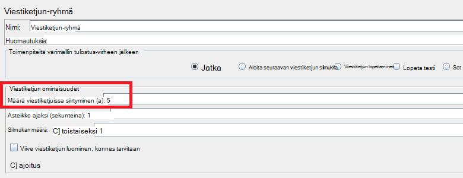
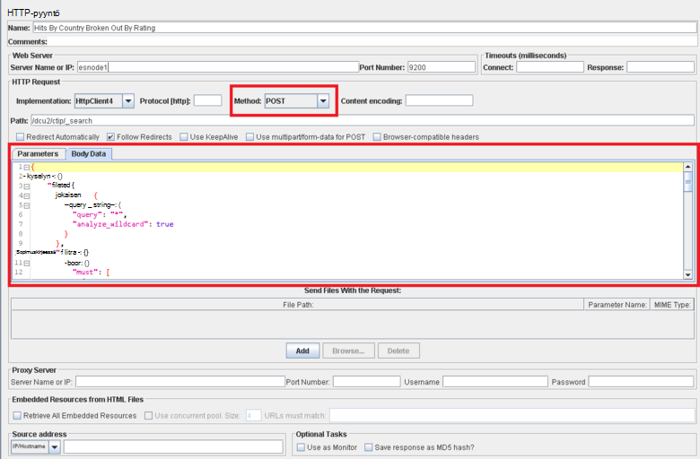

<properties
   pageTitle="Käyttöönoton JMeter käsittelee testaussuunnitelmaa, Elasticsearch | Microsoft Azure"
   description="Suorittaminen suorituskyvyn Testaa Elasticsearch kanssa JMeter varten."
   services=""
   documentationCenter="na"
   authors="dragon119"
   manager="bennage"
   editor=""
   tags=""/>

<tags
   ms.service="guidance"
   ms.devlang="na"
   ms.topic="article"
   ms.tgt_pltfrm="na"
   ms.workload="na"
   ms.date="09/22/2016"
   ms.author="masashin" />
   
# <a name="implementing-a-jmeter-test-plan-for-elasticsearch"></a>Käyttöönoton JMeter testaussuunnitelmaa Elasticsearch varten

[AZURE.INCLUDE [pnp-header](../../includes/guidance-pnp-header-include.md)]

Tässä artikkelissa on [sarjaan kuuluvan](guidance-elasticsearch.md). 

Suorituskyky vastaan Elasticsearch testeissä on toteutettu käyttämällä JMeter testi suunnitelmien perustettu JUnit testin suorittamiseen tehtäviä, kuten tietojen lataaminen kyselyjä klusterin Java-koodi. Testaa suunnitelmien ja JUnit koodi on artikkelissa [säädön tietojen nieltynä suorituskyvyn Elasticsearch Azure-][]ja [säädön tietojen koostaminen ja Elasticsearch Azure-kyselyn suorituskykyä][].

Tämän asiakirjan tarkoituksena on yhteenveto avaimen kokemus saatu, luominen ja suorittaminen nämä testata palvelupaketin. Apache JMeter sivustossa [JMeter parhaat käytännöt](http://jmeter.apache.org/usermanual/best-practices.html) -sivu sisältää enemmän generalized neuvoja siitä JMeter tehokas käyttäminen.

## <a name="implementing-a-jmeter-test-plan"></a>Käyttöönoton JMeter testaussuunnitelmaa

Seuraavassa luettelossa on kuvattu kohteita, ota huomioon, kun luot JMeter testaussuunnitelmaa:

- Luoda erilliset viestiketjun ryhmän jokaisen testin, jonka haluat suorittaa. Ehto voi olla useita vaiheita, mukaan lukien logiikan ohjaimet, ajastimet, ennen ja jälkeen suorittimien, heillä ja kuuntelijoita.

- Vältä luomista liian monta viestiketjuissa siirtyminen viestiketjun-ryhmässä. Liian monta viestiketjuissa siirtyminen aiheuttaa JMeter epäonnistuu "Ulos muistin" poikkeukset. Kannattaa lisätä JMeter alisteiset palvelimien käynnissä on pienempi kuin yrittää käynnistää on runsaasti viestiketjuissa siirtyminen yhteen JMeter palvelimeen viestiketjuissa siirtyminen määrä.



- Klusterin suorituskyvyn arvioida liittää testaussuunnitelmaa [Perfmon arvot kerääminen](http://jmeter-plugins.org/wiki/PerfMon/) laajennus. Tämä on JMeter kuuntelija, joka on käytettävissä yhtenä standard JMeter-laajennukset. Tallenna tiedostojoukon pilkuilla erotetut arvot (CSV)-muodossa raaka suorituskykytietoja ja käsitellä niitä testin päätyttyä. Tämä on tehokasta ja pienempi kuin yrität käsitellä tietoja, kuten sen, kirjataan JMeter rasittaa joutuu. 


Voit työkalun esimerkiksi Excel luo kaavioiden tietoalueen analysointiin ja tuoda tiedot.

Voit tallentaa seuraavat tiedot:

- Jokaisen Elasticsearch klusterin solmun suorittimen käyttö.

- Lue sekunnissa levyltä jokaisen solmun tavujen määrän.

- Jos mahdollista i/o suoritettava kunkin solmun odottaa kulunut suorittimen ajan prosentteina. Tämä ei ole aina Windows VMs mahdollista, mutta Linux voit luoda mukautetun metrijärjestelmä (johto metrijärjestelmä), joka suoritetaan *vmstat* solmun käynnistää seuraavat shell-komento:

```Shell
sh:-c:vmstat 1 5 | awk 'BEGIN { line=0;total=0;}{line=line+1;if(line&gt;1){total=total+\$16;}}END{print total/4}'
```

Kenttä 16- *vmstat* tulosteen sisältää suorittimen aikaa i/o. Saat lisätietoja tietosuojatiedoissa toiminta [vmstat-komentoa](http://linuxcommand.org/man_pages/vmstat8.html).

- Tavujen määrän lähetetyt ja vastaanotetut kunkin solmun verkon kautta.

- Erillinen kooste raportin kuuntelijoita avulla voit tallentaa suorituskykyä ja korkojakso onnistuneiden ja epäonnistuneiden-toimintoa. Sieppaa onnistumisesta tai epäonnistumisesta eri tiedostojen tietoja.


- Pidä kussakin JMeter testi tapauksessa mahdollisimman yksinkertainen, jotta voit yhdistää suoraan suorituskyvyn tietyn testin toimintojen. Testi tapauksissa, jotka vaativat monimutkaisia logiikan harkitse encapsulating JUnit testi tämä logiikka ja Suorita testi JMeter JUnit pyynnön värimallin tulostus avulla.

- HTTP-pyyntö värimallin tulostus avulla voit suorittaa HTTP-toimintoja, kuten GET, viestin, käyttöön tai poistaminen. Voit esimerkiksi suorittaa Elasticsearch haut viestin luominen ja tarjoamalla Kyselytiedot *Leipätekstin tiedot* -ruudusta:



- Helpottaa toistettavissa ja uudelleenkäyttöön, parameterize testata JMeter testi palvelupaketin. Voit käyttää komentosarjan automatisoida testi suunnitelmien suorittamisen.

## <a name="implementing-a-junit-test"></a>Käyttöönoton JUnit-testi

Voit sisällyttää monimutkaisia koodin JMeter testaussuunnitelmaa luomalla yksi tai useampi JUnit testi. Voit kirjoittaa JUnit testi Java integroitu kehitysympäristö (IDE) kuten Pimennys avulla. Voit määrittää haluamasi kehitysympäristö [käyttöönotto JMeter JUnit värimallin tulostus testikäyttöön Elasticsearch suorituskyvyn][] sisältää tietoja.

Seuraavassa luettelossa on yhteenveto parhaista käytännöistä pitäisi seurata, kun kirjoitat JUnit testi koodi:

- Testaa luokan konstruktoria avulla voit siirtää alustusparametrit testi. JMeter käyttää konstruktoria, joka kestää yhden merkkijono-argumentti. Konstruktorissa jäsentää argumentti sen yksittäisiä osia, koodia seuraavan esimerkin osoittamalla tavalla:

```Java
private String hostName = "";
private String indexName = "";
private String typeName = "";
private int port = 0;
private String clusterName = "";
private int itemsPerBatch = 0;

/\* JUnit test class constructor \*/
public ElasticsearchLoadTest2(String params) {
    /* params is a string containing a set of comma separated values for:
        hostName
        indexName
        typeName
        port
        clustername
        itemsPerBatch
    */

    /* Parse the parameter string into an array of string items */
    String delims = "\[ \]\*,\[ \]\*"; // comma surrounded by zero or more spaces
    String\[\] items = params.split(delims);

    /* Note: Parameter validation code omitted */

    /* Use the parameters to populate variables used by the test */
    hostName = items[0];
    indexName = items[1];
    typeName = items[2];
    port = Integer.parseInt(items[3]);
    clusterName = items[4];
    itemsPerBatch = Integer.parseInt(items[5]);

    if(itemsPerBatch == 0)
        itemsPerBatch = 1000;
}
```

- Vältä i/o-toimintojen tai muihin aikaa toimintoihin konstruktorin tai asennuksen testi luokan, sillä he suorittavat JUnit testi suoritetaan aina. (JUnit testaamista suorittamisen monta kertaa jokaisen suorituskyky-testin JMeter suoritettujen tuhansia.)

- Kannattaa käyttää kallista testi palvelupyynnön alustus erikseen asetukset.

- Jos testi edellyttää syöteparametrit suuri määrä, tallentaa testi kokoonpanotietoja erillisessä kokoonpanotiedosto ja siirtää konstruktoria tämän tiedoston sijainti.

- Vältä coding kiintolevyn tiedostopolkujen kuormituksen testi-koodi. Nämä saattaa aiheuttaa virheitä, kuten Windows operating systems ja Linux erot vuoksi.

- Osoita JUnit virheiden testaaminen menetelmiä niin, että voit seurata jotakin JMeter ja käyttää niitä business arvot vahvistukset avulla. Välittää takaisin tiedot, jotka koskevat syyn, jos mahdollista, mukaisesti lihavoitu koodin seuraavan esimerkin mukaisesti:

```Java
@Test
public void bulkInsertTest() throws IOException {
    ...
    BulkResponse bulkResponse = bulkRequest.execute().actionGet();
    assertFalse(
        bulkResponse.buildFailureMessage(), bulkResponse.hasFailures());
        ...
}
```


[Running Elasticsearch on Azure]: guidance-elasticsearch-running-on-azure.md
[Azure-Elasticsearch tietojen nieltynä suorituskyvyn säätö]: guidance-elasticsearch-tuning-data-ingestion-performance.md
[Käyttöönotto testikäyttöön Elasticsearch suorituskyvyn JMeter JUnit värimallin-tulostus]: guidance-elasticsearch-deploying-jmeter-junit-sampler.md
[Tietojen koostaminen ja Elasticsearch Azure-kyselyn suorituskykyä]: guidance-elasticsearch-tuning-data-aggregation-and-query-performance.md
