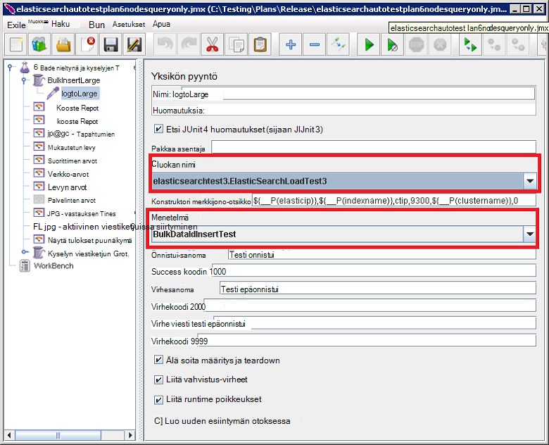

<properties
   pageTitle="Automaattinen Elasticsearch suorituskyvyn testien suorittaminen | Microsoft Azure"
   description="Kuvaus siitä, miten voit suorittaa suorituskyvyn Testaa oman ympäristössä."
   services=""
   documentationCenter="na"
   authors="dragon119"
   manager="bennage"
   editor=""
   tags=""/>

<tags
   ms.service="guidance"
   ms.devlang="na"
   ms.topic="article"
   ms.tgt_pltfrm="na"
   ms.workload="na"
   ms.date="09/22/2016"
   ms.author="masashin"/>
   
# <a name="running-the-automated-elasticsearch-performance-tests"></a>Automaattinen Elasticsearch suorituskyvyn testien suorittaminen

[AZURE.INCLUDE [pnp-header](../../includes/guidance-pnp-header-include.md)]

Tässä artikkelissa on [sarjaan kuuluvan](guidance-elasticsearch.md). 

Asiakirjojen [säädön tietojen nieltynä suorituskyvyn Elasticsearch Azure-] ja [säädön tietojen koostaminen ja kyselyjen suorituskykyä koskevat Elasticsearch Azure-] kuvaavat luvuksi, joka on suorittamalla otoksen Elasticsearch klusterin suorituskyvyn testien.

Näiden testien on komentosarjatoimintojen he voivat suorittaa automaattisen tavalla. Tässä asiakirjassa kuvataan, kuinka voit toistaa testejä oman ympäristössä.

## <a name="prerequisites"></a>Edellytykset

Automaattinen testejä tarvitaan seuraavia kohteita:

-  Elasticsearch-klusterin.

- JMeter ympäristön asetukset ohjeiden [luominen Azure-Elasticsearch suorituskyvyn testauksen ympäristön]asiakirja.

- [Python 3.5.1](https://www.python.org/downloads/release/python-351/) JMeter perustyylin AM asennettuna.


## <a name="how-the-tests-work"></a>Testejä maksaminen
Testejä suoritetaan käyttämällä JMeter. JMeter perusmuodon Serverin Lataa käsittelee testaussuunnitelmaa ja välittää sen JMeter alisteiset palvelimissa, jotka todella testit joukko. JMeter perusmuodon palvelimen koordinoi JMeter alisteiset palvelimet ja kasvaa tulokset.

Seuraavat testi suunnitelmat toimitetaan:

* [elasticsearchautotestplan3nodes.jmx](https://github.com/mspnp/azure-guidance/blob/master/ingestion-and-query-tests/templates/elasticsearchautotestplan3nodes.jmx). Suorittaa nieltynä testi 3-solmu-klusterin päälle.

* [elasticsearchautotestplan6nodes.jmx](https://github.com/mspnp/azure-guidance/blob/master/ingestion-and-query-tests/templates/elasticsearchautotestplan6nodes.jmx). Suorittaa nieltynä testi yli 6-solmu-klusterin.

* [elasticsearchautotestplan6qnodes.jmx](https://github.com/mspnp/azure-guidance/blob/master/ingestion-and-query-tests/templates/elasticsearchautotestplan6qnodes.jmx). Suorittaa nieltynä ja kyselyä testi yli 6-solmu-klusterin.

* [elasticsearchautotestplan6nodesqueryonly.jmx](https://github.com/mspnp/azure-guidance/blob/master/ingestion-and-query-tests/templates/elasticsearchautotestplan6nodesqueryonly.jmx). Suorittaa vain kyselyä testi yli 6-solmu-klusterin.


Voit käyttää näitä testata suunnitelmien oman skenaariot perustana vähemmän tai Lisää solmujen tarvittaessa.

Testi-suunnitelmien avulla JUnit pyynnön värimallin-tulostus Luo ja lataa sitten testitiedot. JMeter testaussuunnitelmaa Luo ja suorittaa tämän värimallin tulostus ja valvoo kunkin suorituskykytietoja Elasticsearch solmut.  

## <a name="building-and-deploying-the-junit-jar-and-dependencies"></a>Luominen ja käyttöönotto JUnit JAR ja riippuvuudet
Ennen kuin suoritat Lataa suorituskyvyn testejä, käännä ja ota käyttöön suorituskyvyn/junitcode-kansiossa sijaitseva JUnit testejä. Nämä kokeet, joihin viitataan JMeter testaussuunnitelmaa. Lisätietoja "Aiemman JUnit testiprojektin tuominen Pimennys" menettelyn [käyttöönotto JMeter JUnit värimallin tulostus testikäyttöön Elasticsearch suorituskyvyn]asiakirjassa.

On kaksi versiota JUnit testit: 

- [Elasticsearch1.73](https://github.com/mspnp/azure-guidance/tree/master/ingestion-and-query-tests/junitcode/elasticsearch1.73). Käytettävä koodi nieltynä testejä tekemistä varten. Näiden testien käyttää Elasticsearch 1.73.

- [Elasticsearch2](https://github.com/mspnp/azure-guidance/tree/master/ingestion-and-query-tests/junitcode/elasticsearch2). Käytettävä koodi kyselyn testejä tekemistä varten. Näiden testien käyttää Elasticsearch 2.1 ja uudempi versio.

Kopioi haluamasi Java arkistoinnin (JAR)-tiedoston loppuun riippuvuudet yhdessä JMeter-tietokoneissa. Prosessi on kuvattu [käyttöönotto JMeter JUnit värimallin tulostus testikäyttöön Elasticsearch suorituskykyä][]. 

> **Tärkeää** Kun käyttöönotto JUnit testi JMeter avulla voit ladata ja määrittää testin palvelupaketin viitata JUnit tämän testin ja varmistaa, BulkInsertLarge viestiketjun ryhmän viittaa oikea PURKKI tiedosto, JUnit luokkanimi ja menetelmä:
> 
> 
> 
> Tallenna päivitetty testi-suunnitelmien ennen kuin suoritat testejä.

## <a name="creating-the-test-indexes"></a>Testi-indeksien luomiseen
Kunkin testin suorittaa nieltynä ja/tai kyselyitä, jotka perustuvat yhden indeksin määritetty testi suoritettaessa. Olisi tiedostoja [säädön tietojen nieltynä suorituskyvyn Elasticsearch Azure-] ja [säädön tietojen koostaminen ja kyselyjen suorituskykyä koskevat Elasticsearch Azure-] lisäykset kuvattu rakenteiden avulla indeksin luominen ja määrittää niitä mukaan testi skenaarion (tiedoston arvot käytössä/poissa käytöstä, useita replikoita ja jne.) Huomaa, että testi-suunnitelmien oletetaan, että indeksi sisältää yksittäisen *ctip*-tyypin.

## <a name="configuring-the-test-script-parameters"></a>Testi komentosarjan parametrien määrittäminen
Kopioi seuraavat testi komentosarjan parametritiedostot JMeter server-tietokoneessa:

* [run.properties](https://github.com/mspnp/azure-guidance/blob/master/ingestion-and-query-tests/run.properties). Tämä tiedosto määrittää määrä JMeter testi viestiketjuissa siirtyminen käyttäminen, kesto (sekunteina) testin solmu (tai kuormituksen Elasticsearch-klusterin) IP-osoite ja klusterin nimi.

  ```ini
  nthreads=3
  duration=300
  elasticip=<IP Address or DNS Name Here>
  clustername=<Cluster Name Here>
  ```
  
  Muokkaa tiedostoa ja määritä numero- ja klusterin haluamasi arvot.

* [kyselyn määritys-win.ini](https://github.com/mspnp/azure-guidance/blob/master/ingestion-and-query-tests/query-config-win.ini) ja [kysely-config-nix.ini](https://github.com/mspnp/azure-guidance/blob/master/ingestion-and-query-tests/query-config-nix.ini). Nämä tiedostot sisältävät samat tiedot; *win* -tiedosto on muotoiltu Windows tiedostonimiä ja polkujen ja *nix* -tiedosto on muotoiltu Linux tiedostonimiä ja polut:

  ```ini
  [DEFAULT]
  debug=true #if true shows console logs.

  [RUN]
  pathreports=C:\Users\administrator1\jmeter\test-results\ #path where tests results are saved.
  jmx=C:\Users\administrator1\testplan.jmx #path to the JMeter test plan.
  machines=10.0.0.1,10.0.0.2,10.0.0.3 #IPs of the Elasticsearch data nodes separated by commas.
  reports=aggr,err,tps,waitio,cpu,network,disk,response,view #Name of the reports separated by commas.
  tests=idx1,idx2 #Elasticsearch index(es) name(s) to test, comma delimited if more than one.
  properties=run.properties #Name of the properties file.
  ```

  Muokata tätä tiedostoa, Määritä tutkimustulosten sijainnit JMeter testaussuunnitelmaa suorittamiseen, Elasticsearch tietojen solmut ovat kerääminen suorituskyvyn mittarit, raportteja, joissa raaka suorituskyvyn tietoja, jotka luodaan, IP-osoitteet ja nimi (tai nimet luetteloerotin), index(es) testattavan, jos useamman kuin yhden nimi , testit suoritetaan peräkkäin. Jos run.properties tiedosto sijaitsee toiseen kansioon tai kansio, määrittää tämän tiedoston koko polku.

## <a name="running-the-tests"></a>Testien suorittaminen

* Kopioi tiedosto [kyselyn test.py](https://github.com/mspnp/azure-guidance/blob/master/ingestion-and-query-tests/query-test.py) JMeter server-koneen samaan kansioon run.properties ja kysely-config-win.ini (kysely-config-nix.ini) tiedostoja.

* Varmista, että jmeter.bat (Windows) tai jmeter.sh (Linux) ovat suoritettavan polulla-ympäristössä.

* Suorita kysely test.py-komentosarja testien suorittamiseen komentoriviltä:

  ```cmd
  py query-test.py
  ```

* Kun testaus on suoritettu, tulokset on tallennettu joukko pilkuilla erotetut arvot-kysely-config-win.ini (kysely-config-nix.ini)-tiedosto (CSV) tiedostot. Excelin avulla voit analysoida ja kaavion tiedot.


[Azure-Elasticsearch tietojen nieltynä suorituskyvyn säätö]: guidance-elasticsearch-tuning-data-ingestion-performance.md
[Tietojen koostaminen ja Elasticsearch Azure-kyselyn suorituskykyä]: guidance-elasticsearch-tuning-data-aggregation-and-query-performance.md
[Suorituskyvyn, testaus Elasticsearch Azure-ympäristön luominen]: guidance-elasticsearch-creating-performance-testing-environment.md
[Käyttöönotto testikäyttöön Elasticsearch suorituskyvyn JMeter JUnit värimallin-tulostus]: guidance-elasticsearch-deploying-jmeter-junit-sampler.md
