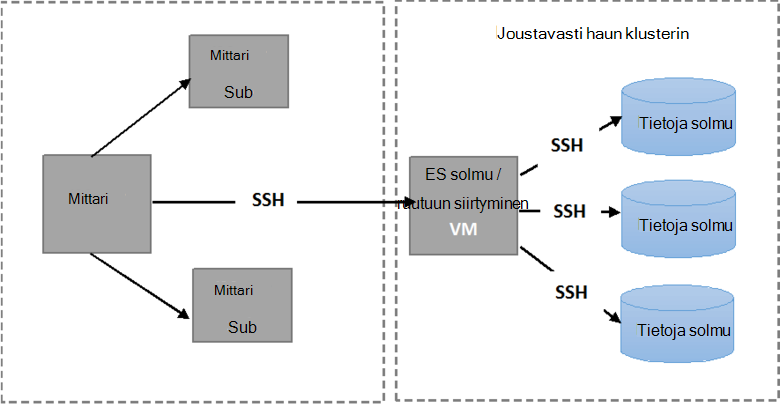

<properties
   pageTitle="Automaattinen Elasticsearch vikasietoisuudelle testien suorittaminen | Microsoft Azure"
   description="Kuvaus siitä, miten voit suorittaa vikasietoisuudelle testejä oman ympäristössä."
   services=""
   documentationCenter="na"
   authors="dragon119"
   manager="bennage"
   editor=""
   tags=""/>

<tags
   ms.service="guidance"
   ms.devlang="na"
   ms.topic="article"
   ms.tgt_pltfrm="na"
   ms.workload="na"
   ms.date="09/22/2016"
   ms.author="masashin"/>

# <a name="running-the-automated-elasticsearch-resiliency-tests"></a>Automaattinen Elasticsearch vikasietoisuudelle testien suorittaminen

[AZURE.INCLUDE [pnp-header](../../includes/guidance-pnp-header-include.md)]

Tässä artikkelissa on [sarjaan kuuluvan](guidance-elasticsearch.md).

[Asetusten määrittäminen toimintakykyyn]ja palautus-Elasticsearch Azure-[elasticsearch-resilience-recovery], on kuvattu testit, jotka on suoritettu vastaan otoksen Elasticsearch klusteriin ja määrittää, kuinka hyvin järjestelmän vastannut joitakin yleisiä lomakkeiden virheen ja kuinka hyvin palauttaa sarjaa. Testejä on komentosarjatoimintojen he voivat suorittaa automaattisen tavalla. Tässä asiakirjassa kuvataan, kuinka voit toistaa testejä oman ympäristössä. 

Testaa on seuraavissa tilanteissa:

- **Solmun virheen ja käynnistä se uudelleen ilman yksityiskohtien tiedot**. Tietoja solmu pysäytetään ja käynnistetään uudelleen 5 minuutin kuluttua.
Elasticsearch on määritetty ei, jos haluat kohdistaa puuttuu shards tällöin LUOTTAMUSVÄLI uudelleen, jotta ei ole muita i/o on aiheutuneet shards siirtyminen. Solmun käynnistyessä palauttaminen näyttää shards solmun takaisin ajan tasalla.

- **Kriittinen tietojen menettämisen solmu virhe**. Tietoja solmu pysäytetään ja tiedot, jotka se pitää poistetaan voit simuloida kriittinen levyn. Solmun sitten käynnistetään (jälkeen 5 minuuttia), tehokkaasti visuaalisessa muodossa korvaa alkuperäinen solmu. Palauttaminen edellyttää, joiden solmu puuttuvat tiedot, ja voi liittyä kunnolliselle shards pidetään muissa solmuissa.

- **Solmun virheen ja käynnistä se uudelleen tietojen menetyksiltä, mutta shard Uudelleenkohdistamista**. Tietoja solmu on estetty eikä shards, jossa se on ovat uudelleen solmujen. Solmun käynnistetään ja lisää Uudelleenkohdistamista ilmenee saattaa jälleen tasapainoon klusterin.

- **Liikkuva päivitykset**. Klusterin kunkin solmun pysäytetään ja jälkeen lyhyt aikaväli, jotta saadaan aikaan koneet, kun ohjelmistopäivitys on käynnistettävä uudelleen. Vain yksi solmu pysäytetään tiettynä hetkenä.
Shards ei uudelleen, kun solmu ei ole käytettävissä.

## <a name="prerequisites"></a>Edellytykset

Automaattinen testejä tarvitaan seuraavia kohteita:

- Elasticsearch-klusterin.

- JMeter ympäristön asetukset ohjeiden mukaan [suorituskyvyn testauksen ohjeita]. 

- Seuraavat lisäykset JMeter perusmuodon AM vain asennettuina.

    - Java Runtime 7.

    - Nodejs 4.x.x tai uudempi versio.

    - Git komentorivi-työkaluja.

## <a name="how-the-scripts-work"></a>Komentosarjojen toiminta

Testi-komentosarjat on tarkoitettu toimimaan JMeter perustyyli AM. Kun olet valinnut Suorita testi, komentosarjat suorittaa toimintoja seuraavassa järjestyksessä:

1.  Aloita JMeter-testaussuunnitelmaa, jonka olet määrittänyt parametrien siirtäminen.

2.  Kopioi komentosarja, joka tekee klusterin määritetyn AM testin edellyttämiä toimintoja. Tämä voi olla AM, jossa on julkinen IP-osoite tai *Jumpbox* AM, jos olet luonut klusterin [Azure Elasticsearch pikaopas mallin](https://github.com/Azure/azure-quickstart-templates/tree/master/elasticsearch)avulla.

3.  Suorita komentosarja AM (tai Jumpbox).

Seuraava kuva esittää testiympäristössä ja Elasticsearch klusterin rakenteen. Huomaa, että testi-komentosarjoja muodostaa yhteyttä klusterin suorittamaan eri Elasticsearch toimintoja, kuten pysäyttäminen tai käynnistäminen uudelleen solmu kunkin solmun suojattu runko (SSH) avulla.



## <a name="setting-up-the-jmeter-tests"></a>Testaa, JMeter määrittäminen

Ennen kuin käynnissä toimintakykyyn Testaa olisi Käännä ja käyttöönotto JUnit testejä vikasietoisuudelle/jmeter/testien-kansiossa. Nämä kokeet, joihin viitataan JMeter testaussuunnitelmaa. Lisätietoja on kohdassa "Aiemman JUnit testiprojektin tuominen Pimennys" kuvatulla tavalla [käyttöönotto JMeter JUnit värimallin tulostus testikäyttöön Elasticsearch suorituskyvyn][].

On kaksi versiota JUnit testejä pidetään seuraaviin kansioihin:

- **Elasticsearch17.** Tässä kansiossa project Luo Elasticsearch17.jar-tiedoston. Käytä tätä PURKKI testikäyttöön Elasticsearch versiot 1.7.x

- **Elasticsearch20**. Tässä kansiossa project Luo Elasticsearch20.jar-tiedoston. Käytä tätä PURKKI testikäyttöön Elasticsearch versio 2.0.0 ja sitä uudemmissa versioissa

Kopioi PURKKI tiedoston loppuun riippuvuudet yhdessä JMeter-tietokoneissa. Prosessi on kuvattu "JMeter JUnit testi käyttöönotto" [käyttöönotto JMeter JUnit värimallin tulostus testauksen Elasticsearch suorituskyvyn]menetelmällä.

## <a name="configuring-vm-security-for-each-node"></a>Kukin solmu AM suojauksen määrittäminen

Testi-komentosarjoja edellyttävät kunkin Elasticsearch solmun klusterin asennetaan tarkistus-sertifikaatti. Näin voi suorittaa automaattisesti kysymättä käyttäjänimi tai salasana, kun he muodostaa eri VMs komentosarjoja.

Aloita kirjautumalla sisään johonkin solmujen Elasticsearch klusterin (tai Jumpbox AM) ja suorita seuraava komento luo todennus-näppäintä:

```Shell
ssh-keygen -t rsa
```

Yhdistettynä Elasticsearch solmu (tai Jumpbox), tee seuraavat komennot jokaisen solmun hän Elasticsearch klusterin. Korvaa `<username>` kelvollinen käyttäjä kunkin AM ja korvaa nimellä `<nodename>` DNS-nimen tai isännöinnin Elasticsearch-solmu AM IP-osoite.
Huomaa, että sinua pyydetään käyttäjän salasanan suoritettaessa näitä komentoja.
Katso lisätietoja [SSH kirjautuminen ilman salasanaa](http://www.linuxproblem.org/art_9.html):

```Shell
ssh <username>@<nodename> mkdir -p .ssh (
cat .ssh/id\_rsa.pub | ssh <username>*@<nodename> 'cat &gt;&gt; .ssh/authorized\_keys'
```

## <a name="downloading-and-configuring-the-test-scripts"></a>Lataaminen ja Testaa komentosarjat määrittäminen

Testi-komentosarjoja toimitetaan Git säilöön. Lataa ja määritä komentosarjat seuraavien ohjeiden avulla.

Tietokoneessa JMeter perustyyli jossa suoritat testejä Avaa Git työpöydän ikkunan (Git Bash) ja Kloonaa säilö, joka sisältää komentosarjojen seuraavasti:

```Shell
git clone https://github.com/mspnp/azure-guidance.git
```

Vikasietoisuudelle testien-kansioon ja suorittamalla seuraavan komennon riippuvuussuhteita testejä suorittamiseen vaadittava asentaminen:

```Shell
npm install
```

Jos JMeter päällikön on käynnissä Windows, Lataa [Plink](http://www.chiark.greenend.org.uk/~sgtatham/putty/download.html), eli käyttöliittymä painovärit, muste Telnet asiakkaalle. Kopioi suoritettava Plink vikasietoisuudelle testien/lib-kansioon.

Jos JMeter perustyyli on käynnissä Linux, sinun ei tarvitse ladata Plink, mutta haluat määrittää salasanan pienempi SSH JMeter perustyyli ja Elasticsearch solmu tai Jumpbox käytit noudattamalla ohjeiden mukaisesti "määrittäminen AM suojauksen kunkin solmun." 

Seuraavat määritykset parametrit, valitse Muokkaa `config.js` testiympäristössä ja Elasticsearch klusterin-tiedosto. Nämä parametrit on yhteiset testit:

| Nimi | Kuvaus | Oletusarvo |
| ---- | ----------- | ------------- |
| `jmeterPath` | Paikallinen polku, jossa JMeter sijaitsee. | `C:/apache-jmeter-2.13` |
| `resultsPath` | Suhteellinen kansio, jossa komentosarja kirjoittaa tulos. | `results` |
| `verbose` | Ilmaisee, onko komentosarja tulostaa yksityiskohtaisessa tilassa vai ei. | `true` |
| `remote` | Ilmaisee, onko JMeter testien suorittaminen paikallisesti tai remote-palvelimiin. | `true` |
| `cluster.clusterName` | Elasticsearch-klusterin nimi. | `elasticsearch` |
| `cluster.jumpboxIp`         | Jumpbox koneen IP-osoite.                 |-|
| `cluster.username`          | Olet luonut otettaessa klusterin Järjestelmänvalvojakäyttäjä. |-|
| `cluster.password`          | Järjestelmänvalvoja-käyttäjän salasanan.                        |-|
| `cluster.loadBalancer.ip`   | Elasticsearch kuormituksen IP-osoite.    |-|
| `cluster.loadBalancer.url`  | Kuormituksen perus URL-osoite.                          |-|

## <a name="running-the-tests"></a>Testien suorittaminen

Vikasietoisuudelle testien-kansioon ja suorita seuraava komento:

```Shell
node app.js
```

Saat seuraavan valikon pitäisi näkyä:


Skenaario, jonka haluat suorittaa määrä: `11`, `12`, `13` tai `21`. 

Kun olet valinnut tilanne, testi suoritetaan automaattisesti. Tulokset on tallennettu CSV (CSV) luotu tulokset hakemiston kansiossa sijaitsevien tiedostojen sarjana. Jokaisen on oma tulokset-kansio.
Excelin avulla voit analysoida ja kaavion tiedot.

[Running Elasticsearch on Azure]: guidance-elasticsearch-running-on-azure.md
[Tuning Data Ingestion Performance for Elasticsearch on Azure]: guidance-elasticsearch-tuning-data-ingestion-performance.md
[Suorituskyvyn testaaminen ohjeet]: guidance-elasticsearch-creating-performance-testing-environment.md
[JMeter guidance]: guidance-elasticsearch-implementing-jmeter.md
[Considerations for JMeter]: guidance-elasticsearch-deploying-jmeter-junit-sampler.md
[Query aggregation and performance]: guidance-elasticsearch-query-aggregation-performance.md
[elasticsearch-resilience-recovery]: guidance-elasticsearch-configuring-resilience-and-recovery.md
[Resilience and Recovery Testing]: guidance-elasticsearch-running-automated-resilience-tests.md
[Käyttöönotto testikäyttöön Elasticsearch suorituskyvyn JMeter JUnit värimallin-tulostus]: guidance-elasticsearch-deploying-jmeter-junit-sampler.md
