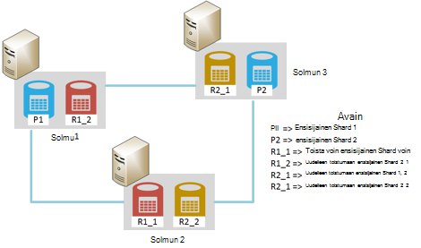
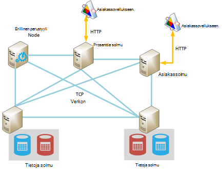
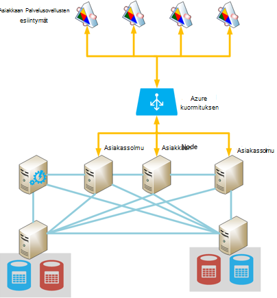
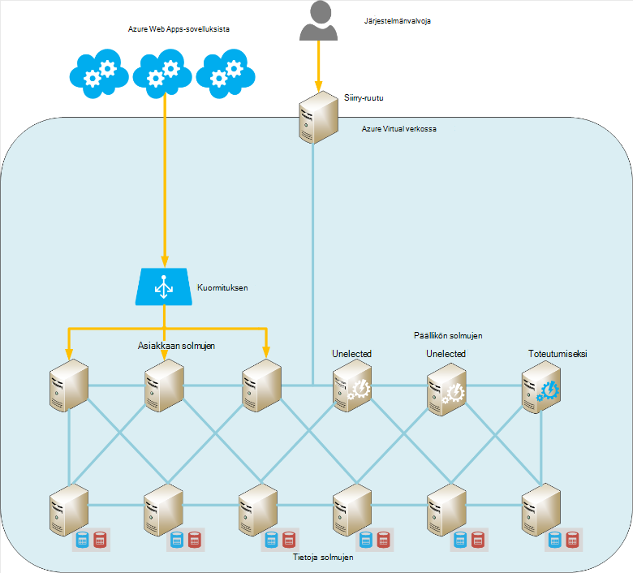

<properties
   pageTitle="Elasticsearch käytössä Azure | Microsoft Azure"
   description="Voit asentaa ja määrittää suorittaa Elasticsearch Azure."
   services=""
   documentationCenter="na"
   authors="dragon119"
   manager="bennage"
   editor=""
   tags=""/>

<tags
   ms.service="guidance"
   ms.devlang="na"
   ms.topic="article"
   ms.tgt_pltfrm="na"
   ms.workload="na"
   ms.date="09/22/2016"
   ms.author="masashin"/>

# <a name="running-elasticsearch-on-azure"></a>Azure Elasticsearch käytössä

[AZURE.INCLUDE [pnp-header](../../includes/guidance-pnp-header-include.md)]

Tässä artikkelissa on [sarjaan kuuluvan](guidance-elasticsearch.md). 

## <a name="overview"></a>Yleiskatsaus

Tämä asiakirja on lyhyt esittely Elasticsearch Yleiset rakenteen ja kuvataan, miten voit toteuttaa käyttämällä Azure Elasticsearch-klusterin. Se koskettaa käyttöönoton Elasticsearch-klusterin, Keskittävä eri toimintojen suorituskyvyn ja vaatimuksia järjestelmän ja miten tarpeen vaikuttavat määritys ja topologian, kun valitset ottavat parhaat käytännöt.

> [AZURE.NOTE] Nämä ohjeet oletetaan, että jotkin [Elasticsearch][]basic tuntemusta.

## <a name="the-structure-of-elasticsearch"></a>Elasticsearch rakenne 

Elasticsearch on optimoitu erittäin hakukone edustajana asiakirjan tietokanta. Tiedostot ovat muuntaa sarjaksi JSON-muodossa. Tiedot säilytetään indeksit-toteutettu käyttämällä [Apache Lucene][], vaikka tiedot ovat otetaan näkymästä ja ei tarvitse ymmärtänyt Lucene, jotta voit käyttää Elasticsearch.

### <a name="clusters-nodes-indexes-and-shards"></a>Klustereiden, solmujen tai indeksien shards

Elasticsearch toteuttaa liitetty arkkitehtuuri, joka käyttää sharding tietojen jakamiseen eri solmujen ja suuren käytettävyyden antamaan sallittuja välillä. Indeksit ovat tallennetut tiedostot. Käyttäjä voi määrittää asiakirjan-kenttiin voidaan yksilöivät sisällä indeksin tai järjestelmä voi luoda avaimen kenttä ja arvot automaattisesti. Indeksi voidaan järjestää fyysisesti tiedostoja ja lyhennys tarkoittaa tiedostojen etsimiseen. 

Indeksin sisältää shards. Asiakirjojen tasaisesti keskiarvosta yli shards käyttämällä hajautusfunktiota indeksin avainarvot ja shards indeksissä määrän perusteella. 

Indeksit voi replikoida. Tällöin kunkin shard indeksissä kopioidaan. Elasticsearch varmistetaan, että kunkin alkuperäisen shard, indeksi (jota kutsutaan "ensisijainen shard") ja sen replikan ovat aina eri solmujen. Kun asiakirja on lisätty tai joita olet muokannut, kaikki kirjoittaa toiminnot suoritetaan ensimmäinen ja replikoissa ensisijainen shard. 

Alla olevassa kuvassa Elasticsearch-klusterin, joka sisältää kolme solmujen olennaiset ominaisuuksia. Indeksi on luotu, joka koostuu kahdesta ensisijainen shards kunkin shard (kuusi shards kaikissa) replikat kanssa.



*Yksinkertainen Elasticsearch klusterin, joka sisältää kaksi ensisijainen solmujen ja kahdet replikoiden*

Tämän klusterin ensisijainen shard 1 ja 2 ensisijainen shard sijaitsevat eri solmujen kuormituksen tasaamiseen kattavia. Replikat vastaavasti jaetaan. Jos yksi solmu epäonnistuu, jäljellä olevissa solmuissa on riittävät tiedot järjestelmän jatkossa. Valitse tarvittaessa Elasticsearch edistää replikan shard, voit liittyä ensisijainen shard, jos vastaava ensisijainen shard ei ole käytettävissä.

### <a name="node-roles"></a>Solmun roolit

Elasticsearch-klusterin solmujen suorittaa seuraavia rooleja:

- **Solmun tiedot** , jotka voivat sisältää vähintään yhden shards indeksi tietoja sisältävien.

- **Asiakassolmu** , joka ei sisällä, mutta tietojen indeksointiin käsittelee asiakassovelluksissa tarvittavat tiedot solmun tekemät pyynnöt.
 
- **Perusmuodon solmu** , joka ei pidä indeksitiedot mutta, joka tekee klusterin hallintatoiminnot, kuten ylläpito ja jakaminen reititystiedot ympärille klusterin (luettelo, jonka solmut sisältävät mitä shards) määrittämiseksi, solmut ovat käytettävissä kunnolliselle shards solmujen näkyviin ja poistuvat ja yhteensovittamisesta palautus solmun virheen jälkeen. Useita solmujen voi määrittää kuin perustyylejä, mutta vain yksi todella toteutumiseksi perusmuodon toimintoihin. Jos tämä solmu epäonnistuu, toiseen osavaltioiden tapahtuu ja jokin muiden olevalla perusmuodon solmujen valittuna ja menee.

> [AZURE.NOTE]Perusmuodon valittu solmu on ehdottoman tärkeää klusterin hyvin-sitä. Muiden solmujen kutsu sitä säännöllisesti, voit varmistaa, että se on edelleen käytettävissä. Jos perusmuodon valittu solmu toimii myös tietojen solmu, on mahdollisuus solmu voi olla varattu ja virheiden vastata nämä työprosesseista. Tässä tilanteessa perusmuodon katsotaan epäonnistuneen ja jokin perusmuodon solmujen on valittuna sijaintia. 

 Alla olevassa kuvassa on erillinen perustyyli, asiakkaan ja Elasticsearch-klusterin solmujen tiedot sisältävä verkkotopologia.



*Näyttää erilaisia solmujen Elasticsearch-klusterin*

### <a name="costs-and-benefits-of-using-client-nodes"></a>Kustannusten ja asiakkaan solmujen edut

Kun sovellus lähettää Elasticsearch-klusterin kyselyn, solmu, johon sovellus muodostaa on vastuussa ohjaavat kyselyn prosessi. Solmun välittää tietoja kunkin solmun pyynnön ja kerää tulokset kertynyt tiedot palaaminen sovellus. Jos kyselyn koosteet ja muut funktiolauseita, solmu, johon sovellus muodostaa suorittaa tarvittavat laskutoimitukset hakemisen tiedot kaikkien muiden solmujen jälkeen. Piste-ja tarvittavan prosessia voivat käyttää huomattavan käsittelyn ja muistin resursseja.

Erillinen asiakkaan solmujen näiden tehtävien suorittamiseen avulla tietojen solmujen keskittyminen hallinta ja tietojen tallentaminen. Tulos on skenaarioita, joihin sisältyy monimutkaisia kyselyjä ja koosteet hyötyvät erillinen asiakkaan solmujen avulla. Vaikutus käyttämällä erillinen asiakkaan solmujen vaihtelevat kuitenkin todennäköisesti skenaarion, työmäärää ja klusteri mukaan. 

> [AZURE.NOTE] Lisätietoja [tietojen koostaminen säätäminen ja kyselyjen suorituskykyä koskevat Elasticsearch Azure-][] lisätietoja säätäminen prosessi.

### <a name="connecting-to-a-cluster"></a>Yhteyden muodostaminen klusterin

Elasticsearch paljastaa REST API sarjaa asiakkaan sovellusten luominen ja lähettäminen pyynnöt klusteriin. Jos kehität sovellusten .NET Framework-kaksi suurempi tasot ohjelmointirajapinnan ovat käytettävissä – [Elasticsearch.Net & SISÄKKÄISET][].

Jos kokoat asiakassovelluksissa Java avulla, voit [Solmu Client API][] Luo asiakkaan solmujen dynaamisesti ja lisätä ne klusterin. Luominen asiakkaan solmujen dynaamisesti on kätevä, jos järjestelmässä on käytössä on suhteellisen vähän pitkäikäiset yhteydet. Asiakkaan solmujen luotu solmu Ohjelmointirajapinnan toimitetaan kanssa klusterin reititys Määritä (tiedot, joista solmujen sisältävät mitä shards), master solmu mukaan. Nämä tiedot mahdollistaa yhteyden muodostamiseen asianmukaiset solmut indeksoinnin tai tietojen, vähentää, joka voi olla tarpeen muiden ohjelmointirajapinnan käytettäessä siirräntävälien määrä kyselyt Java-sovellus.

Tämän menetelmän kustannus on katseltavan, rekisteröiminen asiakassolmu klusterin kyselyjä. Jos suuri määrä client solmujen näyttöön ja katoavat nopeasti, ylläpito ja jakaminen klusterin reititys kartan vaikutus voi olla merkittäviä.

Alla olevassa kuvassa määritys, joka käyttää kuormituksen tasauspalvelun pyynnöt reitittämiseen solmujen client joukko saman strategia avulla voidaan muodostaa suoraan tietojen solmujen asiakkaan solmujen ei käytetä.



*Yhteyden muodostaminen Azure kuormituksen Elasticsearch-klusterissa asiakkaan Palvelusovellusten esiintymät*

> [AZURE.NOTE][Azure ladata tasaustoiminto][] avulla voit näyttää julkinen Internet-klusterin tai voit käyttää [sisäinen kuormituksen][] , jos asiakassovellusten ja klusterin sisältyvät täysin samaa näennäisen yksityisverkon (VNet).

### <a name="node-discovery"></a>Solmun etsiminen

Elasticsearch perustuu vertaisääni-tietoliikenne, joten etsiminen solmujen klusterissa on tärkeä osa elinkaari-solmun. Solmun etsiminen mahdollistaa uusien tietojen solmujen liitettävään dynaamisesti klusterin, jonka avulla puolestaan klusterin skaalata läpinäkyvä. Lisäksi jos tietojen solmu lakkaa vastaamasta communications pyyntöihin-solmujen, perusmuodon solmu voit päättää, että tiedot-solmu on epäonnistunut ja tarvittavat toimenpiteet kohdistaa shards, se on tilalla solmujen toiminnallisia tiedot uudelleen.

Etsintä-moduulin käsittelee Elasticsearch solmu etsiminen. Etsintä-moduuli on laajennuksen, jota voidaan käyttää eri etsiminen järjestelmä. Oletusarvoinen etsiminen moduulin ([Zen][]) aiheuttaa solmu lähettääksesi ping pyynnöt etsiminen solmujen samassa verkossa. Jos solmujen vastaa, ne juorutaan vaihtamiseksi. Perusmuodon solmu voit jakaa shards uusi solmu (jos se on tietoja solmu) ja saattaa jälleen tasapainoon klusterin. Zen etsiminen moduulin käsittelee myös perusmuodon osavaltioiden prosessi- ja protokolla tunnistamiseen solmun virheen.

Lisäksi, jos käytät Elasticsearch solmujen Azure-virtuaalikoneissa (VMs), moni messaging ei tueta. Tämän vuoksi kannattaa määrittää Zen etsiminen unicast viestintä ja Anna kelvollinen yhteyshenkilön solmujen elasticsearch.yml määritystiedostossa luettelo.

Jos isännöit Elasticsearch-klusterin Azure virtual verkossa, voit määrittää, että yksityistä DHCP määritettyjä IP osoitettu kunkin annettavat AM klusterin pitää kohdistettu (staattinen). Voit määrittää Zen etsiminen unicast messaging käyttämällä nämä staattinen IP-osoitteet. Jos käytössäsi on VMs dynaamisia IP-osoitteita, ota huomioon, että jos AM pysähtyy ja käynnistää sen voi kohdentaa tekeminen etsiminen vaikeaa uusi IP-osoite. Tässä skenaariossa käsittelemään voit muuttaa Zen etsiminen moduulin [Azure Cloud laajennuksen][]. Laajennus käyttää Azure-Ohjelmointirajapinnan toteuttamisesta etsintä-järjestelmä, joka perustuu Azure Tilaustiedot.

> [AZURE.NOTE]Nykyinen versio Azure Cloud laajennus edellyttää, että Asenna Azure tilauksen hallinta-varmenteen Elasticsearch solmun Java-keystore ja antaa käyttäminen keystore elasticsearch.yml-tiedoston sijainti ja tunnistetiedot. Tätä tiedostoa pidetään pelkkänä tekstinä, jotta suodatintoimintoja varmistaa tämä tiedosto on käytettävissä vain mukaan tili Elasticsearch-palvelua. 
> 
> Lisäksi tämän menetelmän ei ehkä ole yhteensopiva Azure resurssien hallinnan käyttöönotto. Seuraavien syiden takia on suositeltavaa käyttää perusmuodon solmujen staattinen IP-osoitteet ja nämä solmut avulla voit toteuttaa Zen etsiminen unicast messaging klusterin yli. Seuraavat määrityksessä (tehdyt otoksen tietojen solmu elasticsearch.yml-tiedostosta) isännän IP-osoitteiden viittaus-klusterin perusmuodon solmut:

```yaml
discovery.zen.ping.multicast.enabled: false  
discovery.zen.ping.unicast.hosts: ["10.0.0.10","10.0.0.11","10.0.0.12"]
```

## <a name="general-system-guidelines"></a>Järjestelmän Yleiset ohjeet

Elasticsearch voit suorittaa useissa tietokoneissa-yhden kannettavan tietokoneen tehokkaimpia palvelimia klusterin väliltä. Lisää resursseja kannalta muistin tietojenkäsittely power ja nopea kiintolevyjen, jotka ovat kuitenkin käytettävissä sitä parempia suorituskykyä. Seuraavissa osissa on yhteenveto laitteiston ja ohjelmiston edellytykset Elasticsearch suorittamista varten.

### <a name="memory-requirements"></a>Muistin vaatimukset 

Elasticsearch yrittää tallentaa tiedot nopeuden ladatun. Tuotannon isäntäpalvelimen tyypillinen enterprise- tai Keskitaso kokoisen kaupallisen käyttöönoton Azure-solmu on 14 gt ja 28 Gigatavua RAM-Muistia (D3 tai D4 VMs) välillä. **Kerro yli Lisää solmujen sijaan muistia luominen solmujen lataaminen** (Kokeissa on näkyvissä, että suurempi solmujen käyttäminen muistia voivat aiheuttaa virheen sattuessa kertaa pidempi palauttaminen.) Kuitenkin luodaan klustereiden pieni solmujen erittäin suuri määrä voi parantaa käytettävyys ja siirtonopeuden, vaikka se myös siirtää tietueen palveluneuvojatasolle yhdistävää hallinta ja ylläpito järjestelmän työmäärään.

**Kohdistaa 50 % käytettävissä oleva muisti Elasticsearch keon palvelimeen**. Jos käytössäsi on Linux määrittäminen ES_HEAP_SIZE ympäristömuuttuja ennen kuin suoritat Elasticsearch. Jos käytössäsi on Windows- tai Linux, voit myös määrittää muistin koon `Xmx` ja `Xms` parametrit Elasticseach käynnistyessä. Määritä molemmat parametrit on sama arvo Java virtuaalikoneen (JVM) koon suorituksen keon välttämiseksi. Kuitenkin **ei varata yli 30 Gigatavua**. Käytä jäljellä olevan muistin käyttöjärjestelmän Tiedostovälimuistin.

> [AZURE.NOTE]Elasticsearch käyttämällä voit luoda ja hallita indeksit Lucene-kirjasto. Lucene rakenteet käyttää levylle muotoa ja välimuistiin välimuistin näiden rakenteiden merkittävästi parantaa suorituskykyä.

Huomaa, että suurin optimaalisen keon koko Java 64-bittinen tietokoneeseen yläpuolella 30 Gigatavua. Edellä kooksi Java siirtyy käyttämällä laajennettua järjestelmä viittaava keon objekteja, mitkä kasvaa kunkin objektin Muistivaatimukset ja vähentää tehokkuutta. 

Java roskaa kerääminen (samanaikainen Merkitse ja Puhdista) myös saattaa toimia optimaalisesti aliraportti, jos keon koko on yli 30 Gigatavua. Ei tällä hetkellä suositellaan voit siirtyä eri muistista, kuten Elasticsearch ja Lucene on vain testattu oletusarvon mukaan.

Muistia ei ylikuormita, kuten muunsivat muistia levylle vakavasti vaikuttaa suorituskykyyn. Jos mahdollista, poista käytöstä vaihtaminen kokonaan (Yksityiskohdat riippuvat käyttöjärjestelmä). Jos tämä ei ole mahdollista ottaa Elasticsearch määritystiedostossa (elasticsearch.yml) *mlockall* -asetusta seuraavasti:

```yaml
bootstrap.mlockall: true
```

Määritys-asetusta JVM lukita sen muistiin ja estää sen käytössä vaihtaa paikkaa käyttöjärjestelmä.

### <a name="disk-and-file-system-requirements"></a>Levy- ja järjestelmävaatimukset

Käytä tietojen levyjen palautettua premium tallennustilan shards tallentamista varten. Levyjen olisi esitystapa pitoon enimmäismäärän tietoa, että shards odotettavissa, vaikka se on mahdollista lisätä muita levyjä myöhemmin. Voit laajentaa shard useille levyille solmun.

> [AZURE.NOTE]Elasticsearch pakkaa tallennettujen kenttien tiedot käyttämällä LZ4 algoritmin ja Elasticsearch 2.0 alkaen voit muuttaa pakkaamisen tyyppi. Voit liikkua pakkaamisen algoritmin DEFLATE kuin *zip* - ja *gzip* -apuohjelmien käyttämiä. Pakkaamisen tällä menetelmällä voidaan enemmän, mutta sinun kannattaa harkita käytön arkistoidut lokitiedot. Tämän menetelmän avulla voit pienentää indeksi.

Ei ole välttämätöntä, että kaikki solmut klusterissa on samat levyn asettelu ja kapasiteetti. Kuitenkin hyvin suuria-kapasiteetti verrattuna solmujen klusterin solmu herättää enemmän tietoja ja edellyttävät parantavat käsittely power käsittelemään tiedoista. Tämän vuoksi solmu voi tulla solmujen "kuuma" verrattuna ja Tämä puolestaan voivat vaikuttaa suorituskykyyn.

Käytä mahdollisuuksien mukaan RAID 0 (raitasarjoitus). Muiden lomakkeiden RAIDin, jotka toteuttavat välistä eroa ja peilaus ei tarvita, kuten Elasticsearch sisältää omassa hyvin tekijät-ratkaisun replikoiden muodossa.

> [AZURE.NOTE]Ennen Elasticsearch 2.0.0 voi toteuttaa myös raitasarjoittamista ohjelmiston tasolla määrittämällä useita kansioita *path.data* määritys-asetusta. Elasticsearch 2.0.0 tämän lomakkeen raitasarjoittamista ei enää tueta. Sen sijaan eri shards voidaan kohdistaa eri tiet, mutta kaikki tiedostot-yksittäisen shard kirjoitetaan sama polku. Jos asetat raitasarjoittamista, olisi stripe tietojen käyttöjärjestelmän tai laitteiston tasolla. 

Voit suurentaa tallennustilan siirtonopeuden, kunkin **AM pitäisi olla oma premium-tallennustilan tilin**.

Lucene kirjastossa voit käyttää paljon tiedostoja indeksi tietojen tallentamiseen ja Elasticsearch voivat avata merkittävä määrä sockets-solmujen välillä ja asiakkaiden kanssa. Varmista, että käyttöjärjestelmä on määritetty tukemaan riittävä määrä, Avaa tiedosto kuvaukset (enintään 64000, jos tarpeeksi muistia ei käytettävissä). Huomaa, että monta Linux jaot oletusarvon mukainen määritys rajoittaa tiedoston avaaminen kuvauksia vähintään 1 024, joka on paljon liian pientä.

Elasticsearch käyttää muistin (mmap) i/o ja Java uusi i/o (NIO) yhdistelmän optimointi datatiedostot ja indeksit käyttämisen samanaikaisesti. Jos käytössäsi on Linux, kannattaa määrittää käyttöjärjestelmän varmistaa, että ei riitä näennäismuistin käytettävissä 256K muistin kartan alueet tilaa.

> [AZURE.NOTE]Monta Linux jaot oletusversion ja kokonaan tiedenäyttelyn queuing (CFQ) ajoituksen käyttäminen kun järjestäminen tietojen kirjoittaminen levylle. Tämä ajoitus on ei ole tarkoitettu SSD. Harkitse NOOP ajoitus tai määräajan aikataulutus, jotka molemmat ovat tehokkaiden SSD käyttöjärjestelmän uudelleen.

### <a name="cpu-requirements"></a>Suorittimen vaatimukset

Azure VMs ovat käytettävissä sekä suorittimen käyttömahdollisuudet tukevat 1 ja 32 sydämiä välillä. Tiedot-solmu hyvä aloitusarvo on vakio DS-sarjan AM ja valitse joko DS3 (4 sydämiä) tai D4 (8 sydämiä) tuotteissa. DS3 sekä 14 Gigatavua RAM-Muistia, kun DS4 sisältää 28 gt. 

GS-sarjan (premium tallennus) ja G-sarjan (vakio tallennus) käyttää Xeon E5 V3 suorittimet, jotka voivat olla hyödyllisiä toiminnoista, jotka ovat raskaasti Laske paljon, kuten suurissa koosteet. Käy [näennäiskoneiden koot][]uusimmat tiedot.

### <a name="network-requirements"></a>Verkkovaatimukset

Elasticsearch edellyttää, että kaistanleveys on väliltä 1 – 10Gbps koon ja haihtuvuus klustereiden, jossa se ottaa käyttöön. Elasticsearch siirtää shards solmujen välillä, Lisää solmut on lisätty klusteriin. Elasticsearch oletetaan, kaikki solmut viestintä aikaa vastaa suurin piirtein ja ei myöskään shards pidetään näiden solmuissa suhteelliset sijainnit. Lisäksi replikoinnin voi syntyä merkittäviä verkon i/o shards välillä. Seuraavien syiden takia, **Vältä solmut, jotka ovat eri alueilla olevien varausyksiköiden luomista**.

### <a name="software-requirements"></a>Ohjelmistovaatimukset

Voit suorittaa Elasticsearch Windows- tai Linux. Elasticsearch-palvelu on otettu käyttöön Java purkki kirjaston nimellä ja on riippuvainen muiden Java-kirjastoja, jotka sisältyvät Elasticsearch-paketti. Sinun on asennettava Java 7 (Päivitä 55 tai uudempi) tai Java 8 (Päivitä 20 tai uudempi) JVM Elasticsearch suorittamiseen.

> [AZURE.NOTE]Kuin *Xmx* ja *Xms* muistin parametrit (määritettyä komentorivivalitsimet Elasticsearch-moduulin – Katso [muistin][]) Älä muokkaa JVM määritysten oletusasetukset. Elasticsearch on suunniteltu käyttämällä oletusasetukset; muuttamisen heikentää Elasticsearch detuned ja heikko.

### <a name="deploying-elasticsearch-on-azure"></a>Valitse Azure Elasticsearch käyttöönotto

Vaikka ei ole vaikeaa ottamaan Elasticsearch yksittäisen esiintymän, luominen solmujen ja asennuksesta ja määrityksestä Elasticsearch niitä yksitellen määrä voi olla aikaa ja virhe voi enää jälkeen. Jos harkitset Elasticsearch käytössä Azure VMs, sinun on kolme vaihtoehtoa, joiden avulla voit vähentää virheitä mahdollisuuksia.

- Azure Resurssienhallinta- [mallin](https://azure.microsoft.com/marketplace/partners/elastic/elasticsearchelasticsearch/) avulla Azure Marketplacesta. Tämä malli on luonut Lisää joustavasti. Voit lisätä kaupallisen parannuksia, kuten Shield, Marvel, seuraavasti: ja niin edelleen.

- Azure pikaopas [mallin](https://github.com/Azure/azure-quickstart-templates/tree/master/elasticsearch) avulla voit luoda klusterin. Tämän mallin avulla voit luoda klusterin, Windows Server 2012: ssa tai Ubuntu Linux 14.0.4. Sen avulla voit koe ominaisuuksia, kuten Azure tallentamista. Tätä mallia käytetään oheis- ja testauksen tehtävät tässä asiakirjassa.

- Komentosarjojen, voit automatisoida tai toimimaan itsenäisesti avulla. Komentosarjojen, voit luoda ja ottaa käyttöön Elasticsearch-klusterin ovat käytettävissä [GitHub säilöön][elasticsearch-scripts]

## <a name="cluster-and-node-sizing-and-scalability"></a>Klusterin ja solmu koon ja skaalattavuus 

Elasticsearch mahdollistaa käyttöönoton topologioissa, tukee eri vaatimukset ja tasoja asteikko määrä. Tässä osassa käsitellään tavallisia sijoitteluja ja kuvataan Huomioitavaa käyttöönoton klustereiden nämä topologioissa perusteella.

### <a name="elasticsearch-topologies"></a>Elasticsearch topologioissa

Alla olevassa kuvassa Elasticsearch topologian suunnitteleminen Azure aloituspiste:



*Ehdotetut aloituspiste etsimisen Elasticsearch-klusterin Azure kanssa*

Tämä topologian sisältää kuusi tietojen solmut sivustoa kolme asiakkaan solmujen ja kolme perusmuodon solmujen (vain yhden perusmuodon solmu on valittuna, muut kaksi ovat käytettävissä osavaltioiden pitäisi valittu perusmuoto epäonnistua.) Kukin solmu on toteutettu erillisessä AM. Azure verkkosovellusten ohjataan asiakkaan solmujen kuormituksen tasauspalvelun kautta. 

Tässä esimerkissä kaikki solmut ja verkkosovellusten asuvat samassa virtual verkostossa joka eristää tehokkaasti niitä muille. Jos klusterin on oltava käytettävissä ulkoisesti (mahdollisesti osana hybrid ratkaista saamiesi paikallisen asiakkaat), valitse Azure kuormituksen avulla voit antaa julkiseen IP-osoite, mutta sinun on otettava lisäsuojauksen varotoimenpiteet estämään luvatonta pääsyä klusterin. 

Valinnainen "siirtyminen ruutuun" on AM, joka on vain järjestelmänvalvojat voivat käyttää. Tämä AM on verkkoyhteyttä virtual verkkoon, mutta ulospäin vastakkaisten verkkoyhteyttä järjestelmänvalvojan kirjautuminen sallia ulkoisen verkoston (kirjautumisen on suojattava vahva salasana tai sertifikaatin avulla). Järjestelmänvalvoja voi Siirtyminen-ruudussa Kirjaudu ja yhdistä sitten suoraan mihin tahansa klusterin solmujen sieltä. 

Useita vaihtoehtoja ole käyttämällä sivuston sivuston VPN-yhteyttä organisaation ja virtual verkossa tai käyttämällä [ExpressRoute][] piirit virtuaalinen verkkoon. Menetelmien Salli ilman paljastaa julkinen Internet-klusterin klusterin järjestelmänvalvojan oikeudet.

AM käytettävyys säilyttämään tietojen solmut on ryhmitelty Azure käytettävyys samat. Vastaavasti asiakkaan solmut järjestetään toiseen käytettävyyden määrittäminen ja perusmuodon solmujen tallennetaan kolmannen käytettävyys joukon.

Tämä topologian on suhteellisen helppoa skaalata ulos, riittää, että Lisää Lisää solmujen asianmukaisen tyypin ja varmistaa, että ne on määritetty samannimistä klusterin elasticsearch.yml-tiedostossa. Asiakkaan solmujen on myös lisättävä Taustajärjestelmä resurssivarantoon Azure kuormituksen varten.

**Klustereiden GEO etsiminen**

**Älä levitä-klusterin eri alueilla solmut, kun tämä vaikuttaa välisten solmu viestintä suorituskyvyn** (katso [Verkkovaatimukset][]). GEO etsiminen tietojen lähellä käyttäjien eri alueilla edellyttää useita klustereiden luominen. Tässä tilanteessa, jotka kannattaa ottaa huomioon kuinka (tai jopa, onko) synkronoimaan klustereiden. Ratkaisuja ovat:

[Tribe solmujen][] muistuttavat asiakassolmu lukuun ottamatta sitä, että se useita Elasticsearch klustereiden osallistuminen ja tarkastella niitä kaikki yhtä suuri klusterin. Tietoja edelleen hallitaan paikallisesti kunkin klusterin (päivitykset välittyvät ei klusterin rajojen), mutta kaikki tiedot ovat näkyvissä. Tribe solmu tehdä kyselyn, luoda ja hallita asiakirjoja klusterin. 

Ensisijainen rajoituksia on, että tribe solmu ei voi käyttää Luo uusi indeksi ja indeksi nimien on oltava yksilöiviä, kaikki klustereiden yli. Tämän vuoksi on tärkeää harkitse kuinka indeksit nimetään, eivät voi käyttää tribe solmujen klustereiden suunnitellessasi.

Tämän menetelmän avulla kunkin klusterin voi sisältää tiedot, jotka on todennäköisesti voi käyttää paikallisen asiakassovellukset, mutta nämä asiakkaat voit edelleen käyttää ja muokata remote data vaikka kanssa extended viive mahdollista. Alla olevassa kuvassa on esimerkki tämän topologian. Klusterin 1 tribe-solmu näkyy korostettuna; toisten klustereiden voi olla myös tribe solmujen, mutta ne eivät näy kaaviossa:


*Useita klustereiden käyttämisen tribe solmu asiakassovellus*

Tässä esimerkissä asiakassovellus muodostaa tribe solmun klusterin 1 (yhtä sijaitsevat samalla alueella), mutta tämä solmu on määritetty access klusterin 2 ja 3 klusterin, joka voi sijaita eri alueilla. Asiakassovellus lähettää, joka noutaa tai muokkaa sen tietoja kaikista varausyksiköiden pyynnöt.

> [AZURE.NOTE]Tribe solmujen vaativat yhteyden klustereiden, jotka voivat aiheuttaa tietoturvaongelman moni etsiminen. Katso lisätietoja [solmu discovery][] -osio.

- Klustereiden väliset geo-replikoinnin toteuttaminen. Tämän menetelmän välittyvät muutokset osoitteessa kunkin klusterin lähellä kohdassa reaaliaikaisia tietoja muiden keskukset sijaitsevat klustereihin. Kolmannen osapuolen laajennukset ovat käytettävissä, jotka tukevat tätä toimintoa, kuten [PubNub muutokset laajennuksen][]Elasticsearch.

- Käyttäminen [Elasticsearch tilannevedoksen ja palauttaminen moduuli][]. Jos tiedot on erittäin hitaasti-siirtäminen ja on muutettu vain yhden klusterin, harkitse tilannevedosten käyttäminen tietojen säännöllisiä kopio ja palauttaa nämä tilannevedoksia toisten klustereiden (tilannevedoksia voidaan tallentaa Azure-Blob-säiliö Jos olet asentanut [Azure Cloud laajennuksen][]). Kuitenkin tämä ratkaisu ei sovi hyvin muuttaminen nopeasti tietoja tai jos tietoja voi muuttaa useamman kuin yhden klusterin.

**Pieniä topologioissa**

Suurissa topologioissa, joissa klustereiden erillinen perustyyli ja asiakkaan solmujen ei välttämättä kaikissa skenaarioissa varten. Jos kokoat pieniä tuotannon tai kehitysympäristö, harkitse 3-solmu-klusterin alla olevassa kuvassa.

Asiakassovellukset Yhdistä suoraan klusterin solmun kaikki käytettävissä olevat tiedot. Varausyksikkö sisältää kolme shards merkitä P1-P3 (jotta kasvun) sekä merkitä R1 R3 replikoita. Kolme solmujen avulla Elasticsearch jakaa shards ja replikoiden niin, että jos mikä tahansa yksittäinen solmu epäonnistuu ei tiedot menetetään.


*3-solmu-klusterin 3 shards ja replikoita*

Jos käytössäsi on kehittäminen asennuksen erillinen tietokoneeseen klusterin voit määrittää yhden solmun, joka toimii perustyyli ja asiakas-tallennustilan. Vaihtoehtoisesti voit aloittaa useita solmujen käynnissä klusterin käynnistämällä Elasticsearch useamman kuin yhden esiintymän samassa tietokoneessa. Alla olevassa kuvassa on esimerkki.


*Kehittäminen määrityksen käynnissä useita Elasticsearch solmujen samaan tietokoneeseen.*

Huomaa, että kumpaakaan erillinen määritysten suositellaan tuotantoympäristössä kuin ne voivat aiheuttaa ristiriita, ellei tietokoneessasi kehittäminen on huomattavan muistia sekä useita nopea levyjä. Lisäksi niissä ei ole mitään suuren käytettävyyden takaa. Jos tietokoneen epäonnistuu, kaikki solmut menetetään.

### <a name="scaling-a-cluster-and-data-nodes"></a>Klusterin ja tietojen solmujen skaalaus

Kaksi mitat skaalata Elasticsearch: pystysuunnassa (joko suurempi, tehokkaampia koneet) ja vaakasuunnassa (levittäminen kuormituksen tietokoneissa).

**Skaalaus Elasticsearch tietojen solmujen pystysuunnassa**

Jos isännöit Elasticsearch-klusterin Azure VMs, kukin solmu voi vastata AM. Pystysuuntainen skaalattavuus solmu raja suurelta noudatettava AM tuote ja yleistä rajoituksia käyttöön yksittäisiä tallennustilan asiakkaat ja Azure tilaukset. 

Sivulla [Azure tilaus ja palvelun rajoitukset, kiintiöiden ja rajoitusten](../azure-subscription-service-limits.md) kerrotaan yksityiskohtaisesti nämä raja-arvot, mutta Elasticsearch-klusterin luominen on kyse, seuraavat luettelon kohteet eivät eniten esityksen. 

- Tallennustilan tileille on rajoitettu 20 000 IOPS. Klusterin kunkin AM olisi hyödyntää erillinen (mieluiten premium) tallennustilan tilin.

- Virtuaalinen verkon tietojen näkyvien solmujen määrän. Jos et käytä Azure Resurssienhallinta, 2048 enimmäismäärä on VPN AM esiintymää. Kun tämä olisi todista sovellu usein, jos sinulla on erittäin suuri määritysten tuhaterotinta solmujen Tämä voi johtua rajoitus.

- Tilauskohtaisten alueittain tilien tallennustilan määrä. Voit luoda enintään 100 tallennustilan tilit Azure tilauskohtaisten kunkin alueen. Tallennustilan tilejä käytetään säilyttämään virtual levyille ja tallennustilaa jokaiselle tilille 500 TT: n tilaa enimmäismäärä on.

- Tilauskohtaisten sydämiä määrä. Oletusarvoinen enimmäismäärä on 20 sydämiä tilauskohtaisten, mutta tämä voidaan lisätä enintään 10 000 sydämiä pyytämällä raja-Suurenna tuki lippu kautta. 

- AM koon muistin määrän. Pienempi koon VMs on rajoitettu määriä käytettävissä oleva muisti (D1 koneet on 3,5 Gigatavua ja D2 tietokoneissa on 7 Gigatavua). Nämä koneet ei ehkä sovellu skenaariot, jotka tarvitsevat Elasticsearch välimuistiin merkittäviä tietomäärien saavuttamiseksi hyvän suorituskyvyn (tietojen tai analysoiminen suurta määrää asiakirjoja tietojen nieltynä aikana esimerkiksi).

- Levyjen AM koon enimmäismäärä. Tämä rajoitus rajoittaa koko ja suorituskyky klusterin. Vähemmän levyjen tarkoittaa, että vähemmän tietoja voidaan säilyttää ja suorituskyky voi heikentyä että vähemmän levyjen raitasarjoittamista käytettävissä.

- Määrän Päivitä toimialueet / vika käytettävyys joukossa toimialueet. Jos luot VMs Azure resurssien hallinnan avulla, käytettävyys kukin ehtojoukko voidaan kohdistaa 3 vika toimialueet ja 20 päivityksen toimialueet. Tämä rajoitus saattaa olla vaikutusta toimintakykyyn suuri klusterin, joka on annettu usein käytetyt juokseva päivitykset.

Ota ei ehkä ole lisäksi huomioon VMs käyttäminen yli 64 Gigatavun muistia. [Muistin][]-kohdassa kuvatulla tulisi ei varata yli 30 Gigatavua RAM-Muistia kunkin AM JVM ja Salli käyttöjärjestelmä, jota voit käyttää i/o äänidatan jäljellä olevan muistin.

Nämä rajoitetusti mielessä voit tulee aina levitä virtual levyjen klusterin VMs varten, pienennä i/o rajoittimen tallennustilan tilien välillä. Erittäin suuri klusterin joudut ehkä loogisen infrastruktuurin muuttamiseen ja jaa se erilliset toimintojen osiot. Esimerkiksi voit joutua muuttamaan klusterin Jaa-tilauksissa, vaikka tämä prosessi voi aiheuttaa edelleen monimutkaisuuden vuoksi virtual verkkoja yhdistää ei tarvitse.

**Skaalaus Elasticsearch-klusterin vaakasuunnassa**

Sisäisesti sisällä Elasticsearch, vaakasuora skaalattavuus raja määräytyy shards kunkin indeksin määritetty määrä. Aluksi monta shards voidaan varata samalla solmun klusterin, mutta kun tietojen määrä kasvaa muita solmujen voidaan lisätä ja shards voit jaetaan nämä solmut. Teoriassa vain silloin, kun näkyvien solmujen määrän saavuttaa shards määrä järjestelmän lakkaavat skaalata vaakasuunnassa.

Samoin kuin skaalauksen pystysuunnassa liittyy seikkoja, jotka tulee ottaa huomioon, kun harkitsevan käyttöönoton vaakasuuntainen skaalauksen, mukaan lukien:

- VMs, voit muodostaa Azure virtual verkon enimmäismäärä. Tämä rajoittaa vaakasuuntainen skaalattavuus erittäin suuri klusterin. Voit luoda klusterin solmujen, aikavälit enemmän kuin yksi virtual verkon kiertämiseen rajoitusta, mutta tämän menetelmän voi aiheuttaa sen kollegat rajoitetun suorituskyvyn paikka kunkin solmun puuttuminen vuoksi.

- Levyjen AM koon määrä. Toisen sarjan ja tuotteissa tukevat levyjen eri määrän.
Lisäksi myös harkitse mukana AM tilapäiset tallennustilan nopeampaa tietosäilö rajoitetun antamaan joitakin vikasietoisuudesta ja palautus vaikutuksia, jotka tulee ottaa huomioon (katso [määrittäminen toimintakykyyn ja palautus-Elasticsearch Azure-] [ elasticsearch-resilience-recovery] lisätietoja). D-sarjan DS-sarjan Dv2 sarjan ja GS sarjaa VMs käyttää SSD tilapäiset tallennustilan.

Saattaa kannattaa käyttää [Virtuaalikoneen asteikko joukot] [ vmss] aloittaa tai lopettaa VMs kuin vaatii mukaan määräytyy. Kuitenkin tämän menetelmän ei ehkä sovellu Elasticsearch-klusterin seuraavista syistä:

- Tämä menetelmä sopii parhaiten tilattomien VMs. Aina, kun lisäät tai poistat solmu-Elasticsearch luodun klusterin shards ovat uudelleen kuormituksen ja tämä prosessi voi luoda huomattavia tietomääristä verkkoliikennettä ja levyn i/o ja tietojen nieltynä korvaukset vakavasti saattaa olla vaikutusta. Onko tämä katseltavan nykyarvo lisäkäsittelyä ja muistiresurssit, jotka ovat käytettävissä käynnistämällä dynaamisesti Lisää VMs etuna on arvioitava.

- AM käynnistys ei suoriteta välittömästi ja voi kestää useamman minuutin ennen kuin muut VMs ole käytettävissä tai ne ovat Sammuta. Tällä tavalla skaalaus käytetään vain käsittelemään kestävä tarvittaessa muutoksia.

- Kun laajentaminen, todella on huomioitavia skaalaus takaisin? AM poistaminen Elasticsearch-klusterin voi olla Elasticsearch palauttaa shards ja replikat, jotka sijaitsevat, AM ja luo uudelleen yhden tai useamman jäljellä olevissa solmuissa resurssin tehostettu prosessi. Useita VMs poistaminen samalla kertaa heikentää klusterin tekeminen palautus on vaikeaa eheys. Lisäksi monia Elasticsearch käyttöotot määrä kasvaa ajan myötä, mutta tietojen laatu on siten, että se yleensä ei, jos haluat pienentää äänenvoimakkuutta. Tiedostojen poistaminen manuaalisesti ei ja asiakirjat myös voit määrittää TTL (aika Live) kanssa, ne voimassa ja poistaa sen jälkeen, mutta useimmissa tapauksissa on todennäköistä, että aiemmin varattu tila käytetään nopeasti uudestaan Uusi tai muokattu asiakirjoilla. Pirstoutuminen indeksin sisällä mahdollisesti esiintyviä tiedostojen poistaa tai muuttaa, jolloin voit käyttää Elasticsearch HTTP- [Optimoi][] API (Elasticsearch 2.0.0 tai sitä vanhempi versio) tai [Voimassa yhdistäminen][] API (Elasticsearch 2.1.0 ja sitä uudemmissa versioissa), eheytetään.

### <a name="determining-the-number-of-shards-for-an-index"></a>Indeksin shards määrän määrittäminen

Klusterin solmujen määrän voi muuttua ajan kuluessa, mutta indeksin shards määrä on kiinteä, kun indeksi on luotu. Voit lisätä tai poistaa shards edellyttää uudelleenindeksointi tiedot – prosessi, luomalla uuden indeksin shards tarvittava määrä ja kopioimalla tiedot vanha indeksistä uuteen (Voit tehdä aliases eristää tiedot uudelleen kertoma käyttäjiä – Katso lisätietoja [säädön tietojen koostaminen ja kyselyjen suorituskykyä koskevat Elasticsearch Azure-][] ).
Tämän vuoksi on tärkeää, olet todennäköisesti edellyttämään ennen ensimmäisen indeksin luominen yhteyttä klusterin shards lukumäärän. Voit suorittaa tämän numeron muodostaa seuraavasti:

- Laitteiston määrityksen, jonka aiot asentaa tuotannon single-solmu-klusterin luominen

- Luo indeksi, joka vastaa rakennetta, jota aiot käyttää tuotannon. Anna tämän indeksin yksittäisen shard ja ei ole replikoita.

- Lisää tietyn määrän realistisia tuotannon tietojen indeksi.

- Suorittaa tyypillinen kyselyt, koosteet ja muut työmääriä vastaan indeksi ja mitata siirtonopeuden ja vastaus-aika.

- Jos liikenteen ja vastaus aika on hyväksyttävä rajoissa, toista prosessin vaiheessa 3 (Lisää enemmän tietoja).

- Kun olet näkyvät on saavutettu shard (vastauksen kertaa ja Käynnistä muuttumisesta voi hyväksyä siirtonopeuden) kapasiteetista, tiedostojen määrä muistiin.

- Yksittäisen shard kapasiteetin extrapolointi odotettua tuotannon (Sisällytä joidenkin reunuksen virheen laskutoimitusten ekstrapolointia ei ole täsmällinen tiede) shards tarvittava määrä lasketaan tiedostojen määrän.

> [AZURE.NOTE]Muista, että kukin shard on toteutettu Lucene indeksin, joka käyttää muistin ja suorittimen power tiedostokahvoja. Lisää shards sinulla, Lisää nämä resurssit, tarvitset.

Lisäksi luominen Lisää shards saattavat parantua skaalattavuus (eri toiminnoista ja skenaarion) ja kasvattaa tietojen nieltynä siirtonopeuden, mutta se voi vähentää kyselyjen tehokkuutta. Oletusarvon mukaan kyselyn menettelyn jokaisen shard käyttämä indeksi (Voit käyttää [mukautettuja reititys][] voit muokata tätä toimintaa, jos tiedät, mitä tarvitset tietoja sijaitsee shards). 

Seuraa tätä prosessia vain luoda arvion, kuinka monta shards ja asiakirjojen odotettu tuotannon äänenvoimakkuuden ehkä ole tiedossa. Tässä tapauksessa kannattaa määrittää, alkuperäinen tilavuus (kuten edellä) ja ennustetun kasvun korko. Luo haluamasi määrä, jotka voivat käsitellä tietoja kasvua ajaksi, ennen kuin olet valmis uudelleenindeksoinnin tietokannan shards. 

Muut strategioita käytettäviä skenaarioita, kuten tapahtumahallinta ja kirjaamisen Sisällytä käyttämällä juokseva indeksit.
Luo uusi indeksi nautittuina päivittäin tietojen ja tämän indeksin käyttäminen tunnusta, joka kytketään päivittäin osoittamaan viimeisimmän indeksi. Tämän menetelmän avulla voit kätevästi ikä-kohtaa vanhat tiedot (Voit poistaa indeksit, joka sisältää tiedot, joita ei enää tarvita) ja säilyttää helpommin hallittaviin tietoja on paljon.

Ota huomioon, näkyvien solmujen määrän ei ole vastaamaan shards määrä. Esimerkiksi jos luot 50 shards, voit levittää ne yli 10 solmujen alun perin, ja lisää sitten skaalata kuin työn kasvaa äänenvoimakkuuden, järjestelmä lisää solmujen. Vältä shards poikkeuksellisen suuri määrä luomisesta pieneen solmujen (1 000 shards levitä yli 2 solmujen, kuten). Vaikka järjestelmä voi teoriassa skaalata 1000 solmujen määritysten, käynnissä 500 shards crippling solmu suorituskyvyn yksittäinen solmu-riskejä.

> [AZURE.NOTE]Tietoja nieltynä olevat Systemsin paksu, harkitse Alkuluku shards. Oletusarvoinen algoritmin, joka Elasticsearch käyttää tiedostojen reitittämiseen shards tuottaa laajemmin myös levitä tällöin.

### <a name="security"></a>Tietoturva

Oletusarvon mukaan Elasticsearch toteuttaa mahdollisimman vähän suojaus ja tarjoa todennus- ja minkä tahansa keskiarvoja. Näitä ominaisuuksia edellyttävät pohjana käyttöjärjestelmä ja verkon määrittäminen ja laajennukset ja kolmansien osapuolien apuohjelmien avulla. Esimerkkejä tällaisista tiedostoista ovat [heijastimen][]ja [Etsi suojaa][].

> [AZURE.NOTE]Shield on laajennuksen toimittaman Lisää joustavasti käyttöoikeuksien, salauksen, Roolipohjainen käyttöoikeuksien valvonta, IP-suodatus ja valvonta. Saatat joutua pohjana käyttöjärjestelmän toteuttamaan tietoturvatoimenpiteistä, kuten salauksen määrittäminen.

Tuotannon järjestelmää, ota huomioon Toimintaohje:

- Estää näin luvattoman pääsyn klusterin.
- Määritä ja todentaa käyttäjät.
- Määritä toiminnoista, joita todennetut käyttäjät voivat suorittaa.
- Suojaa klusterin päivittämättömien tai järjestelmää vahingoittavan toimintoja.
- Suojata tietoja luvattomalta käytöltä.
- Täytä lainmukaisia kaupallisen tietojen suojaukseen (tarvittaessa).

### <a name="securing-access-to-the-cluster"></a>Klusterin käytön suojaamisesta

Elasticsearch on verkkopalvelun. Elasticsearch-klusterin solmujen kuunnella http:n asiakkaan pyynnöt ja keskenään TCP kanavan avulla. Tekee saapuville vaiheet estämään luvatonta asiakkaiden tai palveluja ei voi lähettää pyyntöjä HTTP- ja TCP polut päälle. Huomioi seuraavat asiat. 

- Määritä verkon käyttöoikeusryhmät rajoittaa saapuvan ja lähtevän verkkoliikenteen virtual verkon tai AM vain tietyt portit.

- Voit muuttaa oletusarvon portit, joita käytetään asiakkaan web access (9200) ja ohjelmallisesti verkkokäyttö (9300). Palomuurin avulla voit suojata kunkin solmun haittaohjelmien Internet-liikenne.

- Sen mukaan, sijainti ja asiakkaiden yhteys sijoittaa yksityinen aliverkon ei ole suoraa käytön Internet-klusterin. Jos klusterin on tarjoamia aliverkon ulkopuolella, reitittää pyynnöt bastion palvelimeen tai välityspalvelimen riittävän vahvistettu suojaaminen klusterin kautta.

Jos sinun on annettava suora pääsy solmut, käytä [nginx](http://nginx.org/en/) -välityspalvelimen asetusten määrittäminen ja HTTPS-todennusta.

> [AZURE.NOTE]Käytä välityspalvelinta, kuten nginx, voit myös rajoittaa toimintoja. Voit esimerkiksi määrittää nginx päästää vain pyynnöt \_Etsi päätepisteen, jos haluat estää muita toimintoja asiakkaat.

Jos asetat monipuolisemman verkon access-suojauksen, käytä Shield tai Etsi suojaa-laajennukset.

### <a name="identifying-and-authenticating-users"></a>Tunnistaminen ja käyttäjien

Kaikkien asiakkaiden tekemät klusteriin pyyntöjen todennetaan. Lisäksi pitäisi estää luvattomia solmujen liittymästä klusterin, kun nämä tarjoavat backdoor järjestelmään, joka ohittaa todennusta.

Elasticsearch laajennukset ovat käytettävissä, jotka suorittavat erilaisia todennusta, mukaan lukien:

- **HTTP-perustodentamista**. Sivupyynnön sisältyvät käyttäjänimet ja salasanat. Kaikki palvelupyynnöt on salattu SSL/TLS tai vastaava suojan avulla.

- **LDAP- ja Active Directory-integrointi**. Tämän menetelmän edellyttää, että asiakkaat määritetään LDAP tai AD-ryhmien roolit.

- **Alkuperäisen todennusta**. Käyttää käyttäjätietojen määritetyssä Elasticsearch klusterin itse.

- **TLS-käyttöoikeuden**. Kaikki solmut todentaa TLS-todennuksen sisällä klusterin avulla.

- **IP-suodatus**. Käytä IP-suodatuksen, jotta asiakkaat-luvattoman aliverkosta yhteyden ja estää myös solmujen nämä aliverkosta liittyminen klusterin tiedot.

### <a name="authorizing-client-requests"></a>Asiakkaan pyyntöihin sallimisesta

Todennus määräytyy Elasticsearch laajennus käyttää tämän palvelun tarjoamista varten. Esimerkiksi lisäosa, joka sisältää perustodentamista yleensä sisältää ominaisuuksia, jotka määrittävät todennuksen taso lisäosa, joka käyttää LDAP tai AD asiakkaiden liittäminen yleensä roolit ja määrittää käyttöoikeuksia liittämään rooleja. Käytettäessä minkä tahansa laajennuksen, ota huomioon seuraavat seikat:

- Tarvitseeko rajoittaa toiminnoista, joita asiakkaan voi suorittaa? Esimerkiksi asiakas on voivat valvoa klusterin, tilan tai luoda ja poistaa indeksit?

- Asiakas on rajoitettava tietyn indeksiin? Tästä on hyötyä multitenant: ei yhdysmerkki kohti tyylin opas. >> tilanteeseen, jossa alihallinnat, jotka voidaan määrittää omia tietyt indeksit ja näiden indeksien pitäisi olla käytettävissä muissa vuokraajiin.

- Asiakkaan mukaan pitäisi lukea ja kirjoittaa tietoja indeksin? Asiakas voi voi suorittaa hakuja, joka noutaa tiedot hakemiston avulla, mutta on estettävä lisäämästä tai poistamasta tietoja, indeksi, kuten.

Tällä hetkellä useimmat suojaus-laajennukset rajoittaa toimintoja klusterin tai indeksi tasoa, mutta ei toiseen alijoukot olevien asiakirjojen indeksit. Tämä on tehokkuuden syistä. Tämän vuoksi ei ole helppoa rajoittaminen tietyn asiakirjat yhden indeksin pyynnöt. Jos asetat rakeisuuden taso, erillisessä indeksit tiedostojen tallentaminen ja käyttäminen aliases kyseisen ryhmän indeksit yhdessä. 

Esimerkiksi henkilökunnan järjestelmää, jos käyttäjä A edellyttää kaikista tiedostoista, jotka sisältävät tietoja osaston X työntekijöiden käyttäjä B edellyttää kaikista tiedostoista, jotka sisältävät tietoja osaston Y työntekijöiden ja käyttäjän C edellyttää kaikista tiedostoista, jotka sisältävät sekä osastot työntekijöiden tietoja, luo kaksi indeksit (osaston X ja Y-osastoa) , ja tunnuksen, joka viittaa sekä indeksit. Käyttäjän A lukuoikeuksien myöntäminen ensimmäisen indeksin käyttäjä B lukuoikeuksien myöntäminen toisen indeksin ja myöntää käyttäjän C lukuoikeudet sekä indeksit alias kautta. Lisätietoja on artikkelissa [Faking indeksi käyttäjäkohtainen Aliases kanssa][].

### <a name="protecting-the-cluster"></a>Klusterin suojaaminen

Klusterin voi olla koske väärin, jos se ei ole suojattu huolellisesti. 

**Dynaamisen kyselyn Elasticsearch komentosarjan käytöstä** kyselyt, kun ne voivat johtaa tietoturva-aukkoja. Käyttää alkuperäisiä komentosarjoja sijasta kyselyn komentosarjoja. alkuperäisen komentosarja on Elasticsearch-laajennuksen kirjoitettu Java ja käännetty PURKKI tiedostoon.

Dynaamisen kyselyn komentosarjan on nyt oletusarvoisesti poissa käytöstä; ei uudelleen käyttöön sen ellei sinulla ole erittäin hyvää syytä tekemään niin.

**Vältä paljastaa kyselymerkkijonon hakujen käyttäjille** kuin tällaista haun avulla käyttäjät voivat suorittaa paljon resursseja kyselyjen kattotukien. Haut voi olla vaikutusta klusterin suorituskyvyn vakavasti ja voi hahmontaa järjestelmä avaa DOS kalastelu. Lisäksi kyselymerkkijonon haku voi Näytä mahdollisesti yksityisiä tietoja.

**Estä toimintojen paljon muistia muissa** kuin nämä heikentää muistia out poikkeukset tuloksena on Elasticsearch epäonnistumista solmun. Pitkään käynnissä olevien resurssien tehostettu toimintoja voidaan myös toteuttamisesta DOS kalastelu. Esimerkkejä:

Vältä Search-pyyntöjen, yritä ladata suuri kentät muistiin (Jos kyselyn lajittelee komentosarjoja tai muita näihin kenttiin), kuten:

- Hakee kyselyn useita indeksejä samanaikaisesti.

- Haut, jotka hakevat paljon kenttiä. Haut voidaan käyttää muistin mukaan ilmenneet kentän tietojen välimuistiin paljon. Oletusarvon mukaan kentän tietovälimuistin on rajoittamaton kokoinen, mutta voit määrittää elasticsearch.yml kokoonpanotiedosto Jos haluat rajoittaa käytettävissä olevien resurssien [indices.fielddata.cache.*](https://www.elastic.co/guide/en/elasticsearch/reference/current/modules-fielddata.html) ominaisuudet. Voit myös määrittää [kentän tietojen katkaisin][] estämistä yhden kentän, joka on uuvuttavaa muistiin ja lopettavat yksittäisiä kyselyjen yksin muistin [pyynnön katkaisin][] välimuistiin tallennetut tiedot. Nämä parametrien kustannus on joitakin kyselyt eivät läpäise tai aikakatkaisun parantavat todennäköisyys.
 
> [AZURE.NOTE][Doc-arvojen][] avulla voit pienentää indeksit Muistivaatimukset kentän tietojen tallentaminen levylle sen sijaan, että lataat sen muistiin. Tämä voi auttaa vähentämään muistin riittävyysselvityksen solmun, mutta nopeuden väheneminen mahdollisuuksia.

> Elasticsearch aina oletetaan, että se on vähän muistia sen nykyisen työmäärää. Jos tämä ei ole, Elasticsearch-palvelua voi kaatua. Elasticsearch sisältää päätepisteet, jotka palauttavat tietoja resurssien käyttö (HTTP [kissa API][]) ja pitäisi seurata nämä tiedot huolellisesti.

**Odota liian kauan, voit tyhjentää keskeneräiset muistin-osiossa**. Näin voit käyttää ladatun puskuritilaa.
Jos tarpeen, voit pienentää raja-arvot, jolla [translog määrittäminen][] on tyhjennetty levylle.

**Suurien metatietojen indeksien luomiseen**. Indeksin, joka sisältää tiedostot, suuri muunnelma kenttien nimissä voi käyttää paljon muistia. Lisätietoja on artikkelissa [Yhdistettyjen hajotus][].
  
Pitkään suoritettavien tai tehostettu hakutoiminto määritys on erittäin skenaarion kielikohtaiset. Yleensä olettaa yhden klusterin työmäärää ehkä kokonaan toiseen profiiliin työmäärää-ohjelman toiseen koneeseen. Sen selvittäminen, mitkä toiminnot ovat voi hyväksyä edellyttää merkittäviä oheis- ja sovellusten testaaminen.

Voidaan ennakoiva, haku- ja lopettaa haittaohjelmien toimintoja, ennen kuin ne aiheuttavat merkittäviä vioittuneet tai tietojen menettämisen.
Harkitse seuranta- ja ilmoituksen järjestelmä, joka tunnistaa nopeasti epätavallisia kuviot tietojen käyttäminen ja nosta ilmoituksia, kun esimerkiksi käyttäjän kirjautuminen palvelimellesi odottamattomia solmujen liittyminen ja siitä poistuminen klusterin tai toimintojen kestää odotettua kauemmin. Työkaluja, joilla voit suorittaa seuraavat tehtävät ovat Elasticearch [seuraavasti:][].

### <a name="protecting-the-data"></a>Tietojen suojaaminen

Voit suojata tietojen inflight käyttämällä SSL/TLS, mutta Elasticsearch ei tarjoa kaikki valmista lomaketta tietojen salauksen tietoja, jotka on tallennettu levylle. Muista, että nämä tiedot säilytetään tavallisen levyn tiedostot ja kaikki käyttäjät, joilla näiden tiedostojen käytön ehkä saada tiedot, jotka he pitkään, esimerkiksi kopioimalla ne oman klusterin. Ota huomioon seuraavat seikat:

- Suojaa käyttämät Elasticsearch säilyttämään tietojen tiedostot. Älä salli satunnaisia luku- tai kirjoitusoikeudet käyttäjätiedot kuin Elasticsearch-palvelun.

- Salaa salauksen tiedostojärjestelmän avulla nämä tiedostot-tietoihin.

> [AZURE.NOTE]Azure tukee nyt salauksen Linux ja Windows VMs. Lisätietoja on artikkelissa [Azure levyn salaus for Windowsista tai Linux IaaS VMs esikatselu][].

### <a name="meeting-regulatory-requirements"></a>Kokouksen lainmukaisia

Lainmukaisia ensisijaisesti osalta ja säilyttää tapahtumien historiatiedot toimintojen tarkistaminen ja varmistaa, että nämä yksityisyyttä estää niiden toimintojen on seurattava (sieppaamaa) ulkoiset viranomainen. Erityisesti, ota huomioon Toimintaohje:

- Seurata kaikki palvelupyynnöt (onnistuneen tai ei), ja kaikki yrittää käyttää järjestelmää.

- Salata asiakkaiden tekemät klusterin sekä solmu solmu communications maksettavan korvauksen klusterin. Klusterin yhteydenotot SSL/TLS olisi pantava täytäntöön. Elasticsearch tukee vaihdettava ciphers myös jos organisaatiolla on vaatimukset poikkeavat kautta SSL/TLS käytettävissä.

- Tallentaa kaikki valvontatietojen suojatusti. Äänenvoimakkuuden valvontatietoja voi kasvaa hyvin nopeasti ja suojattava robustly valvonta tietojen luvattoman muokkaamisen estämiseksi.

- Turvallisesti arkisto valvontatietojen.

### <a name="monitoring"></a>Seuranta

Seuranta on tärkeää sekä käyttöjärjestelmän tasolla Elasticsearch tasolla.

Voit suorittaa käyttöjärjestelmän tietyn työkaluilla käyttöjärjestelmän tasolla seuranta. Valitse Windows Tämä sisältää kohteita, kuten suorituskyvyn valvonta tarvittavat suorituskyky-laskureita samalla, kun Linux voit käyttää työkaluja, kuten *vmstat* *iostat*tai *ylä*. Avaimen viestien seurannassa käyttöjärjestelmän tasolla Sisällytä suorittimen käyttö, i/o asemat, levyn i/o Odota ajat ja verkkoliikennettä.
Hyvin syksyn Elasticsearch-klusterin suorittimen käyttö Elasticsearch-prosessin pitäisi olla hyvin ja levyn i/o Odota kertaa olisi mahdollisimman vähän.

Ohjelmiston tasolla pitäisi seurata pyynnöt ja tiedot, jotka eivät läpäise pyyntöjen siirtonopeuden ja vastaus-aikoja. Elasticsearch antaa käyttöösi useita API, joiden avulla voit tutkia suorituskyvyn klusterin eri osa-alueita. Kaksi tärkeimmät ohjelmointirajapinnan ovat *_cluster/terveys* - ja *_nodes/tilasto*. *_Cluster/kunto* API voidaan säätää tilannevedoksen klusterin sekä yksityiskohtaiset tiedot kunkin indeksin yleinen kunto, kuten seuraavassa esimerkissä:

`GET _cluster/health?level=indices`

Alla olevassa esimerkissä tulos on luotu tämän Ohjelmointirajapinnan käyttäminen:

```json
{
    "cluster_name": "elasticsearch",
    "status": "green",
    "timed_out": false,
    "number_of_nodes": 6,
    "number_of_data_nodes": 3,
    "active_primary_shards": 10,
    "active_shards": 20,
    "relocating_shards": 0,
    "initializing_shards": 0,
    "unassigned_shards": 0,
    "delayed_unassigned_shards": 0,
    "number_of_pending_tasks": 0,
    "number_of_in_flight_fetch": 0,
    "indices": {
        "systwo": {
            "status": "green",
            "number_of_shards": 5,
            "number_of_replicas": 1,
            "active_primary_shards": 5,
            "active_shards": 10,
            "relocating_shards": 0,
            "initializing_shards": 0,
            "unassigned_shards": 0
        },
        "sysfour": {
            "status": "green",
            "number_of_shards": 5,
            "number_of_replicas": 1,
            "active_primary_shards": 5,
            "active_shards": 10,
            "relocating_shards": 0,
            "initializing_shards": 0,
            "unassigned_shards": 0
        }
    }
}
```

Tämän klusterin sisältää kaksi *systwo* ja *sysfour*indeksit. Avaimen tilastotiedot kunkin indeksin seurannassa ovat tila, active_shards ja unassigned_shards. Tilana pitää olla vihreä, active_shards määrä on vastattava number_of_shards ja number_of_replicas ja unassigned_shards on oltava nolla. 

Jos tila on punainen, indeksi osa puuttuu tai on vioittunut. Voit tarkistaa tämän Jos *active_shards* -asetus on pienempi kuin *number_of_shards* - (*number_of_replicas* + 1) ja unassigned_shards ei ole nolla. Huomaa, että tila on keltainen ilmaisee, että indeksi on siirtymistila, joko Lisää replikoiden tai shards parhaillaan siirretä lisäämisen tulos. Tilan olisi Vaihda vihreä siirtymä on valmis. 

Jos näppäimistö pysyy keltainen pitkään tai muuttuu punaiseksi, pitäisi nyt näet, onko käyttöjärjestelmä tasolla on tapahtunut merkittäviä i/o tapahtumat (esimerkiksi levyllä tai verkossa epäonnistui).

\_Solmujen/tilasto API tietokoneesta kuuluu äänimerkki klusterin kunkin solmun tiedot:

`GET _nodes/stats`

Luotu tulos sisältää tietoja siitä, miten indeksit tallennetaan kukin solmu (mukaan lukien kokojen ja tiedostojen määrä), kun käytetty menestyneet indeksoinnin, kyselyt, haku, yhdistäminen, välimuistiin, käyttöjärjestelmä ja prosessitietoja, tilastotietoja JVM (mukaan lukien roskaa sivustokokoelman suorituskyky), joten säikeen jakavat. Lisätietoja on artikkelissa [Seuranta yksittäisiä solmujen][].

Jos merkittävän Elasticsearch pyyntöjen epäonnistuvat *EsRejectedExecutionException* virhesanomia, Elasticsearch on viallinen pitämään lähetetty matkalla arvojen kanssa. Tässä tapauksessa sinun täytyy tunnistaa pullonkaula, joka aiheuttaa Elasticsearch kuuluvat. Huomioi seuraavat asiat:

- Jos pullonkaula vuoksi resurssi-rajoitus, kuten muisti ei riitä JVM kohdistettu ilmenneet liikaa roskaa kokoelmien kannattaa varaa lisäresursseja (Tässä tapauksessa määrittäminen käyttämään muistia, ylöspäin tallennustilaa solmun – 50 prosenttia on artikkelissa [muistia vaatimukset][]JVM).

- Jos klusterin näkyy suuri i/o Odota ajat ja Yhdistä tilastotiedot kerännyt indeksin avulla \_solmu/tilasto API sisältävät suuret arvot ja valitse indeksi on kirjoittaminen näkyvä. Palata tähän määritykseen pisteet korotettuna [optimointi resurssien indeksoinnin toimille](guidance-elasticsearch-tuning-data-ingestion-performance.md#optimizing-resources-for-indexing-operations) indeksoinnin suorituskyvyn parantamisesta.

- Rajoita asiakassovellukset, suorittamassa tietojen nieltynä toiminnot ja selvittää suorituskykyyn on haluamasi tehoste. Jos tämän menetelmän näkyy huomattavasti, harkitse säilyttämiseen rajoituksen tai levittämällä kirjoittaminen näkyvä indeksit lataus yli Lisää solmujen laajentaminen.
Lisätietoja on artikkelissa [säädön tietojen nieltynä suorituskyvyn Elasticsearch Azure][].

- Jos indeksin haun tilastotiedot osoittavat, että kyselyjen kestää kauan ja harkitse, kuinka kyselyt on optimoitu. Huomaa, että voit käyttää haun tilastotiedot ilmoittaa *query_time_in_millis* ja *query_total* arvojen laskemiseen kyselyn tehokkuutta karkea opas kaava- *query_time_in_millis* / *query_total* avulla keskimääräinen aika, jokainen kyselyn.

### <a name="tools-for-monitoring-elasticsearch"></a>Valvontatyökalut Elasticsearch

Erilaisia työkaluja ovat käytettävissä Elasticsearch jokapäiväisessä seuranta tuotannon tekemistä varten. Kyseisten työkalujen avulla pohjana Elasticsearch API yleensä tietojen kerääminen ja esittää tietoja tavalla, joka on helpompi seurata kuin perustietoja. Yleisiä esimerkkejä [Elasticsearch Head][], [Bigdesk][]tai [Kopf][] [Marvel][].

Elasticsearch pää, Bigdesk ja Kopf suoritetaan laajennukset Elasticsearch-ohjelmisto. Marvel uudempia versioita voi suorittaa itsenäisesti, mutta edellyttävät [Kibana][] antamaan tietojen sieppaus ja ympäristöön isännöintipalvelu. Marvel käyttäminen Kibana etuna on se, että voit ottaa käyttöön erillinen ympäristössä Elasticsearch-ryhmästä seuranta voit tutkia Elasticsearch, jotka eivät ehkä ole mahdollista, jos valvontatyökaluja Suorita Elasticsearch-ohjelmistoon liittyviä ongelmia. Esimerkiksi jos Elasticsearch epäonnistuu toistuvasti tai toimii hitaasti, työkaluja, joilla suoritetaan Elasticsearch laajennukset vaikuttaa myös, että seuranta- ja vianmäärityksen vaikeaa.

Käyttöjärjestelmä tasolla voit kerätä suorituskykytietoja VMs isännöinnin Elasticsearch solmujen varten työkaluilla, kuten [Azure toimintojen hallinta-ohjelmistopaketin][] tai [Azure diagnostiikka Azure-portaalissa][] Log Analytics-ominaisuus. Toinen tapa on [Logstash][] avulla voit siepata suorituskykyä ja kirjaudu tietojen, tiedot tallennetaan erillisen Elasticsearch-klusterin (Älä käytä samaa klusterin, jota käytät tai sovelluksen), ja Visualisoi tietoja Kibana avulla. Lisätietoja on artikkelissa [Microsoft Azure diagnostiikka ELK kanssa][].

### <a name="tools-for-testing-elasticsearch-performance"></a>Työkaluja Elasticsearch suorituskyvyn testaaminen

Muut työkalut ovat käytettävissä, jos esikuva Elasticsearch tai laajennetaan klusterin suorituskyvyn testaamiseen. Kyseisten työkalujen tarkoituksena on voidaan käyttää kehitys tai testata ympäristön tuotannon sijaan.
Usein käytetyt esimerkki on [Apache JMeter][].

JMeter käytettiin esikuva ja muut kuormituksen testit kuvattu nämä ohjeet liittyviä tiedostoja. Yksityiskohtaiset tiedot [luominen Azure-Elasticsearch suorituskyvyn testauksen ympäristön][] kuvataan, miten JMeter määritetty ja käyttää.

[Running Elasticsearch on Azure]: guidance-elasticsearch-running-on-azure.md
[Azure-Elasticsearch tietojen nieltynä suorituskyvyn säätö]: guidance-elasticsearch-tuning-data-ingestion-performance.md
[Suorituskyvyn, testaus Elasticsearch Azure-ympäristön luominen]: guidance-elasticsearch-creating-performance-testing-environment.md
[Implementing a JMeter Test Plan for Elasticsearch]: guidance-elasticsearch-implementing-jmeter-test-plan.md
[Deploying a JMeter JUnit Sampler for Testing Elasticsearch Performance]: guidance-elasticsearch-deploying-jmeter-junit-sampler.md
[Tietojen koostaminen ja Elasticsearch Azure-kyselyn suorituskykyä]: guidance-elasticsearch-tuning-data-aggregation-and-query-performance.md
[Configuring Resilience and Recovery on Elasticsearch on Azure]: guidance-elasticsearch-configuring-resilience-and-recovery.md
[Running the Automated Elasticsearch Resiliency Tests]: guidance-elasticsearch-configuring-resilience-and-recovery

[Apache JMeter]: http://jmeter.apache.org/
[Apache Lucene]: https://lucene.apache.org/
[Azure salauksen Windows-ja Linux IaaS VMs esikatselu]: ../azure-security-disk-encryption.md
[Azure kuormituksen]: ../load-balancer/load-balancer-overview.md
[ExpressRoute]: ../expressroute/expressroute-introduction.md
[Sisäinen kuormituksen]:  ../load-balancer/load-balancer-internal-overview.md
[Näennäiskoneiden koot]: ../virtual-machines/virtual-machines-linux-sizes.md

[Muistin vaatimukset]: #memory-requirements
[Verkkovaatimukset]: #network-requirements
[Solmun etsiminen]: #node-discovery
[Query Tuning]: #query-tuning

[elasticsearch-scripts]: https://github.com/mspnp/azure-guidance/tree/master/scripts/ps
[A Highly Available Cloud Storage Service with Strong Consistency]: http://blogs.msdn.com/b/windowsazurestorage/archive/2011/11/20/windows-azure-storage-a-highly-available-cloud-storage-service-with-strong-consistency.aspx
[Azure Cloud-lisäosa]: https://www.elastic.co/blog/azure-cloud-plugin-for-elasticsearch
[Azure diagnostiikka Azure-portaalissa]: https://azure.microsoft.com/blog/windows-azure-virtual-machine-monitoring-with-wad-extension/
[Azure toimintojen hallinta Suite]: https://www.microsoft.com/server-cloud/operations-management-suite/overview.aspx
[Azure Quickstart Templates]: https://azure.microsoft.com/documentation/templates/
[Bigdesk]: http://bigdesk.org/
[kissa API]: https://www.elastic.co/guide/en/elasticsearch/reference/1.7/cat.html
[Määritä translog]: https://www.elastic.co/guide/en/elasticsearch/reference/current/index-modules-translog.html
[mukautetun reititys]: https://www.elastic.co/guide/en/elasticsearch/reference/current/mapping-routing-field.html
[Doc-arvot]: https://www.elastic.co/guide/en/elasticsearch/guide/current/doc-values.html
[Elasticsearch]: https://www.elastic.co/products/elasticsearch
[Elasticsearch pää]: https://mobz.github.io/elasticsearch-head/
[Elasticsearch.Net & SISÄKKÄISET]: http://nest.azurewebsites.net/
[elasticsearch-resilience-recovery]: guidance-elasticsearch-configuring-resilience-and-recovery.md
[Elasticsearch tilannevedoksen ja palauttaminen-moduuli]: https://www.elastic.co/guide/en/elasticsearch/reference/current/modules-snapshots.html
[Faking indeksi käyttäjäkohtainen Aliases kanssa]: https://www.elastic.co/guide/en/elasticsearch/guide/current/faking-it.html
[kentän tiedot katkaisin]: https://www.elastic.co/guide/en/elasticsearch/reference/current/circuit-breaker.html#fielddata-circuit-breaker
[Pakota yhdistäminen]: https://www.elastic.co/guide/en/elasticsearch/reference/2.1/indices-forcemerge.html
[gossiping]: https://en.wikipedia.org/wiki/Gossip_protocol
[Kibana]: https://www.elastic.co/downloads/kibana
[Kopf]: https://github.com/lmenezes/elasticsearch-kopf
[Logstash]: https://www.elastic.co/products/logstash
[Yhdistämismäärityksen hajotus]: https://www.elastic.co/blog/found-crash-elasticsearch#mapping-explosion
[Marvel]: https://www.elastic.co/products/marvel
[Microsoft Azure diagnostiikka ELK kanssa]: http://aka.ms/AzureDiagnosticsElk
[Yksittäisten solmujen seuranta]: https://www.elastic.co/guide/en/elasticsearch/guide/current/_monitoring_individual_nodes.html#_monitoring_individual_nodes
[nginx]: http://nginx.org/en/
[Solmun asiakkaan Ohjelmointirajapinta]: https://www.elastic.co/guide/en/elasticsearch/client/java-api/current/client.html
[Optimoi]: https://www.elastic.co/guide/en/elasticsearch/reference/1.7/indices-optimize.html
[PubNub muutokset laajennus]: http://www.pubnub.com/blog/quick-start-realtime-geo-replication-for-elasticsearch/
[pyyntö katkaisin]: https://www.elastic.co/guide/en/elasticsearch/reference/current/circuit-breaker.html#request-circuit-breaker
[Etsi suojaa]: https://github.com/floragunncom/search-guard
[Shield]: https://www.elastic.co/products/shield
[Transport Client API]: https://www.elastic.co/guide/en/elasticsearch/client/java-api/current/transport-client.html
[tribe solmujen]: https://www.elastic.co/blog/tribe-node
[vmss]: https://azure.microsoft.com/documentation/services/virtual-machine-scale-sets/
[Seuraavasti:]: https://www.elastic.co/products/watcher
[Zen]: https://www.elastic.co/guide/en/elasticsearch/reference/current/modules-discovery-zen.html
