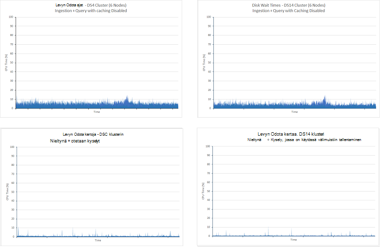

<properties
   pageTitle="Tietojen koostaminen ja kyselyjen suorituskykyä Elasticsearch Azure-säätäminen | Microsoft Azure"
   description="Kyselyn ja Etsi optimoinnista varten Elasticsearch seikkoja yhteenveto."
   services=""
   documentationCenter="na"
   authors="dragon119"
   manager="bennage"
   editor=""
   tags=""/>

<tags
   ms.service="guidance"
   ms.devlang="na"
   ms.topic="article"
   ms.tgt_pltfrm="na"
   ms.workload="na"
   ms.date="09/22/2016"
   ms.author="masashin"/>
   
# <a name="tuning-data-aggregation-and-query-performance-with-elasticsearch-on-azure"></a>Tietojen koostaminen ja kyselyjen suorituskykyä Elasticsearch Azure-säätäminen

[AZURE.INCLUDE [pnp-header](../../includes/guidance-pnp-header-include.md)]

Tässä artikkelissa on [sarjaan kuuluvan](guidance-elasticsearch.md). 

Ensisijainen syy käyttämällä Elasticsearch on tukea haut tietojen välillä. Käyttäjien pitäisi voit paikantaa ne etsimäsi tiedot. Järjestelmä on lisäksi käyttäjät voivat esittää kysymyksiä tiedot, haku korrelaatioita ja päätelmiä, jotka voidaan ohjata liiketoimintapäätösten mieleen. Tässä käsitellään hallintatyökalulla tietojen tiedoista.

Tämä asiakirja on yhteenveto asetuksista, jotka kannattaa määritettäessä parhaiten järjestelmän kyselyn ja Etsi suorituskyvyn parantamiseksi.

Suorituskyvyn suositukset määräytyvät pääosin skenaariot, joka koskee työkirjaa, äänenvoimakkuuden tiedot, jotka ovat indeksoinnin ja johon sovellusten ja käyttäjien kyselyn tietojen perusteella. Muutoksia tulokset huolellisesti Testaa määritykset tai käyttämällä Omat tiedot ja työmääriä arvioida tietyissä skenaarioissa hyötyä indeksoinnin rakenne. Tämän vuoksi tässä asiakirjassa kuvataan viitearvoja, jotka on suoritettava yksi tietty skenaario käyttämällä eri käyttömahdollisuudet määrä. Voit mukauttaa arvioida oman järjestelmien suorituskyvyn käytetty menetelmä. Tietoja testit on kuvattu [lisäys](#appendix-the-query-and-aggregation-performance-test).

## <a name="index-and-query-performance-considerations"></a>Indeksi- ja kysely suorituskykyyn liittyviä tietoja

Tässä osassa käsitellään joitakin yleisiä tekijät, joka on mielestäsi tietoja kun suunnittelemisesta indeksoi tarpeeseen tukemaan nopea kyselyt ja haku.

### <a name="storing-multiple-types-in-an-index"></a>Tallentaminen indeksin useita tyypit

Indeksin Elasticsearch voi olla useita tyyppejä. Voi olla parempi voit välttää tämän menetelmän ja mistäkin erillisessä indeksin luominen. Ota huomioon seuraavat seikat:

- Eri voi määrittää eri analyzers ja ei voi aina Tyhjennä mitä analyzer Elasticsearch käytettävä Jos kysely suoritetaan, indeksi-tasolla sijaan tyyppi tasolla. Katso lisätietoja [Välttäminen tyyppi kompastuskiviä](https://www.elastic.co/guide/en/elasticsearch/guide/current/mapping.html#_avoiding_type_gotchas) .

- Indeksit, joissa on useita tyyppejä shards on todennäköisesti suurempi kuin ne, jotka sisältävät yksittäisen indeksien. Suurentaa a shard, Lisää työmäärään tarvitaan Elasticsearch tietojen suodattaminen suoritettaessa kyselyjä.

- Jos tiedostotyypit tietomääriä välillä on merkittäviä ristiriita, tiedot yhdelle voit muuttuvat pohjoisille jakautuminen monta shards pienentämisestä, joka noutaa tiedot hakujen tehokkuutta.

    

    ***Jakamisen indeksin välillä vaikutukset*** 

    Kaavion yläosassa sama indeksi on jaettu asiakirjoilla A ja b tyyppi On monia muita tiedostoja, kirjoita kuin tyyppi tyyppi B. etsii liittyä kyselyt kaikki neljä shards. Kaavion alaosassa näkyy vaikutus, jos eri indeksit luodaan mistäkin. Tässä tapauksessa haku tyyppi näkyy vain edellyttää kahta shards käyttäminen.

- Pieni shards voi olla tasaisemmin hajautettu kuin suuri shards, helpottaminen Elasticsearch levittämällä kuormituksen solmujen välillä.

- Eri voi olla eri säilytys kausien. Voi olla hankalaa arkistoida vanhat tiedot, joka jakaa shards aktiivinen tiedoilla.


Joissakin tilanteissa jakaminen indeksin välillä voi kuitenkin tehokkaan Jos:

- Haut kattavat säännöllisesti tyypit säilytetään samassa hakemistossa.

- Tiedostotyypit on vain vähän kukin. Ylläpito joukko shards mistäkin voi olla merkittäviä katseltavan tällöin.


### <a name="optimizing-index-types"></a>Optimointi indeksi tyypit

Indeksin Elasticsearch sisältää kopion, joita on käytetty Lisää alkuperäisen JSON-tiedostoja. Tiedot säilytetään [* \_lähteen*](https://www.elastic.co/guide/en/elasticsearch/reference/current/mapping-source-field.html#mapping-source-field) kentän Indeksoitu kunkin kohteen. Näitä tietoja ei voi etsiä, mutta oletusarvoisesti palautetaan *Hae* ja *Etsi* pyynnöt. Kuitenkin kentän veloitetaan katseltavan ja tallennustilaa, Suurenna shards ja lisätä i/o suorittaa äänenvoimakkuutta Vie. Voit poistaa käytöstä * \_lähteen* kenttää kohden tyyppi perusteella:

```http
PUT my_index
{
  "mappings": {
    "my_type": {
      "_source": {
        "enabled": false
      }
    }
  }
}
```
Kentän poistaminen käytöstä poistaa myös voi suorittaa seuraavat toimet:

- Hakemiston tietojen päivittämistä käyttämällä *Päivitä* API.

- Suorittaa hakuja, jotka palauttavat korostetun tietoja.

- Uudelleenindeksointi Elasticsearch indeksistä suoraan toiseen.

- Voit muuttaa yhdistämismääritykset tai analyysin asetukset.

- Virheenkorjaus kyselyjen tarkastelemalla alkuperäinen asiakirja.


### <a name="reindexing-data"></a>Tietoja uudelleenindeksointi

Shards käytettävissä hakemiston luku määrittää hakemiston kapasiteetti. Voit tehdä alkuperäinen (ja ajan tasalla) arvaus, kuinka monta shards on suoritettava, mutta sinun kannattaa harkita aina uudelleenindeksointi strategia etukäteen asiakirjan. Monissa tapauksissa uudelleenindeksointi voidaan tarkoitettu tehtävän tiedot kasvaa. Voit halutessasi ei varata on runsaasti shards indeksin aluksi haun optimointi vuoksi, mutta varata uusi shards, kun tietojen määrä kasvaa. Muissa tapauksissa uudelleenindeksointi on ehkä suoritettava Lisää itsenäisen välein, jos oman arvioiden tietoja tietojen aseman kasvu todista yksinkertaisesti on virheellisiä.

> [AZURE.NOTE] Uudelleenindeksointi ei välttämättä tarvittavat tiedot, jotka ikäiset nopeasti. Tässä tapauksessa sovelluksen voi luoda uuden indeksin kunkin ajan kuluessa. Esimerkkejä sisällyttäminen suorituskyvyn lokit ja valvontalokin tietoja, jotka voidaan tallentaa ajan tasalla indeksissä päivittäin.

<!-- -->

Uuden indeksin luominen vanhan tiedoista ja poistamalla sitten vanha hakemiston uudelleenindeksointi tehokkaasti kuuluu. Jos indeksi on suuri, voi kestää aika ja sinun täytyy ehkä varmistaa, että tiedot pysyvät etsittävän tänä aikana. Tästä syystä sinun on luotava [kunkin hakemiston tunnuksen](https://www.elastic.co/guide/en/elasticsearch/reference/current/indices-aliases.html)ja kyselyjen Nouda tiedot näiden tunnusten avulla. Kun uudelleenindeksointi, pitää valitsemalla vanha indeksissä alias ja siirry sitten se viittaa uuden indeksin, kun uudelleenindeksointi on valmis. Tätä tapaa kannattaa myös aikapohjaisten tietojen, joka luo uuden indeksin päivittäin. Jos haluat käyttää nykyisen Käytä tunnusta, joka palauttaa käyttämään uutta indeksiä kuin se luodaan.

### <a name="managing-mappings"></a>Yhdistämismääritysten hallinta

Elasticsearch käyttää yhdistämismääritykset tulkitseminen tiedot, jotka ilmenee kaikista kentistä asiakirjassa. Kullakin virhelajilla on oma yhdistämistä, joka määrittää tehokkaasti mallin tyypin. Elasticsearch käyttää näitä tietoja luomiseen käänteinen indeksit kunkin kentän tyyppi-tiedostoja. Minkä tahansa asiakirjan jokaisella kentällä on tietotyyppi (kuten *merkkijono*, *päivämäärä*tai *pitkä*) ja arvo. Voit määrittää hakemiston yhdistämismääritykset indeksi on luotu tai ne voidaan johtaa Elasticsearch mukaan, kun uusia asiakirjoja lisätty tyyppi. Ota kuitenkin huomioon seuraavat seikat:

- Luotu dynaamisesti yhdistämismääritykset voi aiheuttaa virheitä sen mukaan, miten kentät tulkitaan, kun asiakirjat on lisätty indeksin. Esimerkiksi 1 asiakirja voi sisältää kentän A, jossa on luku ja syitä Elasticsearch Lisää määrityksen, joka määrittää, että tämä kenttä on *pitkä*. Jos myöhemmin asiakirjan lisätään kenttä, jonka A sisältää ei-numeerista tietoa ja valitse se epäonnistuu. Tässä tapauksessa kentän A on todennäköisesti on tulkitaan merkkijonon ensimmäisen asiakirjan lisättäessä. Määrittämällä yhdistämisen, kun indeksi on luotu auttaa näiden ongelmien välttämiseksi.

- Suunnittele tiedostojen välttämiseksi luodaan kohtuuttoman suuri yhdistämismääritykset Tämä lisää merkittäviä yleisrasite suoritettaessa haut, kuluttavat paljon muistia ja aiheuttaa kyselyt voi epäonnistua tietojen etsimistä. Hyväksyy yhdenmukaisia nimeämiskäytäntö kentät, joilla on sama tyyppi asiakirjoissa. Esimerkiksi Älä käytä kenttien nimet, kuten "Etunimi", "Etunimi" ja "Etunimi" eri asiakirjoissa. Käytä saman kenttänimi jokaisessa asiakirjassa. Ei, yritä käyttää arvojen näppäimet (tämä on yleisiä sarakkeen perheen tietokannoissa, mutta voi aiheuttaa tehottomuudet ja virheet Elasticsearch kanssa.) Lisätietoja on artikkelissa [Yhdistettyjen hajotus](https://www.elastic.co/blog/found-crash-elasticsearch#mapping-explosion).

- *Not_analyzed* avulla voit välttää jäsentäminen tarvittaessa. Esimerkiksi jos asiakirjassa on *tietoja* , joka sisältää arvon "ABC-DEF" merkkijonokentän sitten voit yrittää Tee haku kaikista tiedostoista, jotka vastaavat tämän arvon seuraavasti:

  ```http
  GET /myindex/mydata/_search
  {
    "query" : {
      "filtered" : {
        "filter" : {
          "term" : {
            "data" : "ABC-DEF"
          }
        }
      }
    }
  }
  ```

 Kuitenkin haun epäonnistuu palauttaa odottamattomia tuloksia vuoksi tavalla, joka on tokenized merkkijonon ABC-DEF, kun se on indeksoitu. Se tehokkaasti jaetaan ABC ja DEF, tunnusten tavuviivan mukaan. Tämä toiminto on suunniteltu tukemaan koko tekstin etsiminen, mutta voit halutessasi merkkijono tulkitaan atomisia Yksikohteinen jäsentäminen olisi käytöstä, kun asiakirja on lisätty indeksi. Voit käyttää yhdistämistä, esimerkiksi:

  ```http
  PUT /myindex
  {
    "mappings" : {
      "mydata" : {
        "properties" : {
          "data" : {
            "type" : "string",
            "index" : "not_analyzed"
          }
        }
      }
    }
  }
  ```

  Lisätietoja on artikkelissa [Etsiminen arvot](https://www.elastic.co/guide/en/elasticsearch/guide/current/_finding_exact_values.html#_term_filter_with_text).


### <a name="using-doc-values"></a>Doc-arvojen käyttäminen

Useimmat kyselyt ja koosteet edellyttävät, että tiedot on lajiteltu osana haku-toimintoa. Lajittelu edellyttää, että voit yhdistää yhden tai useamman ehdot tiedostojen luettelon. Auttaa tämän prosessin, Elasticsearch voi ladata kaikki käytetään lajitteluavain muistiin kentän arvot. Nämä tiedot on nimeltään *fielddata*. Käyttötarkoitukseen on välimuistiin fielddata muistiin liittyviä vähemmän i/o, ja se voi olla nopeampaa kuin lukeminen toistuvasti levyltä samat tiedot. Jos kenttä on hyvin kardinaliteetti tallentaminen sitten muistiin fielddata voit kuluttavat paljon keon tilaa, vaikuttavat mahdollisesti voi suorittaa muut samanaikaiset tai jopa varaa tallennustilan aiheuttaa Elasticsearch epäonnistuu.

Vaihtoehtoinen toimintatavan kuin Elasticsearch tukee myös *doc-arvoja*. Doc-arvo on samanlainen kohteen ladatun fielddata, paitsi että se on tallennettu levylle ja luoda, kun tiedot on tallennettu indeksin (fielddata muodostetaan dynaamisesti kun kysely suoritetaan.) Doc-arvoja ei tarjoaman keon tilaa ja ovat käteviä, joten kyselyjen lajittelu- tai koostetietoja eri kentissä, jotka voivat sisältää erittäin suuri määrä yksilöllisiä arvoja. Lisäksi on rajoitettu paineita keon voi auttaa siirtymä tietojen noutaminen levyn ja muistin luettaessa suorituskyvyn erot. Muistista on todennäköistä kovin usein ja muut samanaikaiset toiminnoista, joita käyttämiseen muisti on epätodennäköistä toteutettavan.

Ottaminen käyttöön ja poistaminen käytöstä asiakirjan arvot ominaisuutta kohti välein indeksissä *doc_values* -määritteen avulla seuraavan esimerkin osoittamalla tavalla:

```http
PUT /myindex
{
  "mappings" : {
    "mydata" : {
      "properties" : {
        "data" : {
          ...
          "doc_values": true
        }
      }
    }
  }
}
```
> [AZURE.NOTE] Doc-arvot ovat käytössä oletusarvoisesti Elasticsearch versio 2.0.0 alkaen.

Tarkka vaikutus asiakirjan arvoilla on todennäköisesti olla erittäin Omat tiedot ja kysely-skenaariot, joten on valmisteltu Järjestä suorituskyvyn testaaminen muodostaa niiden käyttökelpoisuus. Huomaa myös, että asiakirjaan arvot eivät toimi analysoitujen merkkijono-kenttien kanssa. Lisätietoja on artikkelissa [Doc-arvoja](https://www.elastic.co/guide/en/elasticsearch/guide/current/doc-values.html#doc-values).

### <a name="using-replicas-to-reduce-query-contention"></a>Replikoiden avulla voit pienentää kyselyn ristiriita

Yleisiä strategia edistää kyselyjen suorituskykyä on monta replikoiden kunkin indeksin luominen. Tietojen noutaminen toiminnot voi täyttää tietoja haetaan replikan mukaan. Tämä strategia voi kuitenkin vaikuttaa suorituskykyyn tietojen nieltynä toimintojen vakavasti niin, että se on käytettävä varoen tilanteissa, joihin sisältyy eri toiminnoista. Lisäksi tämä strategia on vain etu, jos solmujen jakautuu ja kilpailemaan ensisijainen shards sama indeksi osana olevat resursseilla. Muista, että haluat suurentaa tai pienentää määrä on indeksin dynaamisesti.

### <a name="using-the-shard-request-cache"></a>Käyttämällä shard pyynnön välimuisti

Elasticsearch voit tallentaa kunkin shard muistiin kyselyjä pyytäjä paikalliset tiedot. Tämän avulla hakuja, jotka hakevat samat tiedot suorittaa nopeammin, tietoja voi lukea muistin levyn sijaan säilöstä. Tällä tavalla tiedot välimuistiin siksi voi parantaa suorituskykyä joitakin haku-toimintoa, kustannuksella pienentämisestä muistia muihin tehtäviin suorittaa samanaikaisesti. Riski on myös, että tiedot served välimuistista on vanhentunut. Välimuistin tiedot mitätöidään vain, kun tiedot on muutettu ja shard päivitetään. Päivittää korkojakso on noudatettava indeksin *refresh_interval* -asetuksen arvoa.

Indeksin välimuistiasetukset pyyntö on oletusarvoisesti pois käytöstä, mutta sen voi ottaa käyttöön seuraavasti:

```http
PUT /myindex/_settings
{
  "index.requests.cache.enable": true
}
```

Shard pyyntö välimuistin sopii parhaiten tietoja, jotka pysyvät suhteellisen staattinen, kuten historiallista tai kirjautumalla tiedot.

### <a name="using-client-nodes"></a>Asiakkaan solmujen käyttäminen

Kaikki kyselyt käsitellään solmu, joka vastaanottaa ensin pyynnön. Tämä solmu lähettää kaikkien solmujen sisältävä kyselyä indeksien shards edelleen pyynnöt ja kasvaa vastauksen, joka palauttaa tuloksia. Jos kyselyn tietojen tai suorittavatko monimutkaisia funktiolauseita, alkuperäinen solmu on vastuussa suorittamiseen tarvittavat käsittely. Jos järjestelmässä on suhteellisen vähän monimutkaisia kyselyjä tukemaan, kannattaa ehkä luoda asiakkaan resurssivarantoon lievittämään lataa tiedot solmut-solmut. Vastaavasti, jos järjestelmässä on suuri määrä yksinkertaisia käsittelemään, Lähetä nämä pyynnöt suoraan tietojen solmut ja kuormituksen tasauspalvelun avulla voit jakaa pyynnöt tasaisesti.

### <a name="tuning-queries"></a>Kyselyiden säätäminen

Seuraavat seikat yhteenvedon vihjeitä suurentaminen Elasticsearch kyselyjen suorituskykyä:

- Vältä kyselyt, joihin sisältyy yleismerkit mahdollisuuksien mukaan.

- Jos sama kenttä on veloittaa teksti-haun ja tarkan vastaavuuden, harkitse sitten kentän tietojen tallentaminen lomakkeissa analysoitujen ja nonanalyzed. Suorita analysoitujen kentän koko tekstin hakuja ja vastaan nonanalyzed kentän tarkkoja vastineita.

- Vain palauttaa tarvittavat tiedot. Jos suuria tiedostoja, mutta sovellus edellyttää vain alijoukkoa kenttien tietoja, valitse palauttaa tämän alijoukon kyselyjen koko tiedostojen sijaan. Tämä strategia pienentää klusterin verkon kaistanleveyden vaatimuksia.

- Jos mahdollista, käyttää suodattimia sijaan kyselyt, kun etsit tietoja. Suodattimen määrittää yksinkertaisesti, onko tiedosto vastaa antamiasi olisi kyselyn laskee myös siitä, miten Sulje vastinetta on (näkyvissä pistemäärä) asiakirjan. Sisäisesti-suodattimen luoma arvot tallennetaan bittikarttana, joka ilmaisee vastine/ei vastaa kunkin asiakirjan ja välimuistiin Elasticsearch mukaan. Jos sama suodattimen ehtojen tapahtuu myöhemmin, bittikartta voidaan noutaa välimuistista ja käyttää hakeaksesi vastaavia asiakirjoja nopeasti. Lisätietoja on artikkelissa [Sisäinen suodatin-toimintoa](https://www.elastic.co/guide/en/elasticsearch/guide/current/_finding_exact_values.html#_internal_filter_operation).

- *Bool* suodattimilla staattinen vertailuja tekemistä varten ja käyttää vain dynaamisesti laskettu suodattimia, kuten, joihin sisältyy komentosarjan *ja* *tai*ja *ei ole* suodattimia tai *geo -\* * suodattimet.

- Jos kysely yhdistää *bool* suodattimet *ja* *tai*- vai *ei* *geo* -* suodattimia, sijoita *ja*/*tai*/*ei geo-** suodattimet viimeksi niin, että ne toimivat tietojoukon pienin mahdollinen.

    Käytä vastaavasti *post_filter* suorittamiseen kallista Suodata toimintoja. Suodattimia suoriteta viimeksi.

- Käytä muita sijaan koosteet. Vältä laskeminen kokoavat, analysoidaan tai joilla on monia mahdollisista arvoista.

    > **Huomautus**: rakenteita on poistettu versio 2.0.0 Elasticsearch.

- Käytä *Kardinaliteetti* koosteen sijasta *value_count* koosteen, ellei sovellus edellyttää vastaavien kohteiden tarkan määrän. Tarkka määrä voi tulla nopeasti vanhentuneiden ja monet sovellukset edellyttävät vain suositeltavaa kerralla laskemista varten.

- Vältä komentosarjan. Komentosarjojen kyselyissä ja suodattimet voivat olla kallista ja tulokset ei tallenneta välimuistiin. Pitkään suoritettavien komentosarjojen voit tarjoaman haun viestiketjuissa siirtyminen jatkuvasti, myöhemmin pyynnöt jonossa voi aiheuttaa. Jos jonossa täyttyy, edelleen pyynnöt hylätään.

## <a name="testing-and-analyzing-aggregation-and-search-performance"></a>Testaus ja kooste ja Etsi suorituskyvyn analysoiminen

Tässä osassa kuvataan sarja testejä, joka on suoritettu vastaan erilaisten klusterin ja indeksi määritysten tulokset. Kahdentyyppisiä on suoritettu seuraavasti:

- * * *Nieltynä ja kyselyjen* testi **. Tämän testin aloittaminen tyhjä indeksin, joka on täytetty kuin testi edennyt suorittamalla joukkona Lisää toimintoja (kunkin toiminnon lisätty 1000 tiedostot). Yhtä aikaa on suunniteltu etsiä tiedostoja, jotka on lisätty edellisen 15 minuutin aikana ja luoda koosteet kyselyjen määrä on toistetaan 5 sekunnin välein. Tämän testin on yleensä voivat suorittaa 24 tunnin toistamisen hankalaa työmäärää, joissa suurissa tietojen nieltynä kanssa lähellä reaaliaikainen kyselyjen tehosteita.

- ** *Vain kyselyn* testata**. Tämän testin muistuttaa *nieltynä ja kyselyjen* testata lukuun ottamatta sitä, että nieltynä osa jätetään pois kunkin solmun indeksi on kopioidaan 100 miljoonaa asiakirjoja. Kyselyjen muutetun joukko suoritetaan; rajoittaminen asiakirjojen niille, jotka on lisätty viimeisten 15 minuutin ajan osan poistettiin, kun tiedot on nyt staattinen. Testejä suoritettiin 90 minuutin, on riittävästi aikaa suorituskyky määräytyy vuoksi tietojen rahassa muodostamiseen.

---

Kunkin asiakirjan indeksissä oli samaan rakenteeseen. Tässä taulukossa on yhteenveto rakenteen kentät:

Nimi                          | Tyyppi         | Huomautuksia |
  ----------------------------- | ------------ | -------------------------------------------------------- |
  Organisaation                  | Merkkijono      | Testi Luo 200 yksilöllinen organisaatioissa. |
  CustomField1 - CustomField5   |Merkkijono       |Nämä ovat viisi merkkijonon kenttiä, jotka on määritetty tyhjä merkkijono.|
  DateTimeRecievedUtc           |Aikaleima    |Päivämäärän ja kellonajan, johon asiakirja on lisätty.|
  Host (isäntä)                          |Merkkijono       |Tämä kenttä on määritetty tyhjä merkkijono.|
  HttpMethod-arvo                    |Merkkijono       |Tämä kenttä on määritetty jokin seuraavista arvoista: "Lähetä", "HAE", "Valitseminen".|
  HttpReferrer                  |Merkkijono       |Tämä kenttä on määritetty tyhjä merkkijono.|
  HttpRequest                   |Merkkijono       |Tämä kenttä lisätään satunnaisia tekstiä 10 – 200 merkkiä.|
  HttpUserAgent                 |Merkkijono       |Tämä kenttä on määritetty tyhjä merkkijono.|
  HttpVersion                   |Merkkijono       |Tämä kenttä on määritetty tyhjä merkkijono.|
  Organisaation nimi              |Merkkijono       |Tämä kenttä on määritetty saman arvon kuin organisaation-kenttään.|
  SourceIp                      |IP           |Tässä kentässä ilmaisee, että tiedot "origin" IP-osoite. |
   SourceIpAreaCode              |Pitkä         |Kentän arvo on 0.|
  SourceIpAsnNr                 |Merkkijono       |Tämä kenttä on määritetty "AS\#\#\#\#\#".|
  SourceIpBase10                |Pitkä         |Tämä kenttä on määritetty 500.|
  SourceIpCountryCode           |Merkkijono       |Tässä kentässä on 2-merkkinen maakoodi. |
  SourceIpCity                  |Merkkijono       |Tämä kenttä sisältää merkkijonon maassa kaupunki. |
  SourceIpLatitude              |Kaksinkertainen       |Tässä kentässä satunnaisen arvon.|
  SourceIpLongitude             |Kaksinkertainen       |Tässä kentässä satunnaisen arvon.|
  SourceIpMetroCode             |Pitkä         |Kentän arvo on 0.|
  SourceIpPostalCode            |Merkkijono       |Tämä kenttä on määritetty tyhjä merkkijono.|
  SourceLatLong                 |GEO piste   |Tämä kenttä on määritetty satunnaisia geo pisteeseen.|
  SourcePort                    |Merkkijono       |Tämä kenttä lisätään satunnaisluvun string-esitys.|
  TargetIp                      |IP           |Tämä lisätään alueen 0.0.100.100 255.9.100.100 satunnaisen IP-osoite.|
  SourcedFrom                   |Merkkijono       |Tämä kenttä on määritetty merkkijonon "MonitoringCollector".|
  TargetPort                    |Merkkijono       |Tämä kenttä lisätään satunnaisluvun string-esitys.|
  Arviointi                        |Merkkijono       |Tämä kenttä lisätään jonkin valittuna satunnaisesti 20 eri merkkijonoarvoa.|
  UseHumanReadableDateTimes     |Totuusarvo      |Tämä kenttä on määritetty epätosi.|
 
Kunkin iteraation testien on tekemä seuraavat kyselyt erissä. Kursivointia nimet on käytetty nämä kyselyt jäljempänä tässä asiakirjassa. Huomaa, että aikaa ehdon (viimeisen 15 minuutin aikana lisätyt asiakirjat) on jätetty pois *vain kyselyn* testit:

- Kuinka monta kunkin *luokitus* -arvon asiakirjojen syötetty viimeisen 15 minuutin (*Laske mukaan luokitus*)? 

- Kuinka monta asiakirjaa on lisätty 5 minuutin kussakin viimeisten 15 minuutin (*Laske ajan kuluessa*)?

- Kuinka monta asiakirjaa *arviointi* jokaisen arvon on lisätty kunkin maan viimeisen 15 minuutin (*osumien maittain*)?

- Organisaatiot, joissa on 15 suoritettiin useimmat viimeisen 15 minuutin (*ensimmäiset 15 organisaatiot*) lisätyt usein tekstimuodossa asiakirjat?

- Kuinka monta eri organisaatioissa suoritettiin asiakirjoissa, jotka on lisätty edellisen 15 minuutin (*yksilöllinen Laske organisaatiot*)?

- Kuinka monta asiakirjaa on lisätty viimeisten 15 minuutin (*osumia yhteensä määrä*)?

- Kuinka monta eri *SourceIp* arvot suoritettiin asiakirjoissa, jotka on lisätty viimeisten 15 minuutin (*yksilöllisen IP määrä*)?


Indeksin määritys ja kyselyiden tietoja Jäsennettyjen [lisäys](#appendix-the-query-and-aggregation-performance-test).

Testejä suunniteltuja ymmärtää seuraavat muuttujat tehosteita:

- **Levyn tyyppi**. Testien on suorittaa 6-solmu klusterin D4 VMs käyttämällä vakio storage (HDDs) ja toistuvan 6-solmu klusterin DS4 VMs premium storage (SSDs) avulla.

- **Koneen kokoa - skaalaus**. Testien on suorittaa 6-solmu-klusterin, joissa DS3 VMs ( *Pieni* klusterin määritetty), toistetaan palvelinklusterissa DS4 VMs ( *Normaali* -klusterin) ja toistaa uudelleen klusterissa DS14 laitteiden ( *suuri* klusterin). Seuraavassa taulukossa on yhteenveto kunkin AM SKU tärkeimmät ominaisuudet:

 Klusterin | AM SKU        | Sydämiä määrä | Tietoja levyjen määrä | RAM-MUISTIA (GT) |
---------|---------------|-----------------|----------------------|----------|
 Pieni   | Vakio DS3  | 4               | 8                    | 14       |
 Normaali  | Vakio DS4  | 8               | 16                   | 28       |
 Suuri   | Vakio DS14 | 16              | 32                   | 112      |

- **Klusteri - laajentaminen**. Testit on suoritettu DS14 VMs, joka sisältää 1, 3 ja 6 solmujen klustereiden.

- **Määrä on indeksi**. Testien on suoritettujen indeksit määritetty 1 ja 2 replikoiden kanssa.

- **Doc-arvoja**. Alun perin testejä on suoritettu hakemiston määrittäminen *doc_values* arvoksi *true* (oletusarvo). Valittujen testien on toistettava *doc_values* Aseta arvoksi *Epätosi*.

- **Välimuistiin**. Testit on suoritettava indeksi käytössä shard pyynnön välimuistin kanssa.

- **Shards määrä**. Testien on toistetaan vaihteleva määrä shards avulla voit vahvistaa, onko kyselyjen suoritettiin tehokkaammin indeksit, joka sisältää vähemmän, suurempi shards tai enemmän kuin, pienempi shards yli.


## <a name="performance-results---disk-type"></a>Suoritustulokset - levyn tyyppi

Suorituskyvyn tulkinnut käynnissä *nieltynä ja kyselyä* testi D4 VMs (joko HDDs) 6-solmu-klusterin ja DS4 VMs (joko SSD) 6-solmu-klusterin. Elasticsearch määrittäminen sekä klustereissa on sama. Tiedot on levitä kunkin solmun 16 levyille ja kunkin solmun oli 14 Gigatavua RAM-Muistia kohdistettu käynnissä Elasticsearch Java virtuaalikoneen (JVM), jäljellä oleva muisti (myös 14 gt) jätettiin käyttöjärjestelmän käyttöä. Kunkin testin suoritettiin 24 tuntia. Tänä on otettu käyttöön tiedot muuttuvat näennäinen ja salli järjestelmän tasapainota kasvava äänenvoimakkuuden tehosteita. Seuraavassa taulukossa on yhteenveto tuloksista korostaminen eri toiminnoista, joita reunuksista testi vastaus-aikoja.

 Klusterin | Toiminnon/kysely            | Vastauksen keskimääräinen aika (millisekunteina) |
---------|----------------------------|----------------------------|
 D4      | Nieltynä                  | 978                        |
         | Laske luokituksen            | 103                        |
         | Laske Over aika            | 134                        |
         | Osumia maittain            | 199                        |
         | Ensimmäiset 15 organisaatiot       | 137                        |
         | Yksilöivä Laske organisaatiot | 139                        |
         | Yksilöllisen IP määrä            | 510                        |
         | Osumia yhteensä määrä           | 89                         |
 DS4     | Nieltynä                  | 511                        |
         | Laske luokituksen            | 187                        |
         | Laske Over aika            | 411                        |
         | Osumia maittain            | 402                        |
         | Ensimmäiset 15 organisaatiot       | 307                        |
         | Yksilöivä Laske organisaatiot | 320                        |
         | Yksilöllisen IP määrä            | 841                        |
         | Osumia yhteensä määrä           | 236                        |

Ensimmäisellä silmäyksellä näyttäisi, että DS4 klusterin suorittaa kyselyjä vähemmän kuin D4 klusterin joskus laimennossarja (tai huonompi) sekä vastausajan. Tämä ei ilmoita pelkät vaikka. Seuraavassa taulukossa on maksettavan korvauksen kunkin klusterin nieltynä toimintoja, jotka (Muista kunkin toiminnon Lataa 1000 asiakirjoja):

 Klusterin | Nieltynä määrä |
---------|---------------------------|
 D4      | 264769                    |
 DS4     | 503157                    |

DS4-klusterin voitiin Lataa lähes kaksi kertaa niin paljon tietoja kuin D4 klusterin testin aikana. Tämän vuoksi vastauksen ajat jokaiselle analysoinnissa tarvitset myös ottaa huomioon, kuinka monta kunkin kyselyssä on tarkistamaan asiakirjoja ja kuinka monta asiakirjaa palautetaan. Nämä ovat hakemiston tiedostojen määrä kasvaa jatkuvasti dynaaminen luvut. Ei voi jakaa vain 503137 mukaan 264769 (nieltynä toimintojen maksettavan korvauksen kunkin klusterin numero) ja sitten kerro tulos luvulla kummankin kyselyn maksettavan korvauksen D4 klusterin antaa vertaileva tiedot tämä ohittaa i/o nieltynä toiminnon suorittama samanaikaisesti määrän keskiarvo vastausajan. Voit sen sijaan mittaa tallennettavat tiedot fyysinen summa, ja lukea levyä testin edetessä. JMeter testaussuunnitelmaa Sieppaa kunkin solmun tiedot. Tiivistetty tulokset ovat:

 Klusterin | Keskimääräinen tavujen kirjoitettu/luettu kunkin-toiminnolla |
---------|----------------------------------------------|
 D4      | 13471557                                     |
 DS4     | 24643470                                     |

Tämä tieto näkyy, että DS4 klusterin voitiin ylläpitää i/o-korko 1,8 kertaa, D4 klusterin. Koska, että laatu levyjä, lukuun ottamatta kaikkien muiden resurssien ovat samat, ero on oltava vuoksi käyttämällä SSD mieluummin HDDs.

Estettäisiin Tasaa tämän tekemistä, seuraavat kaavioiden havainnollistaa miten i/o suoritettiin ajan kuluessa kunkin klusterin mukaan:


<!-- -->

***Levyn aktiviteettia D4 ja DS4 klustereiden***

D4-klusterin kaavio näyttää merkittäviä muunnelma, erityisesti ensimmäisen aikana puolet testi. Tämä on todennäköisesti vuoksi rajoittaminen vähentää i/o-korvaus. Testi alkuvaiheessa kyselyt voivat suorittaa nopeasti on vähän tietojen analysointia varten. Levyjen D4 klusterin ovat näin ollen todennäköisesti toimittava lähellä toisen (IOPS) kapasiteettia kohti i/niiden toimintojen, vaikka kunkin i/o-toiminto saattaa ei palauttaminen paljon tietoja. DS4-klusterin ei tue IOPS siirtonopeuden ja saman aste rajoittaminen ei haittaohjelman, i/o-kurssit on enemmän säännöllisesti. Tämä opin tukemaan kaavioiden seuraava pari Näytä miten Suoritin esti levyn i/o ajan kuluessa (näkyvät kaavioiden levyn Odota ajat ovat osuus aikaa Suoritin odottaa i/o):


***Suorittimen levyn i/o Odota D4 ja DS4 klustereiden muuttaminen***

On tärkeää ymmärtää, että on kaksi i/o-toimintojen estäminen Suoritin puhuvien ensisijainen syitä:

- I/o-alirakenne saattaa luettavaksi tai muut tiedot, tai levyltä.

- I/o-alirakenne voitu rajoittanut ympäristön mukaan. Azure levyjen toteuttaa HDDs on suurin nopeus 500 IOPS, ja SSD on suurin nopeus, 5000 IOPS.


D4-klusterin ajan käytetyt odottaa i/o aikana ensimmäisen vuosipuoliskon testi numeroidulla tiiviisti käänteinen tavalla kaavio, jossa näkyy i/o-kurssit kanssa. Pieni i/o kausien vastaavat merkittäviä aikoja Suoritin käyttää estettyjen, tämä ilmaisee, että i/o on rajoitettu. Lisää tiedot lisätään klusterin tilanne muutokset ja valitse toisen testin päät i/o-Odota kertaa vastaavat i/o siirtonopeuden kohdalle. Tässä vaiheessa Suoritin on estetty suorittaessasi reaali i/o. Uudelleen DS4-klusterin i/o odotetaan aikaa on paljon parillinen. Jokaisen piikin vastaa vastaavat Huippu, i/o suorituskyky trough sijaan, tämä tarkoittaa sitä, että ei mahdollisimman vähän rajoittava määrä.

On yksi muita huomioitavia seikkoja. Testin aikana D4 klusterin luodaan 10584 nieltynä-virheet ja 21 kyselyn virheet. Testi DS4 klusterin tuottaa virheitä.

## <a name="performance-results---scaling-up"></a>Suoritustulokset - skaalauksen

Skaalaa ylöspäin testaaminen suoritettiin suorittamalla testien 6-solmu klustereiden DS3, DS4 ja DS14 VMs vastaan. Nämä tuotteissa on valittuna, koska DS4 AM tarjoaa kahdesti kuin useimmat Keskusyksikön Sydämiä ja muistin määrän DS3 ja DS14 tietokoneen kaksinkertaistuu suorittimen resursseja uudelleen käyttämisessä on neljä kertaa muistin määrän. Alla olevassa taulukossa verrataan kunkin SKU keskeisiä ominaisuuksia:

 TUOTE  | \#Suorittimen sydämiä | Muisti (gt) | Maks-levyn IOPS | Maks-kaistanleveyden (Mt/su)|
------|-------------|-------------|---------------|--------------|
 DS3  | 4           | 14          | 12,800| 128 |
 DS4  | 8           | 28          | 25,600| 256 |
 DS14 | 16          | 112         | 50 000| 512 |

Seuraavassa taulukossa on yhteenveto suoritustulokset testejä pieni (DS3), medium (DS4) ja suuri (DS14) klustereiden. Kunkin AM käyttää SSD tiedot. Kunkin testin suoritettiin 24 tuntia.

Taulukon raportit onnistuneen pyyntöjen mistäkin kyselyn (virheet eivät sisälly) määrä. Yritetään mistäkin kyselyn pyyntöjen määrä on suurin piirtein sama testin suorittaminen. Tämä johtuu siitä JMeter testaussuunnitelmaa suorittaa yhden kerran kullekin kyselyn (Laske mukaan arviointi, Laske enemmän aikaa, osumia maa, ensimmäiset 15 organisaatiot, yksilöllisiä Laske organisaatiot, yksilöllisiä IP määrä ja osumien kokonaismäärä) yhdessä yhtenä yksikkönä nimeltään *Testaa tapahtuman* (tapahtuma on erillinen tehtävä, joka suorittaa nieltynä-toiminnon, joka suoritetaan erillisessä viestiketjun mukaan). Kunkin testaussuunnitelmaa iteraation suorittaa yksittäisen tapahtuman. Valmis testi tapahtumien määrä siis myyntitapahtumien mahdollisimman pieneksi kyselyä aikajakso mitta.

| Klusterin      | Toiminnon/kysely            | Pyyntöjen määrä | Vastauksen keskimääräinen aika (millisekunteina) |
|--------------|----------------------------|--------------------|----------------------------|
| Pieni (DS3)  | Nieltynä                  | 207284             | 3328                       |
|              | Laske luokituksen            | 18444              | 268                        |
|              | Laske Over aika            | 18444              | 340                        |
|              | Osumia maittain            | 18445              | 404                        |
|              | Ensimmäiset 15 organisaatiot       | 18439              | 323                        |
|              | Yksilöivä Laske organisaatiot | 18437              | 338                        |
|              | Yksilöllisen IP määrä            | 18442              | 468                        |
|              | Osumia yhteensä määrä           | 18428              | 294   
|||||
| Normaali (DS4) | Nieltynä                  | 503157             | 511                        |
|              | Laske luokituksen            | 6958               | 187                        |
|              | Laske Over aika            | 6958               | 411                        |
|              | Osumia maittain            | 6958               | 402                        |
|              | Ensimmäiset 15 organisaatiot       | 6958               | 307                        |
|              | Yksilöivä Laske organisaatiot | 6956               | 320                        |
|              | Yksilöllisen IP määrä            | 6955               | 841                        |
|              | Osumia yhteensä määrä           | 6958               | 236                        |
|||||
| Suuri (DS14) | Nieltynä                  | 502714             | 511                        |
|              | Laske luokituksen            | 7041               | 201                        |
|              | Laske Over aika            | 7040               | 298                        |
|              | Osumia maittain            | 7039               | 363                        |
|              | Ensimmäiset 15 organisaatiot       | 7038               | 244                        |
|              | Yksilöivä Laske organisaatiot | 7037               | 283                        |
|              | Yksilöllisen IP määrä            | 7037               | 681                        |
|              | Osumia yhteensä määrä           | 7038               | 200                        |

Seuraavissa kuvissa, tämän testin DS4 ja DS14 klusterin suorituskyvyn on kohtuudella samanlainen. Kyselyn toiminnot DS3-klusterin vastauksen kellonajat näkyvät myös vertailla favorably aluksi ja suorittaa kysely-toimintoja, jotka on paljon suurempi kuin DS4 ja DS14 klusterin arvot. Yksi olisi myös otettava vahva ilmoitus nieltynä korko ja seurauksena asiakirjojen, johon haku kohdistuu. DS3 klusterin nieltynä on paljon enemmän rajoitettu ja tietokanta sisältää vain noin 40 % lukenut jokaisen toisten klustereiden asiakirjojen testi loppuun mennessä. Tämä on voitu vuoksi käsittelyresursseja, verkon ja DS3-AM verrattuna DS4 tai DS14 AM kaistanleveyttä levyn. Koska, että DS4 AM on kaksi kertaa kuin paljon resursseja käytettävissä DS3 AM ja DS14 on kaksi kertaa (neljä kertaa muistin) DS4 AM resursseja, yksi kysymys pysyy: Miksi on nieltynä korvaukset DS4 ja DS14 klustereiden välinen ero merkittävästi pienempi kuin määrä, joka esiintyy DS3 ja DS4 klustereiden väliset? Tämä voi johtua verkon käytön ja Azure VMs kaistanleveyden rajoissa. Kaavioiden alla Näytä kaikki kolme klustereiden tämän tiedot:


**Nieltynä ja kysely-testin suorittamiseen DS3, DS4 ja DS14 klustereiden verkon käyttö** 

<!-- -->

Käytettävissä kaistanleveys ja Azure VMs rajoitukset ei julkaista ja voi vaihdella, mutta se, että verkon toiminnan näkyy keskimäärin noin 2.75GBps osoitteessa on levelled sekä DS4 ja DS14 testien ehdottaa tällaista rajaa on saavutettu ja on tullut Tärkein tekijä-rajoittaminen siirtonopeuden. Kyseessä DS3-klusterin verkon toiminnan ollut huomattavasti pienempi, joten alemman suorituskyky on todennäköisesti muiden resurssien käytettävyyden rajoitukset.

Eristää nieltynä toimintojen tehosteita ja havainnollistaa, miten kyselyn suorituskykyä vaihtelee solmujen skaalata-joukon vain kyselyn testejä suoritettiin saman solmujen käyttäen. Seuraavassa taulukossa on yhteenveto kunkin klusterissa saadut tulokset:

> [AZURE.NOTE] Vertaile ei suorituskykyä ja pyyntöjen suorittaa kyselyjä *vain kyselyn* verrattuna kaavaan *nieltynä ja kyselyä* testi Suorita testi. Tämä johtuu siitä kyselyt on muutettu ja äänenvoimakkuuden liittyvät asiakirjat on erilainen.

| Klusterin      | Toiminnon/kysely            | Pyyntöjen määrä | Keskimääräinen vastaus Ttme (ms) |
|--------------|----------------------------|--------------------|----------------------------|
| Pieni (DS3)  | Laske luokituksen            | 464                | 11758                      |
|              | Laske Over aika            | 464                | 14699                      |
|              | Osumia maittain            | 463                | 14075                      |
|              | Ensimmäiset 15 organisaatiot       | 464                | 11856                      |
|              | Yksilöivä Laske organisaatiot | 462                | 12314                      |
|              | Yksilöllisen IP määrä            | 461                | 19898                      |
|              | Osumia yhteensä määrä           | 462                | 8882  
|||||
| Normaali (DS4) | Laske luokituksen            | 1045               | 4489                       |
|              | Laske Over aika            | 1045               | 7292                       |
|              | Osumia maittain            | 1053               | 7564                       |
|              | Ensimmäiset 15 organisaatiot       | 1055               | 5066                       |
|              | Yksilöivä Laske organisaatiot | 1051               | 5231                       |
|              | Yksilöllisen IP määrä            | 1051               | 9228                       |
|              | Osumia yhteensä määrä           | 1051               | 2180                       |
|||||
| Suuri (DS14) | Laske luokituksen            | 1842               | 1927                       |
|              | Laske Over aika            | 1839               | 4483                       |
|              | Osumia maittain            | 1838               | 4761                       |
|              | Ensimmäiset 15 organisaatiot       | 1842               | 2117                       |
|              | Yksilöivä Laske organisaatiot | 1837               | 2393                       |
|              | Yksilöllisen IP määrä            | 1837               | 7159                       |
|              | Osumia yhteensä määrä           | 1837               | 642                        |

Tällä hetkellä eri klustereiden yli keskiarvon vastauksen ajat trendejä on selkeä. Verkon käyttö on hyvin alla vaatii aiemmin DS4 ja DS14 varausyksiköt (joka todennäköisesti tyydyttyneet verkon nieltynä ja kysely-testeissä), 2.75GBps ja 1.5GBps DS3-klusterin. Itse asiassa on lähempänä 200MBps kaikissa tapauksissa alla kaavioiden osoittamalla tavalla:


***Verkko DS3 käyttö DS4 ja DS14 klustereiden suorittamiseen vain kysely-testi*** 

DS3 ja DS4 klustereissa rajoittava tekijä näkyy nyt on suorittimen käyttö, joka on lähellä 100 %: n paljon aikaa. DS14 klusterin suorittimen käyttö laskee vain yli 80 %. Tämä on edelleen suuri, mutta korostaa selkeästi Lisää suorittimen-sydämiä eduista. Seuraava kuva esittää suorittimen käyttö-kuvioiden määrittäminen DS3, DS4 ja DS14 klustereiden.


***Vain kyselyn testin suorittamiseen DS3 ja DS14 klustereiden suorittimen käyttö*** 

## <a name="performance-results---scaling-out"></a>Suoritustulokset - laajentaminen

Voit havainnollistaa, miten järjestelmä kasvavat ulos näkyvien solmujen määrän, testi suoritettiin DS14 klustereiden, joka sisältää 1, 3 ja 6 solmujen avulla. Tällä hetkellä vain *vain kyselyä* testi on suoritettu, käyttämällä 100 miljoonaa asiakirjoja ja suorittamalla 90 minuutin:

| Klusterin | Toiminnon/kysely            | Pyyntöjen määrä | Vastauksen keskimääräinen aika (millisekunteina) |
|---------|----------------------------|--------------------|----------------------------|
| 1 solmu  | Laske luokituksen            | 288                | 6216                       |
|         | Laske Over aika            | 288                | 28933                      |
|         | Osumia maittain            | 288                | 29455                      |
|         | Ensimmäiset 15 organisaatiot       | 288                | 9058                       |
|         | Yksilöivä Laske organisaatiot | 287                | 19916                      |
|         | Yksilöllisen IP määrä            | 284                | 54203                      |
|         | Osumia yhteensä määrä           | 287                | 3333                       |
|||||
| 3 solmujen | Laske luokituksen            | 1194               | 3427                       |
|         | Laske Over aika            | 1194               | 5381                       |
|         | Osumia maittain            | 1191               | 6840                       |
|         | Ensimmäiset 15 organisaatiot       | 1196               | 3819                       |
|         | Yksilöivä Laske organisaatiot | 1190               | 2938                       |
|         | Yksilöllisen IP määrä            | 1189               | 12516                      |
|         | Osumia yhteensä määrä           | 1191               | 1272                       |
|||||
| 6 solmujen | Laske luokituksen            | 1842               | 1927                       |
|         | Laske Over aika            | 1839               | 4483                       |
|         | Osumia maittain            | 1838               | 4761                       |
|         | Ensimmäiset 15 organisaatiot       | 1842               | 2117                       |
|         | Yksilöivä Laske organisaatiot | 1837               | 2393                       |
|         | Yksilöllisen IP määrä            | 1837               | 7159                       |
|         | Osumia yhteensä määrä           | 1837               | 642                        |

Näkyvien solmujen määrän tekee klusterin, kyselyn suorituskykyä merkittäviä eroja vaikka nonlinear tavalla. 3 solmun klusterin suorittaa 4 kertaa kuin useiden kyselyjen kuin yksi solmu-klusterin, kun 6 solmun klusterin käsittelee 6 kertaa kuin monet. Kuvaavat tätä nonlinearity seuraavat kaavioiden Näytä miten Suoritin on parhaillaan kulutettu kolme varausyksiköiden mukaan:


***1, 3 ja 6-solmu klustereiden vain kyselyn testin suorittamiseen suorittimen käyttö***

Single-solmu ja 3-solmu klustereiden ovat suorittimen sidottujen, mutta suorittimen käyttö on riittävä 6-solmu-klusterin siellä on vara käsittely kapasiteetti. Tässä tapauksessa muiden tekijöiden todennäköisesti voidaan rajoittaa siirtonopeuden. Tämä saattaa vahvistanut testaamalla 9 ja 12 solmujen, jotka todennäköisesti näkyy edelleen käyttämätöntä käsittely kapasiteetin kanssa.

Edellä olevan taulukon tiedot näkyvät myös siitä, miten keskimääräinen vastauksen ajat kyselyjen vaihdella. Tämä on kohde, joka on eniten kuvaava testaaminen, miten järjestelmä Skaalaa määrättyjä kyselyn. Jotkin haut ovat selkeästi paljon tehokkaampaa, kun kestävät Lisää solmujen kuin muut. Tämä voi johtua näkyvien solmujen määrän ja asiakirjojen klusterin nousevassa määrä välisen suhteen, kunkin klusterin sisälsi 100 miljoonaa asiakirjoja. Haut, joihin sisältyy tietojen suoritettaessa Elasticsearch Käsittele ja puskurin kooste yhteydessä muistiin kunkin solmun noutaa tiedot. Jos määritettynä on muita solmujen, on vähemmän tietoja voi hakea, puskurin ja käsitellä kunkin solmun.

## <a name="performance-results---number-of-replicas"></a>Suoritustulokset - määrä on

*Nieltynä ja kysely* -testi suoritettiin vastaan indeksin yksittäisen replikaa. Testejä on toistuvan 6-solmu DS4 ja DS14 klustereiden, määritetty replikat hakemiston avulla. Kaikki testit suoritettiin 24 tuntia. Alla olevassa taulukossa näkyy yksi ja kaksi replikoiden vertaileva tulokset:

| Klusterin | Toiminnon/kysely            | Vastauksen keskimääräinen aika (millisekunteina) - 1 replika | Vastauksen keskimääräinen aika (millisekunteina) - 2 replikoita | vastausajan % ero |
|---------|----------------------------|----------------------------------------|-----------------------------------------|-------------------------------|
| DS4     | Nieltynä                  | 511                                    | 655                                     | + 28 %                          |
|         | Laske luokituksen            | 187                                    | 168                                     | – 10 %                          |
|         | Laske Over aika            | 411                                    | 309                                     | -25 %                          |
|         | Osumia maittain            | 402                                    | 562                                     | + 40 %                          |
|         | Ensimmäiset 15 organisaatiot       | 307                                    | 366                                     | + 19 %                          |
|         | Yksilöivä Laske organisaatiot | 320                                    | 378                                     | + 18 %                          |
|         | Yksilöllisen IP määrä            | 841                                    | 987                                     | + 17 %                          |
|         | Osumia yhteensä määrä           | 236                                    | 236                                     | + 0 %                           |
||||||
| DS14    | Nieltynä                  | 511                                    | 618                                     | + 21 %                          |
|         | Laske luokituksen            | 201                                    | 275                                     | + 37 %                          |
|         | Laske Over aika            | 298                                    | 466                                     | + 56 %                          |
|         | Osumia maittain            | 363                                    | 529                                     | + 46 %                          |
|         | Ensimmäiset 15 organisaatiot       | 244                                    | 407                                     | + 67 prosentin                          |
|         | Yksilöivä Laske organisaatiot | 283                                    | 403                                     | + 42 %                          |
|         | Yksilöllisen IP määrä            | 681                                    | 823                                     | + 21 %                          |
|         | Osumia yhteensä määrä           | 200                                    | 221                                     | + 11 %                          |

Nieltynä korko aiempaa pienempi kuin määrä on entistä parempi. Tämä on oikein, kun Elasticsearch on kirjoittaminen lisäkopioiden kunkin asiakirjan luotaessa kiintolevytilan i/o.  Tämä on viipeen indeksien DS14-klusterin kaavioiden 1 ja 2 alla olevassa kuvassa näkyy replikoiden kanssa. Keskimääräinen i/o-kurssi on kyseessä 1 replikaan indeksi 16896573 tavua/toisen. Keskimääräinen i/o-kurssi on 2 replikoiden kanssa indeksin 33986843 tavua/toisen juuri kahdesti kuin monet päälle.


***Levyn i/o korvaukset solmujen nieltynä ja kysely-testin suorittamiseen 1 ja 2 replikoiden kanssa***

| Klusterin | Kyselyn                      | Vastauksen keskimääräinen aika (millisekunteina) - 1 replika | Vastauksen keskimääräinen aika (millisekunteina) - 2 replikoita |
|---------|----------------------------|----------------------------------------|-----------------------------------------|
| DS4     | Laske luokituksen            | 4489                                   | 4079                                    |
|         | Laske Over aika            | 7292                                   | 6697                                    |
|         | Osumia maittain            | 7564                                   | 7173                                    |
|         | Ensimmäiset 15 organisaatiot       | 5066                                   | 4650                                    |
|         | Yksilöivä Laske organisaatiot | 5231                                   | 4691                                    |
|         | Yksilöllisen IP määrä            | 9228                                   | 8752                                    |
|         | Osumia yhteensä määrä           | 2180                                   | 1909                                    |
|||||
| DS14    | Laske luokituksen            | 1927                                   | 2330                                    |
|         | Laske Over aika            | 4483                                   | 4381                                    |
|         | Osumia maittain            | 4761                                   | 5341                                    |
|         | Ensimmäiset 15 organisaatiot       | 2117                                   | 2560                                    |
|         | Yksilöivä Laske organisaatiot | 2393                                   | 2546                                    |
|         | Yksilöllisen IP määrä            | 7159                                   | 7048                                    |
|         | Osumia yhteensä määrä           | 642                                    | 708                                     |

Tulokset näkyvät parantaminen DS4 klusterin keskimääräinen vastausajan, mutta DS14-klusterin kasvaa. Estettäisiin tulkita tulokset, ota huomioon myös maksettavan korvauksen kunkin testin kyselyiden määrä:

| Klusterin | Kyselyn                      | Suorittaa luku - 1 replika | Suorittaa luvun - 2 replikoita |
|---------|----------------------------|------------------------------|-------------------------------|
| DS4     | Laske luokituksen            | 1054                         | 1141                          |
|         | Laske Over aika            | 1054                         | 1139                          |
|         | Osumia maittain            | 1053                         | 1138                          |
|         | Ensimmäiset 15 organisaatiot       | 1055                         | 1141                          |
|         | Yksilöivä Laske organisaatiot | 1051                         | 1136                          |
|         | Yksilöllisen IP määrä            | 1051                         | 1135                          |
|         | Osumia yhteensä määrä           | 1051                         | 1136                          |
|||||
| DS14    | Laske luokituksen            | 1842                         | 1718                          |
|         | Laske Over aika            | 1839                         | 1716                          |
|         | Osumia maittain            | 1838                         | 1714                          |
|         | Ensimmäiset 15 organisaatiot       | 1842                         | 1718                          |
|         | Yksilöivä Laske organisaatiot | 1837                         | 1712                          |
|         | Yksilöllisen IP määrä            | 1837                         | 1712                          |
|         | Osumia yhteensä määrä           | 1837                         | 1712                          |

Tämä näyttää kyselyjen maksettavan korvauksen DS4 klusterin kasvaa tasossa keskimääräinen vastausajan väheneminen, mutta uudelleen paikkojen kanssa on totta koskien DS14-klusterin. Yhden merkitsevän kerroin on, että DS4 suorittimen käytön klusterin 1 replikan ja 2 replikan testejä epätasaisesti levitä. Joidenkin solmujen näytteillä lähellä 100 %: n käytön aikana muille oli käyttämätöntä käsittely kapasiteetti. Suorituskyvyn parantaminen on todennäköisesti parantavat mahdollisuus jakaa klusterin solmut käsittely. Seuraava kuva esittää variaation suorittimen käsittelyn välillä eniten sipaise ja raskaasti käytetyt VMs (solmujen 4 ja 3):


***Vain kyselyn testin suorittamiseen DS4 klusterin vähiten käytetyt ja useimmin käytetyt solmujen suorittimen käyttö***

DS14-klusterin ei ole tapauksessa. Suorittimen käyttö molemmissa testeissä olivat alemman kaikki solmut ja toisen replikan käytettävyyttä tuli vähemmän etuna ja paljon muuta katseltavan:


***Vain kyselyn testin suorittamiseen DS14 klusterin vähiten käytetyt ja useimmin käytetyt solmujen suorittimen käyttö***

Tulokset näkyvät ensisijainen järjestelmän huolellisesti, kun päätät käyttää useita replikoita ei tarvitse. On aina oltava kunkin indeksin replikaan (paitsi jos olet kiinnostunut menetä tietoja, jos solmu epäonnistuu), mutta muita replikoita voit asettaa olla hyötyä, että toiminnoista ja klusterin resursseista laitteen mukaan järjestelmään työlästä.

## <a name="performance-results---doc-values"></a>Suoritustulokset - doc-arvot

*Nieltynä ja kyselyjen* testejä on suoritettava asiakirjan arvoilla käytössä, aiheuttaa Elasticsearch käytettäviä lajittelukentät levyn tietojen tallentamiseen. Testejä on toistettava käytöstä, jotta Elasticsearch rakennettava fielddata dynaamisesti ja välimuistissa se doc-arvoja. Kaikki testit suoritettiin 24 tuntia. Alla olevassa taulukossa verrataan vastauksen ajat klustereiden 6 solmujen D4, DS4 ja DS14 VMs (D4 klusterin käyttää säännöllisesti kiintolevyaseman levyjä, kun DS4 ja DS14 klustereiden käyttää SSD) avulla suorittamalla testeissä.

| Klusterin | Toiminnon/kysely            | Keskimääräinen vastauksen aika (millisekunteina) - doc-arvoja, jotka on käytössä | Vastauksen keskimääräinen aika (millisekunteina) - doc-arvoja, jotka on poistettu käytöstä | vastausajan % ero |
|---------|----------------------------|-------------------------------------------------|--------------------------------------------------|-------------------------------|
| D4      | Nieltynä                  | 978                                             | 835                                              | -15 %                          |
|         | Laske luokituksen            | 103                                             | 132                                              | + 28 %                          |
|         | Laske Over aika            | 134                                             | 189                                              | + 41 %                          |
|         | Osumia maittain            | 199                                             | 259                                              | + 30 %                          |
|         | Ensimmäiset 15 organisaatiot       | 137                                             | 184                                              | + 34 prosentin                          |
|         | Yksilöivä Laske organisaatiot | 139                                             | 197                                              | + 42 %                          |
|         | Yksilöllisen IP määrä            | 510                                             | 604                                              | + 18 %                          |
|         | Osumia yhteensä määrä           | 89                                              | 134                                              | + 51 %                          |
||||||
| DS4     | Nieltynä                  | 511                                             | 581                                              | + 14 %                          |
|         | Laske luokituksen            | 187                                             | 190                                              | + 2 %                           |
|         | Laske Over aika            | 411                                             | 409                                              | -0.5 %                         |
|         | Osumia maittain            | 402                                             | 414                                              | + 3 %                           |
|         | Ensimmäiset 15 organisaatiot       | 307                                             | 284                                              | – 7 %                           |
|         | Yksilöivä Laske organisaatiot | 320                                             | 313                                              | -2 %                           |
|         | Yksilöllisen IP määrä            | 841                                             | 955                                              | + 14 %                          |
|         | Osumia yhteensä määrä           | 236                                             | 281                                              | + 19 %                          |
||||||
| DS14    | Nieltynä                  | 511                                             | 571                                              | + 12 %                          |
|         | Laske luokituksen            | 201                                             | 232                                              | + 15 %                          |
|         | Laske Over aika            | 298                                             | 341                                              | + 14 %                          |
|         | Osumia maittain            | 363                                             | 457                                              | + 26 %                          |
|         | Ensimmäiset 15 organisaatiot       | 244                                             | 338                                              | + 39 %                          |
|         | Yksilöivä Laske organisaatiot | 283                                             | 350                                              | + 24 %                          |
|         | Yksilöllisen IP määrä            | 681                                             | 909                                              | + 33 %                          |
|         | Osumia yhteensä määrä           | 200                                             | 245                                              | + 23 %                          |

Seuraavan taulukon vertaa nieltynä toimintojen maksettavan korvauksen kokeiden määrä:

| Klusterin | Nieltynä määrä - doc-arvoja, jotka on käytössä | Nieltynä määrä - tiedoston arvot on poistettu käytöstä | % \number nieltynä toimintojen erot |
|---------|----------------------------------------------|-----------------------------------------------|-----------------------------------------|
| D4      | 264769                                       | 408690                                        | + 54 %                                    |
| DS4     | 503137                                       | 578237                                        | + 15 %                                    |
| DS14    | 502714                                       | 586472                                        | + 17 %                                    |

Parannettu nieltynä korvaukset ilmetä käytöstä, kun vähemmän tietoja kirjoitetaan levylle, kun asiakirjat on lisätty doc-arvoja. Parannettu suorituskyky on erityisen huomattavia HDDs avulla voit tallentaa tietoja D4 AM. Tässä tapauksessa vastausajan nieltynä toimintoja myös väheni 15 % (katso tämän osion ensimmäinen taulukko). Tämä saattaa, että HDDs, jotka todennäköisesti rajoitetun paineita vuoksi käytössä lähellä IOPS rajoja testin doc arvot, jotka on otettu käyttöön, katso lisätietoja levyn tyyppi-testi. Seuraavassa kaaviossa vertautuu D4 VMs i/o suorituskyvyn doc arvot käytössä (arvot pidetään levyllä) ja asiakirjan arvot käytöstä (arvot pidetään muistissa):


***Levyn toiminnan D4 klusterin doc-arvoilla käytössä ja poissa käytöstä***

Sen sijaan käyttämällä SSD VMs nieltynä arvot näkyvät pieni Suurenna määrän asiakirjoja mutta nostaa aikajakso nieltynä-toimintoa. Yksi tai kaksi pieni poikkeuksin ajat kyselyn vastaus on myös huonompi. SSD on epätodennäköistä, että käytössä lähellä IOPS rajoja doc-arvoja, jotka on otettu käyttöön, jotta suorituskyvyn muutokset ovat Lisää vastaanottaja parempi käsittelyn koskevaa toimintaa ja katseltavan JVM keon hallintaa. Tämä on ilmeistä vertaamalla suorittimen käyttö doc-arvojen käytössä ja poissa käytöstä. Seuraava kaavio korostaa tiedoista DS4-klusterin, johon useimmat suorittimen käyttö siirtää 30 % - 40 %-nauha käytössä doc-arvojen käytöstä 40 – 50 prosenttia rivin doc-arvoilla (DS14-klusterin osoittanut samalla trendi):


***Doc-arvoilla DS4-klusterin suorittimen käyttö käytössä ja poissa käytöstä***

Erottaa asiakirjan arvot vaikutukset kyselyn suorituskyky tietojen nieltynä paria vain kyselyn testien on suorittaa DS4 ja DS14 klustereiden doc-arvoilla käytössä ja poissa käytöstä. Seuraavassa taulukossa on yhteenveto seuraavat tulokset:

| Klusterin | Toiminnon/kysely            | Keskimääräinen vastauksen aika (millisekunteina) - doc-arvoja, jotka on käytössä | Vastauksen keskimääräinen aika (millisekunteina) - doc-arvoja, jotka on poistettu käytöstä | vastausajan % ero |
|---------|----------------------------|-------------------------------------------------|--------------------------------------------------|-------------------------------|
| DS4     | Laske luokituksen            | 4489                                            | 3736                                             | – 16 %                          |
|         | Laske Over aika            | 7293                                            | 5459                                             | -25 %                          |
|         | Osumia maittain            | 7564                                            | 5930                                             | -22 %                          |
|         | Ensimmäiset 15 organisaatiot       | 5066                                            | 3874                                             | -14 %                          |
|         | Yksilöivä Laske organisaatiot | 5231                                            | 4483                                             | -2 %                           |
|         | Yksilöllisen IP määrä            | 9228                                            | 9474                                             | + 3 %                           |
|         | Osumia yhteensä määrä           | 2180                                            | 1218                                             | -44 %                          |
||||||
| DS14    | Laske luokituksen            | 1927                                            | 2144                                             | + 11 %                          |
|         | Laske Over aika            | 4483                                            | 4337                                             | -3 %                           |
|         | Osumia maittain            | 4761                                            | 4840                                             | + 2 %                           |
|         | Ensimmäiset 15 organisaatiot       | 2117                                            | 2302                                             | + 9 %                           |
|         | Yksilöivä Laske organisaatiot | 2393                                            | 2497                                             | + 4 %                           |
|         | Yksilöllisen IP määrä            | 7159                                            | 7639                                             | + 7 %                           |
|         | Osumia yhteensä määrä           | 642                                             | 633                                              | -1 %                           |

Muista, että alkaen Elasticsearch 2.0-doc-arvot ovat oletusarvoisesti käytössä. Kattava DS4 klusterin kokeissa käytöstä doc-arvojen tulee on positiivinen vaikutus yleinen-paikkojen kanssa on yleensä tosi (kaksi tapauksia, joissa suorituskyky on parempi käytöstä doc-arvot ovat hyvin rajan) DS14-klusterin.

DS4-klusterin suorittimen käyttö kummassakin tapauksessa on lähellä 100 %: n molempien testien, joka ilmaisee, että klusterin suorittimen sidottu ajaksi. Kuitenkin käsitellä kyselyitä väheni 7369, 5894 (20 %). Muista, että jos doc-arvot eivät ole käytettävissä Elasticsearch dynaamisesti Luo fielddata muistissa ja tämä siinä käytetään suorittimen power. Määritysten on vähentää suuruuden levyn i/o mutta parantavat kuormitus suorittimessa käynnissä lähellä niiden suurin ominaisuudet-, joten tässä tapauksessa on nopeampaa doc-arvoilla on poistettu käytöstä mutta on vähemmän ne.

DS14 testejä kanssa ja ilman doc-arvot suorittimen tehtävän on suuri, mutta ei 100 %. Suorittaa kyselyiden määrä on hieman (noin 4 %) testeissä doc-arvoilla on käytössä:

| Klusterin | Kyselyn                      | Suorittaa numero - doc-arvoja, jotka on käytössä | Numero suorittaa - tiedoston arvot on poistettu käytöstä |
|---------|----------------------------|---------------------------------------|----------------------------------------|
| DS4     | Laske luokituksen            | 1054                                  | 845                                    |
|         | Laske Over aika            | 1054                                  | 844                                    |
|         | Osumia maittain            | 1053                                  | 842                                    |
|         | Ensimmäiset 15 organisaatiot       | 1055                                  | 846                                    |
|         | Yksilöivä Laske organisaatiot | 1051                                  | 839                                    |
|         | Yksilöllisen IP määrä            | 1051                                  | 839                                    |
|         | Osumia yhteensä määrä           | 1051                                  | 839  
|||||                                  |
| DS14    | Laske luokituksen            | 1772                                  | 1842                                   |
|         | Laske Over aika            | 1772                                  | 1839                                   |
|         | Osumia maittain            | 1770                                  | 1838                                   |
|         | Ensimmäiset 15 organisaatiot       | 1773                                  | 1842                                   |
|         | Yksilöivä Laske organisaatiot | 1769                                  | 1837                                   |
|         | Yksilöllisen IP määrä            | 1768                                  | 1837                                   |
|         | Osumia yhteensä määrä           | 1769                                  | 1837                                   |

## <a name="performance-results---shard-request-cache"></a>Suoritustulokset - shard pyynnön välimuisti

Miten kukin solmu muistin välimuistiin indeksi tietojen vaikuttaa suorituskykyyn osoittamaan on tehtävä *kysely ja nieltynä* koe DS4 ja DS14 6-solmu klusterin kanssa indeksi välimuistiin käytössä - kohdassa [käyttämällä shard pyynnön välimuistin](#using-the-shard-request-cache) lisätietoja. Tulokset on verrattuna niille, jotka on luotu aiemmassa testeissä saman indeksin avulla, mutta indeksi välimuistiin tallentamisen käytöstä. Seuraavassa taulukossa on yhteenveto tulokset. Huomaa, että tiedot on on hyvin koskemaan vain ensimmäisen 90 minuutin testi, tässä vaiheessa vertaileva trendi oli näennäinen ja jatkuvaa testi luultavasti on ole antanut kaikki muut tiedot:

| Klusterin | Toiminnon/kysely            | Keskimääräinen vastauksen aika (millisekunteina) - hakemisto välimuisti ei käytössä | Vastauksen keskimääräinen aika (millisekunteina) - indeksin välimuisti käytössä | vastausajan % ero |
|---------|----------------------------|---------------------------------------------------|--------------------------------------------------|-------------------------------|
| DS4     | Nieltynä                  | 504                                               | 3260                                             | + 547 %                         |
|         | Laske luokituksen            | 218                                               | 273                                              | + 25 %                          |
|         | Laske Over aika            | 450                                               | 314                                              | – 30 %                          |
|         | Osumia maittain            | 447                                               | 397                                              | -11 %                          |
|         | Ensimmäiset 15 organisaatiot       | 342                                               | 317                                              | – 7 %                           |
|         | Yksilöivä Laske organisaatiot | 370                                               | 324                                              | Luku-12 luku %%                         |
|         | Yksilöllisen IP määrä            | 760                                               | 355                                              | -53 %                          |
|         | Osumia yhteensä määrä           | 258                                               | 291                                              | + 12 %                          |
||||||
| DS14    | Nieltynä                  | 503                                               | 3365                                             | + 569 %                         |
|         | Laske luokituksen            | 234                                               | 262                                              | + 12 %                          |
|         | Laske Over aika            | 357                                               | 298                                              | -17 %                          |
|         | Osumia maittain            | 416                                               | 383                                              | -8 %                           |
|         | Ensimmäiset 15 organisaatiot       | 272                                               | 324                                              | – 7 %                           |
|         | Yksilöivä Laske organisaatiot | 330                                               | 321                                              | -3 %                           |
|         | Yksilöllisen IP määrä            | 674                                               | 352                                              | -48 %                          |
|         | Osumia yhteensä määrä           | 227                                               | 292                                              | + 29 %                          |

Tämä tieto näkyy kaksi tärkeisiin kohtiin:

-  Tietoja nieltynä korvaukset tulevat näkyviin heiketä huomattavasti ottamalla indeksi välimuistiin.

-  Indeksi välimuistiin ei välttämättä ole paranna kaikenlaisia kyselyn vastaus keston ja voi olla haitallinen vaikutus tiettyjä kooste toimintoja, kuten maksettavan korvauksen kyselyjen määrän mukaan luokitus- ja osumien kokonaismäärä.
 

Selvittääksesi, miksi järjestelmässä ei havaita Tämä ongelma, ota huomioon kyselyitä, jotka on suoritettu onnistuneesti aikana testi toimii kaikissa tapauksissa. Seuraavassa taulukossa on yhteenveto tiedoista:

| Klusterin | Toiminnon/kysely            | Toimintojen ja kyselyt määrä - indeksin välimuisti käytöstä | Toimintojen ja kyselyt määrä - indeksin välimuisti käytössä |
|---------|----------------------------|-------------------------------------------------|------------------------------------------------|
| DS4     | Nieltynä                  | 38611                                           | 13232                                          |
|         | Laske luokituksen            | 524                                             | 18704                                          |
|         | Laske Over aika            | 523                                             | 18703                                          |
|         | Osumia maittain            | 522                                             | 18702                                          |
|         | Ensimmäiset 15 organisaatiot       | 521                                             | 18706                                          |
|         | Yksilöivä Laske organisaatiot | 521                                             | 18700                                          |
|         | Yksilöllisen IP määrä            | 521                                             | 18699                                          |
|         | Osumia yhteensä määrä           | 521                                             | 18701                                          |
||||                                        |
| DS14    | Nieltynä                  | 38769                                           | 12835                                          |
|         | Laske luokituksen            | 528                                             | 19239                                          |
|         | Laske Over aika            | 528                                             | 19239                                          |
|         | Osumia maittain            | 528                                             | 19238                                          |
|         | Ensimmäiset 15 organisaatiot       | 527                                             | 19240                                          |
|         | Yksilöivä Laske organisaatiot | 524                                             | 19234                                          |
|         | Yksilöllisen IP määrä            | 524                                             | 19234                                          |
|         | Osumia yhteensä määrä           | 527                                             | 19236                                          |

Näet, että vaikka nieltynä korko välimuistin on käytössä on noin 1/3 /, kun välimuisti poistettiin käytöstä, suorittaa kyselyitä kasvoi 34 kerrointa. Kyselyt eivät enää maksamaan mahdollisimman paljon levyn i/o ja ei ole levyä resurssien kilpailemaan. Tämä on viipeen kaavioiden alla olevassa kuvassa, joka vertaa i/o-toimintojen kaikki neljä tapauksissa:


***Levyn i/o aktiviteettia nieltynä ja kyselyä testi indeksi välimuistiin tallentamisen käytöstä ja otettu käyttöön***

Levyn i/o väheneminen tarkoitetaan myös Suoritin kulutettu riittävästi aikaa odotetaan i/o suorittamiseen. Tämä on korostettu seuraavassa kuvassa:



***Suorittimen ajasta odottaa levyn i/o suorittamiseen nieltynä ja kysely-testin kanssa indeksi välimuistiin tallentamisen käytöstä ja otettu käyttöön***

Levyn i/o tarkoitetaan Elasticsearch voi käyttää paljon suurempi osuus sen ylläpidon kyselyjen tiedot ajan vähentäminen pidetään muistiin. Entistä parempi suorittimen käyttö, joka ilmenee, jos kaikki neljä tapauksissa suorittimen käyttö katsomalla. Kaavioiden alla Näytä, kuinka suorittimen käyttö on enemmän sustained otetaan:


***Suorittimen käyttö kyselyn nautittuna Testaa indeksi välimuistiin tallentamisen käytöstä ja otettu käyttöön***

Verkon i/o molemmissa tilanteissa testejä toistaminen äänenvoimakkuuden oli laajasti samanlainen. Ilman välimuistiin testejä ilmeni asteittain heikkeneminen aikana testin ajan, mutta myöhemmäksi, 24 tunnin suoritetaan näiden kokeiden osoittanut, että tämä tilasto on noin 2.75GBps levelled. Alla olevassa kuvassa näkyy DS4 varausyksiköt (DS14 klustereiden tiedot oli muistuttaa) tämä tiedot:


***Verkko liikenne tietomääristä nieltynä ja kysely-testi, jossa indeksi välimuistiin tallentamisen käytöstä ja otettu käyttöön***

Kuvatulla tavalla [Skaalaus](#performance-results-scaling-up) -testi rajoitukset ja Azure VMs kaistanleveyttä ei julkaista ja voi vaihdella, mutta suorittimen ja levyn tehtävän Keskitaso tasoja ehdottaa, että verkon käyttö voi olla rajoittava tekijä tässä skenaariossa.

Välimuistin sopii Lisää luonnollisesti hyödyntää tilanteissa, joissa tiedot muuttuvat harvoin. Korosta vaikutus välimuistiin tässä skenaariossa *vain kyselyn* testit on suoritettu otetaan. Tulokset näkyvät jäljempänä (testit suoritettiin 90 minuutin ajan ja indeksit testattavan sisälsi 100 miljoonaa asiakirjoja):

| Klusterin | Kyselyn                      | Vastauksen keskimääräinen aika (millisekunteina) | Suorittaa kyselyjen määrä |
|---------|----------------------------|----------------------------|-------------------------|
|         |                            | **Välimuisti ei käytössä**         | **Välimuisti käytössä**       |
| DS4     | Laske luokituksen            | 4489                       | 210                     |
|         | Laske Over aika            | 7292                       | 211                     |
|         | Osumia maittain            | 7564                       | 231                     |
|         | Ensimmäiset 15 organisaatiot       | 5066                       | 211                     |
|         | Yksilöivä Laske organisaatiot | 5231                       | 211                     |
|         | Yksilöllisen IP määrä            | 9228                       | 218                     |
|         | Osumia yhteensä määrä           | 2180                       | 210                     |
|         |                            |                            |                         |
| DS14    | Laske luokituksen            | 1927                       | 211                     |
|         | Laske Over aika            | 4483                       | 219                     |
|         | Osumia maittain            | 4761                       | 236                     |
|         | Ensimmäiset 15 organisaatiot       | 2117                       | 212                     |
|         | Yksilöivä Laske organisaatiot | 2393                       | 212                     |
|         | Yksilöllisen IP määrä            | 7159                       | 220                     |
|         | Osumia yhteensä määrä           | 642                        | 211                     |

Suorituskyvyn noncached testien varianssi on käytettävissä olevien resurssien DS4 ja DS14 VMs välinen ero. Kummassakin tapauksessa välimuistissa testin pudotettu merkittävästi tietoina keskimääräinen vastausajan on hakemisen suoraan muistiin. Kannattaa myös, vastausajat, välimuistiin tallennetut DS4 ja DS14 klusterin testien on samankaltainen huolimatta tarjoavat noncached tuloksiin. On myös hyvin vähän kuluessa kunkin testin jokainen kyselyn vastausajat välisen eron, ne kaikki kestää noin 220ms. Levyn i/o korvaukset ja sekä klustereiden suorittimen käyttö on erittäin pienen kuin kerran kaikki tiedot ovat muistissa vähän i/o tai käsittely. Verkon i/o-korko on samanlainen kuin sellaisten testien varmistamalla, että kaistanleveys voi olla rajoittava tekijä tämän testin. Seuraavat kaavioiden esittää tiedot DS4-klusterin. Profiilin DS14 klusterin on hyvin samankaltaisia kuin:


***Levyn i/o suorittimen käyttö ja indeksin välimuisti käytössä vain kyselyä testi verkon käyttö***

Edellä olevan taulukon luvut ehdottaa, että käyttämällä DS14-arkkitehtuuri on hyötyä kautta käyttämällä DS4. Itse asiassa DS14 klusterin luoma näytteiden määrä on noin 5 prosenttia DS4 klusterin alla, mutta tämä saattaa johtua myös verkon rajoitukset, jotka voivat vaihdella hiukan ajan kuluessa.

## <a name="performance-results---number-of-shards"></a>Suoritustulokset - shards määrä

Tämän testin tarkoituksena on määrittääksesi, onko shards luoda hakemiston luku on minkä tahansa vaikutus indeksi kyselyn suorituskykyä.

Erillinen testeissä näkyivät indeksin shard määritykset voivat vaikuttaa tietojen annosmuuntokertoimien korko. Testejä suoritetaan määrittää kyselyn suorituskykyä ja samalla kehitysmenetelmistä, mutta se on rajoitettu DS14 laite 6-solmu klusteriin. Tämän menetelmän avulla vähän muuttujat, jotta eroja suorituskyky olisi shards äänenvoimakkuuden vuoksi.

*Vain kyselyn* kopioita määritetty 7, 13, 23, 37 ja 61 ensisijainen shards sama indeksi on tehtävä koe. Hakemiston sisälsi 100 miljoonaa asiakirjat ja oli yksi replikan laimennossarja shards määrän klusterin yli. Kunkin testin suoritettiin 90 minuuttia. Seuraavassa taulukossa on yhteenveto tulokset. Keskimääräinen vastauksen aika näkyy JMeter testi tapahtuman, joka kattaa kyselyjen sarja vastausajan suorittanut kullekin iteraation testin avulla. Katso lisätietoja [suoritustulokset - skaalaus](#performance-results-scaling-up) -osassa Huomautus:

| Shards määrä          | Shard asettelu (shards solmu, mukaan lukien replikoiden kohden) | Suorittaa kyselyjen määrä | Vastausajan keskiarvo ([ms) |
|---------------------------|----------------------------------------------------|-----------------------------|------------------------|
| 7 (mukaan lukien replikoiden 14) | 3-2-2-2-2-3                                        | 7461                        | 40524                  |
| 13 (26)                   | 5-4-5-4-4-4                                        | 7369                        | 41055                  |
| 23 (46)                   | 7-8-8-7-8-8                                        | 14193                       | 21283                  |
| 37 (74)                   | 13-12-12-13-12-12                                  | 13399                       | 22506                  |
| 61 (122)                  | 20-21-20-20-21-20                                  | 14743                       | 20445                  |

Nämä tulokset osoittavat on merkittäviä ero suorituskyvyn 13(26) shard klusterin ja 23,(46) shard klusterin välillä, siirtonopeuden lähes kaksinkertaistuu ja vastaus kertaa puolittaa. Tämä on todennäköisesti VMs ja -rakenteita, joiden avulla Elasticsearch käsitellä haku pyyntöjä kokoonpanoa. Jonossa olevat haun pyynnöt ja kunkin hakupyyntöä käsitellään yksittäistä hakua viestiketjun mukaan. Etsi viestiketjuissa siirtyminen Elasticsearch-solmu luoma määrä on käytettävissä solmu isännöivän tietokoneen suorittimien määrän funktio. Tulokset ehdottaa, että vain 4 ja 5 shards solmu kanssa käsittely resurssit ovat toiminto ei ole parhaillaan täysin käytössä. Tätä tuetaan katsomalla tämän testin esitettävän suorittimen käyttö. Seuraavassa kuvassa on haettu Marvel suorittaessasi 13(26) shard testi:


***Vain kyselyä testi 7(14) shard klusterin suorittimen käyttö***

Vertaa näiden lukuja verrattuna kaavaan 23(46) shard testi:


***Vain kyselyä testi 23(46) shard klusterin suorittimen käyttö***

23(46) shard testin suorittimen käyttö on paljon suurempi. Kukin solmu sisältää 7- tai 8 shards. DS14-arkkitehtuuri tarjoaa 16 suorittimien ja Elasticsearch on paremmin voi hyödyntää Sydämiä ja muita shards määrä. Edellä olevan taulukon luvut ehdottaa shards lisäksi tässä kohdassa määrän voi parantaa suorituskykyä hieman, mutta olisi siirtymä nämä numeroin ylimääräisiä resursseja säilyttää shards määrää. Testit tarkoita, että shards kohti solmu optimaalisen määrä on puolet suoritin sydämiä käytettävissä kunkin solmun määrä. Muista kuitenkin, että nämä tulokset on saavutettu suoritettaessa vain kyselyjen. Jos järjestelmä tuo tiedot, ota huomioon myös siitä, miten sharding saattaa olla vaikutusta tietojen nieltynä toimintojen suorituskykyä. 

## <a name="summary"></a>Yhteenveto

Elasticsearch on useita vaihtoehtoja, joiden avulla voit jäsennellä indeksit ja virittää tukevan suurissa kyselyn toiminnot. Tämä asiakirja on koottu joitakin yleisiä määrityksiä ja tekniikoita, joiden avulla voit hienosäätää tietokannan kyselyn tarkoituksiin: Kuitenkin olisi huomioi, että optimointi tukemaan nopea noutaminen verrattuna tukevat paljon tietoja nieltynä tietokannan välillä on tarjoa. Joskus mikä on hyvin kyselyt voi olla haittaa vaikutus Lisää toimintoja ja päinvastoin. Järjestelmän, joka on määritetty eri toiminnoista sinun on arvioitava, jossa saldo sijaitsee ja muuta järjestelmäparametrit vastaavasti.

Lisäksi eri määrityksiä ja tekniikoita soveltaminen voi vaihdella tiedot ja rajoitukset rakenteen mukaan (tai muussa) laitteista järjestelmän muodostetaan käyttöön. Monet tässä asiakirjassa näkyy testejä osoittavat, miten laitteisto-ympäristö valinta vaikuttaa liikenteen ja myös siitä, miten joitakin strategioita voi olla hyötyä tietyissä tapauksissa mutta haittaa toisissa. Tärkeää piste on ymmärtää käytettävissä olevat asetukset ja tee sitten tiukka simuloinnissa selvittäminen eniten optimaalisen yhdistelmä omiin tietoihisi avulla.

Muista, että Elasticsearch-tietokanta ei ole välttämättä staattinen kohteen. Se todennäköisesti määrä kasvaa ajan myötä ja strategioita käytettävä rakenne tiedot on ehkä tarkistettava säännöllisesti. Se voi esimerkiksi täytyy mahdollisesti skaalata, skaalata ulos tai uudelleenindeksoinnin tiedot ja muita shards. Kun järjestelmä kasvaa koko ja monimutkaisuus, Valmistaudu testata jatkuvasti suorituskyvyn varmistamiseksi ovat edelleen kokouksen kaikki palvelutasosopimuksia taata asiakkaillesi.

## <a name="appendix-the-query-and-aggregation-performance-test"></a>Lisäys: kysely- ja kooste suorituskyvyn testi

Tämän lisäyksen kuvataan suorittaa vastaan Elasticsearch klusterin suorituskyvyn testi. Testi suoritettiin käyttämällä JMeter joukko VMs käytössä. Tiedot testiympäristössä määritys on kuvattu [luominen suorituskyvyn, testaaminen Elasticsearch Azure-ympäristössä](guidance-elasticsearch-creating-performance-testing-environment.md). Tehdä omia testejä, voit luoda oman JMeter testaussuunnitelmaa ohjeiden manuaalisesti tämän lisäyksen tai voit käyttää automaattinen testi-komentosarjoja käytettävissä erikseen. Lisätietoja on artikkelissa [Automaattinen Elasticsearch suorituskyvyn testien suorittaminen](guidance-elasticsearch-running-automated-performance-tests.md).

Tietoja kyselyn kuormituksen suorittaa suorittaessasi suurissa Lataa asiakirjojen samanaikaisesti jäljempänä kyselyiden joukon. Tämä työmäärää tarkoituksena on simuloida tuotantoympäristössä, johon uudet tiedot jatkuvasti lisätään samalla, kun hakuja tehdään. Kyselyt on rakenne uusimpia tietoja noutamiseen viimeisen 15 minuutin aikana lisätyt asiakirjat.

Kunkin asiakirjan tallennettiin nimeltä *IND*yksittäisen indeksissä ja oli tyyppi- *asiakirjaan*. HTTP-pyynnön avulla voit luoda hakemiston. Vaihteleva monissa testejä alla arvoista *number_of_replicas* ja *number_of_shards* asetukset. Lisäksi testeissä, joka käyttää fielddata sijaan doc-arvot, kullekin ominaisuudelle on ollut kommentteja-määritteen *"doc_values": Epätosi*.

**Tärkeää**: indeksi on pudotettu ja uudelleen ennen kunkin testin suorittamisen. 

``` http
PUT /idx
{  
    "settings" : {
        "number_of_replicas": 1,
        "refresh_interval": "30s",
        "number_of_shards": "5",
        "index.translog.durability": "async"    
    },
    "doc": {
        "mappings": {
            "event": {
                "_all": {
                    "enabled": false
                },
                "_timestamp": {
                    "enabled": true,
                    "store": true,
                    "format": "date_time"
                },
                "properties": {
                    "Organization": {
                        "type": "string",
                        "index": "not_analyzed"
                    },
                    "CustomField1": {
                        "type": "string",
                        "index": "not_analyzed"
                    },
                    "CustomField2": {
                        "type": "string",
                        "index": "not_analyzed"
                    },
                    "CustomField3": {
                        "type": "string",
                        "index": "not_analyzed"
                    },
                    "CustomField4": {
                        "type": "string",
                        "index": "not_analyzed"
                    },
                    "CustomField5": {
                        "type": "string",
                        "index": "not_analyzed"
                    },
                    "DateTimeReceivedUtc": {
                        "type": "date",
                        "format": "dateOptionalTime"
                    },
                    "Host": {
                        "type": "string",
                        "index": "not_analyzed"
                    },
                    "HttpMethod": {
                        "type": "string",
                        "index": "not_analyzed"
                    },
                    "HttpReferrer": {
                        "type": "string",
                        "index": "not_analyzed"
                    },
                    "HttpRequest": {
                        "type": "string",
                        "index": "not_analyzed"
                    },
                    "HttpUserAgent": {
                        "type": "string",
                        "index": "not_analyzed"
                    },
                    "HttpVersion": {
                        "type": "string",
                        "index": "not_analyzed"
                    },
                    "OrganizationName": {
                        "type": "string",
                        "index": "not_analyzed"
                    },
                    "SourceIp": {
                        "type": "ip"
                    },
                    "SourceIpAreaCode": {
                        "type": "long"
                    },
                    "SourceIpAsnNr": {
                        "type": "string",
                        "index": "not_analyzed"
                    },
                    "SourceIpBase10": {
                        "type": "long"
                    },
                    "SourceIpCity": {
                        "type": "string",
                        "index": "not_analyzed"
                    },
                    "SourceIpCountryCode": {
                        "type": "string",
                        "index": "not_analyzed"
                    },
                    "SourceIpLatitude": {
                        "type": "double"
                    },
                    "SourceIpLongitude": {
                        "type": "double"
                    },
                    "SourceIpMetroCode": {
                        "type": "long"
                    },
                    "SourceIpPostalCode": {
                        "type": "string",
                        "index": "not_analyzed"
                    },
                    "SourceIpRegion": {
                        "type": "string",
                        "index": "not_analyzed"
                    },
                    "SourceLatLong": {
                        "type": "geo_point",
                        "doc_values": true,
                        "lat_lon": true,
                        "geohash": true
                    },
                    "SourcePort": {
                        "type": "string",
                        "index": "not_analyzed"
                    },
                    "SourcedFrom": {
                        "type": "string",
                        "index": "not_analyzed"
                    },
                    "TargetIp": {
                        "type": "ip"
                    },
                    "TargetPort": {
                        "type": "string",
                        "index": "not_analyzed"
                    },
                    "Rating": {
                        "type": "string",
                        "index": "not_analyzed"
                    },
                    "UseHumanReadableDateTimes": {
                        "type": "boolean"
                    }
                }
            }
        }
    }
}
```

Seuraavat kyselyt on suorittama testi:
* Kuinka monta kunkin luokitus-arvon asiakirjojen syötetty viimeisen 15 minuutin aikana?

  ```http
  GET /idx/doc/_search
  {
    "query": {
      "bool": {
        "must": [
          {
            "range": {
              "DateTimeReceivedUtc": {
                "gte": "now-15m",
                "lte": "now"
              }
            }
          }
        ],
        "must_not": [],
        "should": []
      }
    },
    "from": 0,
    "size": 0,
    "aggs": {
      "2": {
        "terms": {
          "field": "Rating",
          "size": 5,
          "order": {
            "_count": "desc"
          }
        }
      }
    }
  }
  ```

* Kuinka monta asiakirjaa on lisätty 5 minuutin kussakin viimeisen 15 minuutin aikana?

  ```http
  GET /idx/doc/_search
  {
    "query": {
      "bool": {
        "must": [
          {
            "range": {
              "DateTimeReceivedUtc": {
                "gte": "now-15m",
                "lte": "now"
              }
            }
          }
        ],
        "must_not": [],
        "should": []
      }
    },
    "from": 0,
    "size": 0,
    "sort": [],
    "aggs": {
      "2": {
        "date_histogram": {
          "field": "DateTimeReceivedUtc",
          "interval": "5m",
          "time_zone": "America/Los_Angeles",
          "min_doc_count": 1,
          "extended_bounds": {
            "min": "now-15m",
            "max": "now"
          }
        }
      }
    }
  }
  ```

* Kuinka monta asiakirjaa luokitus jokaisen arvon on lisätty kunkin maan viimeisen 15 minuutin aikana?

  ```HTTP
  GET /idx/doc/_search
  {
    "query": {
      "filtered": {
        "query": {
          "query_string": {
            "query": "*",
            "analyze_wildcard": true
          }
        },
        "filter": {
          "bool": {
            "must": [
              {
                "query": {
                  "query_string": {
                    "query": "*",
                    "analyze_wildcard": true
                  }
                }
              },
              {
                "range": {
                  "DateTimeReceivedUtc": {
                    "gte": "now-15m",
                    "lte": "now"
                  }
                }
              }
            ],
            "must_not": []
          }
        }
      }
    },
    "size": 0,
    "aggs": {
      "2": {
        "terms": {
          "field": "Rating",
          "size": 5,
          "order": {
            "_count": "desc"
          }
        },
        "aggs": {
          "3": {
            "terms": {
              "field": "SourceIpCountryCode",
              "size": 15,
              "order": {
                "_count": "desc"
              }
            }
          }
        }
      }
    }
  }
  ```

* Organisaatiot, joissa on 15 esiintyvät useimmin viimeisen 15 minuutin aikana lisätyt asiakirjat?

  ```http
  GET /idx/doc/_search
  {
    "query": {
      "filtered": {
        "query": {
          "query_string": {
            "query": "*",
            "analyze_wildcard": true
          }
        },
        "filter": {
          "bool": {
            "must": [
              {
                "query": {
                  "query_string": {
                    "query": "*",
                    "analyze_wildcard": true
                  }
                }
              },
              {
                "range": {
                  "DateTimeReceivedUtc": {
                    "gte": "now-15m",
                    "lte": "now"
                  }
                }
              }
            ],
            "must_not": []
          }
        }
      }
    },
    "size": 0,
    "aggs": {
      "2": {
        "terms": {
          "field": "Organization",
          "size": 15,
          "order": {
            "_count": "desc"
          }
        }
      }
    }
  }
  ```

* Kuinka monta eri organisaatioissa esiintyvät viimeisen 15 minuutin aikana lisätyt asiakirjat?

  ```http
  GET /idx/doc/_search
  {
    "query": {
      "filtered": {
        "query": {
          "query_string": {
            "query": "*",
            "analyze_wildcard": true
          }
        },
        "filter": {
          "bool": {
            "must": [
              {
                "query": {
                  "query_string": {
                    "query": "*",
                    "analyze_wildcard": true
                  }
                }
              },
              {
                "range": {
                  "DateTimeReceivedUtc": {
                    "gte": "now-15m",
                    "lte": "now"
                  }
                }
              }
            ],
            "must_not": []
          }
        }
      }
    },
    "size": 0,
    "aggs": {
      "2": {
        "cardinality": {
          "field": "Organization"
        }
      }
    }
  }
  ```

* Kuinka monta asiakirjaa on lisätty viimeisen 15 minuutin aikana?

  ```http
  GET /idx/doc/_search
  {
    "query": {
      "filtered": {
        "query": {
          "query_string": {
            "query": "*",
            "analyze_wildcard": true
          }
        },
        "filter": {
          "bool": {
            "must": [
              {
                "query": {
                  "query_string": {
                    "analyze_wildcard": true,
                    "query": "*"
                  }
                }
              },
              {
                "range": {
                  "DateTimeReceivedUtc": {
                    "gte": "now-15m",
                    "lte": "now"
                  }
                }
              }
            ],
            "must_not": []
          }
        }
      }
    },
    "size": 0,
    "aggs": {}
  }
  ```

* Kuinka monta eri SourceIp arvot esiintyvät viimeisen 15 minuutin aikana lisätyt asiakirjat?

  ```http
  GET /idx/doc/_search
  {
    "query": {
      "filtered": {
        "query": {
          "query_string": {
            "query": "*",
            "analyze_wildcard": true
          }
        },
        "filter": {
          "bool": {
            "must": [
              {
                "query": {
                  "query_string": {
                    "query": "*",
                    "analyze_wildcard": true
                  }
                }
              },
              {
                "range": {
                  "DateTimeReceivedUtc": {
                    "gte": "now-15m",
                    "lte": "now"
                  }
                }
              }
            ],
            "must_not": []
          }
        }
      }
    },
    "size": 0,
    "aggs": {
      "2": {
        "cardinality": {
          "field": "SourceIp"
        }
      }
    }
  }
  ```
