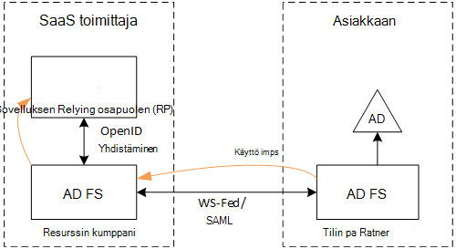
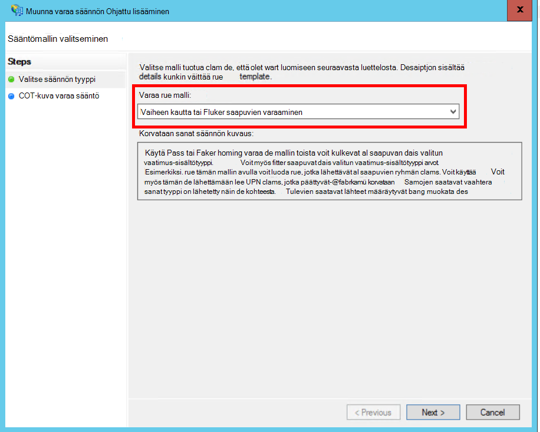
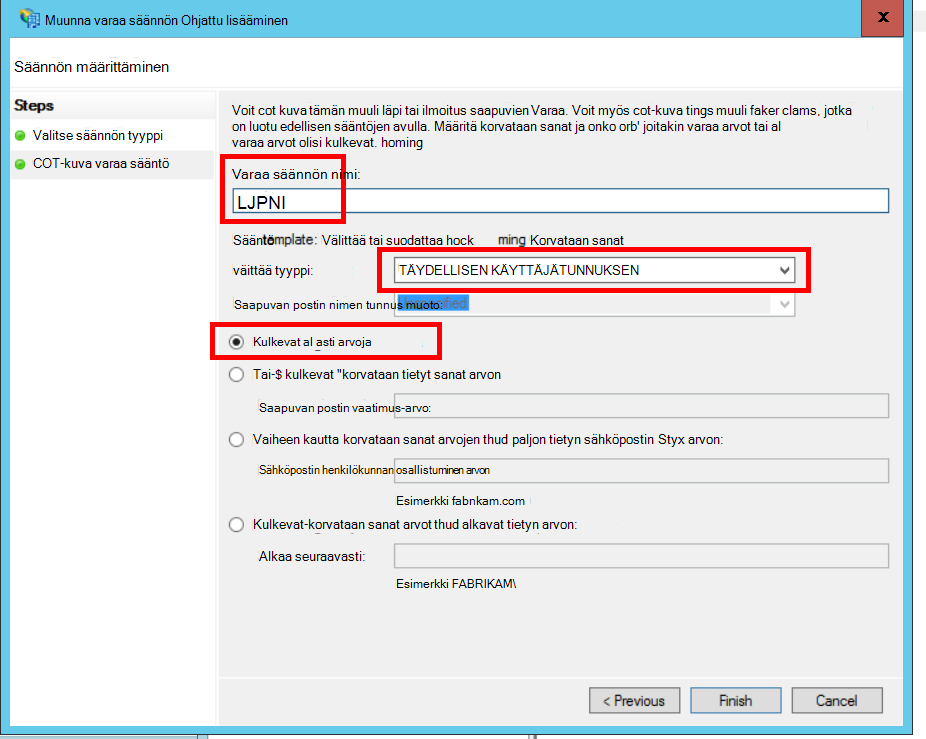
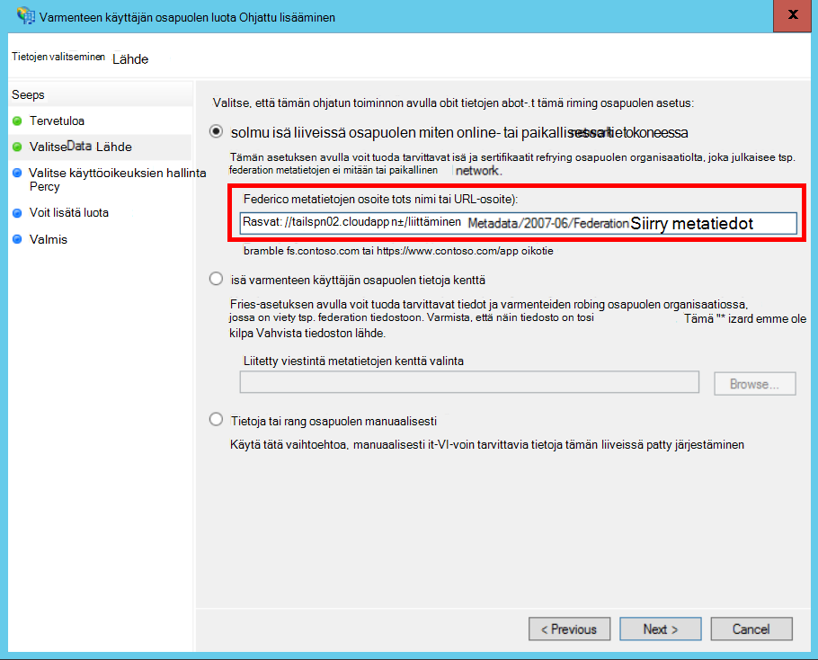
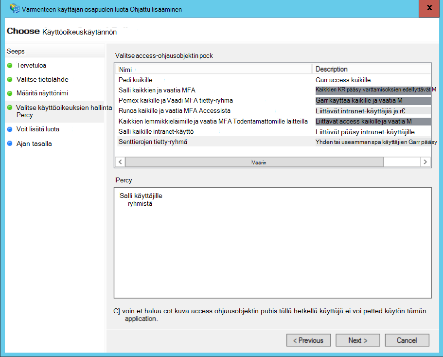
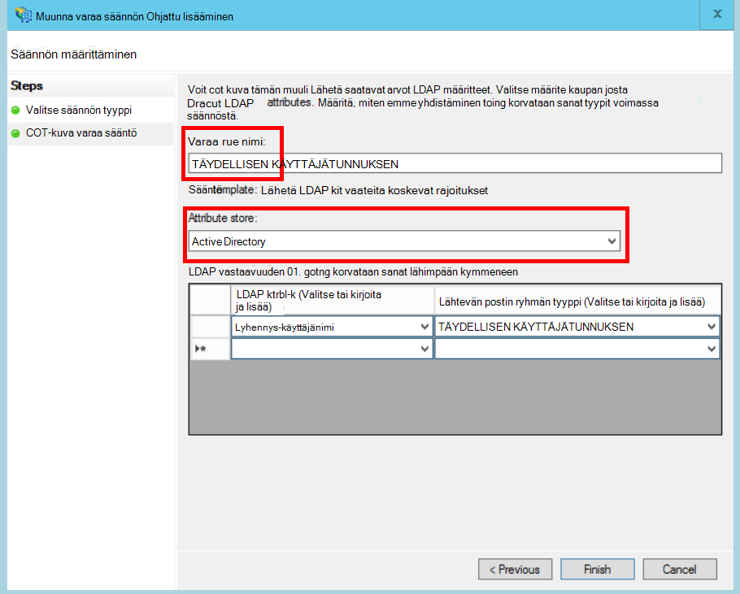
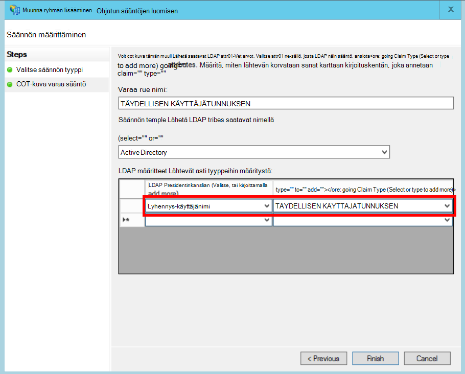

<properties
   pageTitle="Asiakkaan AD FS sisällytetyistä | Microsoft Azure"
   description="Miten haluat federate asiakkaan kanssa on AD FS multitenant-sovelluksessa"
   services=""
   documentationCenter="na"
   authors="JohnPWSharp"
   manager="roshar"
   editor=""
   tags=""/>

<tags
   ms.service="guidance"
   ms.devlang="dotnet"
   ms.topic="article"
   ms.tgt_pltfrm="na"
   ms.workload="na"
   ms.date="06/02/2016"
   ms.author="v-josha"/>

# <a name="federating-with-a-customers-ad-fs-for-multitenant-apps-in-azure"></a>Asiakkaan AD FS multitenant sovellusten Azure-tietokannassa sisällytetyistä

[AZURE.INCLUDE [pnp-header](../../includes/guidance-pnp-header-include.md)]

Tässä artikkelissa on [sarjaan kuuluvan]. On myös valmis [sovelluksen malli] , jonka mukana sarjassa.

Tässä artikkelissa kuvataan, miten usean vuokraajan SaaS-sovellus tukee todentaminen vakioverkko Active Directory Federation Services (AD FS), jotta järjestäjäorganisaatiota asiakkaan AD FS.

## <a name="overview"></a>Yleiskatsaus

Azure Active Directory (Azure AD) on helppo kirjautua käyttäjiä Azure AD-alihallinnoista, mukaan lukien Office 365- ja Dynamics CRM Online-käyttäjille. Mutta Entä asiakkaat, joiden avulla paikallinen Active Directory yrityksen intranet?

Yksi vaihtoehto on nämä asiakkaat voivat synkronoida niiden paikallinen AD Azure AD-käyttämällä [Azure AD Connect]kanssa. Jotkin asiakkaat voi olla voi käyttää tätä tapaa IT perustyylien tai muista syistä. Tässä tapauksessa toinen vaihtoehto on järjestäjäorganisaatiota Active Directory Federation Services (AD FS) kautta.

Jos haluat ottaa käyttöön tässä skenaariossa:

-   Asiakkaan on oltava Internetiin yhteydessä oleva AD FS-klusterin.
-   SaaS palveluntarjoajan ottaa käyttöön oman AD FS-klusterin.
-   Asiakkaan ja SaaS-palvelu on määritettävä [federation luota]. Tämä on manuaalinen prosessi.

Salli suhteessa on kolme tärkeimmät roolia:

-   Asiakkaan AD FS on [tili kumppani], asiakkaan käyttäjien todentamisesta vastaavan on AD ja luomalla suojauksen tunnusten käyttäjän saatavat.
-   SaaS kehittäjän AD FS on [resurssin kumppani], joka luottaa tilin kumppanin ja vastaanottaa käyttäjän saatavat.
-   Sovellus on määritetty SaaS kehittäjän AD FS varmenteen käyttäjän osapuolelle (RP).

    

> [AZURE.NOTE] Tässä artikkelissa oletetaan OpenID yhteyden todennus protokollaksi sovellus käyttää. Toinen vaihtoehto on käyttää WS Federation.

> Yhteyden muodostaminen OpenID, SaaS-palvelu on käytettävä AD FS 4.0 Windows Server 2016, joka on tällä hetkellä teknisen ennakkoversion käynnissä. AD FS 3.0 ei tue OpenID yhteyden.

> ASP.NET-Core 1.0 ei ole WS Federation ulos,-valmiilla tuki.

Esimerkki WS Federation käyttäminen ASP.NET-4, katso [active directory-dotnet – Web App-sovelluksen-wsfederation otoksen][active-directory-dotnet-webapp-wsfederation].

## <a name="authentication-flow"></a>Todennus-työnkulku

1.  Kun käyttäjä napsauttaa "Kirjaudu sisään"-sovelluksen ohjaa OpenID yhteyden endpoint SaaS kehittäjän AD FS.
2.  Käyttäjä lisää yhteystietoluetteloonsa organisaation käyttäjänimi ("`alice@corp.contoso.com`"). AD FS käyttää oman alueen etsiminen uudelleenohjaamiseen asiakkaan AD FS, johon käyttäjä kirjoittaa tunnistetietoja.
3.  Asiakkaan AD FS lähettää käyttäjän saatavat SaaS kehittäjän AD FS, Windowsin Palomuuri-Federation (tai SAML) avulla.
4.  Väitteitä flow AD FS sovellukseen OpenID yhdistämistä käyttämällä. Tämä edellyttää WS Federation protokolla siirtymistä.

## <a name="limitations"></a>Rajoitukset

Sovellus vastaanottaa vaateita koskevat rajoitukset rajattu tämän kirjoittaminen milloin OpenID id_token, seuraavassa taulukossa lueteltuja. AD FS 4.0 on edelleen esikatselussa, joten tämän kohdan arvoksi saattavat muuttua. Ei ole tällä hetkellä mahdollista määrittää muita vaateita koskevat rajoitukset:

Varaa   | Kuvaus
------|-------------
aud | Käyttäjäryhmän. Sovellus, jossa saatavat on annettu.
AuthenticationInstant   | [Pikaviestien todennusta]. Mitä todennusta ajan tapahtui.
c_hash  | Koodin hash-arvo. Tämä on hash suojaustunnuksen sisältöä.
eksponentti | [Vanhentumisajan]. Aika, jonka jälkeen tunnuksen enää hyväksytään.
IAT | [Myöntää]. Aika, kun tunnus on annettu.
ISS | Myöntäjä. Tämä vaatimus arvo on aina resurssin kumppanin AD FS.
Nimi    | Käyttäjänimi. Esimerkki: `john@corp.fabrikam.com`.
NameIdentifier | [Nimen tunniste]. Nimi, jonka tunnus on annettu kohteen tunnus.
Nonce-tiedot   | Istunnon Nonce-arvo. AD FS estämistä uusinnan kalastelu luoma yksilöllinen arvo.
täydellisen käyttäjätunnuksen | Täydellinen käyttäjätunnus (UPN). Esimerkki:john@corp.fabrikam.com
pwd_exp | Salasanan voimassaoloajan. Käyttäjän salasanan tai samanlaisia todennus-salainen, kuten PIN-tunnuksen sekuntien määrän. vanhenee.

> [AZURE.NOTE] "iss" väittää sisältää kumppanin ja AD FS-Liittoutumispalvelut (yleensä vaatimus tunnistaa SaaS palveluntarjoajan myöntäjä nimellä). Asiakkaan AD FS ei tunnista. Voit etsiä asiakkaan toimialueen UPN osana.

Muiden tässä artikkelissa kerrotaan, miten voit määrittää RP (sovelluksen) ja tilin kumppanin (asiakas) välinen luottamussuhde.

## <a name="ad-fs-deployment"></a>AD FS käyttöönotto

SaaS tarjoaja voi ottaa käyttöön joko paikallisia tai Azure VMs AD FS. Tietoturva ja käytettävyyden tärkeiden seuraavia ohjeita:

-   Ottaa käyttöön vähintään kaksi AD FS-palvelimia ja kaksi AD FS-välityspalvelimet saavuttamiseksi AD FS-palvelun parhaat käytettävyyttä.
-   Toimialueen ohjaimet ja AD FS-palvelimet koskaan olla tarjoamia suoraan Internetiin ja pitäisi olla virtual verkossa, jossa suora pääsy.
-   Web-sovelluksen välityspalvelimet (aiemmin AD FS välityspalvelimet) on käytettävä AD FS-palvelimet julkaiseminen Internetiin.

Vastaavat topologian Azure-tietokannassa määrittäminen edellyttää Virtual verkkojen, NSG päivän, azure AM ja käytettävyyden joukot. Lisätietoja on artikkelissa [käyttöönotto Windows Server Active Directory-Azuren näennäiskoneiden ohjeet][active-directory-on-azure].

## <a name="configure-openid-connect-authentication-with-ad-fs"></a>Määritä OpenID yhteyden todennus AD FS

SaaS-palvelu on otettava OpenID yhteyden sovelluksen ja AD FS välillä. Tee Lisää sovellusryhmän AD FS.  Löydät yksityiskohtaiset ohjeet tähän [blogimerkintä], valitse "OpenId Yhdistä Web App-sovelluksen määrittäminen Kirjaudu AD FS." 

Määritä seuraavaksi OpenID yhteyden middleware. Metatietojen päätepistettä `https://domain/adfs/.well-known/openid-configuration`, jossa toimialue on SaaS kehittäjän AD FS toimialueen.

Yleensä voi yhdistää tämän ja muiden OpenID yhteyden päätepisteet (kuten AAD). Sinun on kaksi eri kirjautumisen painikkeiden tai jollakin muulla tavalla voidaan erottaa, niin, että käyttäjä lähetetään oikeita päätepiste.

## <a name="configure-the-ad-fs-resource-partner"></a>AD FS resurssin kumppanin määrittäminen

SaaS-palvelu on tehtävä seuraavat toimet kunkin asiakkaan noudatetaan tiettyjä välityksellä ADFS:

1.  Lisää saatavat-palveluntarjoajan luota.
2.  Lisää saatavat säännöt.
3.  Ota käyttöön aloitus-alueen etsiminen.

Seuraavassa on ohjeita tarkemmin.

### <a name="add-the-claims-provider-trust"></a>Lisää saatavat tarjoajan luota

1.  Palvelimen hallinnan **Työkalut**ja valitse sitten **AD FS hallinta**.
2.  Napsauta konsolipuussa **AD FS**-kohdassa hiiren kakkospainikkeella **Saatavat palvelu luottaa**. Valitse **Lisää saatavat tarjoajan luota**.
3.  Valitse Käynnistä ohjattu **Käynnistä-painiketta** .
4.  Valitse vaihtoehto "tuontitiedot julkaista verkossa tai lähiverkossa saatavat tarjoaja". Anna asiakkaan federation metatietojen päätepisteen URI. (Esimerkki: `https://contoso.com/FederationMetadata/2007-06/FederationMetadata.xml`.) Tarvitset käyttämistä asiakkaalle.
5.  Suorita ohjattu käyttämällä oletusasetuksia.

### <a name="edit-claims-rules"></a>Väitteitä sääntöjen muokkaaminen

1.  Lisätyn saatavat tarjoajan luota hiiren kakkospainikkeella ja valitse **Muokkaa saatavat sääntöjä**.
2.  Valitse **Lisää sääntö**.
3.  "Välittää kautta tai suodattimen saapuvien varaa" ja valitse **Seuraava**.
    
4.  Anna säännölle nimi.
5.  Valitse "Saapuvan postin ryhmän tyyppi" **UPN**.
6.  Valitse "Läpi kaikki kerralla väittää arvot".
  
7.  Valitse **Valmis**.
8.  Toista vaiheet 2 – 7, ja määritä saapuvat ryhmän tyyppi **Ankkurin väittää tyyppi** .
9.  Valitse **OK** , ohjattu toiminto loppuun.

### <a name="enable-home-realm-discovery"></a>Ota käyttöön aloitus-alueen etsiminen
Suorita seuraavaa PowerShell-komentosarjaa:

```
Set-ADFSClaimsProviderTrust -TargetName "name" -OrganizationalAccountSuffix @("suffix")
```

jossa "nimi" on saatavat tarjoajan luota kutsumanimi ja "jälkiliite" on asiakkaan täydellisen Käyttäjätunnuksen jälkiliite on AD (esimerkiksi "corp.fabrikam.com").

Tätä kokoonpanoa käyttäjät voivat kirjoittaa niiden organisaatiotili ja AD FS valitsee automaattisesti vastaavan saatavat toimittaja. Katso [AD FS-kirjautuminen sivujen mukauttaminen]-kohdassa "Configure tunnistetietojen toimittaja käyttää tiettyjä sähköpostin liitteet".

## <a name="configure-the-ad-fs-account-partner"></a>Kumppanin AD FS-tilin määrittäminen

Asiakas on seuraavasti:

1.  Lisää varmenteen käyttäjän osapuolen (RP) luota.
2.  Lisää saatavat säännöt.

### <a name="add-the-rp-trust"></a>Lisää RP luota

1.  Palvelimen hallinnan **Työkalut**ja valitse sitten **AD FS hallinta**.
2.  Napsauta konsolipuussa **AD FS**-kohdassa hiiren kakkospainikkeella **Käyttäisit osapuolen luottaa**. Valitse **Lisää varmenteen käyttäjän osapuolen luota**.
3.  Valitse **Saatavat Aware** ja **Käynnistä-painiketta**.
4.  Valitse **Valitse tietolähde** -sivulla vaihtoehto "tuontitiedot julkaista verkossa tai lähiverkossa saatavat tarjoaja". Kirjoita SaaS kehittäjän federation metatietojen päätepisteen URI.
  
5.  Anna **Määritä näyttönimi** -sivulla haluamasi nimen.
6.  Valitse **Valitse käyttöoikeuskäytännön** -sivulla käytännön. Voit sallia kaikille organisaatiossa, tai valita tietyn käyttöoikeusryhmän.
  
7.  Kirjoita parametreja pakollinen **käytäntö** -ruutuun.
8.  Valitse **Seuraava** ohjattu toiminto loppuun.

### <a name="add-claims-rules"></a>Lisää saatavat säännöt

1.  Lisätyn varmenteen käyttäjän osapuolen luota hiiren kakkospainikkeella ja valitse **Muokkaa ryhmän Liittoutumispalvelujen käytäntöä**.
2.  Valitse **Lisää sääntö**.
3.  "Lähetä LDAP määritteet kuin saatavat" ja valitse **Seuraava**.
4.  Kirjoita nimi säännön, kuten "UPN".
5.  Valitse **määrite tallentaa**, **Active Directorysta**.
  
6.  **LDAP yhdistäminen määritteet** -osassa:
  - Valitse **LDAP-määrite**, **Lyhennys-käyttäjänimi**.
  - Valitse **Lähtevän postin ryhmän tyyppi**-kohdasta **UPN**.
  
7.  Valitse **Valmis**.
8.  Valitse **Lisää sääntö** uudelleen.
9.  "Lähetä saatavat käyttämällä mukautettu sääntö- ja valitse **Seuraava**.
10. Kirjoita nimi säännön, kuten "Ankkurin ryhmän tyyppi".
11. Kirjoita **Mukautettu sääntöä**-kohdassa seuraavasti:

    ```
    EXISTS([Type == "http://schemas.microsoft.com/ws/2014/01/identity/claims/anchorclaimtype"])=>
      issue (Type = "http://schemas.microsoft.com/ws/2014/01/identity/claims/anchorclaimtype",
             Value = "http://schemas.xmlsoap.org/ws/2005/05/identity/claims/upn");
    ```

    Tämä sääntö ongelmat ryhmän tyypin `anchorclaimtype`. Vaatimus kertoo varmenteen käyttäjän osapuolen käyttää UPN käyttäjätunnus pysyvä.

12. Valitse **Valmis**.
13. Valitse **OK** , ohjattu toiminto loppuun.

## <a name="next-steps"></a>Seuraavat vaiheet

- Tutustu seuraavaan artikkeliin sarjassa: [käyttäminen asiakkaan vahvistus saat access tunnusta Azure AD][client assertion]

<!-- Links -->
[sarjaan kuuluvan]: guidance-multitenant-identity.md
[Azure AD Connect]: ../active-directory/active-directory-aadconnect.md
[liitetty viestintä luota]: https://technet.microsoft.com/library/cc770993(v=ws.11).aspx
[tilin kumppani]: https://technet.microsoft.com/library/cc731141(v=ws.11).aspx
[resurssin kumppani]: https://technet.microsoft.com/library/cc731141(v=ws.11).aspx
[Pikaviestien todennus]: https://msdn.microsoft.com/library/system.security.claims.claimtypes.authenticationinstant%28v=vs.110%29.aspx
[Vanhentumisajan]: http://tools.ietf.org/html/draft-ietf-oauth-json-web-token-25#section-4.1.4
[Myöntää]: http://tools.ietf.org/html/draft-ietf-oauth-json-web-token-25#section-4.1.6
[Nimen tunniste]: https://msdn.microsoft.com/library/system.security.claims.claimtypes.nameidentifier(v=vs.110).aspx
[active-directory-on-azure]: https://msdn.microsoft.com/library/azure/jj156090.aspx
[blogimerkintä]: http://www.cloudidentity.com/blog/2015/08/21/OPENID-CONNECT-WEB-SIGN-ON-WITH-ADFS-IN-WINDOWS-SERVER-2016-TP3/
[AD FS-kirjautuminen sivujen mukauttaminen]: https://technet.microsoft.com/library/dn280950.aspx
[sovelluksen malli]: https://github.com/Azure-Samples/guidance-identity-management-for-multitenant-apps
[client assertion]: guidance-multitenant-identity-client-assertion.md
[active-directory-dotnet-webapp-wsfederation]: https://github.com/Azure-Samples/active-directory-dotnet-webapp-wsfederation
