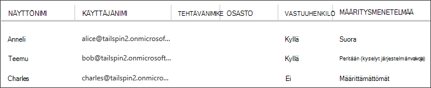

<properties
   pageTitle="Sovelluksen roolit | Microsoft Azure"
   description="Tietoja luvan sovelluksen roolien avulla"
   services=""
   documentationCenter="na"
   authors="MikeWasson"
   manager="roshar"
   editor=""
   tags=""/>

<tags
   ms.service="guidance"
   ms.devlang="dotnet"
   ms.topic="article"
   ms.tgt_pltfrm="na"
   ms.workload="na"
   ms.date="02/16/2016"
   ms.author="mwasson"/>

#  <a name="application-roles-in-multitenant-applications"></a>Sovelluksen roolit multitenant-sovelluksissa

[AZURE.INCLUDE [pnp-header](../../includes/guidance-pnp-header-include.md)]

Tässä artikkelissa on [sarjaan kuuluvan]. On myös valmis [sovelluksen malli] , jonka mukana sarjassa.

Sovelluksen rooleja käytetään Määritä käyttöoikeudet käyttäjille. Esimerkiksi [Tailspin kyselyt] [ Tailspin] sovellus määrittää seuraavia rooleja:

- Järjestelmänvalvoja. Voit suorittaa kyselyn, joka kuuluu kyseisen alihallinnan kaikki CRUD toimenpiteet.
- Tekijän. Voit luoda uuden kyselyt.
- Lukija. Voit lukea kaikki kyselyt, jotka kuuluvat alihallintaan.

Näet, että roolit kädessä Hae käännetään käyttöoikeudet [luvan]aikana. Mutta ensimmäisen kysymyksen on käyttöoikeustasojen määrittämisestä ja roolien hallinta. Olemme tunnistaa tärkeimmät vaihtoehdoista:

-   [Azure AD-sovelluksen roolit](#roles-using-azure-ad-app-roles)
-   [Azure AD-käyttöoikeusryhmät](#roles-using-azure-ad-security-groups)
-   [Sovelluksen Roolinhallinta](#roles-using-an-application-role-manager).

## <a name="roles-using-azure-ad-app-roles"></a>Roolien Azure AD App roolien avulla

Tämä on tapa, joka on käytetty Tailspin kyselyt-sovelluksessa.

Tämän menetelmän SaaS tarjoaja määrittää sovelluksen roolit lisäämällä ne sovelluksen luettelo. Kun asiakas rekisteröi asiakkaan Active directory-järjestelmänvalvoja määrittää käyttäjien roolit. Kun käyttäjä kirjautuu sisään, käyttäjän varattujen rooleja lähetetään saatavat.

> [AZURE.NOTE] Jos asiakkaan Azure AD Premium-järjestelmänvalvoja määrittää käyttöoikeusryhmän rooli ja ryhmän jäsenet perivät app rooli. Tämä on kätevä tapa Hallitse rooleja, koska ryhmän omistajaa ei tarvitse olla AD-järjestelmänvalvojaksi

Tämän menetelmän eduista:

-   Yksinkertainen ohjelmoinnin malli.
-   Roolit ovat sovellus. Rooli saatavat sovelluksen ei lähetetä toiseen sovellukseen.
-   Jos asiakkaan sovellus poistetaan niiden AD-vuokraajan-roolien näkyvistä.
-   Sovellus ei tarvitse kaikki ylimääräiset Active Directory-käyttöoikeudet, kuin käyttäjän profiiliin lukeminen.

Haitoista:

- Asiakkaiden ilman Azure AD Premium voi määrittää käyttöoikeusryhmät roolit. Näiden asiakkaiden AD-järjestelmänvalvojan on tehtävä kaikki käyttäjän tehtävät.
- Jos sinulla on Taustajärjestelmä verkko-Ohjelmointirajapinnan, joka on erillinen web Appista, roolimäärityksiä web App ei käytetä verkko-Ohjelmointirajapinnan. Katso Lisää vaiheessa keskustelun [suojaaminen taustassa verkko-Ohjelmointirajapinnan].

### <a name="implementation"></a>Käyttöönotto

**Määrittää roolit.** SaaS tarjoaja ilmoittaa sovelluksen roolien [sovelluksen luettelon]. Esimerkiksi näin luettelon tapahtuma kyselyt-sovelluksen:

```
"appRoles": [
  {
    "allowedMemberTypes": [
      "User"
    ],
    "description": "Creators can create Surveys",
    "displayName": "SurveyCreator",
    "id": "1b4f816e-5eaf-48b9-8613-7923830595ad",
    "isEnabled": true,
    "value": "SurveyCreator"
  },
  {
    "allowedMemberTypes": [
      "User"
    ],
    "description": "Administrators can manage the Surveys in their tenant",
    "displayName": "SurveyAdmin",
    "id": "c20e145e-5459-4a6c-a074-b942bbd4cfe1",
    "isEnabled": true,
    "value": "SurveyAdmin"
  }
],
```

`value` Ominaisuus näkyy rooli-ryhmän. `id` -Ominaisuus on määritetty rooli yksilöivä tunnus. Luo uusi GUID-arvo on aina `id`.

**Käyttäjien määrittäminen**. Kun uusi asiakas Rekisteröi-sovellus rekisteröidään asiakkaan AD-vuokraajan. Tässä vaiheessa kyseisen alihallinnan AD-järjestelmänvalvoja voi määrittää käyttäjiä rooleihin.

> [AZURE.NOTE] Aiemmin mainittuja asiakkaille, joilla on Azure AD Premium voit myös määrittää käyttöoikeusryhmät rooleille.

Azure-portaalista seuraavassa näyttökuvassa näkyy kolme käyttäjät. Anneli on määritetty suoraan rooli. Teemu periytyvät roolin käyttöoikeusryhmän nimeltä "Kyselyt järjestelmänvalvojan", joka on liitetty roolin jäsen. Charles ei ole määritetty mitään rooli.



> [AZURE.NOTE] Voit myös sovellus määrittää roolit ohjelmallisesti Azure AD-kaavio-Ohjelmointirajapinnan käyttäminen.  Tämä edellyttää kuitenkin sovelluksen hankkiminen asiakkaan AD kansion kirjoitusoikeudet. Sovellus on käyttöoikeudet voi tehdä epäkohdan paljon &mdash; asiakkaan on luottaminen sovelluksen ei möhliä niiden hakemisto. Monet asiakkaat ehkä myönnä myöntää tämä käyttöoikeustaso.

**Hae roolin saatavat**. Käyttäjän kirjautuessa sisään sovellus vastaanottaa käyttäjän määritetyt roolit varaa sisältötyyppi `http://schemas.microsoft.com/ws/2008/06/identity/claims/role`.  

Käyttäjä voi olla useita rooleja tai ei ole roolia. Todennus-koodisi ei oletetaan, että käyttäjällä on yksi väittää rooli. Sen sijaan kirjoittaa koodia, joka tarkistaa, onko tietyn varaa arvo ei sisällä tietoja:

```csharp
if (context.User.HasClaim(ClaimTypes.Role, "Admin")) { ... }
```

## <a name="roles-using-azure-ad-security-groups"></a>Roolien Azure AD-suojausryhmien avulla

Tämän menetelmän roolit esitetään AD käyttöoikeusryhmät. Sovellus määrittää käyttöoikeudet käyttäjille heidän suojauksen ryhmän jäsenyyksien perusteella.

Etuja:

-   Tämän menetelmän avulla asiakkaille, joilla ei ole Azure AD Premium-asiakas voi käyttöoikeusryhmät avulla voit hallita roolimäärityksiä.

Haitat:

- Monimutkaisuutta. Koska jokaisella vuokraajan lähettää toiseen ryhmään saatavat, sovellus on seurantaan joka käyttöoikeusryhmät vastaa sovelluksen mitkä roolit kunkin vuokraajan.
- Jos asiakkaan sovellus poistetaan niiden AD-vuokraajan, suojausryhmät jätetään niiden Active Directoryn.

### <a name="implementation"></a>Käyttöönotto

Sovellusluettelo, Määritä `groupMembershipClaims` "SecurityGroup"-ominaisuutta. Tämä on tarpeen hakee ryhmän jäsenyyden saatavat AAD.

```
{
   // ...
   "groupMembershipClaims": "SecurityGroup",
}
```

Kun uusi asiakas Rekisteröi-sovelluksen ohjaa asiakas, jonka haluat luoda sovelluksen tarvitsemat roolit käyttöoikeusryhmät. Asiakas on sitten ryhmän objektin tunnukset voit kirjoittaa sovelluksen. Sovellus tallentaa ne taulukon, joka yhdistää ryhmätunnus sovelluksen roolit kohden.

> [AZURE.NOTE] Vaihtoehtoisesti sovellus voi luoda ryhmiä ohjelmallisesti Azure AD-kaavio-Ohjelmointirajapinnan käyttäminen.  Tämä on vähemmän virhe voi enää. Edellyttää kuitenkin hankkiminen "lukeminen ja kirjoittaminen kaikki ryhmät-sovelluksen asiakkaan AD kansiolle. Monet asiakkaat ehkä myönnä myöntää tämä käyttöoikeustaso.

Kun käyttäjä kirjautuu sisään:

1.  Sovellus vastaanottaa käyttäjän ryhmät saatavat nimellä. Kunkin ryhmän arvo ryhmän Objektitunnus.
2.  Azure AD rajoittaa ryhmien lähetetään tunnuksen. Jos ryhmien määrä on suurempi, Azure AD lähettää määräten "overage" ryhmän. Jos kyseisen ryhmän ei sisällä tietoja-sovellus on kyselyn Azure AD-kaavio-Ohjelmointirajapinnan saat kaikki ryhmät, joihin käyttäjä kuuluu. Lisätietoja on artikkelissa [luvan Cloud sovelluksissa AD-ryhmien käyttäminen]-kohdasta kohtaan "Ryhmät väittää kattavuus".
3.  Sovelluksen etsii omassa tietokannassa, voit etsiä vastaavan sovelluksen roolit käyttäjälle objektin tunnukset.
4.  Sovelluksen Lisää mukautetun ryhmän arvon, joka ilmaisee sovelluksen rooli käyttäjän täydellinen. Esimerkki: `survey_role` = "SurveyAdmin".

Luvan käytännöt käytettävä mukautettu rooli-ryhmän väittää ei koko ryhmälle.

## <a name="roles-using-an-application-role-manager"></a>Roolien sovelluksen-roolinhallinnan avulla

Tämän menetelmän kanssa sovelluksen roolit ei tallenneta Azure AD ollenkaan. Sen sijaan, sovellus tallentaa roolimäärityksiä kullekin käyttäjälle oma DB &mdash; **RoleManager** -luokan avulla esimerkiksi ASP.NET käyttäjätiedot.

Etuja:

-   Sovellus on täydet oikeudet roolit ja käyttäjän tehtävät.

Haitoista:

- Monimutkaisia, näyttävyyttä säilyttää.
- Ei voi käyttää AD käyttöoikeusryhmät roolimäärityksiä hallinta.
- Käyttäjätiedot tallennetaan sovellustietokanta, se voi mistä synkronoitu vuokraajan Active Directory-hakemistosta, kun käyttäjiä lisätään tai poistetaan.   

Tämän menetelmän monta aiemmin esimerkkejä on. Katso esimerkiksi [auth ja SQL DB ASP.NET MVC-sovelluksen luominen ja ottaa käyttöön sovelluksen Azure-palveluun].

## <a name="next-steps"></a>Seuraavat vaiheet

- Tutustu seuraavaan artikkeliin sarjassa: [Roolipohjainen ja resurssi-pohjainen todennus multitenant sovelluksissa][todennus]

<!-- Links -->
[Tailspin]: guidance-multitenant-identity-tailspin.md
[sarjaan kuuluvan]: guidance-multitenant-identity.md
[todennus]: guidance-multitenant-identity-authorize.md
[Taustajärjestelmä verkko-Ohjelmointirajapinnan suojaaminen]: guidance-multitenant-identity-web-api.md
[ASP.NET-MVC-sovelluksen luominen auth ja SQL DB ja ota käyttöön App Azure-palvelu]: ../app-service-web/web-sites-dotnet-deploy-aspnet-mvc-app-membership-oauth-sql-database.md
[sovellusluettelo]: ../active-directory/active-directory-application-manifest.md
[sovelluksen malli]: https://github.com/Azure-Samples/guidance-identity-management-for-multitenant-apps
