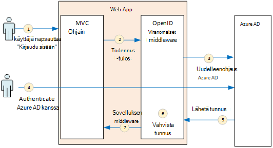
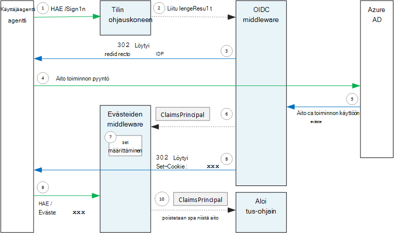

<properties
   pageTitle="Multitenant sovellusten käyttöoikeuksien | Microsoft Azure"
   description="Miten multitenant sovelluksen voi todentaa Azure AD käyttäjiltä"
   services=""
   documentationCenter="na"
   authors="MikeWasson"
   manager="roshar"
   editor=""
   tags=""/>

<tags
   ms.service="guidance"
   ms.devlang="dotnet"
   ms.topic="article"
   ms.tgt_pltfrm="na"
   ms.workload="na"
   ms.date="05/23/2016"
   ms.author="mwasson"/>

# <a name="authentication-in-multitenant-apps-using-azure-ad-and-openid-connect"></a>Käyttöoikeuksien multitenant, käyttämällä Azure AD-sovelluksissa ja OpenID Yhdistä

[AZURE.INCLUDE [pnp-header](../../includes/guidance-pnp-header-include.md)]

Tässä artikkelissa on [sarjaan kuuluvan](guidance-multitenant-identity.md). On myös valmis [sovelluksen malli] , jonka mukana sarjassa.

Tässä artikkelissa kuvataan, miten multitenant sovelluksen voi todentaa Azure Active Directory (Azure AD), käyttäjät todennetaan OpenID yhteyden (OIDC) avulla.

## <a name="overview"></a>Yleiskatsaus

Tutustu [viittaus käyttöönoton](guidance-multitenant-identity-tailspin.md) on ASP.NET Core 1.0-sovellus. Sovellus käyttää valmiita OpenID yhteyden middleware OIDC todennus-työnkulku. Seuraavassa kaaviossa näkyy, mitä tapahtuu, kun käyttäjä kirjautuu sisään, ylätasolla.



1.  Käyttäjä napsauttaa sovelluksessa "Kirjaudu sisään"-painiketta. Tämä toiminto käsitellään MVC valvoja.
2.  MVC-ohjain palauttaa **ChallengeResult** -toiminto.
3.  Middleware sieppaa **ChallengeResult** ja luo 302 vastauksen, joka ohjaa käyttäjän Azure AD-kirjautumissivulla.
4.  Käyttäjän todentaa Azure AD kanssa.
5.  Azure AD lähettää ID-tunnuksen sovelluksen.
6.  Middleware vahvistaa ID-tunnusta. Tässä vaiheessa käyttäjä todennetaan nyt sovelluksen sisällä.
7.  Middleware ohjaa käyttäjän takaisin sovelluksen.

## <a name="register-the-app-with-azure-ad"></a>Voit rekisteröidä Azure AD sovellus

OpenID yhteyden käyttöön SaaS palveluntarjoajan Rekisteröi sovelluksen omia Azure AD-vuokraajan sisällä.

Voit rekisteröidä sovelluksen noudattamalla [Azure Active Directory-integrointi sovelluksiin](../active-directory/active-directory-integrating-applications.md) [lisääminen sovelluksen](../active-directory/active-directory-integrating-applications.md#adding-an-application)osa.

**Määrittäminen** -sivulla:

-   Huomaa asiakkaan ID-tunnuksellasi.
-   Valitse **sovellus on usean vuokraajan**Valitse **Kyllä**.
-   Määritä johon Azure AD lähettää vastauksen **Vastaa URL-osoite** URL-osoitteeseen. Voit käyttää sovelluksen pääkansion URL-osoite.
  - Huomautus: URL-polku voi olla, kunhan isännän nimi vastaa sovelluksen käyttöön.
  - Voit määrittää useita vastaa URL-osoitteet. Aikana, voit käyttää `localhost` osoite-sovelluksen käytössä paikallisesti.
-   Luo asiakkaan salaisuus: **näppäimet**-kohdan vieressä olevaa avattavan luettelon, napsauta ilmoitetaan, **Valitse kesto** ja valitse 1 tai 2 vuotta. Avain on näkyvissä, kun valitset **Tallenna**. Muista kopioida arvo, koska se ei näy uudelleen, kun lataat määritys-sivulla.

## <a name="configure-the-auth-middleware"></a>Määritä auth middleware

Tässä osassa kuvataan, miten todennusta middleware paikallaan ASP.NET Core 1.0 multitenant todennustavaksi OpenID Connect-sovelluksessa.

Lisää OpenID yhteyden middleware käynnistys-luokkaan:

```csharp
app.UseOpenIdConnectAuthentication(options =>
{
    options.AutomaticAuthenticate = true;
    options.AutomaticChallenge = true;
    options.ClientId = [client ID];
    options.Authority = "https://login.microsoftonline.com/common/";
    options.CallbackPath = [callback path];
    options.PostLogoutRedirectUri = [application URI];
    options.SignInScheme = CookieAuthenticationDefaults.AuthenticationScheme;
    options.TokenValidationParameters = new TokenValidationParameters
    {
        ValidateIssuer = false
    };
    options.Events = [event callbacks];
});
```

> [AZURE.NOTE] Katso [Startup.cs](https://github.com/Azure-Samples/guidance-identity-management-for-multitenant-apps/blob/master/src/Tailspin.Surveys.Web/Startup.cs).

Lisätietoja käynnistys-luokan kohdassa [Sovelluksen käynnistys](https://docs.asp.net/en/latest/fundamentals/startup.html) ASP.NET Core 1.0-ohjeista.

Määritä middleware seuraavat asetukset:

- **ClientId**. Sovelluksen Asiakastunnus, jonka olet saanut asentaessasi Azure AD sovellus.
- **Myöntäjä**. Multitenant sovelluksen asetukseksi `https://login.microsoftonline.com/common/`. Tämä on Azure AD yleisiä päätepiste, jonka avulla käyttäjät kirjautumaan minkä tahansa Azure AD-vuokraajan URL-osoite. Saat lisätietoja yleisten päätepisteen [on blogikirjoituksessa](http://www.cloudidentity.com/blog/2014/08/26/the-common-endpoint-walks-like-a-tenant-talks-like-a-tenant-but-is-not-a-tenant/).
- Määritä **TokenValidationParameters** **ValidateIssuer** FALSE. Tämä tarkoittaa sovellus ole vastuussa vahvistaminen ID-tunnuksen myöntäjä arvo. (Middleware vahvistaa edelleen tunnuksen itse.) Saat lisätietoja vahvistaminen myöntäjä [myöntäjä vahvistus](guidance-multitenant-identity-claims.md#issuer-validation).
- **CallbackPath**. Määritä tämä polku vastaa URL-osoitteeseen, joka on rekisteröity Azure AD. Jos vastaa URL-osoite on esimerkiksi `http://contoso.com/aadsignin`, **CallbackPath** pitäisi olla `aadsignin`. Jos et määritä tämä vaihtoehto, oletusarvo on `signin-oidc`.
- **PostLogoutRedirectUri**. Määritä URL-osoite ohjaamaan käyttäjät jälkeen Kirjaudu ulos. Sivu, jonka avulla anonyymit pyynnöt on oltava &mdash; yleensä aloitussivulle.
- **SignInScheme**. Määritä `CookieAuthenticationDefaults.AuthenticationScheme`. Tämä asetus tarkoittaa, että sen jälkeen, kun käyttäjä on todennettu käyttäjän saatavat tallennetaan paikallisesti eväste. Eväste on, miten käyttäjä pysyy kirjautuneena sisään selaimen istunnon aikana.
- **Tapahtumat.** Tapahtuman takaisinkutsuja; Katso [todennus tapahtumat](#authentication-events).

Myös lisätä Evästetodennus middleware putkijohto. Tämä middleware vastaa käyttäjän saatavat, eväste kirjoittaminen ja lukemalla eväste seuraavien sivujen latausaikaa sekunneilla aikana.

```csharp
app.UseCookieAuthentication(options =>
{
    options.AutomaticAuthenticate = true;
    options.AutomaticChallenge = true;
    options.AccessDeniedPath = "/Home/Forbidden";
});
```

## <a name="initiate-the-authentication-flow"></a>Todennus-työnkulun aloittaminen

Tuotto **ChallengeResult** käynnistämiseen todennus kulun ASP.NET MVC contoller:

```csharp
[AllowAnonymous]
public IActionResult SignIn()
{
    return new ChallengeResult(
        OpenIdConnectDefaults.AuthenticationScheme,
        new AuthenticationProperties
        {
            IsPersistent = true,
            RedirectUri = Url.Action("SignInCallback", "Account")
        });
}
```

Tämä aiheuttaa middleware palauttaa 302 (Found)-vastauksen, joka ohjaa todennus päätepisteelle.

## <a name="user-login-sessions"></a>Käyttäjän kirjautuminen istuntojen

Kuten edellä, kun käyttäjä kirjautuu ensimmäisen kerran, Evästetodennus middleware kirjoittaa käyttäjän saatavat, eväste. Tämän jälkeen pyyntöjen todennetaan lukemalla eväste.

Oletusarvon mukaan eväste middleware kirjoittaa [istunnon evästeiden][session-cookie], mikä saa poistaa kerran käyttäjän sulkee selaimessa. Kun seuraavan kerran käyttäjä käy seuraava sivustossa, ne on kirjautua sisään uudelleen. Kuitenkin jos **IsPersistent** arvoksi true **ChallengeResult**, middleware kirjoittaa pysyvä eväste, jotta käyttäjä pysyy kirjautuneena sisään selaimen sulkemisen jälkeen. Voit määrittää evästeiden; vanhentumispäivä Katso [hallinta eväste asetukset][cookie-options]. Pysyvät evästeet eivät tarkoituksenmukaista käyttäjälle, mutta ehkä sovellu sovelluksia (sanoa, pankin sovelluksen) haluamaasi käyttäjä voi kirjautua sisään aina.

## <a name="about-the-openid-connect-middleware"></a>Tietoja OpenID yhteyden middleware

ASP.NET-OpenID yhteyden-middleware piilottaa useimmat protokolla-tiedot. Tässä osassa on joitakin huomautuksia käyttöönoton, joka voi olla hyödyllistä tietoa protokolla-työnkulku.

Ensin tarkastellaan nyt todennus kulun kannalta ASP.NET (ohittaa sovelluksen ja Azure AD OIDC protokolla-työnkulku tietoja). Seuraavassa kaaviossa on esitetty prosessi.



Tässä kaaviossa on kaksi MVC-ohjaimet. Tili-ohjain käsittelee kirjautumisen pyynnöt ja aloitus-ohjain toimii näkyvät aloitus-sivulla.

Näin todennusprosessin:

1. Käyttäjä napsauttaa "Kirjaudu sisään"-painiketta ja selaimen lähettää GET-pyynnössä. Esimerkki: `GET /Account/SignIn/`.
2. Tilin ohjauskoneen palauttaa `ChallengeResult`.
3. OIDC middleware palauttaa HTTP 302-vastauksen, Azure AD uudelleenohjausta.
4. Selaimen lähettää kutsun todennus Azure AD
5. Käyttäjä kirjautuu Azure AD- ja Azure AD lähettää todennus-vastauksen.
6. OIDC middleware Luo saatavat lyhennys ja välittää sen Evästetodennus middleware.
7. Evästeiden middleware serializes saatavat lyhennys ja määrittää eväste.
8. OIDC middleware ohjaa sovelluksen takaisinsoitto URL-osoite.
10. Selaimen seuraa uudelleenohjaus lähettäminen eväste pyynnön.
11. Evästeiden middleware deserializes eväste vaateita, jotka pääasiallista, ja määrittää `HttpContext.User` yhtä saatavat lyhennys. Pyyntö reititetään MVC-ohjain.

### <a name="authentication-ticket"></a>Todennus-lippu

Jos todennus onnistuu, OIDC middleware Luo todennus-lippu, joka sisältää saatavat lyhennys, joka sisältää käyttäjän saatavat. Voit käyttää lippu **AuthenticationValidated** tai **TicketReceived** tapahtuman sisällä.

> [AZURE.NOTE] Ennen kuin koko todennus-työnkulku on valmis, `HttpContext.User` edelleen pitää anonyymi nykyarvo; _ei_ todennetun käyttäjän. Anonyymi lyhennys on tyhjä saatavat-sivustokokoelman. Kun todennus on valmis ja sovelluksen uudelleenohjauksesta, eväste middleware deserializes todennus eväste ja määrittää `HttpContext.User` , saatavat lyhennys, joka edustaa todennetun käyttäjän.

### <a name="authentication-events"></a>Todennus-tapahtumat

Todennusprosessin aikana OpenID yhteyden middleware aiheuttaa tapahtumien sarja:

- **RedirectToAuthenticationEndpoint**. Ennen middleware ohjaa todennus päätepisteen nimi oikealle. Voit käyttää tätä tapahtumaa Uudelleenohjaus URL-osoitetta; Jos esimerkiksi Lisää pyynnön parametrit. Saat esimerkiksi [lisäämällä järjestelmänvalvojan suostumus kehotteen](guidance-multitenant-identity-signup.md#adding-the-admin-consent-prompt) .

- **AuthorizationResponseReceived**. Kutsua jälkeen middleware vastaanottaa vastauksen tunnistetietojen toimittaja (IDP), mutta ennen middleware tarkistaa vastauksen.  

- **AuthorizationCodeReceived**. Nimeltä todennus-koodi.

- **TokenResponseReceived**. Kutsua jälkeen middleware hakee access tunnuksen IDP. Koskee vain luvan koodin kulkuun.

- **AuthenticationValidated**. Nimi, kun middleware tarkistaa ID-tunnusta. Tässä vaiheessa sovellus on vahvistettu saatavat käyttäjästä. Voit käyttää tätä tapahtumaa tekemässä muita kelpoisuuden saatavat tai muuntamiseen saatavat. [Väitteitä käyttämisestä](guidance-multitenant-identity-claims.md)on artikkeleissa.

- **UserInformationReceived**. Kutsua, jos middleware saa käyttäjäprofiilin päätepisteestä käyttäjän tiedot. Koskee vain luvan koodin kulun sekä vain silloin, kun `GetClaimsFromUserInfoEndpoint = true` middleware-asetukset.

- **TicketReceived**. Kutsua, kun todennus on valmis. Tämä on viimeinen olettaen, että authentication onnistuu. Tapahtuman käsitellään, kun käyttäjä on kirjautunut sisään-sovellukseen.

- **AuthenticationFailed**. Nimi, jos todennus epäonnistuu. Tapahtuman avulla voit käsitellä todennus epäonnistuu &mdash; esimerkiksi ohjaamalla virhe-sivulle.

Säätää takaisinkutsuja näitä tapahtumia, Määritä middleware **tapahtumat** -vaihtoehto. Kahdella eri tavalla, voivat määritellä tapahtumien käsittely: lambdas tai luokka, joka johdetaan **OpenIdConnectEvents**tekstiin.

Lambdas tekstiosassa:

```csharp
app.UseOpenIdConnectAuthentication(options =>
{
    // Other options not shown.

    options.Events = new OpenIdConnectEvents
    {
        OnTicketReceived = (context) =>
        {
             // Handle event
             return Task.FromResult(0);
        },
        // other events
    }
});
```

Johtuvat **OpenIdConnectEvents**:

```csharp
public class SurveyAuthenticationEvents : OpenIdConnectEvents
{
    public override Task TicketReceived(TicketReceivedContext context)
    {
        // Handle event
        return base.TicketReceived(context);
    }
    // other events
}

// In Startup.cs:
app.UseOpenIdConnectAuthentication(options =>
{
    // Other options not shown.

    options.Events = new SurveyAuthenticationEvents();
});
```

Toinen tapa suositellaan, jos tapahtuma takaisinkutsuja on minkä tahansa merkittäviin logiikan, jotta ne eivät tarpeettomat käynnistys-luokka. Tutustu viittaus-käyttöönoton käyttää tätä tapaa; Katso [SurveyAuthenticationEvents.cs](https://github.com/Azure-Samples/guidance-identity-management-for-multitenant-apps/blob/master/src/Tailspin.Surveys.Web/Security/SurveyAuthenticationEvents.cs).

### <a name="openid-connect-endpoints"></a>OpenID yhdistää päätepisteet

Azure AD tukee [OpenID yhteyden etsiminen](https://openid.net/specs/openid-connect-discovery-1_0.html), jossa tunnistetietojen toimittaja (IDP) palauttaa JSON metatietojen asiakirjan [tunnetun päätepiste](https://openid.net/specs/openid-connect-discovery-1_0.html#ProviderConfig). Metatietojen asiakirja sisältää tietoja

-   Todennus-päätepisteen URL-osoite. Tämä on jossa sovellus ohjaa todennetaan.
-   "Lopettaa istunnon" päätepiste, jossa sovellus siirtyy kirjautumalla ulos käyttäjän URL-osoite.
-   Saat allekirjoitetun avaimet, jotka asiakas käyttää Vahvista OIDC tunnuksia, jotka se saa jostakin IDP URL-osoite.

Oletusarvon mukaan OIDC middleware tietävät, miten hakeaksesi metatiedot. Määrittää **myöntäjä** -vaihtoehto middleware ja middleware rakenteiden metatietojen URL-osoite. (Voit ohittaa metatietojen URL-Osoitteen asettamalla **MetadataAddress** -vaihtoehdoksi.)

### <a name="openid-connect-flows"></a>OpenID yhteyden työnkulut

OIDC middleware käyttää oletusarvon mukaan hybrid kulkuun viestin vastauksen tila.

-   _Hybrid työnkulku_ tarkoittaa, että asiakas voi liittyä ID-tunnus ja todennus-koodin saman ohjataan uudelleen luvan palvelimeen.
-   _Lomakkeen lähettää vastauksen tila_ tarkoittaa luvan palvelin käyttää HTTP LÄHETTÄÄ pyynnön lähettää tunnuksen ja käyttöoikeuksien tunnuskoodi-sovellukseen. Arvot ovat lomakkeen urlencoded (sisällön tyyppi = "sovelluksen/x-www-form-urlencoded").

Kun OIDC middleware ohjaa luvan päätepisteen-uudelleenohjauksen URL-osoite sisältää kaikki OIDC tarvitsemia kyselyparametrit merkkijono. Hybrid kulkuun:

-   client_id. Tämä arvo on **ClientId** -asetus
-   laajuus = "openid profiilin", mikä tarkoittaa, että se on OIDC-pyynnön ja haluamme käyttäjän profiiliin.
-   response_type = "koodi id_token". Määrittää hybrid työnkulku.
-   response_mode = "form_post". Tämä ilmaisee viestin vastauslomake.

Voit määrittää eri työnkulku, määrittämällä **ResponseType** -ominaisuuden asetukset. Esimerkki:

```csharp
app.UseOpenIdConnectAuthentication(options =>
{
    options.ResponseType = "code"; // Authorization code flow

    // Other options
}
```

## <a name="next-steps"></a>Seuraavat vaiheet

- Tutustu seuraavaan artikkeliin sarjassa: [väitepohjaista käyttäjätietojen multitenant sovellusten käyttäminen][claims]


[claims]: guidance-multitenant-identity-claims.md
[cookie-options]: https://docs.asp.net/en/latest/security/authentication/cookie.html#controlling-cookie-options
[session-cookie]: https://en.wikipedia.org/wiki/HTTP_cookie#Session_cookie
[sovelluksen malli]: https://github.com/Azure-Samples/guidance-identity-management-for-multitenant-apps
