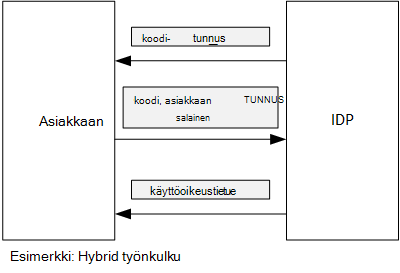

<properties
   pageTitle="Access-tunnusten saaminen Azure AD asiakkaan vahvistus avulla | Microsoft Azure"
   description="Miten access tunnusten saaminen Azure AD asiakkaan vahvistus avulla."
   services=""
   documentationCenter="na"
   authors="MikeWasson"
   manager="roshar"
   editor=""
   tags=""/>

<tags
   ms.service="guidance"
   ms.devlang="dotnet"
   ms.topic="article"
   ms.tgt_pltfrm="na"
   ms.workload="na"
   ms.date="05/23/2016"
   ms.author="mwasson"/>

# <a name="using-client-assertion-to-get-access-tokens-from-azure-ad"></a>Access-tunnusten saaminen Azure AD asiakkaan vahvistus avulla

[AZURE.INCLUDE [pnp-header](../../includes/guidance-pnp-header-include.md)]

Tässä artikkelissa on [sarjaan kuuluvan]. On myös valmis [sovelluksen malli] , jonka mukana sarjassa.

## <a name="background"></a>Tausta

Kun käytät luvan koodin vuota tai hybrid työnkulku OpenID yhteyden, asiakkaan vaihtaa access-tunnuksen todennus koodi. Tässä vaiheessa asiakkaalla on todennusta palvelimeen.



Yksi tapa todentaa asiakkaan on käyttää asiakkaan salaisuus. Minkälainen miten [Tailspin kyselyt] [ Surveys] -sovellus on määritetty oletusarvoisesti.

Tässä on esimerkki pyyntö oli asiakaskoneesta-IDP pyytää access-tunnuksen. Huomautus `client_secret` parametria.

```
POST https://login.microsoftonline.com/b9bd2162xxx/oauth2/token HTTP/1.1
Content-Type: application/x-www-form-urlencoded

resource=https://tailspin.onmicrosoft.com/surveys.webapi
  &client_id=87df91dc-63de-4765-8701-b59cc8bd9e11
  &client_secret=i3Bf12Dn...
  &grant_type=authorization_code
  &code=PG8wJG6Y...
```

Toiminta on merkkijono, joten varmista, että ei paljastaa arvo. Paras käytäntö on pitää asiakkaan toiminta ja tietolähteen ohjausobjektin ulos. Kun otat käyttöön Azure-tallentaa toiminta [asetus][configure-web-app].

Kuka tahansa Azure-tilaukseen voi kuitenkin tarkastella app-asetukset. Lisäksi on aina temptation, valitse tietoja (esimerkiksi-käyttöönoton komentosarjojen) ja tietolähteen ohjausobjektin, jakaa tiedostoja sähköpostitse ja niin edelleen.

Lisäsuojauksen voit käyttää [asiakkaan vahvistus] asiakkaan salaisuus sijaan. Asiakkaan vahvistus ja asiakas käyttää todistaa suojaustunnuksen pyynnön peräisin asiakkaan X.509-varmenne. Asiakkaan varmenne on asennettu verkkopalvelin. Yleensä se on helpompi käytön rajoittaminen varmenteen kuin varmistaa, että kukaan ei vahingossa paljastaa asiakkaan salaisuus. Katso lisätietoja määrittämisestä varmenteet online-sovelluksessa [Käyttämällä varmenteet Azure sivustot-sovelluksissa][using-certs-in-websites]

Näin käyttämällä asiakkaan vahvistus suojaustunnuksen pyyntö:

```
POST https://login.microsoftonline.com/b9bd2162xxx/oauth2/token HTTP/1.1
Content-Type: application/x-www-form-urlencoded

resource=https://tailspin.onmicrosoft.com/surveys.webapi
  &client_id=87df91dc-63de-4765-8701-b59cc8bd9e11
  &client_assertion_type=urn:ietf:params:oauth:client-assertion-type:jwt-bearer
  &client_assertion=eyJhbGci...
  &grant_type=authorization_code
  &code= PG8wJG6Y...
```

Huomaa, `client_secret` parametria ei ole enää käytössä. Sen sijaan `client_assertion` parametri sisältää JWT-tunnuksen, joka on allekirjoitettu asiakkaan varmenne. `client_assertion_type` Parametri ilmaisee vahvistus tyypin &mdash; -tässä tapauksessa JWT-tunnuksen. Palvelin vahvistaa JWT-tunnuksen. Jos JWT tunnus on virheellinen, suojaustunnuksen pyynnön palauttaa virheen.

> [AZURE.NOTE] X.509 varmenteet eivät ole asiakkaan vahvistus; vain lomake Olemme keskitytään se tähän koska Azure AD tukee sitä.

## <a name="using-client-assertion-in-the-surveys-application"></a>Asiakkaan vahvistus käyttäminen kyselyt-sovellus

Tässä osassa näytetään, miten voit määrittää Tailspin kyselyt-sovelluksen käyttämään asiakkaan vahvistus. Nämä vaiheet Luo itse allekirjoitettua varmennetta, joka sopii kehitystä, mutta ei tuotannon käytettäväksi.

1. Suorita PowerShell-komentosarjaa [/Scripts/Setup-KeyVault.ps1] [ Setup-KeyVault] seuraavasti:

    ```
    .\Setup-KeyVault.ps -Subject [subject]
    ```

    Saat `Subject` parametri, Anna nimi, esimerkiksi "surveysapp". Komentosarja luo itse allekirjoitetun varmenteen ja tallentaa sen "nykyisen käyttäjän/oma" varmenteen Storessa.

2. Komentosarjan tulos on JSON-osa. Lisää tämä WWW-sovelluksen sovellusluettelo seuraavasti:

    1. Lokitiedoston [Azure hallinta-portaalin] [ azure-management-portal] ja siirry Azure AD-kansio.

    2. Valitse **sovellukset**.

    3. Valitse Kyselyt-sovellus.

    4.  Valitse **Luettelon hallinta** ja valitse **Lataa luettelon**.

    5.  Avaa luettelo JSON-tiedostoa tekstieditorissa. Liitä komentosarja tulosteen `keyCredentials` ominaisuus. Pitäisi näyttää seuraavankaltaiselta:

        ```    
        "keyCredentials": [
            {
              "type": "AsymmetricX509Cert",
              "usage": "Verify",
              "keyId": "29d4f7db-0539-455e-b708-....",
              "customKeyIdentifier": "ZEPpP/+KJe2fVDBNaPNOTDoJMac=",
              "value": "MIIDAjCCAeqgAwIBAgIQFxeRiU59eL.....
            }
          ],
         ```

    6.  Tallenna tekemäsi muutokset JSON-tiedostoon.

    7.  Siirry portaalin. Valitse **Hallitse luettelon** > **Luettelon lataaminen** ja latauksen JSON-tiedosto.

3. Suorita seuraava komento hankkiminen varmenteen allekirjoitus.

    ```
    certutil -store -user my [subject]
    ```

    Jos `[subject]` on arvo, jonka olet määrittänyt aiheen PowerShell-komentosarjaa. Allekirjoitus näkyy kohdassa "Varmenteen Hash(sha1)". Poista välilyönnit heksadesimaaliluvun lukujen väliltä.

4. Päivitä sovellus-tietoja. Napsauta ratkaisunhallinnassa Tailspin.Surveys.Web projektin hiiren kakkospainikkeella ja valitse **Hallitse käyttäjän tietoja**. Lisää merkintä "Asymmetric", "AzureAd"-kohdan alla kuvatulla tavalla:

    ```
    {
      "AzureAd": {
        "ClientId": "[Surveys application client ID]",
        // "ClientSecret": "[client secret]",  << Delete this entry
        "PostLogoutRedirectUri": "https://localhost:44300/",
        "WebApiResourceId": "[App ID URI of your Survey.WebAPI application]",
        // new:
        "Asymmetric": {
          "CertificateThumbprint": "[certificate thumbprint]",  // Example: "105b2ff3bc842c53582661716db1b7cdc6b43ec9"
          "StoreName": "My",
          "StoreLocation": "CurrentUser",
          "ValidationRequired": "false"
        }
      },
      "Redis": {
        "Configuration": "[Redis connection string]"
      }
    }
    ```

    Sinun on määritettävä `ValidationRequired` , EPÄTOSI, koska varmennetta ei ole pääkansion Varmenteiden myöntäjä allekirjoittanut. Tuotannon, käytä varmennetta, joka on allekirjoittanut Varmenteiden myöntäjä ja määritä `ValidationRequired` tosi.

    Myös poistaa merkinnän `ClientSecret`, koska sitä ei tarvita asiakkaan vahvistus.

5. Etsi Startup.cs-tunnus, jolla Rekisteröi `ICredentialService`. Kommentointi viiva, joka käyttää `CertificateCredentialService`- ja viiva, joka käyttää ulos kommentti `ClientCredentialService`:

    ```csharp
    // Uncomment this:
    services.AddSingleton<ICredentialService, CertificateCredentialService>();
    // Comment out this:
    //services.AddSingleton<ICredentialService, ClientCredentialService>();
    ```

Web-sovelluksen lukee suorituksen aikana varmenteen säilöstä. Varmenne on oltava asennettuna samaan tietokoneeseen kuin web app.

## <a name="next-steps"></a>Seuraavat vaiheet

- Tutustu seuraavaan artikkeliin sarjassa: [Käyttämällä Azure avaimen säilö sovelluksen tietoja suojaaminen][key vault]


<!-- Links -->
[configure-web-app]: ../app-service-web/web-sites-configure.md
[azure-management-portal]: https://manage.windowsazure.com
[asiakkaan vahvistus]: https://tools.ietf.org/html/rfc7521
[key vault]: guidance-multitenant-identity-keyvault.md
[Setup-KeyVault]: https://github.com/Azure-Samples/guidance-identity-management-for-multitenant-apps/blob/master/scripts/Setup-KeyVault.ps1
[Surveys]: guidance-multitenant-identity-tailspin.md
[using-certs-in-websites]: https://azure.microsoft.com/blog/using-certificates-in-azure-websites-applications/
[sarjaan kuuluvan]: guidance-multitenant-identity.md
[sovelluksen malli]: https://github.com/Azure-Samples/guidance-identity-management-for-multitenant-apps
