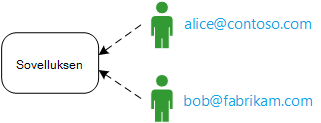
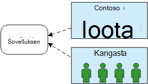
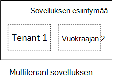
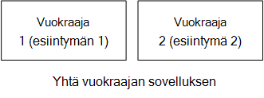
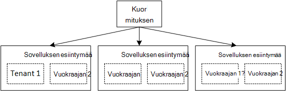

<properties
   pageTitle="Tunnistetietojen hallinta multitenant sovellusten | Microsoft Azure"
   description="Johdanto multitenant sovelluksissa jäsenyyksien hallinta"
   services=""
   documentationCenter="na"
   authors="MikeWasson"
   manager="roshar"
   editor=""
   tags=""/>

<tags
   ms.service="guidance"
   ms.devlang="dotnet"
   ms.topic="article"
   ms.tgt_pltfrm="na"
   ms.workload="na"
   ms.date="06/02/2016"
   ms.author="mwasson"/>

# Johdanto Microsoft Azure multitenant sovelluksille jäsenyyksien hallinta

[AZURE.INCLUDE [pnp-header](../../includes/guidance-pnp-header-include.md)]

Tässä artikkelissa on [sarjaan kuuluvan]. On myös valmis [sovelluksen malli] , jonka mukana sarjassa.

Oletetaan, että kirjoitat yrityksen SaaS sovelluksen isännöidään pilveen. Sovellus on tietenkin käyttäjät:

Mutta nämä käyttäjät kuuluvat organisaatioille:

Esimerkki: Tailspin myy tilaukset SaaS sovelluksessaan. Contoson ja Fabrikam hankkia sovelluksen. Kun Anneli (`alice@contoso`)-merkit-sovellus tulee tietää, että Anneli kuuluu Contoso.

- Contoso-tietojen käytön Anneli _pitäisi_ olla.
- Anneli _ei pitäisi_ olla Fabrikam tietojen käytön.

Nämä ohjeet kerrotaan, kuinka voit hallita käyttäjätietojen multitenant sovelluksessa [Azure Active Directoryn] avulla[ AzureAD] (Azure AD) käsittelemään Kirjaudu sisään- ja todennusta.

## Mikä on multitenancy?

_Vuokraajan_ on käyttäjäryhmälle. Vuokraajan on tilaaja tai asiakkaan sovelluksen SaaS-sovelluksessa. _Multitenancy_ on jossa useita alihallinnat jakaa sovelluksen samassa esiintymässä fyysinen arkkitehtuuri. Vaikka alihallinnat jakaa fyysinen resurssit (esimerkiksi VMs tai tallennustilan), jokaisen vuokraajan saa omassa sovelluksen looginen esiintymä.

Yleensä sovelluksen tiedot jaetaan palvelutili sisällä, mutta ei muiden omistajien käyttäjien keskuudessa.

Vertaa tätä arkkitehtuuri ja yksi vuokraajan arkkitehtuuri kunkin vuokraajan, joiden on erillinen fyysinen esiintymä. Yhden vuokraajan-arkkitehtuuri alihallinnat lisäämällä pyörivä uuden sovelluksen esiintymää ylöspäin.

### Vaaka- ja multitenancy skaalaus

Saavuttamiseksi asteikko pilveen on yhteinen yhteen enemmän fyysistä. Tätä kutsutaan _skaalauksen vaakasuunnassa_ tai _laajentaminen_. Harkitse verkkosovellukseen. Käsittelemään enemmän liikennettä voit lisätä Lisää palvelimen VMs ja tallennettava kuormituksen tasauspalvelun takana. Kunkin AM suorittaa erillisen fyysinen esiintymän web Appissa.

Pyyntö voidaan reitittää minkä tahansa esiintymä. Järjestelmä toimii yhdessä yhden loogisen esiintymän. Voit tear alaspäin AM tai asettamasi uuden AM vaikuttamatta käyttäjiin. Tämä arkkitehtuuri fyysinen jokaiselle esiintymälle on usean vuokraajan ja lisäämällä esiintymiä skaalata. Jos yhden esiintymän, se kannattaa vaikuta minkä tahansa vuokraajan.

## Käyttäjätietojen multitenant-sovelluksessa

Multitenant-sovellukseen Ota huomioon käyttäjien alihallinnat kontekstissa.

**Todennus**

- Käyttäjien kirjautua sovellus organisaation tunnistetietoja käyttäen. Niitä ei tarvitse luoda uuden sovelluksen käyttäjäprofiilit.
- Samassa organisaatiossa käyttäjät ovat samassa alihallinnassa osa.
- Käyttäjän kirjautuessa sisään sovelluksen tietää, mitkä vuokraajan käyttäjä kuuluu.

**Todennus**

- Kun sallimisesta käyttäjän toiminnot (Yammer-tarkasteleminen resurssin)-sovellus on otettava huomioon käyttäjän vuokraajan.
- Käyttäjä voi määrittää roolit-sovelluksessa, kuten "Järjestelmänvalvoja" tai "Peruskäyttäjän". Roolimäärityksiä hallinnoi asiakkaan SaaS tarjoajan mukaan.

**Esimerkki.** Anneli, työntekijän Contoson, siirtyy sovelluksen hänen selaimessa ja napsauttaa "Kirjaudu sisään"-painiketta. Hän ohjataan kirjautumisnäyttö, jossa hän lisää oman yrityksen tunnistetiedot (käyttäjänimi ja salasana). Tässä vaiheessa hän on kirjautunut sovelluksen `alice@contoso.com`. Sovelluksen tietää myös, että Anneli on tämän sovelluksen Järjestelmänvalvojakäyttäjä. Koska hän on järjestelmänvalvoja, hän näkee kaikki resurssit, jotka kuuluvat Contoso luettelo. Hän voi tarkastella Fabrikam on resursseja, koska hän on vain sisällä hänen vuokraajan järjestelmänvalvoja.

Nämä ohjeet-tarkastellaan erityisesti Azure AD käytön tunnistetietojen hallinta.

- Oletetaan asiakkaan tallentaa niiden käyttäjäprofiilien Azure AD (mukaan lukien Office 365- ja Dynamics CRM alihallinnat)
- Asiakkaiden kanssa paikallinen Active Directory (AD) voit käyttää [Azure AD Connect] [ ADConnect] synkronoimaan niiden paikallinen AD Azure AD kanssa.

Jos asiakas, jolla on paikallinen AD ei voi käyttää Azure AD Connect (vuoksi yrityksen IT-käytäntö tai muista syistä), tarjoaja voi järjestäjäorganisaatiota asiakkaan kanssa SaaS on AD Active Directory Federation Services (AD FS) kautta. Tämä asetus on kuvattu [asiakkaan AD FS Federating].

Nämä ohjeet ei myöskään muita ominaisuuksia multitenancy, kuten tietojen jakaminen, vuokraajan määritys ja niin edelleen.

## Seuraavat vaiheet

- Tutustu seuraavaan artikkeliin sarjassa: [tietoja Tailspin kyselyt-sovellus][tailpin]

<!-- Links -->
[ADConnect]: ../active-directory/active-directory-aadconnect.md
[AzureAD]: https://azure.microsoft.com/documentation/services/active-directory/
[sarjaan kuuluvan]: guidance-multitenant-identity.md
[Asiakkaan AD FS sisällytetyistä]: guidance-multitenant-identity-adfs.md
[sovelluksen malli]: https://github.com/Azure-Samples/guidance-identity-management-for-multitenant-apps
[tailpin]: guidance-multitenant-identity-tailspin.md
