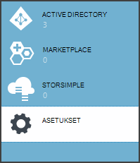
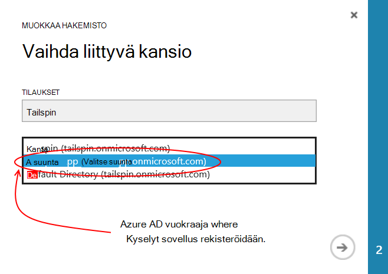
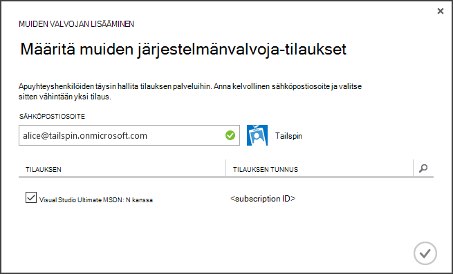
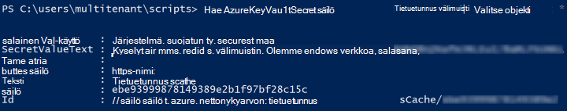

<properties
   pageTitle="Avaimen säilö avulla voit suojata sovelluksen tietoja | Microsoft Azure"
   description="Miten käyttää avainta säilö palvelua tallentaa sovelluksen tietoja"
   services=""
   documentationCenter="na"
   authors="MikeWasson"
   manager="roshar"
   editor=""
   tags=""/>

<tags
   ms.service="guidance"
   ms.devlang="dotnet"
   ms.topic="article"
   ms.tgt_pltfrm="na"
   ms.workload="na"
   ms.date="02/16/2016"
   ms.author="mwasson"/>

# <a name="using-azure-key-vault-to-protect-application-secrets"></a>Suojaa sovelluksen tietoja Azure avaimen säilö avulla

[AZURE.INCLUDE [pnp-header](../../includes/guidance-pnp-header-include.md)]

Tässä artikkelissa on [sarjaan kuuluvan]. On myös valmis [sovelluksen malli] , jonka mukana sarjassa.

## <a name="overview"></a>Yleiskatsaus

On yhteinen on sovellusasetuksia, joka on merkitsevä ja suojattava, kuten:

- Tietokannan yhteyden merkkijonoja
- Salasanat
- Salausavaimet

Suojauksen käytäntönä pitäisi koskaan tallentaa näitä tietoja tietolähteen ohjausobjektin. Se on liian helppo paljastaa &mdash; vaikka lähde-koodin säilö on yksityinen. Ja se on ei lähes pitäminen tietoja yleisestä julkinen. Suurempi projekteissa haluat ehkä rajoittaa mitä kehittäjät ja operaattorit voivat käyttää tuotannon tietoja. (Testauksen tai kehityksen ympäristössä asetukset ovat eri.)

Turvallisempi vaihtoehto kannattaa tallentaa näitä tietoja [Azure avain]säilöön[KeyVault]. Avaimen säilö on cloud isännöimä palvelu salausavaimet ja muita tietoja hallintaa. Tässä artikkelissa kerrotaan, miten avaimen säilö avulla voit tallentaa voit sovelluksen asetukset.

[Tailspin kyselyt] [ Surveys] -sovelluksessa, seuraavat asetukset ovat salainen:

- Tietokannan yhteysmerkkijono.
- Redis.txt yhteysmerkkijono.
- Asiakkaan salainen web-sovelluksen.

Tallentamiseen määritysten tietoja avain säilöön, kyselyt-sovelluksen toteuttaa Mukautettu määritys-palvelu, joka yhdistää ASP.NET Core 1.0 [järjestelmän kokoonpano][configuration]. Mukautetun palvelun lukee määritysasetukset avain säilöstä käynnistyksen yhteydessä.

Kyselyt-sovelluksen Lataa asetukset seuraavista paikoista:

- Appsettings.json-tiedosto
- [Käyttäjän tietoja tallentaa] [ user-secrets] (kehitysympäristö vain; testaamiseen)
- Isännöintipalvelu ympäristössä (sovelluksen asetukset Azure verkkosovelluksissa)
- Avaimen säilö

Kaikkien näiden ohittaa edelliseen, jotta avain säilöön tallennetut asetukset ohittavat.

> [AZURE.NOTE] Oletusarvon mukaan avaimen säilö configuration-palvelu on poistettu käytöstä. Sitä ei tarvita suorittamisen sovelluksen paikallisesti. Ottaa sen käyttöön tuotannon käyttöönoton.

> Avaimen säilöön-palvelu ei tällä hetkellä tueta .NET sisäosat, koska se edellyttäisi [Microsoft.Azure.KeyVault] [ Microsoft.Azure.KeyVault] paketti.

Käynnistyksen yhteydessä sovellus lukee asetukset rekisteröity määritysten jokaisen tarjoajalta ja käyttää niitä täytä erittäin kirjoitetun asetukset-objekti. (Lisätietoja on kohdassa [avulla asetukset ja määritykset objektien][options].)

## <a name="implementation"></a>Käyttöönotto

[KeyVaultConfigurationProvider] [ KeyVaultConfigurationProvider] luokka on määritys-palvelun, joka kytketään ASP.NET Core 1.0 [järjestelmän kokoonpano][configuration].

Käyttämään `KeyVaultConfigurationProvider`, soita `AddKeyVaultSecrets` käynnistys-luokan tunniste menetelmää:

```csharp
    var builder = new ConfigurationBuilder()
        .SetBasePath(appEnv.ApplicationBasePath)
        .AddJsonFile("appsettings.json");

    if (env.IsDevelopment())
    {
        builder.AddUserSecrets();
    }
    builder.AddEnvironmentVariables();
    var config = builder.Build();

    // Add key vault configuration:
    builder.AddKeyVaultSecrets(config["AzureAd:ClientId"],
        config["KeyVault:Name"],
        config["AzureAd:Asymmetric:CertificateThumbprint"],
        Convert.ToBoolean(config["AzureAd:Asymmetric:ValidationRequired"]),
        loggerFactory);
```

Huomaa, että `KeyVaultConfigurationProvider` edellyttää, että jotkin määritykset, jotka on tallennettu jossakin määritysten muista lähteistä.

Kun sovellus käynnistyy- `KeyVaultConfigurationProvider` Luetteloi kaikki avaimen säilöön tietoja. Kunkin salaisuus, se hakee nimeltä "ConfigKey" tunnisteen. Tunnisteen arvo on nimi, määritys-asetusta.

> [AZURE.NOTE] [Tunnisteiden] [ key-tags] on valinnainen avaimella metatietoihin. Tunnisteita käytetään tässä, koska nimet eivät saa sisältää kaksoispiste (:)-merkit.

```csharp
var kvClient = new KeyVaultClient(GetTokenAsync);
var secretsResponseList = await kvClient.GetSecretsAsync(_vault, MaxSecrets, token);
foreach (var secretItem in secretsResponseList.Value)
{
    //The actual config key is stored in a tag with the Key "ConfigKey"
    // because ':' is not supported in a shared secret name by Key Vault.
    if (secretItem.Tags != null && secretItem.Tags.ContainsKey(ConfigKey))
    {
        var secret = await kvClient.GetSecretAsync(secretItem.Id, token);
        Data.Add(secret.Tags[ConfigKey], secret.Value);
    }
}
```

> [AZURE.NOTE] Katso [KeyVaultConfigurationProvider.cs].

## <a name="setting-up-key-vault-in-the-surveys-app"></a>Avaimen säilö määrittäminen kyselyt-sovelluksessa

Edellytykset:

- Asenna [Azure resurssien hallinnan cmdlet-komentojen][azure-rm-cmdlets].
- Määritä kyselyt-sovelluksen kuvatulla tavalla [Kyselyt-sovelluksen suorittaminen][readme].

Ylätason vaiheita:

1. Määritä vuokraajan järjestelmänvalvoja-käyttäjän.
2. Määritä asiakasvarmenne.
3. Luo avaimen säilö.
4. Lisää asetuksia avaimen säilö.
5. Kommentointi koodi, joka mahdollistaa avaimen säilö.
6. Päivitä sovelluksen käyttäjän tietoja.

### <a name="set-up-an-admin-user"></a>Järjestelmänvalvojana määrittäminen

> [AZURE.NOTE] Voit luoda avaimen säilöön, sinun on käytettävä tili, jolle voit hallita Azure tilauksen. Lisäksi sovellus, jossa voit lukea avaimen säilöstä sallivat on rekisteröity samassa alihallinnassa kyseisen tilin nimellä.

Tässä vaiheessa voit varmistaa, että voit luoda avaimen säilö, kun kirjautunut sisään käyttäjänä vuokraajasta missä kyselyt-sovellus on rekisteröity.

Vaihda ensin Azure-tilaukseen liittyvää kansio.

1. Kirjaudu sisään [Azure hallinta-portaalissa][azure-management-portal]

2. Valitse **asetukset**.

    

3. Valitse Azure tilauksen.

4. Valitse **Muokkaa Directory** portaalin alareunassa.

    

5. Valitse "Vaihda liittyvä kansio"-kohtaa, johon kyselyt-sovellus rekisteröidään, Azure AD-vuokraajan

    

6. Napsauta nuolipainiketta ja suorita valintaikkuna.

Missä kyselyt-sovellus on rekisteröity Azure AD-vuokraajan järjestelmänvalvoja käyttäjän luominen

1. Lokitiedoston [Azure hallinta-portaalin][azure-management-portal].

2. Valitse Azure AD-vuokraajan, jossa sovellus on rekisteröity.

3. Valitse **käyttäjät** > **Lisää käyttäjä**.

4. Valitse **Lisää käyttäjä** -valintaikkunassa määrittää käyttäjän yleisen järjestelmänvalvojan roolilla.

Järjestelmänvalvoja-käyttäjän lisääminen Azure tilauksen kanssasi järjestelmänvalvojana.

1. Lokitiedoston [Azure hallinta-portaalin][azure-management-portal].

2. Valitse **asetukset** ja valitse Azure tilauksen.

3. Valitse **Järjestelmänvalvojat**

4. Valitse **Lisää** portaalin alareunassa.

5. Kirjoita Järjestelmänvalvojakäyttäjä, jonka loit aiemmin sähköpostin.

6. Valitse tilaus-valintaruutu.

7. Viimeistele valintaikkuna valitsemalla valintamerkki.




### <a name="set-up-a-client-certificate"></a>Asiakasvarmenne määrittäminen

1. Suorita PowerShell-komentosarjaa [/Scripts/Setup-KeyVault.ps1] [ Setup-KeyVault] seuraavasti:
    ```
    .\Setup-KeyVault.ps1 -Subject <<subject>>
    ```
    Saat `Subject` parametri, Anna nimi, esimerkiksi "surveysapp". Komentosarja luo itse allekirjoitetun varmenteen ja tallentaa sen "nykyisen käyttäjän/oma" varmenteen Storessa.

2. Komentosarjan tulos on JSON-osa. Lisää tämä WWW-sovelluksen sovellusluettelo seuraavasti:

    1. Lokitiedoston [Azure hallinta-portaalin] [ azure-management-portal] ja siirry Azure AD-kansio.

    2. Valitse **sovellukset**.

    3. Valitse Kyselyt-sovellus.

    4.  Valitse **Luettelon hallinta** ja valitse **Lataa luettelon**.

    5.  Avaa luettelo JSON-tiedostoa tekstieditorissa. Liitä komentosarja tulosteen `keyCredentials` ominaisuus. Pitäisi näyttää seuraavankaltaiselta:
    ```
            "keyCredentials": [
                {
                  "type": "AsymmetricX509Cert",
                  "usage": "Verify",
                  "keyId": "29d4f7db-0539-455e-b708-....",
                  "customKeyIdentifier": "ZEPpP/+KJe2fVDBNaPNOTDoJMac=",
                  "value": "MIIDAjCCAeqgAwIBAgIQFxeRiU59eL.....
                }
              ],
    ```          
    6.  Tallenna tekemäsi muutokset JSON-tiedostoon.

    7.  Siirry portaalin. Valitse **Hallitse luettelon** > **Luettelon lataaminen** ja latauksen JSON-tiedosto.

3. Saman JSON-osan lisääminen sovellusluettelo, verkko-Ohjelmointirajapinnan (Surveys.WebAPI).

4. Suorita seuraava komento hankkiminen varmenteen allekirjoitus.
    ```
    certutil -store -user my [subject]
    ```
    Jos `[subject]` on arvo, jonka olet määrittänyt aiheen PowerShell-komentosarjaa. Allekirjoitus näkyy kohdassa "Varmenteen Hash(sha1)". Poista välilyönnit heksadesimaaliluvun lukujen väliltä.

Voit käyttää allekirjoitus myöhemmin.

### <a name="create-a-key-vault"></a>Luo avaimen säilö

1. Suorita PowerShell-komentosarjaa [/Scripts/Setup-KeyVault.ps1] [ Setup-KeyVault] seuraavasti:

    ```
    .\Setup-KeyVault.ps1 -KeyVaultName <<key vault name>> -ResourceGroupName <<resource group name>> -Location <<location>>
    ```

    Kun pyydetään tunnuksia, kirjaudu Azure AD-käyttäjä, jonka loit aiemmin. Komentosarja luo uusi resurssiryhmä ja uuden avaimen säilö resurssin ryhmään.

    Huomautus: parametrille - sijaintiin voit käyttää seuraavaa PowerShell-komentoa saat luettelon kelvollista alueista:

    ```
    Get-AzureRmResourceProvider -ProviderNamespace "microsoft.keyvault" | Where-Object { $_.ResourceTypes.ResourceTypeName -eq "vaults" } | Select-Object -ExpandProperty Locations
    ```

2. Suorita seuraavat parametrit SetupKeyVault.ps uudelleen:

    ```
    .\Setup-KeyVault.ps1 -KeyVaultName <<key vault name>> -ApplicationIds @("<<web app client ID>>", "<<web API client ID>>")
    ```

    Jos

    - avaimen säilö nimi = avaimen säilö annoit edellisessä vaiheessa.
    - Web-sovelluksen Ostajantunnus = Ostajantunnus kyselyt-web-sovelluksen.
    - Verkko-ohjelmointirajapinnan Ostajantunnus = Surveys.WebAPI-sovelluksen Asiakastunnus.

    Esimerkki:
    ```
    .\Setup-KeyVault.ps1 -KeyVaultName tailspinkv -ApplicationIds @("f84df9d1-91cc-4603-b662-302db51f1031", "8871a4c2-2a23-4650-8b46-0625ff3928a6")
    ```

    > [AZURE.NOTE] Voit avata asiakkaan tunnukset [Azure hallinta-portaalin][azure-management-portal]. Valitse Azure AD-vuokraajan, valitse sovellus ja valitse **Määritä**.

    Tämä komentosarja luvalla web app- ja verkko-Ohjelmointirajapinnan hakea tietoja avaimen säilö. Katso [aloittaminen Azure avaimen säilö] [ authorize-app] lisätietoja.

### <a name="add-configuration-settings-to-your-key-vault"></a>Lisää asetuksia avaimen säilö

1. Suorita SetupKeyVault.ps seuraavasti:

    ```
    .\Setup-KeyVault.ps1 -KeyVaultName <<key vault name> -KeyName RedisCache -KeyValue "<<Redis DNS name>>.redis.cache.windows.net,password=<<Redis access key>>,ssl=true" -ConfigName "Redis:Configuration"
    ```
    Jos

    - avaimen säilö nimi = avaimen säilö annoit edellisessä vaiheessa.
    - DNS-nimen Redis = DNS Redis.txt välimuisti-esiintymän nimi.
    - Pikanäppäin Redis = pikanäppäin Redis.txt välimuisti-esiintymässä.

    Tämä komento lisää salaisuus avaimen säilö. Toiminta perustuu nimi-arvoa pari plus tunnisteen:

    -   Avaimen nimi ei ole käytetty sovelluksen, mutta on oltava yksilöllinen avain säilö.
    -   Arvo on määritysvaihtoehto tässä tapauksessa Redis.txt yhteysmerkkijonon arvo.
    -   "ConfigKey"-tunniste pitää configuration key nimi.

2. Tässä vaiheessa se on hyvä ja testaa, onko tallennettuja tietoja avaimen säilö onnistuneesti. Suorittaa seuraavan PowerShell-komennon:

    ```
    Get-AzureKeyVaultSecret <<key vault name>> RedisCache | Select-Object *
    ```
    Tulos näyttää salainen arvo sekä joitakin metatietoja:

    

3. Suorita SetupKeyVault.ps uudelleen, jos haluat lisätä tietokannan yhteysmerkkijono:

    ```
    .\Setup-KeyVault.ps1 -KeyVaultName <<key vault name> -KeyName ConnectionString -KeyValue <<DB connection string>> -ConfigName "Data:SurveysConnectionString"
    ```

    Jos `<<DB connection string>>` on tietokannan yhteysmerkkijono-arvo.

    Kopioi yhteysmerkkijono testikäyttöön paikallisessa tietokannassa Tailspin.Surveys.Web/appsettings.json-tiedosto. Jos teet näin, varmista, että voit muuttaa kaksinkertainen kenoviiva ('\\\\") siirtäminen yhden kenoviiva. Kaksinkertainen kenoviiva on ohjausmerkkiä JSON-tiedostossa.

    Esimerkki:

    ```
    .\Setup-KeyVault.ps1 -KeyVaultName mykeyvault -KeyName ConnectionString -KeyValue "Server=(localdb)\MSSQLLocalDB;Database=Tailspin.SurveysDB;Trusted_Connection=True;MultipleActiveResultSets=true" -ConfigName "Data:SurveysConnectionString"
    ```

### <a name="uncomment-the-code-that-enables-key-vault"></a>Kommentointi koodi, joka mahdollistaa avaimen säilö

1. Avaa Tailspin.Surveys-ratkaisun.

2. Valitse [Tailspin.Surveys.Web/Startup.cs][web-startup], Etsi seuraava koodilohko ja kommentointi sitä.

    ```csharp
    //#if DNX451
    //            _configuration = builder.Build();
    //            builder.AddKeyVaultSecrets(_configuration["AzureAd:ClientId"],
    //                _configuration["KeyVault:Name"],
    //                _configuration["AzureAd:Asymmetric:CertificateThumbprint"],
    //                Convert.ToBoolean(_configuration["AzureAd:Asymmetric:ValidationRequired"]),
    //                loggerFactory);
    //#endif
    ```

3. Valitse [Tailspin.Surveys.WebAPI/Startup.cs][web-api-startup], Etsi seuraava koodilohko ja kommentointi sitä.

    ```csharp
    //#if DNX451
    //            var config = builder.Build();
    //            builder.AddKeyVaultSecrets(config["AzureAd:ClientId"],
    //                config["KeyVault:Name"],
    //                config["AzureAd:Asymmetric:CertificateThumbprint"],
    //                Convert.ToBoolean(config["AzureAd:Asymmetric:ValidationRequired"]),
    //                loggerFactory);
    //#endif
    ```

4. Valitse [Tailspin.Surveys.Web/Startup.cs][web-startup], Etsi tunnus, jolla Rekisteröi `ICredentialService`. Kommentointi viiva, joka käyttää `CertificateCredentialService`- ja viiva, joka käyttää ulos kommentti `ClientCredentialService`:

    ```csharp
    // Uncomment this:
    services.AddSingleton<ICredentialService, CertificateCredentialService>();
    // Comment out this:
    //services.AddSingleton<ICredentialService, ClientCredentialService>();
    ```

    Tämä muutos mahdollistaa web Appissa, jos haluat käyttää [asiakkaan vahvistus] [ client-assertion] saat OAuth access tunnukset. Asiakkaan vahvistus sinun ei tarvitse OAuth-asiakasohjelman salaisuus. Voit myös tallentaa asiakkaan salaisuus avaimen säilöön. Kuitenkin avaimen säilö ja asiakkaan vahvistus molemmat käytetään asiakkaan varmenne, joten jos otat avaimen säilö, kannattaa ottaa käyttöön myös asiakkaan vahvistus.

### <a name="update-the-user-secrets"></a>Päivitä käyttäjän tietoja

Napsauta ratkaisunhallinnassa Tailspin.Surveys.Web projektin hiiren kakkospainikkeella ja valitse **Hallitse käyttäjän tietoja**. Secrets.json-tiedostossa Poista aiemmin JSON ja liitä seuraavasti:

    ```
    {
      "AzureAd": {
        "ClientId": "[Surveys web app client ID]",
        "PostLogoutRedirectUri": "https://localhost:44300/",
        "WebApiResourceId": "[App ID URI of your Surveys.WebAPI application]",
        "Asymmetric": {
          "CertificateThumbprint": "[certificate thumbprint. Example: 105b2ff3bc842c53582661716db1b7cdc6b43ec9]",
          "StoreName": "My",
          "StoreLocation": "CurrentUser",
          "ValidationRequired": "false"
        }
      },
      "KeyVault": {
        "Name": "[key vault name]"
      }
    }
    ```

Korvaa [hakasulkeisiin] merkinnät oikeat arvot.

- `AzureAd:ClientId`Kyselyt-sovelluksen: Asiakastunnus.
- `AzureAd:WebApiResourceId`:-Sovelluksen tunnus URI, että olet määrittänyt Azure AD Surveys.WebAPI sovelluksen luotaessa.
- `Asymmetric:CertificateThumbprint`:-Varmenteen allekirjoitusta, jotka olet saanut mainittiin, kun loit Asiakasvarmenne.
- `KeyVault:Name`: Avaimen säilö nimi.

> [AZURE.NOTE] `Asymmetric:ValidationRequired`on EPÄTOSI koska sertifikaatti, jonka loit aiemmin ei ole allekirjoittanut pääkansion varmenteen myöntäjä (CA). Tuotannon, käytä varmennetta, joka on allekirjoitettu päämyöntäjä ja määritä `ValidationRequired` tosi.

Tallenna tiedosto päivitetty secrets.json.

Seuraavaksi Solution Explorerissa Tailspin.Surveys.WebApi projektin hiiren kakkospainikkeella ja valitse **Hallitse käyttäjän tietoja**. Poista aiemmin JSON ja liitä seuraavasti:

```
{
  "AzureAd": {
    "ClientId": "[Surveys.WebAPI client ID]",
    "WebApiResourceId": "https://tailspin5.onmicrosoft.com/surveys.webapi",
    "Asymmetric": {
      "CertificateThumbprint": "[certificate thumbprint]",
      "StoreName": "My",
      "StoreLocation": "CurrentUser",
      "ValidationRequired": "false"
    }
  },
  "KeyVault": {
    "Name": "[key vault name]"
  }
}
```

Korvaa [hakasulkeisiin] merkinnät ja tallenna se secrets.json.

> [AZURE.NOTE] Verkko-Ohjelmointirajapinnan, varmista, että Asiakastunnus käytettävät Surveys.WebAPI-sovellus ei tutkimukset-sovellus.


<!-- Links -->
[authorize-app]: ../key-vault/key-vault-get-started.md/#authorize
[azure-management-portal]: https://manage.windowsazure.com/
[azure-rm-cmdlets]: https://msdn.microsoft.com/library/mt125356.aspx
[client-assertion]: guidance-multitenant-identity-client-assertion.md
[configuration]: https://docs.asp.net/en/latest/fundamentals/configuration.html
[KeyVault]: https://azure.microsoft.com/services/key-vault/
[KeyVaultConfigurationProvider]: https://github.com/Azure-Samples/guidance-identity-management-for-multitenant-apps/blob/master/src/Tailspin.Surveys.Configuration.KeyVault/KeyVaultConfigurationProvider.cs
[key-tags]: https://msdn.microsoft.com/library/azure/dn903623.aspx#BKMK_Keytags
[Microsoft.Azure.KeyVault]: https://www.nuget.org/packages/Microsoft.Azure.KeyVault/
[options]: https://docs.asp.net/en/latest/fundamentals/configuration.html#using-options-and-configuration-objects
[readme]: https://github.com/Azure-Samples/guidance-identity-management-for-multitenant-apps/blob/master/docs/running-the-app.md
[Setup-KeyVault]: https://github.com/Azure-Samples/guidance-identity-management-for-multitenant-apps/blob/master/scripts/Setup-KeyVault.ps1
[Surveys]: guidance-multitenant-identity-tailspin.md
[user-secrets]: http://go.microsoft.com/fwlink/?LinkID=532709
[web-startup]: https://github.com/Azure-Samples/guidance-identity-management-for-multitenant-apps/blob/master/src/Tailspin.Surveys.Web/Startup.cs
[web-api-startup]: https://github.com/Azure-Samples/guidance-identity-management-for-multitenant-apps/blob/master/src/Tailspin.Surveys.WebAPI/Startup.cs
[sarjaan kuuluvan]: guidance-multitenant-identity.md
[KeyVaultConfigurationProvider.cs]: https://github.com/Azure-Samples/guidance-identity-management-for-multitenant-apps/blob/master/src/Tailspin.Surveys.Configuration.KeyVault/KeyVaultConfigurationProvider.cs
[sovelluksen malli]: https://github.com/Azure-Samples/guidance-identity-management-for-multitenant-apps
