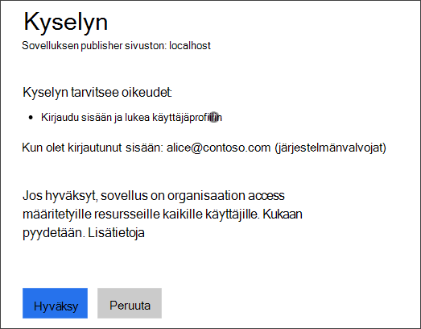
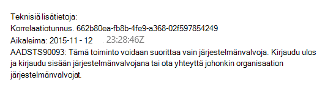
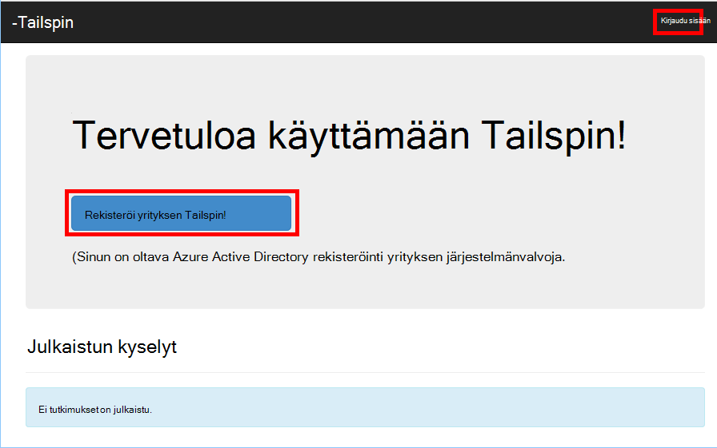
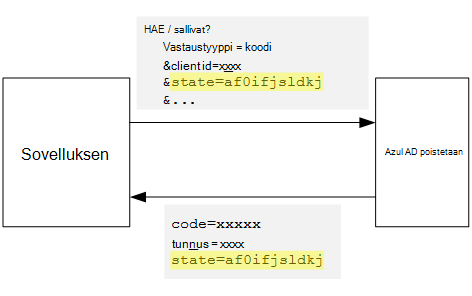
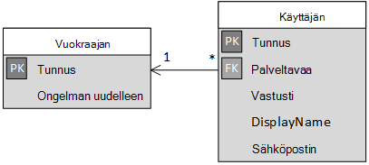

<properties
   pageTitle="Kirjautuminen ja vuokraaja onboarding multitenant sovelluksissa | Microsoft Azure"
   description="Miten määrän vuokraajiin multitenant-sovelluksessa"
   services=""
   documentationCenter="na"
   authors="MikeWasson"
   manager="roshar"
   editor=""
   tags=""/>

<tags
   ms.service="guidance"
   ms.devlang="dotnet"
   ms.topic="article"
   ms.tgt_pltfrm="na"
   ms.workload="na"
   ms.date="05/23/2016"
   ms.author="mwasson"/>

# <a name="sign-up-and-tenant-onboarding-in-a-multitenant-application"></a>Kirjautuminen ja vuokraaja onboarding multitenant-sovelluksessa

[AZURE.INCLUDE [pnp-header](../../includes/guidance-pnp-header-include.md)]

Tässä artikkelissa on [sarjaan kuuluvan]. On myös valmis [sovelluksen malli] , jonka mukana sarjassa.

Tässä artikkelissa kuvataan ottamisesta käyttöön _kirjautumisen_ Käsittele usean vuokraajan-sovellusta, joka sallii asiakkaan organisaation sovelluksen rekisteröintiä.
On useita syitä Toteuta rekisteröintiprosessi loppuun:

-   Salli AD-järjestelmänvalvoja, jos haluat suostumus asiakkaan koko organisaation sovelluksen käyttöä varten.
-   Kerää luottokorttimaksun tai muita asiakastiedot.
-   Voit suorittaa minkä tahansa sovelluksen tarvitsemia erikseen vuokraajan kohden-asetukset.

## <a name="admin-consent-and-azure-ad-permissions"></a>Järjestelmänvalvojan suostumus ja Azure AD-käyttöoikeudet

Jotta todentamismenetelmä Azure AD-sovelluksen sen käyttäjän kansion käyttöoikeudet. Sovellus on vähintään lukuoikeudet käyttäjän profiiliin. Kun käyttäjä kirjautuu ensimmäisen kerran Azure AD näyttää suostumusta-sivu, jossa näkyy sinulta pyydetään käyttöoikeudet. Valitsemalla **Hyväksy**käyttäjän antaa oikeudet-sovellukseen.

Oletusarvon mukaan suostumusta myönnetään käyttäjäkohtainen välein. Jokaisen sisään kirjautuva käyttäjä näkee hyväksymissivulla. Azure AD tukee kuitenkin myös _järjestelmänvalvojan suostumus_, joka mahdollistaa organisaation AD-järjestelmänvalvoja, jotta voit hyväksyminen.

Järjestelmänvalvojan hyväksyntä-työnkulku käytettäessä hyväksymissivulla ilmoittaa, että AD-järjestelmänvalvoja on koko vuokraajakohteen puolesta käyttöoikeuksien myöntäminen:



Kun järjestelmänvalvoja valitsee **Hyväksy**, sisällä samassa alihallinnassa muut käyttäjät voivat kirjautua sisään ja Azure AD ohittaa suostumusta näytön.

Vain AD-järjestelmänvalvoja voi antaa järjestelmänvalvojan suostumus, koska se antaa oikeudet koko organisaation puolesta. Jos muut kuin järjestelmänvalvojat yrittää todentamismenetelmä järjestelmänvalvojan hyväksyntä-työnkulku, Azure AD näyttää virheen:



Jos sovellus edellyttää lisäoikeuksia myöhemmin, asiakkaan on päivitetty käyttöoikeudet suostuu ja kirjaudu uudelleen.  

## <a name="implementing-tenant-sign-up"></a>Yksityiskohtaiset vuokraajan kirjautuminen

[Tailspin kyselyt] [ Tailspin] sovelluksesta, määritimme rekisteröintiprosessi loppuun useita vaatimukset:

-   Palvelutili on tilaa, ennen kuin käyttäjät voivat kirjautua sisään.
-   Kirjautuminen käyttää järjestelmänvalvojan hyväksyntä-työnkulku.
-   Kirjautuminen Lisää käyttäjän vuokraajan sovellustietokanta.
-   Kun palvelutili Rekisteröi-sovellus näyttää onboarding-sivun.

Tässä osassa Käymme tässä läpi Microsoftin soveltaminen rekisteröintiprosessi loppuun.
On tärkeää ymmärtää, että "Rekisteröidy" ja "Kirjaudu sisään" on sovelluksen-käsite. Todennus-työnkulku aikana Azure AD ei salliminen tiedä, onko käyttäjän in process of rekisteröimässä. Kannattaa seurantaan konteksti-sovellukseen.

Anonyymi käyttäjä käy kyselyt-sovelluksen, kun käyttäjä on näkyy kaksi painiketta: yksi kirjautua sisään, ja toinen "rekisteröidä yrityksesi" (tilaa).



Painikkeet kutsua [AccountController] luokan toiminnot.

`SignIn` Toiminto palauttaa **ChallegeResult**, joka aiheuttaa OpenID yhteyden middleware uudelleenohjaamiseen todennus päätepiste. Tämä on oletusarvo tapa käynnistimen todentamiseen ASP.NET Core 1.0.  

```csharp
[AllowAnonymous]
public IActionResult SignIn()
{
    return new ChallengeResult(
        OpenIdConnectDefaults.AuthenticationScheme,
        new AuthenticationProperties
        {
            IsPersistent = true,
            RedirectUri = Url.Action("SignInCallback", "Account")
        });
}
```

Nyt vertailu `SignUp` toiminto:

```csharp
[AllowAnonymous]
public IActionResult SignUp()
{
    // Workaround for https://github.com/aspnet/Security/issues/546
    HttpContext.Items.Add("signup", "true");

    var state = new Dictionary<string, string> { { "signup", "true" }};
    return new ChallengeResult(
        OpenIdConnectDefaults.AuthenticationScheme,
        new AuthenticationProperties(state)
        {
            RedirectUri = Url.Action(nameof(SignUpCallback), "Account")
        });
}
```

Kuten `SignIn`, `SignUp` toiminto palauttaa `ChallengeResult`. Tällä hetkellä lisäämme tilan tietoja mutta `AuthenticationProperties` - `ChallengeResult`:

-   kirjautuminen: totuusarvo merkinnän, joka ilmaisee, että käyttäjällä on jo alkanut rekisteröintiprosessi loppuun.

Tilan tiedot `AuthenticationProperties` ne lisätään OpenID yhteyden [tilan] parametri, jonka kierrot todennus kulun aikana.



Kun käyttäjä todentaa Azure AD- ja palaa sovelluksen uudelleenohjataan, todennus-lippu sisältää tilan. Varmista, että "kirjautuminen" arvon jatkuu yli koko todennus-työnkulku on käytössä siitä.

## <a name="adding-the-admin-consent-prompt"></a>Järjestelmänvalvojan suostumus kehotteen lisääminen

Azure AD-järjestelmänvalvoja hyväksyntä-työnkulku käynnistyy lisäämällä todennus-pyynnössä kyselymerkkijonon parametrin "Kehote":

```
/authorize?prompt=admin_consent&...
```

Kyselyt-sovelluksen Lisää kehotteen aikana `RedirectToAuthenticationEndpoint` tapahtuma. Tätä tapahtumaa kutsutaan oikealle, ennen kuin middleware ohjaa todennus päätepisteen.

```csharp
public override Task RedirectToAuthenticationEndpoint(RedirectContext context)
{
    if (context.IsSigningUp())
    {
        context.ProtocolMessage.Prompt = "admin_consent";
    }

    _logger.RedirectToIdentityProvider();
    return Task.FromResult(0);
}
```

> [AZURE.NOTE] Katso [SurveyAuthenticationEvents.cs].

Määrittäminen` ProtocolMessage.Prompt` kertoo middleware "Kehote"-parametrin lisääminen käyttöoikeuden-kokouspyyntö.

Huomaa, että kehotteen tarvitaan vain rekisteröitymisen yhteydessä. Tavallinen kirjautuminen Älä sisällytä se. Erottaa ne on tarkistavan `signup` arvo todennus-tilassa. Tämä ehto tarkistaa tunnisteen seuraavasti:

```csharp
internal static bool IsSigningUp(this BaseControlContext context)
{
    Guard.ArgumentNotNull(context, nameof(context));

    string signupValue;
    object obj;
    // Check the HTTP context and convert to string
    if (context.HttpContext.Items.TryGetValue("signup", out obj))
    {
        signupValue = (string)obj;
    }
    else
    {
        // It's not in the HTTP context, so check the authentication ticket.  If it's not there, we aren't signing up.
        if ((context.AuthenticationTicket == null) ||
            (!context.AuthenticationTicket.Properties.Items.TryGetValue("signup", out signupValue)))
        {
            return false;
        }
    }

    // We have found the value, so see if it's valid
    bool isSigningUp;
    if (!bool.TryParse(signupValue, out isSigningUp))
    {
        // The value for signup is not a valid boolean, throw                
        throw new InvalidOperationException($"'{signupValue}' is an invalid boolean value");
    }

    return isSigningUp;
}
```

> [AZURE.NOTE] Katso [BaseControlContextExtensions.cs].

> [AZURE.NOTE] Huomautus: Tämä koodi sisältää ASP.NET Core 1.0 RC1 tunnettu ohjelmavirhe vaihtoehtoista menetelmää. Valitse `RedirectToAuthenticationEndpoint` tapahtuma-ja tällä ei voi saada todennus-ominaisuudet, joka sisältää "kirjautuminen"-tilassa. Voit kiertää tämän ongelman `AccountController.SignUp` menetelmä siirtää myös kyselyjä "kirjautuminen"-tilaan `HttpContext`. Tämä toimii, koska `RedirectToAuthenticationEndpoint` tapahtuu ennen uudelleenohjausta, jotta silti on sama `HttpContext`.

## <a name="registering-a-tenant"></a>Palvelutili rekisteröiminen

Kyselyt-sovellus tallentaa kunkin vuokraajan tietoja ja käyttäjän sovellustietokanta.



Vuokraajan-taulukon IssuerValue on myöntäjä vaatimus vuokraajan arvo. Azure AD-tämä on `https://sts.windows.net/<tentantID>` ja antaa yksilöllinen arvo kohden.

Kun uuden vuokraajan Rekisteröi-kyselyt-sovelluksen kirjoittaa vuokraajan tietueen tietokantaan. Näin tapahtuu sisällä `AuthenticationValidated` tapahtuma. (Tee se ennen tapahtuman, koska ID-tunnusta ei tarkistettava vielä, jotta ei voi luottaa varaa arvot. Katso [todennusta].

Näin koodin kyselyt-sovelluksesta:

```csharp
public override async Task AuthenticationValidated(AuthenticationValidatedContext context)
{
    var principal = context.AuthenticationTicket.Principal;
    var userId = principal.GetObjectIdentifierValue();
    var tenantManager = context.HttpContext.RequestServices.GetService<TenantManager>();
    var userManager = context.HttpContext.RequestServices.GetService<UserManager>();
    var issuerValue = principal.GetIssuerValue();
    _logger.AuthenticationValidated(userId, issuerValue);

    // Normalize the claims first.
    NormalizeClaims(principal);
    var tenant = await tenantManager.FindByIssuerValueAsync(issuerValue)
        .ConfigureAwait(false);

    if (context.IsSigningUp())
    {
        // Originally, we were checking to see if the tenant was non-null, however, this would not allow
        // permission changes to the application in AAD since a re-consent may be required.  Now we just don't
        // try to recreate the tenant.
        if (tenant == null)
        {
            tenant = await SignUpTenantAsync(context, tenantManager)
                .ConfigureAwait(false);
        }

        // In this case, we need to go ahead and set up the user signing us up.
        await CreateOrUpdateUserAsync(context.AuthenticationTicket, userManager, tenant)
            .ConfigureAwait(false);
    }
    else
    {
        if (tenant == null)
        {
            _logger.UnregisteredUserSignInAttempted(userId, issuerValue);
            throw new SecurityTokenValidationException($"Tenant {issuerValue} is not registered");
        }

        await CreateOrUpdateUserAsync(context.AuthenticationTicket, userManager, tenant)
            .ConfigureAwait(false);
    }
}
```

> [AZURE.NOTE] Katso [SurveyAuthenticationEvents.cs].

Tämä koodi toimii seuraavasti:

1.  Tarkista, jos vuokraajan myöntäjä arvo on jo tietokannassa. Vuokraajan on ole vielä kirjautunut, `FindByIssuerValueAsync` palauttaa null.
2.  Jos käyttäjä on rekisteröimässä:
  1.    Lisää vuokraajan tietokantaan (`SignUpTenantAsync`).
  2.    Todennetun käyttäjän lisääminen tietokantaan (`CreateOrUpdateUserAsync`).
3.  Viimeistele muuten-kirjautuminen normaaliin:
  1.    Jos tietokannassa ei löydy vuokraajan myöntäjä, se tarkoittaa vuokraajan ei ole rekisteröity ja asiakkaan on rekisteröitävä. Tässä tapauksessa palauttaa poikkeuksen johtuu todennus epäonnistuu.
  2.    Tietokannan tietueen kyseisen käyttäjän luominen, jos sellaista ei ole jo (`CreateOrUpdateUserAsync`).

Seuraavassa on [SignUpTenantAsync] , joka lisää vuokraajan tietokantaan.

```csharp
private async Task<Tenant> SignUpTenantAsync(BaseControlContext context, TenantManager tenantManager)
{
    Guard.ArgumentNotNull(context, nameof(context));
    Guard.ArgumentNotNull(tenantManager, nameof(tenantManager));

    var principal = context.AuthenticationTicket.Principal;
    var issuerValue = principal.GetIssuerValue();
    var tenant = new Tenant
    {
        IssuerValue = issuerValue,
        Created = DateTimeOffset.UtcNow
    };

    try
    {
        await tenantManager.CreateAsync(tenant)
            .ConfigureAwait(false);
    }
    catch(Exception ex)
    {
        _logger.SignUpTenantFailed(principal.GetObjectIdentifierValue(), issuerValue, ex);
        throw;
    }

    return tenant;
}
```

Tässä on yhteenveto koko ilmoittautuminen kulun kyselyt-sovelluksessa:

1.  Käyttäjä napsauttaa **Rekisteröitymisen** -painiketta.
2.  `AccountController.SignUp` Toiminto palauttaa challege tuloksen.  Todennus-tilan sisältää arvon "kirjautuminen".
3.  : `RedirectToAuthenticationEndpoint` Tapahtuma-ja lisää `admin_consent` kehote.
4.  OpenID yhteyden middleware ohjaa Azure AD ja käyttäjän todentaa.
5.  Valitse `AuthenticationValidated` tapahtuma-ja Etsi "kirjautuminen"-tilassa.
6.  Lisää vuokraajan tietokantaan.

## <a name="next-steps"></a>Seuraavat vaiheet

- Tutustu seuraavaan artikkeliin sarjassa: [sovelluksen roolit multitenant-sovelluksissa][app roles]


<!-- Links -->
[app roles]: guidance-multitenant-identity-app-roles.md
[Tailspin]: guidance-multitenant-identity-tailspin.md
[sarjaan kuuluvan]: guidance-multitenant-identity.md
[AccountController]: https://github.com/Azure-Samples/guidance-identity-management-for-multitenant-apps/blob/master/src/Tailspin.Surveys.Web/Controllers/AccountController.cs
[tila]: http://openid.net/specs/openid-connect-core-1_0.html#AuthRequest
[SurveyAuthenticationEvents.cs]: https://github.com/Azure-Samples/guidance-identity-management-for-multitenant-apps/blob/master/src/Tailspin.Surveys.Web/Security/SurveyAuthenticationEvents.cs
[BaseControlContextExtensions.cs]: https://github.com/Azure-Samples/guidance-identity-management-for-multitenant-apps/blob/master/src/Tailspin.Surveys.Web/Security/BaseControlContextExtensions.cs
[Todennus]: guidance-multitenant-identity-authenticate.md
[SignUpTenantAsync]: https://github.com/Azure-Samples/guidance-identity-management-for-multitenant-apps/blob/master/src/Tailspin.Surveys.Web/Security/SurveyAuthenticationEvents.cs
[sovelluksen malli]: https://github.com/Azure-Samples/guidance-identity-management-for-multitenant-apps
