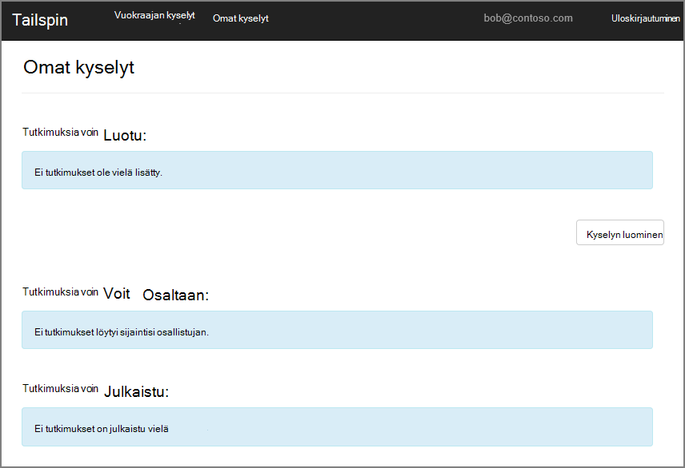
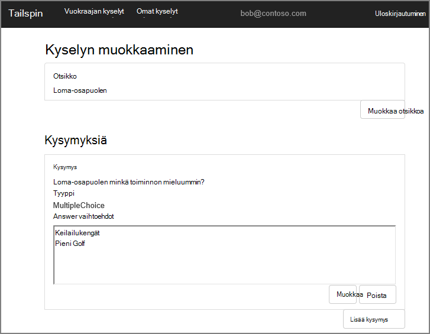
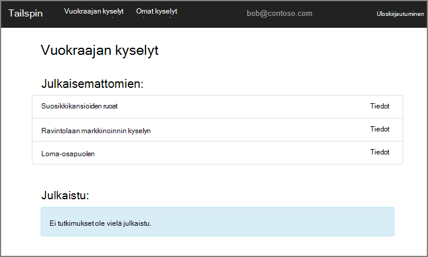
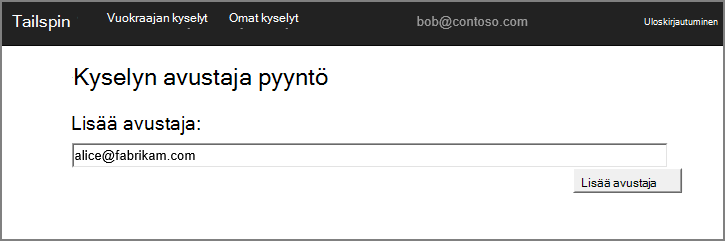
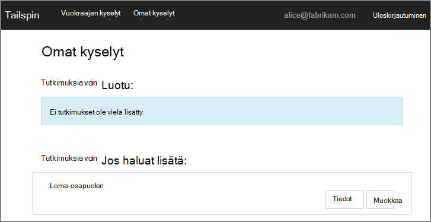
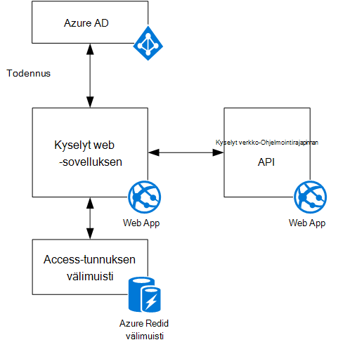

<properties
   pageTitle="Tietoja Tailspin kyselyt-sovellus | Microsoft Azure"
   description="Tailspin kyselyt sovelluksen yleiskatsaus"
   services=""
   documentationCenter="na"
   authors="MikeWasson"
   manager="roshar"
   editor=""
   tags=""/>

<tags
   ms.service="guidance"
   ms.devlang="dotnet"
   ms.topic="article"
   ms.tgt_pltfrm="na"
   ms.workload="na"
   ms.date="05/23/2016"
   ms.author="mwasson"/>

# Tailspin kyselyt-sovellusta

[AZURE.INCLUDE [pnp-header](../../includes/guidance-pnp-header-include.md)]

Tässä artikkelissa on [sarjaan kuuluvan]. On myös valmis [sovelluksen malli] , jonka mukana sarjassa.

Tailspin on kuvitteellinen yritys, joka kehittää SaaS-sovelluksen nimeltä kyselyt. Tämän sovelluksen avulla organisaatiot voivat luoda ja julkaista online kyselyt.

- Organisaation rekisteröidä sovelluksen.
- Kun organisaatio on vielä, käyttäjät voivat kirjautua organisaation tunnistetietoja sovellukseen.
- Käyttäjät voivat luoda, muokata ja julkaista kyselyt.

> [AZURE.NOTE] Aloita sovelluksen, katso [Kyselyt-sovelluksen suorittaminen].

## Käyttäjät voivat luoda, muokata ja tarkastella kyselyt

Todennetun käyttäjän voit tarkastella kaikkia kyselyt, jotka hän on luotu tai osallistujan oikeudet, ja luoda uusia tutkimuksia. Huomaa, että käyttäjä on kirjautunut sisään hänen tunnuksillasi `bob@contoso.com`.

Tässä näyttökuvassa näkyy Muokkaa kyselysivu:

Käyttäjät voivat tarkastella kaikki samassa alihallinnassa sisällä muiden käyttäjien luomia kyselyt.

## Kyselyn omistajat kutsua osallistujia

Kun käyttäjä luo kyselyn, hän kutsua muut osallistujat-kysely. Osallistujien voit muokata kyselyn, mutta ei voi poistaa tai julkaista sen.  

Käyttäjän voit lisätä osallistujia muiden omistajien resurssien jakamisen rajat-vuokraajan avulla. Tässä näyttökuvassa Teemu (`bob@contoso.com`) lisätään Anneli (`alice@fabrikam.com`), joka Teemu luotu kyselyn osallistujana.

Kun Anneli kirjautuu, hän näkee "Kyselyt voidaan osaltaan"-kohdasta kyselyn.

Huomaa, että Anneli kirjautuu oman vuokraajan ei Contoso-vuokraajan vieraana. Anneli on osallistujan oikeudet vain kyseisen kyselyn &mdash; hän voi tarkastella muiden kyselyt Contoso-vuokraajasta.

## Arkkitehtuuri

Kyselyt-sovelluksen koostuu web-edusta- ja verkko-Ohjelmointirajapinnan taustassa. Molemmat toteutettu [ASP.NET Core 1.0]avulla.

Web-sovelluksen käyttäjien todentamiseen Azure Active Directory (Azure AD) avulla. Web-sovelluksen puhelujen myös Azure AD OAuth 2 access tunnusten hakeminen verkko-Ohjelmointirajapinnan. Azure Redis välimuistiin tallennetut Access tunnusten. Välimuistin avulla voit jakaa saman suojaustunnuksen välimuistin (esimerkiksi palvelinfarmissa) useita kertoja.

## Seuraavat vaiheet

- Tutustu seuraavaan artikkeliin sarjassa: [todennus multitenant sovelluksissa, Azure Active Directory- ja OpenID yhteyden avulla][authentication]

<!-- Links -->

[authentication]: guidance-multitenant-identity-authenticate.md
[sarjaan kuuluvan]: guidance-multitenant-identity.md
[Kyselyt-sovelluksen suorittaminen]: https://github.com/Azure-Samples/guidance-identity-management-for-multitenant-apps/blob/master/docs/running-the-app.md
[ASP.NET-Core 1.0]: https://docs.asp.net/en/latest/
[sovelluksen malli]: https://github.com/Azure-Samples/guidance-identity-management-for-multitenant-apps
