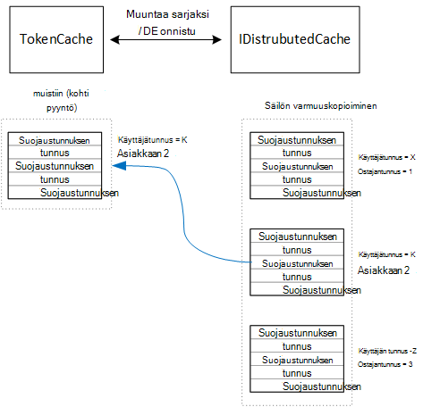

<properties
   pageTitle="Välimuistin olevalle tunnusten multitenant sovelluksessa | Microsoft Azure"
   description="Access-tunnusten avulla taustassa verkko-Ohjelmointirajapinnan välimuistiin tallentaminen"
   services=""
   documentationCenter="na"
   authors="MikeWasson"
   manager="roshar"
   editor=""
   tags=""/>

<tags
   ms.service="guidance"
   ms.devlang="dotnet"
   ms.topic="article"
   ms.tgt_pltfrm="na"
   ms.workload="na"
   ms.date="02/16/2016"
   ms.author="mwasson"/>


# <a name="caching-access-tokens-in-a-multitenant-application"></a>Access-tunnusten multitenant sovelluksen välimuisti

[AZURE.INCLUDE [pnp-header](../../includes/guidance-pnp-header-include.md)]

Tässä artikkelissa on [sarjaan kuuluvan]. On myös valmis [sovelluksen malli] , jonka mukana sarjassa.

On suhteellisen kallista OAuth-Accessin hankkiminen käyttöoikeustietue, koska se edellyttäisi HTTP-pyyntö suojaustunnuksen päätepisteelle. Tämän vuoksi on hyvä huomioida välimuistin tunnusten aina, kun se on mahdollista. [Azure AD-todennus kirjaston] [ ADAL] (ADAL) välimuistiin tunnusten Azure AD, mukaan lukien päivityksen tunnusten saatu automaattisesti.

ADAL on oletusarvo-tunnuksen välimuistin käyttöönotto. Kuitenkin suojaustunnuksen välimuistin on tarkoitettu native client sovellukset ja on _ei_ sovi web Apps-sovelluksista:

-   Se on staattinen esiintymän ja ole Turvalliset viestiketjun.
-   Se ei skaalaudu paljon käyttäjille, koska kaikki käyttäjät tunnusta salliva asetus samaa sanastoa.
-   Se ei voi jakaa WWW-klusterin palvelinten.

Sen sijaan olisi Toteuta mukautettu suojaustunnuksen välimuistin, joka johdetaan ADAL `TokenCache` luokan mutta ei sovellu server-ympäristössä sekä annetaan tunnusten eri käyttäjille välinen eristystaso olisi taso.

`TokenCache` Luokan tallentaa tunnuksia, indeksoi myöntäjä, resurssin tai Ostajantunnus käyttäjän sanastoa. Mukautetun suojaustunnuksen välimuistin Kirjoita Tämä sanasto varmuuskopioiminen säilöön, kuten Redis.txt välimuistin.

Tailspin kyselyt-sovelluksessa `DistributedTokenCache` luokan toteuttaa suojaustunnuksen välimuistin. Tämä toteutus käyttää [IDistributedCache] [ distributed-cache] otetaan ASP.NET Core 1.0. Sen mukaan, minkä tahansa `IDistributedCache` käyttöönoton voidaan käyttää varmuuskopioiminen-kaupasta.

-   Kyselyt-sovellus käyttää oletusarvon mukaan Redis.txt välimuistin.
-   Yhden esiintymän palvelimeen, voit käyttää ASP.NET Core 1.0 [ladatun välimuistin][in-memory-cache]. (Tämä on myös hyvä tapa suorittamisen sovelluksen paikallisesti kehityksen aikana.)

> [AZURE.NOTE] Tällä hetkellä Redis.txt välimuistia ei tueta .NET Core.

`DistributedTokenCache`tallentaa välimuistitiedot varmuuskopioiminen kaupan avain/arvo-pareina. Avain on Käyttäjätunnus lisättynä asiakkaan tunnus, joten varmuuskopioiminen säilö sisältää erillisen välimuistitiedot kunkin käyttäjän/asiakkaan yksilöllinen yhdistelmä.



Käyttäjän on osioitu varmuuskopioiminen-kaupasta. HTTP-sivupyynnön kyseisen käyttäjän tunnusten lukea varmuuskopioiminen säilöstä ja ladattu `TokenCache` sanasto. Jos Redis.txt käytetään jokaisen palvelinfarmin esiintymä lukee/kirjoituksia saman välimuistiin, varmuuskopioiminen-kaupasta, tämän menetelmän Skaalaa useille käyttäjille.

## <a name="encrypting-cached-tokens"></a>Välimuistiin tallennetut tunnusten salaaminen

Tunnusten ovat luottamuksellisia tietoja, koska ne käyttöoikeus käyttäjän resurssit. (Lisäksi toisin kuin käyttäjän salasanan, et voi vain tallentaa hash tunnuksen.) Tämän vuoksi on ehdottoman tärkeää suojaamaan tunnusten tartunnan. Redis.txt palautettua välimuistin on suojattu salasanalla, mutta joku hakee salasana, jos ne on saatu kaikki välimuistiin tallennetut access-tunnukset. Tästä syystä `DistributedTokenCache` salaa kaikki tiedot, jotka varmuuskopioiminen Store kirjoitetaan. Salaus on valmis ASP.NET Core 1.0- [tietojen suojauksen] [ data-protection] API.

> [AZURE.NOTE] Jos otat käyttöön, Azure sivustoista, salausavaimet verkon tallennustilan varmuuskopioida ja kaikissa tietokoneissa synkronoituina (katso [Avaimen hallinta][key-management]). Oletusarvon mukaan näppäimet eivät ole salattuja suoritettaessa Azure sivustoista, mutta voit [käyttöön salauksen käyttämällä X.509-varmenne][x509-cert-encryption].


## <a name="distributedtokencache-implementation"></a>DistributedTokenCache käyttöönotto

[DistributedTokenCache] [ DistributedTokenCache] luokan johdetaan ADAL [TokenCache] [ tokencache-class] luokka.

Konstruktorissa `DistributedTokenCache` luokan Luo avain nykyisen käyttäjän ja lataa välimuistin varmuuskopioiminen Storesta:

```csharp
public DistributedTokenCache(
    ClaimsPrincipal claimsPrincipal,
    IDistributedCache distributedCache,
    ILoggerFactory loggerFactory,
    IDataProtectionProvider dataProtectionProvider)
    : base()
{
    _claimsPrincipal = claimsPrincipal;
    _cacheKey = BuildCacheKey(_claimsPrincipal);
    _distributedCache = distributedCache;
    _logger = loggerFactory.CreateLogger<DistributedTokenCache>();
    _protector = dataProtectionProvider.CreateProtector(typeof(DistributedTokenCache).FullName);
    AfterAccess = AfterAccessNotification;
    LoadFromCache();
}
```

Avain luodaan ketjuttamalla Käyttäjätunnus ja asiakkaan ID-tunnuksellasi. Molemmat ovat otetaan vaateita, jotka löytyvät käyttäjän `ClaimsPrincipal`:

```csharp
private static string BuildCacheKey(ClaimsPrincipal claimsPrincipal)
{
    string clientId = claimsPrincipal.FindFirstValue("aud", true);
    return string.Format(
        "UserId:{0}::ClientId:{1}",
        claimsPrincipal.GetObjectIdentifierValue(),
        clientId);
}
```

Välimuistitiedot ladataan lukeminen sarjoitetun blob-objektien varmuuskopioiminen tallentaminen ja puhelun `TokenCache.Deserialize` Blob-objektien muuntaminen välimuistitiedot.

```csharp
private void LoadFromCache()
{
    byte[] cacheData = _distributedCache.Get(_cacheKey);
    if (cacheData != null)
    {
        this.Deserialize(_protector.Unprotect(cacheData));
    }
}
```

ADAL-välimuistin käyttö, kun se käynnistyy `AfterAccess` tapahtuma. Jos välimuistitiedot ovat muuttuneet, `HasStateChanged` ominaisuuden arvo on TOSI. Päivitä siinä tapauksessa muuttuvat varmuuskopioiminen-kauppa ja määritä sitten `HasStateChanged` , EPÄTOSI.

```csharp
public void AfterAccessNotification(TokenCacheNotificationArgs args)
{
    if (this.HasStateChanged)
    {
        try
        {
            if (this.Count > 0)
            {
                _distributedCache.Set(_cacheKey, _protector.Protect(this.Serialize()));
            }
            else
            {
                // There are no tokens for this user/client, so remove the item from the cache.
                _distributedCache.Remove(_cacheKey);
            }
            this.HasStateChanged = false;
        }
        catch (Exception exp)
        {
            _logger.WriteToCacheFailed(exp);
            throw;
        }
    }
}
```

TokenCache lähettää kaksi tapahtumaa:

- `BeforeWrite`. Kutsua välittömästi ennen, kuin ADAL kirjoittaa välimuistiin. Tämän avulla voidaan toteuttaa samanaikainen määrittäminen
- `BeforeAccess`. Kutsua välittömästi ennen ADAL lukee välimuistista. Tähän lataat välimuistin saat uusimman version.

Tässä tapauksessa on päättänyt olla käsitellä nämä kaksi tapahtumaa.

- Samanaikainen Kirjoita viimeksi wins. Tämä johtuu OK tunnusten tallennetaan itsenäisesti kunkin käyttäjän + asiakas, jotta ristiriitoja vain tapahtuu, jos samassa käyttäjällä on kaksi samanaikainen kirjautuminen istuntoa.
- Lukutilan, emme ladata välimuistin jokaisen pyynnön. Pyynnöt ovat lyhytkestoisia. Jos välimuisti saa muokattu tällä kertaa, seuraava pyynnön Nosta uusi arvo.

## <a name="next-steps"></a>Seuraavat vaiheet

- Tutustu seuraavaan artikkeliin sarjassa: [Federating asiakkaan AD FS multitenant sovellusten Azure-tietokannassa][adfs]

<!-- links -->
[ADAL]: https://msdn.microsoft.com/library/azure/jj573266.aspx
[adfs]: guidance-multitenant-identity-adfs.md
[data-protection]: https://docs.asp.net/en/latest/security/data-protection/index.html
[distributed-cache]: https://docs.asp.net/en/latest/fundamentals/distributed-cache.html
[DistributedTokenCache]: https://github.com/Azure-Samples/guidance-identity-management-for-multitenant-apps/blob/master/src/Tailspin.Surveys.TokenStorage/DistributedTokenCache.cs
[key-management]: https://docs.asp.net/en/latest/security/data-protection/configuration/default-settings.html
[in-memory-cache]: https://docs.asp.net/en/latest/fundamentals/caching.html
[tokencache-class]: https://msdn.microsoft.com/library/azure/microsoft.identitymodel.clients.activedirectory.tokencache.aspx
[x509-cert-encryption]: https://docs.asp.net/en/latest/security/data-protection/implementation/key-encryption-at-rest.html#x-509-certificate
[sarjaan kuuluvan]: guidance-multitenant-identity.md
[sovelluksen malli]: https://github.com/Azure-Samples/guidance-identity-management-for-multitenant-apps
