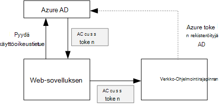
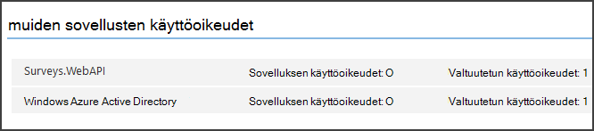

<properties
   pageTitle="Suojaaminen Taustajärjestelmä sivuston API multitenant sovelluksessa | Microsoft Azure"
   description="Taustajärjestelmä verkko-Ohjelmointirajapinnan suojaamisesta"
   services=""
   documentationCenter="na"
   authors="MikeWasson"
   manager="roshar"
   editor=""
   tags=""/>

<tags
   ms.service="guidance"
   ms.devlang="dotnet"
   ms.topic="article"
   ms.tgt_pltfrm="na"
   ms.workload="na"
   ms.date="06/02/2016"
   ms.author="mwasson"/>

# <a name="securing-a-backend-web-api-in-a-multitenant-application"></a>Suojaaminen Taustajärjestelmä sivuston API multitenant-sovelluksessa

[AZURE.INCLUDE [pnp-header](../../includes/guidance-pnp-header-include.md)]

Tässä artikkelissa on [sarjaan kuuluvan]. On myös valmis [sovelluksen malli] , jonka mukana sarjassa.

[Tailspin kyselyt] -sovellus käyttää Taustajärjestelmä verkko-Ohjelmointirajapinnan hallittavan kyselyt CRUD-toimintoja. Kun käyttäjä napsauttaa "Omat kyselyt"-web-sovelluksen lähettää HTTP-pyynnön verkko-Ohjelmointirajapinnan:

```
GET /users/{userId}/surveys
```

Verkko-Ohjelmointirajapinnan palauttaa JSON-objekti:

```
{
  "Published":[],
  "Own":[
    {"Id":1,"Title":"Survey 1"},
    {"Id":3,"Title":"Survey 3"},
    ],
  "Contribute": [{"Id":8,"Title":"My survey"}]
}
```

Verkko-Ohjelmointirajapinnan ei Salli anonyymit pyynnöt niin web Appissa on todennusta käyttämällä OAuth 2 haltijan-tunnukset.

> [AZURE.NOTE] Tämä on palvelin – palvelin-skenaario. Sovellus ei soittaa minkä tahansa AJAX ohjelmointirajapinnan selaimen-asiakasohjelmassa.

Käytettävissä on kaksi tärkeimmät tapaa, voit tehdä:

- Valtuutetun käyttäjätiedot. Web-sovelluksen todentaa käyttäjän käyttäjätietojen kanssa.
- Sovelluksen tunnistetiedot. Web-sovelluksen todentaa asiakas-tunnuksella, käyttämällä OAuth2 asiakkaan tunnistetiedon työnkulku.

Tailspin sovelluksen toteuttaa valtuutetun käyttäjätiedot. Alla on tärkeimmät erot:

**Valtuutetun käyttäjätiedot**

- Verkko-Ohjelmointirajapinnan lähetetään haltijatunnukseen sisältää käyttäjätietoja.
- Verkko-Ohjelmointirajapinnan on lupa päätöksiä käyttäjätietojen perusteella.
- Web-sovelluksen on käsitellä 403 (kielletty)-virheet-verkko-Ohjelmointirajapinnan, jos käyttäjä ei ole oikeutta suorittaa toiminnon.
- Yleensä web-sovelluksen silti on joitakin luvan päätöksiä, jotka vaikuttavat Käyttöliittymä, kuten näyttämällä tai piilottamalla Käyttöliittymän osat).
- Verkko-Ohjelmointirajapinnan voidaan käyttää mahdollisesti luotettu asiakasohjelmilla, kuten JavaScript-sovelluksen tai alkuperäisen asiakassovellukseen.

**Sovelluksen tunnistetiedot**

- Verkko-Ohjelmointirajapinnan saa käyttäjän tietoja.
- Verkko-Ohjelmointirajapinnan ei voi suorittaa luvan käyttäjätietojen perusteella. Kaikki luvan päätökset tekemät verkkosovellus.  
- Verkko-Ohjelmointirajapinnan ei voi käyttää luotettu asiakas (JavaScript- tai alkuperäisen asiakassovellus).
- Tämän menetelmän voi olla hieman yksinkertaisempi toteuttamisesta, sillä ei ole lupaa logiikan verkko-Ohjelmointirajapinnan.

Web-sovelluksen saa joko vaiheelta käyttöoikeustietue, joka on Soita verkko-Ohjelmointirajapinnan tarvittavat tunnistetiedot.

- Valtuutetun käyttäjätiedot-tunnuksen on peräisin IDP, jotka voivat myöntää tunnuksen käyttäjän puolesta.

- Asiakkaan tunnistetiedot-sovellus voi tunnuksen saaminen IDP tai isännöidä omassa suojaustunnuksen server. (Mutta älä kirjoittaa suojaustunnuksen palvelimen alusta, joten käytä hyvin testattu framework, kuten [IdentityServer3].) Jos Azure AD todentamismenetelmä, on erittäin suositeltavaa käyttöoikeustietue käyttämistä Azure AD-silloinkin asiakkaan tunnistetiedon työnkulku.

Muiden tässä artikkelissa oletetaan, että sovellus todentaa Azure AD kanssa.



## <a name="register-the-web-api-in-azure-ad"></a>Rekisteröi verkko-Ohjelmointirajapinnan Azure AD

Azure AD antamaan haltijatunnukseen verkko-Ohjelmointirajapinnan, jotta sinun on määrittäminen seikat Azure AD.

1. Voit [rekisteröidä verkko-Ohjelmointirajapinnan Azure AD].

2. Lisää Asiakastunnus web Appin verkko-Ohjelmointirajapinnan-sovellusluettelo `knownClientApplications` ominaisuus. Katso [päivittää sovelluksen luettelot].

3. [Antaa Soita verkko-Ohjelmointirajapinnan web application-oikeudet].

  Voit määrittää Azure hallinta-portaalin kahdentyyppisiä käyttöoikeudet: "Sovelluksen käyttöoikeudet" sovelluksen käyttäjätiedot (asiakkaan tunnistetiedon virtaus) tai "Valtuutetun käyttöoikeuksien" valtuutetun käyttäjätiedot.

  

## <a name="getting-an-access-token"></a>Access-tunnuksen saaminen

Ennen kuin puhelut verkko-Ohjelmointirajapinnan, web-sovelluksen hakee access suojaustunnuksen Azure AD. .NET-sovellus käyttää [Azure AD todennus kirjaston (ADAL), .NET][ADAL].

OAuth 2-työnkulussa luvan koodi sovelluksen vaihtaa access-tunnuksen todennus koodi. Seuraava koodi käyttää ADAL käyttöoikeustietue saamiseen. Tämä koodi kutsutaan aikana `AuthorizationCodeReceived` tapahtuma.

```csharp
// The OpenID Connect middleware sends this event when it gets the authorization code.   
public override async Task AuthorizationCodeReceived(AuthorizationCodeReceivedContext context)
{
    string authorizationCode = context.ProtocolMessage.Code;
    string authority = "https://login.microsoftonline.com/" + tenantID
    string resourceID = "https://tailspin.onmicrosoft.com/surveys.webapi" // App ID URI
    ClientCredential credential = new ClientCredential(clientId, clientSecret);

    AuthenticationContext authContext = new AuthenticationContext(authority, tokenCache);
    AuthenticationResult authResult = await authContext.AcquireTokenByAuthorizationCodeAsync(
        authorizationCode, new Uri(redirectUri), credential, resourceID);

    // If successful, the token is in authResult.AccessToken
}
```

Seuraavassa on erilaisia parametrit, joita tarvitaan:

- `authority`. Johdettu kirjautuneena käyttäjän vuokraajan tunnus. (Ei vuokraajan tunnus SaaS tarjoajan)  
- `authorizationCode`. auth tunnus, jolla olet saanut takaisin IDP kohteesta.
- `clientId`. Web-sovelluksen asiakkaan ID-tunnuksellasi.
- `clientSecret`. Web-sovelluksen asiakkaan salainen.
- `redirectUri`. Uudelleenohjauksen URI, jotka olet määrittänyt OpenID muodosta. Tämä on kohtaa, johon IDP soittaa takaisin tunnuksen kanssa.
- `resourceID`. Sovelluksen tunnus URI verkko-Ohjelmointirajapinnan, jonka loit silloin, kun olet rekisteröitynyt verkko-Ohjelmointirajapinnan Azure AD
- `tokenCache`. Objekti, joka välimuistiin access-tunnukset. Katso [tunnussanoma välimuistiin].

Jos `AcquireTokenByAuthorizationCodeAsync` onnistuu, ADAL välimuistiin tunnuksen. Myöhemmin voit hankkia tunnuksen välimuistista soittamalla AcquireTokenSilentAsync:

```csharp
AuthenticationContext authContext = new AuthenticationContext(authority, tokenCache);
var result = await authContext.AcquireTokenSilentAsync(resourceID, credential, new UserIdentifier(userId, UserIdentifierType.UniqueId));
```

Jos `userId` on käyttäjän Objektitunnus, joka löytyy `http://schemas.microsoft.com/identity/claims/objectidentifier` väittää.

## <a name="using-the-access-token-to-call-the-web-api"></a>Soittaminen verkko-Ohjelmointirajapinnan käyttöoikeustietue avulla

Kun tunnuksen, Lähetä se HTTP-pyyntöjen Authorization-otsikko-verkko-Ohjelmointirajapinnan.

```
Authorization: Bearer xxxxxxxxxx
```

Seuraavat tunniste-menetelmä kyselyt-sovelluksesta määrittää Authorization-otsikko HTTP-pyynnön, **HttpClient** -luokan avulla.

```csharp
public static async Task<HttpResponseMessage> SendRequestWithBearerTokenAsync(this HttpClient httpClient, HttpMethod method, string path, object requestBody, string accessToken, CancellationToken ct)
{
    var request = new HttpRequestMessage(method, path);
    if (requestBody != null)
    {
        var json = JsonConvert.SerializeObject(requestBody, Formatting.None);
        var content = new StringContent(json, Encoding.UTF8, "application/json");
        request.Content = content;
    }

    request.Headers.Authorization = new AuthenticationHeaderValue("Bearer", accessToken);
    request.Headers.Accept.Add(new MediaTypeWithQualityHeaderValue("application/json"));

    var response = await httpClient.SendAsync(request, ct);
    return response;
}
```

> [AZURE.NOTE] Katso [HttpClientExtensions.cs].

## <a name="authenticating-in-the-web-api"></a>Verkko-Ohjelmointirajapinnan todennustapa

Verkko-Ohjelmointirajapinnan on todennusta haltijatunnukseen. ASP.NET-Core 1.0, voit käyttää [Microsoft.AspNet.Authentication.JwtBearer] [ JwtBearer] paketti. Tämä paketti sisältää middleware, joka mahdollistaa sovelluksen vastaanottamaan OpenID yhteyden haltijan-tunnukset.

Rekisteröi middleware verkko-Ohjelmointirajapinnan `Startup` luokka.

```csharp
app.UseJwtBearerAuthentication(options =>
{
    options.Audience = "[app ID URI]";
    options.Authority = "https://login.microsoftonline.com/common/";
    options.TokenValidationParameters = new TokenValidationParameters
    {
        //Instead of validating against a fixed set of known issuers, we perform custom multi-tenant validation logic
        ValidateIssuer = false,
    };
    options.Events = new SurveysJwtBearerEvents();
});
```

> [AZURE.NOTE] Katso [Startup.cs].

- **Käyttäjäryhmän**. Määritä sovelluksen tunnus URL-osoitteeseen verkko-Ohjelmointirajapinnan, jonka loit silloin, kun verkko-Ohjelmointirajapinnan rekisteröityjä Azure AD.
- **Myöntäjä**. Multitenant sovelluksen asetukseksi `https://login.microsoftonline.com/common/`.
- **TokenValidationParameters**. Multitenant sovelluksen arvoksi false **ValidateIssuer** . Tämä tarkoittaa sovelluksen vahvistaa myöntäjä.
- **Tapahtumien** on luokka, joka johdetaan **JwtBearerEvents**.

### <a name="issuer-validation"></a>Myöntäjän vahvistus

Vahvista tunnuksen myöntäjän **JwtBearerEvents.ValidatedToken** tapahtuman. Myöntäjä lähetetään "iss"-ryhmän.

Valitse Kyselyt-sovelluksessa verkko-Ohjelmointirajapinnan ei käsittele [vuokraajan kirjautuminen]. Sen vuoksi vain tarkistaa Jos myöntäjä on jo sovellustietokanta. Jos et, se ilmoittaa poikkeuksen, joka aiheuttaa-todennus epäonnistuu.

```csharp
public override async Task ValidatedToken(ValidatedTokenContext context)
{
    var principal = context.AuthenticationTicket.Principal;
    var tenantManager = context.HttpContext.RequestServices.GetService<TenantManager>();
    var userManager = context.HttpContext.RequestServices.GetService<UserManager>();
    var issuerValue = principal.GetIssuerValue();
    var tenant = await tenantManager.FindByIssuerValueAsync(issuerValue);

    if (tenant == null)
    {
        // the caller was not from a trusted issuer - throw to block the authentication flow
        throw new SecurityTokenValidationException();
    }
}
```

> [AZURE.NOTE] Katso [SurveysJwtBearerEvents.cs].

Voit myös tehdä [saatavat muunnos] **ValidatedToken** tapahtuma. Muista, että saatavat noudetaan suoraan Azure AD, joten jos verkkosovelluksen mahdollisesti saatavat muunnoksia, jotka eivät näy haltijatunnukseen verkko-Ohjelmointirajapinnan vastaanottaa.

## <a name="authorization"></a>Todennus

Yleinen keskustelu hyväksyminen-kohdassa [Roolipohjainen ja resurssi-pohjainen todennus][Authorization]. 

JwtBearer middleware käsittelee luvan vastaukset. Esimerkiksi rajoittaa controller-toiminto, joka todennetut käyttäjät, käytä **[Hyväksy]** -atrribute ja määritä **JwtBearerDefaults.AuthenticationScheme** todennus-mallina:

```csharp
[Authorize(ActiveAuthenticationSchemes = JwtBearerDefaults.AuthenticationScheme)]
```

Tämä palauttaa 401 tilakoodi, jos käyttäjä ei ole todennettu.

Rajoittaa controller-toiminnon authorizaton käytäntö, määrittää käytännön nimen **[Hyväksy]** -määrite:

```csharp
[Authorize(Policy = PolicyNames.RequireSurveyCreator)]
```

Tämä palauttaa 401 tilakoodi, jos käyttäjä ei ole todennettu ja 403, jos käyttäjä on vahvistettu, mutta ei ole oikeuksia. Rekisteröi käytännön käynnistyksen yhteydessä:

```csharp
public void ConfigureServices(IServiceCollection services)
{
    services.AddAuthorization(options =>
    {
        options.AddPolicy(PolicyNames.RequireSurveyCreator,
            policy =>
            {
                policy.AddRequirements(new SurveyCreatorRequirement());
                policy.AddAuthenticationSchemes(JwtBearerDefaults.AuthenticationScheme);
            });
    });
}
```

## <a name="next-steps"></a>Seuraavat vaiheet

- Tutustu seuraavaan artikkeliin sarjassa: [välimuisti access tunnusten multitenant-sovelluksessa][token cache]

<!-- links -->
[ADAL]: https://msdn.microsoft.com/library/azure/jj573266.aspx
[JwtBearer]: https://www.nuget.org/packages/Microsoft.AspNet.Authentication.JwtBearer
[sarjaan kuuluvan]: guidance-multitenant-identity.md
[Tailspin kyselyt]: guidance-multitenant-identity-tailspin.md
[IdentityServer3]: https://github.com/IdentityServer/IdentityServer3
[Rekisteröi verkko-Ohjelmointirajapinnan Azure AD]: https://github.com/Azure-Samples/guidance-identity-management-for-multitenant-apps/blob/master/docs/running-the-app.md#register-the-surveys-web-api
[Päivitä sovelluksen luettelot]: https://github.com/Azure-Samples/guidance-identity-management-for-multitenant-apps/blob/master/docs/running-the-app.md#update-the-application-manifests
[Antaa web-sovelluksen oikeudet verkko-Ohjelmointirajapinnan kutsu]: https://github.com/Azure-Samples/guidance-identity-management-for-multitenant-apps/blob/master/docs/running-the-app.md#give-the-web-app-permissions-to-call-the-web-api
[Suojaustunnuksen välimuistiin tallentaminen]: guidance-multitenant-identity-token-cache.md
[HttpClientExtensions.cs]: https://github.com/Azure-Samples/guidance-identity-management-for-multitenant-apps/blob/master/src/Tailspin.Surveys.Common/HttpClientExtensions.cs
[Startup.cs]: https://github.com/Azure-Samples/guidance-identity-management-for-multitenant-apps/blob/master/src/Tailspin.Surveys.WebAPI/Startup.cs
[vuokraajan kirjautuminen]: guidance-multitenant-identity-signup.md
[SurveysJwtBearerEvents.cs]: https://github.com/Azure-Samples/guidance-identity-management-for-multitenant-apps/blob/master/src/Tailspin.Surveys.WebAPI/SurveyJwtBearerEvents.cs
[vaateita, jotka muunnos]: guidance-multitenant-identity-claims.md#claims-transformations
[Authorization]: guidance-multitenant-identity-authorize.md
[sovelluksen malli]: https://github.com/Azure-Samples/guidance-identity-management-for-multitenant-apps
[token cache]: guidance-multitenant-identity-token-cache.md
