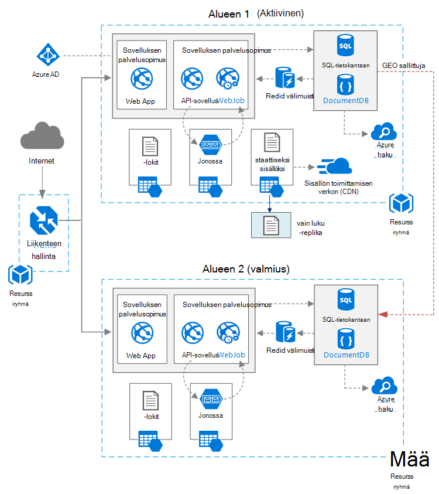

<properties
   pageTitle="WWW-sovellus ja suuri käytettävyys | Azure viittaus arkkitehtuuri | Microsoft Azure"
   description="Web-sovelluksen ja suuri käytettävyys, suorittamalla: Microsoft Azure suositeltu arkkitehtuuri."
   services="app-service,app-service\web,sql-database" 
   documentationCenter="na"
   authors="MikeWasson"
   manager="roshar"
   editor=""
   tags=""/>

<tags
   ms.service="guidance"
   ms.devlang="na"
   ms.topic="article"
   ms.tgt_pltfrm="na"
   ms.workload="na"
   ms.date="06/27/2016"
   ms.author="mwasson"/>

# <a name="azure-reference-architecture-web-application-with-high-availability"></a>Azure viittaus arkkitehtuuri: WWW-sovellus ja suuri käytettävyys

[AZURE.INCLUDE [pnp-RA-branding](../../includes/guidance-pnp-header-include.md)]

Tässä artikkelissa kerrotaan suositellut arkkitehtuuri web-sovelluksen hyvin käytettävissä, Microsoft Azure-käyttöjärjestelmässä. Arkkitehtuuri perustuu [Azure viittaus arkkitehtuuri: parantaminen verkkosovelluksen skaalattavuus][guidance-web-apps-scalability].

## <a name="architecture-diagram"></a>Arkkitehtuurikaavio



Tämä arkkitehtuuri perustuu [parantaminen skaalattavuus WWW-sovelluksessa]näkyvä[guidance-web-apps-scalability]. Tärkeimmät erot ovat seuraavat:

- **Ensisijaisen ja toissijaisen alueet**. Tämä arkkitehtuuri käyttää kummallakin alueella suurempi käytettävyys saavuttamiseksi. Sovellus on otettu käyttöön kunkin alueille. Tavallinen toimintojen aikana verkkoliikennettä reititetään ensisijainen alue. Mutta, joka ei ole käytettävissä, jos liikenne reititetään toissijainen alue. Saat lisätietoja automaattisesti [hallinta automaattisesti](#managing-failover-and-failback).

- **Azure liikenteen hallinta**. [Liikenteen hallinta] [ traffic-manager] reitittää pyynnöt ensisijainen alue. Jos käynnissä alueen sovellus ei ole käytettävissä, liikenteen hallinta epäonnistuu toissijainen alueen päälle. 

- **Geo replikoinnin** SQL-tietokantaan ja DocumentDB.

## <a name="recommendations"></a>Suosituksia

### <a name="regional-pairing"></a>Alueellisten laiteparin

Azure alueittain on yhdistetty toiseen saman geography-alueella. Valitse alueet, saman alueellisen pair (esimerkiksi Itä US 2 ja keskitetyn US). Tällöin etuja ovat:

- Jos näkyvissä on laaja käyttökatkosta, vähintään yhden alueen ulos jokainen palautus on ensin.
- Suunniteltu Azure Järjestelmäpäivitykset tulevat esiin pisteparin alueiden järjestyksessä minimoi käyttökatkot mahdollista.
- Useimmissa tapauksissa paria sijaitsevat saman maantieteellisten tietojen pisimpään vaatimukset täyttävän.

Varmista, että molemmat alueet tukevat kaikkia Azure palvelut, joita tarvitaan sovelluksen. Katso [palvelut alueittain][services-by-region]. Saat lisätietoja alueellisen paria [liiketoiminnan jatkuvuuden ja tietojen palauttaminen (BCDR): Azure Parittainen alueiden][regional-pairs].

### <a name="resource-groups"></a>Resurssiryhmät

Sijoittaa ensisijainen alue, toissijainen alue ja liikenteen hallinta erillisessä [resurssiryhmien][resource groups]. Näillä oikeuksilla voit ottaa käyttöön kunkin alueen kuin yhden sivustokokoelman resurssien &mdash; voit ottaa ne käyttöön erikseen, poista käyttöönottoa ja niin edelleen. 

### <a name="traffic-manager"></a>Liikenteen hallinta

**Reititys.** Liikenteen hallinta tukee useita [Reititys algoritmit][tm-routing]. Tässä artikkelissa kuvattuja skenaarion Käytä _prioriteetti_ reititys (niin sanottuja _automaattisesti_ reititys). Kun tämä asetus, liikenteen hallinta lähettää kaikki palvelupyynnöt ensisijainen alue, ellei alueen päätepiste tulee saada yhteyttä. Tässä vaiheessa se siirtyy automaattisesti toissijaisen alueen. Katso [määrittäminen automaattisesti reititys menetelmä][tm-configure-failover].

**Kuntotietojen näytteenottimen.** Liikenteen hallinta käyttää HTTP (tai HTTPS) näytteenottimen seurannassa päätepisteiden käytettävyyttä. Näytteenottimen antaa liikenteen hallinta pass/virheiden testin epäonnistumista toissijainen alueen yli. Se toimii lähettämällä pyyntö URL-polku. Jos se saa-200 vastauksen aikakatkaisuajan kuluessa, näytteenottimen epäonnistuu. Neljä epäonnistuneiden pyyntöjen jälkeen liikenteen hallinta merkitsee päätepisteen heikentynyt ja lakkaa toisen päätepisteen päälle. Lisätietoja on artikkelissa [liikenteen hallinta päätepisteen seuranta- ja automaattisesti][tm-monitoring].

Paras käytäntö Luo kunto näytteenottimen päätepiste, joka ilmoittaa sovelluksen yleinen kunto ja käyttää tämän päätepisteen keräysputken kunto. Päätepisteen Tarkista tärkeät riippuvuudet, kuten sovelluksen palvelun sovellukset, tallennustilan jonossa ja SQL-tietokantaan. Muussa tapauksessa näytteenottimen ehkä ilmoittaa "kunnossa" päätepisteen, vaikka sovelluksen tärkeitä osista epäonnistuvat. 

Toisaalta Älä käytä kunto näytteenottimen tarkistamaan pienempi prioriteetti-palvelut. Esimerkiksi sähköpostipalvelusta, jota siirtyy, jos sovellus voi siirtyä toisen palvelun tai lähettää sähköpostiviestejä vain myöhemmin. Sovelluksen todennäköisesti ei kannata epäonnistua päälle, tilanteessa. Lisätietoja on artikkelissa [Kunto päätepisteen seuranta kuvion][health-endpoint-monitoring-pattern].
  
### <a name="sql-database"></a>SQL-tietokantaan

Käytä [Aktiivinen Geo-replikoinnin] [ sql-replication] luettavissa toissijainen luominen eri kohtaan. Käytössä voi olla enintään neljä luettavissa secondaries. Jos ensisijainen tietokannan epäonnistuu, riittää, että on otettava offline-tilassa, tai voit automaattisesti kaikkiin toissijainen tietokantoja. Aktiivinen Geo-replikoinnin voidaan määrittää minkä tahansa joustavasti tietokannan varannon tietokannan.

### <a name="documentdb"></a>DocumentDB

DocumentDB tukee geo replikoinnin eri alueilla. Yhden alueen on määritetty kirjoitettava ja toiset ovat vain luku-replikoita. 

Jos näkyvissä on alueellisen käyttökatkosta, voi epäonnistua alusta esimerkiksi valitsemalla toisen alueen on kirjoitus-alue. SDK automaattisesti lähettää DocumentDB asiakas kirjoittaa pyynnöt nykyinen kirjoitus-alue, joten sinun ei tarvitse päivittää automaattisesti kun asiakkaan-määritys. Lisätietoja on artikkelissa [välit tietojen yleisesti DocumentDB][docdb-geo]. 

> [AZURE.NOTE] Kaikki replikat kuulut samaan resurssiryhmä.

### <a name="storage"></a>Tallennustilan

Käytä Azuren tallennustilaan [lukuoikeudet geo tarpeettomat tallennustilan] [ ra-grs] (RA GRS). RA GRS tallennustilaa, jossa tiedot on replikoida toissijainen alue. Sinulla on vain luku-tietoihin pääsy toissijainen alueen erillisessä päätepisteen kautta. Jos on alueellisen käyttökatkosta tai tietojen, Azuren tallennustilaan ryhmän voi määrittää suorittamiseen geo-automaattisesti toissijaisen alueen. Ei ole asiakkaan vaaditaan tämän automaattisesti.

Luo varmuuskopio jonon jonon tallennus-toissijainen alueen. Aikana automaattisesti sovellus voi käyttää varmuuskopion jonossa, kunnes ensisijainen alue on käytettävissä uudelleen. Sen mukaan, sovellus voi silti käsitellä uusia pyyntöjä. 

## <a name="availability-considerations"></a>Käytettävyys huomioon otettavia seikkoja

Monille arkkitehtuuri tarjota suurempi kuin otat käyttöön vain yhden alueen käytettävyys. Jos alueellisen käyttökatkosta vaikuttaa ensisijainen alue, voit epäonnistua toissijainen alueen päälle. Tämä arkkitehtuuri auttaa myös, jos yksittäisiä alirakenne sovelluksen epäonnistuu.  
     
Yleiset monilla saavuttamiseksi suuren käytettävyyden tietojen keskikohdan mukaan eri tavoilla:      
- Aktiivinen/passiivinen kuuma valmius kanssa. Liikenne siirtyy yhden alueen valmius muiden odottaa aikana. Sovellus on otettu käyttöön ja käytössä toissijainen alueen. Voi alkaa pienempi esiintymän laskeminen toissijainen tietokeskuksen ja sitten skaalata ulos tarpeen mukaan. 

- Aktiivinen/passiivinen kylmän valmius kanssa. Sama, mutta sovellus ei ole otettu käyttöön, kunnes tarvittavat automaattisesti. Tämän menetelmän kustannuksia pienempi, jos haluat suorittaa, mutta yleensä on enää alaspäin aikana epäonnistui. 

- Aktiivisena. Molemmat alueet ovat aktiivisia ja pyynnöt ovat kuormitus tasataan niiden välille. Jos yksi tietokeskuksen ei ole käytettävissä, se otetaan kierto ulos. 

Tässä artikkelissa keskitytään Aktiivinen/passiivinen kuuma valmius- [Azure liikenteen] hallinnan kanssa[ traffic-manager] reitin liikennettä alueen. 

### <a name="traffic-manager"></a>Liikenteen hallinta

Liikenteen hallinta epäonnistuu automaattisesti päälle, jos ensisijainen alue ei ole käytettävissä. Kun liikenteen hallinta epäonnistuu päälle, käytössäsi on tietyn ajanjakson aikana, kun asiakkaat eivät pääse sovellus, joka voi olla useita minuutteja. Kaksi tekijöiden kokonaiskesto:

- Kuntotietojen Keräysputken on tunnistettava ensisijainen tietokeskuksen on tullut saavuttamattomissa.

- DNS-palvelimet on päivitettävä välimuistiin DNS-tietueet IP-osoitetta, joka määräytyy DNS--elinaika (TTL). Oletus-TTL on 300 sekunnin (5 minuuttia), mutta voit määrittää tämän arvon, kun luot liikenteen hallinta profiilin.

Lisätietoja on artikkelissa [Tietoja liikenteen hallinta seuranta][tm-monitoring]. 

Liikenteen hallinta on mahdollista virhe järjestelmässä. Jos palvelun epäonnistuu, asiakkaat ei voi käyttää sovelluksen käyttökatkot aikana. Tarkista [Liikenteen hallinta SLA][tm-sla], ja määrittää tietoliikenteen hallinnan yksin täyttääkö business-vaatimukset suuren käytettävyyden. Jos et, harkitse liikenteen hallintaratkaisu lisäämisellä tuntisesta. Jos Azure liikenteen hallinta-palvelu epäonnistuu, muuttaa CNAME-tietueet siten, että muut liikenteen hallinta-palvelun DNS. (Tämä vaihe on suoritettava manuaalisesti ja sovellus ei ole käytettävissä, kunnes DNS-muutokset välittyvät.) 

### <a name="sql-database"></a>SQL-tietokantaan

Palautus piste tavoitteen (RPO) ja arvioitu Palautumisaika (Lisää) SQL-tietokanta on kuvattu [seuraavassa][sql-rpo]. 

### <a name="storage"></a>Tallennustilan

RA GRS tallennustilan kestävät tallennustila, mutta se on tärkeää ymmärtää, mitä voi tapahtua käyttökatkosta aikana: 

- Jos tallennustilan käyttökatkosta, ole tietyn ajanjakson aikana, kun sinulla ei ole kirjoitusoikeutta tietoihin. Voit lukea toissijainen päätepisteestä edelleen käyttökatkosta aikana.

- Jos alueellisen käyttökatkosta tai tietojen vaikuttaa ensisijainen sijainti ja tietoja voi palauttaa, Azuren tallennustilaan ryhmän voi määrittää suorittamiseen geo-automaattisesti toissijaisen alueen. 

- Toissijainen alueen tietojen replikoinnin suoritetaan asynkronisesti. Sen vuoksi, jos geo-automaattisesti suoritetaan, kadota tietoja on mahdollista, jos ensisijainen alueelta ei voi palauttaa tietoja.

- Lyhytkestoisia virheet, kuten verkko-käyttökatkosta ei käynnistää tallennustilan automaattisesti. Suunnittele sovellus on joustavat lyhytkestoisia virheet. Mahdollisia ongelman pienentämistavat:

    - Toissijaisen lukea.

    - Siirry tilapäisesti toisen tallennustilan tilin (kuten haluat sanomien) uusi kirjoitus-toimintoja. 

    - Kopioi tietoja toissijaisen tallennustilan toiselle tilille.

    - Antaa rajoitetun, kunnes järjestelmä epäonnistuu takaisin.

Lisätietoja on artikkelissa [Azure-tallennustilan käyttökatkosta ilmenee, jos][storage-outage].

## <a name="managing-failover-and-failback"></a>Automaattisesti ja tuntisesta hallinta

### <a name="traffic-manager"></a>Liikenteen hallinta

Liikenteen hallinta epäonnistuu automaattisesti päälle, jos ensisijainen alue ei ole käytettävissä. Oletusarvon mukaan se automaattisesti myös epäonnistuu takaisin, kun ensisijainen alueen käytettävyys uudelleen.

On suositeltavaa kuitenkin suorittamiseen manuaalinen tuntisesta sijaan puuttuessa automaattisesti takaisin. Ennen kaatuvat takaisin, varmista, että kaikki sovelluksen alijärjestelmien kunnossa. Muussa tapauksessa voit luoda tilanteeseen, jossa sovellus kääntää edestakaisin välillä tietojen keskikohdan mukaan. 

Voit estää automaattisten tuntisesta pienempi prioriteetti ensisijainen alueen manuaalisesti automaattisesti tapahtuman jälkeen. Oletetaan, että ensisijainen alue on prioriteetti 1 ja toissijaisen prioriteetti 2. Automaattisesti, kun Määritä prioriteetti 3, jos haluat estää automaattisen tuntisesta ensisijainen alueen. Kun olet valmis, voit siirtyä takaisin, Palauta prioriteetti takaisin 1.

Seuraavat komennot Päivitä prioriteetti.

**PowerShellin** 

```bat
$endpoint = Get-AzureRmTrafficManagerEndpoint -Name <endpoint> -ProfileName <profile> -ResourceGroupName <resource-group> -Type AzureEndpoints
$endpoint.Priority = 3
Set-AzureRmTrafficManagerEndpoint -TrafficManagerEndpoint $endpoint
```

Lisätietoja on artikkelissa [Azure liikenteen hallinnan cmdlet-komennot][tm-ps].

**Azure CLI**

```bat
azure network traffic-manager endpoint set --name <endpoint> --profile-name <profile> --resource-group <resource-group> --type AzureEndpoints --priority 3
```    

### <a name="sql-database"></a>SQL-tietokantaan

Jos ensisijainen tietokannan epäonnistuu, suorittaa siirtyy toissijaisen tietokannan manuaalinen automaattisesti. Katso [palauttaa Azure SQL-tietokanta tai toissijainen automaattisesti][sql-failover]. Epäonnistuu päällä, kunnes toissijaisen tietokanta pysyy vain luku-tilassa. 


<!-- links -->

[azure-sql-db]: https://azure.microsoft.com/en-us/documentation/services/sql-database/
[docdb-geo]: ../documentdb/documentdb-distribute-data-globally.md
[guidance-web-apps-scalability]: guidance-web-apps-scalability.md
[health-endpoint-monitoring-pattern]: https://msdn.microsoft.com/library/dn589789.aspx
[ra-grs]: ../storage/storage-redundancy.md#read-access-geo-redundant-storage
[regional-pairs]: ../best-practices-availability-paired-regions.md
[resource groups]: ../resource-group-overview.md
[services-by-region]: https://azure.microsoft.com/en-us/regions/#services
[sql-failover]: ../sql-database/sql-database-disaster-recovery.md
[sql-replication]: ../sql-database/sql-database-geo-replication-overview.md
[sql-rpo]: ../sql-database/sql-database-business-continuity.md#sql-database-business-continuity-features
[storage-outage]: ../storage/storage-disaster-recovery-guidance.md
[tm-configure-failover]: ../traffic-manager/traffic-manager-configure-failover-routing-method.md
[tm-monitoring]: ../traffic-manager/traffic-manager-monitoring.md
[tm-ps]: https://msdn.microsoft.com/en-us/library/mt125941.aspx
[tm-routing]: ../traffic-manager/traffic-manager-routing-methods.md
[tm-sla]: https://azure.microsoft.com/en-us/support/legal/sla/traffic-manager/v1_0/
[traffic-manager]: https://azure.microsoft.com/en-us/services/traffic-manager/
