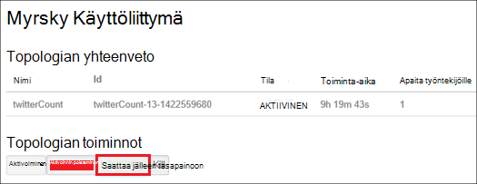

<properties
    pageTitle="Hallitse Hadoop varausyksiköt HDInsight .NET SDK kanssa | Microsoft Azure"
    description="Lue, miten käyttämällä HDInsight .NET SDK HDInsight Hadoop-klustereiden hallinnollisten tehtävien suorittamiseen."
    services="hdinsight"
    editor="cgronlun"
    manager="jhubbard"
    tags="azure-portal"
    authors="mumian"
    documentationCenter=""/>

<tags
    ms.service="hdinsight"
    ms.workload="big-data"
    ms.tgt_pltfrm="na"
    ms.devlang="na"
    ms.topic="article"
    ms.date="09/02/2016"
    ms.author="jgao"/>

# Hallitse Hadoop varausyksiköt HDInsight käyttämällä .NET SDK

[AZURE.INCLUDE [selector](../../includes/hdinsight-portal-management-selector.md)]

Opi hallitsemaan HDInsight klustereiden [HDInsight.NET SDK: N](https://msdn.microsoft.com/library/mt271028.aspx)avulla.

**Edellytykset**

Ennen kuin aloitat tämän artikkelin, sinulla on oltava seuraavasti:

- **Azure-tilaus**. Katso [Hae Azure maksuttoman kokeiluversion](https://azure.microsoft.com/documentation/videos/get-azure-free-trial-for-testing-hadoop-in-hdinsight/).

##Yhteyden muodostaminen Azure Hdinsightiin

Tarvitset seuraavat Nuget paketit:

    Install-Package Microsoft.Rest.ClientRuntime.Azure.Authentication -Pre
    Install-Package Microsoft.Azure.Management.ResourceManager -Pre
    Install-Package Microsoft.Azure.Management.HDInsight

Seuraava koodi malli avulla voit muodostaa yhteyden Azure, ennen kuin voit hallita HDInsight klustereiden Azure tilauksen-kohdassa.

    using System;
    using Microsoft.Azure;
    using Microsoft.Azure.Management.HDInsight;
    using Microsoft.Azure.Management.HDInsight.Models;
    using Microsoft.Azure.Management.ResourceManager;
    using Microsoft.IdentityModel.Clients.ActiveDirectory;
    using Microsoft.Rest;
    using Microsoft.Rest.Azure.Authentication;

    namespace HDInsightManagement
    {
        class Program
        {
            private static HDInsightManagementClient _hdiManagementClient;
            // Replace with your AAD tenant ID if necessary
            private const string TenantId = UserTokenProvider.CommonTenantId; 
            private const string SubscriptionId = "<Your Azure Subscription ID>";
            // This is the GUID for the PowerShell client. Used for interactive logins in this example.
            private const string ClientId = "1950a258-227b-4e31-a9cf-717495945fc2";

            static void Main(string[] args)
            {
                // Authenticate and get a token
                var authToken = Authenticate(TenantId, ClientId, SubscriptionId);
                // Flag subscription for HDInsight, if it isn't already.
                EnableHDInsight(authToken);
                // Get an HDInsight management client
                _hdiManagementClient = new HDInsightManagementClient(authToken);

                // insert code here

                System.Console.WriteLine("Press ENTER to continue");
                System.Console.ReadLine();
            }

            /// 

            /// Authenticate to an Azure subscription and retrieve an authentication token
            /// 

            /// <param name="TenantId">The AAD tenant ID</param>
            /// <param name="ClientId">The AAD client ID</param>
            /// <param name="SubscriptionId">The Azure subscription ID</param>
            /// <returns></returns>
            static TokenCloudCredentials Authenticate(string TenantId, string ClientId, string SubscriptionId)
            {
                var authContext = new AuthenticationContext("https://login.microsoftonline.com/" + TenantId);
                var tokenAuthResult = authContext.AcquireToken("https://management.core.windows.net/", 
                    ClientId, 
                    new Uri("urn:ietf:wg:oauth:2.0:oob"), 
                    PromptBehavior.Always, 
                    UserIdentifier.AnyUser);
                return new TokenCloudCredentials(SubscriptionId, tokenAuthResult.AccessToken);
            }
            /// 

            /// Marks your subscription as one that can use HDInsight, if it has not already been marked as such.
            /// 

            /// <remarks>This is essentially a one-time action; if you have already done something with HDInsight
            /// on your subscription, then this isn't needed at all and will do nothing.</remarks>
            /// <param name="authToken">An authentication token for your Azure subscription</param>
            static void EnableHDInsight(TokenCloudCredentials authToken)
            {
                // Create a client for the Resource manager and set the subscription ID
                var resourceManagementClient = new ResourceManagementClient(new TokenCredentials(authToken.Token));
                resourceManagementClient.SubscriptionId = SubscriptionId;
                // Register the HDInsight provider
                var rpResult = resourceManagementClient.Providers.Register("Microsoft.HDInsight");
            }
        }
    }

Kehote on artikkelissa, kun suoritat tämän ohjelman.  Jos et halua näkyviin-kohdassa [Luo ei ole vuorovaikutteinen todennus .NET HDInsight sovellusten](hdinsight-create-non-interactive-authentication-dotnet-applications.md).

##Klustereiden luominen

Katso [HDInsight käyttämällä .NET SDK luominen Linux-pohjaiset varausyksiköt](hdinsight-hadoop-create-linux-clusters-dotnet-sdk.md)

##Luettelon klustereiden

Seuraavat koodikatkelman luettelo klustereiden ja joitakin ominaisuuksia:

    var results = _hdiManagementClient.Clusters.List();
    foreach (var name in results.Clusters) {
        Console.WriteLine("Cluster Name: " + name.Name);
        Console.WriteLine("\t Cluster type: " + name.Properties.ClusterDefinition.ClusterType);
        Console.WriteLine("\t Cluster location: " + name.Location);
        Console.WriteLine("\t Cluster version: " + name.Properties.ClusterVersion);
    }

##Klustereiden poistaminen

Käytä seuraavia koodikatkelman synkronoidusti tai asynkronisesti klusterin poistaminen: 

    _hdiManagementClient.Clusters.Delete("<Resource Group Name>", "<Cluster Name>");
    _hdiManagementClient.Clusters.DeleteAsync("<Resource Group Name>", "<Cluster Name>");
            
##Klustereiden asteikko
Klusterin skaalaus ominaisuuden avulla voit muuttaa klusteriin, joka toimii Azure Hdinsightiin eikä sinun tarvitse luoda uudelleen klusterin käyttämä työntekijä solmujen määrän.

>[AZURE.NOTE] Vain klusterit HDInsight version 3.1.3 kanssa tai uudempi versio tukee. Jos et ole varma, että klusterin-version, voit tarkistaa ominaisuudet-sivulla.  Katso [luettelo- ja Näytä klustereiden](hdinsight-administer-use-portal-linux.md#list-and-show-clusters).

Vaikutukset HDInsight tukemat klusterin mistäkin tietojen solmujen määrän muuttaminen:

- Hadoop

    Voit suurentaa saumattomasti Hadoop-klusterin, jossa on käytössä ilman vaikuttavat odotetaan tai käynnissä töitä työntekijä näkyvien solmujen määrän. Uusi työt voidaan lähettää myös, kun toiminto on käynnissä. Skaalauksen toiminnon virheiden käsitellään tilanteen, niin, että klusterin aina jää toimintojen tilaan.

    Kun Hadoop-klusterin on skaalattu vähentämällä tietojen solmujen määrän-klusterin palvelut käynnistetään uudelleen. Tämä aiheuttaa kaikki käynnissä olevat ja odottavat työt epäonnistuu skaalauksen toiminnon päätyttyä. Voit kuitenkin tiedot työt, kun toiminto on valmis.

- HBase

    Saumattomasti voit lisätä tai poistaa solmujen HBase-klusteriin on käynnissä. Alueellisten palvelimet ovat automaattisesti saapuva skaalauksen toiminnon muutaman minuutin kuluessa. Voit myös manuaalisesti saldo alueellisen palvelimet kirjautumalla järjestelmään klusterin headnode ja suorittamalla seuraavat komennot komentokehote-ikkunassa:

        >pushd %HBASE_HOME%\bin
        >hbase shell
        >balancer

- Myrsky

    Voit saumattomasti lisääminen tai poistaminen tietojen solmujen myrsky-klusteriin on käynnissä. Mutta onnistunut käyttöönotto skaalauksen toiminnan, kun tarvitset saattaa jälleen tasapainoon topologian.

    Yhdistelemällä onnistuu kahdella tavalla:

    * Myrsky web-Käyttöliittymä
    * Käyttöliittymä (CLI)-työkalu

    Katso lisätietoja [Apache myrsky ohjeissa](http://storm.apache.org/documentation/Understanding-the-parallelism-of-a-Storm-topology.html) .

    Myrsky web-Käyttöliittymä on käytettävissä HDInsight-klusterin:

    

    Tässä on esimerkki saattaa jälleen tasapainoon myrsky topologian CLI-komennon avulla:

        ## Reconfigure the topology "mytopology" to use 5 worker processes,
        ## the spout "blue-spout" to use 3 executors, and
        ## the bolt "yellow-bolt" to use 10 executors

        $ storm rebalance mytopology -n 5 -e blue-spout=3 -e yellow-bolt=10

Seuraavat koodikatkelman näkyy klusterin synkronoidusti tai asynkronisesti koon muuttaminen:

    _hdiManagementClient.Clusters.Resize("<Resource Group Name>", "<Cluster Name>", <New Size>);   
    _hdiManagementClient.Clusters.ResizeAsync("<Resource Group Name>", "<Cluster Name>", <New Size>);   
    

##Myönnä/revoke käyttö

Klustereiden Hdinsightista on verkkopalvelut seuraavat HTTP (kaikkia näistä palveluista on RESTful päätepisteet):

- ODBC
- JDBC
- Ambari
- Oozie
- Templeton

Oletusarvon mukaan palveluista myönnetään käytön. Voit voit peruuttaa/Myönnä käyttöoikeudet. Jos haluat peruuttaa:

    var httpParams = new HttpSettingsParameters
    {
        HttpUserEnabled = false,
        HttpUsername = "admin",
        HttpPassword = "*******",
    };
    _hdiManagementClient.Clusters.ConfigureHttpSettings("<Resource Group Name>, <Cluster Name>, httpParams);

Jos haluat myöntää:

    var httpParams = new HttpSettingsParameters
    {
        HttpUserEnabled = enable,
        HttpUsername = "admin",
        HttpPassword = "*******",
    };
    _hdiManagementClient.Clusters.ConfigureHttpSettings("<Resource Group Name>, <Cluster Name>, httpParams);

>[AZURE.NOTE] Mukaan myöntämistä/peruutetaan käyttöoikeudet, voit palauttaa klusterin käyttäjänimi ja salasana.

Tämän voi tehdä myös portaalin kautta. Katso [Käyttämällä Azure-portaalin hallinta HDInsight][hdinsight-admin-portal].

##Päivitä HTTP käyttäjän tunnistetietoja

[Myönnä/revoke HTTP access](#grant/revoke-access)kuvattuja on. Jos klusterin on myönnetty HTTP-käyttö, se on ensin kumota.  Ja Myönnä sitten uusi HTTP-käyttäjätietoja käytön.

##Etsi tallennustilan oletustilistä

Seuraavat koodikatkelman esitellään, miten tallennustilan oletusnimi ja klusterin tallennustilan-tilin avain.

    var results = _hdiManagementClient.Clusters.GetClusterConfigurations(<Resource Group Name>, <Cluster Name>, "core-site");
    foreach (var key in results.Configuration.Keys)
    {
        Console.WriteLine(String.Format("{0} => {1}", key, results.Configuration[key]));
    }

##Lähettää työt

**Voit lähettää MapReduce työt**

Katso [suorittaa Hadoop MapReduce näytteiden HDInsight](hdinsight-hadoop-run-samples-linux.md).

**Voit lähettää rakenteen työt** 

Kohdassa [Suorita rakenne kyselyjen .NET SDK: N avulla](hdinsight-hadoop-use-hive-dotnet-sdk.md).

**Voit lähettää Possu työt**

Katso [suorittaa Possu työt käyttämällä .NET SDK](hdinsight-hadoop-use-pig-dotnet-sdk.md).

**Voit lähettää Sqoop työt**

Katso [Käytä Sqoop HDInsight kanssa](hdinsight-hadoop-use-sqoop-dotnet-sdk.md).

**Voit lähettää Oozie työt**

Katso [Käytä Oozie Hadoop määrittäminen ja HDInsight-työnkulun suorittaminen kanssa](hdinsight-use-oozie-linux-mac.md).

##Tietojen lataaminen Azure-Blob-säiliö
Katso [Lataa tiedot HDInsight][hdinsight-upload-data].

## Katso myös
* [HDInsight .NET SDK-oppaat](https://msdn.microsoft.com/library/mt271028.aspx)
* [Hallita HDInsight Azure-portaalissa][hdinsight-admin-portal]
* [Hallita HDInsight käyttämällä käyttöliittymä][hdinsight-admin-cli]
* [Luo HDInsight klustereiden][hdinsight-provision]
* [Tietojen lataaminen Hdinsightiin][hdinsight-upload-data]
* [Azure Hdinsightiin käytön aloittaminen][hdinsight-get-started]

[azure-purchase-options]: http://azure.microsoft.com/pricing/purchase-options/
[azure-member-offers]: http://azure.microsoft.com/pricing/member-offers/
[azure-free-trial]: http://azure.microsoft.com/pricing/free-trial/

[hdinsight-get-started]: hdinsight-hadoop-linux-tutorial-get-started.md
[hdinsight-provision]: hdinsight-provision-clusters.md
[hdinsight-provision-custom-options]: hdinsight-provision-clusters.md#configuration
[hdinsight-submit-jobs]: hdinsight-submit-hadoop-jobs-programmatically.md

[hdinsight-admin-cli]: hdinsight-administer-use-command-line.md
[hdinsight-admin-portal]: hdinsight-administer-use-portal-linux.md
[hdinsight-storage]: hdinsight-hadoop-use-blob-storage.md
[hdinsight-use-hive]: hdinsight-use-hive.md
[hdinsight-use-mapreduce]: hdinsight-use-mapreduce.md
[hdinsight-upload-data]: hdinsight-upload-data.md
[hdinsight-flight]: hdinsight-analyze-flight-delay-data.md

