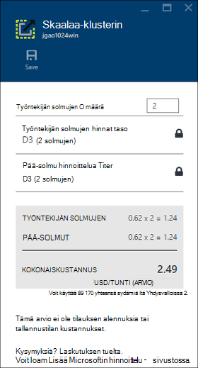

<properties
    pageTitle="Hallinta-portaalissa Azure Hdinsightiin varausyksiköt Hadoop | Microsoft Azure"
    description="Opettele HDInsight-palvelun hallinta. Luo HDInsight-klusterin, Avaa vuorovaikutteinen JavaScript-konsolin ja konsolin Hadoop-komento."
    services="hdinsight"
    documentationCenter=""
    tags="azure-portal"
    authors="mumian"
    manager="jhubbard"
    editor="cgronlun"/>

<tags
    ms.service="hdinsight"
    ms.workload="big-data"
    ms.tgt_pltfrm="na"
    ms.devlang="na"
    ms.topic="article"
    ms.date="09/14/2016"
    ms.author="jgao"/>

# Azure-portaalissa voit hallita Hadoop varausyksiköt Hdinsightiin

[AZURE.INCLUDE [selector](../../includes/hdinsight-portal-management-selector.md)]

[Azure portal][azure-portal], voit luoda Hadoop klustereiden Azure Hdinsightiin, Hadoop-käyttäjän salasanan vaihtaminen ja Remote Desktop Protocol (RDP) käyttöön, voit käyttää klusterin Hadoop-komento-konsolin.

Tämän artikkelin tiedot koskevat vain ikkunan perustuva HDInsight klustereiden. Tietojen hallinta Linux-pohjaiset klustereiden Napsauta yllä.

Napsauta Lisätietoja luomisesta Hadoop klustereiden HDInsight muiden työkaluilla. 

**Edellytykset**

Ennen kuin aloitat tämän artikkelin, sinulla on oltava seuraavasti:

- **Azure-tilaus**. Katso [Hae Azure maksuttoman kokeiluversion](https://azure.microsoft.com/documentation/videos/get-azure-free-trial-for-testing-hadoop-in-hdinsight/).
- **Azure-tallennustilan tilin** - HDInsight-klusterin käyttää Azure-Blob-tallennustilan säiliön käyttöjärjestelmän. Saat lisätietoja siitä, miten Azure-Blob-säiliö tarjoaa saumaton kokemusta HDInsight klustereiden [Käytä Azure-Blob-säiliö HDInsight kanssa](hdinsight-hadoop-use-blob-storage.md). Lisätietoja Azure-tallennustilan tilin luomisesta on artikkelissa [tallennustilan tilin luominen](../storage/storage-create-storage-account.md).

##Avaa-portaali

1. Kirjaudu sisään [https://portal.azure.com](https://portal.azure.com).
2. Kun olet avannut portaalin, voit tehdä seuraavaa:

    - Valitse **Uusi** vasemmasta valikosta voit luoda uuden klusterin:
    
        
    - Valitse vasemmasta valikosta **HDInsight klustereiden** .
    
        

    Jos **HDInsight** ei ole vasemmanpuoleisessa valikossa, valitse **Selaa**. 

    

##Klustereiden luominen

Portaalissa luomisen ohjeita on kohdassa [Luo HDInsight klustereiden](hdinsight-provision-clusters.md#create-using-the-preview-portal).

HDInsight toimii leveä Hadoop-osia. Osat, jotka on vahvistettu ja tuetut luetteloon Tutustu [mitä Hadoop-versio on Azure Hdinsightista](hdinsight-component-versioning.md). Voit mukauttaa HDInsight käyttämällä jotakin seuraavista vaihtoehdoista:

- Komentosarja-toiminnon avulla voit suorittaa mukautettuja komentosarjoja, joilla voit mukauttaa klusteriin ja muuta klusterin kokoonpano tai asentaa mukautettuja osia, kuten Giraph tai Solr. Lisätietoja on artikkelissa [mukauttaminen HDInsight-klusterin komentosarja-toiminnon avulla](hdinsight-hadoop-customize-cluster.md).
- Käytä klusterin mukauttaminen parametrit HDInsight .NET SDK tai PowerShellin Azure klusterin luonnin aikana. Nämä määritysten muutokset säilytetään sitten klusterin elinkaaren kautta ja joka Azure ympäristö suorittaa säännöllisesti ylläpito klusterin solmu reimages eivät vaikuta. Saat lisätietoja parametreilla klusterin mukauttaminen [luominen HDInsight klustereiden](hdinsight-provision-clusters.md).
- Joitakin alkuperäisen Java-osia, kuten Mahout ja Cascading, voidaan suorittaa klusterin PURKKI-tiedostoina. PURKKI nämä tiedostot voit jakaa Azure-Blob-säiliö ja HDInsight klustereihin lähetettyjä Hadoop työn lähetyksen järjestelmiä. Lisätietoja on artikkelissa [Lähetä Hadoop työt ohjelmallisesti](hdinsight-submit-hadoop-jobs-programmatically.md).

    >[AZURE.NOTE] Jos sinulla on ongelmia käyttöönotto PURKKI tiedostojen HDInsight klustereihin tai soittamista PURKKI tiedostojen HDInsight klustereiden, ota yhteyttä [Microsoftin tuotetukeen](https://azure.microsoft.com/support/options/).

    > CSS-ei tue HDInsight ja ei oikeuta Microsoft Support. Katso luettelo tuetuista osien [uudet HDInsight myöntämä klusterin versioissa?](hdinsight-component-versioning.md).

Klusterin Etätyöpöytäyhteys käyttämällä mukautetun ohjelmiston asennus ei tueta. Vältä tallentaminen pään solmu asemat tiedostoja kuin ne menetetään, jos sinun on luotava uudelleen varausyksiköiden. On suositeltavaa Azure-Blob-säiliö tiedostojen tallentamiseen. Blob-objektien tallennustilaan on jatkuva.

##Luettelo- ja Näytä klustereiden

1. Kirjaudu sisään [https://portal.azure.com](https://portal.azure.com).
2. Valitse vasemmasta valikosta **HDInsight klustereiden** .
3. Napsauta klusterinimeä. Jos klusterin luettelo on pitkä, voit käyttää Suodata-sivulla.
4. Kaksoisnapsauta klusterin luettelosta ja Näytä tiedot.

    **Valikon ja essentials**:

    
    
    - Mukauttaa-valikkoa, napsauta hiiren kakkospainiketta-valikon ja valitse sitten **Mukauta**.
    - **Ja **Kaikki asetukset**** : Näyttää klusterin, jonka avulla voit käyttää klusterin yksityiskohtaiset määritystietoja **asetukset** -sivu.
    - **Raporttinäkymät-ikkunan**, **Klusterin Raporttinäkymät-ikkunan** ja **URL-osoite: Nämä ovat kaikki tapoja käyttää klusterin Raporttinäkymät-ikkunan, joka on Ambari Web Linux-pohjaiset klustereiden. - **Shell suojatun **: Näyttää ohjeita muodostaa yhteyttä klusterin suojattu runko (SSH)-yhteyden avulla.
    - **Skaalaa-klusterin**: Voit muuttaa tämän klusterin työntekijä solmujen määrän.
    - **Poista**: poistaa klusterin.
    - **Pikaopas ()**: Näyttää tiedot, jotka auttavat käytön aloittamisessa Hdinsightista.
    - **Käyttäjien ()**: Voit määrittää tämän klusterin _portaalin hallinta_ käyttöoikeuksien muiden käyttäjien Azure-tilauksessa.
    
        > [AZURE.IMPORTANT] Tämä _vain_ vaikuttaa tähän klusteriin Azure-portaalissa käyttöoikeudet, ja kuka voi muodostaa tai lähettää HDInsight-klusterin työt ei vaikuta.
    - **Tunnisteet ()**: tunnisteiden avulla voit määrittää voit määrittää mukautetun luokituksen cloud palvelujen avain/arvo-pareina. Voi esimerkiksi avain nimeltä __projektin__luominen ja käyttäminen sitten kaikki palvelujen tiettyyn projektiin liittyvä esiintyvän arvon.
    - **Ambari näkymiä**: Ambari Web linkkejä.
    
    > [AZURE.IMPORTANT] Voit hallita HDInsight-klusterin palveluja, sinun on käytettävä Ambari verkossa tai Ambari REST-Ohjelmointirajapinnalla. Lisätietoja Ambari on artikkelissa [Hallitse HDInsight klustereiden käyttämällä Ambari](hdinsight-hadoop-manage-ambari.md).

    **Käyttö**:
    
    
    
5. Valitse **asetukset**.

    

    - **Ominaisuudet**: klusterin ominaisuuksien tarkasteleminen.
    - **Klusterin AAD tunnistetiedot**: 
    - **Azure-tallennustilan näppäimet**: Tarkastele tallennustilan oletustilin ja sen avaimen. Tallennustilan tili on määritys klusterin luomisen aikana.
    - **Klusterin kirjautuminen**: klusterin HTTP-käyttäjänimen ja salasanan muuttaminen.
    - **Ulkoisen Metastores**: Tarkastele rakenne ja Oozie metastores. Metastores voidaan määrittää vain klusterin luomisen aikana.
    - **Skaalaa-klusterin**: Suurenna fonttikokoa- ja Pienennä klusterin työntekijä solmujen määrän.
    - **Etätyöpöytä**: ottaminen käyttöön ja poistaminen käytöstä Etätyöpöytä (RDP) käyttöoikeuksien määrittäminen RDP-käyttäjänimi.  RDP-käyttäjänimen on oltava HTTP-käyttäjänimi poikkeaa.
    - **Tietueen kumppani**:
    
    > [AZURE.NOTE] Tämä on Yleinen luettelo käytettävissä olevista asetuksista; kaikki tavat on esitä klusterin tyypeissä.

6. Valitse **Ominaisuudet**:

    Seuraavat ominaisuudet: luettelot
    
    - **Isäntänimi**: klusterinimi.
    - **Klusterin URL-osoite**.
    - **Tila**: Sisällytä keskeytetty hyväksytty, ClusterStorageProvisioned, AzureVMConfiguration, HDInsightConfiguration, toimintaa, käynnissä, virhe, poistetaan, poistetaan, aikakatkaisu, DeleteQueued, DeleteTimedout, DeleteError, PatchQueued, CertRolloverQueued, ResizeQueued, ClusterCustomization
    - **Alueen**: Azure sijainti. Tuetut Azure sijaintien luetteloon artikkelissa [HDInsight hinnat](https://azure.microsoft.com/pricing/details/hdinsight/) **alueen** avattavassa luettelossa.
    - **Tietoja luotu**.
    - **Käyttöjärjestelmä**: joko **Windows** tai **Linux**.
    - **Tyyppi**: Hadoop, HBase, myrsky-tiedostojen. 
    - **Versio**. Katso [HDInsight-versiot](hdinsight-component-versioning.md)
    - **Tilaus**: Tilauksen nimi.
    - **Tilauksen tunnus**.
    - **Ensisijainen tietolähde**. Azure-Blob-tallennustilan tilin käytetään oletusarvon mukaan Hadoop tiedostojärjestelmässä.
    - **Työntekijän solmujen hinnat taso**.
    - **Pää-solmu hinnoittelu taso**.

##Klustereiden poistaminen

Poista klusteria ei poista tallennustilan oletustilin tai linkitetyn tallennustilan kaikki tilit. Voit luoda klusterin uudelleen käyttämällä samaa tallennustilan-asiakkaat ja sama metastores.

1. Kirjautuminen [Portal][azure-portal].
2. Valitse vasemmasta valikosta **Etsi kaikki** , valitse **HDInsight klustereiden**klusterinimi.
3. Valitse yläreunan valikosta **Poista** ja noudata sitten ohjeita.

Katso myös [klustereiden Keskeytä/Sammuta](#pauseshut-down-clusters).

##Klustereiden asteikko
Klusterin skaalaus ominaisuuden avulla voit muuttaa klusteriin, joka toimii Azure Hdinsightiin eikä sinun tarvitse luoda uudelleen klusterin käyttämä työntekijä solmujen määrän.

>[AZURE.NOTE] Vain klusterit HDInsight version 3.1.3 kanssa tai uudempi versio tukee. Jos et ole varma, että klusterin-version, voit tarkistaa ominaisuudet-sivulla.  Katso [luettelo- ja Näytä klustereiden](#list-and-show-clusters).

Vaikutukset HDInsight tukemat klusterin mistäkin tietojen solmujen määrän muuttaminen:

- Hadoop

    Voit suurentaa saumattomasti Hadoop-klusterin, jossa on käytössä ilman vaikuttavat odotetaan tai käynnissä töitä työntekijä näkyvien solmujen määrän. Uusi työt voidaan lähettää myös, kun toiminto on käynnissä. Skaalauksen toiminnon virheiden käsitellään tilanteen, niin, että klusterin aina jää toimintojen tilaan.

    Kun Hadoop-klusterin on skaalattu vähentämällä tietojen solmujen määrän-klusterin palvelut käynnistetään uudelleen. Tämä aiheuttaa kaikki käynnissä olevat ja odottavat työt epäonnistuu skaalauksen toiminnon päätyttyä. Voit kuitenkin tiedot työt, kun toiminto on valmis.

- HBase

    Saumattomasti voit lisätä tai poistaa solmujen HBase-klusteriin on käynnissä. Alueellisten palvelimet ovat automaattisesti saapuva skaalauksen toiminnon muutaman minuutin kuluessa. Voit myös manuaalisesti saldo alueellisen palvelimet kirjautumalla järjestelmään klusterin headnode ja suorittamalla seuraavat komennot komentokehote-ikkunassa:

        >pushd %HBASE_HOME%\bin
        >hbase shell
        >balancer

    Katso lisätietoja käyttämisestä HBase-liittymän]
- Myrsky

    Voit saumattomasti lisääminen tai poistaminen tietojen solmujen myrsky-klusteriin on käynnissä. Mutta onnistunut käyttöönotto skaalauksen toiminnan, kun tarvitset saattaa jälleen tasapainoon topologian.

    Yhdistelemällä onnistuu kahdella tavalla:

    * Myrsky web-Käyttöliittymä
    * Käyttöliittymä (CLI)-työkalu

    Katso lisätietoja [Apache myrsky ohjeissa](http://storm.apache.org/documentation/Understanding-the-parallelism-of-a-Storm-topology.html) .

    Myrsky web-Käyttöliittymä on käytettävissä HDInsight-klusterin:

    

    Tässä on esimerkki saattaa jälleen tasapainoon myrsky topologian CLI-komennon avulla:

        ## Reconfigure the topology "mytopology" to use 5 worker processes,
        ## the spout "blue-spout" to use 3 executors, and
        ## the bolt "yellow-bolt" to use 10 executors

        $ storm rebalance mytopology -n 5 -e blue-spout=3 -e yellow-bolt=10

**Jos haluat skaalata klustereiden**

1. Kirjautuminen [Portal][azure-portal].
2. Valitse vasemmasta valikosta **Etsi kaikki** , valitse **HDInsight klustereiden**klusterinimi.
3. Valitse yläreunan valikosta **asetukset** ja valitse sitten **Mittakaava-klusterin**.
4. Kirjoita **työntekijöiden määrä solmujen**. Klusterisolmu määrän rajoittaminen vaihtelee Azure tilaukset. Laskutuksen tuelta niin, että rajoitus.  Näkyvien solmujen määrän tekemäsi muutokset vaikuttavat kustannusten tiedot.

    

##Klustereiden Keskeytä/Sammuta

Useimmat Hadoop työt ovat erätyöt, jotka ovat vain suoritettiin joskus. Useimmat Hadoop klustereiden on suuri ajanjaksojen, klusterin ei käytetä käsittelyä varten. HDInsight, jossa tiedot on tallennettu Azure-tallennustilan, joten voit poistaa klusterin turvallisesti, kun se ei ole käytössä.
Myös perittävän HDInsight-klusterin, vaikka se ei ole käytössä. Koska klusterin kulut on monta kertaa enemmän kuin tallennustilan kulut, kannattaa taloudellisen poistaa klustereiden, kun he eivät ole käytössä.

Voit ohjelman prosessin monella tavalla:

- Käyttäjän Azure Data Factory. Katso [Azure HDInsight linkitetyn palvelu](../data-factory/data-factory-compute-linked-services.md) ja [Muunna ja analysoida avulla Azure Data Factory](../data-factory/data-factory-data-transformation-activities.md) tarvittaessa ja itse määritetyn linkitetty HDInsight-palveluja varten.
- Azure PowerShellin käyttäminen.  Katso [Analysoi lentotietoihin viive](hdinsight-analyze-flight-delay-data.md).
- Käytä Azure CLI. Katso [hallinta HDInsight klustereiden Azure CLI avulla](hdinsight-administer-use-command-line.md).
- Käytä HDInsight .NET SDK. Katso [lähettää Hadoop työt](hdinsight-submit-hadoop-jobs-programmatically.md).

Katso hinnoittelutiedot, [HDInsight hinnat](https://azure.microsoft.com/pricing/details/hdinsight/). Klusterin-portaalista artikkelissa [klustereiden poistaminen](#delete-clusters)

##Muuta klusterin käyttäjänimi

HDInsight-klusterin voi olla kaksi käyttäjätiliä. HDInsight-klusterin käyttäjätili luodaan luomisen aikana. Voit myös luoda RDP-käyttäjätilin käyttämiseen klusterin RDP kautta. Katso [Etätyöpöytä käyttöön](#connect-to-hdinsight-clusters-by-using-rdp).

**Jos haluat muuttaa HDInsight-klusterin käyttäjänimi ja salasana**

1. Kirjautuminen [Portal][azure-portal].
2. Valitse vasemmasta valikosta **Etsi kaikki** , valitse **HDInsight klustereiden**klusterinimi.
3. Valitse yläreunan valikosta **asetukset** ja valitse sitten **Klusterin kirjautuminen**.
4. Jos **klusterin kirjautuminen** on otettu käyttöön, valitse **Poista käytöstä**ja valitse **Ota käyttöön** , ennen kuin voit muuttaa käyttäjänimeä ja salasanaa...
4. Muuta **Klusterin kirjautumisnimi** ja/tai **Klusterin kirjautumissalasana**ja valitse sitten **Tallenna**.

    

##Myönnä/revoke käyttö

Klustereiden Hdinsightista on verkkopalvelut seuraavat HTTP (kaikkia näistä palveluista on RESTful päätepisteet):

- ODBC
- JDBC
- Ambari
- Oozie
- Templeton

Oletusarvon mukaan palveluista myönnetään käytön. Voit voit peruuttaa/Myönnä käyttöoikeudet Azure-portaalista.

>[AZURE.NOTE] Mukaan myöntämistä/peruutetaan käyttöoikeudet, voit palauttaa klusterin käyttäjänimi ja salasana.

**Myönnä/revoke HTTP-web-verkkopalveluihin käyttö**

1. Kirjautuminen [Portal][azure-portal].
2. Valitse vasemmasta valikosta **Etsi kaikki** , valitse **HDInsight klustereiden**klusterinimi.
3. Valitse yläreunan valikosta **asetukset** ja valitse sitten **Klusterin kirjautuminen**.
4. Jos **klusterin kirjautuminen** on otettu käyttöön, valitse **Poista käytöstä**ja valitse **Ota käyttöön** , ennen kuin voit muuttaa käyttäjänimeä ja salasanaa...
6. **Klusterin kirjautumisen käyttäjänimi** ja **Klusterin kirjautumissalasana**Kirjoita uuden käyttäjänimi ja salasana (vastaavasti) klusterin.
7. Valitse **Tallenna**.

    

##Etsi tallennustilan oletustilin

Kunkin HDInsight-klusterin on tallennustilan oletustilin. Tallennustilan oletustilin ja sen avaimet klusterin näkyy **asetukset**-kohdassa/**Ominaisuudet**/**Azure-tallennustilan avaimet**. Katso [luettelo- ja Näytä klustereiden](#list-and-show-clusters).

    
##Etsi resurssiryhmän 

Azure Resurssienhallinta-tilassa kunkin HDInsight-klusterin luodaan Azure resurssiryhmä. Azure resurssiryhmän, joka kuuluu klusterin näkyy:

- Klusterin-luettelossa on **Resurssiryhmä** -sarake.
- Klusterin **olennainen** osa.  

Katso [luettelo- ja Näytä klustereiden](#list-and-show-clusters).
   
##Avaa HDInsight kyselyn konsoli

Kyselyn HDInsight-konsolin sisältää seuraavat ominaisuudet:

- **Aloitus-valikoima**: käyttäminen valikoima, katso [Lisätietoja Hadoop Azure Hdinsightiin käytön aloittaminen-valikoiman avulla](hdinsight-learn-hadoop-use-sample-gallery.md).
- **Rakenne-editorin**: A Graafisen web-liittymän rakenne työt lähettämistä varten.  Kohdassa [Suorita rakenne kyselyjen kysely-konsolin avulla](hdinsight-hadoop-use-hive-query-console.md).

    

- **Työhistoria**: näytön Hadoop työt.  

    

    Valitse Näytä tiedot, mukaan lukien projektin ominaisuudet- **Työ kyselyn** **Kyselyn nimi** ja ** työn tulos. Voit ladata kyselyn ja tulos työasemaan.

- **Tiedosto selaimessa**: Selaa tallennustilan oletustilin ja linkitetyt tallennustilan tilit.

    

    Valitse näyttökuvan **<Account>** tyyppi ilmaisee kohde on Azure-tallennustilan tilin.  Valitse Selaa tiedostot sen tilinimen.
    
- **Hadoop-Käyttöliittymä**.

    
    
    Valitse **Hadoop-Käyttöliittymä*, voit selata tiedostoja ja lokista. 

- **Kuitenkaan Käyttöliittymän**.

    

##Rakenne-kyselyt

Voit suoritettiin rakenteen työt-portaalista, valitsemalla **Rakenne-editori** HDInsight kyselyn konsolissa. Katso [Avaa HDInsight-kysely-konsolin](#open-hdinsight-query-console).

##Töiden valvominen

Työt-portaalista seurannassa Valitse **Työhistoria** HDInsight kyselyn konsolissa. Katso [Avaa HDInsight-kysely-konsolin](#open-hdinsight-query-console).

##Tiedostojen selaaminen

Selaa tallennustilan oletustilin ja linkitetyt tallennustilan tilit tallennettuja tiedostoja valitsemalla **Tiedosto selaimessa** HDInsight kyselyn konsolissa. Katso [Avaa HDInsight-kysely-konsolin](#open-hdinsight-query-console).

Voit käyttää myös **Hadoop-Käyttöliittymän** **Selaa tiedostojärjestelmän** -apuohjelman HDInsight-konsolissa.  Katso [Avaa HDInsight-kysely-konsolin](#open-hdinsight-query-console).

##Näytön klusterin käyttö

HDInsight-klusterin sivu __käyttö__ -osa näyttää tietoja sydämiä käytettävissä määrän tilaukseen käytettäväksi HDInsight sekä sydämiä kohdistettu tämän klusterin ja miten ne on varattu tämän klusterin sijaitsevien solmujen määrän. Katso [luettelo- ja Näytä klustereiden](#list-and-show-clusters).

> [AZURE.IMPORTANT] Voit valvoa HDInsight-klusterin palveluja, sinun on käytettävä Ambari verkossa tai Ambari REST-Ohjelmointirajapinnalla. Katso lisätietoja käyttämisestä Ambari [hallinta HDInsight klustereiden Ambari käyttäminen](hdinsight-hadoop-manage-ambari.md)

##Avaa Hadoop-Käyttöliittymä

Klusterin valvoa, Selaa tiedostojärjestelmän ja lokista valitsemalla **Hadoop-Käyttöliittymän** HDInsight kyselyn konsolissa. Katso [Avaa HDInsight-kysely-konsolin](#open-hdinsight-query-console).

##Avaa kuitenkaan Käyttöliittymä

Kuitenkaan käyttöliittymän käyttöön napsauttamalla **Kuitenkaan Käyttöliittymän** HDInsight kyselyn konsolissa. Katso [Avaa HDInsight-kysely-konsolin](#open-hdinsight-query-console).

##Yhteyden muodostaminen käyttämällä RDP klustereiden

Tunnistetietojen, jonka ilmoitit osoitteessa sen luomisen klusterin käyttöoikeuden antaminen palvelut-klusterin, mutta et itse klusterin etätyöpöydän kautta. Voit poistaa etätyöpöydän käytön valmistelu klusteriin tai jälkeen klusteriin on valmisteltu. Ottamisesta etätyöpöydän osoitteessa luomisen ohjeita on artikkelissa [Luo HDInsight-klusterin](hdinsight-provision-clusters.md).

**Jos haluat ottaa käyttöön etätyöpöytä**

1. Kirjautuminen [Portal][azure-portal].
2. Valitse vasemmasta valikosta **Etsi kaikki** , valitse **HDInsight klustereiden**klusterinimi.
3. Valitse yläreunan valikosta **asetukset** ja valitse sitten **Etätyöpöytä**.
4. **Vanhenee,**-, **Remote Desktop käyttäjänimi** -ja **Työpöydän salasana**ja valitse sitten **Ota käyttöön**.

    

    Vanhentuu-oletusarvot on viikossa.
> [AZURE.NOTE] Voit käyttää myös HDInsight .NET SDK etätyöpöydän käyttöön klusterin. Käytä **EnableRdp** menetelmää HDInsight asiakkaan objektin seuraavalla tavalla: **asiakas. EnableRdp (clustername, sijainti, "rdpuser", "rdppassword", DateTime.Now.AddDays(6))**. Vastaavasti käytöstä Etätyöpöytä klusterin, voit käyttää **asiakas. DisableRdp (clustername ja sijainti)**. Lisätietoja näistä menetelmistä on artikkelissa [HDInsight .NET SDK-ohje](http://go.microsoft.com/fwlink/?LinkId=529017). Tämä on käytettävissä vain HDInsight klustereiden Windows-käyttöjärjestelmässä.

**Yhteyden muodostaminen klusteriin RDP käyttämällä**

1. Kirjautuminen [Portal][azure-portal].
2. Valitse vasemmasta valikosta **Etsi kaikki** , valitse **HDInsight klustereiden**klusterinimi.
3. Valitse yläreunan valikosta **asetukset** ja valitse sitten **Etätyöpöytä**.
4. Valitse **Yhdistä** ja noudata ohjeita. Jos Yhdistä ei poista käytöstä, sinun on otettava se ensin. Varmista, että etätyöpöydän käyttäjänimen ja salasanan.  Et voi käyttää klusterin käyttäjän tunnistetietoja.

##Avaa Hadoop komentoriviltä

Muodosta yhteys klusterin Etätyöpöydän avulla ja käytä Hadoop-komentoa, ensin on otettava käyttöön etätyöpöydän käyttöoikeus klusterin edellisessä kohdassa kuvatulla tavalla.

**Avaa Hadoop komentorivin**

1. Muodostaa yhteyttä klusterin Etätyöpöydän avulla.
8. Työpöydältä Kaksoisnapsauta **Hadoop komentoriviltä käsin**.

    ![HDI. HadoopCommandLine][image-hadoopcommandline]

    Saat lisätietoja Hadoop-komennot [Hadoop komennot viittaus](http://hadoop.apache.org/docs/current/hadoop-project-dist/hadoop-common/CommandsManual.html).

Edellisen näyttökuvan kansionimi on upotettu Hadoop versionumero. Versionumero voit muuttaa klusterin asennettuihin Hadoop-osat-version mukaan. Voit viitata kansiot Hadoop ympäristömuuttujat. Esimerkki:

    cd %hadoop_home%
    cd %hive_home%
    cd %hbase_home%
    cd %pig_home%
    cd %sqoop_home%
    cd %hcatalog_home%
    
##Seuraavat vaiheet
Tässä artikkelissa on opit miten voit luoda HDInsight-klusterin portaalissa ja niiden komentorivin Hadoop-työkalun avaaminen. Lisätietoja on seuraavissa artikkeleissa:

* [Hallinta PowerShellin Azure Hdinsightiin](hdinsight-administer-use-powershell.md)
* [Hallita käyttämällä Azure CLI Hdinsightiin](hdinsight-administer-use-command-line.md)
* [Luo HDInsight klustereiden](hdinsight-provision-clusters.md)
* [Lähettää Hadoop työt ohjelmallisesti](hdinsight-submit-hadoop-jobs-programmatically.md)
* [Azure Hdinsightiin käytön aloittaminen](hdinsight-hadoop-linux-tutorial-get-started.md)
* [Mikä Hadoop-versio on Azure Hdinsightiin?](hdinsight-component-versioning.md)

[azure-portal]: https://portal.azure.com
[image-hadoopcommandline]: ./media/hdinsight-administer-use-management-portal/hdinsight-hadoop-command-line.png "Hadoop komentoriviltä"
