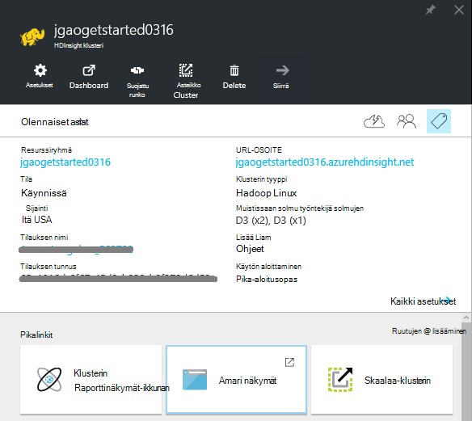
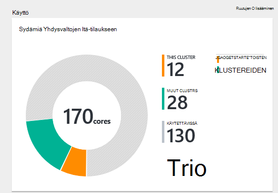
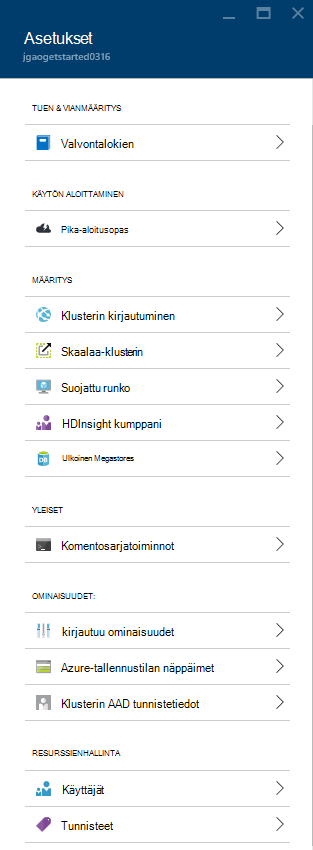
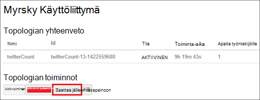
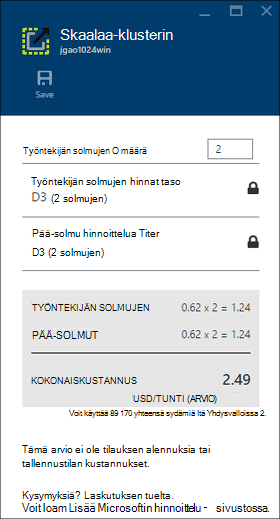
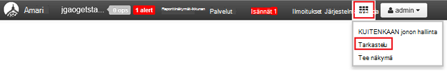

<properties
    pageTitle="Hallinta-portaalissa Azure Hdinsightiin varausyksiköt Linux-pohjaiset Hadoop | Microsoft Azure"
    description="Lue, miten voit luoda ja hallita Linux-pohjaiset HDInsight klustereiden Azure-portaalissa."
    services="hdinsight"
    documentationCenter=""
    authors="mumian"
    manager="jhubbard"
    editor="cgronlun"
    tags="azure-portal"/>

<tags
    ms.service="hdinsight"
    ms.workload="big-data"
    ms.tgt_pltfrm="na"
    ms.devlang="na"
    ms.topic="article"
    ms.date="08/10/2016"
    ms.author="jgao"/>

#Azure-portaalissa voit hallita Hadoop varausyksiköt Hdinsightiin

[AZURE.INCLUDE [selector](../../includes/hdinsight-portal-management-selector.md)]

[Azure portal][azure-portal], voit hallita Azure Hdinsightiin Linux-pohjaiset varausyksiköt. Käytä sarkainvalitsinta lisätietoja luomisesta Hadoop klustereiden HDInsight muiden työkaluilla. 

**Edellytykset**

Ennen kuin aloitat tämän artikkelin, sinulla on oltava seuraavasti:

- **Azure-tilaus**. Katso [Hae Azure maksuttoman kokeiluversion](https://azure.microsoft.com/documentation/videos/get-azure-free-trial-for-testing-hadoop-in-hdinsight/).

##Avaa-portaali

1. Kirjaudu sisään [https://portal.azure.com](https://portal.azure.com).
2. Kun olet avannut portaalin, voit tehdä seuraavaa:

    - Valitse **Uusi** vasemmasta valikosta voit luoda uuden klusterin:
    
        
    - Valitse **HDInsight klustereiden** vasemmasta valikosta aiemmin klustereiden-luettelo
    
        

        Jos **HDInsight** ei ole vasemmanpuoleisessa valikossa, valitse **Selaa**ja valitse sitten **HDInsight klustereiden**.

        

##Klustereiden luominen

[AZURE.INCLUDE [delete-cluster-warning](../../includes/hdinsight-delete-cluster-warning.md)]

HDInsight toimii leveä Hadoop-osia. Osat, jotka on vahvistettu ja tuetut luetteloon Tutustu [mitä Hadoop-versio on Azure Hdinsightista](hdinsight-component-versioning.md). Yleiset klusterin luominen Lisätietoja on artikkelissa [Luo Hadoop varausyksiköt Hdinsightista](hdinsight-hadoop-provision-linux-clusters.md). 

##Luettelo- ja Näytä klustereiden

1. Kirjaudu sisään [https://portal.azure.com](https://portal.azure.com).
2. Valitse **HDInsight klustereiden** luettelon aiemmin klustereiden vasemmasta valikosta.
3. Napsauta klusterinimeä. Jos klusterin luettelo on pitkä, voit käyttää Suodata-sivulla.
4. Kaksoisnapsauta klusterin luettelosta ja Näytä tiedot.

    **Valikon ja essentials**:

    
    
    - **Ja **Kaikki asetukset**** : Näyttää klusterin, jonka avulla voit käyttää klusterin yksityiskohtaiset määritystietoja **asetukset** -sivu.
    - **Raporttinäkymät-ikkunan**, **Klusterin Raporttinäkymät-ikkunan** ja ** URL-osoite: Nämä ovat kaikki tapoja käyttää klusterin Raporttinäkymät-ikkunan, joka on Ambari Web Linux-pohjaiset klustereiden.
    - **Suojattu runko**: Näyttää ohjeita muodostaa yhteyttä klusterin suojattu runko (SSH)-yhteyden avulla.
    - **Skaalaa-klusterin**: Voit muuttaa tämän klusterin työntekijä solmujen määrän.
    - **Poista**: poistaa klusterin.
    - **Pikaopas ()**: Näyttää tiedot, jotka auttavat käytön aloittamisessa Hdinsightista.
    - **Käyttäjien ()**: Voit määrittää tämän klusterin _portaalin hallinta_ käyttöoikeuksien muiden käyttäjien Azure-tilauksessa.
    
        > [AZURE.IMPORTANT] Tämä _vain_ vaikuttaa tähän klusteriin Azure-portaalissa käyttöoikeudet, ja kuka voi muodostaa tai lähettää HDInsight-klusterin työt ei vaikuta.
    - **Tunnisteet ()**: tunnisteiden avulla voit määrittää voit määrittää mukautetun luokituksen cloud palvelujen avain/arvo-pareina. Voi esimerkiksi avain nimeltä __projektin__luominen ja käyttäminen sitten kaikki palvelujen tiettyyn projektiin liittyvä esiintyvän arvon.
    - **Ambari näkymiä**: Ambari Web linkkejä.
    
    > [AZURE.IMPORTANT] Voit hallita HDInsight-klusterin palveluja, sinun on käytettävä Ambari verkossa tai Ambari REST-Ohjelmointirajapinnalla. Lisätietoja Ambari on artikkelissa [Hallitse HDInsight klustereiden käyttämällä Ambari](hdinsight-hadoop-manage-ambari.md).

    **Käyttö**:
    
    
    
5. Valitse **asetukset**.

    

    - **Valvontalokien**:
    - **Pika-aloitus**: Näyttää tiedot, jotka auttavat käytön aloittamisessa Hdinsightista.
    - **Skaalaa-klusterin**: Suurenna fonttikokoa- ja Pienennä klusterin työntekijä solmujen määrän.
    - **Suojattu runko**: Näyttää ohjeita muodostaa yhteyttä klusterin suojattu runko (SSH)-yhteyden avulla.
    - **HDInsight-kumppani**: Lisää tai poista nykyinen HDInsight-kumppani.
    - **Ulkoisen Metastores**: Tarkastele rakenne ja Oozie metastores. Metastores voidaan määrittää vain klusterin luomisen aikana.
    - **Komentosarjatoiminnot**: Suorita Bash komentosarjojen klusterin.
    - **Ominaisuudet**: klusterin ominaisuuksien tarkasteleminen.
    - **Azure-tallennustilan näppäimet**: Tarkastele tallennustilan oletustilin ja sen avaimen. Tallennustilan tili on määritys klusterin luomisen aikana.
    - **Klusterin AAD tunnistetiedot**: 
    - **Käyttäjien**: Voit määrittää tämän klusterin _portaalin hallinta_ käyttöoikeuksien muiden käyttäjien Azure-tilauksessa.
    - **Tunnisteet**: tunnisteiden avulla voit määrittää voit määrittää mukautetun luokituksen cloud palvelujen avain/arvo-pareina. Voi esimerkiksi avain nimeltä __projektin__luominen ja käyttäminen sitten kaikki palvelujen tiettyyn projektiin liittyvä esiintyvän arvon.
    
    > [AZURE.NOTE] Tämä on Yleinen luettelo käytettävissä olevista asetuksista; kaikki tavat on esitä klusterin tyypeissä.

6. Valitse **Ominaisuudet**:

    Ominaisuuksia ovat seuraavat:
    
    - **Isäntänimi**: klusterinimi.
    - **Klusterin URL-osoite**.
    - **Tila**: Sisällytä keskeytetty hyväksytty, ClusterStorageProvisioned, AzureVMConfiguration, HDInsightConfiguration, toimintaa, käynnissä, virhe, poistetaan, poistetaan, aikakatkaisu, DeleteQueued, DeleteTimedout, DeleteError, PatchQueued, CertRolloverQueued, ResizeQueued, ClusterCustomization
    - **Alueen**: Azure sijainti. Tuetut Azure sijaintien luetteloon artikkelissa [HDInsight hinnat](https://azure.microsoft.com/pricing/details/hdinsight/) **alueen** avattavassa luettelossa.
    - **Tietoja luotu**.
    - **Käyttöjärjestelmä**: joko **Windows** tai **Linux**.
    - **Tyyppi**: Hadoop, HBase, myrsky-tiedostojen. 
    - **Versio**. Katso [HDInsight-versiot](hdinsight-component-versioning.md)
    - **Tilaus**: Tilauksen nimi.
    - **Tilauksen tunnus**.
    - **Oletusarvoisen tietolähteen**: klusterin käyttöjärjestelmän.
    - **Työntekijän solmujen hinnat taso**.
    - **Pää-solmu hinnoittelu taso**.

##Klustereiden poistaminen

Poista klusteria ei poista tallennustilan oletustilin tai linkitetyn tallennustilan kaikki tilit. Voit luoda klusterin uudelleen käyttämällä samaa tallennustilan-asiakkaat ja sama metastores. On suositeltavaa käyttää uusi oletusarvon Blob-säilö, kun luot klusterin uudelleen.

1. Kirjautuminen [Portal][azure-portal].
2. Valitse vasemmasta valikosta **Etsi kaikki** , valitse **HDInsight klustereiden**klusterinimi.
3. Valitse yläreunan valikosta **Poista** ja noudata sitten ohjeita.

Katso myös [klustereiden Keskeytä/Sammuta](#pauseshut-down-clusters).

##Klustereiden asteikko
Klusterin skaalaus ominaisuuden avulla voit muuttaa klusteriin, joka toimii Azure Hdinsightiin eikä sinun tarvitse luoda uudelleen klusterin käyttämä työntekijä solmujen määrän.

>[AZURE.NOTE] Vain klusterit HDInsight version 3.1.3 kanssa tai uudempi versio tukee. Jos et ole varma, että klusterin-version, voit tarkistaa ominaisuudet-sivulla.  Katso [luettelo- ja Näytä klustereiden](#list-and-show-clusters).

Vaikutukset HDInsight tukemat klusterin mistäkin tietojen solmujen määrän muuttaminen:

- Hadoop

    Voit suurentaa saumattomasti Hadoop-klusterin, jossa on käytössä ilman vaikuttavat odotetaan tai käynnissä töitä työntekijä näkyvien solmujen määrän. Uusi työt voidaan lähettää myös, kun toiminto on käynnissä. Skaalauksen toiminnon virheiden käsitellään tilanteen, niin, että klusterin aina jää toimintojen tilaan.

    Kun Hadoop-klusterin on skaalattu vähentämällä tietojen solmujen määrän-klusterin palvelut käynnistetään uudelleen. Tämä aiheuttaa kaikki käynnissä olevat ja odottavat työt epäonnistuu skaalauksen toiminnon päätyttyä. Voit kuitenkin tiedot työt, kun toiminto on valmis.

- HBase

    Saumattomasti voit lisätä tai poistaa solmujen HBase-klusteriin on käynnissä. Alueellisten palvelimet ovat automaattisesti saapuva skaalauksen toiminnon muutaman minuutin kuluessa. Voit myös manuaalisesti saldo aluekohtaiset palvelimet kirjautumalla järjestelmään klusterin headnode ja suorittamalla seuraavat komennot komentokehote-ikkunassa:

        >pushd %HBASE_HOME%\bin
        >hbase shell
        >balancer

    Katso lisätietoja käyttämisestä HBase-liittymän]
- Myrsky

    Voit saumattomasti lisääminen tai poistaminen tietojen solmujen myrsky-klusteriin on käynnissä. Mutta onnistunut käyttöönotto skaalauksen toiminnan, kun tarvitset saattaa jälleen tasapainoon topologian.

    Yhdistelemällä onnistuu kahdella tavalla:

    * Myrsky web-Käyttöliittymä
    * Käyttöliittymä (CLI)-työkalu

    Katso lisätietoja [Apache myrsky ohjeissa](http://storm.apache.org/documentation/Understanding-the-parallelism-of-a-Storm-topology.html) .

    Myrsky web-Käyttöliittymä on käytettävissä HDInsight-klusterin:

    

    Tässä on esimerkki saattaa jälleen tasapainoon myrsky topologian CLI-komennon avulla:

        ## Reconfigure the topology "mytopology" to use 5 worker processes,
        ## the spout "blue-spout" to use 3 executors, and
        ## the bolt "yellow-bolt" to use 10 executors

        $ storm rebalance mytopology -n 5 -e blue-spout=3 -e yellow-bolt=10

**Jos haluat skaalata klustereiden**

1. Kirjautuminen [Portal][azure-portal].
2. Valitse vasemmasta valikosta **Etsi kaikki** , valitse **HDInsight klustereiden**klusterinimi.
3. Valitse yläreunan valikosta **asetukset** ja valitse sitten **Mittakaava-klusterin**.
4. Kirjoita **työntekijän numero solmujen**. Klusterisolmu määrän rajoittaminen vaihtelee Azure tilaukset. Laskutuksen tuelta niin, että rajoitus.  Näkyvien solmujen määrän tekemäsi muutokset vaikuttavat kustannusten tiedot.

    

##Klustereiden Keskeytä/Sammuta

Useimmat Hadoop työt ovat erätyöt, jotka ovat vain suoritettiin joskus. Useimmat Hadoop klustereiden on suuri ajanjaksojen, klusterin ei käytetä käsittelyä varten. HDInsight, jossa tiedot on tallennettu Azure-tallennustilan, joten voit poistaa klusterin turvallisesti, kun se ei ole käytössä.
Myös perittävän HDInsight-klusterin, vaikka se ei ole käytössä. Koska klusterin kulut on monta kertaa enemmän kuin tallennustilan kulut, kannattaa taloudellisen poistaa klustereiden, kun he eivät ole käytössä.

Voit ohjelman prosessin monella tavalla:

- Käyttäjän Azure Data Factory. Tarvittaessa linkitetty HDInsight-palvelujen luomista kohdassa [Luo tarvittaessa Linux-pohjaiset Hadoop klusterit käyttämällä Azure Data Factory Hdinsightista](hdinsight-hadoop-create-linux-clusters-adf.md) .
- Azure PowerShellin käyttäminen.  Katso [Analysoi lentotietoihin viive](hdinsight-analyze-flight-delay-data.md).
- Käytä Azure CLI. Katso [hallinta HDInsight klustereiden Azure CLI avulla](hdinsight-administer-use-command-line.md).
- Käytä HDInsight .NET SDK. Katso [Lähetä Hadoop työt](hdinsight-submit-hadoop-jobs-programmatically.md).

Katso hinnoittelutiedot, [HDInsight hinnat](https://azure.microsoft.com/pricing/details/hdinsight/). Klusterin-portaalista artikkelissa [klustereiden poistaminen](#delete-clusters)

##Salasanojen

HDInsight-klusterin voi olla kaksi käyttäjätiliä. HDInsight klusterin käyttäjätilin (tietovälinettä HTTP-käyttäjätilin) ja SSH käyttäjätili luodaan luomisen aikana. Voit tehdä Ambari verkossa klusterin käyttäjän käyttäjänimi ja salasana ja komentosarjatoiminnot, voit muuttaa SSH käyttäjätili-Käyttöliittymä

###Klusterin käyttäjän salasanan vaihtaminen

Voit käyttää Ambari Web-Käyttöliittymän klusterin käyttäjän salasanan vaihtaminen. Kirjautumiseen Ambari, sinun on käytettävä luodun klusterin käyttäjänimi ja salasana.

> [AZURE.NOTE] Jos muutat klusterin (järjestelmänvalvojat) käyttäjän salasanan, tämä saattaa aiheuttaa komentosarjan toiminnot suoritettiin vastaan tämän klusterin epäonnistuu. Jos sinulla on pysyviä komentosarjatoimintoja kyseisen kohteen työntekijä solmujen, nämä saattaa epäonnistua, kun lisäät kautta klusterin solmut kokoa toimintoja. Lisätietoja komentosarjatoiminnot-kohdassa [mukauttaminen HDInsight klustereiden komentosarja-toimintojen käyttäminen](hdinsight-hadoop-customize-cluster-linux.md).

1. Kirjaudu sisään käyttämällä HDInsight-klusterin käyttäjätietoja Ambari Web-Käyttöliittymä. Oletuskäyttäjänimi ei ole **järjestelmänvalvoja**. URL-osoite on **https://&lt;HDInsight-klusterinimi > azurehdinsight.net**.
2. Valitse yläreunan valikosta **järjestelmänvalvoja** ja valitse sitten "Hallinta Ambari". 
3. Valitse vasemmanpuoleisessa valikossa **käyttäjät**.
4. Valitse **järjestelmänvalvoja**.
5. Valitse **Muuta salasana**.

Ambari vaihtaa sitten klusterin kaikissa solmuissa salasanan.

###SSH käyttäjän salasanan vaihtaminen

1. Seuraavat tekstieditorissa, tallentaa tiedoston nimeltä __changepassword.sh__.

    > [AZURE.IMPORTANT] Sinun on käytettävä editorin, joka käyttää LF rivin loppuun. Jos editorin käytössä CRLF, komentosarja eivät toimi.
    
        #! /bin/bash
        USER=$1
        PASS=$2

        usermod --password $(echo $PASS | openssl passwd -1 -stdin) $USER

2. Lataa tiedoston tallennussijaintiin, joka voidaan käyttää HTTP tai HTTPS-osoitetta käyttämällä Hdinsightista. Esimerkiksi julkinen tiedosto tallennetaan esimerkiksi OneDrive tai Azure Blob storage. Tallentavat URI (HTTP tai HTTPS osoite,)-tiedostoon tarvitaan seuraavassa vaiheessa.

3. Azure-portaalista Valitse HDInsight-klusterin ja valitse sitten __kaikki asetukset__. Valitse __asetukset__ -sivu __Komentosarjatoiminnot__.

4. Valitse __Lähetä uusi__ __Script toiminnot__ -sivu. Kun __komentosarja lähetystoiminto__ -sivu tulee näkyviin, kirjoita seuraavat tiedot.

  	| Kenttä | Arvo |
  	| ----- | ----- |
  	| Nimi | Ssh salasanan vaihtaminen |
  	| Komentosarjan URI bash | URI changepassword.sh-tiedostoon |
  	| Solmujen (otsikko, työntekijä, Nimbus, valvojan, Zookeeper jne.) | Kaikki solmu tiedostotyypit ✓ |
  	| Parametrit | Kirjoita SSH käyttäjänimi ja salasana. Pitäisi olla yksi väli käyttäjänimi ja salasana.
  	| Pysyvä komentosarja-toiminto... | Jätä tämä kenttä on poistettu.

5. Valitse Ota komentosarja __Luo__ . Kun komentosarja on suoritettu, voi muodostaa yhteyttä klusterin SSH käyttämällä uutta salasanaa.

##Myönnä/revoke käyttö

Klustereiden Hdinsightista on verkkopalvelut seuraavat HTTP (kaikkia näistä palveluista on RESTful päätepisteet):

- ODBC
- JDBC
- Ambari
- Oozie
- Templeton

Oletusarvon mukaan palveluista myönnetään käytön. Voit voit peruuttaa/myöntäminen [Azure CLI](hdinsight-administer-use-command-line.md#enabledisable-http-access-for-a-cluster) ja [PowerShellin Azure](hdinsight-administer-use-powershell.md#grantrevoke-access)käytön.

##Etsi tilauksen tunnus

**Voit etsiä Azure tilauksen tunnukset**

1. Kirjautuminen [Portal][azure-portal].
2. Valitse vasemmasta valikosta **Etsi kaikki** ja valitse sitten **tilaukset**. Jokaisen tilauksen on nimi ja on.

Kunkin klusterin on yhdistetty Azure-tilaukseen. Tilauksen tunnus näkyy klusterin **olennainen** osa. Katso [luettelo- ja Näytä klustereiden](#list-and-show-clusters).

##Etsi resurssiryhmän 

ARM-tilassa kunkin HDInsight-klusterin luodaan Azure resurssiryhmä. Azure resurssiryhmän, joka kuuluu klusterin näkyy:

- Klusterin-luettelossa on **Resurssiryhmä** -sarake.
- Klusterin **olennainen** osa.  

Katso [luettelo- ja Näytä klustereiden](#list-and-show-clusters).

##Etsi tallennustilan oletustilin

Kunkin HDInsight-klusterin on tallennustilan oletustilin. Tallennustilan oletustilin ja sen avaimet klusterin näkyy **asetukset**-kohdassa/**Ominaisuudet**/**Azure-tallennustilan avaimet**. Katso [luettelo- ja Näytä klustereiden](#list-and-show-clusters).

##Rakenne-kyselyt

Ei voi suorittaa rakenteen työn suoraan Azure-portaalissa, mutta voit käyttää Ambari Web-Käyttöliittymän rakenne-näkymää.

**Rakenne-kyselyt Ambari rakenne-näkymässä**

1. Kirjaudu sisään käyttämällä HDInsight-klusterin käyttäjätietoja Ambari Web-Käyttöliittymä. Defaut-käyttäjänimi ei ole **järjestelmänvalvoja**. URL-osoite on **https://&lt;HDInsight-klusterinimi > azurehdinsight.net**.
2. Avaa rakenne-näkymä, kuten seuraavassa näyttökuvassa:  

    
3. Valitse yläreunan valikosta **kyselyn** .
4. Kirjoita **Kyselyeditorin**rakenne-kysely ja valitse sitten **Suorita**.

##Töiden valvominen

Katso [hallinta HDInsight klustereiden Ambari Web-Käyttöliittymän avulla](hdinsight-hadoop-manage-ambari.md#monitoring).

##Tiedostojen selaaminen

Azure portaalissa voit selata oletusarvo-säilön sisältöä.

1. Kirjaudu sisään [https://portal.azure.com](https://portal.azure.com).
2. Valitse **HDInsight klustereiden** luettelon aiemmin klustereiden vasemmasta valikosta.
3. Napsauta klusterinimeä. Jos klusterin luettelo on pitkä, voit käyttää Suodata-sivulla.
4. Valitse **asetukset**.
5. Valitse **asetukset** -sivu **Azure-tallennustilan avaimet**.
6. Valitse oletus-tallennustilan tilin nimi.
7. Napsauta **BLOB** -ruutua.
8. Napsauta säilön oletusnimeä.

##Näytön klusterin käyttö

HDInsight-klusterin sivu __käyttö__ -osa näyttää tietoja sydämiä käytettävissä määrän tilaukseen käytettäväksi HDInsight sekä sydämiä kohdistettu tämän klusterin ja miten ne on varattu tämän klusterin sijaitsevien solmujen määrän. Katso [luettelo- ja Näytä klustereiden](#list-and-show-clusters).

> [AZURE.IMPORTANT] Voit valvoa HDInsight-klusterin palveluja, sinun on käytettävä Ambari verkossa tai Ambari REST-Ohjelmointirajapinnalla. Katso lisätietoja käyttämisestä Ambari [hallinta HDInsight klustereiden Ambari käyttäminen](hdinsight-hadoop-manage-ambari.md)

##Klusterin yhdistäminen

Tutustu [rakenteen kanssa SSH HDInsight Hadoop kanssa](hdinsight-hadoop-use-hive-ssh.md#ssh).
    
##Seuraavat vaiheet
Tässä artikkelissa on opit miten voit luoda HDInsight-klusterin portaalissa ja niiden komentorivin Hadoop-työkalun avaaminen. Lisätietoja on seuraavissa artikkeleissa:

* [Hallinta PowerShellin Azure Hdinsightiin](hdinsight-administer-use-powershell.md)
* [Hallita käyttämällä Azure CLI Hdinsightiin](hdinsight-administer-use-command-line.md)
* [Luo HDInsight klustereiden](hdinsight-provision-clusters.md)
* [Käytä HDInsight-rakenne](hdinsight-use-hive.md)
* [Possu käyttäminen Hdinsightiin](hdinsight-use-pig.md)
* [Käytä Sqoop Hdinsightiin](hdinsight-use-sqoop.md)
* [Azure Hdinsightiin käytön aloittaminen](hdinsight-hadoop-linux-tutorial-get-started.md)
* [Mikä Hadoop-versio on Azure Hdinsightiin?](hdinsight-component-versioning.md)

[azure-portal]: https://portal.azure.com
[image-hadoopcommandline]: ./media/hdinsight-administer-use-portal-linux/hdinsight-hadoop-command-line.png "Hadoop komentoriviltä"
