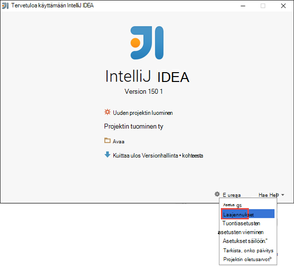
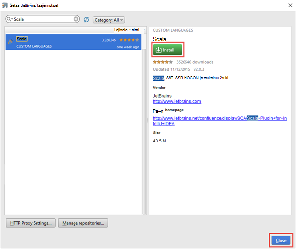
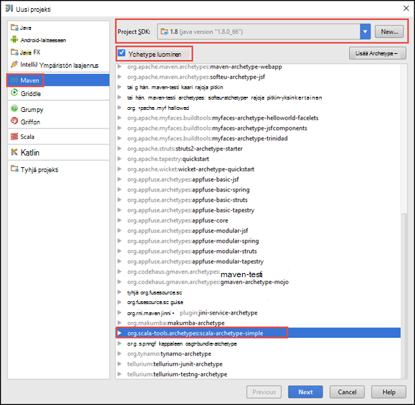
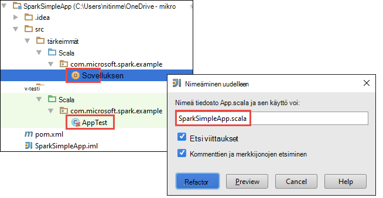
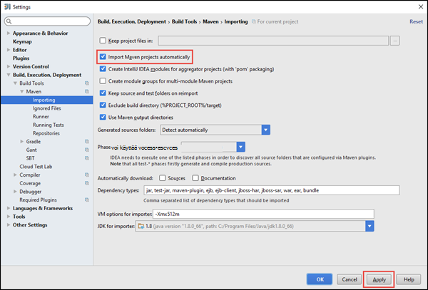
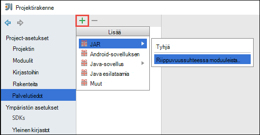
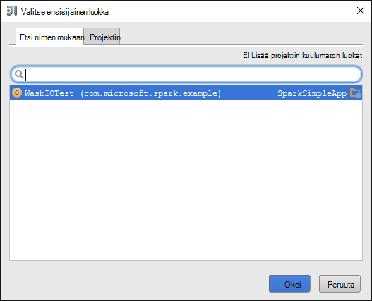
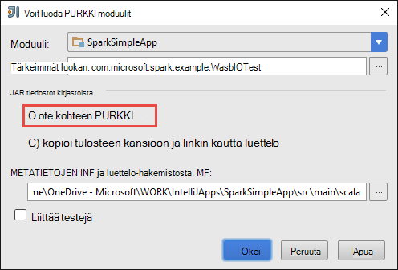
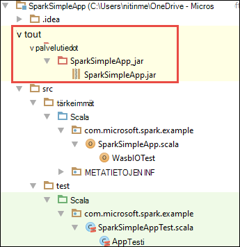

<properties
    pageTitle="Luo erillisen scala sovellukset toimimaan HDInsight ohjattu klustereiden | Microsoft Azure"
    description="Opettele luomaan yksittäisen ohjattu sovelluksen HDInsight ohjattu klustereiden."
    services="hdinsight"
    documentationCenter=""
    authors="nitinme"
    manager="jhubbard"
    editor="cgronlun"
    tags="azure-portal"/>

<tags
    ms.service="hdinsight"
    ms.workload="big-data"
    ms.tgt_pltfrm="na"
    ms.devlang="na"
    ms.topic="article"
    ms.date="10/28/2016"
    ms.author="nitinme"/>

# Yksittäisen Scala sovelluksessa Apache ohjattu klusterissa HDInsight Linux luominen

Tässä artikkelissa on vaiheittaiset ohjeet Scala kirjoitetut erillinen ohjattu sovellusten kehittämisestä käyttäminen IntelliJ VERRATA maven-testi. Artikkelin käyttää Apache maven-testi muodosta-järjestelmää ja alkaa aiemmin maven-testi-archetype Scala IntelliJ VERRATA myöntämä varten.  Ylätason, milloin luomisesta Scala IntelliJ VERRATA sovellus edellyttää seuraavasti:

* Määritä muodosta järjestelmän maven-testi.
* Voit ratkaista ohjattu moduulin riippuvuudet projektin Object Model (POM)-tiedoston päivittämistä.
* Kirjoita sovelluksesi Scala.
* Luo purkki tiedosto, joka voidaan lähettää HDInsight ohjattu klustereiden.
* Suorita Ohjattu klusterin käyttämällä Livy sovellus.

>[AZURE.NOTE] Hdinsightista on myös IntelliJ VERRATA laajennuksen-työkalun helpottaa luominen ja lähettäminen ohjattu HDInsight-klusterin Linux-sovellukset. Lisätietoja on artikkelissa [Käytä HDInsight Työkalut ‑laajennuksen IntelliJ KANNATTAA luoda ja lähettää ohjattu sovellukset](hdinsight-apache-spark-intellij-tool-plugin.md).

**Edellytykset**

* Azure tilaus. Katso [Hae Azure maksuttoman kokeiluversion](https://azure.microsoft.com/documentation/videos/get-azure-free-trial-for-testing-hadoop-in-hdinsight/).
* Apache Ohjattu klusterin HDInsight Linux. Ohjeita on artikkelissa [Azure Hdinsightiin luominen Apache ohjattu varausyksiköt](hdinsight-apache-spark-jupyter-spark-sql.md).
* Oracle Java Development kit. Voit asentaa sen [täältä](http://www.oracle.com/technetwork/java/javase/downloads/jdk8-downloads-2133151.html).
* Java IDE. Tässä artikkelissa käytetään IntelliJ VERRATA 15.0.1. Voit asentaa sen [täältä](https://www.jetbrains.com/idea/download/).

## Scala laajennuksen asentaminen IntelliJ IDEA

Jos IntelliJ VERRATA asennuksen ei pyydä Scala-laajennusten ottaminen käyttöön, Käynnistä IntelliJ VERRATA ja siirry seuraaviin vaiheisiin Asenna laajennus:

1. Käynnistä IntelliJ VERRATA ja valitse aloitusnäyttö **määrittäminen** ja valitse sitten **laajennukset**.

    

2. Valitse seuraavassa näytössä **JetBrains Asenna laajennus** -vasemmassa alakulmassa. Joka avaa **Selaa JetBrains laajennukset** -valintaikkunassa Scala Etsi ja valitse sitten **Asenna**.

    

3. Kun laajennus on asennettu onnistuneesti, napsauta käynnistämään IDE **IntelliJ VERRATA Käynnistä-painiketta** .

## Erillinen Scala projektin luominen

1. Käynnistä IntelliJ VERRATA ja luo uusi projekti. Uusi projekti-valintaikkunassa seuraavaa asetusta ja valitse sitten **Seuraava**.

    

    * Valitse **maven-testi** projektityyppi.
    * Määritä **projektin SDK**. Valitse uusi ja siirry asennuksen Java-hakemiston yleensä `C:\Program Files\Java\jdk1.8.0_66`.
    * Valitse **Luo archetype** .
    * Valitse **org.scala-tools.archetypes:scala-archetype-yksinkertaista**archetypes-luettelosta. Tämä luo oikean kansiorakenne ja lataa pakollinen riippuvuuksien kirjoittaa Scala ohjelma.

2. Anna tarvittavat arvot **Ryhmätunnus**, **ArtifactId**ja **versio**. Valitse **Seuraava**.

3. Valitse seuraavassa valintaikkunassa, jossa voit määrittää maven-testi pääkansion ja muut käyttäjän, hyväksy oletusarvot ja valitse **Seuraava**.

4. Valitse viimeisen-valintaikkunassa Määritä projektinimi ja tallennussijainti ja valitse sitten **Valmis**.

5. Poista **src\test\scala\com\microsoft\spark\example** **MySpec.Scala** tiedosto. Sinun ei tarvitse tämän sovelluksen.

6. Tarvittaessa nimetä lähde- ja -tiedostoja. Siirry IntelliJ VERRATA vasemmasta ruudusta **src\main\scala\com.microsoft.spark.example**. **App.scala**hiiren kakkospainikkeella, valitsemalla **Refactor**, valitse Nimeä uudelleen-tiedosto ja -valintaikkunassa sovelluksen uusi nimi ja valitse sitten **Refactor**.

      

7. Seuraavat vaiheet päivittyy, voit määrittää riippuvuuksia ohjattu Scala sovelluksen pom.xml. Näiden riippuvuuksien lataamisen ja ratkaista automaattisesti sinun on määritettävä maven-testi vastaavasti.

    

    1. Valitse **Tiedosto** -valikossa **asetukset**.
    2. Avaa **asetukset** -valintaikkunassa valitse **luominen, suorittaminen, käyttöönoton** > **Luominen Työkalut** > **maven-testi** > **tuominen**.
    3. Valitse **Tuo maven-testi projektit automaattisesti**.
    4. Valitse **Käytä**ja valitse sitten **OK**.

8. Päivitä Scala lähdetiedosto sisältämään sovelluksen-koodin. Avaa Korvaa aiemmin luotu sample code seuraava koodi ja Tallenna muutokset. Koodi lukee tiedot (käytettävissä kaikissa HDInsight ohjattu klustereiden), HVAC.csv hakee rivit, jotka on vain yksi numero kuudennesta sarakkeessa ja kirjoittaa tulosteen **/HVACOut** klusterin oletusarvo-tallennustilan säilö-kohdassa.

        package com.microsoft.spark.example

        import org.apache.spark.SparkConf
        import org.apache.spark.SparkContext

        /**
          * Test IO to wasb
          */
        object WasbIOTest {
          def main (arg: Array[String]): Unit = {
            val conf = new SparkConf().setAppName("WASBIOTest")
            val sc = new SparkContext(conf)

            val rdd = sc.textFile("wasbs:///HdiSamples/HdiSamples/SensorSampleData/hvac/HVAC.csv")

            //find the rows which have only one digit in the 7th column in the CSV
            val rdd1 = rdd.filter(s => s.split(",")(6).length() == 1)

            rdd1.saveAsTextFile("wasbs:///HVACout")
          }
        }

9. Päivitä pom.xml.

    1.  Sisällä `<project>\<properties>` Lisää seuraava teksti:

            <scala.version>2.10.4</scala.version>
            <scala.compat.version>2.10.4</scala.compat.version>
            <scala.binary.version>2.10</scala.binary.version>

    2. Sisällä `<project>\<dependencies>` Lisää seuraava teksti:

            <dependency>
              <groupId>org.apache.spark</groupId>
              <artifactId>spark-core_${scala.binary.version}</artifactId>
              <version>1.4.1</version>
            </dependency>

    Tallenna muutokset pom.xml.

10. Luo .jar-tiedosto. IntelliJ VERRATA mahdollistaa PURKKI luominen Palvelutietojen projektin nimellä. Suorita seuraavat vaiheet.

    1. Valitse **Tiedosto** -valikosta **Projektirakenne**.
    2. **Projektirakenne** -valintaikkunassa valitse **tiedot** ja valitse sitten plus-merkkiä. Ponnahdusikkunoiden-valintaikkunassa valitse **JAR**ja valitse sitten **moduuleista riippuvuussuhteessa**.

        

    3. Valitse **Luo JAR moduuleista** -valintaikkunan jossa on kolme pistettä ( ) vastaan **Pää-luokka**.

    4. **Valitse pääikkunassa luokka** -valintaikkunassa valitse luokka, joka avautuu, ja valitse sitten **OK**.

        

    5. **Luo JAR moduuleista** -valintaikkunassa Varmista, että **kohde PURKKI** Pura vaihtoehto on valittuna ja valitse sitten **OK**. Tämä valinta luo yksittäinen PURKKI sisältää kaikki riippuvuudet.

        

    6. Tulosteen asettelu-välilehti on lueteltu kaikki tölkki, jotka ovat maven-testi projektin mukana. Voit valita ja poistaa niistä joina Scala-sovelluksessa ei ole suoraa riippuvuuden. Tässä luodaan sovelluksen, voit poistaa kaikki muut paitsi viimeinen jokin (**SparkSimpleApp Käännä tuloste**). Valitse tölkki ja valitse sitten **Poista** -kuvaketta.

        

        Varmista, että **Muodosta tehdä** -valintaruutu on valittuna, jossa varmistetaan, että purkkiin luodaan aina, kun projektin sisäisten tai päivittää. Valitse **Käytä** ja valitse sitten **OK**.

    7. Valikkoriviltä valitsemalla **Muodosta**, ja valitse sitten **Tee projektin**. Voit myös napsauttaa **Muodosta palvelutiedot** purkkiin luomiseen. Tulosteen purkkiin luodaan **\out\artifacts**.

        

## Suorita Ohjattu klusterin sovellus

Klusterin sovelluksen käyttämiseen, toimi seuraavasti:

* **Kopioi sovelluksen purkkiin ja tallennustilaa Azure-blob** liittyvän klusterin. [**AzCopy**](../storage/storage-use-azcopy.md), komentorivi-apuohjelman avulla voit tehdä. Liittyy monia muita asiakkaat, joiden avulla voit ladata tietoja. Voit etsiä lisää niistä Lisää osoitteessa [Lataa tiedot Hadoop projekteille Hdinsightista](hdinsight-upload-data.md).

* **Käytä Livy lähettää sovelluksen työn etäyhteyden** ohjattu-klusteriin. Ohjattu klustereiden HDInsight-sisältää Livy, joka paljastaa muiden päätepisteet lähettää etäyhteyden ohjattu työt. Lisätietoja on artikkelissa [Lähetä ohjattu työt käyttämällä etäyhteyden Livy ohjattu klustereiden HDInsight-kanssa](hdinsight-apache-spark-livy-rest-interface.md).

## Katso myös

* [Yleistä: Apache ohjattu-Azure Hdinsightiin](hdinsight-apache-spark-overview.md)

### Skenaariot

* [Ohjattu BI: vuorovaikutteinen tietojen analysoinnissa ohjattu käyttäminen HDInsight kanssa Liiketoimintatieto-työkaluista](hdinsight-apache-spark-use-bi-tools.md)

* [Ohjattu koneen Learning kanssa: Käytä ohjattu-HDInsight rakennuksen lämpötilan LVI tietojen analysointiin](hdinsight-apache-spark-ipython-notebook-machine-learning.md)

* [Ohjattu koneen Learning kanssa: Käytä ohjattu elintarvikkeiden tulokset ennustetaan HDInsight-](hdinsight-apache-spark-machine-learning-mllib-ipython.md)

* [Ohjattu virtautetun median: Käytä ohjattu HDInsight reaaliaikainen streaming sovellusten luomiseen:](hdinsight-apache-spark-eventhub-streaming.md)

* [Sivuston log analyysi ohjattu käyttäminen Hdinsightiin](hdinsight-apache-spark-custom-library-website-log-analysis.md)

### Luominen ja suorittaminen sovellukset

* [Suorita työt etäyhteyden käyttämällä Livy ohjattu klusterissa](hdinsight-apache-spark-livy-rest-interface.md)

### Työkalut ja laajennukset

* [HDInsight Työkalut ‑laajennuksen IntelliJ VERRATA avulla voit luoda ja lähettää ohjattu Scala sovelluksia](hdinsight-apache-spark-intellij-tool-plugin.md)

* [Ohjattu sovellusten virheenkorjaus etäyhteyden HDInsight Työkalut ‑laajennuksen IntelliJ VERRATA avulla](hdinsight-apache-spark-intellij-tool-plugin-debug-jobs-remotely.md)

* [Ohjattu klusterin HDInsight-Zeppelin muistikirjojen käyttäminen](hdinsight-apache-spark-use-zeppelin-notebook.md)

* [Ytimet käytettävissä Jupyter muistikirjan Ohjattu-klusterin Hdinsightiin](hdinsight-apache-spark-jupyter-notebook-kernels.md)

* [Ulkoiset pakettien käyttäminen Jupyter muistikirjat](hdinsight-apache-spark-jupyter-notebook-use-external-packages.md)

* [Asenna tietokoneeseen Jupyter ja muodosta yhteys ohjattu HDInsight-klusterin](hdinsight-apache-spark-jupyter-notebook-install-locally.md)

### Resurssien hallinta

* [Resurssien Azure Hdinsightiin Apache Ohjattu-klusterin](hdinsight-apache-spark-resource-manager.md)

* [Raita- ja Apache ohjattu töitä klusterin Hdinsightiin](hdinsight-apache-spark-job-debugging.md)
