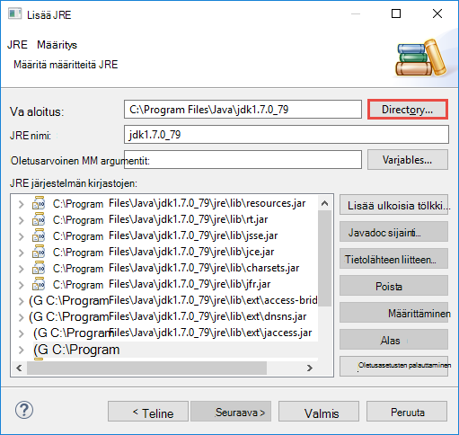

 <properties
    pageTitle="Ohjattu Scala sovellusten Azure työkalujen HDInsight-työkalujen käyttäminen Pimennys | Microsoft Azure"
    description="Opettele luomaan yksittäisen ohjattu sovelluksen HDInsight ohjattu klustereiden."
    services="hdinsight"
    documentationCenter=""
    authors="nitinme"
    manager="jhubbard"
    editor="cgronlun"
    tags="azure-portal"/>

<tags
    ms.service="hdinsight"
    ms.workload="big-data"
    ms.tgt_pltfrm="na"
    ms.devlang="na"
    ms.topic="article"
    ms.date="08/30/2016"
    ms.author="nitinme"/>

# Ohjattu sovellusten HDInsight ohjattu Linux-klusterin luominen varten Pimennys työkalujen Azure HDInsight työkalujen avulla

Tässä artikkelissa on vaiheittaiset ohjeet ohjattu kehityssovellusten kirjoitettu Scala ja lähettää sen HDInsight-Ohjattu klusterin HDInsight työkalujen käyttäminen Azure työkalujen Pimennys varten. Voit käyttää työkaluja muutamalla eri tavalla:

* Kehittämään ja esittää Scala ohjattu HDInsight ohjattu-klusterissa
* Voit käyttää Azure Hdinsightiin Ohjattu klusterin-resurssit
* Kehittämään ja suorittaa Scala ohjattu sovelluksen paikallisesti

>[AZURE.IMPORTANT] Tämän työkalun avulla voidaan luoda ja lähettää vain ohjattu HDInsight-klusterin Linux-sovellukset.

##Edellytykset

* Azure tilaus. Katso [Hae Azure maksuttoman kokeiluversion](https://azure.microsoft.com/documentation/videos/get-azure-free-trial-for-testing-hadoop-in-hdinsight/).

* Apache Ohjattu klusterin HDInsight Linux. Ohjeita on artikkelissa [Azure Hdinsightiin luominen Apache ohjattu varausyksiköt](hdinsight-apache-spark-jupyter-spark-sql.md).

* Oracle Java Development kit 7 ja 8 versio. 
    * **Java SDK 7** käytetään kääntäminen ohjattu projektien HDInsight-klustereiden tukea Java versio 7. Voit ladata Java SDK 7 [täältä](http://www.oracle.com/technetwork/java/javase/downloads/jdk7-downloads-1880260.html).
    * **Java SDK 8** käytetään Pimennys IDE runtime. Voit ladata sen [täältä](http://www.oracle.com/technetwork/java/javase/downloads/jdk8-downloads-2133151.html).

* Pimennys IDE. Tässä artikkelissa käytetään Pimennys Neon. Voit asentaa sen [täältä](https://www.eclipse.org/downloads/).

* Scala IDE Pimennys varten. 
    * **Jos sinulla on asennettu Pimennys IDE**, voit lisätä Scala IDE-laajennus valitsemalla **Ohje** -> **Asentaa ohjelmiston**ja lisää [http://download.scala-ide.org/sdk/lithium/e44/scala211/stable/site](http://download.scala-ide.org/sdk/lithium/e44/scala211/stable/site) lataamaan Scala ‑laajennuksen Pimennys tietolähteeksi. 
    * **Jos sinulla ei ole asennettu Pimennys IDE**, voit asentaa Scala IDE [suoraan täältä](http://scala-ide.org/download/sdk.html). Voit ladata tämän linkin .zip-tiedosto, purkaa, Selaa kansioon, **/eclipse** ja suorita **eclipse.exe** tiedosto sieltä.
    
    >[AZURE.NOTE] Ohjeita tämän asiakirjan perustuvat Pimennys IDE käyttäminen Scala laajennus on asennettu.

* Ohjattu SDK. Voit ladata sen [täältä](http://go.microsoft.com/fwlink/?LinkID=723585&clcid=0x409).

* Asenna e (fx) clipse [https://www.eclipse.org/efxclipse/install.html](https://www.eclipse.org/efxclipse/install.html).

## Asenna HDInsight Työkalut Azure Työkalut Pimennys varten

HDInsight Työkalut Pimennys on saatavana osana Azure-työkalujen Pimennys varten. Katso ohjeet asentamisesta Azure-työkalujen [asentamista varten Pimennys Azure-Työkalut](../azure-toolkit-for-eclipse-installation.md).

## Kirjaudu sisään Azure tilauksen

1. Käynnistä Pimennys IDE ja avaa Resurssienhallinta Azure. Valitse **Näytä** ja valitse sitten **Muut**IDE **ikkuna** -valikossa. Valintaikkunassa, joka avautuu Laajenna **Azure**, **Azure**hallinta ja valitse sitten **OK**.

    

2. Napsauta hiiren kakkospainikkeella **Azure Explorer** **Azure** -solmu ja valitse sitten **Tilausten hallinta**.

3. **Tilausten hallinta** -valintaikkunassa valitse **Kirjaudu sisään** ja anna Azure tunnistetiedot.

    

4. Kun olet kirjautunut sisään, Azure tilaukset liittyvät käyttöoikeustiedot näkyvät **Tilausten hallinta** -valintaikkunassa. Valitse **Sulje** -valintaikkunassa.

5. Laajenna **HDInsight** Nähdäksesi HDInsight ohjattu varausyksiköiden kohdassa tilauksen Azure hallinta-välilehti.

    

6. Voit laajentaa edelleen klusterin nimi solmun Nähdäksesi klusterin liittyvät resurssit (esimerkiksi tallennustilan-tilit).

    

## Ohjattu HDInsight-klusterin ohjattu Scala projektin määrittäminen

1. Pimennys IDE työ-tilasta valitsemalla **Tiedosto**, **Uusi**ja valitse sitten **Projekti**. 

2. **Uuden projektin** ohjatun Laajenna **HDInsight**, valitse **Ohjattu HDInsight (Scala),**ja valitse sitten **Seuraava**.

    

3. **Uusi HDInsight Scala projekti** -valintaikkunassa Anna tai valitse arvot alla olevassa kuvassa esitetyllä tavalla ja valitse sitten **Seuraava**.

    

    * Kirjoita projektin nimi.
    * Varmista **JRE** -ruudussa **Käytä suorittamisen ympäristössä JRE** on määritetty **JavaSE 1.7**.
    * Varmista, että ohjattu SDK on määritetty haluamaasi kohtaan, johon olet ladannut SDK. Linkki latauspaikka sisältyy [edellytykset](#prerequisites) tämän ohjeaiheen. Voit ladata SDK tässä valintaikkunassa-linkistä, yllä olevan kuvan mukaisesti.    

4. Seuraava-valintaikkunassa valitse **kirjastot** -välilehti ja kaksoisnapsauta sitten **JRE järjestelmän kirjaston [JavaSE 1.7]**.

    

5. Varmista **Muokkaa kirjaston** -valintaikkunan **Suorittamisen ympäristö** on määritetty **JavaSE-1.7(jdk1.7.0_79)**. Jos tämä ei ole käytettävissä, noudata seuraavia ohjeita.

    1. **Vaihtoehtoinen JRE** -vaihtoehdon ja jos **JavaSE-1.7(jdk1.7.0_79)** on saatavilla.
    2. Muussa tapauksessa **Asennettu JREs** -painiketta.

          

    3. **Asennettu JREs** -valintaikkunassa valitsemalla **Lisää**.

            

    4. Valitse **Vakio AM** **JRE tyyppi** -valintaikkunassa ja valitse sitten **Seuraava**

            

    5. **JRE määritys** -valintaikkunassa kansio, ja siirry JDK 7-asennuksen sijainti ja valitse **jdk1.7.0_79**pääkansioon.

            

    6. Valitse **Valmis**. **Asennettu JREs** -valintaikkunassa valitse lisätyn JRE ja valitse sitten **OK**.

           

    7. Lisätyn JRE luettelossa pitäisi näkyä **Suorittamisen**-ympäristössä. Valitse **Valmis**.

           

6. Takaisin **kirjastot** -välilehdessä kaksoisnapsauttamalla **Scala kirjaston säilö [2.11.8]**. Valitse **Muokkaa kirjasto** -valintaikkunassa **Kiinteä Scala kirjaston säilö: 2.10.6**. 

    

    Ennen kuin suljet projektin asetukset-valintaikkunassa, valitse **Valmis** .

## Ohjattu HDInsight-klusterin Scala-sovelluksen luominen

1. Jo avoinna Pimennys IDE- **Paketin Explorer**-Laajenna aiemmin luotu projekti, **src**hiiren kakkospainikkeella, valitse **Uusi**ja valitse **Muu**.

2. **Valitse ohjattu toiminto** -valintaikkunassa Laajenna **Scala ohjatut toiminnot**, valitse **Scala objekti**ja valitse sitten **Seuraava**.

    

3. **Luo uusi tiedosto** -valintaikkunassa objektin nimi ja valitse sitten **Valmis**.

    

4. Liitä seuraava koodi tekstieditorissa.

        import org.apache.spark.SparkConf
        import org.apache.spark.SparkContext
    
        object MyClusterApp{
          def main (arg: Array[String]): Unit = {
            val conf = new SparkConf().setAppName("MyClusterApp")
            val sc = new SparkContext(conf)
        
            val rdd = sc.textFile("wasbs:///HdiSamples/HdiSamples/SensorSampleData/hvac/HVAC.csv")
        
            //find the rows which have only one digit in the 7th column in the CSV
            val rdd1 =  rdd.filter(s => s.split(",")(6).length() == 1)
        
            rdd1.saveAsTextFile("wasbs:///HVACOut")
          }     
        }

5. Suorita ohjattu HDInsight-klusterin sovelluksen.

    1. **Paketin Explorer**projektin nimeä hiiren kakkospainikkeella ja valitse sitten **Lähetä ohjattu sovelluksen Hdinsightista**.      

    2. **Ohjattu lähetyksen** -valintaikkunassa on seuraavat arvot.

        * Valitse **Klusterinimi**, jonka haluat suorittaa sovelluksen HDInsight Ohjattu klusterin.

        * Sinun täytyy Valitse Palvelutietojen Pimennys projektista, tai valitse vaihtoehto kiintolevylle.

        * **Tärkeimmät luokkanimi** -ruutuun vastaan Kirjoita koodissa määritetyn objektin nimi (Katso alla olevassa kuvassa).

            

        * Koska tässä esimerkissä sovelluskoodia ei vaadi komentoriviargumentit tai viitata tölkki tai tiedostot, voit jättää jäljellä olevat ruudut tyhjäksi.

        * Valitse **Lähetä**.

    3. **Ohjattu lähetys** -välilehden Käynnistä näyttäminen edistymisen. Voit lopettaa sovelluksen punainen vaihtoehdon "Ohjattu lähetyksen"-ikkunassa. Voit myös tarkastella tietyn sovelluksen suorittaminen (merkitty kuvassa sininen-ruutu) maapallokuvake napsauttamalla lokit.

        

    Seuraavassa osassa kerrotaan käyttäminen työn tulosteen HDInsight-työkalujen käyttäminen Azure työkalujen Pimennys varten.

## Voit hallita HDInsight ohjattu varausyksiköt työkalujen Azure HDInsight-Työkalut käyttäminen Pimennys ja käyttää

Voit suorittaa erilaisia toimintoja käyttämällä HDInsight-työkalut.

### Klusterin käyttöoikeuden tallennustilan säilö

1. Azure Explorerista Laajenna **HDInsight** pääkansion solmu löydät luettelon HDInsight ohjattu klustereiden, jotka ovat käytettävissä.

3. Laajenna tallennustilan tilin ja klusterin oletusarvo-tallennustilan säiliön klusterinimeä.

    

4. Valitse liittyvä klusterin tallennustilan säilö nimi. Oikeanpuoleisessa ruudussa pitäisi näkyä **HVACOut**-nimiseen kansioon. Avaa kansio ja kaksoisnapsauta näkyy **osa -*** tiedostot. Avaa jokin nähdä tulosteen sovelluksen kyseiset tiedostot.

### Accessin ohjattu historia-palvelin

1. **Azure Explorer**ohjattu-klusterinimeä hiiren kakkospainikkeella ja valitse sitten **Avaa ohjattu historia-Käyttöliittymä**. Kirjoita pyydettäessä klusterin järjestelmänvalvojan tunnistetietoja. Sinun on määritettävä nämä varattaessa klusterin.

2. Ohjattu historia palvelimen raporttinäkymät-ikkunassa, voit etsiä sovelluksen olet juuri valmis käyttämällä sovelluksen nimeä. Yllä olevan koodin, voit määrittää sovelluksen nimen käyttämällä `val conf = new SparkConf().setAppName("MyClusterApp")`. Näin ollen ohjattu sovelluksen nimi on **MyClusterApp**.

### Käynnistä Ambari-portaalissa

**Azure Explorer**ohjattu-klusterinimeä hiiren kakkospainikkeella ja valitse sitten **Avaa klusterin hallinta-portaalin (Ambari)**. Kirjoita pyydettäessä klusterin järjestelmänvalvojan tunnistetietoja. Sinun on määritettävä nämä varattaessa klusterin.

### Azure-tilausten hallinta

Oletusarvon mukaan varten Pimennys työkalujen Azure HDInsight-Työkalut luettelo ohjattu varausyksiköiden from Azure tilauksistasi. Tarvittaessa voit määrittää, jossa haluat käyttää klusterin tilaukset. **Azure Explorer** **Azure** pääsolmuksi hiiren kakkospainikkeella ja valitse sitten **Tilausten hallinta**. Valintaikkunassa Poista valintaruutujen valinta, jos vastaan tilauksen, joita et halua käyttää ja valitse sitten **Sulje**. Voit valita myös **Kirjaudu ulos** , jos haluat kirjautua ulos Azure tilauksesta.

## Suorita ohjattu Scala sovelluksen paikallisesti

Voit varten Pimennys työkalujen Azure HDInsight-Työkalut suorittaa ohjattu Scala sovelluksia paikallisesti työasemalle. Yleensä näiden sovellusten ei on pääsy klusteriresurssit, kuten tallennustilan säiliön ja voidaan suorittaa ja testattu paikallisesti.

### Edellytyksenä

Esitettävän paikallisen ohjattu Scala-sovelluksen Windows-tietokoneessa, saatat saada poikkeuksen [OHJATTU 2356](https://issues.apache.org/jira/browse/SPARK-2356) , joka ilmenee vuoksi puuttuu **WinUtils.exe** Windows-Käyttöjärjestelmää-artikkelissa kuvatulla tavalla. Voit kiertää tämän virheen, sinun täytyy [ladata tästä suoritettavan tiedoston](http://public-repo-1.hortonworks.com/hdp-win-alpha/winutils.exe) sijaintiin, kuten **C:\WinUtils\bin**. Valitse on Lisää ympäristömuuttuja **HADOOP_HOME** ja arvo muuttujan **C\WinUtils**.

### Suorita ohjattu Scala paikallisen sovelluksen  

1. Käynnistä Pimennys ja luo uusi projekti. Uusi projekti-valintaikkunassa seuraavaa asetusta ja valitse sitten **Seuraava**.

    

    * Valitse vasemmanpuoleisessa ruudussa **Hdinsightista**.
    * Valitse oikeanpuoleisen ruudun **Ohjattu-HDInsight paikallisen Suorita otoksen (Scala)**.
    * Valitse **Seuraava**.

2. Projektitiedot antamaan noudattamalla vaiheet 3 – 6, kuten [Ohjattu Scala sovelluksen projektin ohjattu HDInsight-klusterin määrittäminen](#set-up-a-spark-scala-application-project-for-an-hdinsight-spark cluster)aiemmissa osassa.

3. Mallin Lisää **src** -kansiossa, joita voit suorittaa paikallisesti tietokoneen esimerkkikoodi (**LogQuery**).

    

4.  **LogQuery** -sovelluksen napsauttamalla hiiren kakkospainikkeella, valitse **Suorita nimellä**ja valitse sitten **1 Scala sovelluksen**. Näkyviin tulee tulos tältä alareunassa **Console** -välilehdessä.

    

## Palaute ja tunnetut ongelmat

Tarkastelemasi ohjattu tulostaa suoraan ei tueta ja yritämme, valitse.

Jos sinulla on kaikki ehdotuksia ja palautetta tai jos käytössä ilmenee ongelmia, kun käytät tätä työkalua, vapaasti pudota us sähköpostiviestin hdivstool microsoft piste com-palvelussa.

## Katso myös

* [Yleistä: Apache ohjattu-Azure Hdinsightiin](hdinsight-apache-spark-overview.md)

### Skenaariot

* [Ohjattu BI: vuorovaikutteinen tietojen analysoinnissa ohjattu käyttäminen HDInsight kanssa Liiketoimintatieto-työkaluista](hdinsight-apache-spark-use-bi-tools.md)

* [Ohjattu koneen Learning kanssa: Käytä ohjattu-HDInsight rakennuksen lämpötilan LVI tietojen analysointiin](hdinsight-apache-spark-ipython-notebook-machine-learning.md)

* [Ohjattu koneen Learning kanssa: Käytä ohjattu elintarvikkeiden tulokset ennustetaan HDInsight-](hdinsight-apache-spark-machine-learning-mllib-ipython.md)

* [Ohjattu virtautetun median: Käytä ohjattu HDInsight reaaliaikainen streaming sovellusten luomiseen:](hdinsight-apache-spark-eventhub-streaming.md)

* [Sivuston log analyysi ohjattu käyttäminen Hdinsightiin](hdinsight-apache-spark-custom-library-website-log-analysis.md)

### Luominen ja suorittaminen sovellukset

* [Luo erillisen-sovelluksen käyttäminen Scala](hdinsight-apache-spark-create-standalone-application.md)

* [Suorita työt etäyhteyden käyttämällä Livy ohjattu klusterissa](hdinsight-apache-spark-livy-rest-interface.md)

### Työkalut ja laajennukset

* [HDInsight-työkalujen käyttäminen Azure työkalujen IntelliJ, voit luoda ja lähettää ohjattu Scala sovelluksia](hdinsight-apache-spark-intellij-tool-plugin.md)

* [Virheenkorjaus ohjattu sovellusten etäyhteyden Azure Työkalut, IntelliJ HDInsight-työkalujen avulla](hdinsight-apache-spark-intellij-tool-plugin-debug-jobs-remotely.md)

* [Ohjattu klusterin HDInsight-Zeppelin muistikirjojen käyttäminen](hdinsight-apache-spark-use-zeppelin-notebook.md)

* [Ytimet käytettävissä Jupyter muistikirjan Ohjattu-klusterin Hdinsightiin](hdinsight-apache-spark-jupyter-notebook-kernels.md)

* [Ulkoiset pakettien käyttäminen Jupyter muistikirjat](hdinsight-apache-spark-jupyter-notebook-use-external-packages.md)

* [Asenna tietokoneeseen Jupyter ja muodosta yhteys ohjattu HDInsight-klusterin](hdinsight-apache-spark-jupyter-notebook-install-locally.md)

### Resurssien hallinta

* [Resurssien Azure Hdinsightiin Apache Ohjattu-klusterin](hdinsight-apache-spark-resource-manager.md)

* [Raita- ja Apache ohjattu töitä klusterin Hdinsightiin](hdinsight-apache-spark-job-debugging.md)
