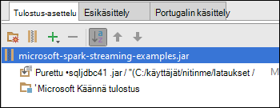

<properties 
    pageTitle="Azure tapahtuman keskittimet käyttäminen Apache ohjattu HDInsight-streaming tietojen käsittelyä | Microsoft Azure" 
    description="Vaiheittaiset ohjeet tietojen lähettämisestä virtauttaa Azure tapahtuman keskittimeen ja vastaanottaa tapahtumat sitten ohjattu scala-sovelluksesta" 
    services="hdinsight" 
    documentationCenter="" 
    authors="nitinme" 
    manager="jhubbard" 
    editor="cgronlun"
    tags="azure-portal"/>

<tags 
    ms.service="hdinsight" 
    ms.workload="big-data" 
    ms.tgt_pltfrm="na" 
    ms.devlang="na" 
    ms.topic="article" 
    ms.date="09/30/2016" 
    ms.author="nitinme"/>

# Ohjattu virtautetun median: Prosessin tapahtumia Azure tapahtuman lihavoituna Apache Ohjattu klusterin HDInsight Linux

Ohjattu Streaming laajentaa core ohjattu Ohjelmointirajapinnan skaalattava, suuri siirtonopeuden, vikasietoinen stream käsittely-sovelluksia. Tietoja voi nautittuina useista lähteistä. Tässä artikkelissa Käytämme Azure tapahtuman keskittimet ingest tiedot. Tapahtuman keskittimet on erittäin skaalattava nieltynä järjestelmä kyseisen tapahtumien sekunnissa can saanti miljoonia. 

Tässä opetusohjelmassa opit luomaan Azure tapahtumaa toiminnossa ingest viestien console-sovelluksesta Java-tapahtuma-keskittimeen ja tarkastella niitä rinnakkain Scala kirjoitetut ohjattu-sovelluksesta. Tämän sovelluksen siinä käytetään virtauttaa kautta tapahtuman keskittimet tiedot ja reitittää eri tulostus (Azure Blob-objektien tallennustilaan, rakennetaulukko ja SQL-taulukko).

> [AZURE.NOTE] Tämän artikkelin ohjeiden, sinun on käytettävä Azure-portaalin molemmat versiot. Voit luoda tapahtumaa-toiminnossa käytetään [Azure perinteinen portal](https://manage.windowsazure.com). Toimimaan HDInsight Ohjattu klusterin käyttävät [Azure-portaalissa](https://portal.azure.com/).  

**Edellytykset:**

Tarvitset seuraavat:

- Azure tilaus. Katso [Hae Azure maksuttoman kokeiluversion](https://azure.microsoft.com/documentation/videos/get-azure-free-trial-for-testing-hadoop-in-hdinsight/).
- Ohjattu Apache-klusterin. Ohjeita on artikkelissa [Azure Hdinsightiin luominen Apache ohjattu varausyksiköt](hdinsight-apache-spark-jupyter-spark-sql.md).
- Oracle Java Development kit. Voit asentaa sen [täältä](http://www.oracle.com/technetwork/java/javase/downloads/jdk8-downloads-2133151.html).
- Java IDE. Tässä artikkelissa käytetään IntelliJ VERRATA 15.0.1. Voit asentaa sen [täältä](https://www.jetbrains.com/idea/download/).
- SQL Server-ohjain Microsoft JDBC v4.1 tai uudempi versio. Tämä edellyttää kirjoittaa tapahtumatietoja SQL Server-tietokantaan. Voit asentaa sen [täältä](https://msdn.microsoft.com/sqlserver/aa937724.aspx).
- Azure SQL-tietokantaan. Katso ohjeet [Luo minuutteina SQL-tietokantaan](../sql-database/sql-database-get-started.md).

## Mitä tämä ratkaisu tarkoittaa?

Miten streaming ratkaisu jatkuu seuraavat asiat:

1. Azure tapahtumaa-toiminnossa, joka vastaanottaa stream tapahtumien luominen

2. Suorita paikallisen erillisen sovelluksen, joka luo tapahtumia ja vie Azure tapahtumaa-toiminnossa. Esimerkki sovellus, joka tekee tämän on julkaistu [https://github.com/hdinsight/spark-streaming-data-persistence-examples](https://github.com/hdinsight/spark-streaming-data-persistence-examples).

2. Suorittaa streaming sovelluksen etäyhteyden ohjattu klusterissa, joka lukee streaming tapahtumien Azure tapahtuma-toiminnosta ja vie eri sijainneissa (Azure-Blob, rakennetaulukko ja SQL-tietokannan taulukkoa). 

## Luo Azure tapahtumaa-toiminnossa

1. [Azure-portaaliin](https://manage.windowsazure.com)ja valitse **Uusi** > **Palvelun Bus** > **Tapahtumaa-toiminnossa** > **Mukautettu luominen**.

2. **Lisää uusi tapahtuma-toiminnossa** näytössä Kirjoita **Tapahtuman keskittimeen nimi**- **alueen** luominen-toiminnossa ja luo uusi nimitilan tai valitse aiemmin luotu. Napsauta **nuolta** ja jatka.

    ![ohjatun toiminnon sivu 1] (./media/hdinsight-apache-spark-eventhub-streaming/hdispark.streaming.create.event.hub.png "Luo Azure tapahtumaa-toiminnossa")

    > [AZURE.NOTE] Valitse samaan **sijaintiin** kuin Apache Ohjattu-klusterin-HDInsight vähentää viive ja kustannukset.

3. **Määritä tapahtumaa-toiminnossa** näytössä **osion Laske** - ja **Viestin säilytys** arvot ja valitse sitten valintamerkkiä. Tässä esimerkissä käytetään 10 osion laskeminen ja 1 viestin säilyttäminen. Huomautus osion määrä, koska tarvitset tätä arvoa myöhemmin.

    ![ohjatun toiminnon sivulla 2] (./media/hdinsight-apache-spark-eventhub-streaming/hdispark.streaming.create.event.hub2.png "Määritä osion koon ja säilytyksen päivää tapahtumaa-toiminnossa")

4. Valitse tapahtuma-toiminto, jonka loit, valitse **Määritä**ja luo sitten kaksi tapahtumaa-toiminnossa access-käytännöt.

    <table>
    <tr><th>Nimi</th><th>Käyttöoikeudet</th></tr>
    <tr><td>mysendpolicy</td><td>Lähetä</td></tr>
    <tr><td>myreceivepolicy</td><td>Kuuntele</td></tr>
    </table>

    Kun olet luonut käyttöoikeudet, valitse sivun alalaidassa **Tallenna** -kuvaketta. Tämä luo jaettuun käyttöön käytännöt, jota käytetään lähettää (**mysendpolicy**) tai (**myreceivepolicy**) kuunnella tapahtumaa-toiminnossa.

    ![käytännöt] (./media/hdinsight-apache-spark-eventhub-streaming/hdispark.streaming.event.hub.policies.png "Luo tapahtumaa-toiminnossa käytännöt")

    
5. Samalla sivulla kestää luodut kaksi koskevat käytännön näppäimet muistiin. Tallenna painettavat näppäimet, koska niitä käytetään myöhemmin.

    ![käytännön näppäimet] (./media/hdinsight-apache-spark-eventhub-streaming/hdispark.streaming.event.hub.policy.keys.png "Tallenna käytännön näppäimet")

6. **Dashboard** -sivun valitsemalla Hae ja tallentaa yhteyden merkkijonot tapahtuman keskittimeen kaksi käytännöt alhaalta **Yhteyden tietoja** .

    ![käytännön näppäimet] (./media/hdinsight-apache-spark-eventhub-streaming/hdispark.streaming.event.hub.policy.connection.strings.png "Tallenna käytännön yhteyden merkkijonoja")

## Scala-sovelluksen avulla voit lähettää viestejä tapahtumaa-toiminnossa

Tässä osassa käyttää erillisen paikallisen Scala sovelluksen stream tapahtumien lähettämiseen Azure tapahtumaa-toiminnossa, jonka loit edellisessä vaiheessa. Sovellus on käytettävissä GitHub osoitteessa [https://github.com/hdinsight/eventhubs-sample-event-producer](https://github.com/hdinsight/eventhubs-sample-event-producer). Nämä ohjeet oletetaan, että on jo forked GitHub-säilö.

1. Avaa sovellus **EventhubsSampleEventProducer**IntelliJ VERRATA.
    
2. Luo projekti. Napsauta **Muodosta** -valikossa **Tehdä projektin**. Tulosteen purkkiin luodaan **\out\artifacts**.

>[AZURE.TIP] Voit käyttää myös vaihtoehto käytettävissä IntelliJ VERRATA projektin luominen suoraan GitHub säilö. Osaavat käyttää lähestymistapaan, noudata ohjeita seuraavan osion ohjeita. Huomaa, että kuvattuja seuraavan osion ohjeita paljon eivät sovellu Scala sovellus, jossa voit luoda tämän vaiheen. Esimerkki:

> * Et voi päivittää POM ohjattu versio. Tämä johtuu ei ole riippuvuuden ohjattu tämän sovelluksen luomiseen
> * Et voi joitakin riippuvuuden tölkki lisääminen project-kirjasto. Tämä johtuu siitä, että ne tölkki eivät ole pakollisia tälle projektille.

## Päivitä Scala streaming sovelluksen vastaanottamiseen tapahtumat

Esimerkki Scala-sovellus voi vastaanottaa tapahtuma ja reitittää eri kohteisiin on osoitteessa [https://github.com/hdinsight/spark-streaming-data-persistence-examples](https://github.com/hdinsight/spark-streaming-data-persistence-examples). Noudata seuraavia ohjeita sovelluksen ja luo tulosteen purkkiin.

1. Käynnistä IntelliJ VERRATA ja valitse käynnistysnäyttö **Kuittaa ulos-Versionhallinta** ja valitse sitten **Git**.
        
    

2. Ole URL-Osoitteen Git säilöön käytetään, Määritä hakemistoon Kloonaa ja valitse sitten **Kloonaa** **Kloonaa säilöön** -valintaikkunassa.

    

    
3. Noudata kehotteita, kunnes projekti on kopioitu kokonaan. Paina **Alt + 1** Avaa **Project-näkymä**. Pitäisi näyttää seuraavankaltaiselta.

    
    
4. Varmista, että sovellus-koodi on käännetty Java8 kanssa. Jotta tämä **Tiedosto**, valitse **Projektirakenne**ja **Projekti** -välilehden, varmista, että projektin kielitaso on määritetty **8 - Lambdas, kirjoita huomautukset jne**.

    

5. Avaa **pom.xml** ja varmista, että ohjattu-versio on oikein. Valitse <properties> solmun, Etsi seuraavat koodikatkelman ja varmista ohjattu-versio.

        <scala.version>2.10.4</scala.version>
        <scala.compat.version>2.10.4</scala.compat.version>
        <scala.binary.version>2.10</scala.binary.version>
        <spark.version>1.6.2</spark.version>
    
5. Sovellus edellyttää kahta riippuvuuden tölkki:

    * **EventHub vastaanotin purkki**. Tämä on pakollinen ohjattu vastaanottamaan viestejä tapahtuma-toiminnosta. Haluat käyttää tätä purkki, Päivitä **pom.xml** Lisää-kohdan vaihtoehdoista `<dependencies>`.

            <dependency>
              <groupId>com.microsoft.azure</groupId>
              <artifactId>spark-streaming-eventhubs_2.10</artifactId>
              <version>1.6.0</version>
            </dependency> 

    * **JDBC ohjaimen purkki**. Tämä edellyttää kirjoittaa tapahtuma-toiminnosta Azure SQL-tietokantaan vastaanotetut viestit. Voit ladata v4.1 tai uudempi purkki tiedoston [täältä](https://msdn.microsoft.com/sqlserver/aa937724.aspx). Lisää tämä purkki viittaus project-kirjastossa. Suorita seuraavat vaiheet:

        1. IntelliJ VERRATA-ikkunassa kohtaa, johon olet sovelluksen avoinna, valitse **Tiedosto**Valitse **Projektirakenne**ja valitse sitten **kirjastoihin**. 
        
        2. Valitse Lisää-kuvaketta (), valitse **Java**ja siirry sitten sijainti, johon olet ladannut JDBC ohjaimen purkkiin. Kehotteiden mukaisesti purkki-tiedoston lisääminen project-kirjasto.

            ![Lisää puuttuvat riippuvuudet] (./media/hdinsight-apache-spark-eventhub-streaming/add-missing-dependency-jars.png "Lisää puuttuvat riippuvuuden tölkki")

        3. Valitse **Käytä**.

6. Luo purkki kohdetiedosto. Suorita seuraavat vaiheet.
    1. **Projektirakenne** -valintaikkunassa valitse **tiedot** ja valitse sitten plus-merkkiä. Ponnahdusikkunoiden-valintaikkunassa valitse **JAR**ja valitse sitten **moduuleista riippuvuussuhteessa**.

        

    1. Valitse **Luo JAR moduuleista** -valintaikkunan jossa on kolme pistettä () vastaan **Pää-luokka**.

    1. **Valitse pääikkunassa luokka** -valintaikkunassa valitse jokin käytettävissä olevat luokat ja valitse sitten **OK**.

        

    1. **Luo JAR moduuleista** -valintaikkunassa Varmista, että **kohde PURKKI** Pura vaihtoehto on valittuna ja valitse sitten **OK**. Tämä valinta luo yksittäinen PURKKI sisältää kaikki riippuvuudet.

        

    1. **Tulosteen asettelu** -välilehti on lueteltu kaikki tölkki, jotka ovat maven-testi projektin mukana. Voit valita ja poistaa niistä joina Scala-sovelluksessa ei ole suoraa riippuvuuden. Tähän luodaan sovelluksen, voit poistaa kaikki muut paitsi viimeinen jokin (**microsoft-ohjattu-streaming-esimerkkejä kääntää tuloste**). Valitse Poista ja valitse sitten **Poista** -kuvake tölkki ().

        

        Varmista, että **Muodosta tehdä** -valintaruutu on valittuna, jossa varmistetaan, että purkkiin luodaan aina, kun projektin sisäisten tai päivittää. Valitse **Käytä** ja valitse sitten **OK**.

    1. **Tulosteen asettelu** -välilehden oikeassa **Käytettävissä osat** -ruudun alareunassa on SQL-JDBC purkkiin aiemmin lisäämäsi project-kirjastoon. Tämä on lisättävä **Tulosteen asettelu** -välilehti. Purkki tiedostoa hiiren kakkospainikkeella ja valitse sitten **Pura kyselyjä tulosteen pääkansio**.

          

        **Tulosteen asettelu** -välilehden pitäisi nyt näyttää tältä.

             

        **Projektirakenne** -valintaikkunassa valitsemalla **Käytä** ja valitse sitten **OK**. 

    1. Valikkoriviltä valitsemalla **Muodosta**, ja valitse sitten **Tee projektin**. Voit myös napsauttaa **Muodosta palvelutiedot** purkkiin luomiseen. Tulosteen purkkiin luodaan **\out\artifacts**.

        

## Suorita sovellukset etäyhteyden käyttämällä Livy ohjattu klusterissa

Käytämme Livy streaming sovelluksen käyttämiseen etäyhteyden ohjattu klusterissa. Saat yksityiskohtaiset keskustelu käyttämisestä Livy HDInsight Ohjattu klusterin kanssa, [Lähetä työt etäyhteyden Apache Ohjattu-klusterin Azure HDInsight](hdinsight-apache-spark-livy-rest-interface.md). Ennen kuin aloitat käynnissä stream tapahtumien käyttämällä Ohjattu siellä remote työt on muutama pitäisi tehdä:

1. Käynnistä paikallisen erillinen sovelluksen tapahtumien luominen ja lähettää tapahtumaa-toiminnossa. Käytä seuraavaa komentoa tarvittaessa:

        java -cp EventhubsSampleEventProducer.jar com.microsoft.eventhubs.client.example.EventhubsClientDriver --eventhubs-namespace "mysbnamespace" --eventhubs-name "myeventhub" --policy-name "mysendpolicy" --policy-key "<policy key>" --message-length 32 --thread-count 32 --message-count -1

2. Kopioi klusterin liittyvät Azure-Blob-säiliö streaming purkkiin (**microsoft-ohjattu-streaming-examples.jar**). Näin purkkiin Livy kaikkien käytettävissä. [**AzCopy**](../storage/storage-use-azcopy.md), komentorivin-apuohjelman avulla voit tehdä. Liittyy monia muita asiakkaiden, voit ladata tiedostoja. Voit etsiä lisää niistä Lisää osoitteessa [Lataa tiedot Hadoop projekteille Hdinsightista](hdinsight-upload-data.md).

3. KÄÄNTÖ asentaminen tietokoneeseen, jossa näistä sovelluksista. Käytämme KÄÄNTÖ käynnistää Livy päätepisteet suorittaa työt etäyhteyden välityksellä.

### Suorita sovellusten vastaanottaa tapahtumat kyselyjä Azure tallennustilan-Blob tekstinä

Avaa komentorivi-ikkuna, siirry kansioon, johon asensit KÄÄNTÖ ja suorittamalla seuraavan komennon (korvaa käyttäjänimellä ja salasanalla ja klusterin nimi):

    curl -k --user "admin:mypassword1!" -v -H "Content-Type: application/json" -X POST --data @C:\Temp\inputBlob.txt "https://mysparkcluster.azurehdinsight.net/livy/batches"

Tiedoston **inputBlob.txt** parametrit määritellään seuraavasti:

    { "file":"wasbs:///example/jars/microsoft-spark-streaming-examples.jar", "className":"com.microsoft.spark.streaming.examples.workloads.EventhubsEventCount", "args":["--eventhubs-namespace", "mysbnamespace", "--eventhubs-name", "myeventhub", "--policy-name", "myreceivepolicy", "--policy-key", "<put-your-key-here>", "--consumer-group", "$default", "--partition-count", 10, "--batch-interval-in-seconds", 20, "--checkpoint-directory", "/EventCheckpoint", "--event-count-folder", "/EventCount/EventCount10"], "numExecutors":20, "executorMemory":"1G", "executorCores":1, "driverMemory":"2G" }

Anna meidän ymmärtää lähdetiedoston parametrit oikein:

* **Tiedosto** on liitetty klusterin Azure-tallennustilan tilin sovelluksen purkki-tiedoston polku.
* **LuokanNimi** on purkkiin luokan nimi.
* **argumentit** on luokan vaatii argumenttiluettelon
* **numExecutors** on käyttää Ohjattu streaming sovelluksen käyttämiseen sydämiä määrä. Tämä on aina oltava vähintään kaksi kertaa tapahtumaa-toiminnossa osioiden määrää.
* **executorMemory**, **executorCores** **driverMemory** parametreja tarvittavat resurssien varaaminen streaming-sovelluksen avulla.

>[AZURE.NOTE] Sinun ei tarvitse luoda tulosteen kansiot (EventCheckpoint, EventCount/EventCount10), joita käytetään parametrit. Streaming sovellus luo niitä puolestasi.
    
Kun suoritat komennon, näkyy tulos seuraavalla tavalla:

    < HTTP/1.1 201 Created
    < Content-Type: application/json; charset=UTF-8
    < Location: /18
    < Server: Microsoft-IIS/8.5
    < X-Powered-By: ARR/2.5
    < X-Powered-By: ASP.NET
    < Date: Tue, 01 Dec 2015 05:39:10 GMT
    < Content-Length: 37
    <
    {"id":1,"state":"starting","log":[]}* Connection #0 to host mysparkcluster.azurehdinsight.net left intact

Tee erä tunnusta paina viimeisen rivin tulos (Kirjoita tässä esimerkissä se on '1'). Voit varmistaa, että sovellus suoritetaan onnistuneesti, voi tarkastella klusterin liittyvät Azure-tallennustilan tilin ja siellä luotu **/EventCount/EventCount10** -kansion pitäisi tulla näkyviin. Tässä kansiossa pitäisi olla BLOB-objektit, joka kuvaa ajanjakson aikana määritetyn parametrin **erä-väli-kohdassa-sekuntia**käsitteleminen tapahtumien määrä.

Sovelluksen säilyvät suorittaa vasta sitten, poista se. Käytä seuraava komento:

    curl -k --user "admin:mypassword1!" -v -X DELETE "https://mysparkcluster.azurehdinsight.net/livy/batches/1"

### Suorita sovellusten vastaanottaa tapahtumat Azure tallennustilan-Blob JSON kuin tuominen

Avaa komentorivi-ikkuna, siirry kansioon, johon asensit KÄÄNTÖ ja suorittamalla seuraavan komennon (korvaa käyttäjänimellä ja salasanalla ja klusterin nimi):

    curl -k --user "admin:mypassword1!" -v -H "Content-Type: application/json" -X POST --data @C:\Temp\inputJSON.txt "https://mysparkcluster.azurehdinsight.net/livy/batches"

Tiedoston **inputJSON.txt** parametrit määritellään seuraavasti:

    { "file":"wasbs:///example/jars/microsoft-spark-streaming-examples.jar", "className":"com.microsoft.spark.streaming.examples.workloads.EventhubsToAzureBlobAsJSON", "args":["--eventhubs-namespace", "mysbnamespace", "--eventhubs-name", "myeventhub", "--policy-name", "myreceivepolicy", "--policy-key", "<put-your-key-here>", "--consumer-group", "$default", "--partition-count", 10, "--batch-interval-in-seconds", 20, "--checkpoint-directory", "/EventCheckpoint", "--event-count-folder", "/EventCount/EventCount10", "--event-store-folder", "/EventStore10"], "numExecutors":20, "executorMemory":"1G", "executorCores":1, "driverMemory":"2G" }

Parametrit vastaavat määritettyä tekstissä tulostukseen, edellisessä vaiheessa. Uudelleen sinun ei tarvitse luoda tulosteen kansiot (EventCheckpoint, EventCount/EventCount10), joita käytetään parametrit. Streaming sovellus luo niitä puolestasi.

 Kun olet suorittanut komennon, voi tarkastella klusterin liittyvät Azure-tallennustilan tilin ja siellä luotu **/EventStore10** -kansion pitäisi tulla näkyviin. Avaa minkä tahansa tiedoston **osa -** ja jonka etuliite pitäisi näkyä tapahtumat käsitteleminen JSON-muodossa.

### Suorita sovellusten vastaanottaa tapahtumat rakenteen lisääminen taulukkoon

Suorita sovellus, jossa virtauttaa tapahtumien rakenteen taulukoksi on joitakin muita osia. Nämä ovat:

* datanucleus-api-jdo-3.2.6.jar
* datanucleus rdbms-3.2.9.jar
* datanucleus-core-3.2.10.jar
* rakenne-site.xml

**.Jar** tiedostot ovat käytettävissä HDInsight ohjattu-klusterissa `/usr/hdp/current/spark-client/lib`. **Rakenne-site.xml** on saatavilla kohdassa `/usr/hdp/current/spark-client/conf`.

Voit käyttää [WinScp](http://winscp.net/eng/download.php) luodulla nämä tiedostot klusterin paikalliseen tietokoneeseen. Voit kopioida nämä tiedostot päälle klusterin liittyvät tallennustilan tilin sitten työkalujen avulla. Lisätietoja tiedostojen lataaminen tallennustilan-tilille on kohdassa [Lataa tiedot Hadoop projekteille Hdinsightista](hdinsight-upload-data.md).

Kun olet kopioinut tiedostoja Azure-tallennustilan tilin, Avaa komentorivi-ikkuna, siirry kansioon, johon asensit KÄÄNTÖ ja suorittamalla seuraavan komennon (korvaa käyttäjänimellä ja salasanalla ja klusterin nimi):

    curl -k --user "admin:mypassword1!" -v -H "Content-Type: application/json" -X POST --data @C:\Temp\inputHive.txt "https://mysparkcluster.azurehdinsight.net/livy/batches"

Tiedoston **inputHive.txt** parametrit määritellään seuraavasti:

    { "file":"wasbs:///example/jars/microsoft-spark-streaming-examples.jar", "className":"com.microsoft.spark.streaming.examples.workloads.EventhubsToHiveTable", "args":["--eventhubs-namespace", "mysbnamespace", "--eventhubs-name", "myeventhub", "--policy-name", "myreceivepolicy", "--policy-key", "<put-your-key-here>", "--consumer-group", "$default", "--partition-count", 10, "--batch-interval-in-seconds", 20, "--checkpoint-directory", "/EventCheckpoint", "--event-count-folder", "/EventCount/EventCount10", "--event-hive-table", "EventHiveTable10" ], "jars":["wasbs:///example/jars/datanucleus-api-jdo-3.2.6.jar", "wasbs:///example/jars/datanucleus-rdbms-3.2.9.jar", "wasbs:///example/jars/datanucleus-core-3.2.10.jar"], "files":["wasbs:///example/jars/hive-site.xml"], "numExecutors":20, "executorMemory":"1G", "executorCores":1, "driverMemory":"2G" }

Parametrit vastaavat määritettyä tekstiä, tulostukseen edelliset vaiheet. Uudelleen, sinun ei tarvitse luoda tulosteen kansiot (EventCheckpoint, EventCount/EventCount10) tai tulosteen rakennetaulukko (EventHiveTable10), joita käytetään parametrit. Streaming sovellus luo niitä puolestasi. Huomaa, että **tölkki** ja **tiedostot** -vaihtoehto sisältää polut .jar-tiedostot ja rakenne-site.xml, jonka kopioit tallennustilan-tilin kautta.

Voit varmistaa, että rakennetaulukko on luotu, voit SSH klusterin ja suorita rakenteen kyselyt. Katso ohjeet [Käytä rakenne HDInsight kanssa SSH Hadoop kanssa](hdinsight-hadoop-use-hive-ssh.md). Kun yhteys on muodostettu käyttämällä SSH, voit suorittaa seuraavalla komennolla varmistaa, että rakennetaulukko, **EventHiveTable10**luodaan.

    show tables;

Näyttöön tulee tulos seuraavankaltaiselta:

    OK
    eventhivetable10
    hivesampletable

Voit suorittaa valintakysely, voit tarkastella taulukon sisältöä.

    SELECT * FROM eventhivetable10 LIMIT 10;

Pitäisi näkyä tulos seuraavalla tavalla:

    ZN90apUSQODDTx7n6Toh6jDbuPngqT4c
    sor2M7xsFwmaRW8W8NDwMneFNMrOVkW1
    o2HcsU735ejSi2bGEcbUSB4btCFmI1lW
    TLuibq4rbj0T9st9eEzIWJwNGtMWYoYS
    HKCpPlWFWAJILwR69MAq863nCWYzDEw6
    Mvx0GQOPYvPR7ezBEpIHYKTKiEhYammQ
    85dRppSBSbZgThLr1s0GMgKqynDUqudr
    5LAWkNqorLj3ZN9a2mfWr9rZqeXKN4pF
    ulf9wSFNjD7BZXCyunozecov9QpEIYmJ
    vWzM3nvOja8DhYcwn0n5eTfOItZ966pa
    Time taken: 4.434 seconds, Fetched: 10 row(s)

### Suorita sovellusten vastaanottaa tapahtumat Azure SQL-tietokannan taulukkoon

Varmista ennen tämän vaiheen suorittamista Azure SQL-tietokanta on luotu. Tarvitset arvoja tietokannan nimi, tietokantapalvelimen nimi ja tietokannan järjestelmänvalvojan tunnistetietoja parametreiksi. Sinun ei tarvitse luoda tietokantataulukon vaikka. Streaming sovellus luo, puolestasi.

Avaa komentorivi-ikkuna, siirry kansioon, johon asensit KÄÄNTÖ ja suorittamalla seuraavan komennon:

    curl -k --user "admin:mypassword1!" -v -H "Content-Type: application/json" -X POST --data @C:\Temp\inputSQL.txt "https://mysparkcluster.azurehdinsight.net/livy/batches"

Tiedoston **inputSQL.txt** parametrit määritellään seuraavasti:

    { "file":"wasbs:///example/jars/microsoft-spark-streaming-examples.jar", "className":"com.microsoft.spark.streaming.examples.workloads.EventhubsToAzureSQLTable", "args":["--eventhubs-namespace", "mysbnamespace", "--eventhubs-name", "myeventhub", "--policy-name", "myreceivepolicy", "--policy-key", "<put-your-key-here>", "--consumer-group", "$default", "--partition-count", 10, "--batch-interval-in-seconds", 20, "--checkpoint-directory", "/EventCheckpoint", "--event-count-folder", "/EventCount/EventCount10", "--sql-server-fqdn", "<database-server-name>.database.windows.net", "--sql-database-name", "mysparkdatabase", "--database-username", "sparkdbadmin", "--database-password", "<put-password-here>", "--event-sql-table", "EventContent" ], "numExecutors":20, "executorMemory":"1G", "executorCores":1, "driverMemory":"2G" }

Voit varmistaa, että sovellus suoritetaan onnistuneesti, voit muodostaa yhteyden SQL Server Management Studiossa Azure SQL-tietokantaan. Ohjeita, jotka hallinnasta on artikkelissa [yhteyden muodostaminen SQL-tietokantaa, jossa SQL Server Management Studiossa](../sql-database/sql-database-connect-query-ssms.md). Kun olet muodostanut yhteyden tietokantaan, voit siirtyä **EventContent** taulukko, joka on luotu streaming-sovelluksella. Voit suorittaa nopean kyselyn tietojen noutaminen taulukosta. Suorita seuraava kysely:

    SELECT * FROM EventCount

Näyttöön tulee tulosteen seuraavankaltaiselta:

    00046b0f-2552-4980-9c3f-8bba5647c8ee
    000b7530-12f9-4081-8e19-90acd26f9c0c
    000bc521-9c1b-4a42-ab08-dc1893b83f3b
    00123a2a-e00d-496a-9104-108920955718
    0017c68f-7a4e-452d-97ad-5cb1fe5ba81b
    001KsmqL2gfu5ZcuQuTqTxQvVyGCqPp9
    001vIZgOStka4DXtud0e3tX7XbfMnZrN
    00220586-3e1a-4d2d-a89b-05c5892e541a
    0029e309-9e54-4e1b-84be-cd04e6fce5ec
    003333cf-874f-4045-9da3-9f98c2b4ea49
    0043c07e-8d73-420a-9af7-1fcb94575356
    004a11a9-0c2c-4bc0-a7d5-2e0ebd947ab9

    
## Katso myös

* [Yleistä: Apache ohjattu-Azure Hdinsightiin](hdinsight-apache-spark-overview.md)

### Skenaariot

* [Ohjattu BI: vuorovaikutteinen tietojen analysoinnissa ohjattu käyttäminen HDInsight kanssa Liiketoimintatieto-työkaluista](hdinsight-apache-spark-use-bi-tools.md)

* [Ohjattu koneen Learning kanssa: Käytä ohjattu-HDInsight rakennuksen lämpötilan LVI tietojen analysointiin](hdinsight-apache-spark-ipython-notebook-machine-learning.md)

* [Ohjattu koneen Learning kanssa: Käytä ohjattu elintarvikkeiden tulokset ennustetaan HDInsight-](hdinsight-apache-spark-machine-learning-mllib-ipython.md)

* [Sivuston log analyysi ohjattu käyttäminen Hdinsightiin](hdinsight-apache-spark-custom-library-website-log-analysis.md)

### Luominen ja suorittaminen sovellukset

* [Luo erillisen-sovelluksen käyttäminen Scala](hdinsight-apache-spark-create-standalone-application.md)

* [Suorita työt etäyhteyden käyttämällä Livy ohjattu klusterissa](hdinsight-apache-spark-livy-rest-interface.md)

### Työkalut ja laajennukset

* [HDInsight Työkalut ‑laajennuksen IntelliJ VERRATA avulla voit luoda ja lähettää ohjattu Scala sovelluksia](hdinsight-apache-spark-intellij-tool-plugin.md)

* [Ohjattu sovellusten virheenkorjaus etäyhteyden HDInsight Työkalut ‑laajennuksen IntelliJ VERRATA avulla](hdinsight-apache-spark-intellij-tool-plugin-debug-jobs-remotely.md)

* [Ohjattu klusterin HDInsight-Zeppelin muistikirjojen käyttäminen](hdinsight-apache-spark-use-zeppelin-notebook.md)

* [Ytimet käytettävissä Jupyter muistikirjan Ohjattu-klusterin Hdinsightiin](hdinsight-apache-spark-jupyter-notebook-kernels.md)

* [Ulkoiset pakettien käyttäminen Jupyter muistikirjat](hdinsight-apache-spark-jupyter-notebook-use-external-packages.md)

* [Asenna tietokoneeseen Jupyter ja muodosta yhteys ohjattu HDInsight-klusterin](hdinsight-apache-spark-jupyter-notebook-install-locally.md)

### Resurssien hallinta

* [Resurssien Azure Hdinsightiin Apache Ohjattu-klusterin](hdinsight-apache-spark-resource-manager.md)

* [Raita- ja Apache ohjattu töitä klusterin Hdinsightiin](hdinsight-apache-spark-job-debugging.md)

[hdinsight-versions]: hdinsight-component-versioning.md
[hdinsight-upload-data]: hdinsight-upload-data.md
[hdinsight-storage]: hdinsight-hadoop-use-blob-storage.md

[azure-purchase-options]: http://azure.microsoft.com/pricing/purchase-options/
[azure-member-offers]: http://azure.microsoft.com/pricing/member-offers/
[azure-free-trial]: http://azure.microsoft.com/pricing/free-trial/
[azure-management-portal]: https://manage.windowsazure.com/
[azure-create-storageaccount]: ../storage-create-storage-account/ 
