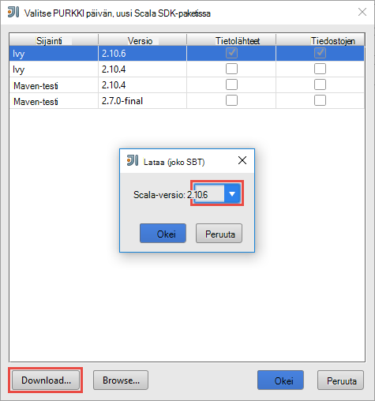
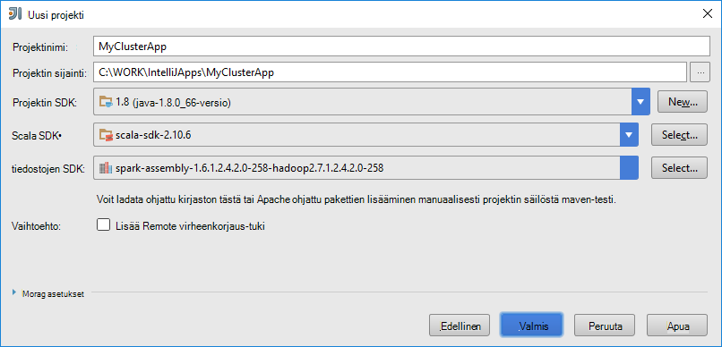
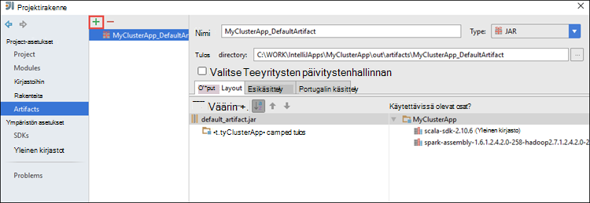
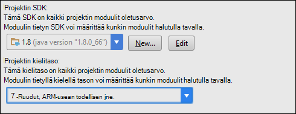
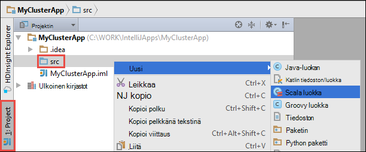

 <properties
    pageTitle="Virheenkorjaus etäyhteyden HDInsight ohjattu klustereiden sovellusten varten IntelliJ työkalujen Azure HDInsight työkalujen avulla | Microsoft Azure"
    description="Lue, miten avulla HDInsight Työkalut Azure Työkalut, IntelliJ virheenkorjaus etäyhteyden HDInsight ohjattu klustereiden sovellusten."
    services="hdinsight"
    documentationCenter=""
    authors="nitinme"
    manager="jhubbard"
    editor="cgronlun"
    tags="azure-portal"/>

<tags
    ms.service="hdinsight"
    ms.workload="big-data"
    ms.tgt_pltfrm="na"
    ms.devlang="na"
    ms.topic="article"
    ms.date="09/09/2016"
    ms.author="nitinme"/>

# Virheenkorjaus ohjattu sovellusten etäyhteyden HDInsight ohjattu Linux klusterin varten IntelliJ työkalujen Azure HDInsight työkalujen avulla

Tässä artikkelissa on vaiheittaiset ohjeet HDInsight-Työkalut käyttämisestä Azure Työkalut, IntelliJ lähetät ohjattu työn HDInsight ohjattu klusterissa ja korjaamisessa se sitten etäyhteyden pöytätietokoneesta. Voit tehdä on suoritettava korkean tason seuraavasti:

1. Luo sivusto tai pisteen sivuston Azure Virtual liittyvistä asioista. Tämän asiakirjan vaiheissa oletetaan, että käytät sivuston sivuston verkon.

2. Ohjattu klusterin luominen Azure Hdinsightiin, joka on osa sivuston sivuston Azure Virtual verkkoon.

3. Tarkista klusterin headnode ja työpöydän välinen yhteys.

4. IntelliJ VERRATA Scala-sovelluksen luominen ja määrittäminen remote virheenkorjaus.

5. Suorita ja sovelluksen korjaaminen.

##Edellytykset

* Azure tilaus. Katso [Hae Azure maksuttoman kokeiluversion](https://azure.microsoft.com/documentation/videos/get-azure-free-trial-for-testing-hadoop-in-hdinsight/).

* Apache Ohjattu klusterin HDInsight Linux. Ohjeita on artikkelissa [Azure Hdinsightiin luominen Apache ohjattu varausyksiköt](hdinsight-apache-spark-jupyter-spark-sql.md).
 
* Oracle Java Development kit. Voit asentaa sen [täältä](http://www.oracle.com/technetwork/java/javase/downloads/jdk8-downloads-2133151.html).
 
* IntelliJ ajatus. Tässä artikkelissa käytetään versio 15.0.1. Voit asentaa sen [täältä](https://www.jetbrains.com/idea/download/).
 
* Azure Työkalut, IntelliJ HDInsight-työkaluista. IntelliJ työkaluja Hdinsightista ovat käytettävissä, IntelliJ Azure-työkalujen osana. Katso ohjeet asentamisesta Azure-työkalujen [asentamista varten IntelliJ Azure-Työkalut](../azure-toolkit-for-intellij-installation.md).

* Azure tilauksen IntelliJ VERRATA on kirjauduttava. Noudata [Tässä](hdinsight-apache-spark-intellij-tool-plugin.md#log-into-your-azure-subscription).
 
* Esitettävän ohjattu Scala hakeminen remote virheenkorjaus Windows-tietokoneessa, saatat saada poikkeuksen [OHJATTU 2356](https://issues.apache.org/jira/browse/SPARK-2356) , joka esiintyy vuoksi puuttuu WinUtils.exe Windows artikkelissa kuvatulla tavalla. Voit kiertää tämän virheen, sinun täytyy [ladata tästä suoritettavan tiedoston](http://public-repo-1.hortonworks.com/hdp-win-alpha/winutils.exe) sijaintiin, kuten **C:\WinUtils\bin**. Valitse on Lisää ympäristömuuttuja **HADOOP_HOME** ja arvo muuttujan **C\WinUtils**.

## Vaihe 1: Azure Virtual verkoston luominen

Noudata kohteesta alla linkit Azure Virtual verkoston luominen ja tarkista sitten työpöytä- ja Azure Virtual Network väliset yhteydet.

* [Luo sivusto sivusto VPN-yhteyden Azure-portaalissa VNet](../vpn-gateway/vpn-gateway-howto-site-to-site-resource-manager-portal.md)
* [Luo sivusto sivusto VPN-yhteyttä käyttämällä PowerShell VNet](../vpn-gateway/vpn-gateway-create-site-to-site-rm-powershell.md)
* [PowerShellin virtual verkon pisteen sivuston yhteyden asetusten määrittäminen](../vpn-gateway/vpn-gateway-howto-point-to-site-rm-ps.md)

## Vaihe 2: Luo ohjattu HDInsight-klusterin

Ohjattu Apache-klusterin kannattaa luoda myös Azure Hdinsightiin, joka on osa Azure Virtual verkkoa, jonka loit. Käytä [HDInsight luominen Linux-pohjaiset varausyksiköt](hdinsight-hadoop-provision-linux-clusters.md)käytettävissä olevat tiedot. Valitse osana vaihtoehtoinen määritys Azure virtuaaliverkko, jonka loit edellisessä vaiheessa.

## Vaihe 3: Vahvista klusterin headnode ja työpöydän väliset yhteydet.

1. Hae headnode IP-osoite. Avaa Ambari Käyttöliittymän klusterin. Napsauta **raporttinäkymät-ikkunan**klusterin-sivu.

    

2. Napsauta **isännät**Ambari-Käyttöliittymä, valitse oikeassa yläkulmassa.

    

3. Pitäisi näkyä headnodes työntekijä solmujen ja zookeeper solmujen luettelo. Headnodes on **hn*** etuliite. Valitse ensimmäinen headnode.

    

4. Kopioi IP-osoite headnode ja isäntänimi, joka avautuu, **Yhteenveto** -ruudussa sivun alareunassa.

    

5. Sisällytä IP-osoite ja headnode isäntänimi tietokoneessa **isännät** -tiedostoon-kohtaa, johon haluat suorittaa ja virheenkorjaus etäyhteyden ohjattu työt. Tämän avulla voit ohjatulla IP-osoite sekä isäntänimi headnode yhteydessä.

    1. Avaa Muistiossa järjestelmänvalvojan oikeuksilla. Valitse Tiedostovalikosta **Avaa** ja siirry isännät-tiedoston sijainti. Windows-tietokoneessa, se on `C:\Windows\System32\Drivers\etc\hosts`.

    2. Lisää seuraavat **isännät** -tiedostoon.

            # For headnode0
            192.xxx.xx.xx hn0-nitinp
            192.xxx.xx.xx hn0-nitinp.lhwwghjkpqejawpqbwcdyp3.gx.internal.cloudapp.net

            # For headnode1
            192.xxx.xx.xx hn1-nitinp
            192.xxx.xx.xx hn1-nitinp.lhwwghjkpqejawpqbwcdyp3.gx.internal.cloudapp.net

5. Tietokoneesta, johon olet yhteydessä Internetiin Azure Virtual, jota käytetään HDInsight-klusterin Varmista, että molemmat ohjatulla IP-osoite sekä isäntänimi headnodes ping-komennon.

6. Ohjeiden etsiminen [käyttämällä SSH HDInsight-klusterin muodostaminen](hdinsight-hadoop-linux-use-ssh-windows.md#connect-to-a-linux-based-hdinsight-cluster)klusterin headnode yhdeksi SSH. Ping-klusterin, headnode pöytätietokone IP-osoite. Testaa yhteys sekä IP-osoitteisiin tietokoneen verkkoyhteyden tilan ja muiden Azure Virtual verkossa, jossa tietokone on yhteydessä.

7. Toista vaiheet muut headnode paikan päällä. 

## Vaihe 4: Työkalujen Azure HDInsight-Työkalut käyttäminen IntelliJ ohjattu Scala-sovelluksen luominen ja määrittäminen remote virheenkorjaus

1. Käynnistä IntelliJ VERRATA ja luo uusi projekti. Uusi projekti-valintaikkunassa seuraavaa asetusta ja valitse sitten **Seuraava**.

    

    * Valitse vasemmanpuoleisessa ruudussa **Hdinsightista**.
    * Valitse oikeanpuoleisen ruudun **Ohjattu-HDInsight (Scala)**.
    * Valitse **Seuraava**.

2. Kirjoita seuraavaan ikkunaan ongelman projektitiedot.

    * Anna projektin nimen ja projektin sijainti.
    * **Projektin SDK-paketissa**Varmista, että annat Java-version yli 7.
    * Saat **Scala SDK-paketissa**valitsemalla **Luo**, valitsemalla **Lataa**ja valitse sitten Scala käyttämään versio. **Varmista, että et käytä versio 2.11.x**. Tässä esimerkissä käytetään versio **2.10.6**.

        

    * Lataa **Ohjattu SDK-paketissa**, ja käyttämällä SDK [täältä](http://go.microsoft.com/fwlink/?LinkID=723585&clcid=0x409). Voit ohittaa tämän ja käyttää [Ohjattu maven-testi säilöön](http://mvnrepository.com/search?q=spark) kuitenkin, varmista, että sinulla on asennettuna ohjattu sovellusten kehittämiseen oikean maven-testi säilö. (Jos esimerkiksi haluat Varmista, että sinulla on asennettu, jos käytössäsi on ohjattu Streaming; ohjattu Streaming-osa Myös Ota Varmista, että käytössäsi on merkitty Scala 2.10 säilöön - Älä käytä säilö merkitty Scala 2.11.)

        

    * Valitse **Valmis**.

3. Ohjattu projektin luo automaattisesti Palvelutietojen puolestasi. Jos haluat nähdä Palvelutietojen noudattamalla seuraavia ohjeita.

    1. Valitse **Tiedosto** -valikosta **Projektirakenne**.
    2. Valitse **Projektirakenne** -valintaikkunan **palvelutiedot** Nähdäksesi oletusarvon Palvelutietojen, joka on luotu.

        

    Voit myös luoda oman Palvelutietojen bly valitsemalla **+** kuvakkeesta yllä olevassa kuvassa.

4. Valitse **Projekti** **Projektirakenne** -valintaikkuna. Jos **Projektin SDK** on määritetty 1.8, varmista, että **projektin kielitaso** on määritetty **7 – ruudut, ARM-usean todellisen muille**.

    

4. Kirjastojen lisääminen projektiin. Jos haluat lisätä kirjaston, projektin nimeä project-kohtaa hiiren kakkospainikkeella ja valitse sitten **Avaa moduuli-asetukset**. **Projektirakenne** -valintaikkunassa Valitse vasemmanpuoleisessa ruudussa **kirjastot**, valitse (+) symboli ja valitse sitten **Maven--tai testi**. 

     

    **Lataa kirjaston maven-testi säilöstä** -valintaikkunassa Etsi ja lisää seuraavat kirjastot.

    * `org.scalatest:scalatest_2.10:2.2.1`
    * `org.apache.hadoop:hadoop-azure:2.7.1`

5. Kopioi `yarn-site.xml` ja `core-site.xml` -klusterin headnode ja sen lisääminen projektiin. Seuraavat komennot avulla voit kopioida tiedostot. [Cygwin](https://cygwin.com/install.html) avulla voit suorittaa seuraavat `scp` kopioi tiedostot klusterin headnodes komentoja.

        scp <ssh user name>@<headnode IP address or host name>://etc/hadoop/conf/core-site.xml .

    Koska on jo lisätty klusterin headnode IP-osoite ja isäntänimet fontin isännät tiedosto työpöydälle, Käytämme **scp** komentoja seuraavalla tavalla.

        scp sshuser@hn0-nitinp:/etc/hadoop/conf/core-site.xml .
        scp sshuser@hn0-nitinp:/etc/hadoop/conf/yarn-site.xml .

    Tiedostojen lisääminen projektiin kopioimalla ne **/src** kansiossa, valitse projekti-puusta esimerkiksi `<your project directory>\src`.

6. Update `core-site.xml` voit tehdä seuraavat muutokset.

    1. `core-site.xml`sisältää salatun avaimen tallennustilan tiliin liittyvät klusterin. Valitse `core-site.xml` lisätyt projektiin salatun avaimen korvaaminen todellisen tallennustilan avain liittyvät tallennustilan oletustilin. Katso [hallinta tallennustilan pikanäppäimet](../storage/storage-create-storage-account.md#manage-your-storage-account).

            <property>
                <name>fs.azure.account.key.hdistoragecentral.blob.core.windows.net</name>
                <value>access-key-associated-with-the-account</value>
            </property>

    2. Poista seuraavista vaihtoehdoista `core-site.xml`.

            <property>
                <name>fs.azure.account.keyprovider.hdistoragecentral.blob.core.windows.net</name>
                <value>org.apache.hadoop.fs.azure.ShellDecryptionKeyProvider</value>
            </property>

            <property>
                <name>fs.azure.shellkeyprovider.script</name>
                <value>/usr/lib/python2.7/dist-packages/hdinsight_common/decrypt.sh</value>
            </property>

            <property>
                <name>net.topology.script.file.name</name>
                <value>/etc/hadoop/conf/topology_script.py</value>
            </property>

    3. Tallenna tiedosto.

7. Voit lisätä sovelluksen pää-luokka. **Project Explorer** **src**hiiren kakkospainikkeella, valitse **Uusi**ja valitse sitten **Scala-luokka**.

    

8. **Luo uusi Scala luokka** -valintaikkunassa nimi, **laji** Valitse **objekti**, ja valitse sitten **OK**.

    

9. Valitse `MyClusterAppMain.scala` tiedosto, liitä seuraava koodi. Koodi Luo ohjattu kontekstin ja käynnistyy `executeJob` menetelmää `SparkSample` objekti.

        import org.apache.spark.{SparkConf, SparkContext}

        object SparkSampleMain {
          def main (arg: Array[String]): Unit = {
            val conf = new SparkConf().setAppName("SparkSample")
                                      .set("spark.hadoop.validateOutputSpecs", "false")
            val sc = new SparkContext(conf)
        
            SparkSample.executeJob(sc,
                                   "wasbs:///HdiSamples/HdiSamples/SensorSampleData/hvac/HVAC.csv",
                                   "wasbs:///HVACOut")
          }
        }

10. Toista vaiheet 8 ja 9 yllä Lisää uusi Scala-objekti, jota kutsutaan `SparkSample`. Tämä luokan Lisää seuraava koodi. Koodi lukee tiedot (käytettävissä kaikissa HDInsight ohjattu klustereiden), HVAC.csv hakee rivit, joissa on vain yksi numero seitsemännestä CSV-sarakkeen ja kirjoittaa tulosteen **/HVACOut** klusterin oletusarvo-tallennustilan säilö-kohdassa.

        import org.apache.spark.SparkContext
    
        object SparkSample {
          def executeJob (sc: SparkContext, input: String, output: String): Unit = {
            val rdd = sc.textFile(input)
        
            //find the rows which have only one digit in the 7th column in the CSV
            val rdd1 =  rdd.filter(s => s.split(",")(6).length() == 1)
        
            val s = sc.parallelize(rdd.take(5)).cartesian(rdd).count()
            println(s)
        
            rdd1.saveAsTextFile(output)
            //rdd1.collect().foreach(println)
          }
        
        }

11. Toista vaiheet 8 ja 9 yllä Lisää uusi luokka `RemoteClusterDebugging`. Tähän luokkaan toteuttaa ohjattu Testikehys, jota käytetään virheenkorjaus sovellukset. Lisää seuraava koodi `RemoteClusterDebugging` luokka.

        import org.apache.spark.{SparkConf, SparkContext}
        import org.scalatest.FunSuite
        
        class RemoteClusterDebugging extends FunSuite {
        
          test("Remote run") {
            val conf = new SparkConf().setAppName("SparkSample")
                                      .setMaster("yarn-client")
                                      .set("spark.yarn.am.extraJavaOptions", "-Dhdp.version=2.4")
                                      .set("spark.yarn.jar", "wasbs:///hdp/apps/2.4.2.0-258/spark-assembly-1.6.1.2.4.2.0-258-hadoop2.7.1.2.4.2.0-258.jar")
                                      .setJars(Seq("""C:\WORK\IntelliJApps\MyClusterApp\out\artifacts\MyClusterApp_DefaultArtifact\default_artifact.jar"""))
                                      .set("spark.hadoop.validateOutputSpecs", "false")
            val sc = new SparkContext(conf)
        
            SparkSample.executeJob(sc,
              "wasbs:///HdiSamples/HdiSamples/SensorSampleData/hvac/HVAC.csv",
              "wasbs:///HVACOut")
          }
        }

    Tapahtuu, Huomaa seuraavat seikat:
    
    * Saat `.set("spark.yarn.jar", "wasbs:///hdp/apps/2.4.2.0-258/spark-assembly-1.6.1.2.4.2.0-258-hadoop2.7.1.2.4.2.0-258.jar")`, varmista, että ohjattu kokoonpanon PURKKI on käytettävissä määritetyssä polussa klusterin-tallennustilan.
    * Saat `setJars`, Määritä sijainti, johon Palvelutietojen purkkiin luodaan. Yleensä on `<Your IntelliJ project directory>\out\<project name>_DefaultArtifact\default_artifact.jar`. 

11. : `RemoteClusterDebugging` Luokan, napsauta hiiren kakkospainikkeella `test` avainsana ja sitten **Luo RemoteClusterDebugging määritys**.

    

12. -Valintaikkunassa määrityksen nimi ja valitse **Testaa lisätoimi** **testi**nimenä. Jätä muut arvot oletukseksi, valitse **Käytä**ja valitse sitten **OK**.

    

13. Pitäisi tulla näkyviin **Remote Suorita** määritys avattavasta valikosta. 

    

## Vaihe 5: Suorita sovellus virheenkorjaus-tilassa

1. Avaa IntelliJ VERRATA projektin `SparkSample.scala` ja luo keskeytyskohdasta "val rdd1"-kohdan vieressä. Valitse Ponnahdusvalikossa luomiseen keskeytyskohdasta **rivi-funktion executeJob**.

    

2. Napsauta vieressä **Remote Suorita** -määritys avattavasta Aloita sovelluksen suorittamisen **Virheenkorjaus Suorita** -painiketta.

    

3. Kun ohjelman suorittaminen keskeytyskohdasta, pitäisi näkyä **Virheenkorjaus** -välilehden alaruudun.

    

4. Valitse (**+**) kuvaketta, jos haluat lisätä Katso alla olevassa kuvassa esitetyllä tavalla. 

    

    Tässä, koska sovelluksen rikki ennen muuttujan `rdd1` luotiin, käyttämällä tämän Katso, mitä muuttujan ensin 5 rivit ovat näkyvissä `rdd`. Paina **ENTER**-näppäintä.

    

    Katso yllä olevassa kuvassa on tietoja ja virheenkorjaus terrabytes voitu suorituksen kyselyn miten sovelluksen etenee. Esimerkiksi tuloksessa yllä olevassa kuvassa näkyy, näet tulosteen ensimmäisellä rivillä on otsikko. Voit muokata sovelluksen koodi ohittaa otsikkorivillä tarvittavat tämän perusteella.

5. Voit valita nyt **Ansioluettelon** ohjelmakuvake sovelluksen suorittaminen Jatka.

    

6. Jos sovellus on suoritettu onnistuneesti, pitäisi näkyä seuraavanlaisia tulos.

    

 

## Katso myös

* [Yleistä: Apache ohjattu-Azure Hdinsightiin](hdinsight-apache-spark-overview.md)

### Skenaariot

* [Ohjattu BI: vuorovaikutteinen tietojen analysoinnissa ohjattu käyttäminen HDInsight kanssa Liiketoimintatieto-työkaluista](hdinsight-apache-spark-use-bi-tools.md)

* [Ohjattu koneen Learning kanssa: Käytä ohjattu-HDInsight rakennuksen lämpötilan LVI tietojen analysointiin](hdinsight-apache-spark-ipython-notebook-machine-learning.md)

* [Ohjattu koneen Learning kanssa: Käytä ohjattu elintarvikkeiden tulokset ennustetaan HDInsight-](hdinsight-apache-spark-machine-learning-mllib-ipython.md)

* [Ohjattu virtautetun median: Käytä ohjattu HDInsight reaaliaikainen streaming sovellusten luomiseen:](hdinsight-apache-spark-eventhub-streaming.md)

* [Sivuston log analyysi ohjattu käyttäminen Hdinsightiin](hdinsight-apache-spark-custom-library-website-log-analysis.md)

### Luominen ja suorittaminen sovellukset

* [Luo erillisen-sovelluksen käyttäminen Scala](hdinsight-apache-spark-create-standalone-application.md)

* [Suorita työt etäyhteyden käyttämällä Livy ohjattu klusterissa](hdinsight-apache-spark-livy-rest-interface.md)

### Työkalut ja laajennukset

* [HDInsight-työkalujen käyttäminen Azure työkalujen IntelliJ, voit luoda ja lähettää ohjattu Scala sovelluksia](hdinsight-apache-spark-intellij-tool-plugin.md)

* [Luo ohjattu sovellusten varten Pimennys työkalujen Azure Hdinsightiin työkalujen avulla](hdinsight-apache-spark-eclipse-tool-plugin.md)

* [Ohjattu klusterin HDInsight-Zeppelin muistikirjojen käyttäminen](hdinsight-apache-spark-use-zeppelin-notebook.md)

* [Ytimet käytettävissä Jupyter muistikirjan Ohjattu-klusterin Hdinsightiin](hdinsight-apache-spark-jupyter-notebook-kernels.md)

* [Ulkoiset pakettien käyttäminen Jupyter muistikirjat](hdinsight-apache-spark-jupyter-notebook-use-external-packages.md)

* [Asenna tietokoneeseen Jupyter ja muodosta yhteys ohjattu HDInsight-klusterin](hdinsight-apache-spark-jupyter-notebook-install-locally.md)

### Resurssien hallinta

* [Resurssien Azure Hdinsightiin Apache Ohjattu-klusterin](hdinsight-apache-spark-resource-manager.md)

* [Raita- ja Apache ohjattu töitä klusterin Hdinsightiin](hdinsight-apache-spark-job-debugging.md)
