 <properties
    pageTitle="Ohjattu Scala sovellusten Azure työkalujen HDInsight-työkalujen käyttäminen IntelliJ | Microsoft Azure"
    description="Opettele luomaan yksittäisen ohjattu sovelluksen HDInsight ohjattu klustereiden."
    services="hdinsight"
    documentationCenter=""
    authors="nitinme"
    manager="jhubbard"
    editor="cgronlun"
    tags="azure-portal"/>

<tags
    ms.service="hdinsight"
    ms.workload="big-data"
    ms.tgt_pltfrm="na"
    ms.devlang="na"
    ms.topic="article"
    ms.date="09/09/2016"
    ms.author="nitinme"/>

# Ohjattu sovellusten HDInsight ohjattu Linux-klusterin luominen varten IntelliJ työkalujen Azure HDInsight työkalujen avulla

Tässä artikkelissa on vaiheittaiset ohjeet ohjattu kehityssovellusten kirjoitettu Scala ja lähettää sen HDInsight-Ohjattu klusterin HDInsight työkalujen käyttäminen Azure työkalujen IntelliJ varten.  Voit käyttää työkaluja muutamalla eri tavalla:

* Kehittämään ja esittää Scala ohjattu HDInsight ohjattu-klusterissa
* Voit käyttää Azure Hdinsightiin Ohjattu klusterin-resurssit
* Kehittämään ja suorittaa Scala ohjattu sovelluksen paikallisesti

Voit myös seurata videon [tähän](https://mix.office.com/watch/1nqkqjt5xonza) aloittamista.

>[AZURE.IMPORTANT] Tämän työkalun avulla voidaan luoda ja lähettää vain ohjattu HDInsight-klusterin Linux-sovellukset.

##Edellytykset

* Azure tilaus. Katso [Hae Azure maksuttoman kokeiluversion](https://azure.microsoft.com/documentation/videos/get-azure-free-trial-for-testing-hadoop-in-hdinsight/).

* Apache Ohjattu klusterin HDInsight Linux. Ohjeita on artikkelissa [Azure Hdinsightiin luominen Apache ohjattu varausyksiköt](hdinsight-apache-spark-jupyter-spark-sql.md).

* Oracle Java Development kit. Voit asentaa sen [täältä](http://www.oracle.com/technetwork/java/javase/downloads/jdk8-downloads-2133151.html).

* IntelliJ VERRATA. Tässä artikkelissa käytetään versio 15.0.1. Voit asentaa sen [täältä](https://www.jetbrains.com/idea/download/).

## Asenna HDInsight Työkalut Azure työkalujen IntelliJ varten

HDInsight Työkalut IntelliJ on saatavana osana Azure-työkalujen IntelliJ varten. Katso ohjeet asentamisesta Azure-työkalujen [asentamista varten IntelliJ Azure-Työkalut](../azure-toolkit-for-intellij-installation.md).

## Kirjaudu sisään Azure tilauksen

1. Käynnistä IntelliJ IDE ja avaa Resurssienhallinta Azure. Valitse **Työkalu Windows** IDE **Näytä** -valikossa ja valitse sitten **Azure Explorer**.

    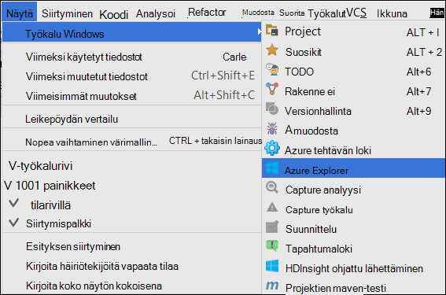

2. Napsauta hiiren kakkospainikkeella **Azure Explorer** **Azure** -solmu ja valitse sitten **Tilausten hallinta**.

3. **Tilausten hallinta** -valintaikkunassa valitse **Kirjaudu sisään** ja anna Azure tunnistetiedot.

    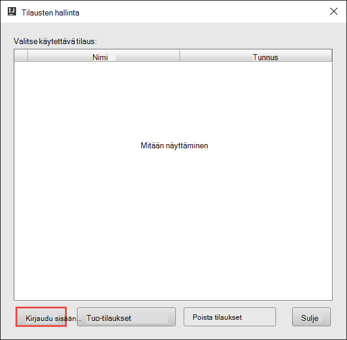

4. Kun olet kirjautunut sisään, Azure tilaukset liittyvät käyttöoikeustiedot näkyvät **Tilausten hallinta** -valintaikkunassa. Valitse **Sulje** -valintaikkunassa.

5. Laajenna **HDInsight** Nähdäksesi HDInsight ohjattu varausyksiköiden kohdassa tilauksen **Azure hallinta** -välilehti.

    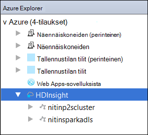

6. Voit laajentaa edelleen klusterin nimi solmu Nähdäksesi klusterin liittyvät resurssit (esimerkiksi tallennustilan-tilit).

    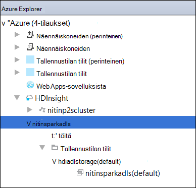

## Suorita ohjattu Scala-sovellus HDInsight ohjattu-klusterissa

1. Käynnistä IntelliJ VERRATA ja luo uusi projekti. Uusi projekti-valintaikkunassa seuraavaa asetusta ja valitse sitten **Seuraava**.

    

    * Valitse vasemmanpuoleisessa ruudussa **Hdinsightista**.
    * Valitse oikeanpuoleisen ruudun **Ohjattu-HDInsight (Scala)**.
    * Valitse **Seuraava**.

2. Kirjoita seuraavaan ikkunaan ongelman projektitiedot.

    * Anna projektin nimen ja projektin sijainti.
    * **Projektin SDK-paketissa**Varmista, että annat Java-version yli 7.
    * Saat **Scala SDK-paketissa**valitsemalla **Luo**, valitsemalla **Lataa**ja valitse sitten Scala käyttämään versio. **Varmista, että et käytä versio 2.11.x**. Tässä esimerkissä käytetään versio **2.10.6**.

        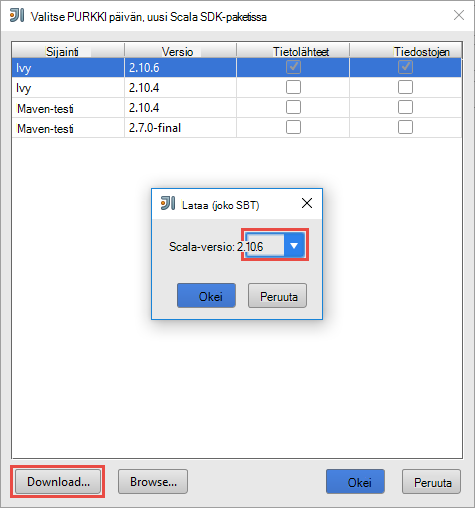

    * Lataa **Ohjattu SDK-paketissa**, ja käyttämällä SDK [täältä](http://go.microsoft.com/fwlink/?LinkID=723585&clcid=0x409). Voit ohittaa tämän ja käyttää [Ohjattu maven-testi säilöön](http://mvnrepository.com/search?q=spark) kuitenkin, varmista, että sinulla on asennettuna ohjattu sovellusten kehittämiseen oikean maven-testi säilö. (Jos esimerkiksi haluat Varmista, että sinulla on asennettu, jos käytössäsi on ohjattu Streaming; ohjattu Streaming-osa Myös Ota Varmista, että käytössäsi on merkitty Scala 2.10 säilöön - Älä käytä säilö merkitty Scala 2.11.)

        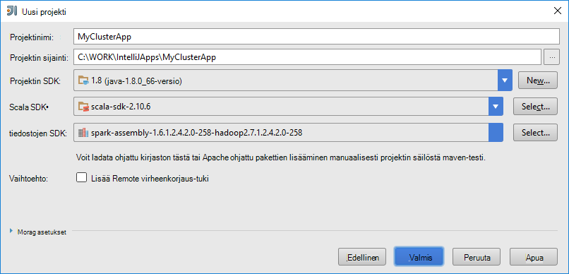

    * Valitse **Valmis**.

3. Ohjattu projektin luo automaattisesti Palvelutietojen puolestasi. Jos haluat nähdä Palvelutietojen noudattamalla seuraavia ohjeita.

    1. Valitse **Tiedosto** -valikosta **Projektirakenne**.
    2. Valitse **Projektirakenne** -valintaikkunan **palvelutiedot** Nähdäksesi oletusarvon Palvelutietojen, joka on luotu.

        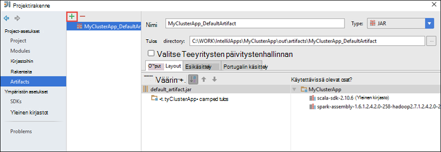

    Voit myös luoda oman Palvelutietojen bly valitsemalla **+** kuvakkeesta yllä olevassa kuvassa.

4. Valitse **Projekti** **Projektirakenne** -valintaikkuna. Jos **Projektin SDK** on määritetty 1.8, varmista, että **projektin kielitaso** on määritetty **7 – ruudut, ARM-usean todellisen muille**.

    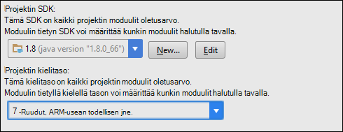

5. Lisää sovellus-lähdekoodi.

    1. **Project Explorer** **src**hiiren kakkospainikkeella, valitse **Uusi**ja valitse sitten **Scala-luokka**.

        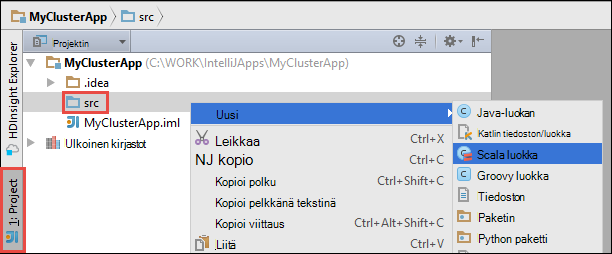

    2. **Luo uusi Scala luokka** -valintaikkunassa nimi, **laji** Valitse **objekti**, ja valitse sitten **OK**.

        

    3. Liitä seuraava koodi **MyClusterApp.scala** -tiedosto. Koodi lukee tiedot (käytettävissä kaikissa HDInsight ohjattu klustereiden), HVAC.csv hakee rivit, joissa on vain yksi numero seitsemännestä CSV-sarakkeen ja kirjoittaa tulosteen **/HVACOut** klusterin oletusarvo-tallennustilan säilö-kohdassa.

            import org.apache.spark.SparkConf
            import org.apache.spark.SparkContext

            object MyClusterApp{
              def main (arg: Array[String]): Unit = {
                val conf = new SparkConf().setAppName("MyClusterApp")
                val sc = new SparkContext(conf)

                val rdd = sc.textFile("wasbs:///HdiSamples/HdiSamples/SensorSampleData/hvac/HVAC.csv")

                //find the rows which have only one digit in the 7th column in the CSV
                val rdd1 =  rdd.filter(s => s.split(",")(6).length() == 1)

                rdd1.saveAsTextFile("wasbs:///HVACOut")
              }

            }

5. Suorita ohjattu HDInsight-klusterin sovelluksen.

    1. **Project Explorer**projektin nimeä hiiren kakkospainikkeella ja valitse sitten **Lähetä ohjattu sovelluksen Hdinsightista**.

        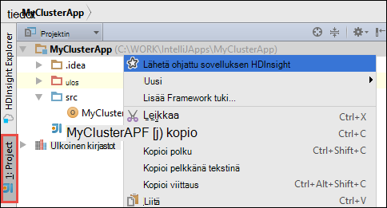

    2. Voit pyydetään Azure tilauksen tunnistetietosi. **Ohjattu lähetyksen** -valintaikkunassa on seuraavat arvot.

        * Valitse **Ohjattu varausyksiköt (vain Linux)**, jonka haluat suorittaa sovelluksen HDInsight Ohjattu klusterin.

        * On joko valitsemalla Palvelutietojen IntelliJ projektista tai voit valita yhden kiintolevylle.

        * **Tärkeimmät luokkanimi** -ruutuun vastaan napsauttamalla kolmea pistettä ( ), valitse ensisijainen luokan sovelluksen lähdekoodi ja valitse sitten **OK**.

            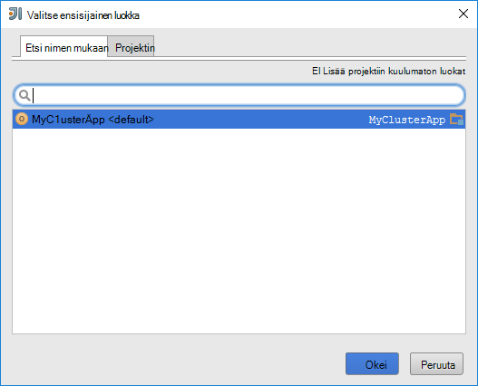

        * Koska tässä esimerkissä sovelluskoodia ei vaadi komentoriviargumentit tai viitata tölkki tai tiedostot, voit jättää jäljellä olevat ruudut tyhjäksi.

        * Kun olet antanut kaikkien syötteiden-valintaikkunan pitäisi näyttää seuraavankaltaiselta.

            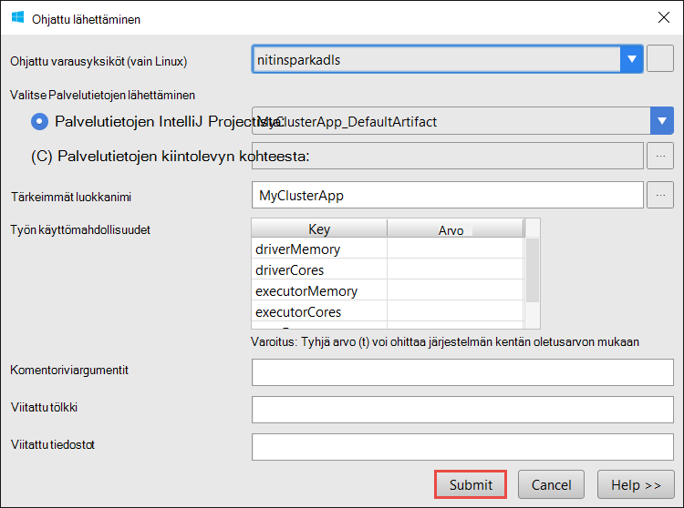

        * Valitse **Lähetä**.

    3. **Ohjattu lähetys** -välilehti ikkunan alareunassa Käynnistä näyttäminen edistymisen. Voit myös lopettaa sovelluksen punainen vaihtoehdon "Ohjattu lähetyksen"-ikkunassa.

        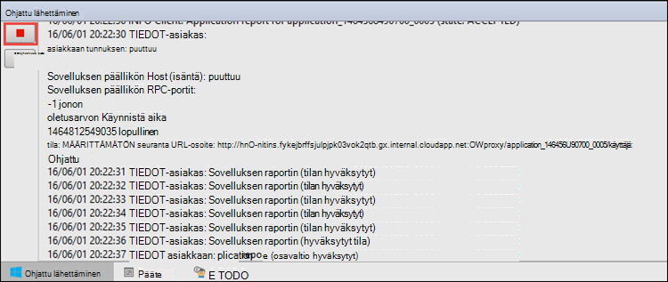

    Seuraavassa osassa kerrotaan käyttäminen työn tulosteen HDInsight-työkalujen käyttäminen Azure työkalujen IntelliJ varten.

## Voit hallita HDInsight ohjattu varausyksiköt työkalujen Azure HDInsight-Työkalut käyttäminen IntelliJ ja käyttää

Voit suorittaa erilaisia toimintoja, jotka ovat osa Azure työkalujen IntelliJ varten HDInsight-työkalujen avulla.

### Käyttää suoraan työn näkymän HDInsight-Työkalut

1. **Azure Explorer**Laajenna **HDInsight**, laajenna ohjattu klusterinimi ja valitse sitten **työt**.

2. **Ohjattu projektin Näytä** -välilehden näyttää kaikki klusterin suoritettavien sovellusten oikeanpuoleisessa ruudussa. Napsauta sovelluksen nimeä, jonka haluat nähdä lisätietoja.

    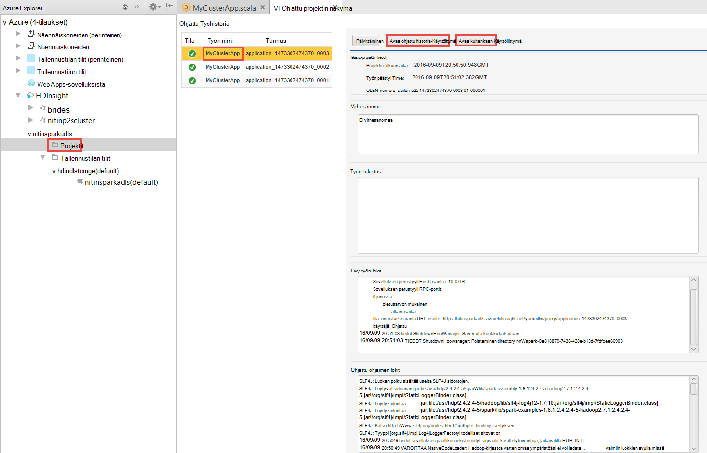

3. **Virhesanoma**, **Työn tulostus**, **Livy työn lokit**ja **Ohjattu ohjaimen lokit** ruutuihin täytetään sovelluksen, voit valita perusteella.

4. Voit avata **Ohjattu historia-Käyttöliittymän** ja **Kuitenkaan Käyttöliittymä** (tasolla sovelluksen) valitsemalla näytön yläreunassa painikkeita.

### Accessin ohjattu historia-palvelin

1. **Azure Explorer**Laajenna **HDInsight**, ohjattu-klusterinimeä hiiren kakkospainikkeella ja valitse sitten **Avaa ohjattu historia-Käyttöliittymä**. Kirjoita pyydettäessä klusterin järjestelmänvalvojan tunnistetietoja. Sinun on määritettävä nämä varattaessa klusterin.

2. Ohjattu historia palvelimen raporttinäkymät-ikkunassa, voit etsiä sovelluksen olet juuri valmis käyttämällä sovelluksen nimeä. Yllä olevan koodin, voit määrittää sovelluksen nimen käyttämällä `val conf = new SparkConf().setAppName("MyClusterApp")`. Näin ollen ohjattu sovelluksen nimi on **MyClusterApp**.

### Käynnistä Ambari-portaalissa

**Azure Explorer** **HDInsight**Laajenna, ohjattu-klusterinimeä hiiren kakkospainikkeella ja valitse sitten **Avaa klusterin hallinta-portaalin (Ambari)**. Kirjoita pyydettäessä klusterin järjestelmänvalvojan tunnistetietoja. Sinun on määritettävä nämä varattaessa klusterin.

### Azure-tilausten hallinta

Oletusarvon mukaan HDInsight-Työkalut luettelo ohjattu varausyksiköiden from Azure tilauksistasi. Tarvittaessa voit määrittää, jossa haluat käyttää klusterin tilaukset. **Azure Explorer** **Azure** pääsolmuksi hiiren kakkospainikkeella ja valitse sitten **Tilausten hallinta**. Valintaikkunassa Poista valintaruutujen valinta, jos vastaan tilauksen, joita et halua käyttää ja valitse sitten **Sulje**. Voit valita myös **Kirjaudu ulos** , jos haluat kirjautua ulos Azure tilauksesta.

## Suorita ohjattu Scala sovelluksen paikallisesti

Voit varten IntelliJ työkalujen Azure HDInsight-Työkalut suorittaa ohjattu Scala sovelluksia paikallisesti työasemalle. Yleensä näiden sovellusten ei on pääsy klusteriresurssit, kuten tallennustilan säiliön ja voidaan suorittaa ja testattu paikallisesti.

### Edellytyksenä

Esitettävän paikallisen ohjattu Scala-sovelluksen Windows-tietokoneessa, saatat saada poikkeuksen [OHJATTU 2356](https://issues.apache.org/jira/browse/SPARK-2356) , joka esiintyy vuoksi puuttuu WinUtils.exe Windows artikkelissa kuvatulla tavalla. Voit kiertää tämän virheen, sinun täytyy [ladata tästä suoritettavan tiedoston](http://public-repo-1.hortonworks.com/hdp-win-alpha/winutils.exe) sijaintiin, kuten **C:\WinUtils\bin**. Valitse on Lisää ympäristömuuttuja **HADOOP_HOME** ja arvo muuttujan **C\WinUtils**.

### Suorita ohjattu Scala paikallisen sovelluksen  

1. Käynnistä IntelliJ VERRATA ja luo uusi projekti. Uusi projekti-valintaikkunassa seuraavaa asetusta ja valitse sitten **Seuraava**.

    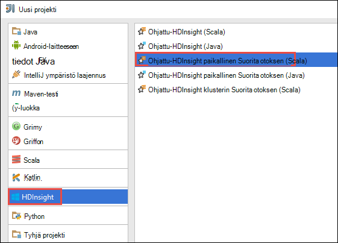

    * Valitse vasemmanpuoleisessa ruudussa **Hdinsightista**.
    * Valitse oikeanpuoleisen ruudun **Ohjattu-HDInsight paikallisen Suorita otoksen (Scala)**.
    * Valitse **Seuraava**.

2. Kirjoita seuraavaan ikkunaan ongelman projektitiedot.

    * Anna projektin nimen ja projektin sijainti.
    * **Projektin SDK-paketissa**Varmista, että annat Java-version yli 7.
    * Saat **Scala SDK-paketissa**valitsemalla **Luo**, valitsemalla **Lataa**ja valitse sitten Scala käyttämään versio. **Varmista, että et käytä versio 2.11.x**. Tässä esimerkissä käytetään versio **2.10.6**.

        

    * Lataa **Ohjattu SDK-paketissa**, ja käyttämällä SDK [täältä](http://go.microsoft.com/fwlink/?LinkID=723585&clcid=0x409). Voit ohittaa tämän ja käyttää [Ohjattu maven-testi säilöön](http://mvnrepository.com/search?q=spark) kuitenkin, varmista, että sinulla on asennettuna ohjattu sovellusten kehittämiseen oikean maven-testi säilö. (Jos esimerkiksi haluat Varmista, että sinulla on asennettu, jos käytössäsi on ohjattu Streaming; ohjattu Streaming-osa Myös Ota Varmista, että käytössäsi on merkitty Scala 2.10 säilöön - Älä käytä säilö merkitty Scala 2.11.)

        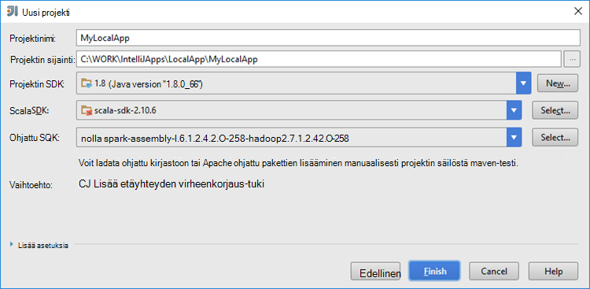

    * Valitse **Valmis**.

3. Mallin Lisää **src** -kansiossa, joita voit suorittaa paikallisesti tietokoneen esimerkkikoodi (**LogQuery**).

    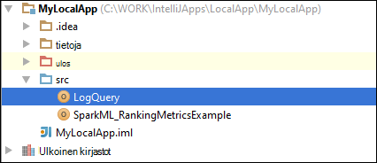

4.  Napsauta **LogQuery** -sovellusta hiiren kakkospainikkeella ja valitse sitten **"Suorita 'LogQuery'"**. Näkyviin tulee tulos tältä alareunassa **Suorita** -välilehdessä.

    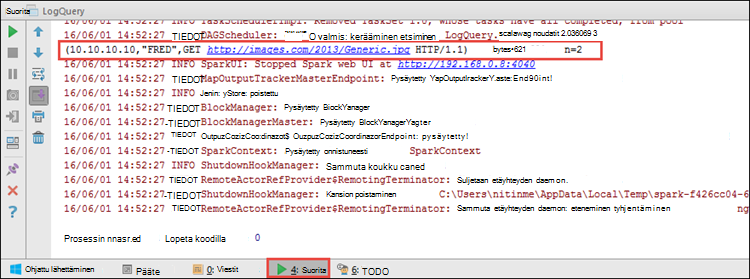

## Muuntaa työkalujen Azure HDInsight-Työkalut käyttäminen IntelliJ IntelliJ VERRATA sovellukset

Voit myös muuntaa aiemmin luodun IntelliJ KANNATTAA varten IntelliJ työkalujen Azure HDInsight-Työkalut-yhteensopiva ohjattu Scala sovellukset. Tämän avulla voit lähettää ohjattu HDInsight-klusterin sovellukset-työkalun avulla. Voit tehdä sen seuraavasti:

1. Aiemmin luodun ohjattu Scala appliction, jotka on luotu käyttämällä IntelliJ VERRATA Avaa liittyvän .iml-tiedostoa.
2. Päätasolle näet **moduuli** -elementin tältä:

        <module org.jetbrains.idea.maven.project.MavenProjectsManager.isMavenModule="true" type="JAVA_MODULE" version="4">

3. Muokkaa osa, kun haluat lisätä `UniqueKey="HDInsightTool"` niin, että **moduuli** -osa näyttää seuraavalta:

        <module org.jetbrains.idea.maven.project.MavenProjectsManager.isMavenModule="true" type="JAVA_MODULE" version="4" UniqueKey="HDInsightTool">

4. Tallenna muutokset. Sovelluksen pitäisi nyt olla yhteensopiva varten IntelliJ työkalujen Azure HDInsight-työkalut. Voit halutessasi testata napsauttamalla hiiren kakkospainikkeella Project Explorer projektin nimeä. Pikavalikon pitäisi olla nyt vaihtoehto, jos haluat **Lähettää ohjattu sovelluksen Hdinsightista**.

## Vianmääritys

### Suorita paikallinen "Käytä keon suurentaminen" Virhe

Valitse ohjattu 1.6, jos käytössäsi on 32-bittinen Java SDK: N paikallisen asennuksen aikana viestejä seuraavia virheitä:

    Exception in thread "main" java.lang.IllegalArgumentException: System memory 259522560 must be at least 4.718592E8. Please use a larger heap size.
        at org.apache.spark.memory.UnifiedMemoryManager$.getMaxMemory(UnifiedMemoryManager.scala:193)
        at org.apache.spark.memory.UnifiedMemoryManager$.apply(UnifiedMemoryManager.scala:175)
        at org.apache.spark.SparkEnv$.create(SparkEnv.scala:354)
        at org.apache.spark.SparkEnv$.createDriverEnv(SparkEnv.scala:193)
        at org.apache.spark.SparkContext.createSparkEnv(SparkContext.scala:288)
        at org.apache.spark.SparkContext.<init>(SparkContext.scala:457)
        at LogQuery$.main(LogQuery.scala:53)
        at LogQuery.main(LogQuery.scala)
        at sun.reflect.NativeMethodAccessorImpl.invoke0(Native Method)
        at sun.reflect.NativeMethodAccessorImpl.invoke(NativeMethodAccessorImpl.java:57)
        at sun.reflect.DelegatingMethodAccessorImpl.invoke(DelegatingMethodAccessorImpl.java:43)
        at java.lang.reflect.Method.invoke(Method.java:606)
        at com.intellij.rt.execution.application.AppMain.main(AppMain.java:144)

Tämä johtuu siitä keon koko ei ole riittävän suuri, ohjattu, jos haluat suorittaa, koska ohjattu edellyttää vähintään 471 Megatavua (Saat lisätietoja [OHJATTU 12081](https://issues.apache.org/jira/browse/SPARK-12081) halutessasi). Yksi yksinkertainen ratkaisu on 64-bittinen Java SDK-paketissa. Voit myös muuttaa IntelliJ JVM asetukset lisäämällä seuraavista vaihtoehdoista:

    -Xms128m -Xmx512m -XX:MaxPermSize=300m -ea

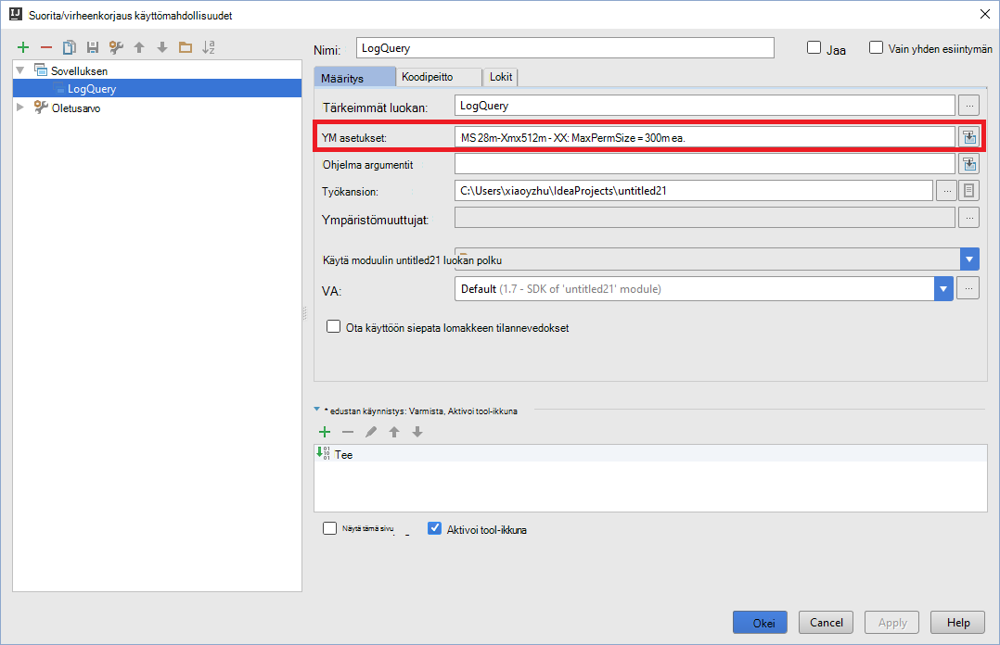

## Palaute ja tunnetut ongelmat

Tarkastelemasi ohjattu tulostaa suoraan ei tueta ja yritämme, valitse.

Jos sinulla on ehdotuksia tai palautetta tai jos käytössä ilmenee ongelmia, kun käytät tätä työkalua, vapaasti pudota us sähköpostiviestin hdivstool microsoft piste com-palvelussa.

## Katso myös

* [Yleistä: Apache ohjattu-Azure Hdinsightiin](hdinsight-apache-spark-overview.md)

### Skenaariot

* [Ohjattu BI: vuorovaikutteinen tietojen analysoinnissa ohjattu käyttäminen HDInsight kanssa Liiketoimintatieto-työkaluista](hdinsight-apache-spark-use-bi-tools.md)

* [Ohjattu koneen Learning kanssa: Käytä ohjattu-HDInsight rakennuksen lämpötilan LVI tietojen analysointiin](hdinsight-apache-spark-ipython-notebook-machine-learning.md)

* [Ohjattu koneen Learning kanssa: Käytä ohjattu elintarvikkeiden tulokset ennustetaan HDInsight-](hdinsight-apache-spark-machine-learning-mllib-ipython.md)

* [Ohjattu virtautetun median: Käytä ohjattu HDInsight reaaliaikainen streaming sovellusten luomiseen:](hdinsight-apache-spark-eventhub-streaming.md)

* [Sivuston log analyysi ohjattu käyttäminen Hdinsightiin](hdinsight-apache-spark-custom-library-website-log-analysis.md)

### Luominen ja suorittaminen sovellukset

* [Luo erillisen-sovelluksen käyttäminen Scala](hdinsight-apache-spark-create-standalone-application.md)

* [Suorita työt etäyhteyden käyttämällä Livy ohjattu klusterissa](hdinsight-apache-spark-livy-rest-interface.md)

### Työkalut ja laajennukset

* [Virheenkorjaus ohjattu sovellusten etäyhteyden Azure Työkalut, IntelliJ HDInsight-työkalujen avulla](hdinsight-apache-spark-intellij-tool-plugin-debug-jobs-remotely.md)

* [Luo ohjattu sovellusten varten Pimennys työkalujen Azure Hdinsightiin työkalujen avulla](hdinsight-apache-spark-eclipse-tool-plugin.md)

* [Ohjattu klusterin HDInsight-Zeppelin muistikirjojen käyttäminen](hdinsight-apache-spark-use-zeppelin-notebook.md)

* [Ytimet käytettävissä Jupyter muistikirjan Ohjattu-klusterin Hdinsightiin](hdinsight-apache-spark-jupyter-notebook-kernels.md)

* [Ulkoiset pakettien käyttäminen Jupyter muistikirjat](hdinsight-apache-spark-jupyter-notebook-use-external-packages.md)

* [Asenna tietokoneeseen Jupyter ja muodosta yhteys ohjattu HDInsight-klusterin](hdinsight-apache-spark-jupyter-notebook-install-locally.md)

### Resurssien hallinta

* [Resurssien Azure Hdinsightiin Apache Ohjattu-klusterin](hdinsight-apache-spark-resource-manager.md)

* [Raita- ja Apache ohjattu töitä klusterin Hdinsightiin](hdinsight-apache-spark-job-debugging.md)
