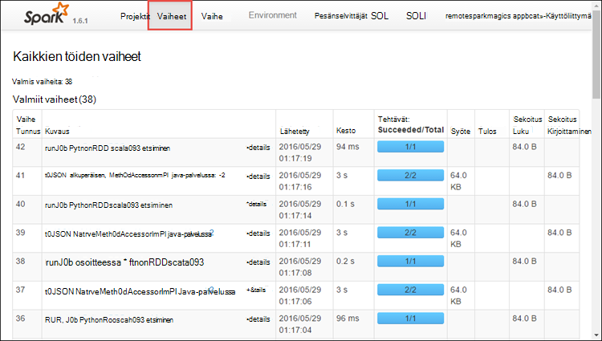
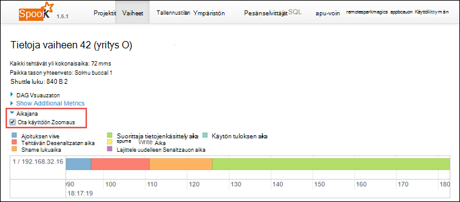

<properties 
    pageTitle="Raita- ja Apache ohjattu töitä klusterin HDInsight | Microsoft Azure" 
    description="KUITENKAAN Käyttöliittymän, ohjattu Käyttöliittymä ja ohjattu historia-palvelimen avulla seurata ja virheenkorjaus ohjattu Azure HDInsight-klusterin töitä" 
    services="hdinsight" 
    documentationCenter="" 
    authors="nitinme" 
    manager="jhubbard" 
    editor="cgronlun"
    tags="azure-portal"/>

<tags 
    ms.service="hdinsight" 
    ms.workload="big-data" 
    ms.tgt_pltfrm="na" 
    ms.devlang="na" 
    ms.topic="article" 
    ms.date="08/25/2016" 
    ms.author="nitinme"/>

# Raita- ja Apache Ohjattu klusterin HDInsight Linux töitä

Tässä artikkelissa kerrotaan seuraaminen ja virheenkorjaus ohjattu työt kuitenkaan-Käyttöliittymä, ohjattu Käyttöliittymä ja ohjattu historia-palvelimeen. Tässä artikkelissa on alkavat käytettävissä muistikirjan käyttäminen Ohjattu-klusterin Ohjattu projektin **koneen learning: ennakoivan analyyseistä käsitellessäsi elintarvikkeiden tarkastus tietoja käyttämällä MLLib**. Voit käyttää seuraavia ohjeita voit seurata sovellus, jonka olet lähettänyt käyttämällä kaikki muut lähestymistapa sekä, kuten **Ohjattu Lähetä**.

##Edellytykset

Tarvitset seuraavat:

- Azure tilaus. Katso [Hae Azure maksuttoman kokeiluversion](https://azure.microsoft.com/documentation/videos/get-azure-free-trial-for-testing-hadoop-in-hdinsight/).
- Apache Ohjattu klusterin HDInsight Linux. Ohjeita on artikkelissa [Azure Hdinsightiin luominen Apache ohjattu varausyksiköt](hdinsight-apache-spark-jupyter-spark-sql.md).
- Olisi olet aloittanut muistikirjaan, jossa **[koneen learning: ennakoivan analyyseistä käsitellessäsi elintarvikkeiden tarkastus tietoja käyttämällä MLLib](hdinsight-apache-spark-machine-learning-mllib-ipython.md)**. Ohjeita siitä, miten voit suorittaa tämän muistikirjan linkkiä.  

## Seurata sovelluksen kuitenkaan käyttöliittymä

1. Käynnistä kuitenkaan-Käyttöliittymä. Klusterin-sivu valitsemalla **Klusterin Raporttinäkymät-ikkunan**, ja valitse sitten **kuitenkaan**.

    

    >[AZURE.TIP] Voit vaihtoehtoisesti myös käynnistää kuitenkaan Käyttöliittymän Ambari käyttöliittymässä. Käynnistää Ambari-Käyttöliittymän klusterin-sivu- **Klusterin Raporttinäkymät-ikkunan**ja valitse sitten **HDInsight klusterin Raporttinäkymät-ikkunan**. Ambari käyttöjärjestelmästä **kuitenkaan**, valitse **Pikalinkit**, aktiivinen resurssien hallinta ja valitse **ResourceManager Käyttöliittymän**.  

3. Koska olet aloittanut ohjattu työ käyttämällä Jupyter muistikirjat-sovellus on nimi **remotesparkmagics** (tämä on kaikissa sovelluksissa, jotka ovat käynnistetään muistikirjat nimi). Valitse Sovellustunnus Saat lisätietoja työn vastaan sovelluksen nimeä. Tämä käynnistää sovelluksen näkymä.

    

    Hakemukseen, joka on ilmennyt Jupyter muistikirjat on tila on aina **käynnissä** ennen kuin suljet muistikirja.

4. Sovelluksen näkymästä voit siirtyä alaspäin lisäksi saada selville sovelluksen tai lokit (stdout/stderr) liittyvää säilöjen. Voit käynnistää ohjattu Käyttöliittymän myös napsauttamalla linkittämisen vastaavat **Seuranta URL-osoite**alla kuvatulla tavalla. 

    

## Seurata sovelluksen ohjattu käyttöliittymä

Valitse ohjattu-Käyttöliittymä voit siirtyä alaspäin ohjattu työt, jotka ovat näyttöriippuvainen aiemmin sovellus.

1. Käynnistä ohjattu-Käyttöliittymä, sovellus-näkymästä napsauttamalla linkkiä vastaan **Seuranta URL-osoite**näyttökuvan esitetyllä tavalla. Näet kaikki ohjattu työt, joka käynnistää Jupyter-muistikirja sovelluksen.

    

2. Valitse näe käsittelyn ja tallennustilaa kukin suorittaja tietoja **pesänselvittäjät** -välilehti. Voit noutaa puhelun pino myös napsauttamalla **Säikeen Dump** -linkkiä.

    
 
3. **Vaiheet** -välilehdestä näet sovellukseen liittyvät vaiheet.

    

    Jokaisen vaiheen voi olla useita tehtäviä, jossa voit tarkastella suorittamisen koskevia lisätietoja, kuten alla olevan kuvan.

     

4. Vaiheen tiedot-sivulla voit käynnistää DAG visualisointi. Laajenna sivun yläreunassa **DAG visualisointi** -linkki alla kuvatulla tavalla.

    

    Suora Aclyic Visio-DAG edustaa sovelluksen eri vaiheita. Sininen ruutuja kaaviossa edustaa ohjattu-toiminto käynnistyy sovelluksesta.

5. Vaiheen tiedot-sivulla voit käynnistää sovelluksen Aikajana-näkymässä. Laajenna sivun yläreunassa **Aikajana** -linkki alla kuvatulla tavalla.

    

    Ohjattu tapahtumat näkyvät aikajanan lomake. Aikajananäkymän on käytettävissä kolme tasoilla töitä, työ- ja sisäpuolelle vaihe. Yllä olevan kuvan sieppaa aikajananäkymän tietyn vaiheen.

    >[AZURE.TIP] Jos valitset **Ota käyttöön Zoomaus** -valintaruudun, voit vierittää vasemmalle ja oikealle aikajananäkymän yli.

6. Muihin välilehtiin ohjattu käyttöliittymässä on hyödyllistä tietoa sen ohjattu-esiintymän.

    * Tallennustilan-välilehti – Jos sovelluksesi Luo RDDs löydät tietoja kaltaisia tallennustila-välilehdessä.
    * Ympäristön-välilehti – Tässä välilehdessä on hyödyllisiä tietoja Ohjattu esiintymän paljon kuten 
        * Scala versio
        * Klusterin tapahtumalokin kansio
        * Sovelluksen sydämiä suorittaja määrä
        * Jne.

## Lisätietoja valmiiden töiden ohjattu historia-palvelimen käyttäminen

Kun työ on valmis, työn tietoja säilytetään ohjattu historia-palvelimeen.

1. Käynnistä ohjattu historia-palvelin-klusterin-sivu- **Klusterin Raporttinäkymät-ikkunan**ja valitse sitten **Ohjattu historia-palvelimeen**.

    

    >[AZURE.TIP] Voit vaihtoehtoisesti myös käynnistää Ambari käyttöliittymässä ohjattu historia Server-Käyttöliittymä. Käynnistää Ambari-Käyttöliittymän klusterin-sivu- **Klusterin Raporttinäkymät-ikkunan**ja valitse sitten **HDInsight klusterin Raporttinäkymät-ikkunan**. Ambari käyttöjärjestelmästä **Ohjattu**ja valitse **Pikalinkit** **Ohjattu historia Server-Käyttöliittymä**.

2. Näet valmiiden sovellusten luettelossa. Valitse sovelluksen Tunnusten sovellukseen, saat lisätietoja alirakenteeseen.

    
    

## Katso myös

* [Yleistä: Apache ohjattu-Azure Hdinsightiin](hdinsight-apache-spark-overview.md)

### Skenaariot

* [Ohjattu BI: vuorovaikutteinen tietojen analysoinnissa ohjattu käyttäminen HDInsight kanssa Liiketoimintatieto-työkaluista](hdinsight-apache-spark-use-bi-tools.md)

* [Ohjattu koneen Learning kanssa: Käytä ohjattu-HDInsight rakennuksen lämpötilan LVI tietojen analysointiin](hdinsight-apache-spark-ipython-notebook-machine-learning.md)

* [Ohjattu koneen Learning kanssa: Käytä ohjattu elintarvikkeiden tulokset ennustetaan HDInsight-](hdinsight-apache-spark-machine-learning-mllib-ipython.md)

* [Ohjattu virtautetun median: Käytä ohjattu HDInsight reaaliaikainen streaming sovellusten luomiseen:](hdinsight-apache-spark-eventhub-streaming.md)

* [Sivuston log analyysi ohjattu käyttäminen Hdinsightiin](hdinsight-apache-spark-custom-library-website-log-analysis.md)

### Luominen ja suorittaminen sovellukset

* [Luo erillisen-sovelluksen käyttäminen Scala](hdinsight-apache-spark-create-standalone-application.md)

* [Suorita työt etäyhteyden käyttämällä Livy ohjattu klusterissa](hdinsight-apache-spark-livy-rest-interface.md)

### Työkalut ja laajennukset

* [HDInsight Työkalut ‑laajennuksen IntelliJ VERRATA avulla voit luoda ja lähettää ohjattu Scala sovelluksia](hdinsight-apache-spark-intellij-tool-plugin.md)

* [Ohjattu sovellusten virheenkorjaus etäyhteyden HDInsight Työkalut ‑laajennuksen IntelliJ VERRATA avulla](hdinsight-apache-spark-intellij-tool-plugin-debug-jobs-remotely.md)

* [Ohjattu klusterin HDInsight-Zeppelin muistikirjojen käyttäminen](hdinsight-apache-spark-use-zeppelin-notebook.md)

* [Ytimet käytettävissä Jupyter muistikirjan Ohjattu-klusterin Hdinsightiin](hdinsight-apache-spark-jupyter-notebook-kernels.md)

* [Ulkoiset pakettien käyttäminen Jupyter muistikirjat](hdinsight-apache-spark-jupyter-notebook-use-external-packages.md)

* [Asenna tietokoneeseen Jupyter ja muodosta yhteys ohjattu HDInsight-klusterin](hdinsight-apache-spark-jupyter-notebook-install-locally.md)

### Resurssien hallinta

* [Resurssien Azure Hdinsightiin Apache Ohjattu-klusterin](hdinsight-apache-spark-resource-manager.md)
