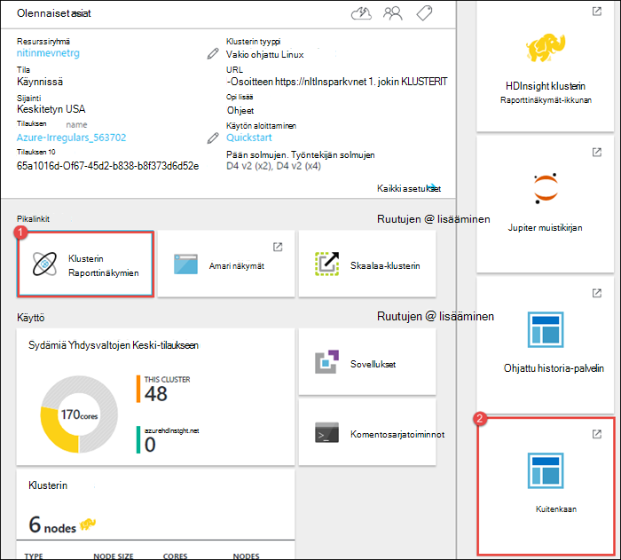
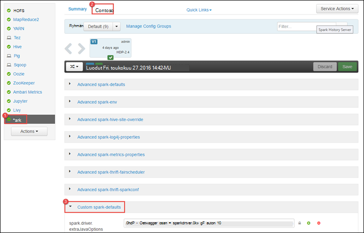
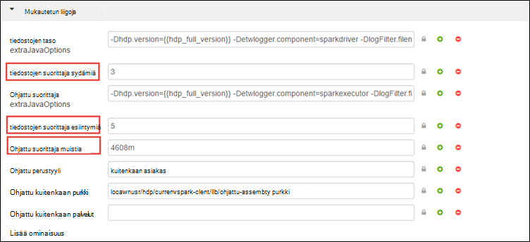
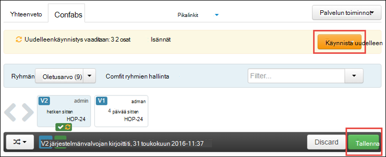
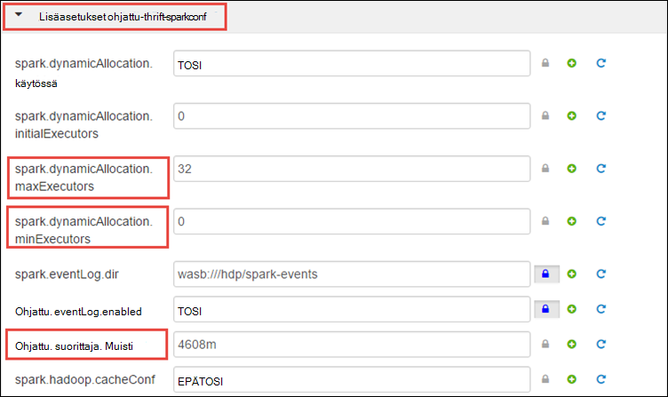
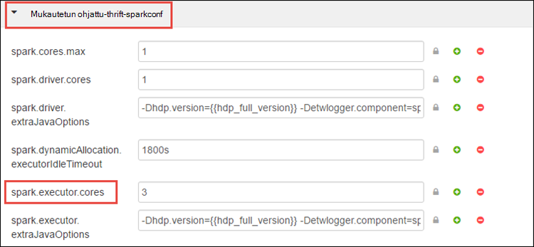
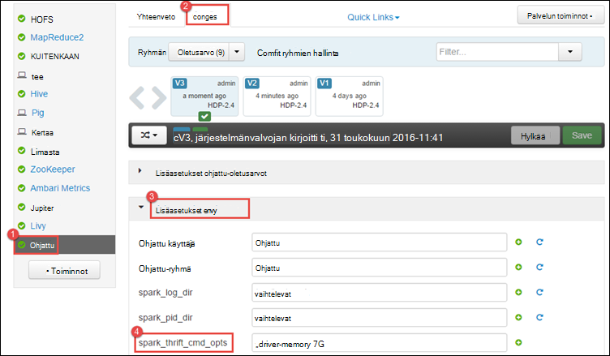
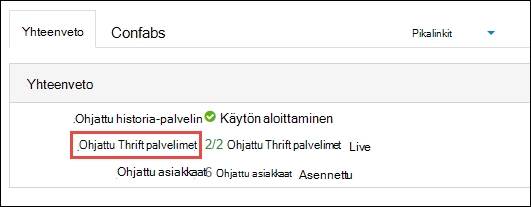
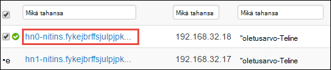
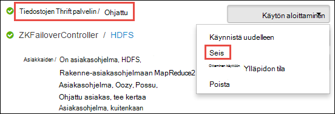

<properties 
    pageTitle="Resurssien hallinnan käyttö HDInsight Apache Ohjattu-klusterin resurssien varaaminen | Microsoft Azure" 
    description="Opi käyttämään Resurssienhallinta ohjattu klustereiden HDInsight-suorituskyvyn parantamiseksi." 
    services="hdinsight" 
    documentationCenter="" 
    authors="nitinme" 
    manager="jhubbard" 
    editor="cgronlun"
    tags="azure-portal"/>

<tags 
    ms.service="hdinsight" 
    ms.workload="big-data" 
    ms.tgt_pltfrm="na" 
    ms.devlang="na" 
    ms.topic="article" 
    ms.date="08/25/2016" 
    ms.author="nitinme"/>

# Resurssien HDInsight Linux Apache Ohjattu-klusterin

Ohjattu historia-palvelimeen liittyvien Ohjattu klusterin ja tämän artikkelin opit käyttämään Ambari Käyttöliittymä, kuitenkaan Käyttöliittymä, kuten liittymät. Opit myös paranna klusterin määrityskohde optimaalisen toiminnan määrittämisestä.

**Edellytykset:**

Tarvitset seuraavat:

- Azure tilaus. Katso [Hae Azure maksuttoman kokeiluversion](https://azure.microsoft.com/documentation/videos/get-azure-free-trial-for-testing-hadoop-in-hdinsight/).
- Apache Ohjattu klusterin HDInsight Linux. Ohjeita on artikkelissa [Azure Hdinsightiin luominen Apache ohjattu varausyksiköt](hdinsight-apache-spark-jupyter-spark-sql.md).

## Miten Ambari Web-Käyttöliittymän Käynnistä?

1. [Azure-portaaliin](https://portal.azure.com/)ja valitse startboard Napsauta Ohjattu klusterin ruutua (jos se kiinnitettyinä startboard). Voit myös siirtyä yhteyttä klusterin-kohdassa **Selaa kaikki** > **HDInsight klustereiden**. 
 
2. Valitse Ohjattu klusterin-sivu **raporttinäkymät-ikkunan**. Kirjoita pyydettäessä Ohjattu klusterin järjestelmänvalvojan tunnistetietoja.

    ![Käynnistä Ambari] (./media/hdinsight-apache-spark-resource-manager/hdispark.cluster.launch.dashboard.png "Resurssien hallinnan käynnistäminen")

3. Tämä on Käynnistä Ambari Web-Käyttöliittymä, alla kuvatulla tavalla.

    ![Ambari Web-Käyttöliittymä] (./media/hdinsight-apache-spark-resource-manager/ambari-web-ui.png "Ambari Web-Käyttöliittymä")   

## Miten ohjattu historia-palvelimen Käynnistä?

1. [Azure-portaaliin](https://portal.azure.com/)ja valitse startboard Napsauta Ohjattu klusterin ruutua (jos se kiinnitettyinä startboard).

2. Valitse klusterin-sivu **Pikalinkit**- **Klusterin Raporttinäkymät-ikkunan**. Valitse **Ohjattu historia palvelimen** **Klusterin Dashboard** -sivu.

    ![Ohjattu historia-palvelin] (./media/hdinsight-apache-spark-resource-manager/launch-history-server.png "Ohjattu historia-palvelin")

    Kirjoita pyydettäessä Ohjattu klusterin järjestelmänvalvojan tunnistetietoja.

## Miten kuitenkaan Käyttöliittymän Käynnistä?

KUITENKAAN Käyttöliittymän avulla voit valvoa Ohjattu klusterin käynnissä olevat sovellukset. 

1. Klusterin-sivu valitsemalla **Klusterin Raporttinäkymät-ikkunan**, ja valitse sitten **kuitenkaan**.

    

    >[AZURE.TIP] Voit vaihtoehtoisesti myös käynnistää kuitenkaan Käyttöliittymän Ambari käyttöliittymässä. Käynnistää Ambari-Käyttöliittymän klusterin-sivu- **Klusterin Raporttinäkymät-ikkunan**ja valitse sitten **HDInsight klusterin Raporttinäkymät-ikkunan**. Ambari käyttöjärjestelmästä **kuitenkaan**, valitse **Pikalinkit**, aktiivinen resurssien hallinta ja valitse **ResourceManager Käyttöliittymän**.

## Suorita ohjattu sovelluksia optimaalisen klusterin määritykset ominaisuudet

Kolme tärkeimmät parametrit, joita voi käyttää Ohjattu määrityksistä riippuen sovelluksen vaatimukset ovat `spark.executor.instances`, `spark.executor.cores`, ja `spark.executor.memory`. Suorittaja on käynnistetty ohjattu sovelluksen prosessi. Se toimii työntekijä-solmu ja vastaa sovelluksen tehtävät suoritetaan. Pesänselvittäjät ja kunkin klusterin suorittaja koon oletusmäärän lasketaan työntekijän solmujen ja työntekijä solmun koon määrän perusteella. Nämä tallennetaan `spark-defaults.conf` klusterin pään solmuissa. 

Kolme määritysten parametrit voi määrittää tasolla klusterin (kaikki sovellukset, jotka toimivat klusterin) tai voidaan määrittää sekä kunkin yksittäisen sovelluksen.

### Parametrien käyttäminen Ambari Käyttöliittymän muuttaminen

1. Ambari käyttöliittymässä **Ohjattu**, valitse **kokoonpanomääritysten yhteydessä**ja laajenna sitten **Mukautettu ohjattu-oletusasetusten**.

    

2. Oletusarvot on hyvä olla 4 ohjattu sovellusten samanaikaisesti klusterin. Voit tehdä muutoksia käyttöliittymä, näitä arvoja alla kuvatulla tavalla.

    

3. Valitse Tallenna määritysten muutokset **Tallenna** . Sivun yläreunassa voit pyydetään käynnistämään tarvittavien palvelut. Valitse **Käynnistä**.

    

### Muuta Jupyter-muistikirjan sovelluksen parametrit

Sovellusten Jupyter muistikirjan, voit käyttää `%%configure` tärkeä määritysten muokkaamiseen. Ihannetapauksessa sinun on tehtävä muutokset sovellus, ennen kuin suoritat koodin ensimmäiseen alussa. Näin varmistat, että määritykset otetaan käyttöön Livy istunnossa, kun se luodaan. Jos haluat muuttaa myöhemmässä vaiheessa sovelluksen määritystä, sinun on käytettävä `-f` parametria. Kuitenkin mukaan yhteystietokorttiisi kaikki käynnissä sovelluksen menetetään.

Koodikatkelman alla esitetään, kuinka voit muuttaa Jupyter-sovelluksen.

    %%configure 
    {"executorMemory": "3072M", "executorCores": 4, “numExecutors”:10}

Parametrit on siirrettävä JSON merkkijonona ja on oltava seuraavalle riville jälkeen tärkeä, kuten esimerkiksi-sarakkeen. 

### Lähetetty käyttämällä sovelluksen parametrit-ohjattu Lähetä muuttaminen

Komennolla on esimerkki muuttamisesta erä-sovellus, joka on lähetetty käyttämällä määritysten parametrit `spark-submit`.

    spark-submit --class <the application class to execute> --executor-memory 3072M --executor-cores 4 –-num-executors 10 <location of application jar file> <application parameters>

### Sovelluksen lähetetty käyttämällä kääntö parametrien muuttaminen

Komennolla on esimerkki muuttamisesta erä-sovellus, joka on lähetetty käyttämällä käyttämällä kääntö määritysten parametrit.

    curl -k -v -H 'Content-Type: application/json' -X POST -d '{"file":"<location of application jar file>", "className":"<the application class to execute>", "args":[<application parameters>], "numExecutors":10, "executorMemory":"2G", "executorCores":5' localhost:8998/batches

### Miten voin muuttaa näiden parametrien ohjattu Thrift palvelimessa?

Ohjattu Thrift palvelimen JDBC/ODBC-pääsee ohjattu klusteriin ja käytetään palvelun ohjattu SQL-kyselyjä. Työkaluja, kuten Power BI-Tableau jne. ODBC-protokollan avulla voit pitää yhteyttä ohjattu Thrift Serverin ohjattu SQL-kyselyiden suorittaminen ohjattu sovelluksena. Ohjattu klusterin luomisen jälkeen ohjattu Thrift palvelimen kaksi esiintymää on käynnistetty, yksi kullekin pään solmun. Kunkin ohjattu Thrift palvelimen näkyy ohjattu sovelluksena kuitenkaan käyttöliittymässä. 

Ohjattu Thrift Server käyttää Ohjattu dynaaminen suorittaja kohdistuksen ja näin ollen `spark.executor.instances` ei käytetä. Ohjattu Thrift Server käyttää sen sijaan `spark.dynamicAllocation.minExecutors` ja `spark.dynamicAllocation.maxExecutors` Määritä suorittaja määrä. Määritysten parametrit `spark.executor.cores` ja `spark.executor.memory` käytetään suorittaja koon muuttamiseen. Voit muuttaa näitä parametreja alla kuvatulla tavalla.

* Laajenna päivittämään parametrit **Lisäasetukset ohjattu-thrift-sparkconf** -luokka `spark.dynamicAllocation.minExecutors`, `spark.dynamicAllocation.maxExecutors`, ja `spark.executor.memory`.

     

* Laajenna päivittämään parametrin **Mukautettu ohjattu-thrift-sparkconf** -luokka `spark.executor.cores`.

    

### Miten voin muuttaa ohjattu Thrift palvelimen ohjaimen muistiin?

Ohjattu Thrift palvelimen muistia on määritetty 25 % pään solmun RAM-Muistia koon, jos pään solmu RAM-Muistia kokonaiskoko on suurempi kuin 14 Gigatavua. Ambari-Käyttöliittymän avulla voit muuttaa ohjaimen muistin määritystä, alla kuvatulla tavalla.

* Ambari käyttöliittymässä **Ohjattu**, valitse **kokoonpanomääritysten yhteydessä**, laajenna **Advanced ohjattu kirjekuori**ja annettava sitten **spark_thrift_cmd_opts**arvo.

    

## Voin Älä käytä BI Ohjattu klusterin. Miten resurssit voi kestää takaisin?

Koska Käytämme ohjattu dynaaminen kohdistus-vain resursseja, joita on käytetty thrift-palvelin on kaksi sovelluksen perusmuotojen resurssit. Voit vapauttaa nämä resurssit voit lopettaa klusterin Thrift palvelimen palvelut.

1. Valitse **Ohjattu**Ambari-Käyttöliittymä, Valitse vasemmanpuoleisessa ruudussa.

2. Valitse seuraavalla sivulla **Ohjattu Thrift palvelimiin**.

    

3. Raportissa pitäisi näkyä kaksi headnodes, jossa ohjattu Thrift palvelin on käynnissä. Valitse jokin headnodes.

    

4. Seuraavalla sivulla on lueteltu kaikki kyseisen headnode palvelut. Luettelosta ohjattu Thrift palvelimen vieressä olevaa avattavan luettelon-painiketta ja valitse sitten **Lopeta**.

    

5. Toista nämä vaiheet muut headnode sekä käyttöön.

## Jupyter muistikirjoista käytössäsi ei ole oikein. Kuinka palvelun voi käynnistää uudelleen?

1. Käynnistä Ambari Web-Käyttöliittymän yllä esitetyllä tavalla. Vasemmasta siirtymisruudusta **Jupyter**, **Palvelun**toiminnot ja valitse sitten **Käynnistä kaikki**. Tämä käynnistää Jupyter-palvelun käyttöön kaikissa headnodes.

    ![Käynnistä Jupyter] (./media/hdinsight-apache-spark-resource-manager/restart-jupyter.png "Käynnistä Jupyter")

    

## Katso myös

* [Yleistä: Apache ohjattu-Azure Hdinsightiin](hdinsight-apache-spark-overview.md)

### Skenaariot

* [Ohjattu BI: vuorovaikutteinen tietojen analysoinnissa ohjattu käyttäminen HDInsight kanssa Liiketoimintatieto-työkaluista](hdinsight-apache-spark-use-bi-tools.md)

* [Ohjattu koneen Learning kanssa: Käytä ohjattu-HDInsight rakennuksen lämpötilan LVI tietojen analysointiin](hdinsight-apache-spark-ipython-notebook-machine-learning.md)

* [Ohjattu koneen Learning kanssa: Käytä ohjattu elintarvikkeiden tulokset ennustetaan HDInsight-](hdinsight-apache-spark-machine-learning-mllib-ipython.md)

* [Ohjattu virtautetun median: Käytä ohjattu HDInsight reaaliaikainen streaming sovellusten luomiseen:](hdinsight-apache-spark-eventhub-streaming.md)

* [Sivuston log analyysi ohjattu käyttäminen Hdinsightiin](hdinsight-apache-spark-custom-library-website-log-analysis.md)

### Luominen ja suorittaminen sovellukset

* [Luo erillisen-sovelluksen käyttäminen Scala](hdinsight-apache-spark-create-standalone-application.md)

* [Suorita työt etäyhteyden käyttämällä Livy ohjattu klusterissa](hdinsight-apache-spark-livy-rest-interface.md)

### Työkalut ja laajennukset

* [HDInsight Työkalut ‑laajennuksen IntelliJ VERRATA avulla voit luoda ja lähettää ohjattu Scala sovelluksia](hdinsight-apache-spark-intellij-tool-plugin.md)

* [Ohjattu sovellusten virheenkorjaus etäyhteyden HDInsight Työkalut ‑laajennuksen IntelliJ VERRATA avulla](hdinsight-apache-spark-intellij-tool-plugin-debug-jobs-remotely.md)

* [Ohjattu klusterin HDInsight-Zeppelin muistikirjojen käyttäminen](hdinsight-apache-spark-use-zeppelin-notebook.md)

* [Ytimet käytettävissä Jupyter muistikirjan Ohjattu-klusterin Hdinsightiin](hdinsight-apache-spark-jupyter-notebook-kernels.md)

* [Ulkoiset pakettien käyttäminen Jupyter muistikirjat](hdinsight-apache-spark-jupyter-notebook-use-external-packages.md)

* [Asenna tietokoneeseen Jupyter ja muodosta yhteys ohjattu HDInsight-klusterin](hdinsight-apache-spark-jupyter-notebook-install-locally.md)

### Resurssien hallinta

* [Raita- ja Apache ohjattu töitä klusterin Hdinsightiin](hdinsight-apache-spark-job-debugging.md)

[hdinsight-versions]: hdinsight-component-versioning.md
[hdinsight-upload-data]: hdinsight-upload-data.md
[hdinsight-storage]: hdinsight-hadoop-use-blob-storage.md

[azure-purchase-options]: http://azure.microsoft.com/pricing/purchase-options/
[azure-member-offers]: http://azure.microsoft.com/pricing/member-offers/
[azure-free-trial]: http://azure.microsoft.com/pricing/free-trial/
[azure-management-portal]: https://manage.windowsazure.com/
[azure-create-storageaccount]: storage-create-storage-account.md 
