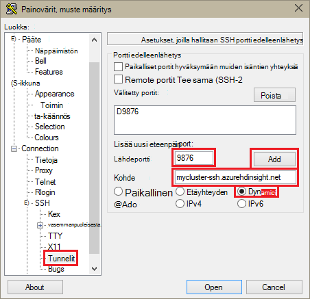
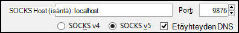
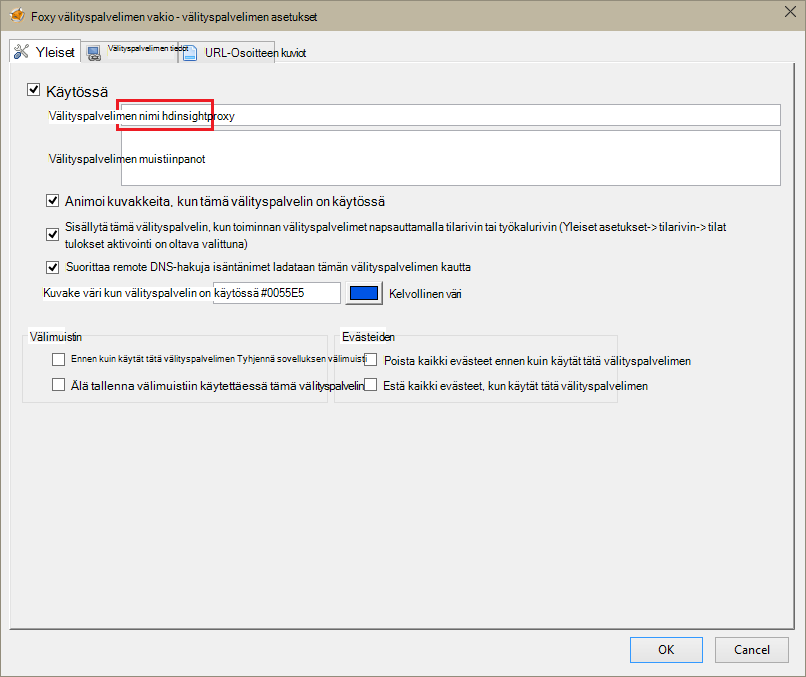
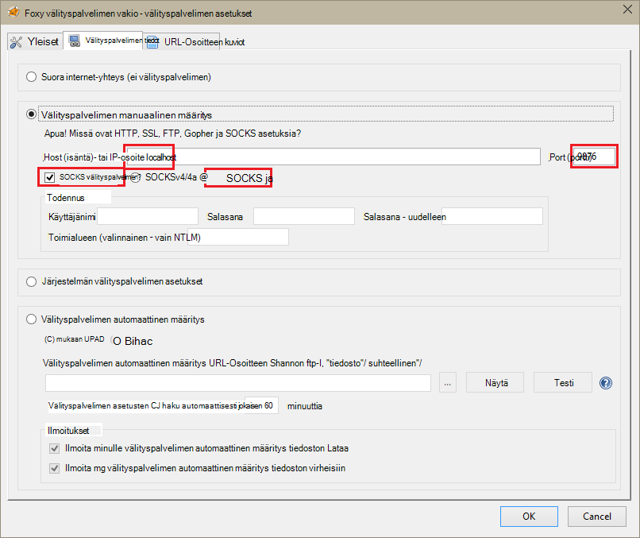
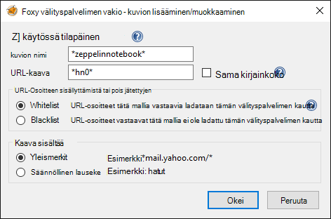
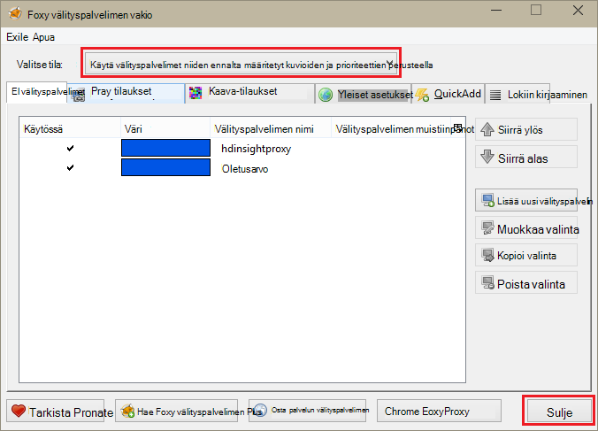

<properties 
    pageTitle="Zeppelin muistikirjat Apache Ohjattu klusterin asentaminen HDInsight Linux | Microsoft Azure" 
    description="Vaiheittaiset ohjeet ovat asentaminen ja Zeppelin muistikirjojen käyttäminen ohjattu klustereiden HDInsight Linux." 
    services="hdinsight" 
    documentationCenter="" 
    authors="nitinme" 
    manager="jhubbard" 
    editor="cgronlun"/>

<tags 
    ms.service="hdinsight" 
    ms.workload="big-data" 
    ms.tgt_pltfrm="na" 
    ms.devlang="na" 
    ms.topic="article" 
    ms.date="10/28/2016" 
    ms.author="nitinme"/>

# Asenna Zeppelin muistikirjat Apache Ohjattu klusterin HDInsight Linux

Opettele Zeppelin muistikirjat asentaminen Apache ohjattu klustereiden ja suorita ohjattu työt Zeppelin muistikirjat avulla.

> [AZURE.IMPORTANT] Zeppelin muistikirjat ovat nyt käytettävissä ohjattu klustereiden oletusarvoisesti. Ei tarvitse asentaa ne nimenomaisesti Ohjattu klusterin enää. Lisätietoja on artikkelissa, [Käytä Zeppelin muistikirjojen Apache Ohjattu klusterin HDInsight Linux](hdinsight-apache-spark-zeppelin-notebook.md). 

**Edellytykset:**

* Ennen kuin aloitat Tässä opetusohjelmassa, sinun on oltava Azure tilaus. Katso [Hae Azure maksuttoman kokeiluversion](https://azure.microsoft.com/documentation/videos/get-azure-free-trial-for-testing-hadoop-in-hdinsight/).
* Ohjattu Apache-klusterin. Ohjeita on artikkelissa [Azure Hdinsightiin luominen Apache ohjattu varausyksiköt](hdinsight-apache-spark-jupyter-spark-sql.md).
* SSH-asiakas. Linux ja Unix jaot tai Macintosh OS X `ssh` komento on annettu käyttöjärjestelmän kanssa. (Windows) on suositeltavaa [painovärit, muste](http://www.chiark.greenend.org.uk/~sgtatham/putty/download.html)

    > [AZURE.NOTE] Jos haluat käyttää SSH asiakkaan muu kuin `ssh` tai painovärit, muste, siitä, miten voit luoda SSH tunnelin asiakkaan käyttöohjeisiin.

* Web-selaimessa, joka on määritetty käyttämään välityspalvelinta SOCKS

* __(valinnainen)__: laajennuksen, kuten [FoxyProxy](http://getfoxyproxy.org/,) , jotka koskevat säännöt, joka reitittää vain tietyn pyynnöt tunnelissa.

    > [AZURE.WARNING] Laajennuksen, kuten FoxyProxy, ilman kaikkien selaimen kautta pyyntöihin voidaan reitittää tunnelissa. Tämä saattaa johtaa hitaammin Ladataan verkkosivuja selaimessa.

## Ohjattu klusterin Zeppelin asentaminen

Voit asentaa Zeppelin ohjattu klusterissa komentosarja-toiminnon avulla. Komentosarja-toiminnon avulla mukautettuja komentosarjoja Asenna osat, joita ei ole oletusarvoisesti klusterin. Mukautettu komentosarja avulla voit asentaa Zeppelin Azure-portaalista käyttämällä HDInsight .NET SDK tai Azure PowerShell-toiminnolla. Komentosarjan avulla voit asentaa Zeppelin joko osana klusterin luominen, tai kun klusterin on hyvin alkuun. Seuraavissa osissa linkeissä ohjeita siitä, miten voit tehdä. 

### Azure-portaalissa

Katso ohjeet siitä, miten voit käyttää Azure-portaalin komentosarja-toiminnon asentaminen Zeppelin [mukauttaminen HDInsight klustereiden komentosarja-toiminnon avulla](hdinsight-hadoop-customize-cluster-linux.md#use-a-script-action-from-the-azure-portal). Sinun on tehtävä muutokset pari artikkelin ohjeita.

* Sinun on käytettävä komentosarja Zeppelin asentamiseksi. Mukautettu komentosarja Zeppelin asennetaan ohjattu HDInsight-klusteriin on seuraavissa linkeissä:
    * Ohjattu 1.6.0 klustereiden - varten`https://hdiconfigactions.blob.core.windows.net/linuxincubatorzeppelinv01/install-zeppelin-spark160-v01.sh`
    * Ohjattu 1.5.2 klustereiden - varten`https://hdiconfigactions.blob.core.windows.net/linuxincubatorzeppelinv01/install-zeppelin-spark151-v01.sh`

* Komentosarja-toiminto on suoritettava vain headnode.

* Komentosarja ei tarvitse parametreja. 

### HDInsight .NET SDK: N avulla

Katso ohjeet siitä, miten voit käyttää HDInsight .NET SDK komentosarja-toiminnon asentaminen Zeppelin [mukauttaminen HDInsight klustereiden komentosarja-toiminnon avulla](hdinsight-hadoop-customize-cluster-linux.md#use-a-script-action-from-the-hdinsight-net-sdk). Sinun on tehtävä muutokset pari artikkelin ohjeita.

* Sinun on käytettävä komentosarja Zeppelin asentamiseksi. Mukautettu komentosarja Zeppelin asennetaan ohjattu HDInsight-klusteriin on seuraavissa linkeissä:
    * Ohjattu 1.6.0 klustereiden - varten`https://hdiconfigactions.blob.core.windows.net/linuxincubatorzeppelinv01/install-zeppelin-spark160-v01.sh`
    * Ohjattu 1.5.2 klustereiden - varten`https://hdiconfigactions.blob.core.windows.net/linuxincubatorzeppelinv01/install-zeppelin-spark151-v01.sh`

* Komentosarja ei tarvitse parametreja. 

* Määritä ohjattu luot klusterin tyyppi.

### Azure PowerShellin avulla

Seuraavat PowerShell-koodikatkelman avulla voit luoda Ohjattu klusterin HDInsight Linux asennettu Zeppelin kanssa. Minkä version Ohjattu klusterin on sinun on päivitettävä alla sisältämään vastaava mukautettu komentosarja linkki PowerShell koodikatkelman. 

* Ohjattu 1.6.0 klustereiden - varten`https://hdiconfigactions.blob.core.windows.net/linuxincubatorzeppelinv01/install-zeppelin-spark160-v01.sh`
* Ohjattu 1.5.2 klustereiden - varten`https://hdiconfigactions.blob.core.windows.net/linuxincubatorzeppelinv01/install-zeppelin-spark151-v01.sh`

[AZURE.INCLUDE [upgrade-powershell](../../includes/hdinsight-use-latest-powershell.md)]

    Login-AzureRMAccount
    
    # PROVIDE VALUES FOR THE VARIABLES
    $clusterAdminUsername="admin"
    $clusterAdminPassword="<<password>>"
    $clusterSshUsername="adminssh"
    $clusterSshPassword="<<password>>"
    $clusterName="<<clustername>>"
    $clusterContainerName=$clusterName
    $resourceGroupName="<<resourceGroupName>>"
    $location="<<region>>"
    $storage1Name="<<storagename>>"
    $storage1Key="<<storagekey>>"
    $subscriptionId="<<subscriptionId>>"
    
    Select-AzureRmSubscription -SubscriptionId $subscriptionId
    
    $passwordAsSecureString=ConvertTo-SecureString $clusterAdminPassword -AsPlainText -Force
    $clusterCredential=New-Object System.Management.Automation.PSCredential ($clusterAdminUsername, $passwordAsSecureString)
    $passwordAsSecureString=ConvertTo-SecureString $clusterSshPassword -AsPlainText -Force
    $clusterSshCredential=New-Object System.Management.Automation.PSCredential ($clusterSshUsername, $passwordAsSecureString)
    
    $azureHDInsightConfigs= New-AzureRmHDInsightClusterConfig -ClusterType Spark
    $azureHDInsightConfigs.DefaultStorageAccountKey = $storage1Key
    $azureHDInsightConfigs.DefaultStorageAccountName = "$storage1Name.blob.core.windows.net"
    
    Add-AzureRMHDInsightScriptAction -Config $azureHDInsightConfigs -Name "Install Zeppelin" -NodeType HeadNode -Parameters "void" -Uri "https://hdiconfigactions.blob.core.windows.net/linuxincubatorzeppelinv01/install-zeppelin-spark151-v01.sh"
    
    New-AzureRMHDInsightCluster -Config $azureHDInsightConfigs -OSType Linux -HeadNodeSize "Standard_D12" -WorkerNodeSize "Standard_D12" -ClusterSizeInNodes 2 -Location $location -ResourceGroupName $resourceGroupName -ClusterName $clusterName -HttpCredential $clusterCredential -DefaultStorageContainer $clusterContainerName -SshCredential $clusterSshCredential -Version "3.3"
 
## Voit käyttää Zeppelin muistikirjaa tunneloida SSH määrittäminen

SSH tunneleita käytetään tietojenkäsittelyklusterissa vaatii yhteyden tietojenkäsittelyklusteriin ohjattu HDInsight Linux Zeppelin olevien muistikirjojen käyttö. Seuraavia ohjeita näytetään, miten voit luoda SSH tunnelin ssh komentoriviltä (Linux) ja painovärit, muste (Windows).

### Luoda tunnelin SSH-komennon (Linux)

Käytä seuraava komento luominen SSH tunnelin avulla `ssh` komento. Korvaa __käyttäjänimi__ HDInsight-klusterin SSH käyttäjän kanssa ja __CLUSTERNAME__ HDInsight-klusterin nimi

    ssh -C2qTnNf -D 9876 USERNAME@CLUSTERNAME-ssh.azurehdinsight.net

Tämä luo yhteys, joka reitittää liikenteen paikallisen portin 9876 klusteriin SSH päälle. Vaihtoehdot ovat:

* **D 9876** - paikallisen portin, joka reitittää liikenteen tunnelissa.

* **C** - pakata kaikki tiedot, koska web-liikenne on enimmäkseen tekstiä.

* **2** - voimassa SSH yrittää protokolla vain versio 2.

* **q** - Hiljainen tila.

* **T** - käytöstä pseudo tty kohdistus, koska on vain välitettävän portin.

* **n** - estää STDIN, lukeminen, koska on vain välitettävän portin.

* **N** - suorittaa remote-komento, koska on vain välitettävän portin.

* **f** - käynnissä taustalla.

Jos olet määrittänyt klusterin SSH avaimella, joudut ehkä käytä `-i` parametri ja määritä polku SSH yksityinen avain.

Kun komento on päättynyt, liikenne paikalliseen tietokoneeseen 9876 porttiin lähetetyt reititetään päälle Secure Sockets Layer (SSL) klusteriin head solmu ja peräisin näy.

### Luoda tunnelin painovärit, muste (Windows)

Seuraavien vaiheiden avulla voit luoda SSH-tunnelin painovärit, muste.

1. Avaa painovärit, muste ja kirjoita yhteyden tietoja. Jos et ole aiemmin käyttänyt painovärit, muste, lisätietoja [Käyttää SSH Linux-pohjaiset Hadoop HDInsight Windows-ja](hdinsight-hadoop-linux-use-ssh-windows.md) siitä, miten voit käyttää sitä Hdinsightista.

2. Vasemmalla puolella valintaikkunan **luokka** -osasta Laajenna **yhteyden**, laajenna **SSH**ja valitse sitten **tunneleita**.

3. Anna **asetukset, joilla hallitaan SSH portin edelleenlähetys** -lomakkeen seuraavat tiedot:

    * **Lähdeportti** - asiakas, johon haluat lähettää porttiin. Esimerkiksi **9876**.

    * **Kohde** - SSH osoite Linux-pohjaiset HDInsight-klusterin. Esimerkiksi **mycluster ssh.azurehdinsight.net**.

    * **Dynaaminen** – ottaa dynaaminen SOCKS välityspalvelimen reititys.

    

4. Lisää valitsemalla **Lisää** asetuksia ja valitse sitten **Avaa** SSH-yhteyden.

5. Kun sinulta kysytään, kirjaudu sisään palvelimeen. Tämä muodostaa SSH-istunnon ja ota käyttöön tunnelin.

### Käytä tunnelia selaimessa

> [AZURE.NOTE] Tämän osan vaiheet käyttää on vapaasti ladattavissa Linux, Unix, Macintosh OS X- ja Windows-järjestelmiä FireFox-selaimessa. Muissa nykyaikaista selaimissa, kuten Google Chrome ja Apple Safari Microsoft Edge pitäisi toimia mahdollisimman hyvin. kuitenkin käyttää muutama FoxyProxy laajennus ei ehkä ole käytettävissä kaikissa selaimissa.

1. Määritä selaimen käyttämään **localhost:9876** **SOCKS v5** -välityspalvelin. Seuraavassa on Firefox-asetuksia millaiseksi. Jos olet käyttänyt eri portin kuin 9876, muuta portin esitys:

    

    > [AZURE.NOTE] Valitsemalla **Remote DNS** ratkaisee (DNS, Domain Name System)-pyynnöt HDInsight-klusterin avulla. Jos kyseessä on valitsematon, DNS, ratkaistaan paikallisesti.

2. Varmista, että liikenne reitittyvät tunnelissa mukaan vising sivustossa, esimerkiksi [http://www.whatismyip.com/](http://www.whatismyip.com/) käytössä ja poissa käytöstä Firefoxissa välityspalvelimen asetusten kanssa. Kun asetukset ovat käytössä, tietokoneeseen, joten Microsoft Azure on IP-osoite.

### Selaimen tunnisteet

Selaimen tunnelia määrittäminen toimii, kun et halua yleensä reitittämään kaikki liikenne tunnelin päälle. Selaimen laajennuksia, kuten [FoxyProxy](http://getfoxyproxy.org/) tukevat kuvion vastaavat URL-Osoitteen pyyntöihin (FoxyProxy Standard tai Plus vain), niin, että vain tiettyjen URL-osoitteiden pyyntö lähetetään tunnelin kautta.

Jos olet asentanut FoxyProxy vakio, määritä se edelleenlähetys vain liikenne HDInsight päälle tunnelin seuraavien vaiheiden avulla.

1. Avaa FoxyProxy-tunniste selaimessa. Valitse esimerkiksi Firefoxissa FoxyProxy-kuvakkeen vieressä olevaan osoite-kenttään.

    

2. Valitse **Lisää uusi välityspalvelimen**, valitse **Yleiset** -välilehti ja kirjoita **HDInsightProxy**välityspalvelimen nimi.

    

3. **Välityspalvelimen tiedot** -välilehti ja täytä seuraavat kentät:

    * **Host (isäntä)- tai IP-osoite** - tämä on localhost, sillä on käytössä SSH tunnelin paikallisessa tietokoneessa.

    * **Portti** - tämä on SSH tunnelin käytettävän portin.

    * **SOCKS välityspalvelimen** – Valitse tämä vaihtoehto käyttöön käyttämään välityspalvelinta tunnelin selaimessa.

    * **SOCKS v5** – Valitse tämä vaihtoehto, voit määrittää välityspalvelimen tarvitaan versio.

    

4. Valitse **URL-Osoitteen kuviot** -välilehti ja valitse sitten **Lisää uusi kuvio**. Seuraavat avulla voit määrittää kuvio ja valitse sitten **OK**:

    * **Kuvion nimi** - **zeppelinnotebook** – tämä on helppokäyttöinen nimi kuvio.

    * **URL-Osoitteen kuvion** - **\*hn0** * – Tämä määrittää kaavan, joka vastaa sisäinen päätepisteen, jossa Zeppelin muistikirjat isännöidään täydellinen toimialuenimi. Koska Zeppelin muistikirjat ovat käytettävissä vain klusterin headnode0 ja päätepisteen on yleensä `http://hn0-<string>.internal.cloudapp.net`, käyttämällä kaavaa * *hn0** varmistaa, että pyyntö ohjataan Zeppelin päätepiste.

        

4. Valitse Lisää välityspalvelimen ja sulje **Välityspalvelimen** **OK** .

5. FoxyProxy-valintaikkunan yläreunassa muuttaminen **Valitse tilassa** **Käytä välityspalvelimet niiden ennalta määritetyt kuvioiden ja prioriteettien perusteella**ja valitse sitten **Sulje**.

    

Edellä kuvattujen toimenpiteiden jälkeen vain pyyntö URL-osoitteet, jotka sisältävät merkkijonon __hn0__ reititetty SSL-tunnelia päälle. 

## Accessin Zeppelin-muistikirja

Kun SSH tunneling asetukset, voit käyttää Zeppelin muistikirjaa Ohjattu klusterin noudattamalla seuraavia ohjeita seuraavien ohjeiden mukaisesti. Tässä osassa näkyy suorittaminen % sql- ja % rakenteen lauseita.

1. Avaa seuraavat päätepisteen-selaimella:

        http://hn0-myspar:9995

    * **hn0** ilmaisee headnode0
    * **myspar** on ohjattu klusterinimeä ensin kuusi kirjainta.
    * **9995** on portti, jossa Zeppelin muistikirja on käytettävissä.

2. Luo uusi muistikirja. Otsikko-ruudusta **muistikirja**ja valitse sitten **Luo uusi muistiinpano**.

    ![Luo uusi muistikirja Zeppelin] (./media/hdinsight-apache-spark-use-zeppelin-notebook/hdispark.createnewnote.png "Luo uusi muistikirja Zeppelin")

    Samalla sivulla, **Muistio** -otsikon alla näkyy uuden muistikirjan **Huomautus XXXXXXXXX**alkaen nimellä. Valitse uusi muistikirja.

3. Uuden muistikirjan web-sivulla otsikko ja muuttaa muistikirjan nimeä, jos haluat. Paina ENTER, Tallenna nimen muuttaminen. Varmista myös, että muistion otsikko näkyy **yhteys** -tila oikeassa alakulmassa.

    ![Zeppelin muistikirjan tila] (./media/hdinsight-apache-spark-use-zeppelin-notebook/hdispark.newnote.connected.png "Zeppelin muistikirjan tila")

### Suorita SQL-lauseet

4. Lataa mallitiedot väliaikaisen taulukossa. Luodessasi Ohjattu klusterin HDInsight mallitiedosto, **hvac.csv**kopioidaan kohdassa **\HdiSamples\SensorSampleData\hvac**liittyvän tallennustilan-tilille.

    Liitä tyhjän kappaleen, joka luodaan uusi muistikirja oletusarvoisesti seuraavat koodikatkelman.

        // Create an RDD using the default Spark context, sc
        val hvacText = sc.textFile("wasbs:///HdiSamples/HdiSamples/SensorSampleData/hvac/HVAC.csv")
        
        // Define a schema
        case class Hvac(date: String, time: String, targettemp: Integer, actualtemp: Integer, buildingID: String)
        
        // Map the values in the .csv file to the schema
        val hvac = hvacText.map(s => s.split(",")).filter(s => s(0) != "Date").map(
            s => Hvac(s(0), 
                    s(1),
                    s(2).toInt,
                    s(3).toInt,
                    s(6)
            )
        ).toDF()
        
        // Register as a temporary table called "hvac"
        hvac.registerTempTable("hvac")
        
    Paina **VAIHTO + ENTER** tai napsauta Suorita koodikatkelman kappaleen **Toista** -painiketta. Tilan kappaleen oikeassa olisi edistyminen-valmis odottavat suorittaminen valmiiksi. Tulos näyttää sama kappale alareunassa. Näyttökuvan näyttää seuraavalta:

    ![Tietoja väliaikaisen taulukon luominen] (./media/hdinsight-apache-spark-use-zeppelin-notebook/hdispark.note.loaddDataintotable.png "Tietoja väliaikaisen taulukon luominen")

    Voit myös kirjoittaa kunkin kappaleen otsikon. Valitse oikeassa yläkulmassa **asetukset** -kuvaketta ja valitse sitten **Näytä otsikko**.

5. Voit nyt suorittaa ohjattu SQL-lauseet **LVI** -taulukossa. Liitä seuraava kysely uuden kappaleen. Kysely palauttaa rakennuksen tunniste ja kohde ja todellinen lämpötilat etsimisen kunkin tiettynä päivänä. Paina **VAIHTO + ENTER**.

        %sql
        select buildingID, (targettemp - actualtemp) as temp_diff, date 
        from hvac
        where date = "6/1/13" 

    **% Sql** -lauseen alussa kertoo ohjattu SQL-kääntäjän käyttämään muistikirjaa. Voit tarkastella määritetyn tulkkien muistion otsikko **kääntäjän** -välilehdestä.

    Seuraavassa näyttökuvassa näkyy tulos.

    ![Suorita ohjattu SQL-lause muistikirja] (./media/hdinsight-apache-spark-use-zeppelin-notebook/hdispark.note.sparksqlquery1.png "Suorita ohjattu SQL-lause muistikirja")

     Valitse vaihtaa saman tuloksen erilaisia-esityksiä (korostettuna suorakulmio) näyttöasetukset. Valitse **asetukset** valitsemaan mitä consitutes avain ja arvot tulos. Näyttökuvan yläpuolella käyttää **rakennuksen tunniste** arvona avain ja **temp_diff** keskiarvon.

    
6. Voit lähettää arviointisivustopyynnön myös suorittamalla ohjattu SQL-lauseet muuttujien käyttäminen kyselyssä. Seuraava koodikatkelman näytetään, miten voit määrittää muuttujaa **Temp**-kysely, jossa on mahdolliset arvot haluat kyselyn, jossa. Kun suoritat kyselyn, avattavan luettelon täytetään automaattisesti muuttujan annetuilla arvoilla.

        %sql
        select buildingID, date, targettemp, (targettemp - actualtemp) as temp_diff
        from hvac
        where targettemp > "${Temp = 65,65|75|85}" 

    Liitä tämä koodikatkelman uuden kappaleen ja painamalla **VAIHTO + ENTER**. Seuraavassa näyttökuvassa näkyy tulos.

    ![Suorita ohjattu SQL-lause muistikirja] (./media/hdinsight-apache-spark-use-zeppelin-notebook/hdispark.note.sparksqlquery2.png "Suorita ohjattu SQL-lause muistikirja")

    Seuraavien kyselyjen voit valita uuden arvon avattavasta luettelosta ja suorita kysely uudelleen. Valitse **asetukset** valitsemaan mitä consitutes avain ja arvot tulos. Yllä näyttökuvan käyttää **rakennuksen tunniste** avaimeksi **temp_diff** arvona ja **targettemp** ryhmäksi keskiarvo.

7. Käynnistä ohjattu SQL-kääntäjän Lopeta sovellus uudelleen. Ylä- ja ohjattu kääntäjän **kääntäjän** -välilehti, valitse **Käynnistä**.

    ![Käynnistä Zeppelin intepreter] (./media/hdinsight-apache-spark-use-zeppelin-notebook/hdispark.zeppelin.restart.interpreter.png "Käynnistä Zeppelin intepreter")

### Suorita rakenteen lauseet

1. Valitse Zeppelin muistikirjaan, **kääntäjän** -painiketta.

    ![Päivitä rakenne kääntäjän] (./media/hdinsight-apache-spark-use-zeppelin-notebook/zeppelin-update-hive-interpreter-1.png "Päivitä rakenne kääntäjän")

2. Valitse **rakenne** -kääntäjän **Muokkaa**.

    ![Päivitä rakenne kääntäjän] (./media/hdinsight-apache-spark-use-zeppelin-notebook/zeppelin-update-hive-interpreter-2.png "Päivitä rakenne kääntäjän")

    Päivitä seuraavat ominaisuudet.

    * Arvoksi **default.password** määrittämäsi salasana luotaessa HDInsight Ohjattu klusterin järjestelmänvalvojan käyttäjälle.
    * Määritä **default.url** `jdbc:hive2://<spark_cluster_name>.azurehdinsight.net:443/default;ssl=true?hive.server2.transport.mode=http;hive.server2.thrift.http.path=/hive2`. Korvaa ** \<spark_cluster_name >** Ohjattu klusterin nimi.
    * Määritä **default.user** määrittämäsi luotaessa klusterin järjestelmänvalvojan käyttäjän nimi. Esimerkiksi *järjestelmänvalvoja*.

3. Valitse **Tallenna** ja kun pyytää käynnistämään rakenteen kääntäjän, valitse **OK**.

4. Uuden muistikirjan luominen ja suorittaminen seuraavan lauseen luettelon kaikki rakenteen klusterin taulukot.

        %hive
        SHOW TABLES

    HDInsight-klusterin on oletusarvoisesti esimerkkitaulukko, kutsutaan **hivesampletable** , jolloin näkyviin tulee seuraava tulos.

    ![Rakenne tulostus] (./media/hdinsight-apache-spark-use-zeppelin-notebook/zeppelin-update-hive-interpreter-3.png "Rakenne tulostus")

5. Suorita seuraava lause luettelon taulukon tietueita.

        %hive
        SELECT * FROM hivesampletable LIMIT 5

    Sinun tulee seuraavanlaisia tulos.

    ![Rakenne tulostus] (./media/hdinsight-apache-spark-use-zeppelin-notebook/zeppelin-update-hive-interpreter-4.png "Rakenne tulostus")

## Katso myös

* [Yleistä: Apache ohjattu-Azure Hdinsightiin](hdinsight-apache-spark-overview.md)

### Skenaariot

* [Ohjattu BI: vuorovaikutteinen tietojen analysoinnissa ohjattu käyttäminen HDInsight kanssa Liiketoimintatieto-työkaluista](hdinsight-apache-spark-use-bi-tools.md)

* [Ohjattu koneen Learning kanssa: Käytä ohjattu-HDInsight rakennuksen lämpötilan LVI tietojen analysointiin](hdinsight-apache-spark-ipython-notebook-machine-learning.md)

* [Ohjattu koneen Learning kanssa: Käytä ohjattu elintarvikkeiden tulokset ennustetaan HDInsight-](hdinsight-apache-spark-machine-learning-mllib-ipython.md)

* [Ohjattu virtautetun median: Käytä ohjattu HDInsight reaaliaikainen streaming sovellusten luomiseen:](hdinsight-apache-spark-eventhub-streaming.md)

* [Sivuston log analyysi ohjattu käyttäminen Hdinsightiin](hdinsight-apache-spark-custom-library-website-log-analysis.md)

### Luominen ja suorittaminen sovellukset

* [Luo erillisen-sovelluksen käyttäminen Scala](hdinsight-apache-spark-create-standalone-application.md)

* [Suorita työt etäyhteyden käyttämällä Livy ohjattu klusterissa](hdinsight-apache-spark-livy-rest-interface.md)

### Työkalut ja laajennukset

* [HDInsight Työkalut ‑laajennuksen IntelliJ VERRATA avulla voit luoda ja lähettää ohjattu Scala sovelluksia](hdinsight-apache-spark-intellij-tool-plugin.md)

* [Ohjattu sovellusten virheenkorjaus etäyhteyden HDInsight Työkalut ‑laajennuksen IntelliJ VERRATA avulla](hdinsight-apache-spark-intellij-tool-plugin-debug-jobs-remotely.md)

* [Ytimet käytettävissä Jupyter muistikirjan Ohjattu-klusterin Hdinsightiin](hdinsight-apache-spark-jupyter-notebook-kernels.md)

* [Ulkoiset pakettien käyttäminen Jupyter muistikirjat](hdinsight-apache-spark-jupyter-notebook-use-external-packages.md)

* [Asenna tietokoneeseen Jupyter ja muodosta yhteys ohjattu HDInsight-klusterin](hdinsight-apache-spark-jupyter-notebook-install-locally.md)

### Resurssien hallinta

* [Resurssien Azure Hdinsightiin Apache Ohjattu-klusterin](hdinsight-apache-spark-resource-manager.md)

* [Raita- ja Apache ohjattu töitä klusterin Hdinsightiin](hdinsight-apache-spark-job-debugging.md)

[hdinsight-versions]: hdinsight-component-versioning.md
[hdinsight-upload-data]: hdinsight-upload-data.md
[hdinsight-storage]: hdinsight-hadoop-use-blob-storage.md

[azure-purchase-options]: http://azure.microsoft.com/pricing/purchase-options/
[azure-member-offers]: http://azure.microsoft.com/pricing/member-offers/
[azure-free-trial]: http://azure.microsoft.com/pricing/free-trial/
[azure-management-portal]: https://manage.windowsazure.com/
[azure-create-storageaccount]: storage-create-storage-account.md 

