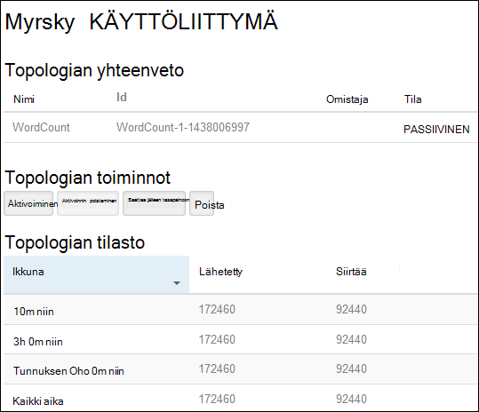
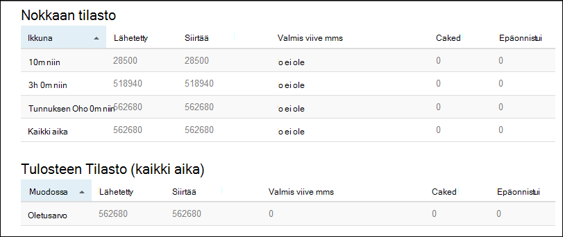

<properties
    pageTitle="Apache myrsky opetusohjelma: Aloita Linux-pohjaiset myrsky HDInsight | Microsoft Azure"
    description="Aloittaminen big datasta analytics Apache myrsky ja myrsky Starter mallit käyttäminen Linux-pohjaiset Hdinsightista. Opi käyttämään myrsky prosessin tietojen reaaliaikaista."
    keywords="Apache myrsky, apache myrsky opetusohjelma, big datasta analytics myrsky Starterissa"
    services="hdinsight"
    documentationCenter=""
    authors="Blackmist"
    manager="jhubbard"
    editor="cgronlun"/>

<tags
   ms.service="hdinsight"
   ms.devlang="java"
   ms.topic="get-started-article"
   ms.tgt_pltfrm="na"
   ms.workload="big-data"
   ms.date="10/12/2016"
   ms.author="larryfr"/>

# Apache myrsky opetusohjelma: big datasta analysoinnissa HDInsight-myrsky Starter-mallit käytön aloittaminen

Apache myrsky on skaalattava, vikasietoinen, eri aikajaksoille, reaaliaikainen laskenta järjestelmä virtaa tietojen käsittelyä varten. Azure HDInsight-myrsky voit luoda pilvipohjainen myrsky klusteriin, joka suorittaa big datasta analytics reaaliajassa.

> [AZURE.NOTE] Tässä artikkelissa kuvattuja Luo Linux-pohjaiset HDInsight-klusterin. Katso kohdasta Windows-pohjaisesta myrsky luomisesta HDInsight-klusterin [Apache myrsky opetusohjelma: tietojen analytics käyttäminen HDInsight myrsky Starter otosten käytön aloittaminen](hdinsight-apache-storm-tutorial-get-started.md)

## Edellytykset

[AZURE.INCLUDE [delete-cluster-warning](../../includes/hdinsight-delete-cluster-warning.md)]

Sinulla on oltava loppuun Apache myrsky Tässä opetusohjelmassa seuraavasti:

- **Azure-tilaus**. Katso [Hae Azure maksuttoman kokeiluversion](https://azure.microsoft.com/documentation/videos/get-azure-free-trial-for-testing-hadoop-in-hdinsight/).

- **SSH ja SCP tuntemusta**. Lisätietoja SSH ja SCP käyttäminen Hdinsightista on seuraavissa artikkeleissa:

    - **Linux, Unix tai OS X-asiakkaat**: Katso [Käytä SSH Linux-pohjaiset Hadoop HDInsight Linux, OS X tai Unix-kanssa](hdinsight-hadoop-linux-use-ssh-unix.md)

    - **Windows-asiakkaita**: [Käytä SSH kanssa Linux-pohjaiset Hadoop HDInsight Windows-](hdinsight-hadoop-linux-use-ssh-windows.md) kohdassa

### Access-ohjausobjektin vaatimukset

[AZURE.INCLUDE [access-control](../../includes/hdinsight-access-control-requirements.md)]

## Luo myrsky klusteri

Tässä osiossa luot HDInsight versiota 3.2 klusterin (myrsky versio 0.9.3) Azure Resurssienhallinta-mallin avulla. Katso tietoja HDInsight-versioista ja niiden palvelutasosopimuksia [HDInsight osan versiotiedot](hdinsight-component-versioning.md). Katso muiden klusterin luominen kautta, [Luo HDInsight klustereiden](hdinsight-hadoop-provision-linux-clusters.md).

1. Valitse Avaa malli Azure-portaalissa seuraavassa kuvassa.         

    
    
    Malli sijaitsee julkinen blob säilön, *https://hditutorialdata.blob.core.windows.net/armtemplates/create-linux-based-storm-cluster-in-hdinsight.json*. 
   
2. Valitse parametrit-sivu Anna seuraavat tiedot:

    - **ClusterName**: nimi, jonka aiot luoda Hadoop-klusterin.
    - **Klusterin käyttäjätunnus ja salasana**: Kirjautuminen oletusnimi on järjestelmänvalvoja.
    - **SSH käyttäjänimi ja salasana**.
    
    Kirjoita muistiin nämä arvot.  Tarvitset niitä myöhemmin-opetusohjelman.

    > [AZURE.NOTE] SSH käytetään etäyhteyden käyttämällä komentoriviä HDInsight-klusterin. Käyttäjänimi ja salasana, joita käytät tätä käytetään muodostettaessa yhteyttä klusterin SSH kautta. Lisäksi SSH käyttäjänimen on oltava yksilöiviä, luodessaan käyttäjätilille HDInsight klusterin solmuissa kaikki. Seuraavassa on kuvattu joitakin varattu services klusterin tilitiedot ja ei voi käyttää SSH käyttäjänimi:
    >
    > pääkansio, hdiuser, myrsky, hbase, ubuntu, zookeeper, hdfs, kuitenkaan, mapred, hbase, rakenne, oozie, falcon, sqoop, järjestelmänvalvoja, tez, hcat, hdinsight zookeeper.

    > Lisätietoja SSH käyttämisestä Hdinsightista on seuraavissa artikkeleissa:

    > * [Linux-pohjaiset Hadoop HDInsight Linux, Unix tai OS X-SSH käyttäminen](hdinsight-hadoop-linux-use-ssh-unix.md)
    > * [SSH käyttäminen Linux-pohjaiset Hadoop-HDInsight Windows](hdinsight-hadoop-linux-use-ssh-windows.md)

    
3 valitsemalla **OK** voit tallentaa parametrit.

4- **Mukautettu käyttöönotto** -sivu **resurssiryhmä** avattava luetteloruutu-ruutu ja valitse sitten Luo uusi resurssiryhmä **Uusi** . Resurssiryhmä on säilö, joka ryhmittelee klusterin, riippuvaiset tallennustilan tilin ja muut linkitetyn resurssi.

5 Valitse **ehdot**ja valitse sitten **Luo**.

6 valitsemalla **Luo**. Näkyviin tulee uusi ruutu liittyvä Submitting käyttöönoton mallin käyttöönottoa varten. Kestää noin 20 minuutin klusterin ja SQL-tietokannan luomiseen.

##Suorita myrsky Starter otoksen Hdinsightiin

Esimerkkejä [myrsky starter](https://github.com/apache/storm/tree/master/examples/storm-starter) sisällytetään HDInsight-klusterin. Seuraavat vaiheet suoritetaan WordCount esimerkki.

1. Yhdistä käyttäen SSH HDInsight-klusterin:

        ssh USERNAME@CLUSTERNAME-ssh.azurehdinsight.net
        
    Jos olet käyttänyt suojaamiseen SSH käyttäjätilin salasanan, voit pyydetään antamaan sitä. Jos olet käyttänyt julkisella avaimella, saatat joutua käyttämään `-i` parametri, voit määrittää vastaava yksityinen avain. Esimerkiksi `ssh -i ~/.ssh/id_rsa USERNAME@CLUSTERNAME-ssh.azurehdinsight.net`.
        
    Lisätietoja Linux-pohjaiset HDInsight SSH käyttämisestä on seuraavissa artikkeleissa:
    
    * [Linux-pohjaiset Hadoop HDInsight Linux, Unix tai OS X-SSH käyttäminen](hdinsight-hadoop-linux-use-ssh-unix.md)

    * [SSH käyttäminen Linux-pohjaiset Hadoop-HDInsight Windows](hdinsight-hadoop-linux-use-ssh-windows)

2. Seuraavalla komennolla voit käynnistää Esimerkki topologian:

        storm jar /usr/hdp/current/storm-client/contrib/storm-starter/storm-starter-topologies-*.jar storm.starter.WordCountTopology wordcount
        
    > [AZURE.NOTE] `*` Tiedostonimen osa käytetään vastaamaan versionumero, jonka muuttuu, kun Hdinsightista on päivitetty.

    Tämä käynnistää Esimerkki WordCount topologian klusterin kutsumanimi 'wordcount' kanssa. Se luo lauseiden satunnaisesti ja esiintymiskertojen laskeminen virkkeet kunkin sanan.

    > [AZURE.NOTE] Lähetettäessä topologian klusteriin on ensin kopioitava sisältävä klusterin ennen kuin käytät purkki tiedosto `storm` komento. Tämä onnistuu käyttämällä `scp` komennon asiakaskoneelta, jossa tiedosto sijaitsee. Esimerkiksi`scp FILENAME.jar USERNAME@CLUSTERNAME-ssh.azurehdinsight.net:FILENAME.jar`
    >
    > Yhteyttä klusterin sisältyvät jo WordCount esimerkiksi ja myrsky starter muita esimerkkejä `/usr/hdp/current/storm-client/contrib/storm-starter/`.

##Näytön topologian

Myrsky-Käyttöliittymän tarjoaa web-käyttöliittymän käyttöä käynnissä topologioissa ja sisältyy HDInsight-klusterin.

Seuraavien vaiheiden avulla voit valvoa myrsky käyttöliittymässä topologian:

1. Avaa selain ja https://CLUSTERNAME.azurehdinsight.net/stormui, missä __CLUSTERNAME__ yhteyttä klusterin nimen. Tämä avaa myrsky-Käyttöliittymä.

    > [AZURE.NOTE] Jos sinua pyydetään antamaan käyttäjänimi ja salasana, kirjoita klusterin järjestelmänvalvojaan (järjestelmänvalvojat) ja salasana, että voit käyttää, kun luot klusterin.

2. Valitse **topologian yhteenvedon** **nimi** -sarakkeen **wordcount** tapahtuma. Lisätietoja topologian valinta näyttää.

    

    Tällä sivulla on seuraavat tiedot:

    * **Topologian tilasto** - perustietoja topologian, suorituskykyyn järjestetty Windowsin.

        > [AZURE.NOTE] Aikaikkuna, jossa näkyvät sivun muiden osien tiedot valitsemalla tietyn aikaikkunan muuttuu.

    * **Spouts** - perustietoja spouts, mukaan lukien kunkin nokkaan palauttama viimeisimmän virheen.

    * **Bolts** - perustietoja Pultit.

    * **Topologian määrittäminen** – yksityiskohtaisia tietoja topologian määrittäminen.

    Tällä sivulla on myös toiminnot, jotka voidaan ottaa käyttöön topologian:

    * **Aktivoi** - aktivointi topologian käsittelyn ansioluettelot.

    * **Poista käytöstä** - pysäyttää käynnissä topologian.

    * Topologian rinnakkaisuus **saattaa jälleen tasapainoon** - säätää. Sinun pitäisi saattaa jälleen tasapainoon käynnissä topologioissa sen jälkeen, kun olet muuttanut klusterin solmujen määrän. Näin topologian Säädä rinnakkaisuus korvaamaan klusterin solmut kasvoi aiempaa pienempi määrä. Lisätietoja on kohdassa [tietoa myrsky topologian rinnakkaisuus](http://storm.apache.org/documentation/Understanding-the-parallelism-of-a-Storm-topology.html).

    * Myrsky topologian **lopettaa** - päättyy määritetyn aikakatkaisun jälkeen.

3. Valitse tällä sivulla merkinnän **Spouts** tai **Bolts** -osasta. Tämä tuo näyttöön valitun osan tietoja.

    

    Tällä sivulla näkyvät seuraavat tiedot:

    * Windowsin järjestetty **nokkaan/lukko tilasto** - osan suorituskykyyn perustiedot.

        > [AZURE.NOTE] Aikaikkuna, jossa näkyvät sivun muiden osien tiedot valitsemalla tietyn aikaikkunan muuttuu.

    * **Syötteen tilasto** (Määritä lukita vain) - osat, jotka tuottavat tiedot, jotka laitteen tiedot.

    * **Tulosteen tilasto** - lähettämän tämän laitteen tiedot.

    * **Pesänselvittäjät** - esiintymät, tämän osan tiedot.

    * **Virheet** - osan tuottamat virheitä.

4. Kun tarkastelet nokkaan tai laitteen tiedot, valitse merkinnän **pesänselvittäjät** osan työnkulun esiintymään osan tiedot **Port (portti)** -sarakkeen.

        2015-01-27 14:18:02 b.s.d.task [INFO] Emitting: split default ["with"]
        2015-01-27 14:18:02 b.s.d.task [INFO] Emitting: split default ["nature"]
        2015-01-27 14:18:02 b.s.d.executor [INFO] Processing received message source: split:21, stream: default, id: {}, [snow]
        2015-01-27 14:18:02 b.s.d.task [INFO] Emitting: count default [snow, 747293]
        2015-01-27 14:18:02 b.s.d.executor [INFO] Processing received message source: split:21, stream: default, id: {}, [white]
        2015-01-27 14:18:02 b.s.d.task [INFO] Emitting: count default [white, 747293]
        2015-01-27 14:18:02 b.s.d.executor [INFO] Processing received message source: split:21, stream: default, id: {}, [seven]
        2015-01-27 14:18:02 b.s.d.task [INFO] Emitting: count default [seven, 1493957]

    Näistä tiedoista näet, word **seitsemän** on tapahtunut 1493957 kertaa. Kuinka monta kertaa, se on havainnut tämän topologian käynnistämisestä on.

##Lopeta topologian

Palaa sanamäärä topologian **topologian yhteenveto** -sivulle ja valitse sitten **Poista** -painike **topologian toiminnot** -osassa. Kirjoita pyydettäessä 10 sekunnin ajan odottamaan tulet topologian. Jälkeen aikakatkaisuajan topologian eivät enää näy, kun käyt koontinäyttö **Myrsky Käyttöliittymän** osa.

##Klusterin poistaminen

[AZURE.INCLUDE [delete-cluster-warning](../../includes/hdinsight-delete-cluster-warning.md)]

##Seuraavat vaiheet

Apache myrsky Tässä opetusohjelmassa käytetään myrsky Starter opit luomaan HDInsight-klusterissa myrsky ja myrsky Raporttinäkymät-ikkunan avulla voit ottaa käyttöön, seurata ja hallita myrsky topologioissa. Lue seuraavaksi voit [kehittää Java-pohjainen topologioissa käyttämällä maven-testi](hdinsight-storm-develop-java-topology.md).

Jos olet jo kehittämisestä Java-pohjainen topologioissa ja haluat ottaa käyttöön aiemmin topologian HDInsight, katso lisätietoja [käyttöönotto ja hallita Apache myrsky topologioissa HDInsight-](hdinsight-storm-deploy-monitor-topology-linux.md).

Jos olet kehittäjä .NET, voit luoda C#- tai hybrid C# / Java topologioissa Visual Studiossa. Lisätietoja on artikkelissa [topologioissa C kehittää # Apache myrsky Hadoop työkaluilla Visual Studio HDInsight-varten](hdinsight-storm-develop-csharp-visual-studio-topology.md).

Esimerkiksi topologioissa, joka voidaan käyttää myrsky-HDInsight-kohdassa seuraavasti:

    * [Esimerkki topologioissa myrsky HDInsight-varten](hdinsight-storm-example-topology.md)

[apachestorm]: https://storm.incubator.apache.org
[stormdocs]: http://storm.incubator.apache.org/documentation/Documentation.html
[stormstarter]: https://github.com/apache/storm/tree/master/examples/storm-starter
[stormjavadocs]: https://storm.incubator.apache.org/apidocs/
[azureportal]: https://manage.windowsazure.com/
[hdinsight-provision]: hdinsight-provision-clusters.md
[preview-portal]: https://portal.azure.com/
