<properties
    pageTitle="Apache myrsky opetusohjelma: Aloita myrsky | Microsoft Azure"
    description="Aloittaminen big datasta analytics Apache myrsky ja myrsky Starter mallit käyttäminen Hdinsightista. Opi käyttämään myrsky prosessin tietojen reaaliaikaista."
    keywords="Apache myrsky, apache myrsky opetusohjelma, big datasta analytics myrsky Starterissa"
    services="hdinsight"
    documentationCenter=""
    authors="Blackmist"
    manager="jhubbard"
    editor="cgronlun"
    tags="azure-portal"/>

<tags
   ms.service="hdinsight"
   ms.devlang="java"
   ms.topic="article"
   ms.tgt_pltfrm="na"
   ms.workload="big-data"
   ms.date="09/07/2016"
   ms.author="larryfr"/>

# Apache myrsky opetusohjelma: big datasta analysoinnissa HDInsight-myrsky Starter-mallit käytön aloittaminen

Apache myrsky on skaalattava, vikasietoinen, eri aikajaksoille, reaaliaikainen laskenta järjestelmä virtaa tietojen käsittelyä varten. Microsoft Azure HDInsight-myrsky voit luoda pilvipohjainen myrsky klusteriin, joka suorittaa big datasta analytics reaaliajassa. 

> [AZURE.NOTE] Tässä artikkelissa kuvattuja luominen Windows-pohjaisesta HDInsight-klusterin. Voit luoda Linux-pohjaiset myrsky HDInsight-klusterin ohjeita on kohdassa [Apache myrsky opetusohjelma: tietojen analytics käyttäminen HDInsight myrsky Starter otosten käytön aloittaminen](hdinsight-apache-storm-tutorial-get-started-linux.md)

## Edellytykset

[AZURE.INCLUDE [delete-cluster-warning](../../includes/hdinsight-delete-cluster-warning.md)]

Sinulla on oltava loppuun Apache myrsky Tässä opetusohjelmassa seuraavasti:

- **Azure-tilaus**. Katso [Hae Azure maksuttoman kokeiluversion](https://azure.microsoft.com/documentation/videos/get-azure-free-trial-for-testing-hadoop-in-hdinsight/).

### Access-ohjausobjektin vaatimukset

[AZURE.INCLUDE [access-control](../../includes/hdinsight-access-control-requirements.md)]

## Luo myrsky klusteri

Myrsky HDInsight-käyttää Azure-Blob-säiliö lokitiedostot ja lähettää klusterin topologioissa tallentamiseen. Seuraavien vaiheiden avulla voit luoda oman klusterin Azure-tallennustilan tilin käyttöä varten:

1. Kirjautuminen [Azure Portal][preview-portal].

2. Valitse **Uusi**, valitse __Tietoja Analytics__ja valitse sitten __Hdinsightista__.

    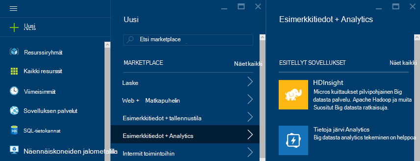

3. Kirjoita __klusterinimi__. __Klusterinimi__ viereen tulee vihreä valintamerkki, jos se on käytettävissä.

4. Jos sinulla on useita tilauksia, valitse Azure tilaus, jota käytetään klusterin __tilauksen__ tapahtuma.

5.  __Valitse klusterin tyyppi__ avulla voit valita __myrsky__ -klusterin. Valitse Windows- __käyttöjärjestelmä__. Valitse standardi __Klusterin taso__. Lopuksi Tallenna asetukset valitsemalla painikkeen avulla.

    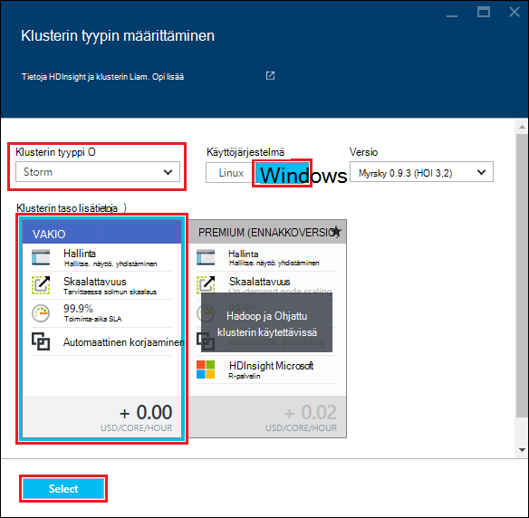

5. __Resurssiryhmä__-voit us avattavassa luettelossa aiemmin resurssiryhmien luettelo ja valitse sitten haluamasi vaihtoehto-klusterin luominen. Tai valitse __Uusi__ ja kirjoita sitten uusi resurssiryhmä nimi. Vihreä valintamerkki on näkyvissä ilmaisemaan, jos uuden ryhmänimi on käytettävissä.

6. Valitse __tunnistetiedot__ja kirjoita __Klusterin kirjautumisen käyttäjänimi__ ja __Klusterin kirjautumissalasana__. Lopuksi avulla voit __valita__ tunnistetietojen määrittäminen. Etätyöpöytä ei käytetä tässä asiakirjassa, jotta voit jättää sen käytöstä.

    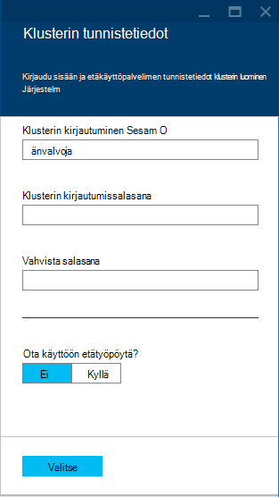

6. __Tietolähde__Valitse tapahtuma, jos haluat valita aiemmin luotuun tietolähteeseen tai luoda uuden.

    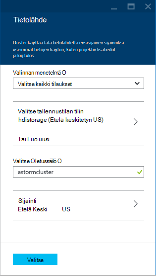

    Nyt voit valita Azure-tallennustilan tilin HDInsight-klusterin tietolähteenä. Seuraavat avulla voit selvittää merkintöjä __Tietolähde__ -sivu.

    - __Valinnan menetelmää__: asetus __-kaikkien tilausten__ käyttöön selaamisen tilauksistasi tallennustilan tilit. Arvoksi __Pikanäppäin__ , jos haluat kirjoittaa __Tallennustilan nimi__ ja käytössä olevan tallennustilan tilin __Pikanäppäin__ .

    - __Luo uusi__: tämän toiminnon avulla voit luoda uuden tallennustilan tilin. Käytä kentän, joka näkyy tallennustilan tilin nimi. Vihreä valintamerkki tulee näkyviin, jos se on käytettävissä.

    - __Valitse Oletussäilö__: Tällä komennolla voit klusterin käytettävät oletusarvo-säilö nimi. Samalla, kun kirjoitat sen nimeä, on suositeltavaa käyttää on sama nimi kuin klusterin niin, että on helppo muistaa, että tämä tiettyyn klusteri käytetään säilö.

    - __Sijainti__: maantieteellisen alueen, tallennustilan tili on, tai luodaan.

        > [AZURE.IMPORTANT] HDInsight-klusterin sijainti määrittää myös oletus tietolähteen sijainti. Klusterin ja oletusarvo-tietolähde on sijaittava samalla alueella.

    - __Valitse__: tämän toiminnon avulla voit tallentaa tietolähteen asetukset.

7. Valitse __Solmu hinnat tasoa__ , joka luodaan tämän klusterin solmut tiedon. Oletusarvon mukaan työntekijä solmujen määrän on määritetty __4__. Määritä tämä __1__, tämä on riittävä Tässä opetusohjelmassa ja vähentää klusterin kustannukset. Tämä sivu alareunassa näkyy klusterin arvioitu kustannus.

    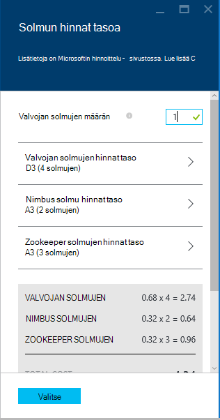

    __Valitse__ avulla voit tallentaa __Solmu hinnat tasoa__ tiedot.

8. Valitse __Vaihtoehtoinen määritys__. Tämä sivu voit valita klusterin-version sekä määrittää muita valinnaiset asetukset, kuten __VPN__liittyminen.

    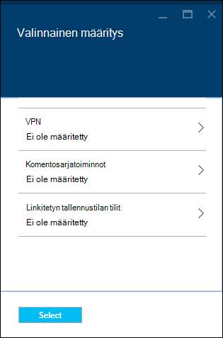

9. Varmista, että __Startboard Kiinnitä__ on valittuna, ja valitse sitten __Luo__. Tämä luo klusterin ja lisää se ruudun Azure-portaalin Startboard. Kuvake ilmaisee, että klusterin valmistelu ja muuttuu ja näyttää HDInsight-kuvaketta kerran valmistelu on valmis.

  	| Varattaessa | Valmis valmistelu |
  	| ------------------ | --------------------- |
  	|  | 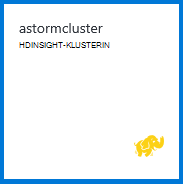 |

    > [AZURE.NOTE] Kestää jonkin aikaa klusterin luominen yleensä noin 15 minuuttia. Startboard tai sivun vasemmassa reunassa __ilmoitukset__ -tapahtuma ruudun avulla voit tarkistaa valmistelu prosessin.

## Suorita myrsky Starter otoksen Hdinsightiin

Apache myrsky Tässä opetusohjelmassa kerrotaan big datasta analytics myrsky Starter-mallit käyttäminen GitHub.

Kunkin myrsky HDInsight-klusterissa sisältyy myrsky raporttinäkymät-ikkuna, jonka avulla voidaan ladata ja käyttää myrsky topologioissa-klusterin. Kunkin klusterin sisältyy myös otoksen topologioissa, joka voidaan suorittaa suoraan myrsky Raporttinäkymät-ikkunan.

### Yhteyden muodostaminen koontinäyttö

Koontinäytön sijaitsee **https://&lt;clustername >.azurehdinsight.net//**, jossa **clustername** on klusterin nimi. Löydät linkin koontinäyttö myös valitsemalla klusterin Startboard ja valitsemalla sivu yläreunassa __Dashboard__ -linkki.

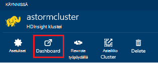

> [AZURE.NOTE] Koontinäytön yhdistettäessä sinua kehotetaan käyttäjänimi ja salasana. Tämä on järjestelmänvalvojan nimi (**järjestelmänvalvoja**) ja salasana, jota käytetään klusterin luonnin yhteydessä.

Kun myrsky Raporttinäkymät-ikkunan on ladattu, näyttöön tulee **Lähetä topologian** lomakkeen.

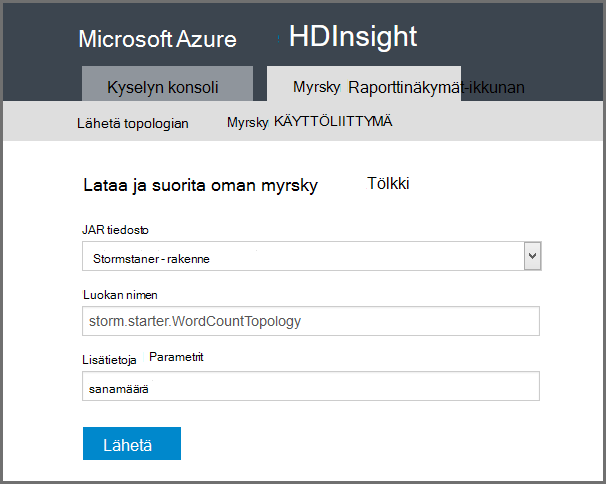

Lataa ja suorita .jar-tiedostoja, jotka sisältävät myrsky topologioissa voidaan **Lähettää topologian** lomakkeen. Se on myös basic näytteiden klusterin mukana toimitettuja.

### Sanamäärä otosten pitäminen GitHub myrsky Starter-projekti

Esimerkkejä, joiden mukana klusterin sisältää useita muunnoksia word laskien topologian. Näitä esimerkkejä Sisällytä **spout** , satunnaisesti tietokoneesta kuuluu äänimerkki virkkeet ja **bolts** , Katkaise lauseen yksittäisiksi sanoiksi ja laskea kunkin sanan on tapahtunut kuinka monta kertaa. Näitä esimerkkejä ovat [myrsky Starter-objektit](https://github.com/apache/storm/tree/master/examples/storm-starter), jotka ovat osa Apache myrsky.

Seuraavien toimien suorittamiseen myrsky Starter otoksen:

1. Valitse **StormStarter - WordCount** **Jar tiedoston** avattavasta luettelosta. Tämä lisää **Luokkanimi** ja **Muut parametrit** -kentät, joilla on tässä esimerkissä parametrit.

    

    * **Luokkanimi** - luokka, joka lähettää topologian .jar-tiedostossa.
    * **Lisää parametrit** - topologian vaadittavat parametrit. Tässä esimerkissä kenttää käytetään antamaan lähetetyn topologian kutsumanimi.

2. Valitse **Lähetä**. Hetken kuluttua **tulos** -kentässä näkyy komento, jolla voidaan lähettää työn sekä komennon tulokset. **Virhe** -kenttä näyttää mahdolliset virheet topologian lähettämistä.

    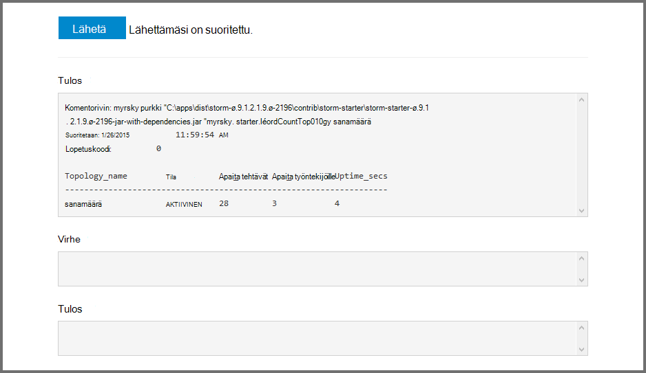

    > [AZURE.NOTE] Tulokset eivät osoittaa, että topologian on valmis - **on myrsky verkkotopologia, kerran aloittaminen suoritetaan, kunnes lopetetaan sitä.** Sanamäärä topologian Luo satunnaisen virkkeet ja säilyttää määrä, kuinka monta kertaa, se havaitsee kunkin sanan, kunnes lopetetaan.

### Näytön topologian

Myrsky-Käyttöliittymän avulla voidaan valvoa topologian.

1. Valitse **Myrsky UI** myrsky Raporttinäkymät-ikkunan yläreunasta. Yhteenvetotietojen klusterin ja kaikki käynnissä olevat topologioissa näkyviin.

    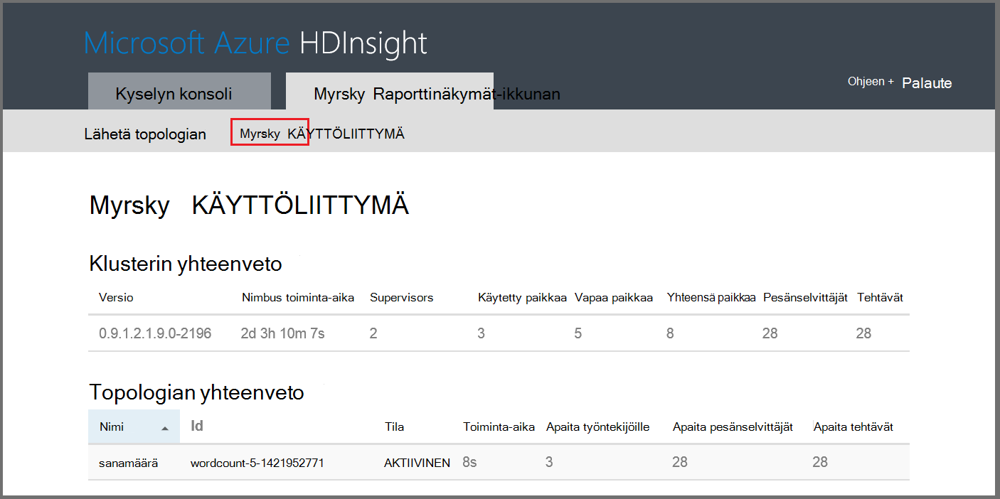

    Yllä-sivulla voit tarkastella topologian on ollut aktiivinen aika sekä työntekijöiden, pesänselvittäjät ja käytössä tehtävien määrä.

    > [AZURE.NOTE] **Nimi** -sarakkeessa on annettu aiemmin **Muut parametrit** -kentässä kutsumanimi.

4. Valitse **topologian yhteenvedon** **nimi** -sarakkeen **wordcount** tapahtuma. Lisätietoja topologian näyttöön.

    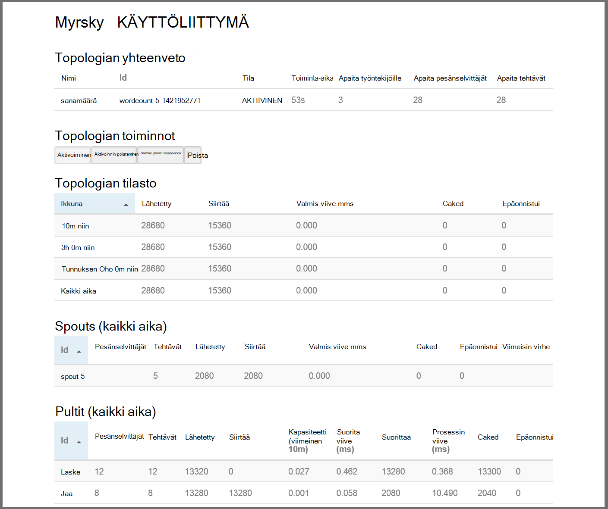

    Tällä sivulla on seuraavat tiedot:

    * **Topologian tilasto** - perustietoja topologian, suorituskykyyn järjestetty Windowsin.

        > [AZURE.NOTE] Aikaikkuna, jossa näkyvät sivun muiden osien tiedot valitsemalla tietyn aikaikkunan muuttuu.

    * **Spouts** - perustietoja spouts, mukaan lukien kunkin nokkaan palauttama viimeisimmän virheen.

    * **Bolts** - perustietoja Pultit.

    * **Topologian määrittäminen** – yksityiskohtaisia tietoja topologian määrittäminen.

    Tällä sivulla on myös toiminnot, jotka voidaan ottaa käyttöön topologian:

    * **Aktivoi** - aktivointi topologian käsittelyn ansioluettelot.

    * **Poista käytöstä** - pysäyttää käynnissä topologian.

    * Topologian rinnakkaisuus **saattaa jälleen tasapainoon** - säätää. Sinun pitäisi saattaa jälleen tasapainoon käynnissä topologioissa sen jälkeen, kun olet muuttanut klusterin solmujen määrän. Näin topologian Säädä rinnakkaisuus korvaamaan klusterin solmut kasvoi aiempaa pienempi määrä. Lisätietoja on kohdassa [tietoa myrsky topologian rinnakkaisuus](http://storm.apache.org/documentation/Understanding-the-parallelism-of-a-Storm-topology.html).

    * Myrsky topologian **lopettaa** - päättyy määritetyn aikakatkaisun jälkeen.

5. Valitse tällä sivulla merkinnän **Spouts** tai **Bolts** -osasta. Tämä näyttää valitun osan tietoja.

    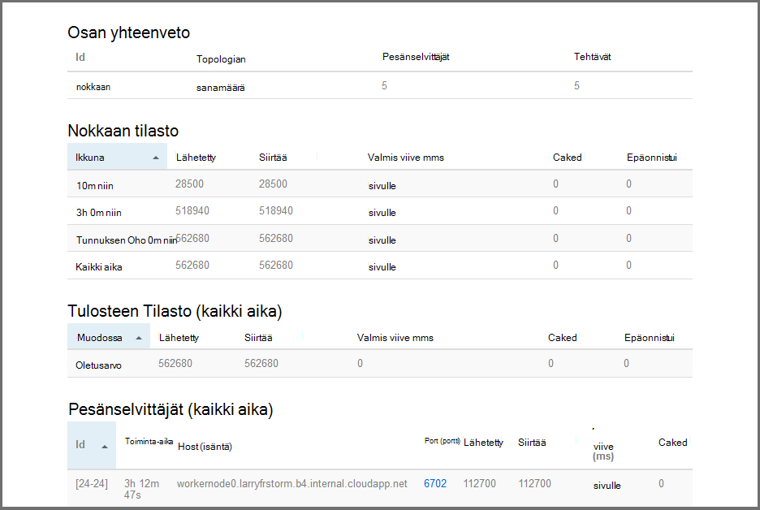

    Tällä sivulla näkyvät seuraavat tiedot:

    * Windowsin järjestetty **nokkaan/lukko tilasto** - osan suorituskykyyn perustiedot.

        > [AZURE.NOTE] Aikaikkuna, jossa näkyvät sivun muiden osien tiedot valitsemalla tietyn aikaikkunan muuttuu.

    * **Syötteen tilasto** (Määritä lukita vain) - osat, jotka tuottavat tiedot, jotka laitteen tiedot.

    * **Tulosteen tilasto** - lähettämän tämän laitteen tiedot.

    * **Pesänselvittäjät** - esiintymät, tämän osan tiedot.

    * **Virheet** - osan tuottamat virheitä.

5. Kun tarkastelet nokkaan tai laitteen tiedot, valitse merkinnän **pesänselvittäjät** osan työnkulun esiintymään osan tiedot **Port (portti)** -sarakkeen.

        2015-01-27 14:18:02 b.s.d.task [INFO] Emitting: split default ["with"]
        2015-01-27 14:18:02 b.s.d.task [INFO] Emitting: split default ["nature"]
        2015-01-27 14:18:02 b.s.d.executor [INFO] Processing received message source: split:21, stream: default, id: {}, [snow]
        2015-01-27 14:18:02 b.s.d.task [INFO] Emitting: count default [snow, 747293]
        2015-01-27 14:18:02 b.s.d.executor [INFO] Processing received message source: split:21, stream: default, id: {}, [white]
        2015-01-27 14:18:02 b.s.d.task [INFO] Emitting: count default [white, 747293]
        2015-01-27 14:18:02 b.s.d.executor [INFO] Processing received message source: split:21, stream: default, id: {}, [seven]
        2015-01-27 14:18:02 b.s.d.task [INFO] Emitting: count default [seven, 1493957]

    Näistä tiedoista näet, word **seitsemän** on tapahtunut 1,493,957 kertaa. Kuinka monta kertaa, se on havainnut tämän topologian käynnistämisestä on.

### Lopeta topologian

Palaa sanamäärä topologian **topologian yhteenveto** -sivulle ja valitse sitten **topologian toiminnot** -kohdasta **Poista** . Kirjoita pyydettäessä 10 sekunnin ajan odottamaan tulet topologian. Kun aikakatkaisuajan, topologian ei enää näy avatussa koontinäyttö **Myrsky Käyttöliittymän** osa.

##Klusterin poistaminen

[AZURE.INCLUDE [delete-cluster-warning](../../includes/hdinsight-delete-cluster-warning.md)]

## Yhteenveto

Apache myrsky Tässä opetusohjelmassa käytetään myrsky Starter opit luomaan HDInsight-klusterissa myrsky ja myrsky Raporttinäkymät-ikkunan avulla voit ottaa käyttöön, seurata ja hallita myrsky topologioissa.

## Seuraavat vaiheet

* **HDInsight Tools for Visual Studio** - HDInsight-työkalujen avulla voit käyttää Visual Studio Lähetä, seurata ja hallita myrsky topologioissa samalla mainittiin myrsky Raporttinäkymät-ikkunan. HDInsight Työkalut myös sisältää mahdollisuus luoda C# myrsky topologioissa sekä otoksen topologioissa, joita voit ottaa käyttöön ja suorittaa yhteyttä klusterin.

    Lisätietoja on artikkelissa [Visual Studio HDInsight-työkalujen avulla pääset alkuun](hdinsight-hadoop-visual-studio-tools-get-started.md).

* **Mallitiedostojen** - HDInsight myrsky klusterin on useita esimerkkejä **%STORM_HOME%\contrib** hakemistossa. Esimerkin pitäisi olla seuraavat:

    * Lähdekoodin – esimerkiksi myrsky starter-0.9.1.2.1.5.0-2057-sources.jar

    * Java Omat asiakirjat - esimerkiksi myrsky starter-0.9.1.2.1.5.0-2057-javadoc.jar

    * Esimerkki – esimerkiksi storm-starter-0.9.1.2.1.5.0-2057-jar-with-dependencies.jar

    "Jar"-komennon avulla voit purkaa lähdekoodin tai Java-tiedostoja. Esimerkiksi "jar - xvf myrsky-starter-0.9.1.2.1.5.0.2057-javadoc.jar".

    > [AZURE.NOTE] Java docs koostuvat verkkosivuille. Kun purkanut, **index.html** -tiedoston tarkasteleminen selaimessa avulla.

    Jos haluat käyttää näitä esimerkkejä, etätyöpöytä käyttöön HDInsight-klusterissa myrsky ja kopioi tiedostot **%STORM_HOME%\contrib**.

* Seuraava asiakirja on muita esimerkkejä, jotka voidaan käyttää myrsky HDInsight-luettelo:

    * [Esimerkki topologioissa myrsky HDInsight-varten](hdinsight-storm-example-topology.md)

[apachestorm]: https://storm.incubator.apache.org
[stormdocs]: http://storm.incubator.apache.org/documentation/Documentation.html
[stormstarter]: https://github.com/apache/storm/tree/master/examples/storm-starter
[stormjavadocs]: https://storm.incubator.apache.org/apidocs/
[azureportal]: https://manage.windowsazure.com/
[hdinsight-provision]: hdinsight-provision-clusters.md
[preview-portal]: https://portal.azure.com/
