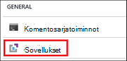
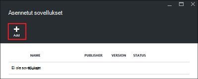
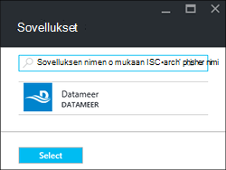
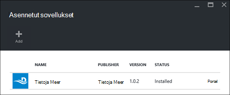

<properties
    pageTitle="Hadoop-sovellusten asentaminen HDInsight | Microsoft Azure"
    description="Opettele HDInsight-sovellusten asentaminen HDInsight-sovellukset."
    services="hdinsight"
    documentationCenter=""
    authors="mumian"
    manager="jhubbard"
    editor="cgronlun"
    tags="azure-portal"/>

<tags
    ms.service="hdinsight"
    ms.devlang="na"
    ms.topic="hero-article"
    ms.tgt_pltfrm="na"
    ms.workload="big-data"
    ms.date="09/14/2016"
    ms.author="jgao"/>

# HDInsight-sovellusten asentaminen

HDInsight-sovellus on sovellus, jonka käyttäjät voivat asentaa Linux-pohjaiset HDInsight-klusterissa. Nämä sovellukset voidaan kehittää Microsoft-riippumattomat toimittajat (ISV) tai itse. Tässä artikkelissa kerrotaan asentaminen julkaistu sovellus. Oman sovelluksen asentaminen artikkelissa [mukautetun HDInsight-sovellusten asentaminen](hdinsight-apps-install-custom-applications.md). 

Tällä hetkellä on julkaistu sovelluksen:

- **Datameer**: [Datameer](http://www.datameer.com/documentation/display/DAS50/Home?ls=Partners&lsd=Microsoft&c=Partners&cd=Microsoft) tarjoaa analyytikot vuorovaikutteinen tapa löytää, analysoida ja visualisointi Big datasta tuloksia. Vedä muita tietolähteitä helposti voit löytää uusia suhteita ja saada vastauksia kysymyksiisi nopeasti.

>[AZURE.NOTE] Datameer ei tällä hetkellä tuettu vain Azure Hdinsightiin versiota 3.2 klustereissa.

Tämän artikkelin ohjeita käyttämällä Azure portal. Voit myös Vie Azure Resurssienhallinta-malli-portaalista tai hankkia Resurssienhallinta-mallin toimittajilta ja ottaa mallin käyttöön PowerShellin Azure ja Azure CLI avulla.  Katso [luominen Linux-pohjaiset Hadoop klusterit HDInsight Resurssienhallinta mallien avulla](hdinsight-hadoop-create-linux-clusters-arm-templates.md).

## Edellytykset

Jos haluat HDInsight-sovellusten asentaminen aiemmin luotuun HDInsight-klusteriin, sinulla on oltava HDInsight-klusterin. Voit luoda luettelon kohdassa [Luo klustereiden](hdinsight-hadoop-linux-tutorial-get-started.md#create-cluster). Voit myös asentaa HDInsight-sovellusten, kun luot HDInsight-klusterin.

## Asenna sovellukset aiemmin klustereihin

Seuraavien ohjeiden avulla voit asentaa aiemmin luotuun HDInsight-klusteriin HDInsight-sovelluksia.

**HDInsight-sovelluksen asentaminen**

1. Kirjautuminen [Azure portal](https://portal.azure.com).
2. Valitse vasemmanpuoleisessa valikossa **HDInsight klustereiden** .  Jos et näe sitä, valitse **Selaa**ja valitse sitten **HDInsight klustereiden**.
3. Valitse HDInsight-klusterin.  Jos sinulla ei ole, sinun on luotava jokin ensimmäisen.  Katso [Luo klustereiden](hdinsight-hadoop-linux-tutorial-get-started.md#create-cluster).
4. Valitse **asetukset** -sivu, valitse **Yleiset** -luokka **sovellukset** . **Asennetut sovellukset** -sivu näyttää kaikki asennetut sovellukset. 

    

5. Valitse **Lisää** sivu-valikosta. 

    

    Aiemmin luotujen HDInsight-sovellusten luettelo on artikkelissa.

    

6. Valitse jokin sovelluksista, Hyväksy juridiset ehdot ja valitse sitten **Valitse**.

Näet asennustilan ilmoitukset-portaalin (Valitse portaalin ylälaidassa tili-kuvake). Kun sovellus on asennettu, sovellus ilmestyy asennetut sovellukset-sivu.

## Sovellusten asentaminen klusterin luonnin aikana

Voit halutessasi asentaa HDInsight-sovelluksia, kun luot klusterin. Aikana HDInsight-sovellukset asennetaan, kun klusterin luodaan, ja se on käytössä-tilassa. Seuraavien ohjeiden avulla voit asentaa HDInsight-sovelluksia, kun luot klusterin.

**HDInsight-sovelluksen asentaminen**

1. Kirjautuminen [Azure portal](https://portal.azure.com).
2. **Uusi**ja valitsemalla **tiedot + Analytics** **Hdinsightista**.
3. **Klusterin**nimi: Tämä nimen on oltava yksilöivä.
4. Valitse **tilaus** , jota käytetään klusterin Azure tilaus.
5. Valitse **klusterin tyyppi**ja valitse sitten:

    - **Klusterin tyyppi**: Jos et tiedä, mitä voit valita, valitse **Hadoop**. Suosituimpien klusterin tyyppi on.
    - **Käyttöjärjestelmä**: Valitse **Linux**.
    - **Versio**: Käytä oletusversio, jos et tiedä, mitä voit valita. Lisätietoja on artikkelissa [HDInsight-klusterin versiot](hdinsight-component-versioning.md).
    - **Klusterin taso**: Azure Hdinsightiin tarjoaa kahteen luokkaan big datasta cloud-tarjouksia: Vakio tason ja Premium taso. Lisätietoja on artikkelissa [klusterin tasoa](hdinsight-hadoop-provision-linux-clusters.md#cluster-tiers).
6. Valitse **sovellukset**, valitse jokin julkaistuissa sovelluksissa ja valitse sitten **Valitse**.
6. Valitse **tunnistetiedot** ja kirjoita sitten järjestelmänvalvoja-käyttäjän salasanan. Sinun on kirjoitettava **SSH käyttäjänimi** ja joko **SALASANAN** tai **JULKISELLA AVAIMELLA**, jota käytetään todennetaan SSH. Julkinen avain on suositellaan. **Valitse alalaidassa Tallenna tunnistetiedot-määritys.**
8. **Tietolähde**, valitse jokin olevan tallennustilan tilin tai luoda uuden tallennustilan tilin klusterin tallennustilan oletustiliksi käytettävä.
9. Olemassa olevan resurssiryhmä **Resurssiryhmä** tai valitse **Uusi** ja luo uusi resurssiryhmä

10. Varmista **Startboard Kiinnitä** on valittuna, ja valitse sitten **Luo** **Uusi HDInsight-klusterin** -sivu. 

## Luettelon HDInsight asennetut sovellukset ja ominaisuudet

Portaalin näyttää klusterin asennettujen HDInsight-sovellusten luettelo ja kunkin asennettu sovelluksen ominaisuuksia.

**Luettelossa HDInsight-sovelluksen ja ominaisuuksien näyttäminen**

1. Kirjautuminen [Azure portal](https://portal.azure.com).
2. Valitse vasemmanpuoleisessa valikossa **HDInsight klustereiden** .  Jos et näe sitä, valitse **Selaa**ja valitse sitten **HDInsight klustereiden**.
3. Valitse HDInsight-klusterin.
4. Valitse **asetukset** -sivu, valitse **Yleiset** -luokka **sovellukset** . Asennetut sovellukset-sivu näyttää kaikki asennetut sovellukset. 

    

5. Valitse jokin näyttämään ominaisuuden asennetut sovellukset. Ominaisuus-sivu on esitetty:

    - Sovelluksen nimi: sovelluksen nimi.
    - Tila: sovelluksen tila. 
    - WWW-sivu: URL-osoite web-sovellus, jonka olet ottanut käyttöön reuna-solmu silloin ei mitään. Tunnistetieto on sama kuin HTTP käyttäjän tunnistetietoja, jonka olet määrittänyt klusterin.
    - HTTP-päätepisteen: tunnistetieto on sama kuin HTTP käyttäjän tunnistetietoja, jonka olet määrittänyt klusterin. 
    - SSH päätepisteen: Voit käyttää [SSH](hdinsight-hadoop-linux-use-ssh-unix.md) reuna-solmu yhdistäminen. SSH tunnistetiedot ovat samat kuin SSH käyttäjän tunnistetietoja, jonka olet määrittänyt klusterin.

6. Sovelluksen poistaminen hiiren kakkospainikkeella sovellus ja valitse sitten pikavalikosta **Poista** .

## Yhteyden muodostaminen reuna-solmu

Voit muodostaa yhteyden HTTP ja SSH reuna-solmu. Päätepistetiedot löytyvät [portal](#list-installed-hdinsight-apps-and-properties). Lisätietoja SSH on artikkelissa [Käyttäminen SSH kanssa Linux-pohjaiset Hadoop-HDInsight Linux, Unix-tai OS X](hdinsight-hadoop-linux-use-ssh-unix.md). 

HTTP-päätepisteen tunnistetiedot ovat HTTP käyttäjän tunnistetietoja, jonka olet määrittänyt HDInsight-klusterin; SSH päätepisteen tunnistetiedot ovat SSH tunnistetiedot, jotka olet määrittänyt HDInsight-klusterin.

## Vianmääritys

Katso lisätietoja [kohdasta asennuksen vianmääritys](hdinsight-apps-install-custom-applications.md#troubleshoot-the-installation).

## Seuraavat vaiheet

- [Mukautetun HDInsight-sovellusten asentaminen](hdinsight-apps-install-custom-applications.md): käyttöönotto yhdistelmävisualisoinnin julkaistu HDInsight-sovellus, Hdinsightista.
- [Julkaise HDInsight-sovellukset](hdinsight-apps-publish-applications.md): opit julkaisemaan mukautettujen HDInsight sovellusten Azure Marketplacesta.
- [MSDN: HDInsight-sovelluksen asentaminen](https://msdn.microsoft.com/library/mt706515.aspx): Lue, miten voit määrittää HDInsight-sovellukset.
- [Mukauta Linux-pohjaiset HDInsight klustereiden komentosarja-toiminnon käyttäminen](hdinsight-hadoop-customize-cluster-linux.md): Lue, miten voit asentaa lisää sovelluksia komentosarja-toiminnon avulla.
- [Luo Linux-pohjaiset Hadoop klusterit HDInsight Resurssienhallinta mallien avulla](hdinsight-hadoop-create-linux-clusters-arm-templates.md): Lue, miten voit soittaa Resurssienhallinta mallien avulla voit luoda HDInsight klustereiden.
- [Käytä tyhjä reunan solmujen HDInsight](hdinsight-apps-use-edge-node.md): Opi käyttämään tyhjä reuna-solmu käyttäminen HDInsight-klusterin, HDInsight-sovellusten testaaminen ja isännöinnin HDInsight-sovellukset.

