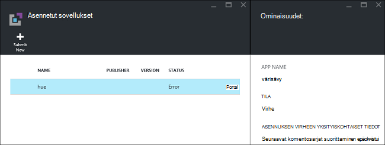
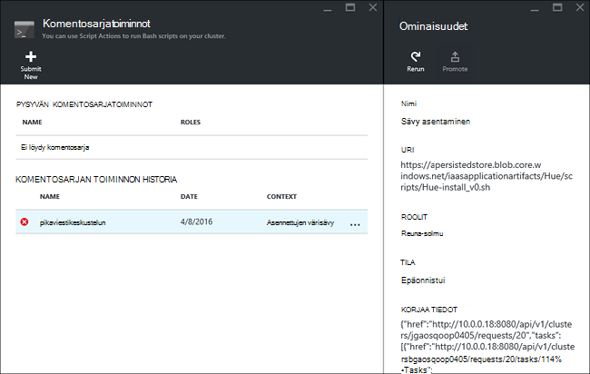

<properties
    pageTitle="Hadoop-sovellusten asentaminen HDInsight | Microsoft Azure"
    description="Opettele HDInsight-sovellusten asentaminen HDInsight-sovellukset."
    services="hdinsight"
    documentationCenter=""
    authors="mumian"
    manager="jhubbard"
    editor="cgronlun"
    tags="azure-portal"/>

<tags
    ms.service="hdinsight"
    ms.devlang="na"
    ms.topic="hero-article"
    ms.tgt_pltfrm="na"
    ms.workload="big-data"
    ms.date="09/14/2016"
    ms.author="jgao"/>

# Mukautetun HDInsight-sovellusten asentaminen

HDInsight-sovellus on sovellus, jonka käyttäjät voivat asentaa Linux-pohjaiset HDInsight-klusterissa.  Nämä sovellukset voidaan kehittää Microsoft-riippumattomat toimittajat (ISV) tai itse. Tässä artikkelissa kerrotaan asentaminen HDInsight-sovellus, joka ei ole julkaistu Azure HDInsight-portaaliin. Voit asentaa sovellus on [Sävy](http://gethue.com/). 

Muita aiheeseen liittyviä artikkeleita:

- [Asenna HDInsight sovellukset](hdinsight-apps-install-applications.md): Lue, miten voit asentaa sovelluksen oman klustereiden Hdinsightista.
- [Julkaise HDInsight-sovellukset](hdinsight-apps-publish-applications.md): opit julkaisemaan mukautettujen HDInsight sovellusten Azure Marketplacesta.
- [MSDN: HDInsight-sovelluksen asentaminen](https://msdn.microsoft.com/library/mt706515.aspx): Lue, miten voit määrittää HDInsight-sovellukset.

 
## Edellytykset

Jos haluat HDInsight-sovellusten asentaminen aiemmin luotuun HDInsight-klusteriin, sinulla on oltava HDInsight-klusterin. Voit luoda luettelon kohdassa [Luo klustereiden](hdinsight-hadoop-linux-tutorial-get-started.md#create-cluster). Voit myös asentaa HDInsight-sovellusten, kun luot HDInsight-klusterin.

## HDInsight-sovellusten asentaminen

HDInsight-sovellukset voi asentaa, kun luot klusteriin tai aiemmin luotuun HDInsight-klusteriin. Määrittäminen Azure Resurssienhallinta mallit-kohdassa [MSDN: HDInsight-sovelluksen asentaminen](https://msdn.microsoft.com/library/mt706515.aspx).

Tämän sovelluksen (sävyn) käyttöönotto tarvittavat tiedostot:

- [azuredeploy.JSON](https://github.com/hdinsight/Iaas-Applications/blob/master/Hue/azuredeploy.json): HDInsight-sovelluksen asentaminen Resurssienhallinta-malli. Katso [MSDN: HDInsight-sovelluksen asentaminen](https://msdn.microsoft.com/library/mt706515.aspx) kehittämiseen Resurssienhallinta-mallin.
- [Sävy install_v0.sh](https://github.com/hdinsight/Iaas-Applications/blob/master/Hue/scripts/Hue-install_v0.sh): komentosarja-toiminnon määrittämiseen reuna-solmu Resurssienhallinta-mallin kutsutaan. 
- [Sävy binaries.tgz](https://hdiconfigactions.blob.core.windows.net/linuxhueconfigactionv01/hue-binaries-14-04.tgz): hui install_v0.sh kutsutaan sävyä binaaritiedosto. 
- [värisävyä-binaaritiedostoja – 14-04.tgz](https://hdiconfigactions.blob.core.windows.net/linuxhueconfigactionv01/hue-binaries-14-04.tgz): hui install_v0.sh kutsutaan sävyä binaaritiedosto. 
- [webwasb tomcat.tar.gz](https://hdiconfigactions.blob.core.windows.net/linuxhueconfigactionv01/webwasb-tomcat.tar.gz): hui install_v0.sh kutsutaan otoksen verkkosovelluksen (Tomcat).

**Asenna sävyä aiemmin luotuun HDInsight-klusteriin**

1. Valitse seuraavassa kuvassa Azure kirjautuminen ja avaa Resurssienhallinta-malli Azure-portaalissa. 

    

    Tämä painike avaa Resurssienhallinta mallin Azure-portaalissa.  Resurssienhallinta-malli sijaitsee [https://github.com/hdinsight/Iaas-Applications/tree/master/Hue](https://github.com/hdinsight/Iaas-Applications/tree/master/Hue).  Opettele kirjoittamaan Resurssienhallinta-malli-kohdassa [MSDN: HDInsight-sovelluksen asentaminen](https://msdn.microsoft.com/library/mt706515.aspx).
    
2. - **Parametrit** -sivu Anna seuraavat tiedot:

    - **ClusterName**: Kirjoita klusterin nimi, johon haluat asentaa sovelluksen. Tämän klusterin on oltava aiemmin luodun klusterin.
    
3. Valitse **OK** , jos haluat tallentaa parametrit.
4. **Mukautettu käyttöönottoa** sivu, valitse Määritä **resurssiryhmä**.  Resurssiryhmä on säilö, joka ryhmittelee klusterin, riippuvaiset tallennustilan tilin ja muita resursseja. Se tarvitaan käyttää samaa resurssiryhmä klusterin.
5. Valitse **ehdot**ja valitse sitten **Luo**.
6. Tarkista **raporttinäkymät-ikkunan kiinnittäminen** -valintaruutu on valittuna ja valitse sitten **Luo**. Näet kiinnitettyinä portaalin Raporttinäkymät-ikkunan ja portaalin ilmoituksen ruutu asennuksen tila (Valitse portaalin ylälaidassa tili-kuvake).  Asenna sovellus vie noin 10 minuuttia.

**Asenna sävy klusteriin luomisen aikana**

1. Valitse seuraavassa kuvassa Azure kirjautuminen ja avaa Resurssienhallinta-malli Azure-portaalissa. 

    

    Tämä painike avaa Resurssienhallinta mallin Azure-portaalissa.  Resurssienhallinta-malli on osoitteessa [https://hditutorialdata.blob.core.windows.net/hdinsightapps/create-linux-based-hadoop-cluster-in-hdinsight.json](https://hditutorialdata.blob.core.windows.net/hdinsightapps/create-linux-based-hadoop-cluster-in-hdinsight.json).  Opettele kirjoittamaan Resurssienhallinta-malli-kohdassa [MSDN: HDInsight-sovelluksen asentaminen](https://msdn.microsoft.com/library/mt706515.aspx).

2. Luo klusterin ja asenna sävyä noudattamalla. Lisätietoja HDInsight klustereiden luomisesta on artikkelissa [luominen Linux-pohjaiset Hadoop varausyksiköt HDInsight](hdinsight-hadoop-provision-linux-clusters.md).

Azure-portaaliin, lisäksi voit käyttää myös [PowerShellin Azure](hdinsight-hadoop-create-linux-clusters-arm-templates.md#deploy-with-powershell) ja [Azure CLI](hdinsight-hadoop-create-linux-clusters-arm-templates.md#deploy-with-azure-cli) Soita Resurssienhallinta malleja.

## Vahvista asennuksen

Voit tarkistaa sovellusten tilan Vahvista sovelluksen asennuksen Azure-portaalissa. Lisäksi voit myös tarkistaa kaikki HTTP päätepisteet toimitettiin määrittäminen odotetusti ja WWW-sivu, jos sellainen on:

**Avaa värisävy-portaali**

1. Kirjautuminen [Azure portal](https://portal.azure.com).
2. Valitse vasemmanpuoleisessa valikossa **HDInsight klustereiden** .  Jos et näe sitä, valitse **Selaa**ja valitse sitten **HDInsight klustereiden**.
3. Napsauta kohtaa, johon olet asentanut sovelluksen klusterin.
4. Valitse **asetukset** -sivu, valitse **Yleiset** -luokka **sovellukset** . Näet on **sävyä** luetellut **Asennetut sovellukset** -sivu.
5. Valitse **sävyä** luettelon ominaisuudet-luettelosta.  
6. Vahvista sivuston; verkkosivun linkkiä Avaa HTTP-päätepisteen Vahvista sävyä web-Käyttöliittymä, Avaa [painovärit, muste](hdinsight-hadoop-linux-use-ssh-windows.md) tai muissa [SSH asiakkaiden](hdinsight-hadoop-linux-use-ssh-unix.md)SSH päätepisteen selaimessa.
 
## Asennuksen vianmääritys

Voit tarkistaa sovelluksen asennustilan portaalin ilmoitusajasta (Valitse portaalin ylälaidassa tili-kuvake). 

Jos sovelluksen asennus epäonnistui, näet virhesanomat ja korjata tiedot 3 paikasta:

- HDInsight-sovellukset: Yleinen virhetiedot.

    Avaa klusterin-portaalista ja valitse sovellukset-asetukset-sivu:

    

- HDInsight-komentosarja-toiminnon: Jos HDInsight-sovellusten virhesanoma ilmoittaa komentosarjan toiminto epäonnistui, tarkempia tietoja komentosarjan virheen esitetään komentosarjan toiminnot-ruudussa.

    Valitse komentosarja-toiminnon asetukset-sivu. Komentosarjan toiminnon historia näkyvät virheilmoitukset

    
    
- Ambari Web-Käyttöliittymä: Jos asennus komentosarja aiheuttaa virheen, Ambari Web-Käyttöliittymän tarkistaa käyttämällä koko lokeja asennuksen-komentosarjoja.

    Lisätietoja on kohdassa [vianmääritys](hdinsight-hadoop-customize-cluster-linux.md#troubleshooting).

## HDInsight-sovellusten poistaminen

Poistaa HDInsight useilla tavoilla.

### Portaalin käyttäminen

**Voit poistaa sovelluksen-portaalissa**

1. Kirjautuminen [Azure portal](https://portal.azure.com).
2. Valitse vasemmanpuoleisessa valikossa **HDInsight klustereiden** .  Jos et näe sitä, valitse **Selaa**ja valitse sitten **HDInsight klustereiden**.
3. Napsauta kohtaa, johon olet asentanut sovelluksen klusterin.
4. Valitse **asetukset** -sivu, valitse **Yleiset** -luokka **sovellukset** . Asennettujen sovellusten luettelo on artikkelissa. Tässä opetusohjelmassa **sävyä** luetellut **Asennetut sovellukset** -sivu.
5. Napsauta hiiren kakkospainikkeella sovellus, jonka haluat poistaa, ja valitse sitten **Poista**.
6. Vahvista valitsemalla **Kyllä** .

Työkaluportaaliin ja voit myös poistaa klusterin tai poistaa resurssiryhmä, joka sisältää sovelluksen.

### Azure PowerShellin käyttäminen

Azure-PowerShellin avulla voit poistaa klusterin tai poistaa resurssiryhmän. [Poista klustereiden Azure PowerShellin avulla](hdinsight-administer-use-powershell.md#delete-clusters)on artikkelissa.

### Käytä Azure CLI

Käytä Azure CLI, voit poistaa klusterin tai poistaa resurssiryhmän. Katso [poistaminen klustereiden Azure CLI avulla](hdinsight-administer-use-command-line.md#delete-clusters).

## Seuraavat vaiheet

- [MSDN: HDInsight-sovelluksen asentaminen](https://msdn.microsoft.com/library/mt706515.aspx): Lue, miten voit kehittää Resurssienhallinta malleja HDInsight-sovellusten käyttöönotto.
- [Asenna HDInsight sovellukset](hdinsight-apps-install-applications.md): Lue, miten voit asentaa sovelluksen oman klustereiden Hdinsightista.
- [Julkaise HDInsight-sovellukset](hdinsight-apps-publish-applications.md): opit julkaisemaan mukautettujen HDInsight sovellusten Azure Marketplacesta.
- [Mukauta Linux-pohjaiset HDInsight klustereiden komentosarja-toiminnon käyttäminen](hdinsight-hadoop-customize-cluster-linux.md): Lue, miten voit asentaa lisää sovelluksia komentosarja-toiminnon avulla.
- [Luo Linux-pohjaiset Hadoop klusterit HDInsight Resurssienhallinta mallien avulla](hdinsight-hadoop-create-linux-clusters-arm-templates.md): Lue, miten voit soittaa Resurssienhallinta mallien avulla voit luoda HDInsight klustereiden.
- [Käytä tyhjä reunan solmujen HDInsight](hdinsight-apps-use-edge-node.md): Opi käyttämään tyhjä reuna-solmu käyttäminen HDInsight-klusterin, HDInsight-sovellusten testaaminen ja isännöinnin HDInsight-sovellukset.
