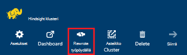
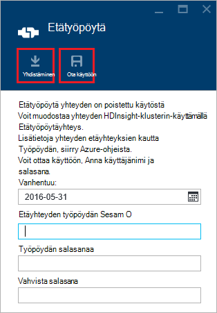
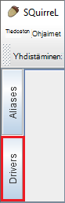
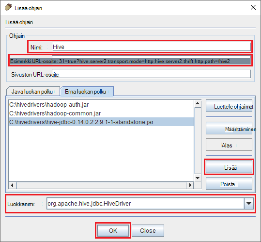
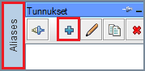
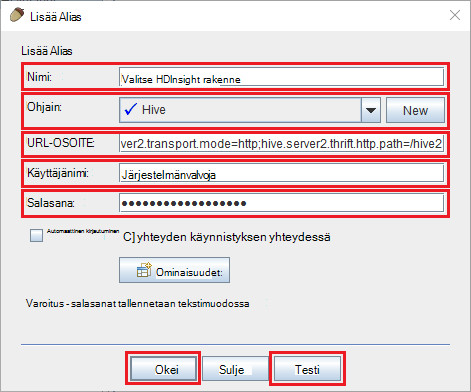
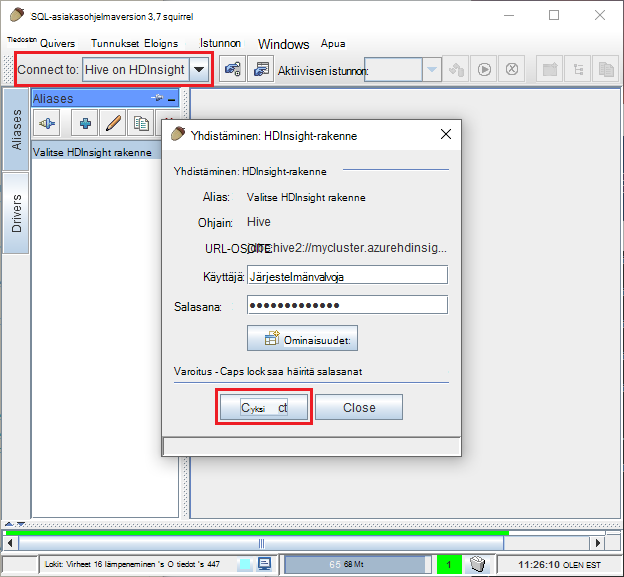
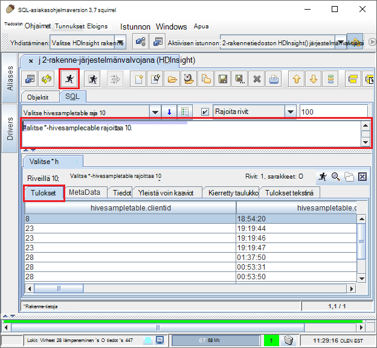

<properties
 pageTitle="Käytä JDBC kyselyn rakenne-Azure Hdinsightiin"
 description="Opi käyttämään JDBC Azure HDInsight-rakennetiedoston yhdistäminen ja suorita etäyhteyden pilveen tallennettujen tietojen kyselyt."
 services="hdinsight"
 documentationCenter=""
 authors="Blackmist"
 manager="jhubbard"
 editor="cgronlun"
    tags="azure-portal"/>

<tags
 ms.service="hdinsight"
 ms.devlang="java"
 ms.topic="article"
 ms.tgt_pltfrm="na"
 ms.workload="big-data"
 ms.date="08/23/2016"
 ms.author="larryfr"/>

#Yhteyden muodostaminen rakenne JDBC ohjaimen Azure HDInsight-rakenne

[AZURE.INCLUDE [ODBC-JDBC-selector](../../includes/hdinsight-selector-odbc-jdbc.md)]

Tässä asiakirjassa kerrotaan käyttämisestä JDBC Java-sovelluksesta lähettää etäyhteyden HDInsight-klusterin kyselyjä rakenne. Opit miten voit muodostaa SQuirreL SQL Clientin ja muodostaa ohjelmallisesti Java.

Lisätietoja käyttöliittymän JDBC rakenne on artikkelissa [HiveJDBCInterface](https://cwiki.apache.org/confluence/display/Hive/HiveJDBCInterface).

##Edellytykset

Tämän artikkelin seuraavien vaiheiden suorittamiseen tarvitset seuraavat:

* Hadoop HDInsight-klusterissa. Linux-pohjaiset tai Windows-pohjaisesta klustereiden toimii.

* [SQuirreL SQL](http://squirrel-sql.sourceforge.net/). SQuirreL on JDBC-asiakassovellukseen.

Muodosta ja Suorita esimerkki Java-sovelluksen linkitetty tästä artikkelista, sinun on seuraavasti.

* [Java Developer Kit (JDK) versio 7](https://www.oracle.com/technetwork/java/javase/downloads/jdk7-downloads-1880260.html) tai uudempi versio.

* [Apache maven-testi](https://maven.apache.org). Maven-testi on projektin luominen järjestelmän projektien Java, jota käytetään tämän artikkelin liittyvä projekti.

##Yhteysmerkkijono

HDInsight-klusterin Azure-yhteyksien JDBC tehdään yli 443 ja liikenne on suojattu SSL-yhteys. Julkinen yhdyskäytävän, varausyksiköiden istut takana ohjaa liikenne portti, johon HiveServer2 varsinaisesti Kuuntele. Jotta tyypillinen yhteysmerkkijonon haluaisit seuraavasti:

    jdbc:hive2://CLUSTERNAME.azurehdinsight.net:443/default;ssl=true?hive.server2.transport.mode=http;hive.server2.thrift.http.path=/hive2

Korvaa __CLUSTERNAME__ HDInsight-klusterin nimen.

##Todennus

Muodostettaessa yhteyttä, sinun on käytettävä HDInsight klusterin järjestelmänvalvojan käyttäjänimi ja salasana tarkistamiseen klusterin Gateway. Muodostettaessa JDBC asiakkaiden, kuten SQuirreL SQL järjestelmänvalvojan käyttäjänimi ja salasana on syötettävä-asiakasasetukset.

Java-ohjelmasta sinun on käytettävä käyttäjänimi ja salasana, kun yhteyden muodostamisesta. Esimerkiksi seuraava Java-koodi avautuu uusi yhteys yhteysmerkkijonon, järjestelmänvalvojan nimi ja salasana:

    DriverManager.getConnection(connectionString,clusterAdmin,clusterPassword);

##Yhdistä SQuirreL SQL Clientin

SQuirreL SQL on JDBC asiakas, joka voidaan näyttää etäyhteyden rakenteen kyselyjen HDInsight-klusterin. Seuraavissa vaiheissa oletetaan, että olet jo asentanut SQuirreL SQL ja tätä avulla lataamalla ja ohjaimet määrittäminen rakenne.

1. Kopioi HDInsight-klusterin rakenne JDBC-ohjaimet.

    * __Linux-pohjaiset HDInsight__varten tarvittavat purkki tiedostojen lataaminen seuraavien vaiheiden avulla.

        1. Luo uusi kansio, joka sisältää tiedostot. Esimerkiksi `mkdir hivedriver`.

        2. Komentokehote, Bash, PowerShell tai muita komentorivi muuttaa kansioiden uutta kansiota ja kopioi tiedostot HDInsight-klusterin seuraavat komennot avulla.

                scp USERNAME@CLUSTERNAME:/usr/hdp/current/hive-client/lib/hive-jdbc*standalone.jar .
                scp USERNAME@CLUSTERNAME:/usr/hdp/current/hadoop-client/hadoop-common.jar .
                scp USERNAME@CLUSTERNAME:/usr/hdp/current/hadoop-client/hadoop-auth.jar .

            Korvaa __käyttäjänimi__ klusterin SSH käyttäjänimi. Korvaa __CLUSTERNAME__ HDInsight-klusterinimi.

            > [AZURE.NOTE] Valitse Windows-ympäristössä tarvitset scp sijaan PSCP-apuohjelmalla. Voit ladata sen [http://www.chiark.greenend.org.uk/~sgtatham/putty/download.html](http://www.chiark.greenend.org.uk/~sgtatham/putty/download.html).

    * For __Windows-pohjaisesta HDInsight__purkki tiedostojen lataaminen seuraavien vaiheiden avulla.

        1. Azure-portaalista Valitse HDInsight-klusterin ja valitse sitten __Etätyöpöytä__ -kuvaketta.

            

        2. Etätyöpöytä-sivu-muodostaa yhteyttä klusterin __Yhdistä__ -painikkeen avulla. Jos Etätyöpöytä ei ole käytössä, Anna käyttäjänimi ja salasana, valitse Salli etätyöpöydän klusterin __käyttöön__ lomakkeen avulla.

            

            Kun olet valinnut __Muodosta__, .rdp-tiedosto ladataan. Käytä tätä tiedostoa käynnistää etätyöpöydän asiakkaan. Kun sinulta kysytään, käytä käyttäjänimen ja salasanan avulla etätyöpöydän käytön.

        3. Kun yhteys on muodostettu, kopioi seuraavat tiedostot etätyöpöydän istunnon paikallisessa tietokoneessa. Kirjoita ne paikallisen hakemiston `hivedriver`.

            * C:\apps\dist\hive-0.14.0.2.2.9.1-7\lib\hive-JDBC-0.14.0.2.2.9.1-7-standalone.JAR
            * C:\apps\dist\hadoop-2.6.0.2.2.9.1-7\share\hadoop\common\hadoop-Common-2.6.0.2.2.9.1-7.JAR
            * C:\apps\dist\hadoop-2.6.0.2.2.9.1-7\share\hadoop\common\lib\hadoop-auth-2.6.0.2.2.9.1-7.JAR

            > [AZURE.NOTE] Polut ja tiedostonimet versionumerot saattavat olla erilaiset yhteyttä klusterin.

        4. Irrota etätyöpöydän istunnon kun olet muuttanut kopioida tiedostoja.

3. Aloita SQuirreL SQL-sovellus. Valitse ikkunan vasemmassa reunassa __ohjaimet__.

    

4. Valitse __ohjaimet__ -valintaikkunan yläreunassa kuvakkeet __+__ kuvaketta, jos haluat luoda uuden ohjaimen.

    

5. Lisää seuraavat tiedot Lisää ohjaimen-valintaikkuna.

    * __Nimi__: rakenne
    * __Esimerkki URL-osoite__: jdbc:hive2://localhost:443/default;ssl=true?hive.server2.transport.mode=http;hive.server2.thrift.http.path=/hive2
    * __Luokan polusta__: Lisää-painiketta Lisää purkki tiedostot ladataan aiemmin käyttäminen
    * __Luokkanimi__: org.apache.hive.jdbc.HiveDriver

    

    Valitse __OK__ , jos haluat tallentaa nämä asetukset.

6. Valitse SQuirreL SQL-ikkunan vasemmassa reunassa __tunnukset__. Valitse __+__ kuvaketta, jos haluat luoda uuden yhteyden tunnuksen.

    

7. Käytä seuraavia arvoja __Lisää Alias__ -valintaikkunan.

    * __Nimi__: HDInsight-rakenne
    * __Ohjaimen__: avattavan luettelon avulla voit valita __rakenne__ -ohjain
    * __URL-osoite__: jdbc:hive2://CLUSTERNAME.azurehdinsight.net:443/default;ssl=true?hive.server2.transport.mode=http;hive.server2.thrift.http.path=/hive2

        Korvaa __CLUSTERNAME__ HDInsight-klusterin nimen.

    * __Käyttäjänimi__: HDInsight-klusterin klusterin kirjautuminen tilin nimeä. Oletusarvo on `admin`.
    * __Salasana__: klusterin kirjautuminen tilin salasanan. Tämä on antamasi luotaessa HDInsight-klusterin salasanan.

    

    __Testi__ -painikkeen avulla voit varmistaa, että yhteys toimii. Kun __Yhdistäminen: rakenne-HDInsight__ valintaikkuna ilmestyy näkyviin, valitse __Yhdistä__ testin suorittamiseen. Jos testi onnistuu, näet __yhteyden muodostaminen onnistui__ -valintaikkuna.

    Voit tallentaa yhteyden tunnus noudattamalla __Lisää Alias__ -valintaikkunan alareunassa __Ok__ -painike.

8. Valitse __Yhdistä__ avattavasta yläreunaan SQuirreL SQL- __rakenne-Hdinsightista__. Kun sinulta kysytään, valitse __Yhdistä__.

    

9. Kun yhteys on muodostettu, kirjoita seuraava kysely SQL-kysely-valintaikkunassa ja valitse sitten __Suorita__ -kuvake. Tulokset-alueen pitäisi näkyä kyselyn tulokset.

        select * from hivesampletable limit 10;

    

##Esimerkki Java-sovelluksen yhdistäminen

Esimerkki kyselyn rakenne Java asiakkaan käyttämiseen Hdinsightista on osoitteessa [https://github.com/Azure-Samples/hdinsight-java-hive-jdbc](https://github.com/Azure-Samples/hdinsight-java-hive-jdbc). Noudata muodosta ja suorita otosten säilö.

##Vianmääritys

### Odottamaton virhe avattaessa SQL-yhteys.

__Ongelmia__: HDInsight-klusterin, joka on versio 3.3 tai 3.4 yhdistettäessä näyttöön voi tulla Odottamaton virhe on tapahtunut virhe. Tämän virheen pinon jäljitys alkaa seuraavalla rivillä:

    java.util.concurrent.ExecutionException: java.lang.RuntimeException: java.lang.NoSuchMethodError: org.apache.commons.codec.binary.Base64.<init>(I)V
    at java.util.concurrent.FutureTas...(FutureTask.java:122)
    at java.util.concurrent.FutureTask.get(FutureTask.java:206)

__Syy__: Tämä virhe aiheutuu SQuirreL ja vaatii HDInsight-klusterin ladataan rakenne JDBC osia yksi commons codec.jar-tiedoston versio ei täsmää.

__Ratkaisu__: korjaa tämän virheen, noudata seuraavia ohjeita.

1. Lataa commons-pakkauksenhallinnan purkki tiedoston HDInsight-klusterin.

        scp USERNAME@CLUSTERNAME:/usr/hdp/current/hive-client/lib/commons-codec*.jar ./commons-codec.jar

2. Lopeta SQuirreL ja sitten Siirry kansioon, johon SQuirreL on asennettu järjestelmään. SquirreL kansioon Valitse `lib` hakemistosta, joka korvaa aiemmin commons-codec.jar yksi ladattujen HDInsight-klusterin.

3. Käynnistä SQuirreL. Virhe enää suoritetaan, kun yhteyden muodostaminen HDInsight-rakenne.

##Seuraavat vaiheet

Nyt oppinut voit käyttämisestä JDBC rakenne-käyttöä varten, seuraavat linkkien avulla voit tutkia muita esimerkkejä Azure Hdinsightiin.

* [Tietojen lataaminen Hdinsightiin](hdinsight-upload-data.md)
* [Rakenteen käyttäminen Hdinsightiin](hdinsight-use-hive.md)
* [Possu käyttäminen Hdinsightiin](hdinsight-use-pig.md)
* [MapReduce työt käyttäminen Hdinsightiin](hdinsight-use-mapreduce.md)
