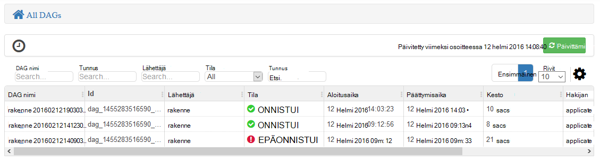
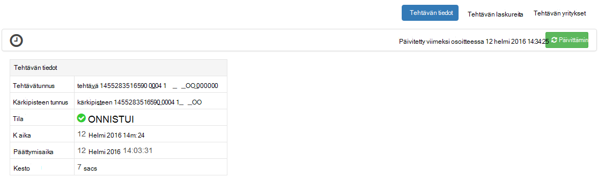

<properties
pageTitle="Ambari Tez näkymän käyttäminen HDInsight | Azure"
description="Opettele käyttämään Ambari Tez näkymän korjaamisessa Tez työt Hdinsightista."
services="hdinsight"
documentationCenter=""
authors="Blackmist"
manager="jhubbard"
editor="cgronlun"/>

<tags
ms.service="hdinsight"
ms.devlang="na"
ms.topic="article"
ms.tgt_pltfrm="na"
ms.workload="big-data"
ms.date="10/04/2016"
ms.author="larryfr"/>

# Virheenkorjaus Tez työt HDInsight Ambari näkymien avulla

HDInsight Ambari Web-Käyttöliittymän sisältää Tez näkymä, joka voidaan ymmärtää ja virheenkorjaus työt, joka käyttää Tez suorittamisen-ohjelma. Tez-näkymässä voit työn yhdistetyn kohteiden kaaviona visualisoiminen, kunkin kohteen siirtyminen ja hakea Tilasto- ja lokiin kirjaaminen.

> [AZURE.NOTE] Tässä asiakirjassa on Linux-pohjaiset HDInsight klustereiden. Lisätietoja vianmääritystä Tez työt käyttämällä Windows-pohjaisesta Hdinsightista on artikkelissa [Käytä virheenkorjaus Tez työt Windows-pohjaisesta HDInsight Tez Käyttöliittymän](hdinsight-debug-tez-ui.md).

## Edellytykset

* Linux-pohjaiset HDInsight-klusterin. Saat ohjeet uuden klusterin luominen, [käyttäminen Linux-pohjaiset HDInsight](hdinsight-hadoop-linux-tutorial-get-started.md).

* Uusi web-selaimessa, joka tukee HTML5-versiossa.

## Tietoja Tez

Tez on Hadoop, joka on suurempi kuin perinteisen MapReduce käsittely nopeuksia tietojen käsittely extensible raamit. Klustereiden Linux-pohjaiset Hdinsightista on rakenteen oletusarvo-ohjelma.

Kun työ on lähetetty Tez, se luo ohjataan asykliset Graph (DAG), joka kuvaa toiminnoista, joita tarvitaan projektin suorittaminen järjestystä. Toiminnoista on kärkipisteet ja suorita osan yleinen työn. Kärkipisteen kuvaaman työn todelliset suorittamisen kutsutaan tehtävän ja voivat jaetaan useiden klusterin solmut.

### Tietoja Tez-näkymä

Tez-näkymä sisältää tietoja prosesseja, joissa on käytössä tai jos käytössäsi on suorittanut aiemmin Tez avulla. Sen avulla voit tarkastella DAG luoma Tez, kuinka se jaetaan klustereiden, yksityiskohtaiset laskurit kuten käyttämän tehtävät ja kärkipisteet sekä virhetiedot. Se voi tarjota hyödyllisiä tietoja seuraavissa tilanteissa:

* Seuranta pitkään suoritettavien käsittelee kartan etenemisen tarkasteleminen ja vähentää tehtävät.

* Onnistuneiden tai epäonnistuneiden prosesseja kerrotaan, miten käsittely voidaan parantaa tai miksi sitä ei voitu Historiallisten tietojen analysoiminen.

## Luo DAG

Tez-näkymä sisältää vain tiedot, jos työn, joka käyttää Tez-ohjelma on käynnissä, tai se on suorittanut menneisyydessä. Yksinkertainen rakenne kyselyt voi yleensä voi ratkaista käyttämättä Tez, mutta monimutkaisia kyselyjä, jotka Tee suodatus, ryhmittely, järjestys-liitokset jne edellyttävät yleensä Tez.

Seuraavien vaiheiden avulla voit suorittaa rakenteen kysely, joka suoritetaan Tez.

1. Siirry selaimella, https://CLUSTERNAME.azurehdinsight.net, missä __CLUSTERNAME__ HDInsight-klusterin nimen.

2. Valitse sivun ylälaidassa olevasta valikosta __näkymät__ -kuvaketta. Tämä näyttää neliöitä sarjaa. Avattavassa valikossa, joka tulee näkyviin Valitse __Näytä rakenne__. 

    

3. Kun rakenteen latautuu, liitä seuraava kysely-editoriin ja valitse sitten __Suorita__.

        select market, state, country from hivesampletable where deviceplatform='Android' group by market, country, state;
    
    Kun työ on suoritettu, näkyy tulos näyttää __Prosessin kyselytulokset__ -osiossa. Tuloksena saadaan seuraavanlainen
    
        market  state       country
        en-GB   Hessen      Germany
        en-GB   Kingston    Jamaica
        
4. Valitse __Log__ -välilehti. Näet tietoja seuraavankaltaiselta:
    
        INFO : Session is already open
        INFO :

        INFO : Status: Running (Executing on YARN cluster with App id application_1454546500517_0063)

    Tallentavat tätä käytetään seuraavan osion __sovellustunnus__ -arvo.

## Tez-näkymän käyttäminen

1. Valitse sivun ylälaidassa olevasta valikosta __näkymät__ -kuvaketta. Valitse avattavasta, joka tulee näkyviin Valitse __Tez näkymä__.

    

2. Tez näkymän latautuessa näet luettelon DAGs, jotka ovat parhaillaan käynnissä tai on suorittanut klusterin. Oletusnäkymässä Dag nimi, tunnus, lähettäjän, tila, alkamisaika, päättymisaika, kesto, Sovellustunnus ja jonossa. Lisää sarakkeita voidaan lisätä käyttämällä hammaspyöräkuvaketta oikean sivun.

    

3. Jos sinulla on vain yksi merkintä, se on kysely, joka suoritit edellisessä osassa. Jos sinulla on useita kohtia, voit hakea syöttämällä Sovellustunnus __Sovellustunnus__ -kenttään ja paina sitten enter-näppäintä.

4. Valitse __Dag nimi__. Tietoja siitä, DAG ja mahdollisuus ladata zip JSON-tiedostoista, jotka sisältävät tietoja DAG tulevat näkyviin.

    

5. Yllä __DAG tiedot__ ovat useita linkkejä, joita voi käyttää tietoja DAG näytettävä.

    * __DAG laskureita__ näyttää tämän DAG laskureita.
    
    * __Graafinen esitys__ näyttää tämän DAG graafinen esitys.
    
    * __Kaikki kärkipisteitä__ näyttää kärkipisteet luettelo tämän DAG.
    
    * __Kaikki tehtävät__ näkyvät kaikki kärkipisteitä Tehtävät luettelo tämän DAG.
    
    * __Kaikki TaskAttempts__ näyttöön tulee tämä DAG tehtävien suorittamiseen yritykset tietoja.
    
    > [AZURE.NOTE] Jos siirryt kärkipisteitä, tehtäviä ja TaskAttempts sarakkeen-näyttö, Huomaa, että on linkkejä, voit tarkastella __laskureita__ ja __tarkastella tai ladata lokit__ kullekin riville.

    Jos virhe työhön, DAG-tiedot näkyvät epäonnistui, tila sekä linkkejä epäonnistui tehtävän tiedot. Diagnostiikan tiedot näkyvät alapuolella DAG tiedot.
    
    

7. Valitse __Graafinen esitys__. Graafinen kuvaus DAG näkyviin. Voit siirtämällä hiiren osoittimen kunkin kärkipiste näyttää sen tiedot-näkymässä.

    

8. Kärkipisteen valitsemalla Lataa kohteen __Kärkipiste tiedot__ . Valitse __Yhdistä 1__ kärkipiste tämän kohteen yksityiskohtaiset tiedot näkyviin.

    

9. Huomaa, että sinulla on nyt sivun yläreunassa linkkejä, jotka liittyvät kärkipisteitä ja tehtäviä.

    > [AZURE.NOTE] Tällä sivulla voit myös vuoroon palaaminen __DAG tiedot__, valitsemalla __Kärkipiste tiedot__ja valitsemalla __Yhdistä 1__ kärkipiste.

    * __Kärkipisteen laskureita__ näyttää tämän kärkipiste laskuri.
    
    * __Tehtävät__ näkyvät tässä kärkipiste tehtävät.
    
    * __Tehtävän yrittää__ näyttää tietoja yritetään suorittaa tämän kärkipiste tehtävät.
    
    * __Tietolähteiden ja poistumia__ näyttää tietolähteet ja täyttyvät, tämä kärkipiste.

    > [AZURE.NOTE] Kuin edellinen-pikavalikon avulla voit vierittää tehtäviä, tehtävän yritykset ja lähteiden ja Sinks__, näyttävän linkit lisätietoihin kunkin kohteen sarakkeen näyttöasetukset.

10. Valitse __tehtävät__ja valitse sitten kohde nimeltä __00_000000__. __Tehtävän tiedot__ tulevat näkyviin tämän tehtävän. Voit tarkastella __Tehtävän laskureita__ ja __Tehtävän yritykset__-näytössä.

    

## Seuraavat vaiheet

Nyt oppinut voit Tez-näkymän käyttämisestä, katso lisätietoja [Käyttämällä rakenne-Hdinsightista](hdinsight-use-hive.md).

Katso Tarkempia teknisiä tietoja Tez, [Hortonworks Tez-sivulle](http://hortonworks.com/hadoop/tez/).

Katso lisätietoja Ambari käyttämisestä HDInsight [hallinta HDInsight klustereiden käyttämällä Ambari Web-Käyttöliittymä](hdinsight-hadoop-manage-ambari.md)
