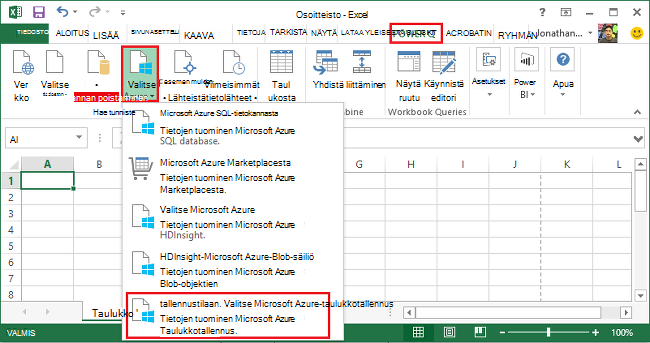
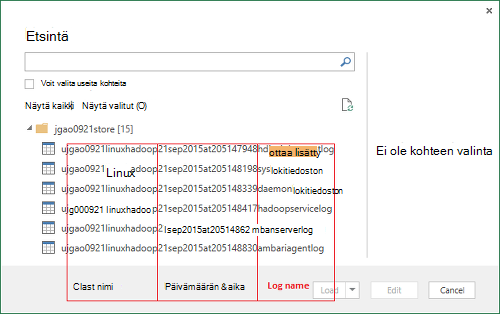
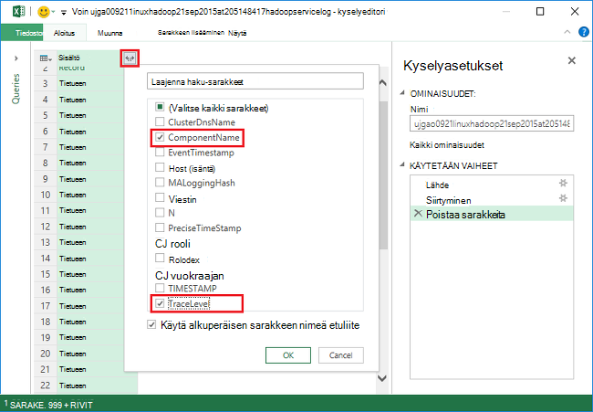
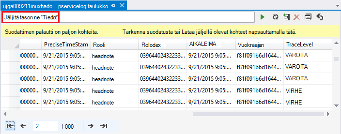
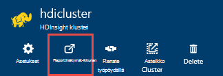
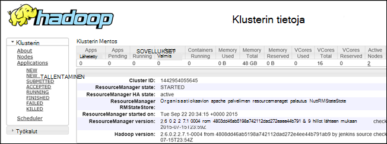

<properties
    pageTitle="Korjaa Hadoop HDInsight: lokit tarkasteleminen ja tulkitseminen virhesanomia | Microsoft Azure"
    description="Tietoja virhesanomista, näyttöön voi tulla hallinta PowerShellin avulla HDInsight ja palauttaa edellyttämät vaiheet."
    services="hdinsight"
    tags="azure-portal"
    editor="cgronlun"
    manager="jhubbard"
    authors="mumian"
    documentationCenter=""/>

<tags
    ms.service="hdinsight"
    ms.workload="big-data"
    ms.tgt_pltfrm="na"
    ms.devlang="na"
    ms.topic="article"
    ms.date="09/02/2016"
    ms.author="jgao"/>

# Analysoi HDInsight-lokit

Azure Hdinsightiin Hadoop kunkin klusterin on käytetty käyttöjärjestelmän Azure-tallennustilan tilin. Tallennustilan tilin kutsutaan tallennustilan oletustiliksi. Klusterin käyttää Azure-taulukkotallennus ja Blob-säiliö tallennustilan oletustilin tallentaa sen lokitiedot.  Yhteyttä klusterin tallennustilan oletustilin lisätietoja [hallinta Hadoop varausyksiköt Hdinsightista](hdinsight-administer-use-management-portal.md#find-the-default-storage-account). Lokit säilyttää tallennustilan tilin klusterin poistamisen jälkeen.

##Azure-taulukoiden kirjoitettu lokit

Azure-taulukoiden kirjoitettu lokit on yhden tason verran huomioon HDInsight-klusterin tapahtumat.

Kun luot HDInsight-klusterin, 6 taulukot luodaan automaattisesti oletusarvo-taulukkotallennus Linux-pohjaiset varausyksiköt:

- hdinsightagentlog
- syslog
- daemonlog
- hadoopservicelog
- ambariserverlog
- ambariagentlog

3 taulukot luodaan Windows-pohjaisesta klustereiden:

- Setuplog: tapahtumat/poikkeukset valmistelu/määrittäminen HDInsight klustereiden havaitsi loki.
- hadoopinstalllog: tapahtumat/poikkeukset havaitsi, kun asennat Hadoop klusterin loki. Tämä taulukko voi olla hyötyä virheenkorjaus klustereihin, joka on luotu käyttämällä mukautettuja parametreja liittyvät ongelmat.
- hadoopservicelog: lokin tapahtumat/poikkeusten tallentama kaikki Hadoop-palvelut. Tämä taulukko voi olla hyötyä virheenkorjaus työn virheet-HDInsight klustereiden liittyvät ongelmat.

Taulukon nimet ovat **u<ClusterName>DDMonYYYYatHHMMSSsss<TableName>**.

Seuraavassa taulukossa on seuraavat kentät:

- ClusterDnsName
- Ladattavissa
- EventTimestamp
- Host (isäntä)
- MALoggingHash
- Viestin
- N
- PreciseTimeStamp
- Rooli
- RowIndex
- Vuokraajan
- AIKALEIMA
- TraceLevel

### Työkalut, joilla lokit

Useita työkaluja ovat käytettävissä näissä taulukoissa tietojen käyttäminen:

-  Visual Studio
-  Azure-tallennustilan Explorer
-  Power Query for Excel

#### Käyttämällä Power Query for Excel

Power Queryn voidaan asentaa [www.microsoft.com/en-us/download/details.aspx?id=39379]( http://www.microsoft.com/en-us/download/details.aspx?id=39379). Lisätietoja järjestelmävaatimuksista lataamissivulla

**Avaa ja analysoi loki Power Queryn avulla**

1. Avaa **Microsoft Excelissä**.
2. **Power Query** -valikosta **From Azure**ja valitse sitten **Microsoft Azure-taulukosta tallennustilan**.
 
    
3. Kirjoita tallennustilan tilin nimi. Tämä voi olla lyhyt nimi tai täydellinen toimialuenimi.
4. Kirjoita tallennustilan tilin-näppäintä. Näet on taulukkoluettelon:

    
5. **Siirtymistoiminto** hadoopservicelog taulukkoa hiiren kakkospainikkeella ja valitse **Muokkaa**. Näet on 4 saraketta. Voit myös poistaa **Osion avaimen** **Rivi-näppäintä**ja **aikaleiman** sarakkeet valitsemalla ne ja valitse sitten **Poista sarakkeet** valintanauhan vaihtoehdoista.
6. Napsauta sisältö-sarakkeessa, valitse haluat tuoda Excel-laskentataulukon sarakkeet Laajenna-kuvaketta. Tässä esittelyssä varten voin valitsit TraceLevel ja ladattavissa: se Anna minulle joillekin perustiedoille, joina osat oli ongelmia.

    
7. Valitse **OK** , jos haluat tuoda tiedot.
8. **TraceLevel**, rooli ja **ladattavissa** sarakkeet ja valitse sitten **Group By** -ohjausobjektin valintanauhassa.
9. Valitse Ryhmittelyperuste-valintaikkunassa **OK**
10. Valitse** Käytä ja sulje**.
 
Voit nyt Excel suodattaminen ja lajitteleminen tarpeen mukaan. Selvästi haluat sisällyttää jotta porautuminen ongelmia ilmenee, mutta edellä kuvatun sarakkeiden valitsemista ja ryhmittelemistä sisältää, mitä tapahtuu ‑palveluiden Hadoop decent kuvan muiden sarakkeiden (kuten viesti). Saman verrata voi suojata setuplog ja hadoopinstalllog taulukoihin.

#### Visual Studiolla

**Jos haluat käyttää Visual Studio**

1. Avaa Visual Studio.
2. Valitse **Näytä** -valikossa **Cloud Explorer**. Tai valita **CTRL +\, CTRL + X**.
3. Valitse **Cloud Explorer** **Resurssityypit**.  Muita käytettävissä oleva vaihtoehto on **Resurssiryhmät**.
4. Laajenna **Tallennustilan tilit**-yhteyttä klusterin tallennustilan oletustilin ja **taulukot**.
5. Kaksoisnapsauta **hadoopservicelog**.
6. Lisää suodatin. Esimerkki:
    
        TraceLevel eq 'ERROR'

    

    Jos haluat lisätietoja suodattimien luomisesta on [Käyttää suodatinta merkkijonojen taulukon suunnitteluohjelman](../vs-azure-tools-table-designer-construct-filter-strings.md).
 
##Lokit kirjoitetaan Azure-Blob-säiliö

[Azure-taulukoiden kirjoitettu lokit](#log-written-to-azure-tables) on yhden tason verran huomioon HDInsight-klusterin tapahtumat. Näissä taulukoissa kuitenkin tarjoa tehtävätason lokit, joka voi olla hyötyä siirtyminen edelleen ongelmia ilmenee kyselyjä. Tarjoamaan tämän edistynyt tietojen HDInsight klustereiden määritetään kirjoittaa tehtävän lokit Blob-objektien tallennustilaan tiliisi työlle, joka lähetetään Templeton kautta. Tämä tarkoittaa käytännössä, työt, jotka on lähetetty käyttämällä Microsoft Azure PowerShellin cmdlet-komennot tai .NET työn lähetyksen API, ei RDP/command-line käyttöoikeus klusterin lähetettyjä työt. 

Lokit on artikkelissa [Access kuitenkaan sovelluksen kirjautuu Linux-pohjaiset Hdinsightista](hdinsight-hadoop-access-yarn-app-logs-linux.md).

Saat lisätietoja sovelluksen lokit [Simplifying käyttäjä on kirjautunut hallinta ja käyttöoikeudet-kuitenkaan](http://hortonworks.com/blog/simplifying-user-logs-management-and-access-in-yarn/).
 
 
## Näytä klusterin terveys- ja työn lokit

###Accessin Hadoop-Käyttöliittymä

Azure-portaalista napsauttamalla HDInsight klusterinimeä Avaa klusterin-sivu. Napsauta **raporttinäkymät-ikkunan**klusterin-sivu.

Kirjoita pyydettäessä klusterin järjestelmänvalvojan tunnistetietoja. Valitse kysely-konsolin, joka avautuu, **Hadoop-Käyttöliittymä**.

###Accessin kuitenkaan Käyttöliittymä

Azure-portaalista napsauttamalla HDInsight klusterinimeä Avaa klusterin-sivu. Napsauta **raporttinäkymät-ikkunan**klusterin-sivu. Kirjoita pyydettäessä klusterin järjestelmänvalvojan tunnistetietoja. Kyselyn konsolissa, joka avautuu Valitse **Kuitenkaan Käyttöliittymän**.

Voit käyttää kuitenkaan-Käyttöliittymä, toimi seuraavasti:

* **Klusterin tilan**. Laajenna **klusterin**vasemmanpuoleisessa ruudussa ja valitse **tietoja**. Tämä esitä klusterin tilatiedot, kuten summa varattua muistia, käyttää sydämiä tilan klusterin Resurssienhallinta-klusterin versio jne.

    

* **Solmun tilan**. Laajenna **klusterin**vasemmanpuoleisessa ruudussa ja valitse **solmut**. Tämä näyttää kaikki solmut kunkin solmun HTTP-osoite-klusterin kunkin solmun jne varatut resurssit.

* **Näytön tilan**. Laajenna **klusterin**vasemmanpuoleisessa ruudussa, ja valitse sitten **sovellusten** Luettele kaikki klusterin työt. Jos haluat tarkastella työt tietyn tilaan (esimerkiksi uusi, lähetetty, suorittaminen, jne.), napsauta haluamaasi linkkiä **sovellukset**-kohdassa. Voit valita muita työn nimen Lisätietoja työn tällaisten mukaan lukien tulosteen, lokit jne.

###Käyttää HBase-Käyttöliittymä

Azure-portaalista napsauttamalla HDInsight HBase klusterinimeä Avaa klusterin-sivu. Napsauta **raporttinäkymät-ikkunan**klusterin-sivu. Kirjoita pyydettäessä klusterin järjestelmänvalvojan tunnistetietoja. Kyselyn konsolissa, joka avautuu Valitse **HBase Käyttöliittymän**.

## HDInsight-virhekoodit

Tässä osassa eritelty virhesanomat toimitetaan Azure Hdinsightiin Hadoop käyttäjien hahmottaminen mahdollisen virhetilanteita, joissa niitä voi ilmetä, kun hallinta PowerShellin Azure palvelu ja edelleen lisäyksiksi toimenpiteistä, jotka voidaan ottaa palauttaa virheen.

Jotkin näistä virhesanomista voi myös näkyä Azure-portaalin käytettäessä voit hallita HDInsight klustereiden. Mutta muita virhesanomia voi tulla on vähemmän hajautetun vuoksi mahdollista tässä yhteydessä korjaavat toimenpiteet rajoituksia. Muita virhesanomia toimitetaan ilmeisimmät vähentäminen missä tilanteissa. 

### AtleastOneSqlMetastoreMustBeProvided
- **Kuvaus**: Anna voi käyttää mukautettuja asetuksia, rakenne ja Oozie metastores vähintään yksi komponentti Azure SQL tietokannan tiedot.
- **Rajoituksen**: käyttäjä on annettava kelvollinen SQL Azure-metastore ja yritä uudelleen pyynnön.  

### AzureRegionNotSupported
- **Kuvaus**: klusteria ei voi luoda-alueen *nameOfYourRegion*. Käytä kelvollinen HDInsight-alue ja yritä uudelleen pyynnön.
- **Rajoituksen**: asiakkaan kannattaa luoda klusterin alue, joka tukee tällä hetkellä: varaaja Aasian, Länsi Europe, Pohjois Europe, Yhdysvaltojen Itä tai Länsi US.  

### ClusterContainerRecordNotFound
- **Kuvaus**: palvelin ei löydy pyydetty klusterin tietueen.  
- **Rajoituksen**: Yritä uudelleen.

### ClusterDnsNameInvalidReservedWord
- **Kuvaus**: klusterin DNS nimi *yourDnsName* on virheellinen. Varmista, että nimi alkaa ja päättyy aakkosnumeerinen ja voivat sisältää vain "-" erikoismerkin lisääminen  
- **Rajoituksen**: Varmista, että olet käyttänyt kelvollinen DNS-nimen varten yhteyttä klusterin, joka alkaa ja päättyy aakkosnumeerinen ja sisältää ei määräten merkkiä vain yhdysmerkin "-" ja yritä sitten uudelleen.

### ClusterNameUnavailable
- **Kuvaus**: klusterin nimi *yourClusterName* ei ole käytettävissä. Valitse toinen nimi.  
- **Rajoituksen**: käyttäjän kannattaa määrittää clustername, joka on yksilöllinen ja ei ole, ja yritä uudelleen. Jos käyttäjä käyttää portaalin-Käyttöliittymän ilmoittaa ne Jos klusterinimi on jo käytössä aikana Luo ohjeita.

### ClusterPasswordInvalid
- **Kuvaus**: klusterin salasana on virheellinen. Salasana on oltava vähintään 10 merkkiä ja on sisällettävä vähintään yksi numero, pieni kirjain, ISO ja erikoismerkki ilman välilyöntejä ja ei saa olla käyttäjänimi osana sitä.  
- **Rajoituksen**: kelvollinen klusterin salasanaa ja yritä uudelleen.

### ClusterUserNameInvalid
- **Kuvaus**: klusterin käyttäjänimi on virheellinen. Varmista, että käyttäjänimi ei sisällä erikoismerkkejä tai välilyöntejä.  
- **Rajoituksen**: Anna kelvollinen klusterin käyttäjänimi ja yritä uudelleen.

### ClusterUserNameInvalidReservedWord
- **Kuvaus**: klusterin DNS nimi *yourDnsClusterName* on virheellinen. Varmista, että nimi alkaa ja päättyy aakkosnumeerinen ja voivat sisältää vain "-" erikoismerkin lisääminen  
- **Rajoituksen**: Anna kelvollinen DNS-klusterin käyttäjänimi ja yritä uudelleen.

### ContainerNameMisMatchWithDnsName
- **Kuvaus**: URI *yourcontainerURI* säilön nimen ja DNS nimi *yourDnsName* pyynnön tekstissä on oltava sama.  
- **Rajoituksen**: Varmista, että säilö nimi ja DNS-nimi on sama ja yritä uudelleen.

### DataNodeDefinitionNotFound
- **Kuvaus**: Virheellinen palvelinklusterin määritykset. Ei löydy minkä tahansa solmun määritykset solmun koon.  
- **Rajoituksen**: Yritä uudelleen.

### DeploymentDeletionFailure
- **Kuvaus**: käyttöönoton poistaminen epäonnistui klusterin  
- **Rajoituksen**: Poista uudelleen.

### DnsMappingNotFound
- **Kuvaus**: palvelun kokoonpanovirhe. Tarvittavat DNS-määrityksen tiedot ei löydy.  
- **Rajoituksen**: Poista klusterin ja luo uuden klusterin.

### DuplicateClusterContainerRequest
- **Kuvaus**: kaksoiskappaleet klusterin säilö luominen yrityksellä. Tietue on olemassa *nameOfYourContainer* mutta Etags eivät täsmää.
- **Rajoituksen**: Anna säilön yksilöllinen nimi ja luo uudelleen.

### DuplicateClusterInHostedService
- **Kuvaus**: isännöityä palvelun *nameOfYourHostedService* sisältää jo klusterin. Isännöityjen palvelu ei voi olla useita klustereiden  
- **Rajoituksen**: isännöidä klusterin toisen isännöityä-palvelussa.

### FailureToUpdateDeploymentStatus
- **Kuvaus**: palvelin ei voinut päivittää klusterikäyttöönoton tilan.  
- **Rajoituksen**: Yritä uudelleen. Jos näin tapahtuu useita kertoja, ota CSS-koodin.

### HdiRestoreClusterAltered
- **Kuvaus**: klusterin *yourClusterName* on poistettu osana ylläpitoa. Kirjoita Luo klusterin.
- **Rajoituksen**: Luo klusterin.

### HeadNodeConfigNotFound
- **Kuvaus**: Virheellinen palvelinklusterin määritykset. Pakollinen pään solmu määrityksen solmu koot ei löydy.
- **Rajoituksen**: Yritä uudelleen.

### HostedServiceCreationFailure
- **Kuvaus**: ei voi luoda isännöityä palvelun *nameOfYourHostedService*. Yritä pyynnön.  
- **Rajoituksen**: Yritä pyyntöä uudelleen.

### HostedServiceHasProductionDeployment
- **Kuvaus**: isännöityä palvelun *nameOfYourHostedService* on jo tuotannon käyttöönotto. Isännöityjen palvelu ei voi olla useita tuotannon ominaisuuksissa. Yritä pyynnön klusterin eri nimellä.
- **Rajoituksen**: eri klusterinimi ja yritä pyyntöä uudelleen.

### HostedServiceNotFound
- **Kuvaus**: isännöidään palvelun *nameOfYourHostedService* varten klusterin ei löydy.  
- **Rajoituksen**: Jos klusterin on virhetilassa, poista se ja yritä sitten uudelleen.

### HostedServiceWithNoDeployment
- **Kuvaus**: isännöityä palvelun *nameOfYourHostedService* on liitetty käyttöönottoa.  
- **Rajoituksen**: Jos klusterin on virhetilassa, poista se ja yritä sitten uudelleen.

### InsufficientResourcesCores
- **Kuvaus**: SubscriptionId *yourSubscriptionId* ei ole sydämiä vasemmalle klusterin *yourClusterName*luomiseen. Pakollinen: *resourcesRequired*, käytettävissä olevat: *resourcesAvailable*.  
- **Rajoituksen**: vapauttaa tilauksen resursseja tai suurenna tilaukseen resursseista ja luo klusterin uudelleen.

### InsufficientResourcesHostedServices
- **Kuvaus**: Tilaustunnus *yourSubscriptionId* ei ole kiintiön uusi HostedService klusterin *yourClusterName*luomiseen.  
- **Rajoituksen**: vapauttaa tilauksen resursseja tai suurenna tilaukseen resursseista ja luo klusterin uudelleen.

### InternalErrorRetryRequest
- **Kuvaus**: palvelimen tapahtui sisäinen virhe. Yritä pyynnön.  
- **Rajoituksen**: Yritä pyyntöä uudelleen.

### InvalidAzureStorageLocation
- **Kuvaus**: Azure tallennustilan sijainti *dataRegionName* ei ole kelvollinen sijainti. Varmista, että alueella on oikein ja yritä uudelleen pyynnön.
- **Rajoituksen**: Valitse tallennussijaintiin, joka tukee HDInsight, tarkista, että yhteyttä klusterin sijaitsee yhtä ja yritä uudelleen.

### InvalidNodeSizeForDataNode
- **Kuvaus**: tietojen solmujen virheellinen AM kokoa. Kaikkien tietojen solmujen tuetaan vain "Suuri AM" kokoa.  
- **Rajoituksen**: Määritä tuettu solmu koko tietojen solmun ja yritä uudelleen.

### InvalidNodeSizeForHeadNode
- **Kuvaus**: pään solmu virheellinen AM koon. Vain "ExtraLarge AM" koon tuetaan pään solmu.  
- **Rajoituksen**: Määritä tuettu solmu koko pään solmun ja yritä uudelleen

### InvalidRightsForDeploymentDeletion
- **Kuvaus**: Tilaustunnus *yourSubscriptionId* käytössä ei ole riittäviä käyttöoikeuksia suorittamaan klusterin *yourClusterName*poistotoiminto.  
- **Rajoituksen**: Jos klusterin on virhetilassa, pudota se ja yritä sitten uudelleen.  

### InvalidStorageAccountBlobContainerName
- **Kuvaus**: ulkoisille tilin blob säilön nimi *yourContainerName* on virheellinen. Varmista, että nimi alkaa kirjaimella ja sisältää vain pieniä kirjaimia, numeroita ja viiva.  
- **Rajoituksen**: kelvollinen tallennustilan tilin blob säilön nimi ja yritä uudelleen.

### InvalidStorageAccountConfigurationSecretKey
- **Kuvaus**: ulkoisille tilin *yourStorageAccountName* määritys tarvitaan järjestelmänvalvojan on määritettävä salaisen avaimen tiedot.  
- **Rajoituksen**: Määritä kelvollinen salausavaimen tallennustilan tilin ja yritä uudelleen.

### InvalidVersionHeaderFormat
- **Kuvaus**: versio otsikon *yourVersionHeader* ei ole kelvollinen VVVV-KK-PP-muodossa  
- **Rajoituksen**: kelvollinen muodon määrittäminen versio-otsikko ja yritä uudelleen pyynnön.

### MoreThanOneHeadNode
- **Kuvaus**: Virheellinen palvelinklusterin määritykset. Löytyi useampi kuin yksi pään solmu-määritys.  
- **Rajoituksen**: Muokkaa määritykset siten, että onloy yhden pään solmun on määritetty.

### OperationTimedOutRetryRequest
- **Kuvaus**: toimintoa ei voi suorittaa sallitut ajan kuluessa tai suurin uudelleen yrittää mahdollista. Yritä pyynnön.  
- **Rajoituksen**: Yritä pyyntöä uudelleen.

### ParameterNullOrEmpty
- **Kuvaus**: parametrin *yourParameterName* ei voi olla null tai tyhjä.  
- **Rajoituksen**: Määritä parametrin kelvollinen arvo.

### PreClusterCreationValidationFailure
- **Kuvaus**: vähintään yksi klusterin luominen pyynnön syötteiden ei ole kelvollinen. Varmista, että arvot ovat oikein ja yritä uudelleen pyynnön.  
- **Rajoituksen**: Varmista, että arvot ovat oikein ja yritä uudelleen pyynnön.

### RegionCapabilityNotAvailable
- **Kuvaus**: alue-ominaisuus ei ole käytettävissä alueen *yourRegionName* ja Tilaustunnus *yourSubscriptionId*.  
- **Rajoituksen**: Määritä alue, joka tukee HDInsight klustereiden. Julkisesti tuettujen alueiden: varaaja Aasian, Länsi Europe, Pohjois Europe, Yhdysvaltojen Itä tai Länsi US.

### StorageAccountNotColocated
- **Kuvaus**: tallennustilan tilin *yourStorageAccountName* on alueen *currentRegionName*. Sen pitäisi olla sama kuin klusterin alueen *yourClusterRegionName*.  
- **Rajoituksen**: Määritä tallennustilan tilin samalla alueella, joka on yhteyttä klusterin tai jos tiedot ovat jo tallennustilan-tiliä, Luo uusi klusteri samalla alueella olevan tallennustilan tilin nimellä. Jos käytössäsi on portaalin, Käyttöliittymän Ilmoita ne ongelman etukäteen.

### SubscriptionIdNotActive
- **Kuvaus**: Tilaustunnus annettu *yourSubscriptionId* ei ole aktiivinen.  
- **Rajoituksen**: Aktivoi tilauksesi uudelleen tai pyydä kelvollinen uusi tilaus.

### SubscriptionIdNotFound
- **Kuvaus**: Tilaustunnus *yourSubscriptionId* ei löydy.  
- **Rajoituksen**: Tarkista tilaus-Tunnuksesi ja yritä uudelleen.

### UnableToResolveDNS
- **Kuvaus**: ei voi selvittää DNS *yourDnsUrl*. Varmista, että blob-päätepisteen täydellinen URL-osoite on annettu.  
- **Rajoituksen**: Anna kelvollinen Blob-objektien URL-osoite. URL-osoite on oltava täysin voimassa, mukaan lukien *http://* alkaen ja päättyy *.com*.

### UnableToVerifyLocationOfResource
- **Kuvaus**: ei pysty tarkistamaan resurssin *yourDnsUrl*sijainti. Varmista, että blob-päätepisteen täydellinen URL-osoite on annettu.  
- **Rajoituksen**: Anna kelvollinen Blob-objektien URL-osoite. URL-osoite on oltava täysin voimassa, mukaan lukien *http://* alkaen ja päättyy *.com*.

### VersionCapabilityNotAvailable
- **Kuvaus**: versio-ominaisuus ei ole käytettävissä versio *specifiedVersion* ja Tilaustunnus *yourSubscriptionId*.  
- **Rajoituksen**: Valitse versio on käytettävissä ja yritä uudelleen.

### VersionNotSupported
- **Kuvaus**: versio *specifiedVersion* ei tueta.
- **Rajoituksen**: Valitse versiota tueta ja yritä uudelleen.

### VersionNotSupportedInRegion
- **Kuvaus**: versio *specifiedVersion* ei ole käytettävissä Azure alueen *specifiedRegion*.  
- **Rajoituksen**: Valitse versio, jota tuetaan määritetyn alueen ja yritä uudelleen.

### WasbAccountConfigNotFound
- **Kuvaus**: Virheellinen palvelinklusterin määritykset. Pakollinen WASB tilin määritys on ulkoiset tilit ei löydy.  
- **Rajoituksen**: Varmista, että tili on luotu ja määritetty oikein kokoonpanossa ja yritä uudelleen.

## Seuraavat vaiheet

- [Virheenkorjaus Tez työt HDInsight Ambari näkymien avulla](hdinsight-debug-ambari-tez-view.md)
- [Ota käyttöön keon Vedostaa Linux-pohjaiset HDInsight Hadoop-palveluille](hdinsight-hadoop-collect-debug-heap-dump-linux.md)
- [Hallinta HDInsight klustereiden Ambari Web-Käyttöliittymän avulla](hdinsight-hadoop-manage-ambari.md)
