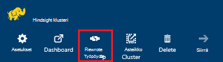
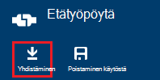
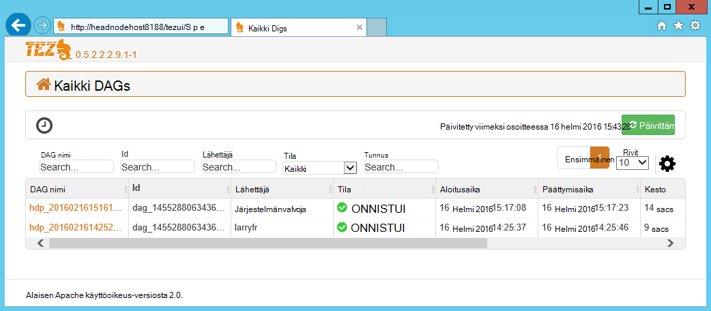
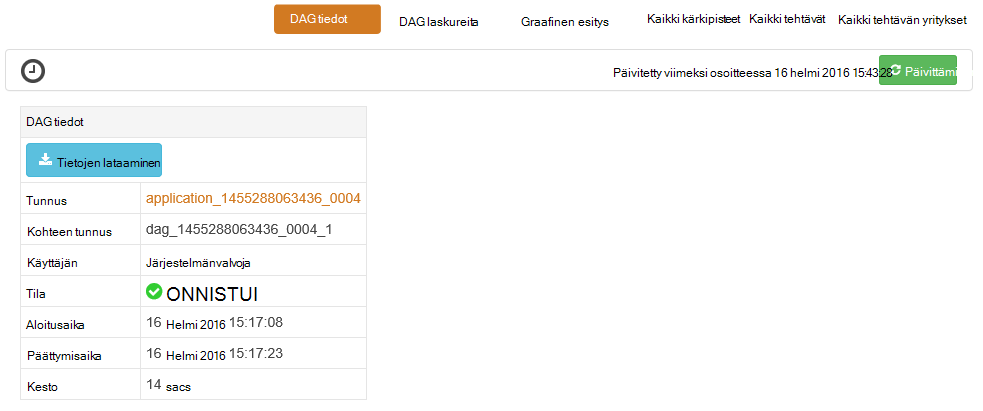
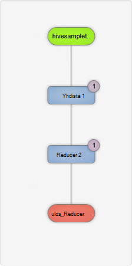
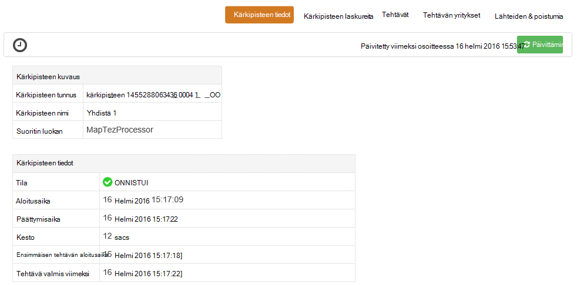
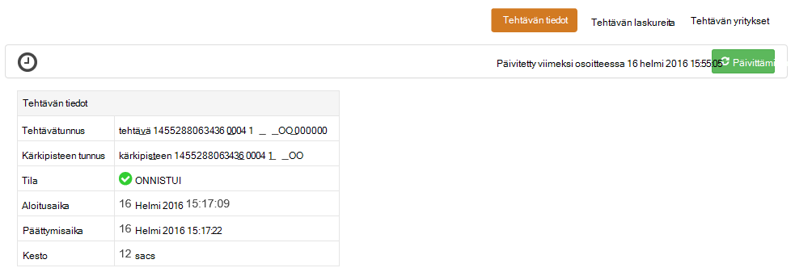

<properties
pageTitle="Tez Käyttöliittymän käyttäminen Windows-pohjaisesta HDInsight | Azure"
description="Opettele virheenkorjaus Tez työt Windows-pohjaisesta HDInsight HDInsight Tez-Käyttöliittymän avulla."
services="hdinsight"
documentationCenter=""
authors="Blackmist"
manager="jhubbard"
editor="cgronlun"/>

<tags
ms.service="hdinsight"
ms.devlang="na"
ms.topic="article"
ms.tgt_pltfrm="na"
ms.workload="big-data"
ms.date="10/04/2016"
ms.author="larryfr"/>

# Virheenkorjaus Tez työt Windows-pohjaisesta HDInsight Tez-Käyttöliittymän avulla

Tez-Käyttöliittymän on web-sivu, jonka avulla voidaan ymmärtää ja korjaaminen, joka käyttää Windows-pohjaisesta HDInsight klustereiden suorittamisen-ohjelma Tez työt. Tez-Käyttöliittymän voit työn yhdistetyn kohteiden kaaviona visualisoiminen, kunkin kohteen siirtyminen ja hakea Tilasto- ja lokiin kirjaaminen.

> [AZURE.NOTE] Windows-pohjaisesta HDInsight klustereiden on tämän asiakirjan tiedot. Lisätietoja tarkastelemista ja virheenkorjaus Tez Linux-pohjaiset HDInsight-artikkelissa [Käyttämällä Ambari eri näkymiä korjaamisessa Tez työt Hdinsightista](hdinsight-debug-ambari-tez-view.md).

## Edellytykset

* Windows-pohjaisesta HDInsight-klusterin. Ohjeita uuden klusterin luomisesta on kohdassa [käyttäminen Windows-pohjaisesta Hdinsightista](hdinsight-hadoop-tutorial-get-started-windows.md).

    > [AZURE.IMPORTANT] Tez-Käyttöliittymän on käytettävissä vain Windows-pohjaisesta HDInsight klustereiden luotu jälkeen 2016 helmikuu 8..

* Windows-pohjaisesta etätyöpöydän asiakas.

## Tietoja Tez

Tez on Hadoop, joka on suurempi kuin perinteisen MapReduce käsittely nopeuksia tietojen käsittely extensible raamit. Windows-pohjaisesta HDInsight klustereiden on valinnainen ohjelma, voit ottaa käyttöön rakenteen käyttämällä rakenteen kyselyn osana seuraava komento:

    set hive.execution.engine=tez;

Kun työ on lähetetty Tez, se luo ohjataan asykliset Graph (DAG), joka kuvaa toiminnoista, joita tarvitaan projektin suorittaminen järjestystä. Toiminnoista on kärkipisteet ja suorita osan yleinen työn. Kärkipisteen kuvaaman työn todelliset suorittamisen kutsutaan tehtävän ja voivat jaetaan useiden klusterin solmut.

### Tietoja Tez-Käyttöliittymä

Tez-Käyttöliittymän on web-sivulla on tietoja prosesseja, joissa on käytössä tai jos käytössäsi on suorittanut aiemmin käyttämällä Tez. Sen avulla voit tarkastella DAG luoma Tez, kuinka se jaetaan klustereiden, yksityiskohtaiset laskurit kuten käyttämän tehtävät ja kärkipisteet sekä virhetiedot. Se voi tarjota hyödyllisiä tietoja seuraavissa tilanteissa:

* Seuranta pitkään suoritettavien käsittelee kartan etenemisen tarkasteleminen ja vähentää tehtävät.

* Onnistuneiden tai epäonnistuneiden prosesseja kerrotaan, miten käsittely voidaan parantaa tai miksi sitä ei voitu Historiallisten tietojen analysoiminen.

## Luo DAG

Tez-Käyttöliittymän vain sisältää tietoja, jos työn, joka käyttää Tez-ohjelma on käynnissä, tai se on suorittanut menneisyydessä. Yksinkertainen rakenne kyselyt voi yleensä voi ratkaista käyttämättä Tez, mutta monimutkaisia kyselyjä, jotka Tee suodatus, ryhmittely, järjestys-liitokset jne edellyttävät yleensä Tez.

Seuraavien vaiheiden avulla voit suorittaa rakenteen kysely, joka suoritetaan Tez.

1. Siirry selaimella, https://CLUSTERNAME.azurehdinsight.net, missä __CLUSTERNAME__ HDInsight-klusterin nimen.

2. Valitse sivun ylälaidassa olevasta valikosta __Rakenne-editorin__. Tässä näkyvät sivun seuraavassa esimerkissä kyselyn kanssa.

        Select * from hivesampletable

    Kyselyn Esimerkki poistaa ja korvata sen seuraavasti.

        set hive.execution.engine=tez;
        select market, state, country from hivesampletable where deviceplatform='Android' group by market, country, state;

3. Valitse __Lähetä__ -painiketta. __Työn istunnon__ sivun alareunassa kohta näkyy kyselyn tila. Kun tilaksi muuttuu __Valmis__, valitse __Näytä tiedot__ linkki tulokset. __Työn tulosteen__ pitäisi näyttää seuraavankaltaiselta:
        
        en-GB   Hessen      Germany
        en-GB   Kingston    Jamaica
        en-GB   Nairobi Area    Kenya

## Käytä Tez-Käyttöliittymä

> [AZURE.NOTE] Tez-Käyttöliittymän on käytettävissä klusterin pään solmujen työpöydältä vain niin, että sinun on käytettävä etätyöpöydän pään solmujen yhdistäminen.

1. [Azure-portaaliin](https://portal.azure.com)ja valitse HDInsight-klusterin. Yläreunasta HDInsight-sivu Valitse __Etätyöpöytä__ -kuvake. Tässä näkyvät remote työpöydän sivu

    

2. Valitse __Yhdistä__ muodostaa yhteyttä klusterin pään solmu Etätyöpöytä-sivu. Pyydettäessä käyttää tarkistamiseen yhteyttä klusterin etätyöpöydän käyttäjänimi ja salasana.

    

    > [AZURE.NOTE] Jos et ole ottanut etätyöpöydän yhteyden, Anna käyttäjänimi, salasana ja erääntymispäivä ja valitse sitten etätyöpöytä käyttöön __ottaminen käyttöön__ . Kun se on otettu käyttöön, käytä muodostaa edelliset vaiheet.

3. Kun yhteys on muodostettu, Avaa Internet Explorer-etätyöpöydän kautta, valitse selaimen oikeassa yläkulmassa olevaa hammaspyöräkuvaketta ja valitse sitten __Näytä yhteensopivuusasetuksia__.

4. __Näytä yhteensopivuusasetusten__alareunasta Poista __Yhteensopivuus-näkymässä Näytä intranet-sivustojen__ ja __Käytä Microsoftin yhteensopivuuden luettelot__-valintaruudun valinta ja valitse sitten __Sulje__.

5. Internet Explorerissa siirry http://headnodehost:8188/tezui / #/. Tässä näkyvät Tez-Käyttöliittymä

    

    Tez-Käyttöliittymän latautuessa näet luettelon DAGs, jotka ovat parhaillaan käynnissä tai on suorittanut klusterin. Oletusnäkymässä Dag nimi, tunnus, lähettäjän, tila, alkamisaika, päättymisaika, kesto, Sovellustunnus ja jonossa. Lisää sarakkeita voidaan lisätä käyttämällä hammaspyöräkuvaketta oikean sivun.

    Jos sinulla on vain yksi merkintä, se on kysely, joka suoritit edellisessä osassa. Jos sinulla on useita kohtia, voit hakea hakuehtojen yläpuolella DAGs olevissa kentissä sitten __Enter__-näppäintä.

4. Valitse uusin DAG merkintä __Dag nimi__ . Tietoja siitä, DAG ja mahdollisuus ladata zip JSON-tiedostoista, jotka sisältävät tietoja DAG tulevat näkyviin.

    

5. Yllä __DAG tiedot__ ovat useita linkkejä, joita voi käyttää tietoja DAG näytettävä.

    * __DAG laskureita__ näyttää tämän DAG laskureita.
    
    * __Graafinen esitys__ näyttää tämän DAG graafinen esitys.
    
    * __Kaikki kärkipisteitä__ näyttää kärkipisteet luettelo tämän DAG.
    
    * __Kaikki tehtävät__ näkyvät kaikki kärkipisteitä Tehtävät luettelo tämän DAG.
    
    * __Kaikki TaskAttempts__ näyttöön tulee tämä DAG tehtävien suorittamiseen yritykset tietoja.
    
    > [AZURE.NOTE] Jos siirryt kärkipisteitä, tehtäviä ja TaskAttempts sarakkeen-näyttö, Huomaa, että on linkkejä, voit tarkastella __laskureita__ ja __tarkastella tai ladata lokit__ kullekin riville.

    Jos virhe työhön, DAG-tiedot näkyvät epäonnistui, tila sekä linkkejä epäonnistui tehtävän tiedot. Diagnostiikan tiedot näkyvät alapuolella DAG tiedot.

7. Valitse __Graafinen esitys__. Graafinen kuvaus DAG näkyviin. Voit siirtämällä hiiren osoittimen kunkin kärkipiste näyttää sen tiedot-näkymässä.

    

8. Kärkipisteen valitsemalla Lataa kohteen __Kärkipiste tiedot__ . Valitse __Yhdistä 1__ kärkipiste tämän kohteen yksityiskohtaiset tiedot näkyviin. Valitse __Vahvista__ Vahvista siirtymisrakenteen.

    

9. Huomaa, että sinulla on nyt sivun yläreunassa linkkejä, jotka liittyvät kärkipisteitä ja tehtäviä.

    > [AZURE.NOTE] Tällä sivulla voit myös vuoroon palaaminen __DAG tiedot__, valitsemalla __Kärkipiste tiedot__ja valitsemalla __Yhdistä 1__ kärkipiste.

    * __Kärkipisteen laskureita__ näyttää tämän kärkipiste laskuri.
    
    * __Tehtävät__ näkyvät tässä kärkipiste tehtävät.
    
    * __Tehtävän yrittää__ näyttää tietoja yritetään suorittaa tämän kärkipiste tehtävät.
    
    * __Tietolähteiden ja poistumia__ näyttää tietolähteet ja täyttyvät, tämä kärkipiste.

    > [AZURE.NOTE] Kuin edellinen-pikavalikon avulla voit vierittää tehtäviä, tehtävän yritykset ja lähteiden ja Sinks__, näyttävän linkit lisätietoihin kunkin kohteen sarakkeen näyttöasetukset.

10. Valitse __tehtävät__ja valitse sitten kohde nimeltä __00_000000__. __Tehtävän tiedot__ tulevat näkyviin tämän tehtävän. Voit tarkastella __Tehtävän laskureita__ ja __Tehtävän yritykset__-näytössä.

    

## Seuraavat vaiheet

Nyt oppinut voit Tez-näkymän käyttämisestä, katso lisätietoja [Käyttämällä rakenne-Hdinsightista](hdinsight-use-hive.md).

Katso Tarkempia teknisiä tietoja Tez, [Hortonworks Tez-sivulle](http://hortonworks.com/hadoop/tez/).
