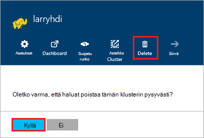

<properties
pageTitle="Poistamisesta HDInsight-klusterin | Azure"
description="Tietoja voi poistaa HDInsight-klusterin eri tavoin."
services="hdinsight"
documentationCenter=""
authors="Blackmist"
manager="jhubbard"
editor="cgronlun"/>

<tags
ms.service="hdinsight"
ms.devlang="na"
ms.topic="article"
ms.tgt_pltfrm="na"
ms.workload="big-data"
ms.date="10/28/2016"
ms.author="larryfr"/>

#HDInsight-klusterin poistaminen

HDInsight-klusterin Laskutus alkaa, kun klusterin luodaan ja pysähtyy klusterin poistetaan, ja se on jaettu minuutissa, joten kannattaa poistaa yhteyttä klusterin aina, kun se ei ole enää käytössä. Tässä asiakirjassa kerrotaan Azure-portaalissa, PowerShellin Azure ja Azure-CLI klusterin poistamisesta.

> [AZURE.IMPORTANT] HDInsight-klusterin poistaminen ei poista klusterin liittyvän Azuren tallennustilaan tilit. Näin voit säilyttää ja klusterin tallentamat tiedot uudelleen.

##Azure Portal

1. Kirjautuminen [Azure portal](https://portal.azure.com) ja valitse HDInsight-klusterin. Jos HDInsight-klusterin ei ole kiinnitetty koontinäyttö, voit etsiä sitä käyttäminen hakukentän (suurennuslasikuvakkeen) nimeltä siirtymispalkin oikeassa reunassa.

    

2. Kun sivu avautuu klusterin, valitse __Poista__ -kuvaketta. Kun sinulta kysytään, valitse __Kyllä__ Poista klusterin.

    

##Azure PowerShell

Käytä seuraava komento PowerShell-kehotteessa klusterin poistaminen:

    Remove-AzureRmHDInsightCluster -ClusterName CLUSTERNAME

Korvaa __CLUSTERNAME__ HDInsight-klusterin nimen.

##Azure CLI

Käytä seuraava kehote, poista klusterin:

    azure hdinsight cluster delete CLUSTERNAME
    
Korvaa __CLUSTERNAME__ HDInsight-klusterin nimen.
